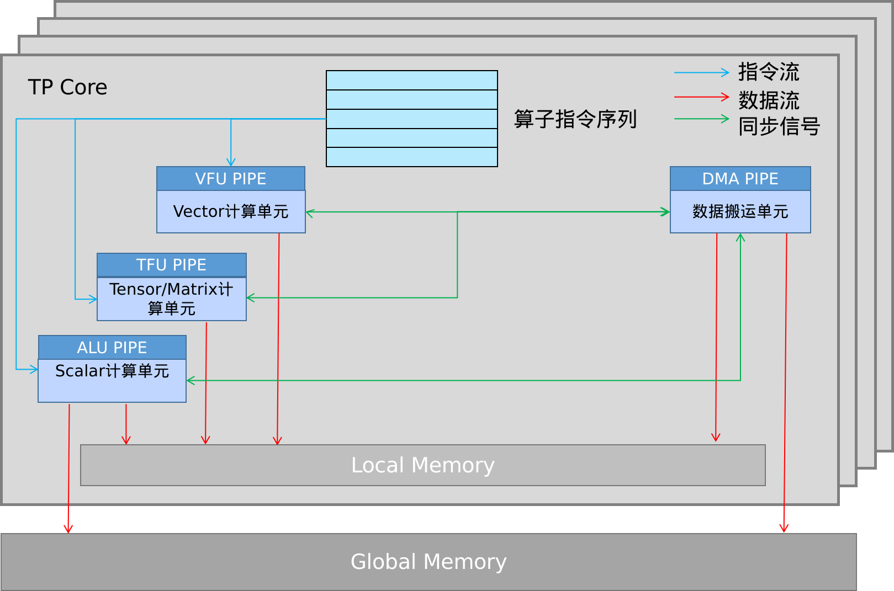
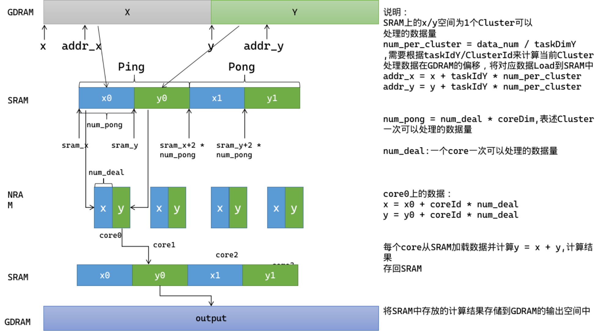
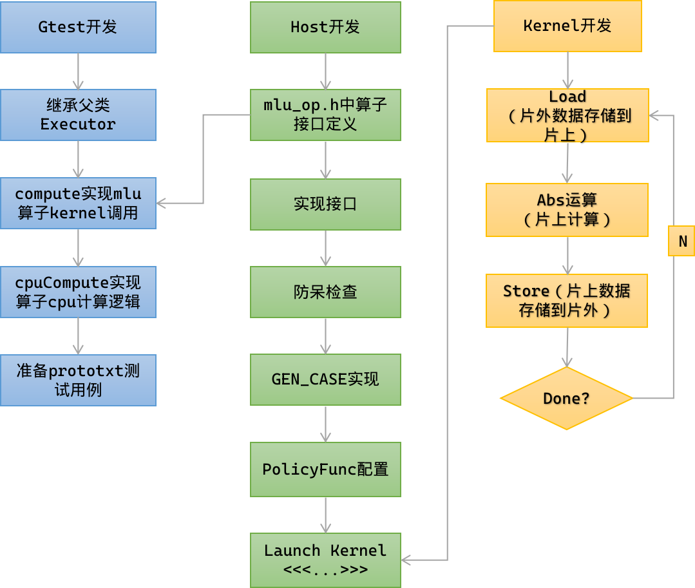
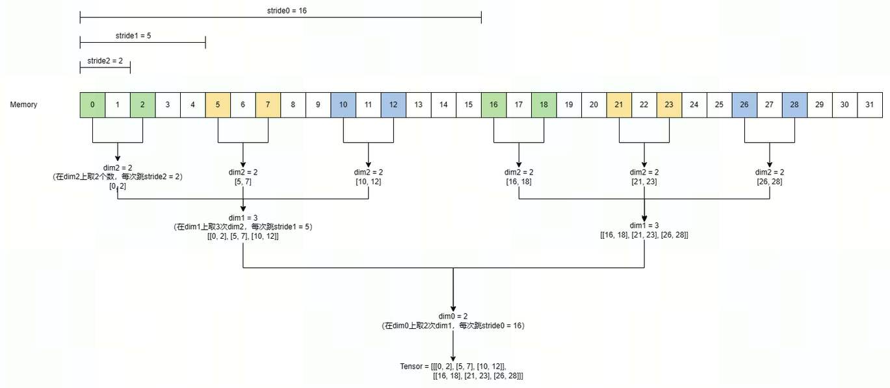
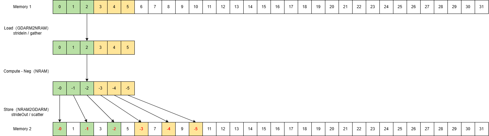

# BANG C算子开发
- [1. BANG C简介](#1-简介)

- [2. 环境准备](#2-环境准备)
  - [2.1 驱动安装](#21-驱动安装)
  - [2.2 CNToolkit安装](#22-cntoolkit安装)

- [3. 算子开发（基础篇）](#3-算子开发基础篇)
  - [3.1 使用说明](#31-使用说明)
  - [3.2 快速入门](#32-快速入门)
    - [3.2.1 算子分析](#321-算子分析)
    - [3.2.2 核函数开发](#322-核函数开发)
    - [3.2.3 Host代码开发](#323-host代码开发)
    - [3.2.4 完整代码](#324-完整代码)
  - [3.3 基本概念](#33-基本概念)
    - [3.3.1 抽象硬件模型](#331-抽象硬件模型)
    - [3.3.2 抽象存储模型](#332-抽象存储模型)
    - [3.3.3 MLU Core 内部并行指令流水和计算架构抽象](#333-mlu-core-内部并行指令流水和计算架构抽象)
    - [3.3.4 并发](#334-并发)
      - [3.3.4.1 MLU Cluster 的多 Task 并发](#3341-mlu-cluster-的多-task-并发)
      - [3.3.4.2 Host 和 Device 的并发](#3342-host-和-device-的并发)
    - [3.3.5 同步](#335-同步)
      - [3.3.5.1 MLU Core 内多指令流水线同步](#3351-mlu-core-内多指令流水线同步)
      - [3.3.5.2 MLU Cluster 的同步](#3352-mlu-cluster-的同步)
      - [3.3.5.3 Host 和 Device 的同步](#3353-host-和-device-的同步)
    - [3.3.6 编程模型](#336-编程模型)
      - [3.3.6.1 核函数](#3361-核函数)
      - [3.3.6.2 任务规模](#3362-任务规模)
      - [3.3.6.3 任务类型](#3363-任务类型)

- [4. 算子开发（进阶篇）](#4-算子开发进阶篇)
- [4.1 使用说明](#41-使用说明)
- [4.2 算子优化初探](#42-算子优化初探)
- [4.3 快速上手端到端算子开发](#43-快速上手端到端算子开发)
  - [4.3.1 概述](#431-概述)
  - [4.3.2 依赖环境准备](#432-依赖环境准备)
  - [4.3.3 MLU-OPS™ 目录文件结构](#433-mlu-ops™-目录文件结构)
  - [4.3.4 算子设计文档说明](#434-算子设计文档说明)
  - [4.3.5 算子实现说明](#435-算子实现说明)
  - [4.3.6 算子测试实现说明](#436-算子测试实现说明)
- [4.4 算子模板](#44-算子模板)
- [4.5 算子实现](#45-算子实现)
- [4.6 算子编译](#46-算子编译)
- [4.7 算子测试](#47-算子测试)

- [5. 算子开发高级篇](#5-算子开发高级篇)
- [5.1 workspace内存管理](#51-workspace-内存管理)
  - [5.1.1 功能介绍](#511-功能介绍)
  - [5.1.2 使用方法](#512-使用方法)
- [5.2 融合拼接算子](#52-融合拼接算子)
- [5.3 性能优化](#53-性能优化)
  - [5.3.1 核间负载均衡](#531-核间负载均衡)
  - [5.3.2 核内负载均衡](#532-核内负载均衡)
  - [5.3.3 访存细节](#533-访存细节)
  - [5.3.4 指令细节](#534-指令细节)
  - [5.3.5 基于CNPerf的数据进行代码优化](#535-基于-cnperf-的数据进行代码优化)
- [5.4 stride特性](#54-stride-特性)
  - [5.4.1 框架视角的stride特性](#541-框架视角的-stride-特性)
  - [5.4.2 算子视角的stride特性](#542-算子视角的-stride-特性)

## 1. 简介

BANG C 语言是寒武纪针对 MLU 硬件提出的编程语言。

- 提供高效的编程接口，充分发挥寒武纪硬件特性
- 提供一种通用的异构编程方式，方便用户拓展自己的应用程序
- 为用户提供一套完善的、可持续兼容的高层开发语言，实现性能优化
- 支持单核或多核的、并行的编程模型

具体指令使用介绍见[寒武纪官网开发者社区](https://developer.cambricon.com/index/document/index/classid/3.html)，算子开发章节[CAMBRICON BANG C 开发者手册](https://www.cambricon.com/docs/sdk_1.15.0/cntoolkit_3.7.2/cambricon_bang_c_4.7.2/index.html)。

## 2. 环境准备

说明：运行环境需带寒武纪 MLU 处理器。

### 2.1 驱动安装

寒武纪发布的驱动安装包有两种：deb 包和 rpm 包。寒武纪驱动安装包使用 dkms 框架来管理驱动的安装、升级和卸载。dkms 可以针对系统内安装的每个内核版本，通过编译、安装相应的内核模块来实现驱动的加载。用户只需安装、更新相应的 dkms 软件包（deb 包或 rpm 包）即可实现驱动的安装和升级。目前驱动已经支持主流 Linux 发行版系统（CentOS/Ubuntu/Debian/Kylin/UOS/Rocky Linux/OpenEuler/Anolis/CTyunOS/BCLinux/Linx）。

驱动固件的具体安装步骤可参见《[寒武纪驱动安装包使用手册](https://www.cambricon.com/docs/sdk_1.15.0/driver_5.10.22/user_guide/index.html)》。

### 2.2 CNToolkit安装

CNToolkit 是寒武纪 SDK 中的主要组件，为用户提供基于 Cambricon BANG 异构计算平台的编译、调试、分析、运行的工具集。CNToolkit 安装包内提供了各个组件的示例代码和用户手册。主要包括：

- 编译类组件：CNCC、CNAS、LLVM-MM
- 工具类组件：CNGDB、CNPerf、CNStudio、CNVS
- 依赖库组件：CNBIN、CNDEV、CNDRV、CNRT、CNCodec、CNCodec3、CNRTC、CNPAPI、CNPX

CNToolkit 软件包安装步骤与介绍可参见 《[寒武纪CNToolkit安装升级使用手册](https://www.cambricon.com/docs/sdk_1.15.0/cntoolkit_3.7.2/cntoolkit_install_3.7.2/index.html)》。

Driver/CNToolKit 为必装依赖项，对于其它组件，用户可根据框架或安装包的依赖需求，自行选择匹配的组件库进行安装。可在[SDK下载](https://sdk.cambricon.com/download?sdk_version=V1.15.0&component_name=Neuware+SDK)界面下载对应的版本安装，本章节不再单独介绍。


## 3. 算子开发（基础篇）

### 3.1 使用说明

算子(Operator，简称 OP)是人工智能算法的基本函数计算单元。在网络模型中，算子对应网络层中的计算逻辑。

对于初次接触 BANG-C 的开发者，从本章节开始，我们以 Add 算子为例，介绍算子开发的基本步骤，主要包括算子分析、Kernel 代码开发、Host 代码开发、编译、测试和优化。同时引入 BANG-C 抽象硬件模型，BANGC-C 抽象存储模型，BANG-C 编程模型，BANG-C 并发与同步，带你深入了解基于 MLU 硬件的 BANG-C 算子开发。

### 3.2 快速入门

在正式的开发之前，需要先按照[环境准备章节](#2-环境准备)所述完成环境准备工作。

#### 3.2.1 算子分析

首先需要确定算子的功能、输入/输出和逻辑表达，其中重点分析算子原理，提取出算子的数学表达式，再查询需要调用的[BANG C指令](https://www.cambricon.com/docs/sdk_1.15.0/cntoolkit_3.7.2/cambricon_bang_c_4.7.2/index.html)，确认指令介绍能否满足算子实现的要求。若无法满足算子实现的要求，可考虑对数学表达式变形或用多条指令拼凑出需要的指令功能来实现算子功能。

1. 确认算子的数学表达式和计算逻辑

   Add 算子的数学表达式为：

   ```c++
   output = a + b
   ```

   计算逻辑：即对输入的两个 tensor 逐元素相加，输出相加后的 tensor。

2. 确认输入输出相关参数

   - 输入输出 tensor：tensor a，tensor b，tensor output。
   - 输入输出 layout：本样例中以 ARRAY 为例进行开发，表示支持任意数据摆放方式。
   - 输入输出 shape：本样例中以 shape（32，2048）为例，输出 shape 与输入 shape 相同。

3. 确认算子实现所需接口

   - 数据搬运接口

     从 cpu ddr 内存搬运到 gdram 内存，查阅[CNRT手册](https://www.cambricon.com/docs/sdk_1.15.0/cntoolkit_3.7.2/cnrt_6.7.0/index.html)，确认调用接口：[cnrtMemcpy](https://www.cambricon.com/docs/sdk_1.15.0/cntoolkit_3.7.2/cnrt_6.7.0/h2rst_generated/memory_management.html#cnrtmemcpy)

     从 gdram 内存搬运到 nram 内存，查阅[BANG C手册](https://www.cambricon.com/docs/sdk_1.15.0/cntoolkit_3.7.2/cambricon_bang_c_4.7.2/index.html)，确认调用接口：[__memcpy](https://www.cambricon.com/docs/sdk_1.15.0/cntoolkit_3.7.2/cambricon_bang_c_4.7.2/2Builtin-Functions/1D%20Memcpy%20Functions.html#memcpy)

     关于 nram，gdram 介绍可参考[3.3.2 抽象存储模型](#332-抽象存储模型)。

   - 计算接口：初步分析可使用[__bang_add](https://www.cambricon.com/docs/sdk_1.15.0/cntoolkit_3.7.2/cambricon_bang_c_4.7.2/2Builtin-Functions/Vector%20Operation%20Functions.html#bang-add)实现。

   - 内存管理接口：使用[cnrtMalloc](https://www.cambricon.com/docs/sdk_1.15.0/cntoolkit_3.7.2/cnrt_6.7.0/h2rst_generated/memory_management.html#cnrtmalloc)、[cnrtFree](https://www.cambricon.com/docs/sdk_1.15.0/cntoolkit_3.7.2/cnrt_6.7.0/h2rst_generated/memory_management.html#cnrtfree)进行申请和释放。

   - Kernel 耗时统计接口：会使用[通信管理接口](https://www.cambricon.com/docs/sdk_1.15.0/cntoolkit_3.7.2/cnrt_6.7.0/h2rst_generated/notifier_management.html)，[cnrtNotifierCreate](https://www.cambricon.com/docs/sdk_1.15.0/cntoolkit_3.7.2/cnrt_6.7.0/h2rst_generated/queue_management.html#)，[cnrtPlaceNotifier](https://www.cambricon.com/docs/sdk_1.15.0/cntoolkit_3.7.2/cnrt_6.7.0/h2rst_generated/queue_management.html#)，[cnrtNotifierDuration](https://www.cambricon.com/docs/sdk_1.15.0/cntoolkit_3.7.2/cnrt_6.7.0/h2rst_generated/queue_management.html#)等接口。

   - 并行流水任务之间使用 Queue 队列完成通信和同步，会使用到[队列管理接口](https://www.cambricon.com/docs/sdk_1.15.0/cntoolkit_3.7.2/cnrt_6.7.0/h2rst_generated/queue_management.html#), 如[cnrtCreateQueue](https://www.cambricon.com/docs/sdk_1.15.0/cntoolkit_3.7.2/cnrt_6.7.0/h2rst_generated/queue_management.html#cnrtqueuecreate)、[cnrtQueueSync](https://www.cambricon.com/docs/sdk_1.15.0/cntoolkit_3.7.2/cnrt_6.7.0/h2rst_generated/queue_management.html#cnrtqueuesync)、[cnrtQueueDestroy](https://www.cambricon.com/docs/sdk_1.15.0/cntoolkit_3.7.2/cnrt_6.7.0/h2rst_generated/queue_management.html#cnrtqueuedestroy)等接口。


#### 3.2.2 核函数开发

完成环境准备和初步的算子分析后，即可开始 BANG C 核函数的开发。开发之前请先获取样例代码目录，参见 CNToolkit 安装路径：

```bash
samples/BANG/3_Performance/vectoradd
```

示例代码的编译命令如下：

```bash
your_sample_path/BANG$ ./build.sh --mlu370
```

或：

```bash
cncc vectorAdd_single_core.mlu -o test -I${NEUWARE_HOME}/include/ -lcndrv  -lcnrt -lcndev --bang-mlu-arch=mtp_372 -std=c++11
```

编译之前需预先安装 CNToolkit 并正确配置编译器及库的路径；编译过程结束后，各示例代码对应的可执行文件位于 `your_sample_path/BANG/build/test` 目录下，这里 NEUWARE_HOME 为 CNToolkit 安装目录。

以下样例代码在`samples/BANG/3_Performance/vectoradd/4_vectorAdd_multicore/vectorAdd_multicore.mlu`中实现。

1. 首先根据[核函数定义](https://www.cambricon.com/docs/sdk_1.15.0/cntoolkit_3.7.2/programming_guide_1.7.0/programming_model/index.html#kernel)中介绍的规则进行核函数的定义

   ```c++
   __mlu_global__ void kernel(const float *a,
                              const float *b, 
                              int32_t data_num，
                              float *output)
   ```
   使用__mlu_global__函数类型限定符来标识它是一个核函数，可以被<<<...>>>调用；标识该核函数在设备端上执行。

2. 确定使用的NRAM空间大小

   ```c++
   __nram__ uint8_t nram_buffer[MAX_NRAM_SIZE];
   ```

   使用__nram__修饰符表⽰被修饰的变量位于[NRAM](https://www.cambricon.com/docs/sdk_1.15.0/cntoolkit_3.7.2/programming_guide_1.7.0/hardware_implementation/index.html#nram) 地址空间。

3. 确定每个 MLU Core 要处理的数据大小及数据地址，关于 taskId，taskDim 的介绍参考下述[3.3.6.2 任务规模章节](#3362-任务规模)

   ```c++
   int32_t data_per_core = data_num / taskDim;
   int32_t data_last_core = data_per_core + data_num % taskDim;
   const float *a_offset = a + taskId * data_per_core;
   const float *b_offset = b + taskId * data_per_core;
   float *output_offset = output + taskId * data_per_core;
   if (taskId == taskDim - 1) {
   	data_per_core = data_last_core;
   }
   ```

4. 根据数据大小及计算公式，对 nram 进行拆分，并确定片上数据循环处理的整数段和余数段

   ```c++
   int32_t align_num = NFU_ALIGN_SIZE / sizeof(float);
   // nram空间拆分为2块，一份存放输入x，一份存放输入y，单次处理的数据按照128byte对齐
   int32_t data_nram_num = MAX_NRAM_SIZE / sizeof(float) / 2 / align_num * align_num;
   float *a_nram = (float *)nram_buffer;
   float *b_nram = (float *)a_nram + data_nram_num;
   int32_t loop_num = data_per_core / data_nram_num;
   int32_t rem_nram_num = data_per_core % data_nram_num;
   ```

5. 整数段循环处理

   ```c++
   for (int32_t i = 0; i < loop_num; i++) {
       // Load data from GDRAM2NRAM
       __memcpy(a_nram, a_offset + i * data_nram_num, data_nram_num * sizeof(float), GDRAM2NRAM);
       __memcpy(b_nram, b_offset + i * data_nram_num, data_nram_num * sizeof(float), GDRAM2NRAM);
       // Compute
       __bang_add(a_nram, a_nram, b_nram, data_nram_num);
       // Store data from NRAM2GDRAM
       __memcpy(output_offset + i * data_nram_num, a_nram, data_nram_num * sizeof(float), NRAM2GDRAM);
   }
   ```
  `bang_add`输入输出可复用空间，具体见[bang_add指令介绍](https://www.cambricon.com/docs/sdk_1.15.0/cntoolkit_3.7.2/cambricon_bang_c_4.7.2/2Builtin-Functions/Vector%20Operation%20Functions.html#bang-add)。

6. 余数段处理

   ```c++
   if (rem_nram_num != 0) {
       int32_t rem_align_num =
         (rem_nram_num + align_num - 1) / align_num * align_num;
       // Load data from GDRAM2NRAM
       __memcpy(a_nram, a_offset + loop_num * data_nram_num, rem_nram_num * sizeof(float), GDRAM2NRAM);
       __memcpy(b_nram, b_offset + loop_num * data_nram_num, rem_nram_num * sizeof(float), GDRAM2NRAM);
       // Compute
       __bang_add(a_nram, a_nram, b_nram, rem_align_num);
       // Store data from NRAM2GDRAM
       __memcpy(output_offset + loop_num * data_nram_num, a_nram, rem_nram_num * sizeof(float), NRAM2GDRAM);
   }
   ```

#### 3.2.3 Host代码开发

1. 创建任务[队列](https://www.cambricon.com/docs/sdk_1.15.0/cntoolkit_3.7.2/programming_guide_1.7.0/programming_interface/runtime/runtime.html#queue)

   ```c++
   cnrtQueue_t queue;
   CNRT_CHECK(cnrtQueueCreate(&queue));
   ```

2. 创建[Notifier](https://www.cambricon.com/docs/sdk_1.15.0/cntoolkit_3.7.2/programming_guide_1.7.0/programming_interface/runtime/runtime.html#notifier)

   ```c++
   cnrtNotifier_t notifier_start, notifier_end;
   CNRT_CHECK(cnrtNotifierCreate(&notifier_start));
   CNRT_CHECK(cnrtNotifierCreate(&notifier_end));
   ```

3. 指定[任务规模](https://www.cambricon.com/docs/sdk_1.15.0/cntoolkit_3.7.2/programming_guide_1.7.0/programming_model/index.html#taskdimension)

   ```c++
   cnrtDim3_t dim;
   cnrtFunctionType_t func_type;
   get_policy_function_block(&dim, &func_type);
   ```

4. Device 内存申请

   ```c++
   float* src1_mlu = NULL;
   float* src2_mlu = NULL;
   float* dst_mlu = NULL;
   CNRT_CHECK(cnrtMalloc((void **)&src1_mlu, ELEM_NUM * sizeof(float)));
   CNRT_CHECK(cnrtMalloc((void **)&src2_mlu, ELEM_NUM * sizeof(float)));
   CNRT_CHECK(cnrtMalloc((void **)&dst_mlu, ELEM_NUM * sizeof(float)));
   ```

5. 将 Host 数据[拷贝](https://www.cambricon.com/docs/sdk_1.15.0/cntoolkit_3.7.2/programming_guide_1.7.0/programming_interface/runtime/runtime.html#id9)到 Device 端

   ```c++
   CNRT_CHECK(cnrtMemcpy(src1_mlu, src1_cpu, ELEM_NUM * sizeof(float), cnrtMemcpyHostToDev));
   CNRT_CHECK(cnrtMemcpy(src2_mlu, src2_cpu, ELEM_NUM * sizeof(float), cnrtMemcpyHostToDev));
   ```

6. 统计 Kernel 执行时间并 Launch Kernel

   ```c++
   CNRT_CHECK(cnrtPlaceNotifier(notifier_start, queue));
   kernel<<<dim, func_type, queue>>>(dst_mlu, src1_mlu, src2_mlu, ELEM_NUM);
   CNRT_CHECK(cnrtPlaceNotifier(notifier_end, queue));
   ```

7. 同步等待 Kernel 计算完成后，将 Device 内存拷贝到 Host

   ```c++
   CNRT_CHECK(cnrtPlaceNotifier(notifier_end, queue));
   CNRT_CHECK(cnrtQueueSync(queue));
   CNRT_CHECK(cnrtMemcpy(dst_cpu, dst_mlu, ELEM_NUM * sizeof(float), cnrtMemcpyDevToHost));
   ```

8. 打印计算时间，销毁任务队列，并释放申请的内存

   ```c++
   float latency = 0.0;
   CNRT_CHECK(cnrtNotifierDuration(notifier_start, notifier_end, &latency));
   CNRT_CHECK(cnrtFree(src1_mlu));
   CNRT_CHECK(cnrtFree(src2_mlu));
   CNRT_CHECK(cnrtFree(dst_mlu));
   CNRT_CHECK(cnrtQueueDestroy(queue));
   ```

9. 并比较 mlu 和 cpu 的计算结果一致性，并统计 Kernel 计算效率和 IO 效率

   ```c++
   float diff = 0.0;
   float baseline = 2.0; // 1.0f + 1.0f = 2.0f
   for (int32_t i = 0; i < ELEM_NUM; ++i) {
   diff += fabs(dst_cpu[i] - baseline);
   }
   double theory_io = ELEM_NUM * sizeof(float) * 3.0; // read a and b and write output, Bytes
   double theory_ops = ELEM_NUM; // ops
   double peak_compute_force = get_peak_compute_force(); // gflops
   double io_bandwidth = get_io_bandwidth(); // GB/s
   double io_efficiency = theory_io / (latency * 1000) / io_bandwidth;
   double compute_efficiency = theory_ops / (latency * 1000) / peak_compute_force;
   printf("[MLU Hardware Time ]: %.3f us\n", latency);
   printf("[MLU IO Efficiency ]: %f\n", io_efficiency);
   printf("[MLU Compute Efficiency]: %f\n", compute_efficiency);
   printf("[MLU Diff Rate ]: %f\n", diff);
   printf(diff == 0 ? "PASSED\n" : "FAILED\n");
   ```

#### 3.2.4 完整代码

`vectoradd_common.h`

```c++
/*************************************************************************
 * Copyright (C) [2020] by Cambricon, Inc.
 *
 * Permission is hereby granted, free of charge, to any person obtaining a
 * copy of this software and associated documentation files (the
 * "Software"), to deal in the Software without restriction, including
 * without limitation the rights to use, copy, modify, merge, publish,
 * distribute, sublicense, and/or sell copies of the Software, and to
 * permit persons to whom the Software is furnished to do so, subject to
 * the following conditions:
 *
 * The above copyright notice and this permission notice shall be included
 * in all copies or substantial portions of the Software.
 *
 * THE SOFTWARE IS PROVIDED "AS IS", WITHOUT WARRANTY OF ANY KIND, EXPRESS
 * OR IMPLIED, INCLUDING BUT NOT LIMITED TO THE WARRANTIES OF
 * MERCHANTABILITY, FITNESS FOR A PARTICULAR PURPOSE AND NONINFRINGEMENT.
 * IN NO EVENT SHALL THE AUTHORS OR COPYRIGHT HOLDERS BE LIABLE FOR ANY
 * CLAIM, DAMAGES OR OTHER LIABILITY, WHETHER IN AN ACTION OF CONTRACT,
 * TORT OR OTHERWISE, ARISING FROM, OUT OF OR IN CONNECTION WITH THE
 * SOFTWARE OR THE USE OR OTHER DEALINGS IN THE SOFTWARE.
 *************************************************************************/
#ifndef _VECTORADD_COMMON_H_
#define _VECTORADD_COMMON_H_

#include <cn_api.h>
#include <cndev.h>

#define ELEM_NUM (10 * 1000 * 1000)
#define NFU_ALIGN_SIZE 128

#if (__BANG_ARCH__ == 372)
#define MAX_NRAM_SIZE 655360
#define MAX_SRAM_SIZE 4063232
#else // mtp_592
#define MAX_NRAM_SIZE 327680
#define MAX_SRAM_SIZE 1966080
#endif

#define CNDRV_CHECK(val)                                                       \
  do {                                                                         \
    CNresult ret = val;                                                        \
    if (ret) {                                                                 \
      const char *error_string;                                                \
      cnGetErrorString(ret, &error_string);                                    \
      printf("[%s:%d] CNDRV error, code=%u(%s) \"%s\" \n", __FILE__, __LINE__, \
             (unsigned int)ret, error_string, #val);                           \
      exit(-1);                                                                \
    }                                                                          \
  } while(0)

#define CNDEV_CHECK(val)                                                       \
  do {                                                                         \
    cndevRet_t ret = val;                                                      \
    if (ret) {                                                                 \
      printf("[%s:%d] CNDEV error, code=%u(%s) \"%s\" \n", __FILE__, __LINE__, \
             (unsigned int)ret, cndevGetErrorString(ret), #val);               \
      exit(-1);                                                                \
    }                                                                          \
  } while(0)

int32_t get_core_num_per_cluster() {
  CNdev mlu_dev;
  CNDRV_CHECK(cnCtxGetDevice(&mlu_dev));
  int32_t core_num_per_cluster = -1;
  CNDRV_CHECK(
    cnDeviceGetAttribute(&core_num_per_cluster,
                         CN_DEVICE_ATTRIBUTE_MAX_CORE_COUNT_PER_CLUSTER,
                         mlu_dev));
  return core_num_per_cluster;
}

int32_t get_cluster_num() {
  CNcontext drv_ctx;
  CNctxConfigParam ctx_conf_param;
  CNDRV_CHECK(cnCtxGetCurrent(&drv_ctx));
  CNDRV_CHECK(cnGetCtxConfigParam(drv_ctx,
                                  CN_CTX_CONFIG_VISIBLE_CLUSTER_NUM,
                                  &ctx_conf_param));
  return (int32_t)ctx_conf_param.visibleClusterNumber;
}

// get peak compute force, gflops
double get_peak_compute_force() {
  int card = -1;
  int ipu_frequency = -1;
  CNRT_CHECK(cnrtGetDevice(&card));
  CNDEV_CHECK(cndevInit(0));
  CNDRV_CHECK(cnDeviceGetAttribute(&ipu_frequency,
                                   CN_DEVICE_ATTRIBUTE_CLUSTER_CLOCK_RATE,
                                   card));
  cndevDeviceMaxPerformance_t max_performance;
  max_performance.version = CNDEV_VERSION_5;
  cndevGetDeviceMaxPerformance(&max_performance, card);

  // only addition, not including multiplication
  uint64_t peak_compute_force_f32_add = max_performance.fp32Vector / 2;
  return peak_compute_force_f32_add * get_cluster_num() *
           get_core_num_per_cluster() * (double)ipu_frequency / 1000 / 1000;
}

// get io bandwidth, GB/s
double get_io_bandwidth() {
  int card = -1;
  CNRT_CHECK(cnrtGetDevice(&card));
  CNDEV_CHECK(cndevInit(0));
  cndevDDRInfo_t ddrinfo;
  ddrinfo.version = CNDEV_VERSION_5;
  CNDEV_CHECK(cndevGetDDRInfo(&ddrinfo, card));
  double band_width = ddrinfo.bandWidth;
  double band_width_decimal = ddrinfo.bandWidthDecimal;
  do {
    band_width_decimal /= 10;
  } while (band_width_decimal > 1);

  double result = band_width + band_width_decimal;
  return result;
}

void get_policy_function_block(cnrtDim3_t *dim, cnrtFunctionType_t *func_type) {
  *func_type = CNRT_FUNC_TYPE_BLOCK;
  dim->x = 1;
  dim->y = 1;
  dim->z = 1;
  return;
}

void get_policy_function_union1(cnrtDim3_t *dim, cnrtFunctionType_t *func_type) {
  *func_type = CNRT_FUNC_TYPE_UNION1;
  dim->x = get_core_num_per_cluster();
  dim->y = get_cluster_num();
  dim->z = 1;
  return;
}

#endif // _VECTORADD_COMMON_H_
```

`Kernel.mlu`：

```c++
/*************************************************************************
 * Copyright (C) [2020] by Cambricon, Inc.
 *
 * Permission is hereby granted, free of charge, to any person obtaining a
 * copy of this software and associated documentation files (the
 * "Software"), to deal in the Software without restriction, including
 * without limitation the rights to use, copy, modify, merge, publish,
 * distribute, sublicense, and/or sell copies of the Software, and to
 * permit persons to whom the Software is furnished to do so, subject to
 * the following conditions:
 *
 * The above copyright notice and this permission notice shall be included
 * in all copies or substantial portions of the Software.
 *
 * THE SOFTWARE IS PROVIDED "AS IS", WITHOUT WARRANTY OF ANY KIND, EXPRESS
 * OR IMPLIED, INCLUDING BUT NOT LIMITED TO THE WARRANTIES OF
 * MERCHANTABILITY, FITNESS FOR A PARTICULAR PURPOSE AND NONINFRINGEMENT.
 * IN NO EVENT SHALL THE AUTHORS OR COPYRIGHT HOLDERS BE LIABLE FOR ANY
 * CLAIM, DAMAGES OR OTHER LIABILITY, WHETHER IN AN ACTION OF CONTRACT,
 * TORT OR OTHERWISE, ARISING FROM, OUT OF OR IN CONNECTION WITH THE
 * SOFTWARE OR THE USE OR OTHER DEALINGS IN THE SOFTWARE.
 *************************************************************************/
#include "vectoradd_common.h"
#include <bang.h>

__nram__ uint8_t nram_buffer[MAX_NRAM_SIZE];

float src1_cpu[ELEM_NUM];
float src2_cpu[ELEM_NUM];
float dst_cpu[ELEM_NUM];

// Device
__mlu_global__ void kernel(float *output, const float *a,
                           const float *b, int32_t data_num) {
  if (nullptr == output || nullptr == a || nullptr == b || 0 >= data_num) {
    return;
  }

  int32_t align_num = NFU_ALIGN_SIZE / sizeof(float);
  int32_t data_nram_num =
    MAX_NRAM_SIZE / sizeof(float) / 2 / align_num * align_num;
  float *a_nram = (float *)nram_buffer;
  float *b_nram = (float *)a_nram + data_nram_num;
  int32_t loop_num = data_num / data_nram_num;
  int32_t rem_nram_num = data_num % data_nram_num;

  for (int32_t i = 0; i < loop_num; i++) {
    __memcpy(a_nram, a + i * data_nram_num,
             data_nram_num * sizeof(float), GDRAM2NRAM);
    __memcpy(b_nram, b + i * data_nram_num,
             data_nram_num * sizeof(float), GDRAM2NRAM);
    __bang_add(a_nram, a_nram, b_nram, data_nram_num);
    __memcpy(output + i * data_nram_num, a_nram,
             data_nram_num * sizeof(float), NRAM2GDRAM);
  }
  if (rem_nram_num != 0) {
    int32_t rem_align_num =
      (rem_nram_num + align_num - 1) / align_num * align_num;
    __memcpy(a_nram, a + loop_num * data_nram_num,
             rem_nram_num * sizeof(float), GDRAM2NRAM);
    __memcpy(b_nram, b + loop_num * data_nram_num,
             rem_nram_num * sizeof(float), GDRAM2NRAM);
    __bang_add(a_nram, a_nram, b_nram, rem_align_num);
    __memcpy(output + loop_num * data_nram_num, a_nram,
           rem_nram_num * sizeof(float), NRAM2GDRAM);
  }
}

// Host
int main() {
  CNRT_CHECK(cnrtSetDevice(0));
  cnrtNotifier_t notifier_start, notifier_end;
  CNRT_CHECK(cnrtNotifierCreate(&notifier_start));
  CNRT_CHECK(cnrtNotifierCreate(&notifier_end));
  cnrtQueue_t queue;
  CNRT_CHECK(cnrtQueueCreate(&queue));

  cnrtDim3_t dim;
  cnrtFunctionType_t func_type;
  get_policy_function_block(&dim, &func_type);

  for (int32_t i = 0; i < ELEM_NUM; ++i) {
    src1_cpu[i] = 1.0;
    src2_cpu[i] = 1.0;
  }
  float* src1_mlu = NULL;
  float* src2_mlu = NULL;
  float* dst_mlu = NULL;
  CNRT_CHECK(cnrtMalloc((void **)&src1_mlu, ELEM_NUM * sizeof(float)));
  CNRT_CHECK(cnrtMalloc((void **)&src2_mlu, ELEM_NUM * sizeof(float)));
  CNRT_CHECK(cnrtMalloc((void **)&dst_mlu, ELEM_NUM * sizeof(float)));
  CNRT_CHECK(cnrtMemcpy(src1_mlu, src1_cpu, ELEM_NUM * sizeof(float),
                        cnrtMemcpyHostToDev));
  CNRT_CHECK(cnrtMemcpy(src2_mlu, src2_cpu, ELEM_NUM * sizeof(float),
                        cnrtMemcpyHostToDev));
  CNRT_CHECK(cnrtPlaceNotifier(notifier_start, queue));
  kernel<<<dim, func_type, queue>>>(dst_mlu, src1_mlu, src2_mlu, ELEM_NUM);
  CNRT_CHECK(cnrtPlaceNotifier(notifier_end, queue));
  CNRT_CHECK(cnrtQueueSync(queue));
  CNRT_CHECK(cnrtMemcpy(dst_cpu, dst_mlu, ELEM_NUM * sizeof(float),
                        cnrtMemcpyDevToHost));
  float latency = 0.0;
  CNRT_CHECK(cnrtNotifierDuration(notifier_start, notifier_end, &latency));
  CNRT_CHECK(cnrtFree(src1_mlu));
  CNRT_CHECK(cnrtFree(src2_mlu));
  CNRT_CHECK(cnrtFree(dst_mlu));
  CNRT_CHECK(cnrtQueueDestroy(queue));

  float diff = 0.0;
  float baseline = 2.0; // 1.0f + 1.0f = 2.0f
  for (int32_t i = 0; i < ELEM_NUM; ++i) {
    diff += fabs(dst_cpu[i] - baseline);
  }
  double theory_io = ELEM_NUM * sizeof(float) * 3.0; // read a and b and write output, Bytes
  double theory_ops = ELEM_NUM; // ops
  double peak_compute_force = get_peak_compute_force(); // gflops
  double io_bandwidth = get_io_bandwidth(); // GB/s
  double io_efficiency = theory_io / (latency * 1000) / io_bandwidth;
  double compute_efficiency = theory_ops / (latency * 1000) / peak_compute_force;
  printf("[MLU Hardware Time ]: %.3f us\n", latency);
  printf("[MLU IO Efficiency ]: %f\n", io_efficiency);
  printf("[MLU Compute Efficiency]: %f\n", compute_efficiency);
  printf("[MLU Diff Rate ]: %f\n", diff);
  printf(diff == 0 ? "PASSED\n" : "FAILED\n");

  return 0;
}
```

以上例子是简单的 Block 任务，任务规模为（1,1,1），仅使用一个 MLU Core 来完成既定大小 tensor 的绝对值运算的单核向量化版本，对于如何使用多个 MLU Core、多任务并行、大规模数据拆分及排流水指令并行，我们将在算子开发进阶篇为您逐步揭开。进入进阶篇之前，学习以下硬件架构，存储模型，指令计算并行等内容是必要的。

### 3.3 基本概念

#### 3.3.1 抽象硬件模型

<p align="center">
    
   <br>
   图 3.1 Cambricon BANG 异构计算平台的抽象硬件模型
</p>

- 第 0 级是服务器级，由多个 CPU 构成的控制单元、本地 DDR 存储单元和多个 MLU 板卡构成的计算单元组成
- 第 1 级是板卡级，每个 MLU 板卡由本地控制单元、DDR 存储单元和 MLU 芯片构成的计算单元组成
- 第 2 级是芯片级，每个芯片由本地控制单元、本地存储单元（例如 L2 Cache）以及一个或者多个 MLU Cluster 构成的计算单元组成
- 第 3 级是 MLU Cluster 级，每个 MLU Cluster 由本地控制单元、共享存储以及多个 MLU Core 构成的计算单元组成
- 第 4 级是 MLU Core 级，每个 MLU Core 由本地控制单元、私有存储单元和计算单元组成。在 MLU Core 内部支持指令级并行和数据级并行

关于寒武纪硬件架构，如 Device 架构、Cluster 架构、Core 架构详细可参考[架构概述](https://www.cambricon.com/docs/sdk_1.14.0/cntoolkit_3.6.1/cntoolkit_tuning_0.4.1/chapter1_mlu_architecture/index.html#)，此处不再赘述。下文均已 MLU03 架构为例进行说明。

#### 3.3.2 抽象存储模型

<p align="center">
    
   <br>
   图 3.2 Cambricon BANG 抽象存储模型
</p>

抽象存储模型提供了丰富的存储层次，包括 GPR（General Purpose Register，通用寄存器）、NRAM、WRAM、SRAM、L2 Cache、LDRAM（Local DRAM，局部 DRAM 存储单元）、GDRAM（Global DRAM，全局 DRAM  存储空间）等。GPR、WRAM 和 NRAM 是一个 MLU Core 的私有存储，Memory Core 没有私有的 WRAM 和 NRAM  存储资源。L2 Cache 是芯片的全局共享存储资源，目前主要用于缓存指令、Kernel 参数以及只读数据。LDRAM 是每个 MLU Core 和 Memory Core 的私有存储空间，其容量比 WRAM 和 NRAM 更大，主要用于解决片上存储空间不足的问题。GDRAM  是全局共享的存储资源，可以用于实现主机端与设备端的数据共享，以及计算任务之间的数据共享。

- GPR 是每个 MLU Core 和 Memory Core 私有的存储资源。MLU Core 和 Memory Core 的标量计算系统都采用精简指令集架构，所有的标量数据，无论是整型数据还是浮点数据，在参与运算之前必须先加载到 GPR

- NRAM 是每个 MLU Core  私有的片上存储空间，主要用来存放向量运算和张量运算的输入和输出数据，也可以用于存储一些运算过程中的临时标量数据。相比 GDRAM 和 LDRAM 等片外存储空间，NRAM 有较低的访问延迟和更高的访问带宽。NRAM 的访存效率比较高但空间大小有限，而且不同硬件的 NRAM  容量不同。用户需要合理利用有限的 NRAM 存储空间，以提高程序的性能。对于频繁访问的数据，应该尽量放在 NRAM 上，仅仅当 NRAM  容量不足时，才将数据临时存储在片上的 SRAM 或者片外的 LDRAM 或者 GDRAM 上

- WRAM 是每个 MLU Core 私有的片上存储空间，主要用来存放卷积运算的卷积核数据。为了高效地实现卷积运算，WRAM 上的数据具有特殊的数据布局

- SRAM 是一个 MLU Cluster 内所有 MLU Core 和 Memory Core 都可以访问的共享存储空间。SRAM 可以用于缓存 MLU Core 的中间计算结果，实现 MLU Cluster 内不同 MLU Core 或 Memory Core 之间的数据共享及不同 MLU Cluster  之间的数据交互

- LDRAM 是每个 MLU Core 和 Memory Core 私有的存储空间，可以用于存储无法在片上存放的私有数据。LDRAM  属于片外存储，不同 MLU Core 和 Memory Core  之间的 LDRAM 空间互相隔离，软件可以配置其容量。与 GDRAM 相比，LDRAM 的访存性能更好，因为 LDRAM 的访存冲突比较少

- 与 LDRAM 类似，GDRAM 也是片外存储。位于 GDRAM 中的数据被所有的 MLU Core 和 Memory Core  共享。GDRAM 空间的作用之一是用来在主机侧与设备侧传递数据，如 Kernel 的输入、输出数据等。Cambricon BANG 异构编程模型提供了专门用于在主机侧和设备侧之间进行数据拷贝的接口

  关于存储模型更详细的介绍和注意点可参考：[存储模型](https://www.cambricon.com/docs/sdk_1.15.0/cntoolkit_3.7.2/programming_guide_1.7.0/hardware_implementation/index.html#hardware-memory-model)


#### 3.3.3 MLU Core 内部并行指令流水和计算架构抽象

使用 Bang C 编程语言开发的算子运行在 MLU Core 上。MLU Core 是寒武纪AI处理器中的计算核心，AI 处理器内部有多个 MLU Core。MLU Core 内具有多条独立执行的指令流水线（这里用 PIPE 代称）分别为：

- 负责标量运算的 [ALU](https://www.cambricon.com/docs/sdk_1.14.0/cntoolkit_3.6.1/cntoolkit_tuning_0.4.1/chapter_appendix/index.html#alu) 

- 负责向量运算的 [VFU](https://www.cambricon.com/docs/sdk_1.14.0/cntoolkit_3.6.1/cntoolkit_tuning_0.4.1/chapter_appendix/index.html#vfu) 

- 负责矩阵/卷积或称为张量运算的 [TFU](https://www.cambricon.com/docs/sdk_1.14.0/cntoolkit_3.6.1/cntoolkit_tuning_0.4.1/chapter_appendix/index.html#tfu) 

- 负责片上和片外数据搬移的 IO-DMA

- 负责片上数据搬移的 Move-DMA

  如下图所示，Inst-Cache 中的一段指令序列顺序开始执行后，经过分发和调度被分配进多个 PIPE 队列， 进入 PIPE 前指令是顺序执行被译码的，进入不同计算或访存队列后由硬件解决寄存器重命名或读写依赖。MLUv03 的 IO-DMA 和 Move-DMA 互相独立， 所以 MLUv03 用户的片上的访存操作和片外访存操作可以无依赖独立执行。

<p align="center">
    
   <br>
   图 3.3
</p>


<p align="center">
    
   <br>
   图 3.4
</p>

#### 3.3.4 并发

##### 3.3.4.1 MLU Cluster 的多 Task 并发

一个 MLU Cluster 内由多个 MLU Core 和 一个 MPU Core 组成，用户如果要启动一个 MLU Cluster 进行并行运算，如下示例代码：

```c++
__mlu_global_ void foo() {}
int main() {
  cnrtDev_t dev;
  CNRT_CHECK(cnrtGetDeviceHandle(&dev, 0));

  cnrtQueue_t queue;
  CNRT_CHECK(cnrtCreateQueue(&queue));

  // Value of dimX should be divisible by max MLU core count per MLU cluster.
  int dimX = 0;
  cnDeviceGetAttribute(&dimX, CN_DEVICE_ATTRIBUTE_MAX_CORE_COUNT_PER_CLUSTER, dev);

  cnrtDim3_t dim3 = {dimX, 1, 1};
  cnrtFunctionType_t ktype = CNRT_FUNC_TYPE_UNION1;

  foo<<<dim3, ktype, queue>>>();
  CHRT_CHECK(cnrtSyncQueue(queue));

  CNRT_CHECK(cnrtDestroyQueue(queue));
  return 0;
}
```

当配置 Kernel 函数以 Union1 类型展开时，这个 Union1 并行任务会被映射或调度到一个 MLU Cluster 上执行， 所以我们约束用户 X 维度必须为一个 MLU Cluster 内最大的 MLU Core 数量的整数倍。

下图给出两个多维 Kernel 函数并行展开映射到硬件 MLU Cluster 执行的示意，如果使用整个 MLU Device 时都使用相同任务类型例如都是 Union1 类型的任务， 那么整个设备的利用率会较高，因为硬件调度器看到的并行粒度统一，不会出现 Union2 等待 2 个 MLU Cluster 的情况。

<p align="center">
    
   <br>
   图 3.5 MLU Cluster 的并发
</p>

硬件调度映射 Union 类型的任务时，是以 UnionN 在 X 维度上的 N 为最小粒度映射到 MLU Cluster 的， UnionN 的语义是 N 个 MLU 同时启动，这 N 个 MLU 内的 MLU 可以使用同步指令和共享存储完成归约通讯。

##### 3.3.4.2 Host 和 Device 的并发

用户可以使用 `foo<<<...>>>()` 完成异步的 Kernel 计算，还可以使用 CNRT 或 CNDrv 的异步 Memcpy 实现 H2D/D2D/D2H 的传输， 如上一小结所述，MLU Device 会根据下发的任务类型调度执行一个 Block 或 UnionN，那么在 Host 和 Device 之间就有一个任务队列， 不同硬件支持的队列最大深度是不一样的，用户可以使用 `cnDeviceGetAttribute()` 接口和 `CN_DEVICE_ATTRIBUTE_MAX_QUEUE_COUNT` 来获取。

<p align="center">
    
   <br>
   图 3.6 Host 和 Device 的并发
</p>


基于 MLU 硬件的编程模型特点可以概括为异构和并行，除了前面所讲的 MLU Core 内部的流水线并行，MLU Cluster 的并行， 对系统级性能影响较大的还有异构的并行，可以类比为 Host 和 Device 都为计算节点，之间存在一个异步的同步机制， 用户若要发挥整体系统最大性能，就需要按上图所示，对较大的任务进行切分流水。

#### 3.3.5 同步

MLU 架构的并行或并发如前面所述可以分为 MLU Core 、MLU Cluster、Host + Device 这三个级别，并发对应的同步我们也从这三个级别描述。

##### 3.3.5.1 MLU Core 内多指令流水线同步

如[内部并行指令流水和计算架构抽象](#333-mlu-core-内部并行指令流水和计算架构抽象)所示，MLU Core 内的多个 PIPE 可以异步并行执行，我们将不同 PIPE 的运算或者访存抽象为读和写的话， 即可建立依赖关系，如下图蓝色连线 A/B/C/D/E/F：

<p align="center">
    
   <br>
   图 3.7  MLUv03 MLU Core 内多指令流水线同步
</p>

- (A)是 ALU-PIPE 内对 GPR 的读写依赖，用户无需管理同步，编译器无需管理同步，硬件基于寄存器重命名解决依赖。
- (B)是 IO-PIPE 访存指令 `ld.async` 需要读取 GPR 作为地址操作数，GPR 中的值来源于 ALU-PIPE 的写，这种依赖由硬件解决。
- (C)是 IO-PIPE 的两条 `ld.async` 指令为 VFU/TFU-PIPE 的 `conv` 指令准备运算的卷积输入张量和卷积核张量数据，此时是基于 NRAM 和 WRAM 的读写依赖，需要用户使用 `sync` 指令保证依赖，或使用无 `async` 修饰的 `ld` 指令。
- (D)是 VFU/TFU-PIPE 的 `conv` 运算结果需要用 IO-PIPE 的 `st.async` 写出到片外内存，需要用户使用 `sync` 指令保证依赖，或使用不带 `async` 修饰的 `st` 指令。
- (E)是 Move-PIPE 可以和 VFU/TFU-PIPE 并发执行时的访存操作，即在 `conv` 运算的同时 `ld.async` 为下一条 `conv` 运算准备卷积输入张量数据，下一条 `conv` 执行前需要有 `sync` 保证依赖。
- (F)是 IO-PIPE 需要将 VFU/TFU-PIPE 的 `conv` 结果写出片外存储，也需要用户使用 `sync` 来保证依赖。

##### 3.3.5.2 MLU Cluster 的同步

一个 MLU Core 内的多流水线同步更多地由硬件和编译器来保证，但多核或多线程的同步必须由用户来控制，Cambricon BANG C 的 Builtin 函数提供了两种粒度的同步方法，

- `__sync_cluster()` 负责同步一个物理概念的 Cluster，无论用户启动 Kernel 函数时配置的是 Union1 还是 Union2 等类型， `__sync_cluster()` 的作用域仅限制在 MLU Cluster 内部的 4 个 MLU 和 1 个 MPU， 对应的指令伪代码是 `barrier.sync.local ID, (%coreDim + 1)`
- `__sync_all()` 负责同步一个软件概念的 Union Block Task 的全部 Block Task，无论用户启动的是 Union1、Union2、Union4、UnionX 等联合任务，此函数会同步 UnionX 映射到的全部 X 个 Cluster， 对应的指令伪代码是 `barrier.sync.global ID, (%coreDim + 1) * %clusterDim`

<p align="center">
    
   <br>
   图 3.8 MLUv03 MLU Cluster 的同步
</p>


##### 3.3.5.3 Host 和 Device 的同步

CNToolkit 中的 CNDrv 提供了异步和同步的 Memcpy/Memset 访存接口，异步的 InvokeKernel 计算接口，还提供了面向 Queue/Context 级别的同步接口。

同步 `Memcpy` 类接口的语义为：

- `Memcpy` 类接口与 Context 的 Default Queue 无关，执行一个 `Memcpy` 操作，不会在 Default Queue 上下发拷贝任务，在拷贝完成后， 也不会隐式的对Default Queue 调用 QueueSync 类接口。简言之就是，同步的内存拷贝，不会对Default Queue有任何影响。
- 同步拷贝接口，在接口返回时，就已经完成了拷贝操作，不论该内存是如何申请的或来自于 Host 还是 Device，但P2P除外

异步 `MemcpyAsync` 类接口的语义为：

- 异步拷贝接口目前不支持进行Host内存到Host内存的拷贝。不论这个内存是 C 库的 `malloc` 还是 CNDrv 库的 `cnMallocHost` 申请的
- 异步拷贝接口目前都是完全异步的，当接口返回时，拷贝还未开始或完成，用户需要调用 Sync 接口确认拷贝完成
- 异步拷贝操作的内存提前释放都是风险极高的，无法保证在异步拷动作正常完成，即使正常完成也无法保证数据的正确性
- 异步拷贝操作的内存在调用 Sync 类接口之前，如果 Host 对其进行写操作，也无法保证最终拷贝数据的正确性
- 不论是如何申请的 Host 内存，不论是进行异步的 H2D 或 D2H 拷贝时，在拷贝完成前，用户不能提前释放该内存，否则有可能导致拷贝失败或结果不正确
- 通过 `cnMallocHost` 申请的内存，当用户调用 `cnFreeHost` 时，如果该内存还有未完成的异步拷贝任务，CNDrv 不会阻塞用户调用的返回

异步 `MemsetAsync` 类接口的语义为：

- 异步内存写接口目前都是完全异步的，当接口返回时，写还未开始或完成，用户需要调用 Sync 接口确认写内存完成

异步 `cnInvokeKernel()` 接口或 `foo<<<>>>()` 语法糖函数调用的语义为：

- 对于 Host 端，启动一个 Kernel 函数是完全异步的，当接口或函数返回时，Kernel 函数的执行还未开始或完成，用户需要调用 Sync 接口确认完成

#### 3.3.6 编程模型

本节主要介绍 Cambricon BANG 异构并行编程模型的基本概念。

##### 3.3.6.1 核函数

Cambricon BANG 异构并⾏编程模型利⽤ CPU 和 MLU 协同计算，实现了 CPU 和 MLU 的优势互补。在 Cambricon BANG 异构并⾏编程模型中，CPU 作为主机侧的控制设备，⽤于完成复杂的控制和任务调度；⽽设备侧的 MLU 则⽤于⼤规模并⾏计算和领域相关的计算任务。在 Cambricon BANG 异构并⾏编程模型中，在 MLU 上执⾏的程序称作 Kernel。每个 Task 都执⾏⼀次对应的 Kernel 函数。在 MLU 上可以同时执⾏多个并⾏的 Kernel。在 Cambricon BANG C 语⾔中，设备侧的 Kernel 是⼀个带有 __mlu_entry__ 属性的函数，该函数描述⼀个 Task 需要执⾏的所有操作。在 Kernel 内部还可以通过 taskId 等内建变量获得每个 Task 唯⼀的 ID，从⽽实现不同 Task 的差异化处理。此外，类似的内建变量还包括 clusterId 、taskIdX 、taskIdY 等。以下⽰例定义了⼀个⽤于实现向量加法的 Kernel 函数，该⽰例将⼀个完整的向量加法操作拆分成多个可以独⽴的任务，每个任务实现 64 个元素的加法。

```c++
#define SIZE_PER_TASK 64
__mlu_entry__ void Kernel(float* dst, float* src1, float* src2) {
__nram__ float output[SIZE_PER_TASK];
__nram__ float input1[SIZE_PER_TASK];
__nram__ float input2[SIZE_PER_TASK];
__memcpy(input1, src1 + SIZE_PER_TASK * taskId, SIZE_PER_TASK * sizeof(float) , GDRAM2NRAM);
__memcpy(input2, src2 + SIZE_PER_TASK * taskId, SIZE_PER_TASK * sizeof(float) , GDRAM2NRAM);
__bang_add(output, input1, input2, SIZE_PER_TASK);
__memcpy(dst + SIZE_PER_TASK * taskId, output, SIZE_PER_TASK * sizeof(float) , NRAM2GDRAM);
}
```

Cambricon BANG C语言提供了语法糖 `<<<...>>>` 用于在主机侧以类似普通函数调用的方式启动一个 Kernel：

```c++
#include "bang.h"

int main() {
  ...
  Kernel<<<dim, ktype, pQueue>>>(mlu_result, mlu_source1, mlu_source2);
  ...
}
```

其中，`<<<dim, ktype, pQueue>>>` 中的 `dim` 表示任务规模，详细描述请参见[3.3.6.2 任务规模](#3362-任务规模)；`pQueue` 表示该 Kernel 将会放到哪个任务队列中执行；`ktype` 表示任务类型，即 Kernel 执行需要的硬件资源数量，详细描述请参见[3.3.6.3 任务类型章节](#3363-任务类型)。

在主机侧使用 `<<<dim, ktype, pQueue>>>` 语法糖启动的 Kernel 会异步执行，主机侧不需要等待 Kernel 执行完毕即可继续执行后续的代码。Cambricon BANG 异构并行计算平台会将对应的 Kernel 插入对应的执行队列中，并在设备侧有资源空闲时调度 Kernel 到硬件上执行。

如主机侧顺序启动 Kernel1、Kernel2 和 Kernel3。具体执行顺序如下：

- Kernel1 和 Kernel3 位于同一个执行队列中，因此 Kernel3 需要等待 Kernel1 执行完毕才能开始执行
- Kernel2 与 Kernel1 和 Kernel3 不在同一个队列中，因此 Kernel2 可以与 Kernel1 或 Kernel3 并行执行

##### 3.3.6.2 任务规模

在 Cambricon BANG 异构并行编程模型中，一个 Kernel 描述了一个 Task 的行为。在具体编程过程中，用户需要将一个完整的计算任务拆解为一系列可以并行的 Task，所有的 Task 构成一个三维网格。这个三维网络的维度信息由用户做任务拆分时确定。在由 Task 构成的三维网格中，每个 Task 都有唯一的坐标。每个任务除了一个三维坐标以外，还有一个全局唯一的线性 ID。在实际执行时，每个 Task 会映射到一个物理 MLU Core 上执行。MLU Core 在执行一个 Task 的过程中不会发生切换，只有一个 Task 执行完毕，另一个 Task 才能开始执行。

为了便于描述任务规模，在 Cambricon BANG C 编程语言中引入了 cnrtDim3_t 数据类型：

```c++
cnrtDim3_t dim;
dim.x = 8;
dim.y = 8;
dim.z = 4;
```

上述配置描述的三维任务网格如下图所示。

<p align="center">
  
  <br>
  图 3.9 三维任务网格示意图
</p>

Cambricon BANG C 语言为用户提供了一系列内置变量来显式并行编程。其中，与任务规模相关的内置变量包括： `taskDim` 、 `taskDimX` 、 `taskDimY` 以及 `taskDimZ` 。

- `taskDimX`、`taskDimY` 和 `taskDimZ` 分别对应任务规模的三个维度： `dim.x` 、 `dim.y` 和 `dim.z` 。
- `taskIdX`、`taskIdY` 和 `taskIdZ` 的取值范围分别是 `[0, taskDimX-1]` , `[0, taskDimY-1]` , `[0, taskDimZ-1]` 。
- `taskDim` 等于 `taskDimX`、`taskDimY` 和 `taskDimZ` 三者的乘积。

上图所示的任务规模配置为 `taskDimX=8`，`taskDimY=8`，`taskDimZ=4`, `taskDim = 256` 。

对于每个任务, 可以通过内置变量 `taskIdX`、`taskIdY` 和 `taskIdZ` 获得本任务在 X 方向、Y 方向和 Z 方向的坐标。也可以通过 `taskId` 获得本任务在整个三维任务块中的线性编号, 即 `taskId = taskIdZ * taskDimY * taskDimX + taskIdY * taskDimX + taskIdX`。`taskId` 的取值范围是 `[0, taskDim -1]` 。

基于上图所示的任务规模配置，如果要实现两个长度为 16384 的向量加法，那么每个任务需要处理 16384 / 8 / 8 / 4 = 64 个元素。使用 Cambricon BANG C 实现的 Kernel 函数如下所示：

```c++
 #define N 64

 __mlu_entry__ div(float* x, float* y, float* z) {
   __nram__ float x_tmp[N];
   __nram__ float y_tmp[N];
   __memcpy(x_tmp, x + taskId * N, N * sizeof(float), GDRAM2NRAM);
   __memcpy(y_tmp, y + taskId * N, N * sizeof(float), GDRAM2NRAM);
   __bang_add(x_tmp, x_tmp, y_tmp, N);
   __memcpy(z + taskId * N, x_tmp, N * sizeof(float), NRAM2GDRAM);
}
```

##### 3.3.6.3 任务类型

任务类型指定了一个 Kernel 所需要的硬件资源数量，即一个 Kernel 在实际执行时会启动多少个物理 MLU Core 或者 Cluster。在 Cambricon BANG 异构并行编程模型中支持两种任务类型：Block 任务和 Union 任务。

Block 任务代表一个 Kernel 在执行时至少需要占用一个 MLU Core。对于 Block 类型的任务，不支持共享  SRAM，不支持不同 Cluster 之间的通信。Block 任务是所有寒武纪硬件都支持的任务类型。当任务规模大于 1 时，由 Cambricon  BANG 异构并行计算平台根据硬件资源占用情况决定所有任务占用的 MLU Core 数量：如果只有一个 MLU Core  可用，那么所有任务在同一个 MLU Core 上串行执行；如果有多个物理 MLU Core 可用，那么所有任务会被平均分配到所有可用的 MLU  Core 上分批次执行。

UnionN (N=1, 2, 4, 8, ...) 任务表示一个 Kernel 在执行时至少需要占用 N 个 Cluster，其中，N 必须为 2 的整数次幂。一个拥有 M 个 Cluster 的硬件，N 的最大值为
```math
2^{log_{2}{M}}
```
 MLU 硬件对 Union 任务的支持与硬件的具体配置有关。例如，一些终端侧或者边缘侧的单核设备不支持 Union 任务，而一个拥有 8 个  Cluster 的硬件只能够支持 Union1、Union2、Union4 和 Union8 类型的 Union 任务，无法支持 Union16 类型的任务

对于 Union1 类型的任务，`dim.x` 必须是4的倍数，支持一个 Cluster 中的4个 MLU Core 和 一个 Memory Core 共享 SRAM，但是不支持 Cluster 之间的通信。 对于 Union2/4/8/16 类型的任务，`dim.x` 必须是 8/16/32/64 的倍数，而且每个Cluster中的4个 MLU Core 和 Memory Core 共享 SRAM，支持 2/4/6/8 个 Cluster 之间的通信。 Cambricon BANG 异构并行编程模型不支持 `taskIdY` 和 `taskIdZ` 不同的任务之间通过共享 SRAM 通信。

硬件当前空闲的物理 Cluster 数量大于 UnionN 任务类型所需要的 Cluster 数量时，由 Cambricon BANG 异构并行计算平台根据硬件资源的占用情况决定是否将任务平均分配到更多的 Cluster 上执行。


## 4. 算子开发（进阶篇）

### 4.1 使用说明

完成算子开发（基础篇）的学习后，相信您已经可以掌握矢量编程的编程模型、熟悉矢量算子的开发和基础调用流程；并参考样例完成一个固定shape 算子 Kernel 侧开发和快速验证。但需要注意的是，该开发验证流程仅能作为一个试用 BANG C 的过程，用于帮助您理解 BANG C 基本概念，支持的算子比较简单，使用上也存在一些约束。

实际的算子开发场景会更为灵活和复杂：算子的输入 shape 等信息不是固定不变的，开发者需要根据此信息来决定数据的并行切分及任务分配策略。

本篇内容将会介绍Add算子的多核，排流水优化，及按照标准的算子开发流程，结合 Cambricon 开源算子仓库 MLU-OPS™ 完成实际场景下的算子开发。

### 4.2 算子优化初探

- 多核向量化优化

  Policy 策略如下：

  `dim->x` 设置为每个 Cluster 包含的 MLU Core 的个数，`dim->y` 设置为 Cluster 的个数，`dim->z` 设置为1，即可将所有的MLU Core利用起来。

  ```c++
  void void get_policy_function_union1(cnrtDim3_t *dim, cnrtFunctionType_t *func_type) {
    *func_type = CNRT_FUNC_TYPE_UNION1;
    dim->x = get_core_num_per_cluster();
    dim->y = get_cluster_num();
    dim->z = 1;
    return;
  }
  ```

  Kernel核心代码如下：

  ```c++
  __nram__ uint8_t nram_buffer[MAX_NRAM_SIZE];
  
  __mlu_global__ void kernel(float *output, const float *a,
                             const float *b, int32_t data_num) {
    if (__is_mpu()) {
      return;
    }
  
    if (nullptr == output || nullptr == a || nullptr == b || 0 >= data_num) {
      return;
    }
  
    int32_t data_per_core = data_num / taskDim;
    int32_t data_last_core = data_per_core + data_num % taskDim;
    const float *a_offset = a + taskId * data_per_core;
    const float *b_offset = b + taskId * data_per_core;
    float *output_offset = output + taskId * data_per_core;
  
    if (taskId == taskDim - 1) {
      data_per_core = data_last_core;
    }
  
    int32_t align_num = NFU_ALIGN_SIZE / sizeof(float);
    int32_t data_nram_num =
      MAX_NRAM_SIZE / sizeof(float) / 2 / align_num * align_num;
    float *a_nram = (float *)nram_buffer;
    float *b_nram = (float *)a_nram + data_nram_num;
    int32_t loop_num = data_per_core / data_nram_num;
    int32_t rem_nram_num = data_per_core % data_nram_num;
  
    for (int32_t i = 0; i < loop_num; i++) {
      __memcpy(a_nram, a_offset + i * data_nram_num,
               data_nram_num * sizeof(float), GDRAM2NRAM);
      __memcpy(b_nram, b_offset + i * data_nram_num,
               data_nram_num * sizeof(float), GDRAM2NRAM);
      __bang_add(a_nram, a_nram, b_nram, data_nram_num);
      __memcpy(output_offset + i * data_nram_num, a_nram,
               data_nram_num * sizeof(float), NRAM2GDRAM);
    }
    if (rem_nram_num != 0) {
      int32_t rem_align_num =
        (rem_nram_num + align_num - 1) / align_num * align_num;
      __memcpy(a_nram, a_offset + loop_num * data_nram_num,
               rem_nram_num * sizeof(float), GDRAM2NRAM);
      __memcpy(b_nram, b_offset + loop_num * data_nram_num,
               rem_nram_num * sizeof(float), GDRAM2NRAM);
      __bang_add(a_nram, a_nram, b_nram, rem_align_num);
      __memcpy(output_offset + loop_num * data_nram_num, a_nram,
               rem_nram_num * sizeof(float), NRAM2GDRAM);
    }
  }
  ```

  完整代码见CNToolKit安装目录，`samples/BANG/3_Performance/vectoradd/3_vectorAdd_three-stage-pipeline_single_core.mlu`

  编译运行同算子基础篇。

- 三级流水优化

  一般地，计算流程分为三步：1. Load；2. Compute；3. Store。

  常用的三级流水中，Load 操作是指将数据从 GDRAM 搬运到到 NRAM，Store 操作是指将数据从 NRAM 搬运到 GDRAM，即 L，C，S 三级流水线。

  由[内部并行指令流水和计算架构抽象](#333-mlu-coretensor-process内部并行指令流水和计算架构抽象)可知，寒武纪是①硬件I/O(Load&Store) 和 ② Compute 可以实现并发计算。即 LS 和 C 可以并发。

  在指令中，①硬件 I/O(Load&Store) 和 ② Compute 是分别依赖 I/O 队列和 Compute 队列实现的。两个队列可以同时发射指令，发射出去的指令可以并行执行。为了充分利用这种并行优势，编程中引入了流水线的概念。流水线，本质上是利用两份资源，具体地，将 NRAM 空间分为 ping/pong 部分。每部分各占一半。如下图所示：

  <p align="center">
    
   <br>
   图 4.1 三级流水示意图
  </p>


  图 4.1 中绿色方框所示，顺序执行 0->1->2，即 [L0-C0-S0]->[L1-C1-S1]-> [L2-C2-S2]。如果通过软流水技术重新排列，则变成橘红色方框格式，顺序执行 a->b->c，即  [S0-C1-L2]->[S1-C2-L3]->[S2-C3-L4]，可以写成新的循环形式。

  可以看出三级流水分为三个阶段：

  1. 导入阶段：

     对 T0 时间片，Load 数据到 ping 空间。

     对 T1 时间片，Load 和 Compute 并行，即 Load 新的数据到 pong 空间，同时计算 ping 空间在 L0 时间片 Load 的数据。

  2. 主体阶段：对于 n 个"LCS"的计算逻辑，主体部分的时间片为 n-2 个(n 为完整的 LCS 的个数)。

     IO/Compute 指令并行，L/S 的数据不会冲突，原因是 L/S 的指令都在 IO 队列，按照顺序发射。

  3. 排空阶段：

     对 T6 时间片，Store T4 时间片 Load 的数据计算完的结果，同时 Compute T5 时间片 Load 的数据。

     对 T7 时间片，Store T5 时间片 Load 的数据计算完的结果。

  三级流水有如下两种常用的实现模板：

  实现模板一：

  ```c++
  if (n > 0) {
    L(0);
    __sync_io();
  }
  if (n > 1) {
    C(0);
    L(1);
    __sync_io_move_compute();
  }
  for (i = 0; i < n - 2; i++) {
    S(i % 2);
    C((i + 1) % 2);
    L(i % 2);
    __sync_io_move_compute();
  }
  if (n > 1) {
    S(n % 2);
  }
  if (n > 0) {
    C((n - 1) % 2);
    __sync_compute();
    S((n - 1) % 2);
  }
  ```

  实现模板二：

  ```c++
  for (i = 0; i < n + 2; i++) {
    if (i >= 2) {
      S((i - 2) % 2);
    }
    if (i >= 1 && i < n + 1) {
      C((i - 1) % 2);
    }
    if (i < n) {
      L(i % 2);
    }
    __sync_io_move_compute();
  }
  ```

  关于 sync 同步，可参考[ 3.3.5 同步章节](#335-同步)。

  以 Add 算子为例，我们采用模板 2 实现三级流水优化，`vectoradd_common.h`同多核优化，Kernel/Host完整代码如下：

  ```c++
  /*************************************************************************
   * Copyright (C) [2020] by Cambricon, Inc.
   *
   * Permission is hereby granted, free of charge, to any person obtaining a
   * copy of this software and associated documentation files (the
   * "Software"), to deal in the Software without restriction, including
   * without limitation the rights to use, copy, modify, merge, publish,
   * distribute, sublicense, and/or sell copies of the Software, and to
   * permit persons to whom the Software is furnished to do so, subject to
   * the following conditions:
   *
   * The above copyright notice and this permission notice shall be included
   * in all copies or substantial portions of the Software.
   *
   * THE SOFTWARE IS PROVIDED "AS IS", WITHOUT WARRANTY OF ANY KIND, EXPRESS
   * OR IMPLIED, INCLUDING BUT NOT LIMITED TO THE WARRANTIES OF
   * MERCHANTABILITY, FITNESS FOR A PARTICULAR PURPOSE AND NONINFRINGEMENT.
   * IN NO EVENT SHALL THE AUTHORS OR COPYRIGHT HOLDERS BE LIABLE FOR ANY
   * CLAIM, DAMAGES OR OTHER LIABILITY, WHETHER IN AN ACTION OF CONTRACT,
   * TORT OR OTHERWISE, ARISING FROM, OUT OF OR IN CONNECTION WITH THE
   * SOFTWARE OR THE USE OR OTHER DEALINGS IN THE SOFTWARE.
   *************************************************************************/
  #include "../utils/vectoradd_common.h"
  #include <bang.h>
  
  __nram__ uint8_t nram_buffer[MAX_NRAM_SIZE];
  
  float src1_cpu[ELEM_NUM];
  float src2_cpu[ELEM_NUM];
  float dst_cpu[ELEM_NUM];
  
  // load in pipeline
  __mlu_func__ void load(float *a_nram, const float *a, float *b_nram,
                         const float *b, int32_t data_nram_num, int32_t i) {
    mluMemcpyDirection_t direction = GDRAM2NRAM;
    int32_t offset = i % 2 * data_nram_num * 2;
    __memcpy_async(a_nram + offset, a + i * data_nram_num,
                   data_nram_num * sizeof(float), direction);
    __memcpy_async(b_nram + offset, b + i * data_nram_num,
                   data_nram_num * sizeof(float), direction);
  }
  
  // compute in pipeline
  __mlu_func__ void compute(float *a_nram, float *b_nram,
                            int32_t data_nram_num, int32_t i) {
    int32_t offset = i % 2 * data_nram_num * 2;
    __bang_add(a_nram + offset, a_nram + offset, b_nram + offset, data_nram_num);
  }
  
  // store in pipeline
  __mlu_func__ void store(float *output, float *a_nram,
                          int32_t data_nram_num, int32_t i) {
    mluMemcpyDirection_t direction = NRAM2GDRAM;
    int32_t offset = i % 2 * data_nram_num * 2;
    __memcpy_async(output + i * data_nram_num, a_nram + offset,
                   data_nram_num * sizeof(float), direction);
  }
  
  // load in pipeline
  __mlu_func__ void load_rem(float *a_nram, const float *a, float *b_nram,
                             const float *b, int32_t data_nram_num,
                             int32_t rem_nram_num, int32_t loop_num, int32_t i) {
    mluMemcpyDirection_t direction = GDRAM2NRAM;
    int32_t offset = i % 2 * data_nram_num * 2;
    __memcpy_async(a_nram + offset, a + loop_num * data_nram_num,
                   rem_nram_num * sizeof(float), direction);
    __memcpy_async(b_nram + offset, b + loop_num * data_nram_num,
                   rem_nram_num * sizeof(float), direction);
  }
  
  // compute in pipeline
  __mlu_func__ void compute_rem(float *a_nram, float *b_nram,
                                int32_t data_nram_num, int32_t rem_align_num,
                                int32_t i) {
    int32_t offset = i % 2 * data_nram_num * 2;
    __bang_add(a_nram + offset, a_nram + offset, b_nram + offset, rem_align_num);
  }
  
  // store in pipeline
  __mlu_func__ void store_rem(float *output, float *a_nram, int32_t data_nram_num,
                              int32_t rem_nram_num, int32_t loop_num, int32_t i) {
    mluMemcpyDirection_t direction = NRAM2GDRAM;
    int32_t offset = i % 2 * data_nram_num * 2;
    __memcpy_async(output + loop_num * data_nram_num, a_nram + offset,
    rem_nram_num * sizeof(float), direction);
  }
  
  __mlu_func__ void add(float *output, const float *a,
                        const float *b, int32_t data_num) {
    int32_t align_num = NFU_ALIGN_SIZE / sizeof(float);
    int32_t data_nram_num =
      MAX_NRAM_SIZE / sizeof(float) / 4 / align_num * align_num;
    float *a_nram = (float *)nram_buffer;
    float *b_nram = a_nram + data_nram_num;
    int32_t loop_num = data_num / data_nram_num;
    int32_t rem_nram_num = data_num % data_nram_num;
    int32_t rem_num = 0;
    int32_t rem_align_num =
      (rem_nram_num + align_num - 1) / align_num * align_num;
    if (rem_nram_num != 0) {
      rem_num = 1;
    }
  
    for (int32_t i = 0; i < loop_num + 2 + rem_num; i++) {
      if (i >= 2) {
        if (i < loop_num + 2 + rem_num - 1 || rem_num == 0) {
          store(output, a_nram, data_nram_num, i - 2);
        } else if (rem_num == 1) {
          store_rem(output, a_nram, data_nram_num, rem_nram_num, loop_num, i - 2);
        }
      }
      if (i >= 1 && i < loop_num + 1 + rem_num) {
        if (i < loop_num + 1 + rem_num - 1 || rem_num == 0) {
          compute(a_nram, b_nram, data_nram_num, i - 1);
        } else if (rem_num == 1) {
          compute_rem(a_nram, b_nram, data_nram_num, rem_align_num, i - 1);
        }
      }
      if (i < loop_num + rem_num) {
        if (i < loop_num + rem_num - 1 || rem_num == 0) {
          load(a_nram, a, b_nram, b, data_nram_num, i);
        } else if (rem_num == 1) {
          load_rem(a_nram, a, b_nram, b, data_nram_num, rem_nram_num, loop_num, i);
        }
      }
      __sync_all_ipu();
    }
  }
  
  __mlu_entry__ void kernel(float *output, const float *a,
                            const float *b, int32_t data_num) {
    if (__is_mpu()) {
      return;
    }
  
    if (nullptr == output || nullptr == a || nullptr == b || 0 >= data_num) {
      return;
    }
  
    int32_t task_dim = taskDim;
    int32_t task_id = taskId;
    int32_t data_per_core = data_num / task_dim;
    int32_t data_last_core = data_per_core + data_num % task_dim;
  
    const float *a_offset = a + task_id * data_per_core;
    const float *b_offset = b + task_id * data_per_core;
    float *output_offset = (float *)output + task_id * data_per_core;
  
    if (task_id != task_dim - 1) {
      add(output_offset, a_offset, b_offset, data_per_core);
    } else {
      add(output_offset, a_offset, b_offset, data_last_core);
    }
  }
  
  int main() {
    CNRT_CHECK(cnrtSetDevice(0));
    cnrtNotifier_t notifier_start, notifier_end;
    CNRT_CHECK(cnrtNotifierCreate(&notifier_start));
    CNRT_CHECK(cnrtNotifierCreate(&notifier_end));
    cnrtQueue_t queue;
    CNRT_CHECK(cnrtQueueCreate(&queue));
  
    cnrtDim3_t dim;
    cnrtFunctionType_t func_type;
    get_policy_function_union1(&dim, &func_type);
  
    for (int32_t i = 0; i < ELEM_NUM; ++i) {
      src1_cpu[i] = 1.0;
      src2_cpu[i] = 1.0;
    }
    float* src1_mlu = NULL;
    float* src2_mlu = NULL;
    float* dst_mlu = NULL;
    CNRT_CHECK(cnrtMalloc((void **)&src1_mlu, ELEM_NUM * sizeof(float)));
    CNRT_CHECK(cnrtMalloc((void **)&src2_mlu, ELEM_NUM * sizeof(float)));
    CNRT_CHECK(cnrtMalloc((void **)&dst_mlu, ELEM_NUM * sizeof(float)));
    CNRT_CHECK(cnrtMemcpy(src1_mlu, src1_cpu, ELEM_NUM * sizeof(float),
                          cnrtMemcpyHostToDev));
    CNRT_CHECK(cnrtMemcpy(src2_mlu, src2_cpu, ELEM_NUM * sizeof(float),
                          cnrtMemcpyHostToDev));
    CNRT_CHECK(cnrtPlaceNotifier(notifier_start, queue));
    kernel<<<dim, func_type, queue>>>(dst_mlu, src1_mlu, src2_mlu, ELEM_NUM);
    CNRT_CHECK(cnrtPlaceNotifier(notifier_end, queue));
    CNRT_CHECK(cnrtQueueSync(queue));
    CNRT_CHECK(cnrtMemcpy(dst_cpu, dst_mlu, ELEM_NUM * sizeof(float),
                          cnrtMemcpyDevToHost));
    float latency = 0.0;
    CNRT_CHECK(cnrtNotifierDuration(notifier_start, notifier_end, &latency));
    CNRT_CHECK(cnrtFree(src1_mlu));
    CNRT_CHECK(cnrtFree(src2_mlu));
    CNRT_CHECK(cnrtFree(dst_mlu));
    CNRT_CHECK(cnrtQueueDestroy(queue));
  
    float diff = 0.0;
    float baseline = 2.0; // 1.0f + 1.0f = 2.0f
    for (int32_t i = 0; i < ELEM_NUM; ++i) {
      diff += fabs(dst_cpu[i] - baseline);
    }
    double theory_io = ELEM_NUM * sizeof(float) * 3.0; // read a and b and write output, Bytes
    double theory_ops = ELEM_NUM; // ops
    double peak_compute_force = get_peak_compute_force(); // gflops
    double io_bandwidth = get_io_bandwidth(); // GB/s
    double io_efficiency = theory_io / (latency * 1000) / io_bandwidth;
    double compute_efficiency = theory_ops / (latency * 1000) / peak_compute_force;
    printf("[MLU Hardware Time ]: %.3f us\n", latency);
    printf("[MLU IO Efficiency ]: %f\n", io_efficiency);
    printf("[MLU Compute Efficiency]: %f\n", compute_efficiency);
    printf("[MLU Diff Rate ]: %f\n", diff);
    printf(diff == 0 ? "PASSED\n" : "FAILED\n");
  
    return 0;
  }
  ```

- 四级流水优化

  四级流水是在三级流水基础上，利用硬件的 Memory Core 实现的，其以 SRAM 作为缓冲区，将 Load 或者 Store 分成两个部分，一部分由 MLU Core 完成，另一部分由 Memory Core 完成。四级流水有两种模式：

  - 将 Load 分成两个部分，先由 Memory Core 将数据加载到 SRAM 上（缓冲），再由 MLU Core 将数据加载到 NRAM 上
  - 将 Sotre 分成两个部分，先由 MLU Core 将数据存储到 SRAM 上（缓冲），再由 Memory Core 将数据存储到 GDRAM 上

  本节以第一种模式为例进行说明。

  以 Union1 任务类型为例，四级流水的过程包括，首先由 Memory Core 将数据从 GDRAM 搬运到 SRAM 中，然后再由 coreDim（以4为例）个 MLU Core 分别从 SRAM 搬运部分数据到 NRAM 中进行计算，计算结果由 coreDim 个 MLU Core 搬运回 GDRAM 中，从而实现了四级流水。如下图所示：

   <p align="center">
    
   <br>
   图 4.2 四级软件流水示意图
  </p>


  - L 代表 Load，加载数据，GDRAM->SRAM，由 Memory Core 执行
  - M 代表 Move，加载数据，SRAM->NRAN，由 MLU Core 执行
  - C 代表 Compute，计算数据，NRAM->NRAM，由 MLU Core 执行
  - S 代表 Store，存储数据，NRAM->GDRAM，由 MLU Core 执行

  在空间维度上，片上空间 SRAM 和 NRAM 都被划分为 Ping 和 Pong  两块，每块都可以用来临时存放输入向量和输出向量；在时间片维度上，Memory Core 逻辑可以分为两部分：Load 和 Job（MLU  Core处理），MLU Core 逻辑分为三部分：Move、Compute 和 Store。由于 SRAM 和 NRAM  大小有限，所以要进行多次分块的向量计算。

  四级流水的执行顺序如上4.2所示，左半部分由 Memory Core 执行，Jn 代表右半部分由 MLU Core  执行的操作（黄色框所示）。各时刻执行操作如下：(导入部分: [L0]->[M0-L1]->[C0-M1-L2]) ->  (SCML循环部分: [S0-C1-M2-L3]->[S1-C2-M3-L4]->[S2-C3-M4-L5]) ->  (排空部分: [S3-C4-M5]->[S4-C5]->[S5])，其中导入段和排空段流水未排满。

  四级流水有如下两种常用的实现模板：

  实现模板一：

  ```c++
  // Lead-in section
  L(0);
  __sync_cluster();
  M(0);
  L(1);
  __sync_cluster();
  C(0);
  M(1);
  L(2);
  __sync_cluster();
  
  // L-M-C-S loop
  for (int i = 0; i < n - 3; i++) {
    S(i);
    C(i+1);
    M(i+2);
    L(i+3);
    __sync_cluster();
  }
  
  // Emptying section
  S(n-3);
  C(n-2);
  M(n-1);
  __sync_io_move_compute();
  S(n-2);
  C(n-1);
  __sync_io_move_compute();
  S(n-1);
  __sync_io();
  ```

  实现模板二：

  ```c++
  // L-M-C-S loop
  for (int i = 0; i < n + 3; i++) {
    if (i >= 3) {
      S(i-3);
    }
    if (i >= 2 && i < n + 2) {
      C(i-2);
    }
    if (i >= 1 && i < n + 1) {
      M(i-1);
    }
    if (i < n) {
      L(i);
    }
    __sync_cluster();
  }
  ```

  我们采用模板 2 实现 Add 算子四级流水，`vectoradd_common.h`同多核优化，Kernel/Host 完整代码如下：

  ```c++
  /*************************************************************************
   * Copyright (C) [2020] by Cambricon, Inc.
   *
   * Permission is hereby granted, free of charge, to any person obtaining a
   * copy of this software and associated documentation files (the
   * "Software"), to deal in the Software without restriction, including
   * without limitation the rights to use, copy, modify, merge, publish,
   * distribute, sublicense, and/or sell copies of the Software, and to
   * permit persons to whom the Software is furnished to do so, subject to
   * the following conditions:
   *
   * The above copyright notice and this permission notice shall be included
   * in all copies or substantial portions of the Software.
   *
   * THE SOFTWARE IS PROVIDED "AS IS", WITHOUT WARRANTY OF ANY KIND, EXPRESS
   * OR IMPLIED, INCLUDING BUT NOT LIMITED TO THE WARRANTIES OF
   * MERCHANTABILITY, FITNESS FOR A PARTICULAR PURPOSE AND NONINFRINGEMENT.
   * IN NO EVENT SHALL THE AUTHORS OR COPYRIGHT HOLDERS BE LIABLE FOR ANY
   * CLAIM, DAMAGES OR OTHER LIABILITY, WHETHER IN AN ACTION OF CONTRACT,
   * TORT OR OTHERWISE, ARISING FROM, OUT OF OR IN CONNECTION WITH THE
   * SOFTWARE OR THE USE OR OTHER DEALINGS IN THE SOFTWARE.
   *************************************************************************/
  #include "../utils/vectoradd_common.h"
  #include <bang.h>
  
  __nram__ uint8_t nram_buffer[MAX_NRAM_SIZE];
  __mlu_shared__ uint8_t sram_buffer[MAX_SRAM_SIZE];
  
  float src1_cpu[ELEM_NUM];
  float src2_cpu[ELEM_NUM];
  float dst_cpu[ELEM_NUM];
  
  __mlu_func__ void load(float *a_ram, const float *a,
                         float *b_ram, const float *b, int32_t size) {
    __memcpy_async(a_ram, a, size, GDRAM2SRAM);
    __memcpy_async(b_ram, b, size, GDRAM2SRAM);
  }
  __mlu_func__ void move(float *a_ram, const float *a,
                         float *b_ram, const float *b, int32_t size) {
    __memcpy_async(a_ram, a, size, SRAM2NRAM);
    __memcpy_async(b_ram, b, size, SRAM2NRAM);
  }
  
  __mlu_func__ void compute(float *c_ram, float *a_ram, float *b_ram, int32_t elem_count) {
    __bang_add(c_ram, a_ram, b_ram, elem_count);
  }
  
  __mlu_func__ void store(float *a, float *a_ram, int32_t size) {
    __memcpy_async(a, a_ram, size, NRAM2GDRAM);
  }
  
  __mlu_func__ void add(float *output, const float *a,
                        const float *b, int32_t data_num) {
    int32_t align_num = NFU_ALIGN_SIZE / sizeof(float);  // 128 bytes align
    int32_t nram_buffer_size = MAX_NRAM_SIZE / sizeof(float) / 6 / align_num * align_num; // nram buffer size on mlu core
    int32_t sram_buffer_size = nram_buffer_size * coreDim;                                // sram buffer size on cluser
    int32_t loop_count = data_num / sram_buffer_size;
    int32_t data_num_sram_rem = data_num % sram_buffer_size;
    int32_t last = data_num_sram_rem != 0 ? 1 : 0;
    int32_t last_count = (data_num_sram_rem + nram_buffer_size - 1) / nram_buffer_size;
    int32_t data_num_nram_rem = data_num_sram_rem % nram_buffer_size;
  
    float *a_nram[2], *b_nram[2], *c_nram[2];
    a_nram[0] = (float *)nram_buffer;
    b_nram[0] = (float *)nram_buffer + nram_buffer_size;
    c_nram[0] = (float *)nram_buffer + nram_buffer_size * 2;
    a_nram[1] = (float *)nram_buffer + nram_buffer_size * 3;
    b_nram[1] = (float *)nram_buffer + nram_buffer_size * 4;
    c_nram[1] = (float *)nram_buffer + nram_buffer_size * 5;
  
    float *a_sram[2], *b_sram[2];
    a_sram[0] = (float *)sram_buffer;
    b_sram[0] = (float *)sram_buffer + sram_buffer_size;
    a_sram[1] = (float *)sram_buffer + sram_buffer_size * 2;
    b_sram[1] = (float *)sram_buffer + sram_buffer_size * 3;
  
    for (int32_t i = 0; i < loop_count+last + 3; i++) {
      int32_t buff_idx0 = i % 2;
      int32_t buff_idx1 = (buff_idx0 + 1) % 2;
  
      if (i >= 3) {
        if (i < loop_count+last+3 - 1 || last == 0) {
          store(output + coreDim * nram_buffer_size * (i-3) + coreId * nram_buffer_size,
                c_nram[buff_idx1], nram_buffer_size * sizeof(float));
        } else {
          if (coreId < last_count) {
            int size  = (coreId != last_count - 1) ? nram_buffer_size :
                        ((data_num_nram_rem == 0) ? nram_buffer_size :
                                                    data_num_nram_rem);
            store(output + coreDim * nram_buffer_size * (i-3) + coreId * nram_buffer_size,
                  c_nram[buff_idx1], size * sizeof(float));
          }
        }
      }
  
      if (i >= 2 && i < loop_count+last + 2) {
        if (i < loop_count+last+2 - 1 || last == 0) {
          compute(c_nram[buff_idx0], a_nram[buff_idx0], b_nram[buff_idx0], nram_buffer_size);
        } else {
          compute(c_nram[buff_idx0], a_nram[buff_idx0], b_nram[buff_idx0], data_num_nram_rem);
        }
      }
  
      if (i >= 1 && i < loop_count+last + 1) {
        if (i < loop_count+last+1 - 1 || last == 0) {
          move(a_nram[buff_idx1], a_sram[buff_idx1] + coreId * nram_buffer_size,
               b_nram[buff_idx1], b_sram[buff_idx1] + coreId * nram_buffer_size,
               nram_buffer_size * sizeof(float));
        } else {
          move(a_nram[buff_idx1], a_sram[buff_idx1] + coreId * nram_buffer_size,
               b_nram[buff_idx1], b_sram[buff_idx1] + coreId * nram_buffer_size,
               data_num_nram_rem * sizeof(float));
        }
      }
  
      if (i < loop_count+last) {
        if (i < loop_count+last - 1 || last == 0) {
          load(a_sram[buff_idx0], a + i * sram_buffer_size, 
               b_sram[buff_idx0], b + i * sram_buffer_size,
               sram_buffer_size * sizeof(float));
        } else {
          load(a_sram[buff_idx0], a + i * sram_buffer_size, 
               b_sram[buff_idx0], b + i * sram_buffer_size,
               data_num_sram_rem * sizeof(float));
        }
      }
  
      __sync_cluster();
    }
  }
  
  __mlu_entry__ void kernel(float *output,
                            const float *a,
                            const float *b,
                            const int data_num) {
    if (nullptr == output || nullptr == a || nullptr == b || 0 >= data_num) {
      return;
    }
  
    int32_t task_dim = taskDim;
    int32_t cluster_id = taskId / coreDim;
    int32_t cluster_dim = task_dim / coreDim;
  
    int32_t data_num_per_cluster = data_num / cluster_dim;
    float *src0_offset = (float *)a + cluster_id * data_num_per_cluster;
    float *src1_offset = (float *)b + cluster_id * data_num_per_cluster;
    float *dst_offset = (float *)output + cluster_id * data_num_per_cluster;
  
    int32_t data_num_cur_cluster = (cluster_id != cluster_dim - 1) ? data_num_per_cluster
                                                                   : data_num_per_cluster + (data_num % cluster_dim);
    add(dst_offset, src0_offset, src1_offset, data_num_cur_cluster);
  }
  
  int main() {
    CNRT_CHECK(cnrtSetDevice(0));
    cnrtNotifier_t notifier_start, notifier_end;
    CNRT_CHECK(cnrtNotifierCreate(&notifier_start));
    CNRT_CHECK(cnrtNotifierCreate(&notifier_end));
    cnrtQueue_t queue;
    CNRT_CHECK(cnrtQueueCreate(&queue));
  
    cnrtDim3_t dim;
    cnrtFunctionType_t func_type;
    get_policy_function_union1(&dim, &func_type);
  
    for (int32_t i = 0; i < ELEM_NUM; ++i) {
      src1_cpu[i] = 1.0;
      src2_cpu[i] = 1.0;
    }
    float* src1_mlu = NULL;
    float* src2_mlu = NULL;
    float* dst_mlu = NULL;
    CNRT_CHECK(cnrtMalloc((void **)&src1_mlu, ELEM_NUM * sizeof(float)));
    CNRT_CHECK(cnrtMalloc((void **)&src2_mlu, ELEM_NUM * sizeof(float)));
    CNRT_CHECK(cnrtMalloc((void **)&dst_mlu, ELEM_NUM * sizeof(float)));
    CNRT_CHECK(cnrtMemcpy(src1_mlu, src1_cpu, ELEM_NUM * sizeof(float),
                          cnrtMemcpyHostToDev));
    CNRT_CHECK(cnrtMemcpy(src2_mlu, src2_cpu, ELEM_NUM * sizeof(float),
                          cnrtMemcpyHostToDev));
    CNRT_CHECK(cnrtPlaceNotifier(notifier_start, queue));
    kernel<<<dim, func_type, queue>>>(dst_mlu, src1_mlu, src2_mlu, ELEM_NUM);
    CNRT_CHECK(cnrtPlaceNotifier(notifier_end, queue));
    CNRT_CHECK(cnrtQueueSync(queue));
    CNRT_CHECK(cnrtMemcpy(dst_cpu, dst_mlu, ELEM_NUM * sizeof(float),
                          cnrtMemcpyDevToHost));
    float latency = 0.0;
    CNRT_CHECK(cnrtNotifierDuration(notifier_start, notifier_end, &latency));
    CNRT_CHECK(cnrtFree(src1_mlu));
    CNRT_CHECK(cnrtFree(src2_mlu));
    CNRT_CHECK(cnrtFree(dst_mlu));
    CNRT_CHECK(cnrtQueueDestroy(queue));
  
    float diff = 0.0;
    float baseline = 2.0; // 1.0f + 1.0f = 2.0f
    for (int32_t i = 0; i < ELEM_NUM; ++i) {
      diff += fabs(dst_cpu[i] - baseline);
    }
    double theory_io = ELEM_NUM * sizeof(float) * 3.0; // read a and b and write output, Bytes
    double theory_ops = ELEM_NUM; // ops
    double peak_compute_force = get_peak_compute_force(); // gflops
    double io_bandwidth = get_io_bandwidth(); // GB/s
    double io_efficiency = theory_io / (latency * 1000) / io_bandwidth;
    double compute_efficiency = theory_ops / (latency * 1000) / peak_compute_force;
    printf("[MLU Hardware Time     ]: %.3f us\n", latency);
    printf("[MLU IO Efficiency     ]: %f\n", io_efficiency);
    printf("[MLU Compute Efficiency]: %f\n", compute_efficiency);
    printf("[MLU Diff Rate         ]: %f\n", diff);
    printf(diff == 0 ? "PASSED\n" : "FAILED\n");
  
    return 0;
  }
  ```

- 五级流水优化

  五级流水是在三级流水基础上，利用硬件的 Memory Core 实现的，其以 SRAM 作为缓冲区，将 Load 和 Store 各分成了两个部分，一部分由 MLU Core 完成，另一部分由 Memory Core 完成。

  以 Union1 任务类型为例，常用的五级流水的过程包括，首先由 Memory  Core 将数据从 GDRAM 搬运到 SRAM 中，然后再由 coreDim（以 4 为例）个MLU Core 分别从 SRAM 搬运部分数据到 NRAM 中进行计算，计算结果先由 coreDim个 MLU Core 搬运到 SRAM 上，再由 Memory Core 从 SRAM 搬运到 GDRAM 上，从而实现了五级流水。如下图所示：

   <p align="center">
    
   <br>
   图 4.3 五级软件流水示意图
  </p>												


  - L 代表 Load，加载数据，GDRAM->SRAM，需要由 Memory Core 执行
  - J 代表 Job，需要 MLU Core 执行
  - S 代表 Store，存储数据，SRAM->GDRAM，需要由 Memory Core 执行
  - M1 代表 Move1，加载数据，SRAM->NRAM
  - C 代表 Compute，计算数据
  - M2 代表 Move2，存储数据，NRAM->SRAM

  在空间维度上，片上空间 SRAM 和 NRAM 都被划分为 Ping 和 Pong  两块，每块都可以用来临时存放输入向量和输出向量；在时间片维度上，Memory Core 逻辑可以分为三部分: Load、Job（MLU  Core处理）和Store；MLU Core 逻辑也分为三部分：Move1、Compute 和 Move2。由于 SRAM 和 NRAM  大小有限，所以要进行多次分块的向量计算。

  从 MLU Core 的角度来看，M1->C->M2 构成了三级流水，从 Memory Core 的角度来看，五级流水就可以理解成 L->MLU Core->S 的三级流水如图 4.3 所示，左半部分是 Memory Core 的三级流水L->J->S，右半部分是 MLU Core 的三级流水M1->C->M2。左半部分每个蓝色框内的操作J都对应右半部分 MLU Core 的三级流水，这两部分描述的三级流水的原理与图 4.1 相同。以[L0-J0-S0]为例，当 L0 将数据从 GDRAM 搬运到 SRAM 上以后，通过 MLU Core 的三级流水处理将结果保存到 SRAM 上，然后由 S0 将结果搬运到 GDRAM 上。

  数据传输流程如下图所示：
  <p align="center">
    
   <br>
   图 4.4 五级流水数据传输示意图
  </p>
  常用的五级流水有如下两种实现模板：

  实现模板一：

  ```c++
  // MLU Core
  __mlu_func__ J() {
    if (n > 0) {
      M1(0);
      __sync_move();
    }
    if (n > 1) {
      C(0);
      M1(1);
      __sync_io_move_compute();
    }
    for (i = 0; i < n - 2; i++) {
      M2(i % 2);
      C((i + 1) % 2);
      M1(i % 2);
      __sync_io_move_compute();
    }
    if (n > 1) {
      M2(n % 2);
    }
    if (n > 0) {
      C((n - 1) % 2);
      __sync_compute();
      M2((n - 1) % 2);
    }
  }
  
  // Memory Core pipeline
  if (n > 0) {
    L(0);
    __sync_cluster();
  }
  if (n > 1) {
    J(0);
    L(1);
    __sync_cluster();
  }
  for (i = 0; i < n - 2; i++) {
    S(i % 2);
    J((i + 1) % 2);
    L(i % 2);
    __sync_cluster();
  }
  if (n > 1) {
    S(n % 2);
  }
  if (n > 0) {
    J((n - 1) % 2);
    __sync_cluster();
    S((n - 1) % 2);
  }
  ```

  实现模板二：

  ```c++
  for (i = 0; i < n + 4; i++) {
    if (i >= 2) {
      S((i - 2) % 2);
    }
    if (i >= 1 && i < n + 1) {
      J((i - 1) % 2);
    }
    if (i < n) {
      L(i % 2);
    }
    __sync_cluster();
  }
  ```

  我们采用模板 2 实现 Add 算子五级流水，`vectoradd_common.h`同多核优化，Kernel/Host 完整代码如下：

  ```c++
  /*************************************************************************
   * Copyright (C) [2020] by Cambricon, Inc.
   *
   * Permission is hereby granted, free of charge, to any person obtaining a
   * copy of this software and associated documentation files (the
   * "Software"), to deal in the Software without restriction, including
   * without limitation the rights to use, copy, modify, merge, publish,
   * distribute, sublicense, and/or sell copies of the Software, and to
   * permit persons to whom the Software is furnished to do so, subject to
   * the following conditions:
   *
   * The above copyright notice and this permission notice shall be included
   * in all copies or substantial portions of the Software.
   *
   * THE SOFTWARE IS PROVIDED "AS IS", WITHOUT WARRANTY OF ANY KIND, EXPRESS
   * OR IMPLIED, INCLUDING BUT NOT LIMITED TO THE WARRANTIES OF
   * MERCHANTABILITY, FITNESS FOR A PARTICULAR PURPOSE AND NONINFRINGEMENT.
   * IN NO EVENT SHALL THE AUTHORS OR COPYRIGHT HOLDERS BE LIABLE FOR ANY
   * CLAIM, DAMAGES OR OTHER LIABILITY, WHETHER IN AN ACTION OF CONTRACT,
   * TORT OR OTHERWISE, ARISING FROM, OUT OF OR IN CONNECTION WITH THE
   * SOFTWARE OR THE USE OR OTHER DEALINGS IN THE SOFTWARE.
   *************************************************************************/
  #include "../utils/vectoradd_common.h"
  #include <bang.h>
  
  __nram__ uint8_t nram_buffer[MAX_NRAM_SIZE];
  __mlu_shared__ uint8_t sram_buffer[MAX_SRAM_SIZE];
  
  float src1_cpu[ELEM_NUM];
  float src2_cpu[ELEM_NUM];
  float dst_cpu[ELEM_NUM];
  
  __mlu_func__ void load(float *a_ram, const float *a, float *b_ram,
                         const float *b, int32_t data_ram_num, int32_t i) {
    mluMemcpyDirection_t direction = GDRAM2SRAM;
    int32_t offset = i % 2 * data_ram_num * 3;
    __memcpy_async(a_ram + offset, a + i * data_ram_num,
                   data_ram_num * sizeof(float), direction);
    __memcpy_async(b_ram + offset, b + i * data_ram_num,
                   data_ram_num * sizeof(float), direction);
  }
  
  __mlu_func__ void compute(float *a_ram, float *b_ram,
                            int32_t data_ram_num, int32_t i) {
    int32_t offset = i % 2 * data_ram_num * 2;
    __bang_add(a_ram + offset, a_ram + offset, b_ram + offset, data_ram_num);
  }
  
  __mlu_func__ void store(float *output, float *a_ram,
                          int32_t data_ram_num, int32_t i) {
    mluMemcpyDirection_t direction = SRAM2GDRAM;
    int32_t offset = i % 2 * data_ram_num * 3;
    __memcpy_async(output + i * data_ram_num, a_ram + offset,
                   data_ram_num * sizeof(float), direction);
  }
  
  __mlu_func__ void move1(float *a_ram, const float *a, float *b_ram,
                          const float *b, int32_t data_sram_num,
                          int32_t data_nram_num, int32_t i) {
    int32_t offset_sram = i % 2 * data_sram_num * 3;
    int32_t offset_nram = i % 2 * data_nram_num * 2;
    __memcpy_async(a_ram + offset_nram, a + offset_sram,
                   data_nram_num * sizeof(float), SRAM2NRAM);
    __memcpy_async(b_ram + offset_nram, b + offset_sram,
                   data_nram_num * sizeof(float), SRAM2NRAM);
  }
  
  __mlu_func__ void move2(float *a_sram, float *a_nram, int32_t data_sram_num,
                          int32_t data_nram_num, int32_t i) {
    int32_t offset_sram = i % 2 * data_sram_num * 3;
    int32_t offset_nram = i % 2 * data_nram_num * 2;
    __memcpy_async(a_sram + offset_sram, a_nram + offset_nram,
                   data_nram_num * sizeof(float), NRAM2SRAM);
  }
  
  __mlu_func__ void load_rem(float *a_ram, const float *a, float *b_ram,
                             const float *b, int32_t data_ram_num,
                             int32_t rem_ram_num, int32_t loop_num, int32_t i) {
    mluMemcpyDirection_t direction = GDRAM2SRAM;
    int32_t offset = i % 2 * data_ram_num * 3;
    __memcpy_async(a_ram + offset, a + loop_num * data_ram_num,
                   rem_ram_num * sizeof(float), direction);
    __memcpy_async(b_ram + offset, b + loop_num * data_ram_num,
                   rem_ram_num * sizeof(float), direction);
  }
  
  __mlu_func__ void compute_rem(float *a_ram, float *b_ram, int32_t data_ram_num,
                                int32_t rem_align_num, int32_t i) {
    int32_t offset = i % 2 * data_ram_num * 2;
    __bang_add(a_ram + offset, a_ram + offset, b_ram + offset, rem_align_num);
  }
  
  __mlu_func__ void store_rem(float *output, float *a_ram, int32_t data_ram_num,
                              int32_t rem_ram_num, int32_t loop_num, int32_t i) {
    mluMemcpyDirection_t direction = SRAM2GDRAM;
    int32_t offset = i % 2 * data_ram_num * 3;
    __memcpy_async(output + loop_num * data_ram_num, a_ram + offset,
                   rem_ram_num * sizeof(float), direction);
  }
  
  __mlu_func__ void move1_rem(float *a_ram, const float *a, float *b_ram,
                              const float *b, int32_t data_sram_num,
                              int32_t data_nram_num, int32_t rem_ram_num,
                              int32_t i) {
    int32_t offset_sram = i % 2 * data_sram_num * 3;
    int32_t offset_nram = i % 2 * data_nram_num * 2;
    __memcpy_async(a_ram + offset_nram, a + offset_sram,
                   rem_ram_num * sizeof(float), SRAM2NRAM);
    __memcpy_async(b_ram + offset_nram, b + offset_sram,
                   rem_ram_num * sizeof(float), SRAM2NRAM);
  }
  
  __mlu_func__ void move2_rem(float *a_sram, float *a_nram, int32_t data_sram_num,
                              int32_t data_nram_num, int32_t rem_ram_num,
                              int32_t i) {
    int32_t offset_sram = i % 2 * data_sram_num * 3;
    int32_t offset_nram = i % 2 * data_nram_num * 2;
    __memcpy_async(a_sram + offset_sram, a_nram + offset_nram,
                   rem_ram_num * sizeof(float), NRAM2SRAM);
  }
  
  __mlu_func__ void add(float *output, const float *a,
                        const float *b, int32_t data_num) {
    int32_t align_num = NFU_ALIGN_SIZE / sizeof(float);
    int32_t data_nram_num =
      MAX_NRAM_SIZE / sizeof(float) / 4 / align_num * align_num;
    int32_t rem_nram_num = data_num % data_nram_num;
    int32_t rem_align_num =
      (rem_nram_num + align_num - 1) / align_num * align_num;
    float *a_nram = (float *)nram_buffer;
    float *b_nram = a_nram + data_nram_num;
    int32_t data_sram_num = data_nram_num * coreDim;
    float *a_sram, *b_sram, *ret_sram;
    a_sram = (float *)sram_buffer;
    b_sram = a_sram + data_sram_num;
    ret_sram = b_sram + data_sram_num;
    int32_t loop_num = data_num / data_sram_num;
    int32_t rem_sram_num = data_num % data_sram_num;
    int32_t rem_sram = rem_sram_num == 0 ? 0 : 1;
    int32_t rem_nram = rem_nram_num == 0 ? 0 : 1;
    int32_t rem_coreid = rem_sram_num / data_nram_num + rem_nram;
    int32_t rem_last = 0;
  
    for (int32_t i = 0; i < loop_num + 4 + rem_sram; i++) {
      if (i >= 4) {
        if (i < loop_num + 4 + rem_sram - 1 || rem_sram == 0) {
          store(output, ret_sram, data_sram_num, i - 4);
        } else {
          store_rem(output, ret_sram, data_sram_num, rem_sram_num, loop_num, i - 4);
        }
      }
      if (i >= 3 && i < loop_num + 3 + rem_sram) {
        if (i < loop_num + 3 + rem_sram - 1 || rem_sram == 0) {
          move2(ret_sram + coreId * data_nram_num, a_nram,
                data_sram_num, data_nram_num, i - 3);
        } else {
          if (coreId < rem_coreid) {
            rem_last = (coreId != rem_coreid - 1) ? data_nram_num :
                       (rem_nram ? rem_nram_num : data_nram_num);
            move2_rem(ret_sram + coreId * data_nram_num, a_nram,
                      data_sram_num, data_nram_num, rem_last, i - 3);
          }
        }
      }
      if (i >= 2 && i < loop_num + 2 + rem_sram) {
        if (i < loop_num + 2 + rem_sram - 1 || rem_sram == 0) {
          compute(a_nram, b_nram, data_nram_num, i - 2);
        } else {
          if (coreId < rem_coreid) {
            rem_last = (coreId != rem_coreid - 1) ? data_nram_num :
                       (rem_nram ? rem_align_num : data_nram_num);
            compute_rem(a_nram, b_nram, data_nram_num, rem_last, i - 2);
          }
        }
      }
      if (i >= 1 && i < loop_num + 1 + rem_sram) {
        if (i < loop_num + 1 + rem_sram - 1 || rem_sram == 0) {
          move1(a_nram, a_sram + coreId * data_nram_num, b_nram,
                b_sram + coreId * data_nram_num, data_sram_num,
                data_nram_num, i - 1);
        } else {
          if (coreId < rem_coreid) {
            rem_last = (coreId != rem_coreid - 1) ? data_nram_num :
                       (rem_nram ? rem_nram_num : data_nram_num);
            move1_rem(a_nram, a_sram + coreId * data_nram_num, b_nram,
                      b_sram + coreId * data_nram_num, data_sram_num,
                      data_nram_num, rem_last, i - 1);
          }
        }
      }
      if (i < loop_num + rem_sram) {
        if (i < loop_num + rem_sram - 1 || rem_sram == 0) {
          load(a_sram, a, b_sram, b, data_sram_num, i);
        } else {
          load_rem(a_sram, a, b_sram, b, data_sram_num, rem_sram_num, loop_num, i);
        }
      }
      __sync_cluster();
    }
  }
  
  __mlu_entry__ void kernel(float *output,
                            const float *a,
                            const float *b,
                            const int data_num) {
    if (nullptr == output || nullptr == a || nullptr == b || 0 >= data_num) {
      return;
    }
  
    int32_t task_dim = taskDim;
    int32_t task_id = taskId;
    int32_t cluster_task_id = task_id / coreDim;
    int32_t data_per_cluster = data_num / (task_dim / coreDim);
    int32_t data_last_cluster =
      data_per_cluster + data_num % (task_dim / coreDim);
    float *src0_offset = (float *)a + cluster_task_id * data_per_cluster;
    float *src1_offset = (float *)b + cluster_task_id * data_per_cluster;
    float *dst_offset = (float *)output + cluster_task_id * data_per_cluster;
  
    if (cluster_task_id != (task_dim - 1) / coreDim) {
      add(dst_offset, src0_offset, src1_offset, data_per_cluster);
    } else {
      add(dst_offset, src0_offset, src1_offset, data_last_cluster);
    }
  }
  
  int main() {
    CNRT_CHECK(cnrtSetDevice(0));
    cnrtNotifier_t notifier_start, notifier_end;
    CNRT_CHECK(cnrtNotifierCreate(&notifier_start));
    CNRT_CHECK(cnrtNotifierCreate(&notifier_end));
    cnrtQueue_t queue;
    CNRT_CHECK(cnrtQueueCreate(&queue));
  
    cnrtDim3_t dim;
    cnrtFunctionType_t func_type;
    get_policy_function_union1(&dim, &func_type);
  
    for (int32_t i = 0; i < ELEM_NUM; ++i) {
      src1_cpu[i] = 1.0;
      src2_cpu[i] = 1.0;
    }
    float* src1_mlu = NULL;
    float* src2_mlu = NULL;
    float* dst_mlu = NULL;
    CNRT_CHECK(cnrtMalloc((void **)&src1_mlu, ELEM_NUM * sizeof(float)));
    CNRT_CHECK(cnrtMalloc((void **)&src2_mlu, ELEM_NUM * sizeof(float)));
    CNRT_CHECK(cnrtMalloc((void **)&dst_mlu, ELEM_NUM * sizeof(float)));
    CNRT_CHECK(cnrtMemcpy(src1_mlu, src1_cpu, ELEM_NUM * sizeof(float),
                          cnrtMemcpyHostToDev));
    CNRT_CHECK(cnrtMemcpy(src2_mlu, src2_cpu, ELEM_NUM * sizeof(float),
                          cnrtMemcpyHostToDev));
    CNRT_CHECK(cnrtPlaceNotifier(notifier_start, queue));
    kernel<<<dim, func_type, queue>>>(dst_mlu, src1_mlu, src2_mlu, ELEM_NUM);
    CNRT_CHECK(cnrtPlaceNotifier(notifier_end, queue));
    CNRT_CHECK(cnrtQueueSync(queue));
    CNRT_CHECK(cnrtMemcpy(dst_cpu, dst_mlu, ELEM_NUM * sizeof(float),
                          cnrtMemcpyDevToHost));
    float latency = 0.0;
    CNRT_CHECK(cnrtNotifierDuration(notifier_start, notifier_end, &latency));
    CNRT_CHECK(cnrtFree(src1_mlu));
    CNRT_CHECK(cnrtFree(src2_mlu));
    CNRT_CHECK(cnrtFree(dst_mlu));
    CNRT_CHECK(cnrtQueueDestroy(queue));
  
    float diff = 0.0;
    float baseline = 2.0; // 1.0f + 1.0f = 2.0f
    for (int32_t i = 0; i < ELEM_NUM; ++i) {
      diff += fabs(dst_cpu[i] - baseline);
    }
    double theory_io = ELEM_NUM * sizeof(float) * 3.0; // read a and b and write output, Bytes
    double theory_ops = ELEM_NUM; // ops
    double peak_compute_force = get_peak_compute_force(); // gflops
    double io_bandwidth = get_io_bandwidth(); // GB/s
    double io_efficiency = theory_io / (latency * 1000) / io_bandwidth;
    double compute_efficiency = theory_ops / (latency * 1000) / peak_compute_force;
    printf("[MLU Hardware Time     ]: %.3f us\n", latency);
    printf("[MLU IO Efficiency     ]: %f\n", io_efficiency);
    printf("[MLU Compute Efficiency]: %f\n", compute_efficiency);
    printf("[MLU Diff Rate         ]: %f\n", diff);
    printf(diff == 0 ? "PASSED\n" : "FAILED\n");
  
    return 0;
  }
  
  ```

### 4.3 快速上手端到端算子开发

通过以上，相信你已经熟悉寒武纪硬件模型、存储模型、编程模型以及算子的单核、多核、排流水优化方案。下面我们会在寒武纪开源仓库[MLU-OPS™](https://github.com/Cambricon/mlu-ops.git)中带您体验从算子设计文档撰写、算子代码编写、算子测试，编译部署到运行验证的开发全流程。

#### 4.3.1 概述

MLU-OPS™ 提供基于寒武纪人工智能单元（MLU），使用 C 接口开发高性能算子的示例代码。 MLU-OPS™ 旨在通过提供示例代码，供开发者参考使用，可用于开发自定义算子，实现对应模型的计算。

MLU-OPS™ 提供了以下功能：

- [算子精度标准](https://github.com/Cambricon/mlu-ops/blob/master/docs/MLU-OPS-Accuracy-Acceptance-Standard.md)
- [算子性能标准](https://github.com/Cambricon/mlu-ops/blob/master/docs/MLU-OPS-Performance-Acceptance-Standard.md)
- [Op List (高质量实现 BANG C 算子)](https://github.com/Cambricon/mlu-ops/blob/master/docs/MLU-OPS-OpList.md)
- [CNNL 基础算子使用](https://github.com/Cambricon/mlu-ops/blob/master/docs/MLU-OPS-How-To-Use-CNNL-API.md)
- [测试模块 GTest](https://github.com/cambricon/mlu-ops/blob/master/docs/GTest-User-Guide-zh.md) 支持 [内存泄露测试](https://github.com/cambricon/mlu-ops/blob/master/docs/GTest-User-Guide-zh.md#6-内存泄漏检测)、[代码覆盖率测试](https://github.com/cambricon/mlu-ops/blob/master/docs/GTest-User-Guide-zh.md#7-代码覆盖率)
- [Gen-case (运行时测例生成工具)](https://github.com/Cambricon/mlu-ops/blob/master/docs/Gencase-User-Guide-zh.md)
- [Perf-Analyse (算子性能分析工具)](https://github.com/Cambricon/mlu-ops/tree/master/tools/perf_analyse#readme)

MLU-OPS™ 中算子开发的整体流程如下图所示：

<p align="center">
    
   <br>
   图 4.5 MLU-OPS™ 中算子开发的整体流程
</p>

#### 4.3.2 依赖环境准备

- 获取 MLU-OPS™ 代码

  以 Ubuntu20.04 版本为例

  ```bash
  git clone https://github.com/Cambricon/mlu-ops.git
  cd mlu-ops
  git submodule update --init --recursive
  ```

- 准备 CNToolkit、CNNL 环境

  具体的 MLU-OPS™ 依赖版本可在[MLU-OPS™编译属性文件](https://github.com/Cambricon/mlu-ops/blob/master/build.property)中查看，将版本修改后执行下述命令完成环境下载

  ```bash
  wget https://sdk.cambricon.com/static/Basis/MLU370_X86_ubuntu20.04/cntoolkit_3.8.4-1.ubuntu20.04_amd64.deb
  wget https://sdk.cambricon.com/static/Basis/MLU370_X86_ubuntu20.04/cnnl_1.23.2-1.ubuntu20.04_amd64.deb
  sudo apt-get install ./cntoolkit-3.8.4-1.ubuntu20.04_amd64.deb
  sudo apt-get update
  sudo apt-get install cncc cnas cnbin cndrv cndev cnrt cnrtc cngdb cnperf
  sudo apt-get install ./cnnl_1.23.2-1.ubuntu20.04_amd64.deb
  ```

- 准备 Python-3.8.0 环境

  ```bash
  wget https://www.python.org/ftp/python/3.8.0/Python-3.8.0.tgz
  tar -xvf Python-3.8.0.tgz
  cd Python-3.8.0
  make -j24 && make install
  ```

- 准备链接库环境

  ```bash
  sudo apt-get update
  sudo apt-get install protobuf-compiler libxml2-dev libprotobuf-dev llvm-6.0-dev
  ```

#### 4.3.3 MLU-OPS™ 目录文件结构

| 目录/文件                                                    | 描述                                                         |
| ------------------------------------------------------------ | ------------------------------------------------------------ |
| [cmake](https://github.com/Cambricon/mlu-ops/blob/master/cmake) | 存放编译相关的 make 文件。                                   |
| [core](https://github.com/Cambricon/mlu-ops/blob/master/core) | 存放公共数据类型的操作、运行时管理、日志等公共实现。         |
| [docker](https://github.com/Cambricon/mlu-ops/blob/master/docker) | 存放 docker 打包脚本，提供 CI 构建环境。                     |
| [docs](https://github.com/Cambricon/mlu-ops/blob/master/docs) | 存放算子开发、测试、精度验收等说明文档。                     |
| [kernels](https://github.com/Cambricon/mlu-ops/blob/master/kernels) | 算子代码实现，包含一元、二元算子模板供其他算子调用。         |
| [test](https://github.com/Cambricon/mlu-ops/blob/master/test) | 存放测试算子用的代码。                                       |
| [mlu_op.h](https://github.com/Cambricon/mlu-ops/blob/master/mlu_op.h) | 公共数据类型描述，以及 kernels 目录中的算子对外提供的 C 接口 |

#### 4.3.4 算子设计文档说明

本章节会详细说明在整个算子开发和维护过程中需要添加和修改的文件及其所在目录。算子开发者在开发过程中务必按照说明中的目录和文件进行添加和修改，以确保 MLU-OPS™ 库文件和目录结构的简洁。

下面以添加一个 abs 算子为例说明整个算子开发过程中添加的文件。

在 docs/design_docs/ 目录下新建以算子名命名的目录，目录名首字母小写，并在算子目录下新建以算子名命名的 md 文件。如：

```bash
cd docs/design_docs/
mkdir abs
cd abs
vim abs.md
```

在 abs 目录下添加的 abs.md 文件，为算子的设计文档，设计文档模板可参考[MLU-OPS™ 算子设计文档模板](https://github.com/Cambricon/mlu-ops/blob/master/docs/MLU-OPS-Operator-Design-Doc-Template.md)。

#### 4.3.5 算子实现说明

在 kernels 目录下，添加以算子名命名的目录，然后在该目录下添加算子功能的实现文件、接口声明文件以及 bangc 编写的 kernel 文件，文件名首字母小写。如：

```bash
cd kernels
mkdir abs  // 添加以算子名命名的目录
cd abs
touch abs.cpp // abs.cpp  ->  mluop 接口的实现文件
touch abs.h   // abs.h    ->  kernel 接口声明文件
touch abs.mlu // abs.mlu  ->  以 bangc 编程的 kernel 函数的实现文件
cd ../../
mlu_op.h // mluop 接口声明文件
```

文件命名及组织规则为：

1. cpp 及 h 文件的文件名为算子名，如 abs.cpp / abs.h 
2. mlu 文件根据算子的实现以 "算子名 + 实现方式" 的规则进行命名。如算子的实现方式为以 Union1 为最小单位，需命名为 abs_union1.mlu，如以 Union2 为最小单位，需命名为 abs_union2.mlu

此外，算子开发者还需要在`mlu_op.h`中添加该算子的对外接口的详细注释；对于可用模板实现的算子，可调用 binary_op 和 unary_op 文件中函数进行实现；对于通用函数可以在`kernels/utils/common.h`中查找调用。

#### 4.3.6 算子测试实现说明

算子贡献者在完成算子开发任务后，需要添加 GTest 测试。具体添加方式及注意事项如下：

- 添加 GTest

  GTest 测试例的添加原则为能够测试到该算子的各种应用场景，包括：

  - 算子输入输出支持的各种数据类型

  - 算子输入输出支持的各种规模

  - 算子输入输出支持的各种 layout

  - 算子在框架端网络中用到的规模及数据类型

  - 必要的边界测试

- 添加 GTest 的流程大体分为:

  - 在 [mlu_op_test.proto](https://github.com/Cambricon/mlu-ops-proto/blob/master/mlu_op_test.proto) 文件中增加算子信息，算子没有额外参数可以不添加
  - 增加测试代码
  - 手写测例用于测试

  详细可参考[GTest-User-Guide-zh.md](https://github.com/Cambricon/mlu-ops/blob/master/GTest-User-Guide-zh.md)。

- 添加测试用例

  代码开发完成后，添加测试文件，格式可以参考现有算子，根据 proto 中定义的数据结构，注意格式写好即可。

  - prototxt 文件可以自己手动添加，也可以通过工具批量生成
  - pb 文件为序列化后的测试例文件，可以通过工具批量生成
  - MLU-OPS™ GTest 支持解析 prototxt 以及 pb 两种文件类型

- 算子测试报告

  详见：[MLU-OPS™ 测试报告模板](https://github.com/Cambricon/mlu-ops/blob/master/MLU-OPS-Test-Report-Template.md)

  - 测试覆盖率

    MLU-OPS™ coverage test 是面向 bangc 语言的代码覆盖率测试工具。 关于 MLU-OPS™ coverage test 的使用方法见[GTest-User-Guide-zh](https://github.com/Cambricon/mlu-ops/blob/master/GTest-User-Guide-zh.md)。

  - 算子验收标准

    精度验收标准：kernels 下的 bangc 算子实现需要与 GTest 中的 cpuCompute()实现作为 baseline 进行精度对比验证，具体精度标准见 [MLU-OPS™ 精度验收标准](https://github.com/Cambricon/mlu-ops/blob/master/MLU-OPS-Accuracy-Acceptance-Standard.md)。

    性能验收标准：见 [MLU-OPS™ 性能验收标准](https://github.com/Cambricon/mlu-ops/blob/master/MLU-OPS-Performance-Acceptance-Standard.md)。

### 4.4 算子模板

- 模板实现介绍

  目前，MLU-OPS™仓库中提供了[模板接口](https://github.com/Cambricon/mlu-ops/tree/master/kernels/unary_op)，主要是在device端提供了各种流水的实现，使得较简单的一元和二元算子（如element-wise类算子、简单的非规约数学类算子）更易于开发和维护，同时能拥有较好的性能。

  具体来说，模板在 host 端提供了 policyFunc() 函数和部分的参数检查。在 device 端提供了各级流水的实现，其中，向开发者提供了两个接口，分别为 auxFuncN##Op##Prefer() 和 compute##Op##Prefer()

  其中，N 表示 N 级流水，Op 为算子名，Prefer 为算子计算模式

  第一个函数完成算子的片上资源分配逻辑

  第二个函数完成算子的核心计算逻辑，这两个函数由各算子实现，然后传入模板，再由模板来实现流水。

  公共部分函数见 MLU-OPS™ 下载目录：

  ```bash
  kernels/unary_op
  ```

下面我们以模板实现为例，带您体验 Abs 算子的完整适配流程。

### 4.5 算子实现

以下代码可从 MLU-OPS™ 仓库`kernels/abs`目录获得

1. 在`mlu_op.h`中定义算子的接口

   ```c++
   mluOpStatus_t MLUOP_WIN_API
   mluOpAbs(mluOpHandle_t handle,
            const mluOpTensorDescriptor_t x_desc,
            const void *x,
            const mluOpTensorDescriptor_t y_desc,
            void *y);
   ```

2. 按照[4.3.5 算子实现章节](#435-算子实现说明)算子实现说明，在 kernels 下创建 abs 文件夹，在 abs 下新建`abs.h`文件，用模板中定义的宏进行函数声明

   ```c++
   #ifndef KERNELS_ABS_ABS_H
   #define KERNELS_ABS_ABS_H
   
   #include "mlu_op.h"
   
   mluOpStatus_t MLUOP_WIN_API
   Kernel3StagePipelineAbs(const cnrtDim3_t k_dim, const cnrtFunctionType_t k_type,
                           const cnrtQueue_t queue, const mluOpDataType_t d_type,
                           const void *x, void *y, const int num);
   
   mluOpStatus_t MLUOP_WIN_API
   Kernel5StagePipelineAbs(const cnrtDim3_t k_dim, const cnrtFunctionType_t k_type,
                           const cnrtQueue_t queue, const mluOpDataType_t d_type,
                           const void *x, void *y, const int num);
   
   #endif  // KERNELS_ABS_ABS_H
   ```

3. 在 abs 文件夹下新建`abs_union1.mlu`文件，用宏进行函数定义和实现必要的 auxFunx 函数和核心计算函数

   ```c++
   /*************************************************************************
    * Copyright (C) [2022] by Cambricon, Inc.
    *
    * Permission is hereby granted, free of charge, to any person obtaining a
    * copy of this software and associated documentation files (the
    * "Software"), to deal in the Software without restriction, including
    * without limitation the rights to use, copy, modify, merge, publish,
    * distribute, sublicense, and/or sell copies of the Software, and to
    * permit persons to whom the Software is furnished to do so, subject to
    * the following conditions:
    *
    * The above copyright notice and this permission notice shall be included
    * in all copies or substantial portions of the Software.
    *
    * THE SOFTWARE IS PROVIDED "AS IS", WITHOUT WARRANTY OF ANY KIND, EXPRESS
    * OR IMPLIED, INCLUDING BUT NOT LIMITED TO THE WARRANTIES OF
    * MERCHANTABILITY, FITNESS FOR A PARTICULAR PURPOSE AND NONINFRINGEMENT.
    * IN NO EVENT SHALL THE AUTHORS OR COPYRIGHT HOLDERS BE LIABLE FOR ANY
    * CLAIM, DAMAGES OR OTHER LIABILITY, WHETHER IN AN ACTION OF CONTRACT,
    * TORT OR OTHERWISE, ARISING FROM, OUT OF OR IN CONNECTION WITH THE
    * SOFTWARE OR THE USE OR OTHER DEALINGS IN THE SOFTWARE.
    *************************************************************************/
   #include "abs.h"
   
   #include "core/logging.h"
   #include "kernels/debug.h"
   #include "kernels/kernel.h"
   #include "kernels/unary_op/unary_op_3pipeline.h"
   #include "kernels/unary_op/unary_op_5pipeline.h"
   
   #define ABS_NRAM_USED MAX_NRAM_SIZE
   #define ABS_SRAM_USED (CORE_DIM * ABS_NRAM_USED)
   
   __nram__ float nram_tmp[NFU_ALIGN_SIZE];
   __nram__ char nram_buffer[ABS_NRAM_USED];
   __mlu_shared__ char sram_buffer[ABS_SRAM_USED];
   
   // 实现空间拆分逻辑
   template <typename T>
   __mlu_func__ void get3OffsetAbsFast(int32_t &offset_x_half,
                                       int32_t &offset_aux_a,
                                       int32_t &offset_aux_b, int32_t &num_deal,
                                       int32_t &num_pong) {
     // need ping_pong nram sapce,
     num_deal = FLOOR_ALIGN(ABS_NRAM_USED / sizeof(T) / 2, UNARY_ALIGN_NUM);
     num_pong = num_deal;
     offset_x_half = 0;
     offset_aux_a = 0;
     offset_aux_b = 0;
   }
   
   // 实现核心计算逻辑
   template <typename T>
   __mlu_func__ void computeAbsFast(T *nram_x, T *nram_x_half, T *nram_aux_a,
                                    T *nram_aux_b, const int32_t deal_num,
                                    const int32_t actual_num, const float coef) {
     __bang_active_abs(nram_x, nram_x_half, deal_num);
   }
   
   template <typename T>
   __mlu_func__ void get5OffsetAbsFast(int32_t &offset_x_half,
                                       int32_t &offset_aux_a,
                                       int32_t &offset_aux_b, int32_t &num_deal) {
     // need ping_pong nram space.
     num_deal = FLOOR_ALIGN(ABS_NRAM_USED / 2 / sizeof(T), UNARY_ALIGN_NUM);
     offset_x_half = 0;
     offset_aux_a = 0;
     offset_aux_b = 0;
   }
   
   // 利用宏展开部分代码
   UNARY_OP_KERNEL_3PIPELINE_IMPLE(Abs, float, Fast);
   UNARY_OP_KERNEL_3PIPELINE_IMPLE(Abs, half, Fast);
   
   UNARY_OP_KERNEL_5PIPELINE_IMPLE(Abs, float, Fast);
   UNARY_OP_KERNEL_5PIPELINE_IMPLE(Abs, half, Fast);
   
   mluOpStatus_t MLUOP_WIN_API
   Kernel3StagePipelineAbs(const cnrtDim3_t k_dim, const cnrtFunctionType_t k_type,
                           const cnrtQueue_t queue, const mluOpDataType_t d_type,
                           const void *x, void *y, const int32_t num) {
     if (d_type == MLUOP_DTYPE_FLOAT) {
       KERNEL_CHECK(
           MLUBlockKernel3StagePipelineAbsfloatFast<<<k_dim, k_type, queue>>>(
               (void *)x, (void *)y, num, 0.0));
     } else {
       // half
       KERNEL_CHECK(
           MLUBlockKernel3StagePipelineAbshalfFast<<<k_dim, k_type, queue>>>(
               (void *)x, (void *)y, num, 0.0));
     }
     return MLUOP_STATUS_SUCCESS;
   }
   
   mluOpStatus_t MLUOP_WIN_API
   Kernel5StagePipelineAbs(const cnrtDim3_t k_dim, const cnrtFunctionType_t k_type,
                           const cnrtQueue_t queue, const mluOpDataType_t d_type,
                           const void *x, void *y, const int32_t num) {
     if (d_type == MLUOP_DTYPE_FLOAT) {
       KERNEL_CHECK(
           MLUBlockKernel5StagePipelineAbsfloatFast<<<k_dim, k_type, queue>>>(
               (void *)x, (void *)y, num, 0.0));
     } else {
       // half
       KERNEL_CHECK(
           MLUBlockKernel5StagePipelineAbshalfFast<<<k_dim, k_type, queue>>>(
               (void *)x, (void *)y, num, 0.0));
     }
     return MLUOP_STATUS_SUCCESS;
   }
   ```

4. 在 abs 文件夹下新建`abs.cpp`文件，完成 Host 端逻辑

   ```c++
   /*************************************************************************
    * Copyright (C) [2022] by Cambricon, Inc.
    *
    * Permission is hereby granted, free of charge, to any person obtaining a
    * copy of this software and associated documentation files (the
    * "Software"), to deal in the Software without restriction, including
    * without limitation the rights to use, copy, modify, merge, publish,
    * distribute, sublicense, and/or sell copies of the Software, and to
    * permit persons to whom the Software is furnished to do so, subject to
    * the following conditions:
    *
    * The above copyright notice and this permission notice shall be included
    * in all copies or substantial portions of the Software.
    *
    * THE SOFTWARE IS PROVIDED "AS IS", WITHOUT WARRANTY OF ANY KIND, EXPRESS
    * OR IMPLIED, INCLUDING BUT NOT LIMITED TO THE WARRANTIES OF
    * MERCHANTABILITY, FITNESS FOR A PARTICULAR PURPOSE AND NONINFRINGEMENT.
    * IN NO EVENT SHALL THE AUTHORS OR COPYRIGHT HOLDERS BE LIABLE FOR ANY
    * CLAIM, DAMAGES OR OTHER LIABILITY, WHETHER IN AN ACTION OF CONTRACT,
    * TORT OR OTHERWISE, ARISING FROM, OUT OF OR IN CONNECTION WITH THE
    * SOFTWARE OR THE USE OR OTHER DEALINGS IN THE SOFTWARE.
    *************************************************************************/
   #include "abs.h"
   
   #include "core/context.h"
   #include "core/gen_case.h"
   #include "core/logging.h"
   #include "core/runtime/device.h"
   #include "core/tensor.h"
   #include "core/type.h"
   #include "kernels/unary_op/unary_op_host.h"
   
   static void policyFunc(const mluOpHandle_t &handle,
                          const mluOpTensorDescriptor_t &desc, cnrtDim3_t *k_dim,
                          cnrtFunctionType_t *k_type) {
     size_t dim = mluOpGetTensorElementNum(desc);
     // Union1 policyFunc
     *k_type = CNRT_FUNC_TYPE_UNION1;
     k_dim->x = handle->core_num_per_cluster;
     k_dim->y = mluop::runtime::getClusterLimitCapability(handle);
     k_dim->z = 1;
     // if a case is smaller than 2048 , it just need one cluster can work best.
     size_t small_case_thread = 2048;
     if (dim <= small_case_thread) k_dim->y = 1;
   }
   
   mluOpStatus_t MLUOP_WIN_API mluOpAbs(mluOpHandle_t handle,
                                        const mluOpTensorDescriptor_t x_desc,
                                        const void *x,
                                        const mluOpTensorDescriptor_t y_desc,
                                        void *y) {
     // 调用公共部分完成防呆检查
     mluOpDataType_t support_type[2] = {MLUOP_DTYPE_HALF, MLUOP_DTYPE_FLOAT};
     bool zero_element = false;
     mluOpStatus_t param_check =
         unaryOpParamCheck("[mluOpAbs]", handle, x_desc, x, y_desc, y,
                           support_type, 2, zero_element);
     if (zero_element == true) {
       return MLUOP_STATUS_SUCCESS;
     }
     if (param_check != MLUOP_STATUS_SUCCESS) {
       return param_check;
     }
     // 用GEN_CASE完成测试用例
     if (MLUOP_GEN_CASE_ON_NEW) {
       GEN_CASE_START("abs", "ABS");
       GEN_CASE_HANDLE(handle);
       GEN_CASE_DATA(true, "x", x, x_desc, 10, 0);
       GEN_CASE_DATA(false, "y", y, y_desc, 0, 0);
       GEN_CASE_TEST_PARAM_NEW(true, true, false, 0.003, 0.003, 0);
     }
   
     // 调用公共的policyFunc策略
     cnrtDim3_t k_dim;
     cnrtFunctionType_t k_type;
     policyFunc(handle, x_desc, &k_dim, &k_type);
     
     // 根据特性Launch对应的kernel
     const int element_num = mluOpGetTensorElementNum(x_desc);
     VLOG(5) << "kernel Kernel3StagePipelineAbs.";
     CHECK_RETURN("[mluOpAbs] ",
                  Kernel3StagePipelineAbs(k_dim, k_type, handle->queue,
                                          x_desc->dtype, x, y, element_num));
     GEN_CASE_END();
     return MLUOP_STATUS_SUCCESS;
   }
   ```

   上述 GEN_CASE 模块详细介绍可参考[GEN_CASE使用指南](https://github.com/Cambricon/mlu-ops/blob/master/docs/Gencase-User-Guide-zh.md)

   关于算子的防呆检查，检查顺序如下：

   - 检查 handle/ op_desc/tensor desc/necessary_host_param_ptr 是否为空 

   - 检查 tensor dim （比如只支持1维/不支持大于 8 维，有些算子支持 8 维以上，不做统一防呆，由各算子根据自己的支持情况自行防呆，算子维度支持情况在`mlu_op.h`设计文档中做好说明）

   - 检查 tensor shape

   - 检查 tensor data_type （比如只支持float16和float32）

   - 检查 tensor layout (比如支持 NHWC，或者 NCHW，注意对不感知 layout 的算子不用额外添加防呆)

   - 所有输入参数的防呆，比如 mode 等等

   - 算子算法防呆 （比如参数之间的关联性防呆，比如两个输入，输入参数之间有关联性，必须满足某种关系，如输入输出 tensor 的 dim 相等、shape 相等、layout 相等、datatype 相等）

   - 限制的防呆，比如算子限制 kernel 输入规模不能太大、200平台硬件指令不支持（如浮点conv）等等

   - 检查 0 元素 （部分算子零元素返回 error 而不是 success） （零元素放在除了输入输出空间指针非空检查外，其余所有检查的后面）

   - 对于有 workspace 的算子：在 workspace_size>0 且 workspace 指针为空时返回 error  （注意：默认用户传入的 workspace_size 大小满足需求，算子内无需使用 `getOPWorkspaceSize() <=  workspace_size`语句判断）

   - 检查输入输出空间指针 input_ptr、output_ptr 是否为空

### 4.6 算子编译

- 在 MLU-OPS™ 目录下，可以使用以下命令完成环境变量的设置

  ```bash
  cd mlu-ops
  mlu-ops$ source env.sh
  ```

- 编译所有算子

  ```bash
  cd mlu-ops
  mlu-ops$ ./build.sh
  ```

  编译成功后在 `mlu-ops/build/lib` 目录下生成算子库文件 `libmluops.so`，在 `mlu-ops/build/test` 目录下生成测试用的可执行文件 `mluop_gtest` 。

- 编译指定算子（支持编译指定的一个或多个算子）

  ```bash
  cd mlu-ops
  mlu-ops$ ./build.sh --filter="abs" # '--filter'参数后接要编译的算子，构建系统会根据'kernel_depends.toml'文件描述的依赖自动编译依赖的算子
  ```

  算子名指的是`mlu-ops/kernels`目录下面的文件夹名。

  注意，该功能对算子开发者有一定要求：

  - `mlu-ops/kernels/`、`mlu-ops/test/mlu_op_gtest/pb_gtest/src/zoo`、`mlu-ops/test/mlu_op_gtest/api_gtest/src/gtest/`三个目录下的算子文件夹命名要完全一致
  - 相关算子依赖需要更新[kernel_depends.toml](https://github.com/Cambricon/mlu-ops/blob/master/kernel_depends.toml)文件，请严格按照字母顺序添加

  当算子存在正反向，且在 kernel 下的同一个文件夹下实现时

  - 文件结构

    `mlu-ops/kernels/op_name`、`mlu-ops/test/mlu_op_gtest/pb_gtest/src/zoo/op_name_forward(op_name_backward)`、`mlu-ops/test/mlu_op_gtest/api_gtest/src/gtest/op_name_forward(op_name_backward)`

  - 添加依赖

    在[kernel_depends.toml](https://github.com/Cambricon/mlu-ops/blob/master/kernel_depends.toml)文件中的gtest下添加依赖说明

    ```
    op_name_backward = ["op_name"]
    op_name_forward = ["op_name"]
    ```

  - 编译方式

    ```bash
    cd mlu-ops
    mlu-ops$ ./build.sh --filter="op_name_forward(或op_name_backward)" 
    ```
    其它更多编译参数可通过`./build.sh -h`或`./build.sh --help`，查看命令行参数。

### 4.7 算子测试

1. MLU-OPS™ GTest 介绍
   MLU-OPS™ GTest 是 MLU-OPS™ 中的测试框架，目前支持 pb/prototxt 测例，通过解析 pb/prototxt 中的数据，来调用 MLU-OPS™ 中的算子接口，完成算子接口测试。

2. 如何给算子添加 GTest 测例

   新增算子 GTest 的基本流程是：修改 proto（仅在算子测试时用到proto）、编写测试代码、准备测例（pb/prototxt）、执行测试

   - 修改 proto

     文件路径：[mlu-ops/test/mlu_op_gtest/pb_gtest/mlu_op_test_proto/mlu_op_test.proto](https://github.com/Cambricon/mlu-ops-proto/tree/master)

     增加 OpType 类型，仅测试用

     ```
     enum OpType {
       ABS = 2022;
     }
     ```

     增加 message Node 中算子参数，所有算子共用一个原型 `Node` ，每个算子的 `Node` 中保存有对应的 `xxx_param`，主要存放算子需要的额外参数，如：同一个算子的取整模式，高低精度模式，规约维度等，若无额外参数，无需增加 message Node，如 Abs 算子。

     ```
     optional DivParam    div_param                      = 16661;   // param
     optional LogParam    log_param                      = 131;     // param
     optional SqrtParam   sqrt_param                     = 116680;  // param
     ```

     对应的 `xxx_param` 中添加接口需要的参数

     ```
     // param to call mluOpLog()
     message LogParam {
       required mluOpLogBase log_base        = 1 [default = MLUOP_LOG_E];
       optional ComputationPreference prefer = 2 [default = COMPUTATION_HIGH_PRECISION];
     }
     
     // param to call mluOpSqrt()
     message SqrtParam {
       optional ComputationPreference prefer = 1 [default = COMPUTATION_HIGH_PRECISION];
     }
     
     message DivParam {
       optional ComputationPreference prefer = 1 [default = COMPUTATION_HIGH_PRECISION];
     }
     ```

     注意，这里说的 proto 仅仅是数据格式的定义，不同的测例是这个定义的实例化; 同时，如上述代码，`prefer= 1` 后面的数字是域的 id，不是值，`default = COMPUTATION_HIGH_PRECISION` 才是域的默认值

     使用 `protoc` 命令编译 `mlu_op_test.proto`文件，目的是检查语法是否正确，并生成 `.cc/.h` 文件

     ```bash
     protoc mlu_op_test.proto --cpp_out=.
     ```

3. 实现测试代码

   在 MLU-OPS™ 路径`test/mlu_op_gtest/pb_gtest/src/zoo/`下 ，新增文件夹 abs

   - 在 abs 文件夹中新建`abs.h`文件

     ```c++
     /*************************************************************************
      * Copyright (C) [2022] by Cambricon, Inc.
      *
      * Permission is hereby granted, free of charge, to any person obtaining a
      * copy of this software and associated documentation files (the
      * "Software"), to deal in the Software without restriction, including
      * without limitation the rights to use, copy, modify, merge, publish,
      * distribute, sublicense, and/or sell copies of the Software, and to
      * permit persons to whom the Software is furnished to do so, subject to
      * the following conditions:
      *
      * The above copyright notice and this permission notice shall be included
      * in all copies or substantial portions of the Software.
      *
      * THE SOFTWARE IS PROVIDED "AS IS", WITHOUT WARRANTY OF ANY KIND, EXPRESS
      * OR IMPLIED, INCLUDING BUT NOT LIMITED TO THE WARRANTIES OF
      * MERCHANTABILITY, FITNESS FOR A PARTICULAR PURPOSE AND NONINFRINGEMENT.
      * IN NO EVENT SHALL THE AUTHORS OR COPYRIGHT HOLDERS BE LIABLE FOR ANY
      * CLAIM, DAMAGES OR OTHER LIABILITY, WHETHER IN AN ACTION OF CONTRACT,
      * TORT OR OTHERWISE, ARISING FROM, OUT OF OR IN CONNECTION WITH THE
      * SOFTWARE OR THE USE OR OTHER DEALINGS IN THE SOFTWARE.
      *************************************************************************/
     #ifndef TEST_MLU_OP_GTEST_SRC_ZOO_ABS_ABS_H_
     #define TEST_MLU_OP_GTEST_SRC_ZOO_ABS_ABS_H_
     #include "executor.h"
     
     namespace mluoptest {
     
     // 继承Executor，实现对应的功能即可，调度和精度计算均在Executor类中完成。
     class AbsExecutor : public Executor {
      public:
       AbsExecutor() {}
       ~AbsExecutor() {}
       // 输入参数合法性检查
       void paramCheck();
       // MLU Kernel计算接口
       void compute();
       // CPU Kernel计算接口
       void cpuCompute();
       // 获取算子的理论计算量
       int64_t getTheoryOps() override;
     };
     
     }  // namespace mluoptest
     #endif  // TEST_MLU_OP_GTEST_SRC_ZOO_ABS_ABS_H_
     ```

   - 在 abs 文件夹中新建`abs.cpp`文件，完成 cpu Kernel 的实现及 mlu Kernel 的调用，并比较计算结果的一致性

     ```c++
     /*************************************************************************
      * Copyright (C) [2022] by Cambricon, Inc.
      *
      * Permission is hereby granted, free of charge, to any person obtaining a
      * copy of this software and associated documentation files (the
      * "Software"), to deal in the Software without restriction, including
      * without limitation the rights to use, copy, modify, merge, publish,
      * distribute, sublicense, and/or sell copies of the Software, and to
      * permit persons to whom the Software is furnished to do so, subject to
      * the following conditions:
      *
      * The above copyright notice and this permission notice shall be included
      * in all copies or substantial portions of the Software.
      *
      * THE SOFTWARE IS PROVIDED "AS IS", WITHOUT WARRANTY OF ANY KIND, EXPRESS
      * OR IMPLIED, INCLUDING BUT NOT LIMITED TO THE WARRANTIES OF
      * MERCHANTABILITY, FITNESS FOR A PARTICULAR PURPOSE AND NONINFRINGEMENT.
      * IN NO EVENT SHALL THE AUTHORS OR COPYRIGHT HOLDERS BE LIABLE FOR ANY
      * CLAIM, DAMAGES OR OTHER LIABILITY, WHETHER IN AN ACTION OF CONTRACT,
      * TORT OR OTHERWISE, ARISING FROM, OUT OF OR IN CONNECTION WITH THE
      * SOFTWARE OR THE USE OR OTHER DEALINGS IN THE SOFTWARE.
      *************************************************************************/
     #include "abs.h"
     
     namespace mluoptest {
     
     void AbsExecutor::paramCheck() {
       GTEST_CHECK(parser_->inputs().size() == 1,
                   "abs tensor input number is wrong.");
       GTEST_CHECK(parser_->outputs().size() == 1,
                   "abs tensor output number is wrong.");
     }
     
     void AbsExecutor::compute() {
       VLOG(4) << "AbsExecutor compute ";
       auto tensor_x = tensor_desc_[0].tensor;
       auto tensor_y = tensor_desc_[1].tensor;
       auto dev_x = data_vector_[0].device_ptr;
       auto dev_y = data_vector_[1].device_ptr;
       VLOG(4) << "call mluOpAbs()";
       interface_timer_.start();
       // 调用mlu kernel
       MLUOP_CHECK(mluOpAbs(handle_, tensor_x, dev_x, tensor_y, dev_y));
       interface_timer_.stop();
     }
     
     // 实现算子的 cpu功能，用于基本功能的测试和日常调试
     void AbsExecutor::cpuCompute() {
       auto count = parser_->input(0)->shape_count;
       for (int i = 0; i < count; ++i) {
         cpu_fp32_output_[0][i] = (cpu_fp32_input_[0][i] >= 0)
                                      ? cpu_fp32_input_[0][i]
                                      : -1 * (cpu_fp32_input_[0][i]);
       }
     }
     
     int64_t AbsExecutor::getTheoryOps() {
       int64_t theory_ops = parser_->input(0)->total_count;
       VLOG(4) << "getTheoryOps: " << theory_ops << " ops";
       return theory_ops;
     }
     
     }  // namespace mluoptest
     ```

   - 在 abs 文件下新建`test_case`文件夹，准备测试测例（Pb/Prototxt 文件）

     测例可以手动编写或者使用 generator 生成，这里介绍手写 *.prototxt 的方法。

     一个 prototxt 文件应该符合以下格式：

     ```protobuf
     // 注意：prototxt文件在仓库使用时，必须删除所有注释内容
     input {
       id: "input"               // 算子输入
       shape: {                  // 算子输出维度大小
         dims: 10
         dims: 10
         dims: 10
         dims: 10
       }
       layout: LAYOUT_ARRAY      // 输入布局
       dtype: DTYPE_FLOAT        // 输入的数据类型
       random_data: {            // 输入数据随机生成的方式
         seed: 23
         upper_bound: 100
         lower_bound: -100
         distribution: UNIFORM
       }
     }
     output {
       id: "output"              // 算子输出
       shape: {                  // 算子输出维度大小
         dims: 10
         dims: 10
         dims: 10
         dims: 10
       }
       layout: LAYOUT_ARRAY      // 算子输出布局
       dtype: DTYPE_FLOAT        // 算子输出数据类型
     }
     test_param: {               // 算子精度评价标准
       error_func: DIFF1
       error_func: DIFF2
       error_threshold: 0.003   
       error_threshold: 0.003
       baseline_device: CPU      // 算子精度比较baseline
     }
     ```

     关于算子精度评价标准可参考：[算子精度验收标准](https://github.com/Cambricon/mlu-ops/blob/master/docs/MLU-OPS-Accuracy-Acceptance-Standard.md)

4. 执行测试

   ```bash
   cd mlu-ops/build/test
   ./mluop_gtest --gtest_filter=*abs*  // --gtest_filter指定具体的执行算子
   ```

   更多测试相关，如内存泄漏测试，代码覆盖率测试等可参考：[GTest测试框架使用说明](https://github.com/Cambricon/mlu-ops/blob/master/docs/GTest-User-Guide-zh.md)


## 5. 算子开发高级篇

### 5.1 workspace 内存管理

#### 5.1.1 功能介绍

workspace 是指设备侧 GDRAM 上的一块内存。您需要使用 GDRAM 的内存时，可以考虑使用 workspace。具体使用场景如下：

- 需要使用 NRAM、SRAM 缓存 kernel 计算的中间变量时，若以上内存不够，可以将数据暂存至 workspace 上
- Host 端需要对 tensor layout 进行转置，如 tensor 输入 layout 为 NHWC，Kernel 接口需要的 layout 为 NCHW，可以申请workspace  空间，调用 transpose 算子将转置后的数据暂存在 workspace，当作 Kernel 输入
- 算子调用了需要 workspace 的子算子时，也需要为当前算子开辟 workspace 空间
- 其他需要使用 GDRAM 上内存空间的场景

#### 5.1.2 使用方法

在 MLU-OPS™ 仓库`mlu_op.h`中定义 workspace 的接口，同时算子接口定义中新增 worksapce 的指针和大小参数，以`nms_rotated`算子为例：

workspace 接口定义：

```c++
mluOpStatus_t MLUOP_WIN_API
mluOpGetNmsRotatedWorkspaceSize(mluOpHandle_t handle, const mluOpTensorDescriptor_t boxes_desc, size_t *workspace_size);
```

算子接口定义：

```c++
mluOpStatus_t MLUOP_WIN_API
mluOpNmsRotated(mluOpHandle_t handle,
                const float iou_threshold,
                const mluOpTensorDescriptor_t boxes_desc,
                const void *boxes,
                const mluOpTensorDescriptor_t scores_desc,
                const void *scores,
                void *workspace,
                size_t workspace_size,
                const mluOpTensorDescriptor_t output_desc,
                void *output,
                int32_t *result_num);
```

Host 侧根据需要的 workspace 大小，实现`mluOpXXXGetWorkspaceSize()`接口，返回 workspace 的 size。

```c++
mluOpStatus_t MLUOP_WIN_API mluOpGetNmsRotatedWorkspaceSize(
    mluOpHandle_t handle, const mluOpTensorDescriptor_t boxes_desc,
    size_t *workspace_size) {
  PARAM_CHECK("[mluOpGetNmsRotatedWorkspaceSize]", handle != nullptr);
  PARAM_CHECK("[mluOpGetNmsRotatedWorkspaceSize]", boxes_desc != nullptr);
  PARAM_CHECK("[mluOpGetNmsRotatedWorkspaceSize]", workspace_size != nullptr);
  const uint64_t box_num = boxes_desc->dims[0];
  const uint64_t box_dim = boxes_desc->dims[1];
  uint64_t total_num = box_num * box_dim + box_num;
  *workspace_size = total_num * mluop::getSizeOfDataType(boxes_desc->dtype);
  return MLUOP_STATUS_SUCCESS;
}
```

Gtest 侧调用`mluOpXXXGetWorkspaceSize()`接口，实现`workspaceMalloc()`接口申请 GDRAM 内存，在 compute 函数中将 workspace 指针和大小传入算子接口，

最后通过`workspaceFree()`函数释放申请的内存

```c++
void NmsRotatedExecutor::workspaceMalloc() {
  size_t workspace_size = 0;
  auto boxes_desc = tensor_desc_[0].tensor;
  MLUOP_CHECK(mluOpGetNmsRotatedWorkspaceSize(handle_, boxes_desc,
                &workspace_size));
  VLOG(4) << "Malloc workspace space.";
  void *temp = mlu_runtime_.allocate(workspace_size);
  workspace_.push_back(temp);
  VLOG(4) << "Malloc addr: " << temp << " , size: " << workspace_size;
  eva_->setMluWorkspaceSize(workspace_size);
}

void NmsRotatedExecutor::workspaceFree() {
  VLOG(4) << "Free device workspace space.";
  if (workspace_[0] != NULL) {
    mlu_runtime_.deallocate(workspace_[0]);
  }
}
```

Device 侧获取 workspace 的指针，将数据存储到 workspace 空间。

完整代码见 MLU-OPS™ 仓库，以下路径：

```bash
kernels/nms_rotated
test/mlu_op_gtest/pb_gtest/src/zoo/nms_rotated
```

### 5.2 融合拼接算子

待完成

### 5.3  性能优化

#### 5.3.1 核间负载均衡

以 MLU370-X8 为例，单卡含 4 个 cluster，每个 cluster 内有 4 个 MLU Core（NRAM + WRAM） + 1 个 memory Core（sram）。计算多发生在 MLU Core 上，这里的核间负载均衡一般指 MLU Core 上的负载，在算子运行时，**保证所有时刻每个 MLU Core 都在运行，没有空闲 MLU Core 时**，可以最大化保证性能。

负载均衡一般和核间拆分有关，在算子开发中，一般有几种常用的拆分方式：

1. 算子感知 layout（多为图像类算子，有 NHWC 概念）

   **(1）N拆（也叫batch拆）**

   沿 batch 维度进行拆分，比如算子输入的shape为(N, H, W, C)，将N均匀拆分到每个核上，单个核处理`N / taskDim`个batch。

   优点：训练场景（大batch下）/ batch 数正好能被 taskDim 整除的情况下性能较好；

   缺点：推理（小batch或单batch）/ batch 数无法被 taskDim 整除时，会出现多个 MLU Core 空转，MLU Core 利用率低；

   **(2）D拆/H拆/W拆/L拆 （沿D/H/W/L方向进行拆分）**

   每个 MLU Core 处理所有 batch 的部分 D/H/W/L，一般拆分顺序为 D→H→W→L，从高维依次拆到低维。

   优点：可以处理小 N，DHWL 大的情况

   缺点：部分感知 ROI 区域的算子，DHWL 拆分会引入冗余 IO（例如 conv，pooling 等）。

   **(3）C拆 （沿C方向进行拆分）**

   沿 channel 维度进行拆分，每个 MLU Core 能看到所有 batch+HW，均匀处理一部分 channel。

   优点：可以看到 DHWL 维度的全局信息，一般不会增加冗余 IO。

   缺点：每个 MLU Core 需要跳 stride 访问 + 写会数据，带 stride 的 memcpy 性能相比 stride 连续的 pattern 较差。

2. 算子不感知 layout，但有 axis 属性（如 reduce，expand，scatter 等需要在某一个/某几个 axis 上做操作的算子）

   这类算子一般沿 axis 所指维度拆分，将 axis 所在维度均匀拆分到每个 MLU Core 上。

3. 算子不感知 layout，实际没有维度属性（如 relu，add 等 unary/binary 算子）

   这类算子一般按照元素个数均匀拆分到每个 MLU Core 上，这类算子实现简单，通常情况下可以模板化。

#### 5.3.2 核内负载均衡

1. 一个 MLU Core 内多条不同流的指令可以并行执行，MLU 提供的可并行的指令为：

   ①IO(GDRAM ↔ SRAM/NRAM）

   ②MV（SRAM ↔ NRAM, SRAM ↔ SRAM, NRAM ↔ NRAM ）

   ③CP（向量计算）

   ④SCALAR（标量计算）

   标量计算指令由硬件自动保证数据依赖，不会额外导致同步指令的插入。如果某个流运行时间过长，则该流时间无法被软件流水掩盖，流水收益小。

#### 5.3.3 访存细节

访存一般指 SRAM/NRAM 与 GDRAM 的数据交互（包括 GDRAM → SRAM/NRAM 的读，和 SRAM/NRAM → GDRAM 的写）。硬件访存具有以下特征（和具体硬件有关，以 370 为例）：

读：

1. 从 GDRAM 上单次最少读 64B，不满 64B 的按照 64B 读取（小于 64B 时访存效率无法打满）

2. 读数据有地址 64B 对齐要求

3. 跳 stride 读 GDRAM 性能比连续读差

写：

1. 单次写入 GDRAM 的数据量小于 64B 时触发硬件读改写，每一笔 xB (x < 64)有效数据对应 64B 读 + 64B 写，实际效率在 x / 128 * 100% 以下) 读改写造成的冗余 IO

2. 跳 stride 写 GDRAM 性能比连续写差

   **访存性能：连续读　>　连续写　>　跳 stride 读　>　跳 stride 写**

#### 5.3.4 指令细节

1. 向量指令每 cycle（片上的频率的倒数）计算 128B 数据，小于 128B 的按照 128B 进行计算，即单次计算数据量小于 128B 时计算效率无法打满

   MLU370 板卡片上频率和 cycle 大小如下：

   | 板卡型号 | cnmon名称 | 片上频率     | 1CYCLE          |
   | -------- | --------- | ------------ | --------------- |
   | S4       | MLU370_S4 | 360～1000MHZ | 2.78 ns ～ 1 ns |
   | X4       | MLU370_X4 | 500～1000MHZ | 2 ns ～ 1 ns    |
   | X8       | MLU370_X8 | 1300MHZ      | 0.77 ns         |

2. 标量指令不同 op 处理一个数的 cycle 数不同（比如 add/sub 处理1个 float16/float32 需要 2cycle，div 处理一个 float16需要 8 cycle，一个 float32 需要 16 cycle）。普通指令（加减乘，逻辑，比较等）一般 1 - 3 cycle，div/log/recip等非线性操作 cycle 数较大，需要 6-18 cycle

3. 单指令本身有启动开销

4. 两条连续指令间如果有数据依赖，则有额外等待开销

5. 循环和判断指令有延迟槽和标量计算开销，导致标量计算时间增加

#### 5.3.5 基于 CNPerf 的数据进行代码优化

CNPerf（Cambricon Performance，寒武纪性能剖析工具）是一款面向 Cambricon BANG 异构并行编程模型的性能剖析工具，可以用于主机侧与设备侧的并行度调优，也可以用于单 Kernel 调优。
主机侧与设备侧并行度调优，即端到端调优（简称为 E2E 调优），主要利用 CNPerf 获取主机侧与设备侧的执行流（timeline/timechart）。涉及 CNPerf 的 record
、report、timechart 等命令。在单 Kernel 调优的过程中，主要利用 CNPerf 获取设备的 PMU（Performance Monitoring Unit
，性能监控单元）性能数据来分析 Kernel 的性能。涉及 CNPerf 的 record、monitor、kernel 等命令。

更多关于 CNperf 的使用可参考[CNPerf用户手册](https://www.cambricon.com/docs/sdk_1.15.0/cntoolkit_3.7.2/cnperf_5.7.2/index.html)

### 5.4  stride 特性

#### 5.4.1 框架视角的 stride 特性

关于 stride 的定义见[stride特性介绍](https://pytorch.org/docs/stable/generated/torch.Tensor.stride.html)

在框架中的表现为一个 tensor 由 shape 和 stride 两个参数组成。在创建 tensor 后，可以使用 tensor.shape和tensor.stride()打印这个 tensor 的 shape 和 stride 属性；可以使用 tensor.storage 打印这段 tensor 所在的 memory 上所有连续数据。

在 default stride 场景下，当 tensor 的 shape = [dim0, dim1, dim2]时，其 default stride 满足 stride = [dim1 * dim2, dim2,  1]，最低维 stride 为 1（连续 stride），后面每一维 stride 为前一维 stride 和当前维 dim 的乘积。非 default stride 场景下，不满足上述标准。stride 场景具体指什么意思呢？我们知道每个 tensor 都在 memory 上进行存储，如何在内存上确定一个 tensor，需要三个参数（算上 offset 实际为 4 个）：

- ptr：指定该 tensor 在内存上的起始位置

- shape：指定该 tensor 每个维度在内存上取多少个数

- stride：指定该 tensor 每个维度在内存上取数时，每次跳多少个数

那么，给定一段 memory ，一个 tensor 的 ptr 为该 memory 初始位置，shape = [2, 3, 2]，stride = [16, 5, 2]. 最终这个 tensor 为？

<p align="center">
    
   <br>
   图5.1 stride特性下的tensor
</p>

​										

tensor 的 stride 特性规则可以按照上图所示的步骤进行描述，可以发现**在给定的一段内存上，按照不同的 shape 和 stride，可以得到完全不同的 tensor**。

比如，对于同样的 memory：

- shape=[2, 3], stride=[6, 2]，那么你会发现这个tensor = [[0, 2, 4], [6, 8, 9]] → 最基础的slice场景

- shape=[2, 3], stride=[1, 2]，tensor = [[0, 2, 4], [1, 3, 5]] → trans场景

- shape = [2, 3], stride = [1, 0], 这个tensor = [[0, 0, 0], [1, 1, 1]] → 低维expand场景

- shape = [2, 3], stride = [0, 1], 这个tensor = [[0, 1, 2], [0, 1, 2]] → 高维expand场景

#### 5.4.2 算子视角的 stride 特性

算子和框架视角的 stride 特性稍有不同。对于框架而言，他们看到的 tensor 是以某个特定 stride 和 shape 从 Memory 中【取数】得到的，我们把这个过程称为 strideIn（或者 copyIn）。

对于 MLU-OPS™ 算子来说，input 和 output tensor 都会具有 stride 属性（stride 参数针对 desc 生效，而 desc 不区分 input 或 output），即在算子层有 input stride（strideIn）和output stride（strideOut）的区别。

MLU-OPS™ 算子的处理过程为：

input tensor（GDRAM，可以等效认为是 Memory） → **Load**（strideIn，GDRAM2NRAM） → compute（NRAM）→ **Store**（strideOut，NRAM2GDRAM）→ output tensor （GDRAM）

出于性能考虑，发生计算的向量通常需要在 NRAM 上连续。

因此，对于一个在 Memory 上不连续的 tensor，算子处理的过程为：

（1）在 Load 过程中将其从**GDRAM上不连续变为NRAM上连续**（strideIn - gather）

（2）在 NRAM 上完成连续 tensor 的片上计算

（3）在 Store 的过程中，将该 NRAM 上的结果从**NRAM上连续变为GDRAM上不连续**（strideOut - scatter）

<p align="center">
    
   <br>
   图5.2 stride tensor 计算过程
</p>