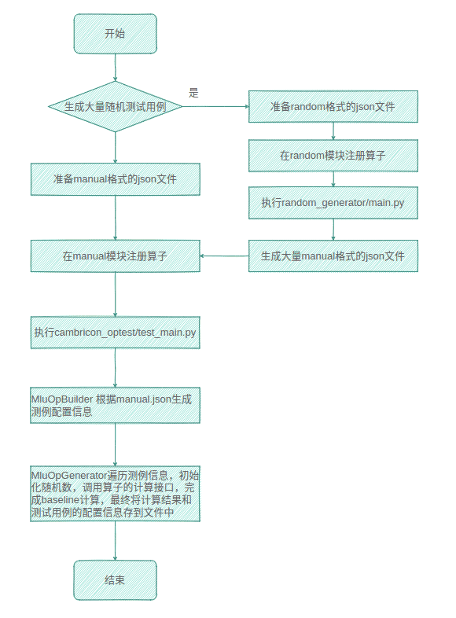

## `Generator`模块介绍和使用说明

`MLU-OPS` `Generator `（mlu-ops/bangc-ops/test/mlu_op_generator）是一个测例生成框架，主要作用是解析 json 格式的配置文件，然后生成本地的单元测试用例，保存测试用例的格式文件可以是 `pb` 或者 `prototxt` 。
主要包含 `random` 模块和 `manual` 模块。

### 1. `Generator` 主流程介绍



<br>

### 2. `Manual` 模块介绍

- #### `MluOpBuilder`

`MluOpBuilder` 负责构建整个流程，会调用 `input_parser` 模块解析 `json` 文件生成测试用例的参数信息，然后调用 `MluOpGenerator` 模块生成 `baseline` 。  
 
<br>

- #### `MluOpGenerator`  

  `MluOpGenerator` 负责核心的计算逻辑，主要包括：

  - 算子在 `TensorListFactory` 工厂中注册自己的 `TensorList` 类，然后该 `TensorList` 类重载随机数初始化，`Tensor` 间形状规模等逻辑

  - 算子在 `OpTestFactory` 工厂中注册自己的 `OpTest` 类，然后该 `OpTest` 中重载 `compute` 的逻辑

  - 算子在 `ProtoWriterFactory` 工厂中注册自己的 `ProtoWriter` 类，然后该 `ProtoWriter` 类重载 `dumpOpParam2Node` 的逻辑

<br>

- #### `TensorList`

  `TensorList` 是默认的 `TensorList` 基类，主要用来处理 `Tensor` 间的依赖关系，初始化随机数。

<br>

- #### `OpTest`

  `OpTest` 是默认的 `OpTest` 的基类，主要是提供 `compute` ，`param check` 接口，新算子必须继承 `OpTest` 实现自己的 `compute` 接口。

<br>  

- #### `ProtoWriter`

  主要包括：

  - 保存公共部分的参数到 `Node`

  - 保存 `Tensor` 信息到 `Node`

  - 保存 `Op Param` 信息到 `Node`

  - 将 `Node` 内容保存到 `pb/prototxt` 文件

<br>    

### 3. `Random` 模块介绍

- #### `RandomParser`

  - `Tensor` 的形状随机，支持三种随机方式，全随机，部分随机，不随机

  - `dtype`、`layout` 随机

  其中 `dtype` 支持的类型有：half、float、int8、int16、int32、int64、double、uint8、uint16、uint32、uint64、bool、complex_half、complex_float、complex_double 。

  其中 `layout` 支持的类型有：NCHW、NHWC、HWCN、NDHWC、ARRAY、TNC、NTC、NCDHW、NC、NLC 。

<br>  

### 4. 如何给一个算子添加测例

#### 4.1 本地环境配置

 根据 `compute` 中第三方计算库的依赖，安装对应的环境，以 `div` 算子为例：

 采用 `tensorflow` 的计算结果作为 `baseline` ，需要安装 `tensorflow` 相关环境。

<br>

#### 4.2 添加算子的计算逻辑

 添加在 GPU/CPU 上的计算逻辑，对应文件写在 cambricon_optest/nonmlu_ops/xxx (算子名) 路径下，以 div 算子为例：

 添加 cambricon_optest/nonmlu_ops/div/compute.py 。

<br>

####  4.3 撰写 `Manual` 格式的 Json 文件

 新增 `manual` 配置文件的路径为 cambricon_optest/manual_config/mlu_ops/xxx (算子名)，config 文件以 xxx_manual.json 命名，要求 `manual` 模块生成的测例，能正确通过 `GTest` 测试。以 `div` 算子为例：

 添加 cambricon_optest/manual_config/div/div_manual.json，执行：

```python
python test_main.py div  # 生成div算子的pb测例 
```

<br>

#### 4.4 撰写 `Random` 格式的 Json 文件

 新增 `random` 配置文件的路径为 cambricon_optest/random_generator/random_config/xxx (算子名)，config 文件以 xxx_random.json 命名，要求       `random` 模式下生成的 json 文件，能作为 manual 模块的输入使用，并正确生成测试用例。以 `div` 算子为例：

 添加 cambricon_optest/random_generator/random_config/div/div_random.json ，执行：

```python
cd random_generator
python main.py div  # 生成div算子的manual json
cp generated_manual/div/*.json manual_config/mlu-ops/div/
cd ..
python test_main.py div  # 读取random生成的manual json，生成div算子的pb测例
如添加算子过程中有修改mlu_op_test_proto/mlu_op_test.proto，需要运行compiler_proto.sh
```

<br>

### 5. Json 参数使用说明

- #### 全局参数

| 参数名                                     | 说明                                                         | 示例                                                         |
| ------------------------------------------ | ------------------------------------------------------------ | :----------------------------------------------------------- |
| op_name                                    | op_name 需与 proto 中新增的算子名保持一致，必填              | “op_name” : " div"                                           |
| evaluation_criterion, evaluation_threshold | diff 率的计算方式和静态阈值，必填                            | "evaluation_criterion":["diff1","diff2"],"evaluation_threshold":["0.003","0.003] |
| device                                     | cpu、gpu 用来区分用什么设备计算 baseline                     | ”device“: "gpu"                                              |
| random_distribution                        | 随机数据参数，用来说明 input 的输入数据值采用哪种方式生成，必填 | ”random_distribution“:{"uniform":[-1,1]}                     |
| contain_nan                                | tensor 生成随机数时是否包含 nan 数据，默认：false            | ”contain_nan“ : true                                         |
| contain_inf                                | tensor 生成随机数时是否包含 inf 数据，默认：false            | ”contain_inf“ : true                                         |

- #### Tensor参数

| 参数名              | 说明                                                         | 示例                    |
| ------------------- | ------------------------------------------------------------ | ----------------------- |
| shape               | tensor 的形状                                                | ”shape“ : [1,224,224,3] |
| dtype               | tensor 的数据类型，可参考 RandomParser 支持的数据类型章节    | ”dtype“ : "float32"     |
| layout              | tensor 的 layout 信息，可参考 RandomParser 支持的数据类型章节 | ”layout“ : "NHWC"       |
| random_distribution | 同全局参数                                                   |                         |