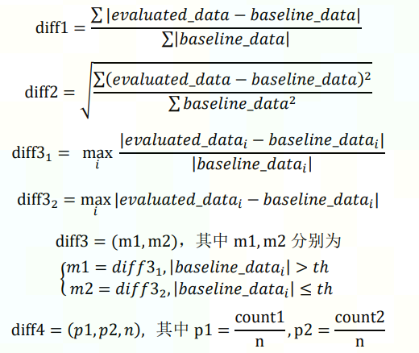

MLU-OPS 算子精度验收标准

### 1. 精度评价公式

当前 MLUOPS 在使用的误差度量方式及其含义

|     | 误差度量指标 |       含义       |
| :-- | :----------: | :--------------: |
| 1   |    diff1     |   平均相对误差   |
| 2   |    diff2     | 均方相对误差开方 |
| 3   |    diff3     | 最大单点相对误差 |
| 4   |   diff3_2    | 最大单点绝对误差 |
| 5   |    diff4     |  误差有偏性度量  |

各评价指标计算公式如下：

其中：

- evaluated_data 表示待评价数据，baseline_data 表示基准数据。通常情况下baseline_data为cpu计算结果。

- diff3 返回两个结果，根据 baseline_data 的每个数与 th 的大小关系，选择相应的计算公式，并分别得到两个公式下计算结果的最大值。当数据类型为 fp32 时，th 为 1e-6；当数据类型为 fp16 时，th 为 1e-4。

- diff4 中，count1 表示 evaluated_data 大于 baseline_data 的个数，count2 表示 evaluated_data 小于 baseline_data 的个数，n 表示不相等的总点数。

### 2. 算子精度分类

不同类型算子的误差度量方式和精度验收标准不同，我们把 MLUOPS 算子根据使用的指令、计算的逻辑做了算子类型划分 :

|     | 算子类型    |                                   解释                              |            固定阈值                |
| :-: | :----:      | :-----------------------------------------------------------------: | :--------------------------------: |
|  1  | 卷积类      | 使用了卷积指令的算子 | float: diff1 <= 1e-5 && diff2 <= 1e-5 half: diff1 <= 3e-3 && diff2 <= 3e-3   |
|  2  | 累加类      | 规约求和类算子。比如 reducesum、reducemean。结果与累加顺序有关。    | diff1 <= 3e-3 && diff2 <= 3e-3     |
|  3  | 激活类      | 激活类算子是指算子的实现用到了线性插值、泰勒展开。                  |diff1 <= 3e-3 && diff2<=3e-3        |      
|  4  | 算术类      | 例如加减乘除。                                                      |             diff3 ==0              |
|  5  | 纯 IO       | 纯 IO 类的算子，不涉及任何运算。比如：concat、split。               |         diff3 ==0                  |
|  9  | 复合类      | 如果算子是由上面几种类型算子中的一种或几种复合组成，则算做复合算子。|diff1 <= 3e-3 && diff2 <= 3e-3      |
| 10  |atomicAdd 类 | 使用了 atomic 指令的算子，多次运行结果可能不同。                    | diff1<=3e-3 && diff2 <= 3e-3       |
