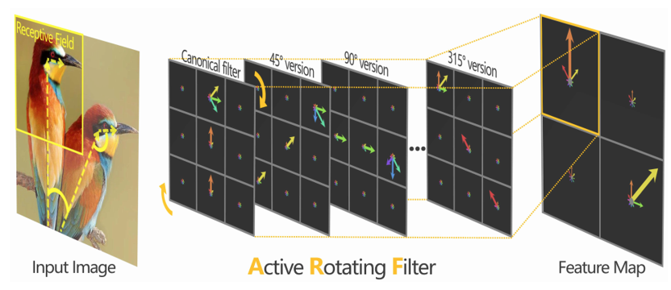
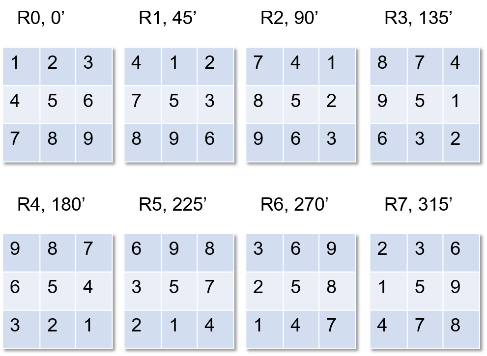
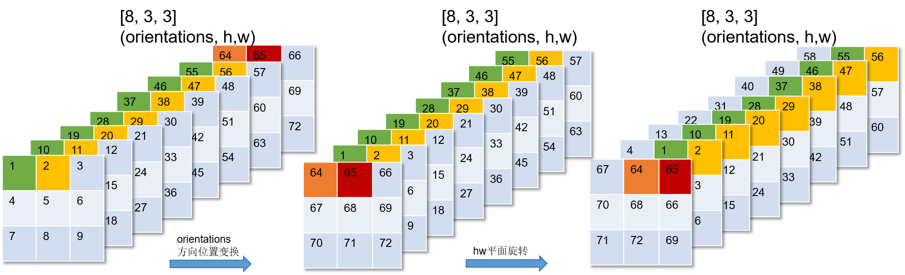

# active_rotated_filter算子开发设计方案


* #### 文档基本信息

| 算子名称    | active_rotated_filter_forward                                               |
| ----------- | ------------------------------------------------------------ |
| 编制人/日期 | 刘端辉/2022-09-26                                            |
| 审批人/日期 | 卜德飞/2022-09-26                                                |
| 审批人/日期 | 王远/2022-09-26                                                |

* #### 修改记录

| 版本号| 修订人 | 修订日期 | 修订描述 |
| ----- | ------ | -------  | -------  |
| V1.0  | 刘端辉 | 2022-09-26 | 首次提交 |

* #### 内容描述

本文档为`active_rotated_filter_forward`算子的设计文档，包括需求分析、接口设计、方案设计、性能优化记录和方案实施部分。

* #### 算子需求checklist

算子需求提出者需要`提供`的信息如下：

- 框架负责人
- 算子接口描述
- 功能描述
- 框架版本 + 对应源码路径
- 需求对应网络
- 网络中用到的规模
- 常用规模下的竞品性能（可选）
- 是否需要支持原位
- 是否需要支持stride机制
- 框架单元测试阈值指标（可选）
- 其他特殊需求（在线量化/融合/转数提前等，可选）
- 确认算子需求是否已经过框架层review（滤除MLUOP已支持的算子）

算子需求提出者需要`check`的部分如下：

- 1.1 算子需求分析
- 1.2 算子功能和应用场景描述
- 1.3 算子输入输出参数要求
- 1.4 算子限制
- 1.5 验收标准
- 2.2 接口设计
- 3.5 测试用例（需求提出者check算子需求表中所给规模是否列出）

## 1 需求分析

### 1.1 算子需求分析

| 算子功能简介| 该算子编码方向信息并生成方向敏感特征  |
|-------------|--------------------------------------------------------------|
| 需求来源    | MMCV                                   |
| 应用网络    | s2anet                                        |
| 输入数据类型| input: half, float;<br> indices: int32         |
| 输入Shape   | input: [output_planes, input_planes, orientations, h, w]; <br>indices: [orientations, h, w, rotations] |
| 输入Layout  | input: Array; <br>indices: Array |
| 输出数据类型| output: half, float                       |
| 输出Shape   | [output_planes * rotations, orientations *input_planes, h, w] |
| 输出Layout  | Array                                                 |
| 是否含有dim/axis等类似语义的参数且该参数支持负数/其他特殊处理 | 不含带dim/axis语义的参数等 |
| 是否含有labels/index等类似语义的参数且该参数支持负数/界外情况/其他特殊处理 | 有index参数，包含在indices内，有特殊规律，由旋转角度决定 |
| 是否需要支持原位        | 否                                                  |
| 是否需要支持stride机制  | 否                                                  |
| 是否需要支持广播  | 否                       |
| 0元素检查是否直接返回  | 是                                                  |


### 1.2 算子功能和应用场景描述

该算子对卷积核kernel filter 做旋转，编码方向信息并生成方向敏感特征，对于图像旋转不变性适用。在原kernel filter中加入方向信息。相对于数据增强中旋转图像获得多个角度的特征图来训练模型，使模型对于有角度的旋转图像能工作，该算子通过旋转 kernel filter 来达到同样的目的。

- kernel filter 旋转示意图 : 来自论文Orientated Response Network。

  

- 旋转示例1: 
  - input: [1, 1, 1, 3, 3] (output_planes, input_planes, orientations, h, w), 包含需要旋转处理的kernel filter的所有元素, orientations: 方向个数。

  - indices: [1, 3, 3, 8] (orientations, h, w, rotations)，包含对kernel filter的所有元素进行旋转后每个元素对应的新的位置的信息，rotations: 旋转次数。

    

- 旋转示例2:
  - 对input: [1, 1, 8, 3, 3] (output_planes, input_planes, orientations, h, w) 旋转45°

    

备注：

1、该算子为IO 类算子，支持nan/inf。

2、含有index参数的算子，indices 参数由特殊旋转规律决定。参考链接： https://github.com/open-mmlab/mmrotate/blob/main/mmrotate/models/utils/orconv.py#L68

nan /inf 实例补充：

```python
output_planes = 1
input_planes = 1
nOrientations = 1
nRotations = 8
kernel_size = 3
indices = torch.tensor([[[1,2,3,6,9,8,7,4],
                  nsor([[[1,2,3,6,9,8,7,4],
                         [2,3,6,9,8,7,4,1],
                         [3,6,9,8,7,4,1,2]],
                        [[4,1,2,3,6,9,8,7],
                         [5,5,5,5,5,5,5,5],
                         [6,9,8,7,4,1,2,3]]
                        [[7,4,1,2,3,6,9,8],
                         [8,7,4,1,2,3,6,9],
                         [9,8,7,4,1,2,3,6]]])
input = torch.ones(output_planes, in_planes, nOrientations, kernel_size, kernel_size)
input_nan = torch.mul(input, float("nan"))
result = active_rotated_filter(input, indices)
print(result)
'''result
tensor.size([8,1,1,3,3])
tensor([[[nan, nan, nan],
         [nan, nan, nan],
         [nan, nan, nan]]], 
      		...,
      )
'''
input = torch.ones(output_planes, input_planes, nOrientations, kernel_size, kernel_size)
input_nan = torch.mul(input, float("inf"))
result = active_rotated_filter(input, indices)
print(result)
'''result
tensor.size([8,1,1,3,3])
tensor([[[inf, inf, inf],
         [inf, inf, inf],
         [inf, inf, inf]]], 
      		...,
      )
'''
##----------------------------------------------------------------------------------
#0元素行为分析
#output_planes， input_planes， nOrientations， kernel_size，nRotations 为0 时，cuda runtime error：
Traceback (most recent call last):
File "active_rotating_filter.py", line 70, in <module>
output = active_rotated_filter(input, indices)
File "/opt/conda/lib/python3.7/site-packages/mmcv/ops/active_rotated_filter.py", line 41, in forward
ext_module.active_rotated_filter_forward(input, indices, output)
RuntimeError: CUDA error: invalid configuration argument
CUDA kernel errors might be asynchronously reported at some other API call,so the stacktrace below might be incorrect.
For debugging consider passing CUDA_LAUNCH_BLOCKING=1.
```


### 1.3 算子输入输出参数要求

| 参数         | 语义                           | 类型（输入/输出） | 支持类型     | 物理布局 | 规模限制 |
| ------------ | ------------------------------ | ----------------- | ------------ | -------- | -------- |
| handle       | MLU-OPS句柄，保存运行上下文信息   | 输入              | mluOpHandle_t | /        | 无       |
| input_desc   | 输入参数input的描述信息        | 输入              |mluOpTensorDescriptor_t| /        | 无       |
| input        | 指向input数据的mlu地址的指针   | 输入              | half, float  | ARRAY    | [output_planes, input_planes, orientations, h, w],orientations: 2的幂次方，orientations >=1 且 orientations <=128,  h=w,h=1 or 3 |
| indices_desc | 输入参数indices的描述信息      | 输入              |mluOpTensorDescriptor_t| /        | [orientations, h, w, rotations], rotations=2,4,8   |
| indices      | 指向indices数据的mlu地址的指针 | 输入              | int32        | ARRAY    | 无       |
| workspace    | 输入workspace数据的mlu地址的指针 | 输入              | half,float | ARRAY | 无       |
| workspace_size | 输入workspace的空间大小      | 输入               | size_t | ARRAY | 无       |
| output_desc  | 输出参数input的描述信息        | 输入              |mluOpTensorDescriptor_t | /        | 无       |
| output       | 指向output数据的mlu地址的指针  | 输出              | half, float  | ARRAY    | 无       |

### 1.4 算子限制

该小节为limitation.md的补充。详细描述与框架需求相比，算子尚有哪些功能/模式/范围/数据类型/xxx不支持。
使用表格或分段列出均可。

`注意`：凡是没有在此处列出，但最终被框架检测到的算子限制，均会被视为算子bug。
在此处列出的限制，算子内做好防呆。

| 限制类型     | 详细说明                                                     |
| ------------ | ------------------------------------------------------------ |
| 规模限制     | 输入input为5维，且dim3 == dim4, dim3 只能为1或者3。dim2 为2的幂数大于0且小于等于128<br>输入indices 为4维，dim0 与input.dim2相等; dim1== dim2, 且与input.dim3相等。<br>indices dim3 只能为2,4,8 |
| 数据范围限制 | 无                                                           |
| 原位限制     | 不支持原位                                                   |
| stride限制   | 不支持stride机制                                             |
| 广播限制     | 不支持广播                                                   |

### 1.5 验收标准

#### 1.5.1 精度验收标准

- MLU-OPS精度验收标准：该算子为IO类算子，采用静态阈值验收标准，精度标准描述如下：
  - diff3 = 0

- 框架验收标准（若有）：无.

#### 1.5.2 性能验收标准

- 参考接口性能分析：

| 平台                 | 框架版本                         | 数据类型 | 数据规模 (input.shape,<br>indices.shape) | 计算效率 | IO效率  | Hardware time(us) |
| -------------------- | -------------------------------- | -------- | ------------------------------------------ | -------- | ------- | ----------------- |
| Tesla V100-SXM2 16GB | mmcv1.5.2+ pytorch 1.9+ cuda10.2 | float    | ([32, 256, 1, 3, 3], [1, 3, 3, 8])         | 13.653%  | 29.065% | 8.789             |
|                      |                                  | float    | ([64, 512, 1, 3, 3], [1, 3, 3, 8])       | 17.89%  | 52.33% | 22.58           |
|                      |                                  | float    | ([32, 128, 8, 3, 3], [8, 3, 3, 8])      | 17.05%   | 53.12%  | 23.62          |
|                      |                                  | half     | ([32, 256, 1, 3, 3], [1, 3, 3, 8])         | 17.116%  | 22.915% | 7.947             |
|                      |                                  | half     | ([64, 512, 1, 3, 3], [8, 3, 3, 8])       | 31.005%  | 40.90%  | 14.77          |
|                      |                                  | half     | ([32, 128, 8, 3, 3], [8, 3, 3, 8])      | 28.57%   | 60.97% | 15.67          |

## 2 算子接口设计

### 2.1 参考接口

- mmcv
```c++
// 给出MMCV 接口
// CUDA(https://github.com/open-mmlab/mmcv/blob/v1.5.2/mmcv/ops/csrc/pytorch/cuda/active_rotated_filter_cuda.cu)
void ActiveRotatedFilterForwardCUDAKernelLauncher(const Tensor input_tensor,
                                                const Tensor indices_tensor, 
                                                Tensor output_tensor)
// input: (output_planes, input_planes, orientations, H, W)
// indices: (orientations, H, W, rotations)
// output: (output_planes * rotations, input_planes * orientations, H, W)
```

### 2.2 接口设计

```c++
mluOpStatus_t MLUOP_WIN_API
mluOpGetActiveRotatedFilterForwardWorkspaceSize(mluOpHandle_t handle,
                                               const mluOpTensorDescriptor_t input_desc,
                                               size_t *workspace_size);

mluOpStatus_t MLUOP_WIN_API 
mluOpActiveRotatedFilterForward(mluOpHandle_t handle,
                               const mluOpTensorDescriptor_t input_desc,const
                               const void *input,
                               const mluOpTensorDescriptor_t indices_desc,
                               const void *indices,
                               void *workspace,
                               size_t workspace_size,
                               const mluOpTensorDescriptor_t output_desc,
                               void *output)

```

## 3 实现方案设计

### 3.1 实现方案

为实现功能描述中的旋转，本方案如下：
- 本实现方案与参考接口实现方案有差异，参考接口通过indices位置硬编码信息实现所有旋转后元素位置摆放，本方案根据旋转规律实现功能，不能接受非旋转规律的输入。
- 200 与 300 系列实现方案略有不同，300 系列按照step1 ～ step4 方式进行实现; 200系列按照step1的方式完成所有的旋转操作，每个角度规则参考旋转实例1。
- step1. 一次旋转的角度计算公式为：360/rotations，若rotations = 2,4,进入step2；若rotations为8，则每次旋转角为45度，需对input进行45度旋转，输出放在workspace空间做为下一步的输入，记为input_45，参考旋转示例2。
  - a. 对input在output_planes按clusterDim均分， cluster内input_planes按coreDim 进行均匀拆分，每个mlu core 处理一部分input的数据。
  - b. 若orientations == 8, 在orientations 方向上通过两次 copy 完成 [1~7, 8] 到 [8, 1 ~ 7]hw平面的位置转换, 输出放在workspace空间，记作workspace_orientation_output(在300以上板卡中，用output空间做中间数据存储)。
  - c. 对workspace_orientation_output的数据进行hw平面旋转, 每次对一个hw的位置进行操作,放在output空间，记为input_45(在300以上板卡中，将output的数据输出到workspace进行下一步计算)。

  ```c++
  #define ROWS 8
  #define COLS 9
  #define CYCLE_ROTATE 360
  #define ROTATE_BASE_ANGLE 45
  #define ROTATE_EIGHT 8
  #define ROTATE_FOUR 4
  #define ROTATE_TWO 2
  #define KH_KW_3 3
  
  int trans[ROWS][COLS] = {{0, 1, 2, 3, 4, 5, 6, 7, 8},
                           {3, 0, 1, 6, 4, 2, 7, 8, 5},
                           {6, 3, 0, 7, 4, 1, 8, 5, 2},
                           {7, 6, 3, 8, 4, 0, 5, 2, 1},
                           {8, 7, 6, 5, 4, 3, 2, 1, 0},
                           {5, 8, 7, 2, 4, 6, 1, 0, 3},
                           {2, 5, 8, 1, 4, 7, 0, 3, 6},
                           {1, 2, 5, 0, 4, 8, 3, 6, 7}
                          };
  template <typename T>
  __mlu_func__ void orientation_move(T *workspace, T *input, const int kH, const int kW, const int block_num, const int total_num, const int stride, const int num_deal)
  {
    int pre_size = block_num * kH * kW;
    int later_size = (total_num - block_num) * kH * kW;
  
    if(pre_size > 0 ) {
      __memcpy(workspace, input + later_size, pre_size* sizeof(T), GDRAM2GDRAM, stride* sizeof(T), stride* sizeof(T), num_deal - 1);
    }
  
    if(later_size > 0) {
      __memcpy(workspace + pre_size, input, later_size* sizeof(T), GDRAM2GDRAM, stride* sizeof(T), stride* sizeof(T), num_deal - 1);
    }
  }
  
  template <typename T>
  __mlu_func__ void rotateHW(T *workspace_aux, T *workspace, const int trans[][COLS], const int kH, const int kW, const int dst_stride, const int src_stride, const int num_deal, const int rotate_id)
  {
    if( kH == KH_KW_3) {
      for (int i = 0; i < COLS; i++) {
        __memcpy(workspace_aux + i, workspace + trans[rotate_id][i], sizeof(T), GDRAM2GDRAM, dst_stride* sizeof(T), src_stride* sizeof(T), num_deal - 1);
      } 
    } else {
      __memcpy(workspace_aux, workspace, num_deal * src_stride* sizeof(T), GDRAM2GDRAM); 
    }
  }
  
  orientation_move<T>();
  rotateHW<T>();
  ```

- step2. 将nram分为PING/PONG 两区, 每个区再分为 nram_input(1/10 NRAM), nram_ouput(4/10 NRAM)，使用3级流水分别处理输入。
  - a. 若rotations == 8, 则需循环两次流水，第一次流水的输入为 input， 第二次流水的输入为input_45。

  ```c++
    // nram空间划分  
    //|----------------PING-----------------|---------------PONG------------------|  
    //|-nram_input-|------nram_output-------|-nram_input-|------nram_output-------|
    //| 1/10 NRAM   |       4/10 NRAM         |  1/10 NRAM  |       4/10 NRAM         |
  template <typename T>
  __mlu_func__ void  load_input(T* nram_input, T* input, const uint32_t op_offset, 
  const uint32_t core_offset, const uint32_t op_seg, const uint32_t op_seg_size, const uint32_t repeat, const uint32_t span_num_deal, const uint32_t num_deal, const uint32_t size) {
    uint32_t input_offset = (op_offset + op_seg * op_seg_size + core_offset + repeat * 							span_num_deal) * size;
    __memcpy_async(nram_input, input + input_offset, num_deal * size* sizeof(T), GDRAM2NRAM);
  }
  ```

- step3. 对nram_input 的每个hw平面使用 __bang_rotate90, __bang_rotate180, __bang_rotate270进行旋转，输出到nram_output, 循环处理hw平面时按orientation旋转后的顺序摆放到 nram_output。

  - PING 区，对input 进行旋转得到 input_90, input_180, input_270。
  - PONG 区，对input_45 进行旋转得到input_135, input_225, input_315。

  ```c++
  #define CYCLE_ROTATE 360
  #define ROTATE_BASE_ANGLE 45
  #define ROTATE_EIGHT 8
  #define ROTATE_FOUR 4
  #define ROTATE_TWO 2
  #define KH_KW_3 3
  template <typename T>
  __mlu_func__ void computeRotation(T* nram_output, T* nram_input, const int span_num_deal,
  const int num_deal, const int kH, const int kW, const int orientations, const int rotations) 
  {
    float delta_orientation = (float)CYCLE_ROTATE / (float)orientations;
    float delta_rotation = 0;
    int rotate_time = 0;
    if (rotations >= ROTATE_FOUR)
    {
      rotate_time = ROTATE_FOUR;
      delta_rotation = (float)CYCLE_ROTATE / (float)rotate_time;
    }
    else
    {
      rotate_time = rotations;
      delta_rotation = (float)CYCLE_ROTATE / (float)rotations;
    }
  
    __bang_write_value((T *)nram_output, rotate_time * span_num_deal*orientations * kH * kW, (T)0);
  
    for (int r = 0; r < rotate_time; ++r)
    {
      for (int k = 0; k < num_deal; ++k) {
        int offset = k * kH * kW * orientations;
        T *src_base = (T *)nram_input + offset;
        T *dst_base = (T *)nram_output + r * num_deal * orientations * kH * kW + offset;
        for (int j = 0; j < orientations; ++j)
        {
          float angle = delta_rotation * (float)r;
          int layer = (j + int(angle / delta_orientation)) % orientations;
          T *src_ro = src_base + j * kH * kW;
          T *dst_ro = dst_base + layer * kH * kW;
          switch (r){
            case 0: 
            {
              __bang_bor((char *)(dst_ro), (char *)(dst_ro), (char *)src_ro, kH * kW * sizeof(T));
            }; continue;
            case 1:
            {
              if (rotate_time == ROTATE_FOUR)
              {
                __bang_rotate90(dst_ro, src_ro, kH, kW);
              }
              else if (rotate_time == ROTATE_TWO)
              {
                __bang_rotate180(dst_ro, src_ro, kH, kW);
              }
            }; continue;
            case 2:
            {
              __bang_rotate180(dst_ro, src_ro, kH, kW);
            }; continue;
            case 3:
            {
              __bang_rotate270(dst_ro, src_ro, kH, kW);
            }
          }
        }
      }
    }
  }
  ```

- step4. 输出input, input_45, input_90, input_135, input_180, input_225, input_270, input_315 至output。

  ```c++
  template <typename T>
  __mlu_func__ void  stride_store_output(T* output, T* nram_output, const uint32_t op_offset, 
  const uint32_t core_offset, const uint32_t op_seg, const uint32_t op_seg_size, const uint32_t rotations, const uint32_t compute_time, const uint32_t span_num_deal, const uint32_t repeat, const uint32_t num_deal, const uint32_t size)
  {
    uint32_t output_offset = ((op_offset + op_seg * op_seg_size) * rotations + core_offset + repeat * span_num_deal + compute_time * op_seg_size) * size;
    if (rotations == ROTATE_EIGHT)
    {
      __memcpy_async(output + output_offset,
             nram_output, num_deal * size* sizeof(T), NRAM2GDRAM, 2 * op_seg_size * size* sizeof(T), num_deal * size* sizeof(T), rotations/2 - 1);
    } else {
      __memcpy_async(output + output_offset,
                     nram_output, num_deal * size * sizeof(T), NRAM2GDRAM, op_seg_size * size * sizeof(T), num_deal * size* sizeof(T), rotations - 1);
    }
  }
  ```
 ### 3.2 伪代码实现（可选）

### 3.3 拆分(任务拆分，多核拆分)
- 任务类型Ubest：对input 和input_45 在output_planes按clusterDim均分， cluster内input_planes按coreDim 进行均匀拆分,每个task对分到的input数据按上述方法进行处理。 
- 为提升性能，step2 ～ step4 采用3级流水，即Gdram2Nram, Compute, Nram2Gdram。
  ```c++
  if(rotations == 8) {
    //rotate45;
    orientation_move<T>();
    rotateHW<T>();
    sync_all();
  }
  
  // 在三级流水的任一时间片内，操作如下
  {
    //load
    load_input();
    // compute
    rotation_compute();
    //store
    stride_store_output();
  } 
  ```

### 3.4 性能优化设计
1、资源分配

| 表项            | 分配策略   |
| ----------------| -----------|
| NRAM            | 均分为PING/PONG两块区域，然后PING(PONG) 区分为nram_input （1/10 NRAM）和 nram_output (4/10 NRAM)。 |
| DRAM(workspace) | input大小的空间。 |

### 3.5 方案理论性能

### 3.6 可维护性设计

1、bangc代码中加入必要的 log信息，比如输入的规模、数据类型、layout这些，以及如果出错会导致程序core dump的变量，比如IO指令的data_size、dim xyz的值等，这些信息都是有利于快速定位问题。   (待整理完善，对log进行规范)

2、对每一个函数命名变量命名都有充分的注释

3、避免魔鬼数字，对于确定的数字尽量使用公共宏来替代   (待提供公共宏文档)

### 3.7 测试用例设计

- 框架给出部分，加上部分自定义的规模：

  | (input.shape, indices.shape)          | input data type | output dist data type |
  | ------------------------------------- | --------------- | --------------------- |
  | ([32, 256, 1, 3, 3], [1, 3, 3, 8])    | half, float     | half, float           |
  | ([64, 512, 1, 3, 3], [1, 3, 3, 8])    | half, float     | half, float           |
  | ([32, 128, 8, 3, 3], [8, 3, 3, 8])    | half, float     | half, float           |

其他可根据需要进行补充。算子开发完毕后，补充测试报告链接。

### 3.8 算子防呆检查

防呆报错使用错误码： `MLUOP_STATUS_BAD_PARAM, MLUOP_STATUS_NOT_SUPPORTED`。 

1. 检查handle/input_desc/indices_desc/output_desc是否为空。
2. 检查输入输出空间指针input, indices, workspace, output 是否为空。
3. 检查input是否为5维；indices是否为4维；input.dim3 == input.dim4,且值等于1或者3；检查indices.dim0 == input.dim2, indices.dim1 == input.dim3, indices.dim4 == input.dim4。
4. 检查input.dim2, indices.dim0是否大于1且小于等于128，且为2的幂数；indices.dim3 是否为2,4,8。
5. 检查input datatype，支持half, float， 检查indices datatype, 只支持int32。
6. 检查0元素，input 或者indices 为0元素时，返回`MLUOP_STATUS_BAD_PARAM`。
7. 对workspace_size进行防呆。

## 4 算子性能/精度问题 & 优化记录

### 4.1 当前存在问题的规模说明

（首次提交，暂无） 

### 4.2 已经过优化的规模说明

（首次提交，暂无）

## 5 方案实施

### 5.1 开发测试计划

- 2022.9.23-2022.9.28设计方案：算子功能+接口设计

- 2020.09.29 ~ 2022.10.14 generator, gtest, 主体代码开发

- 2020.10.17 ~ 2022.10.21批量测试 + 测试报告

- 2022.10.24 ~ 2022.10.28 提交MR + 代码review、算子入库

### 5.2 风险分析

暂无

