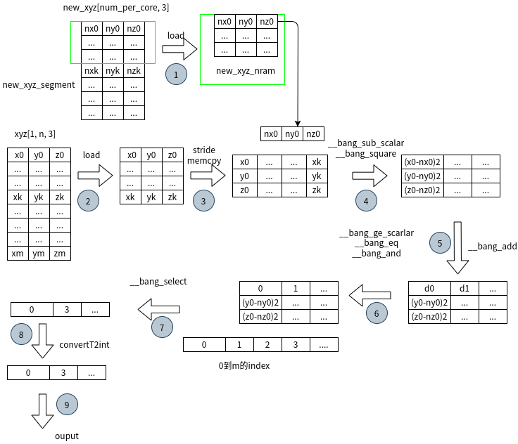
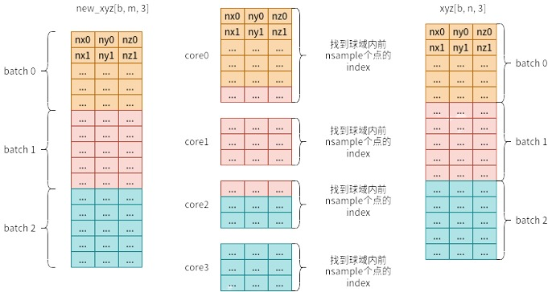

# ball_query 算子开发设计方案

- #### 文档基本信息

| 算子名称    | ball_query       |
| ----------- | -------------- |
| 编制人/日期 | 吴东东/2022-06-21 |
| 审批人/日期 | */2022-*-* |
| 审批人/日期 | */2022-*-*   |

- #### 修改记录

| 修订人 | 修订日期   | 修订描述 |
| ------ | ---------- | -------- |
| 吴东东    | 2022-9-19 | 首次提交 |

- #### 内容描述

本文档为`ball_query`算子的设计文档，包括需求分析、接口设计、方案设计、性能优化记录和方案实施部分。

- #### 算子需求 checklist

* 算子接口描述
* 功能描述
* 框架版本 + 对应源码路径
* 需求对应网络
* 网络中用到的规模
* 是否需要支持原位
* 是否需要支持 stride 机制
* 框架单元测试阈值指标（可选）

## 1 需求分析

### 1.1 算子需求分析

| 算子功能简介                                                                 | ball_query算子  |
| ---------------------------------------------------------------------------- | --------------------------------------- |
| 需求来源               | Pytorch                              |
| 应用网络               | Pointnet++                            |
| 输入数据类型           |  new_xyz: half/float; </br>xyz: half/float； </br>min_radius: float; </br>max_radius: float; </br>nsample: int |
| 输入 Shape            | new_xyz: [b, m, 3]; </br>xyz: [b, n, 3]; </br>min_radius: scalar; </br>max_radius: scalar; </br>nsample: scalar  |
| 输入 Layout           | new_xyz: ARRAY; </br>xyz: ARRAY；</br>min_radius: scalar; </br>max_radius: scalar; </br>nsample: scalar        |
| 输出数据类型            | idx: int32|
| 输出 Shape            | idx: [b, m, nsample]         |
| 输出 Layout              |idx: ARRAY  |
| 模式(可选）                      |                                           |
| 是否含有 dim/axis 等类似语义的参数且该参数支持负数/其他特殊处理              | 无                         |
| 是否含有 labels/index 等类似语义的参数且该参数支持负数/界外情况/其他特殊处理 | 无                           |
| 是否需要支持原位           | 否         |
| 是否需要支持 stride 机制   | 否                                                           |
| 是否需要支持广播           | 否                                                           |
| 0 元素检查是否直接返回      | new_xyz:（否，return MLUOP_STATUS_BAD_PARAM）;</br> new_xyz: </br>(是，dim[1] == 0, return MLUOP_STATUS_SUCCESS);         |
| 其他特殊需求(在线量化，融合，转数提前等，可选)                               |                                                                |
| 本次开发优先支持的规模/模式                                                  |                                |

### 1.2 算子功能和应用场景描述

算子功能： ball_query 算子

应用场景： 该算子应用于Ponitnet++网络。

- example:

```python
ext_module = ext_loader.load_ext('_ext', ['ball_query_forward'])
B = 2
M = 3
N = 4
min_radius = 0.0
max_radius = 0.8
sample_num = 3

np.random.seed(6)
center_xyz = np.random.random((B, M, 3)).astype(np.float32)
center_xyz = torch.from_numpy(center_xyz).cuda()
xyz = np.random.random((B, N, 3)).astype(np.float32)
xyz = torch.from_numpy(xyz).cuda()
idx = xyz.new_zeros(B, M, sample_num, dtype=torch.int)
ext_module.ball_query_forward(
  center_xyz,
  xyz,
  idx,
  b=B,
  n=N,
  m=M,
  min_radius=min_radius,
  max_radius=max_radius,
  nsample=sample_num)

center_xyz:
tensor([[[0.8929, 0.3320, 0.8212],
         [0.0417, 0.1077, 0.5951],
         [0.5298, 0.4188, 0.3354]],

        [[0.6225, 0.4381, 0.7359],
         [0.5180, 0.5789, 0.6454],
         [0.9902, 0.8199, 0.4132]]], device='cuda:0')
xyz:
tensor([[[0.8763, 0.8238, 0.0545],
         [0.7186, 0.8022, 0.7364],
         [0.7091, 0.5409, 0.1248],
         [0.9576, 0.4033, 0.2170]],

        [[0.7173, 0.9942, 0.2556],
         [0.6713, 0.5990, 0.7173],
         [0.9373, 0.3518, 0.2536],
         [0.4025, 0.7465, 0.7241]]], device='cuda:0')
idx:
tensor([[[1, 2, 3],
         [0, 0, 0],
         [0, 1, 2]],

        [[0, 1, 2],
         [0, 1, 2],
         [0, 1, 2]]], device='cuda:0', dtype=torch.int32)
```
```python
# 0元素检查
# 1) new_xyz为0， 报错
center_xyz = np.random.random((0, 0, 3)).astype(np.float32)
RuntimeError: CUDA error: invalid configuration argument

# 2) xyz.shape[1] == 0, 未报错
xyz = np.random.random((B, 0, 3)).astype(np.float32)
idx = xyz.new_zeros(B, M, sample_num, dtype=torch.int)
print(idx)
tensor([[[0, 0, 0],
         [0, 0, 0],
         [0, 0, 0]],

        [[0, 0, 0],
         [0, 0, 0],
         [0, 0, 0]]], device='cuda:0', dtype=torch.int32)
[torch.cuda.FloatTensor of size 2x3x3 (GPU 0)]

# inf/nan检查
# 1) new_xyz支持inf
idx = xyz.new_zeros(B, M, sample_num, dtype=torch.int)
new_xyz = torch.from_numpy(np.array([[[inf, inf, inf],
                          [inf, inf, inf],
                          [inf, inf, inf]],

                          [[inf, inf, inf],
                          [inf, inf, inf],
                          [inf, inf, inf]]])).float().cuda()
print(idx)
tensor([[[0, 0, 0],
         [0, 0, 0],
         [0, 0, 0]],

        [[0, 0, 0],
         [0, 0, 0],
         [0, 0, 0]]], device='cuda:0', dtype=torch.int32)
[torch.cuda.FloatTensor of size 2x3x3 (GPU 0)]

# 2) xyz支持inf
idx = xyz.new_zeros(B, M, sample_num, dtype=torch.int)
xyz = torch.from_numpy(np.array([[[inf, inf, inf],
                      [inf, inf, inf],
                      [inf, inf, inf],
                      [inf, inf, inf]],

                      [[inf, inf, inf],
                      [inf, inf, inf],
                      [inf, inf, inf],
                      [inf, inf, inf]]])).float().cuda()
print(idx)
tensor([[[0, 0, 0],
         [0, 0, 0],
         [0, 0, 0]],

        [[0, 0, 0],
         [0, 0, 0],
         [0, 0, 0]]], device='cuda:0', dtype=torch.int32)
[torch.cuda.FloatTensor of size 2x3x3 (GPU 0)]

# 3) new_xzy支持nan
idx = xyz.new_zeros(B, M, sample_num, dtype=torch.int)
new_xyz = torch.from_numpy(np.array([[[nan, nan, nan],
                          [nan, nan, nan],
                          [nan, nan, nan]],

                          [[nan, nan, nan],
                          [nan, nan, nan],
                          [nan, nan, nan]]]))
print(idx)
tensor([[[0, 0, 0],
         [0, 0, 0],
         [0, 0, 0]],

        [[0, 0, 0],
         [0, 0, 0],
         [0, 0, 0]]], device='cuda:0', dtype=torch.int32)
[torch.cuda.FloatTensor of size 2x3x3 (GPU 0)]

# 4) xyz支持nan
idx = xyz.new_zeros(B, M, sample_num, dtype=torch.int)
xyz = torch.from_numpy(np.array([[[nan, nan, nan],
                      [nan, nan, nan],
                      [nan, nan, nan],
                      [nan, nan, nan]],

                    [[nan, nan, nan],
                      [nan, nan, nan],
                      [nan, nan, nan],
                      [nan, nan, nan]]]))
print(idx)
tensor([[[0, 0, 0],
         [0, 0, 0],
         [0, 0, 0]],

        [[0, 0, 0],
         [0, 0, 0],
         [0, 0, 0]]], device='cuda:0', dtype=torch.int32)
[torch.cuda.FloatTensor of size 2x3x3 (GPU 0)]
```

### 1.3 算子输入输出参数要求

| 参数             | 语义                               | 类型（输入/输出） | 支持类型    | 物理布局   | 规模限制 |
| ---------------- | ---------------------------------- | ----------------- | ----------- | ---------- | -------- |
| handle           | 算子上下文信息                    | /                 | /           | /          | 无       |
| xyz_desc  | 输入数据 xyz 的描述符，包含了 xyz 的数据类型、数据维度和布局等信息| 输入 | mluOpTensorDescriptor_t | /     | 无       |
| xyz       | 输入数据 xyz 的指针                 | 输入              |  half $\mid$ $\mid$ float      | ARRAY       | 无       |
| new_xyz_desc  | 输入数据 new_xyz 的描述符，包含了 new_xyz 的数据类型、数据维度和布局等信息| 输入 | mluOpTensorDescriptor_t | /  | 无       |
| new_xyz       | 输入数据 new_xyz 的指针                  | 输入              | half $\mid$ $\mid$ float      |  ARRAY      | 无       |
| min_radius       | 球域的内径                  | 输入              | float       |  /      | 无       |
| max_radius       | 球域的外径                  | 输入              | float       |  /      | 无       |
| nsample       | 返回球域内前 nsample 个点的 index 数量               | 输入              | int32_t       |  /      | 无       |
| idx_desc | 输入数据 idx 的描述符，包含了 idx 的数据类型、数据维度和布局等信息 | 输出              | mluOpTensorDescriptor_t          | /       | 无       |
| idx      | 输入数据 idx 的指针| 输出              | int32_t      | ARRAY       | 无       |

### 1.4 算子限制

| 限制类型     | 详细说明 |
| ------------ | --------------------------------------------------------------------------------------------------------------- |
| 数据类型限制 | 输入数据 xyz 和 new_xyz 的数据类型必须一致且只支持 half和float。数据输出（idx）类型必须是int32_t。         |
| 数据规模限制 | 无                                                            |
| 原位限制     | 不支持原位                                                                                                      |
| stride 限制  | 不支持 stride 机制                                                                                              |
| 广播限制     |  参数不支持广播                                                                                              |
| 输入参数限制 | xyz.shape[0] == new_xyz.shape[0] == idx.shape[0] </br> new_xyz.shape[1] == idx.shape[1] </br> xyz_shape[2] == new_xyz.shape[2] = 3 </br> nsample >= 0 </br> min_radius >= 0 </br> max_radius >= 0

### 1.5 验收标准

#### 1.5.1 精度验收标准

按照[精度验收标准](../MLU-OPS-Accuracy-Acceptance-Standard.md)的要求明确本算子的精度标准。
- 算子精度验收标准：diff1、diff2；
- 算子精度阈值描述：diff1 = 0 && diff2 = 0；

#### 1.5.2 性能验收标准

见 [MLU-OPS 性能验收标准](../MLU-OPS-Performance-Acceptance-Standard.md)。

## 2 算子接口设计

#### 2.1 参考接口

- cuda接口

```c++
void BallQueryForwardCUDAKernelLauncher(int b, int n, int m,
                                        float min_radius,
                                        float max_radius, int nsample,
                                        const Tensor new_xyz, const Tensor xyz,
                                        Tensor idx)
```
#### 2.2 接口设计
```c++
mluOpStatus_t MLUOP_WIN_API mluOpBallQuery(mluOpHandle_t handle,
                                           const mluOpTensorDescriptor_t new_xyz_desc,
                                           const void *new_xyz,
                                           const mluOpTensorDescriptor_t xyz_desc,
                                           const void *xyz,
                                           const float min_radius,
                                           const float max_radius,
                                           const int nsample,
                                           const mluOpTensorDescriptor_t idx_desc,
                                           void *idx)
```
## 3 实现方案设计

### 3.1 实现方案



对数据 new_xyz 进行拆分，把 new_xyz(b,m,3) 中 b * m 个数据划分到 taskDim 个任务中去。下面是计算 new_xyz 数据集中单点与 xyz 数据集中点的距离并保存在球域内点的index。上述计算流程被呈现在计算流程图中，下面将进一步讲解计算的流程。

step:1

1. 假设每个mlu core需要处理num_per_core个new_xyz点，根据划分好的new_xyz_nram空间对new_xyz数据进行分块处理，每一块为new_xyz_segment，假设mun_per_core size 小于new_xyz_nram空间，则只有一个new_xyz_segment。

2. 根据划分好的xyz_nram空间对xyz数据集进行分块处理，每一块为xyz_segment，如果xyz数据集所需的nram空间小于xyz_nram，则xyz_segment只有一个。

```C++
  const int32_t task_stride = b * m / taskDim; // 每个core需要处理的new_xyz数据集点数量
  const int32_t rem_task = b * m % taskDim; // new_xyz 余数部分
  const int32_t task_start = taskId * task_stride; // 每个core处理new_xyz数据集的起始地址

  const int32_t num_per_task = task_stride + (taskId == taskDim - 1) * rem_task; // 实际上每个core处理的new_xyz数据集的点数，余数部分由taskDim -1个任务处理即最后一个任务处理new_xyz的余数模块

  int32_t num_loop_new_xyz = num_per_task / num_stride; // num_per_task很大时，new_xyz_segment数
  const int32_t rem_num_new_xyz  = num_per_task % num_stride; // new_xyz余数部分
  num_loop_new_xyz = rem_num_new_xyz > 0 ? num_loop_new_xyz + 1 : num_loop_new_xyz; // new_xyz余数部分不为0时，则增加一个循环来处理new_xyz的余数部分

  int32_t num_loop_xyz = n / num_stride; // n很大时，xyz_segment数
  const int32_t rem_num_xyz  = n % num_stride; // xyz余数部分
  num_loop_xyz = rem_num_xyz > 0 ? num_loop_xyz + 1 : num_loop_xyz; // xyz余数部分不为0时，则增加一个循环来处理xyz的余数部分
  for (int32_t i = 0; i < num_loop_new_xyz; ++i) {
    step1 load new_xyz segment
	for (int32_t new_index = index_new_xyz ; new_index < (index_new_xyz + num_deal_new_xyz);) {
      same_batch_e = same_batch_s + tmp_num; // [same_batch_s, same_batch_e) ，对于加载在new_xyz_nram的new_xyz点，找到属于同一batch的start index
      index_start = same_batch_e + index_new_xyz; // 找到属于同一batch的end index
      for (int32_t j = 0; j < num_loop_xyz; ++j) {
        step2 load xyz segment
	    step3 stride memcpy
        for (int32_t k = same_batch_s; k < same_batch_e; ++k) {
		  step4 开始计算nram上xyz点和new_xyz点差值的平方
		  step5 开始计算dist
		  step6 开始计算哪些点落在以new_xyz为球心，以min_radius，max_radius2为半径的球域内.1表示落在球域内，0表示落在球域外
		  step7 通过__bang_select指令选出在球域内点在xyz数据集中的index
		  step8 对选出的index进行数据类型转换。转成int32
 		  step9 把int32类型的idx memcpy到gdram上
		}
      }
	}
  }
```
step2：对每一块xyz_segment数据load到xyz_nram。

step3：对于xyz_nram上的数据，使用memcpy stride把xyz_nram点的进行transpose操作，数据摆放形式见上图中step3的结果示意图。

```C++
__bang_write_value(vec_x1, PAD_UP(num_deal_xyz, 64), (T)(INFINITY));  //首先对vec_x1进行赋INFINITY操作，目的是处理num_deal_xyz对齐后，多余的数据
__memcpy(vec_sub_x1, &xyz[base2], num_deal_xyz * 3 * sizeof(T), GDRAM2NRAM); // step2 对每一块xyz_segment数据load到xyz_nram
__memcpy(vec_x1, (T *)vec_sub_x1, sizeof(T), NRAM2NRAM, sizeof(T), (COORD_NUM) * sizeof(T), num_deal_xyz -1); //step3，操作的结果类似与tanspose操作
__memcpy(vec_y1, (T *)vec_sub_x1 + 1, sizeof(T), NRAM2NRAM, sizeof(T), (COORD_NUM) * sizeof(T), num_deal_xyz -1);
__memcpy(vec_z1, (T *)vec_sub_x1 + 2, sizeof(T), NRAM2NRAM, sizeof(T), (COORD_NUM) * sizeof(T), num_deal_xyz -1);
```
step4：dist计算一个new_xyz点和xyz segment内点集所有点的dist2。

step5：对step得到的结果进行两次__bang_add操作，可以得到队长的dist2。
```C++
// (x1 - x2)
__bang_sub_scalar(vec_sub_x1, vec_x1, new_xyz_nram[3*k], PAD_UP(num_deal_xyz, 64)); // step4
// (y1 - y2)
__bang_sub_scalar(vec_sub_y1, vec_y1, new_xyz_nram[3*k + 1], PAD_UP(num_deal_xyz, 64));
// (z1 - z2)
__bang_sub_scalar(vec_sub_z1, vec_z1, new_xyz_nram[3*k + 2], PAD_UP(num_deal_xyz, 64));
// (x1 - x2)^2 + (y1 - y2)^2 + (z1 - z2)^2
__bang_square(vec_sub_x1, vec_sub_x1, PAD_UP(num_deal_xyz, 64));
__bang_square(vec_sub_y1, vec_sub_y1, PAD_UP(num_deal_xyz, 64));
__bang_square(vec_sub_z1, vec_sub_z1, PAD_UP(num_deal_xyz, 64));

__bang_add(vec_sub_x1, vec_sub_x1, vec_sub_y1, PAD_UP(num_deal_xyz, 64)); // step5
__bang_add(vec_sub_x1, vec_sub_x1, vec_sub_z1, PAD_UP(num_deal_xyz, 64));
```
step 6：对于step5得到dist2， dist2 和min_radius2和max_radius2、0进行对比，求出dist2== 0||  (dist2 >= min_radius2 && dist2 < max_radius2)对应位置的值为1（表示当前xyz点在以new_xyz点为球心，以min_radius和max_radius为半径的球域内）。
```C++
#if __BANG_ARCH__ >= 322
  // distance2 >= min_radius2
  __bang_ge_scalar(tmp_addr, distance2, min_radius2, num_deal_xyz);
  // distance2 < max_radius2
  __bang_lt_scalar(output_addr, distance2, max_radius2, num_deal_xyz);
  // min_radius2 <= distance2 < max_radius2
  __bang_and(tmp_addr, tmp_addr, output_addr, num_deal_xyz);
  // distance2 == 0
  __bang_eq_scalar(output_addr, distance2, 0, num_deal_xyz);
  // distance2 == 0 | min_radius2 <= distance2 < max_radius2
  __bang_or(output_addr, output_addr, tmp_addr, num_deal_xyz);
#else
  // distance2 >= min_radius2
  __bang_ge_scalar(tmp_addr, distance2, min_radius2, num_deal_xyz);
  // distance2 < max_radius2
  __bang_ge_scalar(output_addr, distance2, max_radius2, num_deal_xyz);
  __bang_not(output_addr, output_addr, num_deal_xyz);
  // min_radius2 <= distance2 < max_radius2
  __bang_and(tmp_addr, tmp_addr, output_addr, num_deal_xyz);
  // distance2 == 0
  // __bang_write_zero(tmp2, num_deal_xyz);// 提前
  __bang_eq(output_addr, distance2, zeros_addr, num_deal_xyz);
  // distance2 == 0 | min_radius2 <= distance2 < max_radius2
  __bang_or(output_addr, output_addr, tmp_addr, num_deal_xyz);
#endif
```
step7：通过__bang_select把在球域内点的index选出
```C++
void *src_bak = vec_sub_x1;
void *dst = vec_sub_z1;
void *dst_addtion = out1;
T *src = (T *)out3;
__bang_select((T *)src, (T *)vec_index, (T *)vec_sub_z1, PAD_UP(num_deal_xyz, 64));
          
int32_t selected_num = ((uint32_t *)src)[0];  // 有多少个在球域内
```
step8：对选出的index进行数据类型转换。转成int32。
```C++

template <typename T>
__mlu_func__ void convertT2int(
int32_t *dst, float *dst_addtion,
T *src, float *src_bak, 
float *src_addtion,
int32_t elem_count,
int32_t offset) {
if (elem_count == 0) return;
float offset_f = (float)(offset);
if (!std::is_same<T, float>::value) {
__bang_int162float((float *)src_bak, (int16_t *)src, PAD_UP(elem_count,64), 0);
__bang_add_scalar((float *)src_bak, (float *)src_bak, offset_f, PAD_UP(elem_count,64));
__cnnl_float2int((int32_t *)dst, (float *)dst_addtion, (float *)src_bak, (float *)src_addtion, PAD_UP(elem_count,64));
} else {
__bang_add_scalar((T *)src, (T *)src, offset_f, PAD_UP(elem_count, 64));// 有致命错误隐患，当ele_count==num_stride,src会缺失128Bytes
__cnnl_float2int((int32_t *)dst, (float *)dst_addtion, (float *)src, (float *)src_addtion, PAD_UP(elem_count,64));  // 
}
}
```
step9：把int32类型的idx拷贝到gdram中去
```C++
int32_t *in_ball_idx = (int32_t *)dst;

int32_t gdram_offset = index_new_xyz * nsample + k * nsample;
          
if (vec_idx_num[k] == 0) {
  __gdramset(idx + gdram_offset, nsample, in_ball_idx[0]);
}
gdram_offset += vec_idx_num[k];
selected_num = (nsample - vec_idx_num[k]) > selected_num ? selected_num : (nsample - vec_idx_num[k]);
if (selected_num == 0) continue;
__memcpy(idx + gdram_offset, in_ball_idx, selected_num * sizeof(int32_t), NRAM2GDRAM);
vec_idx_num[k] += selected_num;
```

### 3.2 伪代码实现

见3.1

### 3.3 拆分(任务拆分，多核拆分)

任务类型U1：对 new_xyz 的坐标点数 b * m进行均匀拆分, 平均分为taskDim份进行计算。
```C++
// 多核拆分
  // 启动U1任务，并且计划占用所有可用的cluster
  cnrtDim3_t k_dims;
  k_dims.x = cnnl::runtime::getCoreNumOfEachUnionCapability(handle);
  k_dims.y = cnnl::runtime::getClusterLimitCapability(handle);
  k_dims.z = 1;
  cnrtFunctionType_t k_type = CNRT_FUNC_TYPE_UNION1;
```


每个task对分到的new_xyz数据点依次进行处理，当new_xyz的点发生batch变动时，对应xyz数据需要load相应batch数据。若xyz size 非常大的情况下，需要对xyz数据进行分块load处理。分块计算详细逻辑请参考伪代码部分。

### 3.4 性能优化设计

无

### 3.5 可维护性设计

1、bangc 代码中加入必要的 log 信息，比如输入的规模、数据类型、layout 这些，以及如果出错会导致程序 core dump 的变量，比如 IO 指令的 data_size、dim xyz 的值等，这些信息都是有利于快速定位问题；

2、对重要的函数命名、变量命名要有充分的注释；

3、避免魔鬼数字，对于确定的数字尽量使用公共宏来替代。

### 3.6 测试用例设计
```C++
(1)new_xyz:[16, 512, 3], LAYOUT_ARRAY, DTYPE_FLOAT
xyz:[16, 1024, 3], LAYOUT_ARRAY, DTYPE_FLOAT
idx:[16, 512, 32], LAYOUT_ARRAY, DTYPE_INT32
ball_query_param{min_radius=0, max_radius=0.2, nsample=32}
(2)new_xyz:[16, 128, 3], LAYOUT_ARRAY, DTYPE_HALF
xyz:[16, 512, 3], LAYOUT_ARRAY, DTYPE_HALF
idx:[16, 128, 64], LAYOUT_ARRAY, DTYPE_INT32
ball_query_param{min_radius=0, max_radius=0.4, nsample=64}
```

### 3.7 算子防呆检查

- 算子指针防呆
1. handle != NULL
2. new_xyz_desc != NULL
3. new_xyz != NULL
4. xyz_desc != NULL
5. xyz != NULL
6. idx_desc != NULL
7. idx != NULL
- 针对零元素
1. new_xyz: return MLUOP_STATUS_BAD_PARAM
2. xyz: xyz.shape[1] == 0, return MLUOP_STATUS_SUCCESS
- 算子参数防呆
1. min_rarius >= 0
2. max_radius >= 0
3. nsample >= 0
4. new_xyz_dtype == MLUOP_DTYPE_FLOAT || new_xyz_dtype == MLUOP_DTYPE_HALF
5. xyz_dtype == MLUOP_DTYPE_FLOAT || xyz_dtype == MLUOP_DTYPE_HALF
6. idx_dtype == MLUOP_DTYPE_INT32
7. new_xyz_dtype == xyz_dtype
8. new_xyz_desc->dim == 3
9. xyz_desc->dim == 3
10. idx_desc->dim == 3
11. new_xyz_desc->dims[0] == xyz_desc->dims[0]
12. new_xyz_desc->dims[0] == idx_desc->dims[0]
13. new_xyz_desc->dims[1] == idx_desc->dims[1]
14. new_xyz_desc->dims[2] == 3
15. xyz_desc->dims[2] == 3
16. idx_desc->dims[2] == nsample
17. mluOpGetTensorElementNum(new_xyz_desc) < 2^31
18. mluOpGetTensorElementNum(xyz_desc) < 2^31
19. mluOpGetTensorElementNum(idx_desc) < 2^31
## 4 算子性能优化记录

### 4.1 当前存在问题的规模说明

无。

### 4.2 已经过优化的规模说明

无。

## 5 方案实施

### 5.1 开发测试计划

2022.6.25～2022.7.1 完成竞品源码测试调研。

2022.7.4～2022.7.8 ball_query 设计文档。

2022.7.11～2022.7.15 完成host/device开发。

2022.7.18～2022.7.29 修改拆分方式。

2022.8.1～2022.8.5 完成新的拆分的device开发。

2022.8.8～2022.8.19 收集算子原生规模并测试性能。

2022.8.22～2022.8.26 完善算子设计方案，添加算子防呆。

2022.8.29～2022.9.2 学习使用mlu_generator生产测试用例。

2022.9.12～2022.9.16 完成测试报告。

2022.9.19～2022.9.20 review 代码合入。

### 5.2 风险分析

1、存在 fma 问题。