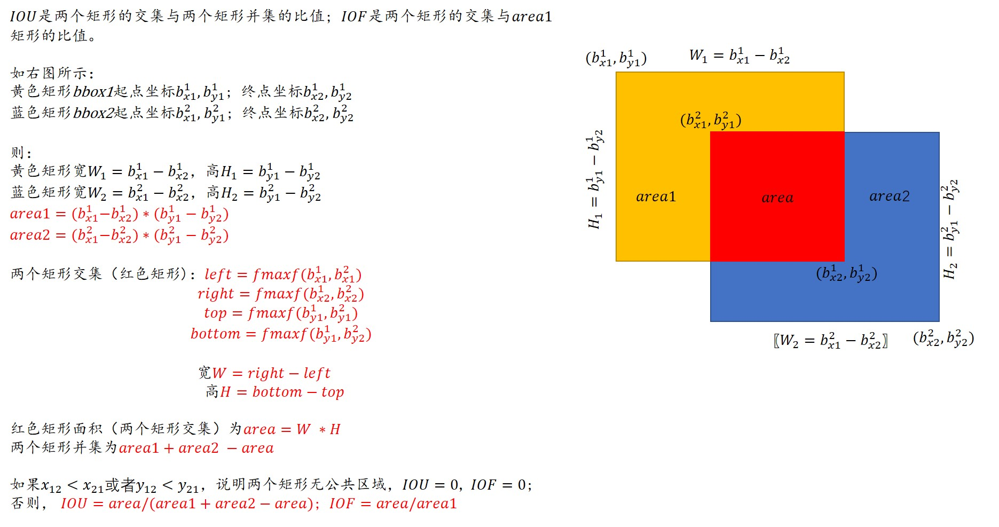
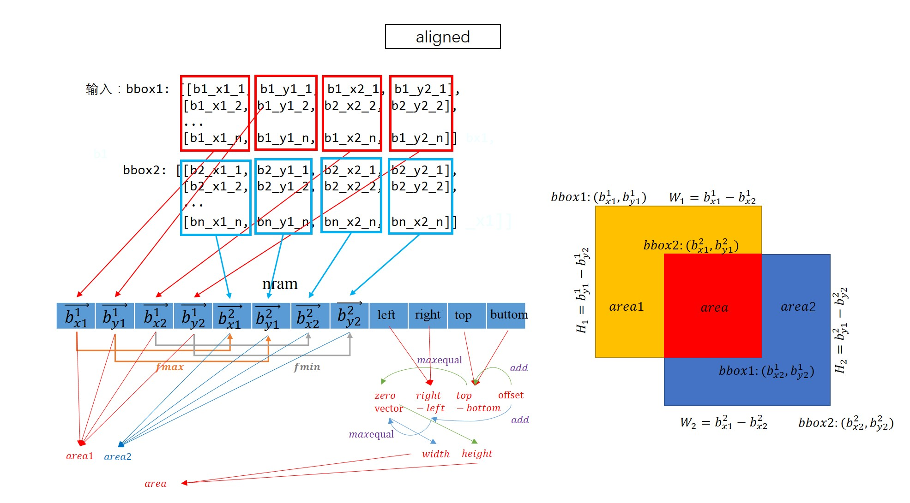

# bbox_overlaps 算子开发设计方案


* #### 文档基本信息

| 算子名称    |  bbox_overlaps                                            |
| ----------- | ------------------------------------------------------------ |
| 编制人/日期 | 郭子滨/2021-06-21                                            |
| 审批人/日期 | 黄志超/2021-06-21                                                |
| 审批人/日期 | 周晨阳/2021-06-21                                              |
| 审批人/日期 | 光昀轶/2021-06-21                                             |

* #### 修改记录

| 版本号| 修订人 | 修订日期 | 修订描述 |
| ----- | ------ | -------  | -------  |
| V1.0  | 郭子滨 | 2021-06-21 | 首次提交 |

* #### 内容描述

本文档为`bbox_overlaps`算子的设计文档，包括需求分析、接口设计、方案设计、性能优化记录和方案实施部分。

* #### 算子需求checklist

算子需求提出者需要`提供`的信息如下：

- 算子接口描述
- 功能描述
- 框架版本 + 对应源码路径
- 需求对应网络
- 网络中用到的规模
- 是否需要支持原位
- 是否需要支持stride机制
- 框架单元测试阈值指标（可选）

## 1 需求分析

### 1.1 算子需求分析

| 算子功能简介| 计算bounding box a、bounding box b集合的交集与并集的比值(IOU) 或者 交集与bounding box a的比值(IOF) 。                   |
|-------------|--------------------------------------------------------------|
| 需求来源    | mmcv                                       |
| 输入数据类型 | half, float                                                  |
| 输入Shape   | input1: [batches_m, 4]; input2: [batches_n, 4]. batches_m, batches_n为大于等于0的任意整数. 如果'aligned'参数为'True'， 则 batches_m = batches_n|
| 输入Layout  | input1: ARRAY; input2: ARRAY                                  |
| 输出数据类型| half, float                                                  |
| 输出Shape   | 若'aligned'参数为'False',则输出shape为[batches_m, batches_n]；若'aligned'参数为'True',则输出shape为(batches_m, 1)  |
| 输出Layout  | ARRAY                                                         |
| 模式(可选) | mode = 0 为计算iou值，mode = 1 为计算iof值                                          |
| 是否需要支持原位        | 否                                                  |
| 是否需要支持stride机制  | 否                                                  |
| 是否需要支持广播  | 否                   |
| 0元素检查是否直接返回  | 是                                                  |

### 1.2 算子功能和应用场景描述

计算bounding box a、bounding box b集合的交集与并集的比值(IOU)或者交集与bounding box a的比值(IOF)。
通常用于计算目标检测网络中，检测框与ground truth的重叠率。当其超过某阈值时，筛选出含有检测对象的前景。或者作为衡量检测框是否正确预测目标的指标。

 

```python
    Example:
        >>> bboxes1 = torch.FloatTensor([
        >>>     [0, 0, 10, 10],
        >>>     [10, 10, 20, 20],
        >>>     [32, 32, 38, 42],
        >>> ])
        >>> bboxes2 = torch.FloatTensor([
        >>>     [0, 0, 10, 20],
        >>>     [0, 10, 10, 19],
        >>>     [10, 10, 20, 20],
        >>> ])
        >>> bbox_overlaps(bboxes1, bboxes2)
        tensor([[0.5000, 0.0000, 0.0000],
                [0.0000, 0.0000, 1.0000],
                [0.0000, 0.0000, 0.0000]])
    Example:
        >>> empty = torch.FloatTensor([])
        >>> nonempty = torch.FloatTensor([
        >>>     [0, 0, 10, 9],
        >>> ])
        >>> assert tuple(bbox_overlaps(empty, nonempty).shape) == (0, 1)
        >>> assert tuple(bbox_overlaps(nonempty, empty).shape) == (1, 0)
        >>> assert tuple(bbox_overlaps(empty, empty).shape) == (0, 0)
```
其中, 若aligned为True, 则bboxes1.size(0)= bboxes2.size(0). mode=0为计算IOUS， mode=1则计算IOFS。

### 1.3 算子输入输出参数要求

| 参数             | 语义                                                         | 类型（输入/输出） | 支持类型               | 物理布局 | 规模限制 |
| ---------------- | ----------------------------------------------------------- | ---------------- | ----------------------| -------- | -------- |
| handle           | 句柄,用于获取当前资源                                         | 输入             | mluOpHandle_t          | /        | 无       |
| mode             | 输出iou，或iof，0为iou，1为iof                                | 输入             |   int                 | /        | 0或1     |
| aligned          | 是否对齐                                                     | 输入             |     bool              | /        | 无       |
| offset           | 是否有坐标的偏置                                              | 输入             |    int                | /        | 0或1     |
| bboxes1_desc     | 对输入数据的信息描述，包含维度、布局和数据类型信息               | 输入             |       /               | /        | 无       |
| bboxes1          | 输入的2维tensor                                              | 输入             | half, float           | ARRAY    | 无       |
| bboxes2_desc     | 对输入数据的信息描述，包含维度、布局和数据类型信                 | 输               | /                     | /        | 无       |
| bboxes2          | 输入的2维tensor                                              | 输入             | half, float           | ARRAY    | 无       |
| ious_desc        | 对输出数据的信息描述，包含维度、布局和数据类型信                 | 输出             | /                     | /        | 无       |
| ious             | 输出的2维tensor                                              | 输出              | half, float           | ARRAY    | 无       |


### 1.4 算子限制

| 限制类型    | 详细说明                                            |
| ----------- | ------------------------------------------------------------ |
| 数据类型限制| 只支持half和float数据类型，若输入half，则输出是half，反之亦然     |
| 布局限制    | 支持二维的tensor，且最后一维维度必须是4或者第一维维度是0       |
| 规模限制    | 无                                            |
| 功能限制    | 无                            |
| 数据范围限制| 对于输入为<x1, x2, y1, y2>的数据，需满足x2 > x1, y2 > y1,否则boudingbox无物理意义，结果不保证正确性。          |
| 原位限制    | 不支持原位|
| stride限制  | 不支持stride机制|
| 广播限制    | 不支持广播|
| nan，inf限制   | 暂不支持有nan值的输入，也需要排除输入有inf-inf或-inf-(-inf)的情况(因为结果为nan，实质造成的影响是输入有nan)   |
| 输入范围限制 | 为保证3e-3的精度，200系列的板卡half和float的输入值取值范围为[-300,100] |

### 1.5 验收标准

#### 1.5.1 精度验收标准

- 按照[精度验收标准](../../MLU-OPS-Accuracy-Acceptance-Standard.md)的要求明确本算子的精度标准。
  - 算子精度验收标准：[diff1,diff2]
  - 算子精度阈值描述：[3e-3,3e-3]

#### 1.5.2 性能验收标准

- 见 [MLU-OPS 性能验收标准](../../../MLU-OPS-Performance-Acceptance-Standard.md)。

## 2 算子接口设计

### 2.1 参考接口

- mmcv/mmcv/ops/csrc/parrots/bbox_overlaps.cpp

```c++
void bbox_overlaps_cuda(const Tensor bboxes1, const Tensor bboxes2, Tensor ious,
                        const int mode, const bool aligned, const int offset);
```


### 2.2 接口设计

```c++
mluOpStatus_t MLUOP_WIN_API mluOpBboxOverlaps(mluOpHandle_t handle,
                                              const int mode,
                                              const bool aligned,
                                              const int offset,
                                              const mluOpTensorDescriptor_t bbox1_desc,
                                              const void *bbox1,
                                              const mluOpTensorDescriptor_t bbox2_desc,
                                              const void *bbox2,
                                              const mluOpTensorDescriptor_t ious_desc,
                                              void *ious);
```


## 3 实现方案设计

### 3.1 实现方案
1. aligned:

将输入数据的坐标的纵向(batch方向)作为向量copy至nram上进行计算



2. aligned not
将box1中的每一组坐标set为与box2中的坐标向量长度一致的向量


### 3.2 伪代码实现
```c++
int32_t num_loop_cpy = num_bbox2 / batches_stride;
int32_t num_rem_cpy_batches = num_bbox2 % batches_stride;
num_loop_cpy = num_rem_cpy_batches > 0 ? num_loop_cpy + 1 : num_loop_cpy;
for (int32_t i = 0; i < batch_per_task; i++) {
  int32_t index1 = batch_start + i;
  int32_t b1 = index1;
  int32_t base1 = b1 * 4;
  // set bbox1 and bbox2 to nram
  __bang_write_value(vec_b1_x1, batches_stride, bbox1[base1]);
  __bang_write_value(vec_b1_y1, batches_stride, bbox1[base1 + 1]);
  __bang_write_value(vec_b1_x2, batches_stride, bbox1[base1 + 2]);
  __bang_write_value(vec_b1_y2, batches_stride, bbox1[base1 + 3]);
  for (int32_t j = 0; j < num_loop_cpy; j++) {
    int32_t index2 = j * batches_stride;
    int32_t handle_batches =
        index2 + batches_stride > num_bbox2 ? num_rem_cpy_batches : batches_stride;
    int32_t b2 = index2;
    int32_t base2 = b2 * 4;
    // copy bbox2 to nram
    __memcpy(vec_b2_x1, &bbox2[base2], sizeof(T), GDRAM2NRAM, sizeof(T), 4 * sizeof(T),
             handle_batches - 1);
    __memcpy(vec_b2_y1, &bbox2[base2 + 1], sizeof(T), GDRAM2NRAM, sizeof(T), 4 * sizeof(T),
             handle_batches - 1);
    __memcpy(vec_b2_x2, &bbox2[base2 + 2], sizeof(T), GDRAM2NRAM, sizeof(T), 4 * sizeof(T),
             handle_batches - 1);
    __memcpy(vec_b2_y2, &bbox2[base2 + 3], sizeof(T), GDRAM2NRAM, sizeof(T), 4 * sizeof(T),
             handle_batches - 1);
    // get the width and height
    __bang_maxequal(vec_left, vec_b1_x1, vec_b2_x1, batches_stride);
    __bang_minequal(vec_right, vec_b1_x2, vec_b2_x2, batches_stride);
    __bang_maxequal(vec_top, vec_b1_y1, vec_b2_y1, batches_stride);
    __bang_minequal(vec_bottom, vec_b1_y2, vec_b2_y2, batches_stride);
    // right - left + offset ---> left
    __bang_sub(vec_left, vec_right, vec_left, batches_stride);
    __bang_add_scalar(vec_left, vec_left, (T)offset, batches_stride);
    // bottom - top + offset ---> right
    __bang_sub(vec_right, vec_bottom, vec_top, batches_stride);
    __bang_add_scalar(vec_right, vec_right, (T)offset, batches_stride);
    // zero vector ---> bottom
    __bang_write_value(vec_bottom, batches_stride, (T)0);
    // width --> vec_left
    __bang_maxequal(vec_left, vec_bottom, vec_left, batches_stride);
    T *width = vec_left;
    // height --> vec_right
    __bang_maxequal(vec_right, vec_bottom, vec_right, batches_stride);
    T *height = vec_right;
    // get the b1_area
    // (b1_x2 - b1_x1 + offset)  --->  vec_top
    __bang_sub(vec_top, vec_b1_x2, vec_b1_x1, batches_stride);
    __bang_add_scalar(vec_top, vec_top, (T)offset, batches_stride);
    // (b1_y2 - b1_y1 + offset)  --->  vec_bottom
    __bang_sub(vec_bottom, vec_b1_y2, vec_b1_y1, batches_stride);
    __bang_add_scalar(vec_bottom, vec_bottom, (T)offset, batches_stride);
    // b1_area = (b1_x2 - b1_x1 + offset) * (b1_y2 - b1_y1 + offset) ---> vec_top;
    __bang_mul(vec_top, vec_top, vec_bottom, batches_stride);
    T *b1_area = vec_top;
    // get the b2_area
    // (b2_x2 - b2_x1 + offset)  --->  b2_x1
    __bang_sub(vec_b2_x1, vec_b2_x2, vec_b2_x1, batches_stride);
    __bang_add_scalar(vec_b2_x1, vec_b2_x1, (T)offset, batches_stride);
    // (b2_y2 - b2_y1 + offset)  --->  b2_y1
    __bang_sub(vec_b2_y1, vec_b2_y2, vec_b2_y1, batches_stride);
    __bang_add_scalar(vec_b2_y1, vec_b2_y1, (T)offset, batches_stride);
    // b2_area = (b2_x2 - b2_x1 + offset) * (b2_y2 - b2_y1 + offset) ---> b2_x1;
    __bang_mul(vec_b2_x1, vec_b2_x1, vec_b2_y1, batches_stride);
    T *b2_area = vec_b2_x1;
    // interS = width * height
    __bang_mul(height, width, height, batches_stride);
    T *interS = height;
    // offset vector ---> vec_b2_y1
    __bang_write_value(vec_b2_y1, batches_stride, T(offset));
    T *vec_offset = vec_b2_y1;
    T *baseS;
    if (mode == 0) {
      __bang_add(b1_area, b1_area, b2_area, batches_stride);
      __bang_sub(b1_area, b1_area, interS, batches_stride);
      __bang_maxequal(b1_area, vec_offset, b1_area, batches_stride);
      baseS = b1_area;
    } else {
      __bang_maxequal(b1_area, vec_offset, b1_area, batches_stride);
      baseS = b1_area;
    }
    // ious = interS / baseS
    computeDiv(width, interS, baseS, vec_b2_x2, batches_stride);
    int32_t gdram_offset = index1 * num_bbox2 + index2;
    __memcpy((T *)ious + gdram_offset, width, handle_batches * sizeof(T), NRAM2GDRAM);
  }
}

`
# 3.3 多核拆分
3.1图中所示，按照batch维度进行拆分
# 3.4 性能优化设计
nram划分为12部分，尽可能分别将bbox1的每一列尽可能多的数据拷入至nram，将原本的元素计算逻辑转化成向量计算逻辑。
`c++
int32_t nram_stride = MAX_NRAM_SIZE / 1024 / 12 * 1024;
int32_t align_bytes = PAD_DOWN(nram_stride, ALIGN_SIZE);
void *vec_b1_x1 = nmem_buf;
void *vec_b1_y1 = nmem_buf + nram_stride;
void *vec_b1_x2 = nmem_buf + 2 * nram_stride;
void *vec_b1_y2 = nmem_buf + 3 * nram_stride;
void *vec_b2_x1 = nmem_buf + 4 * nram_stride;
void *vec_b2_y1 = nmem_buf + 5 * nram_stride;
void *vec_b2_x2 = nmem_buf + 6 * nram_stride;
void *vec_b2_y2 = nmem_buf + 7 * nram_stride;
void *vec_left = nmem_buf + 8 * nram_stride;
void *vec_right = nmem_buf + 9 * nram_stride;
void *vec_top = nmem_buf + 10 * nram_stride;
void *vec_bottom = nmem_buf + 11 * nram_stride;

// ....
for (int32_t i = 0; i < num_loop_cpy; i++) {
    int32_t index = batch_start + i * batches_stride;
    int32_t handle_batches =
        index + batches_stride > num_bbox1 ? num_rem_cpy_batches : batches_stride;
    int32_t b1 = index;
    int32_t b2 = index;
    int32_t base1 = b1 * 4;
    __memcpy(vec_b1_x1, &bbox1[base1], sizeof(T), GDRAM2NRAM, sizeof(T), 4 * sizeof(T),
             handle_batches - 1);
    __memcpy(vec_b1_y1, &bbox1[base1 + 1], sizeof(T), GDRAM2NRAM, sizeof(T), 4 * sizeof(T),
             handle_batches - 1);
    __memcpy(vec_b1_x2, &bbox1[base1 + 2], sizeof(T), GDRAM2NRAM, sizeof(T), 4 * sizeof(T),
             handle_batches - 1);
    __memcpy(vec_b1_y2, &bbox1[base1 + 3], sizeof(T), GDRAM2NRAM, sizeof(T), 4 * sizeof(T),
             handle_batches - 1);
    int32_t base2 = b2 * 4;
    __memcpy(vec_b2_x1, &bbox2[base2], sizeof(T), GDRAM2NRAM, sizeof(T), 4 * sizeof(T),
             handle_batches - 1);
    __memcpy(vec_b2_y1, &bbox2[base2 + 1], sizeof(T), GDRAM2NRAM, sizeof(T), 4 * sizeof(T),
             handle_batches - 1);
    __memcpy(vec_b2_x2, &bbox2[base2 + 2], sizeof(T), GDRAM2NRAM, sizeof(T), 4 * sizeof(T),
             handle_batches - 1);
    __memcpy(vec_b2_y2, &bbox2[base2 + 3], sizeof(T), GDRAM2NRAM, sizeof(T), 4 * sizeof(T),
             handle_batches - 1);
    // ....
```
因片上空间划分太零碎，使用流水技术优化后，片上空间会更零碎，预期收益不高。
可优化点：
1. 将需要计算的数据拷入nram，做一次转置操作，优化4次的memcpy操作。
2. 对于aligned=false的情况，将行数较多的tensor作为input，但这么做需要将结果多做一次转置操作，具体的性能提升还需测试后得出。

### 3.5 方案理论性能

### 3.6 可维护性设计

### 3.7 测试用例设计

### 3.8 算子防呆检查

1. 输入描述符非空检查
2. 是否是0元素的检查
3. mode是否为0或1的检查
4. bounding-box的最低维为4
5. offset是否为0或者1检查
6. 输入非空检查
7. 输入类型检查(float 或者 half)
8. 若aligned = true，则bounding-box1、2的行数需相等，输出ious的维度总数为1且维度0为bounding-box1或2的行数。
   若aligned = False，输出ious的维度总数为2且维度0为bounding-box1的行数，维度1为bounding-bo21的行数

## 4 算子性能优化记录
无

### 4.1 当前存在问题的规模说明

暂不支持有nan值的输入，也需要排除输入有inf-inf或-inf-(-inf)的情况(因为结果为nan，实质造成的影响是输入有nan)

### 4.2 已经过优化的规模说明

无


## 5 方案实施

### 5.1 开发计划

- 6.14 - 6.18 调研bbox_overlaps需求及源码实现
- 6.21 - 6.25 编写设计文档
- 6.28 - 7.2 完成mlu kernel开发
- 7.5 - 7.7 完成host端逻辑开发
- 7.8- 7.13 gtest代码开发
- 7.14 - 7.21 generator代码开
- 7.22- 7.29 测试
- 7.30 - 8.3 支持inf nan测试
- 8.4 -8.10 测试报告 + 代码review
- 8.10 代码入库

### 5.2 风险分析
