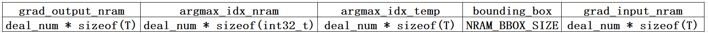

# border_align_backward算子开发设计方案


* #### 文档基本信息

| 算子名称    | border_align_backward                                       |
| ----------- | ----------------------------------------------------------|
| 编制人/日期 |    郑斌/2022-4-18                                            |

* #### 修改记录

| 版本号  | 修订人 | 修订日期 | 修订描述 |
| ------ | ------ | -------- | ----|
| V1.0   | 郑斌   | 2022-4-18 | 首次提交 |
| V2.0   | 王远   | 2023-7-15 | 支持 `nan,inf`，代码重构 |

* #### 内容描述

本文档为`border_align_backward`算子的设计文档，包括需求分析、接口设计、方案设计、性能优化记录。

* #### 算子需求checklist


算子需求提出者需要`check`的部分如下：

- 1.1 算子需求分析
- 1.2 算子功能和应用场景描述
- 1.3 算子输入输出参数要求
- 1.4 算子限制
- 1.5 验收标准
- 2.2 接口设计
- 3.5 测试用例（需求提出者`check`算子需求表中所给规模是否列出）

## 1 需求分析

### 1.1 算子需求分析

| 算子功能简介                                                 | border_align的反向算子，根据输入grad_output、boxes和argmax_idx求取grad_input。 |
| ------------------------------------------------------------ | ----------------------------------------- |
| 需求来源                                                     | mmcv                        |
| 应用网络                                                     |  BorderDet                   |
| 输入数据类型                                                 |  grad_output和boxes的类型为half/float，pool_size的类型为int32_t                         |
| 输入Shape                                                    |  grad_output: [N, K, 4, C], boxes: [N, K, 4], argmax_idx: [N, K, 4, C]
| 输入Layout                                                   | input: NHWC             |
| 输出数据类型                                                 | grad_input的类型为half/float                          |
| 输出Shape                                                    |  [N, H, W, 4C]
| 输出Layout                                                   | NHWC                                    |
| 模式(可选）                                                  |   无                                       |
| 是否含有dim/axis等类似语义的参数且该参数支持负数/其他特殊处理 | 否                                        |
| 是否含有labels/index等类似语义的参数且该参数支持负数/界外情况/其他特殊处理 | 否                                        |
| 是否需要支持原位                                             | 否                                   |
| 是否需要支持stride机制                                       | 否                                        |
| 是否需要支持广播                                             | 否                                        |
| 0元素检查是否直接返回                                        | 是（返回MLUOP_STATUS_BAD_PARAM）                                        |
| 其他特殊需求(在线量化，融合，转数提前等，可选)               |        无                                   |
| 本次开发优先支持的规模/模式                                  |        无                                   |


### 1.2 算子功能和应用场景描述

​    `border_align_backward`是border_align的反向算子，根据输入grad_output、boxes和argmax_idx求取grad_input。

​    该算子的应用场景：`BorderDet`网络。 
例：
```python
grad_output = torch.tensor([[[[ 3.,  6.,  1.,  2.],
                              [ 4.,  7., -1.,  1.],
                              [ 3.,  7.,  1.,  2.],
                              [ 4.,  6., -1.,  1.],
                              [ 2., 12., -1., -1.],
                              [ 3., 12., -1.,  2.],
                              [ 3.,  7.,  1.,  2.],
                              [ 4.,  7., -1.,  1.],
                              [ 6., 12., -1., -2.],
                              [ 4., 12., -1.,  1.],
                              [ 4.,  9., -1.,  1.],
                              [ 4., 11., -1.,  1.]]]], device='cuda:0')

boxes_arr=torch.tensor([[[0., 0., 2., 1.],
                         [1., 0., 3., 1.],
                         [1., 0., 2., 1.],
                         [0., 0., 3., 1.],
                         [0., 0., 1., 2.],
                         [0., 0., 2., 2.],
                         [1., 0., 2., 1.],
                         [1., 0., 3., 1.],
                         [0., 1., 1., 2.],
                         [0., 0., 3., 2.],
                         [1., 0., 3., 2.],
                         [2., 0., 3., 2.]]], device='cuda:0')
argmax_idx=torch.tensor([[[[1, 0, 0, 1],
                           [1, 0, 0, 1],
                           [1, 0, 0, 1],
                           [1, 0, 0, 1],
                           [1, 1, 0, 1],
                           [1, 1, 0, 1],
                           [1, 0, 0, 1],
                           [1, 0, 0, 1],
                           [1, 1, 0, 0],
                           [1, 1, 0, 1],
                           [1, 1, 0, 1],
                           [1, 1, 0, 1]]]], device='cuda:0', dtype=torch.int32)
 grad_input = grad_output.new_zeros(1, 4, 3, 4).cuda() 
 ext_module.border_align_backward(grad_output, boxes, argmax_idx, grad_input, 1)

>>> grad_input
tensor([[[[ 0.,  4., 24., 48.],
          [ 0., 12.,  0.,  0.],
          [ 0.,  0.,  0.,  0.]],

         [[24., 56.,  0.,  0.],
          [ 0.,  0.,  0.,  0.],
          [96., 18., 22.,  0.]],

         [[ 0.,  0.,  0.,  0.],
          [ 0.,  0.,  6., -6.],
          [ 0., -4., -2., -6.]],

         [[ 0., -2., 16., 12.],
          [ 0.,  0.,  0.,  0.],
          [ 0., -4.,  0.,  0.]]]], device='cuda:0')
```
### 1.3 算子输入输出参数要求

| 参数        | 语义               | 类型（输入/输出） | 支持类型     | 物理布局 | 规模约束 |
| ----------- | ------------------ | ----------------- | ------------ | -------- | -------- |
| handle      | MLU-OPS 句柄，保存运行的上下文信息   | 输入              | mluOpHandle_t | /        | /       |
| grad_output_desc | 输入grad_output的描述信息 | 输入              |  /  | /      | grad_output的维度必须为4       |
| grad_output     | 输入数据，指向grad_output的mlu地址的指针           | 输入              | half, float | NHWC |   /    |
| boxes_desc | 输入 box 的描述信息   | 输入              | /  | /        | boxes的维度必须为3且最后一维必须为4       |
| boxes      | 输入数据，指向boxes的mlu地址的指针          | 输入              |half, float  | ARRAY | /       |
| argmax_idx_desc | 前向算子计算出最大值对应的idx的描述信息   | 输入              | /  | /        | /       |
| argmax_idx      | 输入数据，指向argmax_idx的mlu地址的指针          | 输入              |int32_t  | NHWC | /       |
| pool_size        | 池化核尺寸                          |输入                 |int32_t       |      scalar|/  |
|grad_input_desc | 输出的描述信息 | 输入              |  /  | /      | grad_input的维度必须为4且最后一个维度为4的倍数      |
| grad_input     | 输出数据，指向grad_input的mlu地址的指针           | 输出             | half, float | NHWC | /       |
  

### 1.4 算子限制
| 限制类型   | 详细说明       |
| ---------- | -------------- |
| 原位限制   | 不支持原位     |
| stride限制 | 不支持`stride`机制 |
| 广播限制   | 不支持广播     |
|数据范围|算子不支持nan和inf|
| 数据类型 |支持`half`、`float`，且`grad_input`、`grad_output`和`boxes`须保持一致，`argmax_idx`必须为int类型|
|规模限制|grad_output的维度必须为4 ,第三个维度的dim为4，第一个维度、第二个维度 分别和boxes的第一维度、第二维度一致。boxes的维度必须为3且最后一维必须为4。argmax_idx维度必须和grad_output一致。grad_input的维度必须为4且最后。一个维度为4的倍数，第一个维度和grad_output的第一个维度保持一致。|

### 1.5 验收标准

#### 1.5.1 精度验收标准

- MLU-OPS精度验收标准：该算子为pool算子。
- 300系列的评价公式为`diff1、diff2、diff4`，验收标准采用动态阈值[10,10,1]。
- 因为fma不对齐问题，如果测例在300系列上不通过，需要将测例更改为cpu模式，此时采用静态阈值：half：1e-3，float：1e-5。

#### 1.5.2 性能验收标准

- IO效率或计算效率至少有一个不低于50%。
- 部分效率比较低的规模在4.算子性能优化记录中进行说明。
- 附上算子测试报告链接，测试报告必须包括框架给出的网络中规模的性能数据以及对应效率值。

竞品性能测试

| 平台                 |  数据类型 | grad_ouput规模            | boxes规模            |argmax_idx规模            |计算效率(%)  | IO效率(%)    | Hardware time(us) |
| -------------------- |  -------- | --------------- | --------------- |--------------- |---------- | ---------- | ----------------- |
| Tesla V100-SXM2-16GB |  float16  | [2,256,70,4]  | [2,70,4]  |[2,256,70,4]  |37.51 | 11.51 | 55.74        |
|                      |  float32  | [2,256,70,4]  | [2,70,4]  |[2,256,70,4]  |31.77 | 13.86 |18.91        |
|                      |  float16  | [2,256,950,4] | [2,950,4] |[2,256,950,4] |47.4 | 14.3 | 1500        |
|                      |  float32  | [2,256,950,4] | [2,950,4] |[2,256,950,4] |48.04 | 16.57  | 189.22       |
|                      |  float16  | [2,128,70,4] | [2,70,4]   |[2,128,70,4]  |22.64 |7.01 | 46        |
|                      |  float32  | [2,128,70,4] | [2,70,4]   |[2,128,70,4]  |31.64|9.39 | 13.73         |

## 2 算子接口设计

### 2.1 参考接口

- MMCV

```c++
void BorderAlignBackwardCUDAKernelLauncher(const Tensor &grad_output,
                                           const Tensor &boxes,
                                           const Tensor &argmax_idx,
                                           Tensor grad_input,
                                           const int32_t pool_size);

```

### 2.2 接口设计

```c++
// 给出mlu-ops算子接口 
mluOpStatus_t mluop_WIN_API 
mluOpBorderAlignBackward(mluOpHandle_t handle,
                         const mluOpTensorDescriptor_t grad_output_desc,
                         const void *grad_output,
                         const mluOpTensorDescriptor_t boxes_desc,
                         const void *boxes,
                         const mluOpTensorDescriptor_t argmax_idx_desc,
                         const void *argmax_idx,
                         const int32_t pool_size,
                         const mluOpTensorDescriptor_t grad_input_desc,
                         void *grad_input);
```
## 3 实现方案设计

### 3.1 实现方案
 
**计算原理说明：**
 
`grad_output.shape = [N, K, 4, C]`。

`boxes.shape = [N, K, 4]`。

`argmax_idx = [N, K, 4, C]`。

在计算 `grad_input` 时，将每组 `box`(坐标为 `[x0,y0,x1,y1]` )的 `height,width` 均分为 `pool_size + 1`份，计算得分段后的 `x_stride,y_stride`。

通过 `x_stride,y_stride` 遍历 `box` 的四条边，通过双线性插值算法计算得每个坐标点所对应的四邻点信息：权重 `w`、四邻点坐标`x_low,x_high,y_low,y_high`，最终通过原子加操作将梯度更新至 `grad_input` 相应位置。
 
**实现方案：** 

`core` 间拆 `grad_output(shape = [N, K, 4, C])` 的前三维度 `N*K*4`，每个 `core` 处理的数量为 `deal_num`。

1. 第一层循环，`core` 内对 `deal_num` 做遍历，并将对应的 `box` 坐标捞到片上。
2. 第二层循环，`C`较大时无法一次处理整个 `C`，因此对`C`做遍历，依据片上空间计算一次能处理的长度`C_seg`，直至处理完整个 `C`。
3. 第三层循环，对 `box` 的指定边做 `pool_size + 1` 次双线性插值，遍历过程中通过 `argmax_id` 计算得 `shape=[1,C_seg]` 的 `mask`，`argmax_idx` 中数值与 `pool_size + 1` 相等的位置处`mask`数值为`1`，其他位置值为`0`。最终通过 `mask` 更新 `grad_input`。

nram划分：




### 3.2 伪代码实现（可选）

伪代码表示如下：
```c++
/*
 * NRAM partition
 *  |--------------------------------------|
 *  |    grad_output    |    grad_intput   |
 *  |--------------------------------------|
 *  |    argmax_idx     |    boxes         |
 *  |--------------------------------------|
 */
const int32_t deal_num = PAD_DOWN(
    (MAX_NRAM_SIZE - NFU_ALIGN_SIZE) / (2 * sizeof(T) + 1 * sizeof(int32_t)),
    NFU_ALIGN_SIZE);
T *nram_boxes = (T *)nram_buffer;
T *nram_grad_output = (T *)((char *)nram_buffer + NFU_ALIGN_SIZE);
T *nram_grad_input = (T *)nram_grad_output + deal_num;
int32_t *nram_argmax_idx = (int32_t *)((T *)nram_grad_input + deal_num);

// partition grad_output(shape = [N, K, 4, C])
const int32_t total_num = N * K * 4;
const int32_t num_per_core =
    total_num / taskDim + int32_t((total_num % taskDim) > taskId);

for (int32_t i = 0; i < num_per_core; ++i) {
  const int32_t idx = taskId + i * taskDim;
  const int32_t n = idx / K / 4;
  const int32_t k = idx / 4 % K;
  const int32_t border_idx = idx % 4;
  
  // load boxes
  __memcpy((void *)nram_boxes, (void *)((T *)boxes + idx / 4 * 4),
            4 * sizeof(T), GDRAM2NRAM);

  const int32_t c_repeat = C / deal_num;
  const int32_t c_rem = C % deal_num;
  for (int32_t c_seg_idx = 0; c_seg_idx < c_repeat; ++c_seg_idx) {
    compute();
  }
  if (c_rem != 0) {
    const int32_t c_rem_align = PAD_UP(c_rem, NFU_ALIGN_SIZE);
    compute();
  }
}

compute() {
  for (int32_t i = 0; i < pool_size + 1; ++i) {
    // bilinearInterpolate
    bilinearInterpolate(...);

    // load argmax, creat mask
    __memcpy(nram_argmax_idx, argmax_idx + src_offset, deal_num * sizeof(int32_t), GDRAM2NRAM);
    __bang_write_value(nram_grad_output, deal_num_align, (T)i);
    if (sizeof(T) == sizeof(float)) {
      __nram__ int32_t table[COMPUTE_COUNT_ALIGN] = {0, (int32_t)0xffffffff};
      __bang_int322float((float *)nram_argmax_idx, (int32_t *)nram_argmax_idx, deal_num, 0);  // NOLINT
      __bang_eq((T *)nram_argmax_idx, (T *)nram_argmax_idx, nram_grad_output, deal_num_align);  // NOLINT
      __bang_float2int32((int32_t *)nram_argmax_idx, (float *)nram_argmax_idx, deal_num_align, 0);  // NOLINT
      __bang_lut_s32((int32_t *)nram_argmax_idx, (int32_t *)nram_argmax_idx, table, deal_num_align, COMPUTE_COUNT_ALIGN);  // NOLINT
    } else {
      __nram__ int16_t table[2] = {0, (int16_t)0xffff};
      __bang_int322half((half *)nram_argmax_idx, (int32_t *)nram_argmax_idx, deal_num, 0);  // NOLINT
      __bang_eq((T *)nram_argmax_idx, (T *)nram_argmax_idx, nram_grad_output, deal_num_align);  // NOLINT
      __bang_half2int16_rd((int16_t *)nram_argmax_idx, (half *)nram_argmax_idx, deal_num_align, 0);  // NOLINT
      __bang_lut_s16((int16_t *)nram_argmax_idx, (int16_t *)nram_argmax_idx, table, deal_num_align, COMPUTE_COUNT_ALIGN);  // NOLINT
    }

    // CALCULATE_GRAD_INPUT
    // w1,w2,w3,w4 分别为周围四个点的权重
    __bang_atomic_reduce_add(w1...);
    __bang_atomic_reduce_add(w2,...);
    __bang_atomic_reduce_add(w3,...);
    __bang_atomic_reduce_add(w4,...);
    ...
  }
}
```

### 3.3 拆分
### (任务拆分，多核拆分)

`core`间拆 `grad_output(shape = [N, K, 4, C])` 的前三维度 `N*K*4`，每个`core` 处理数量为 `deal_num`。

### 3.4 性能优化设计

1. `atomic_add`是io指令，无法使用流水来做优化。

### 3.5 方案理论性能
### 3.6 可维护性设计

1、变量、函数和类名按照MLUOPS命名规范，尽力做到只读名称而不需读注释就能读懂代码。

2、每个函数确保只实现一个功能，尽可能缩短函数的长度。

3、合理的防呆设计。

4、关键信息打印到log中。

### 3.7 测试用例设计

框架在需求列表中给出的算子在网络中用到的规模：

- grad_output:[2, 70, 4, 256] boxes:[2, 70, 4] argmax_idx:[2, 70, 4, 256] pool_size:10
- grad_output:[2, 950, 4, 256] boxes:[2, 950, 4] argmax_idx:[2, 950, 4, 256] pool_size:10
- grad_output:[2, 70, 4, 128] boxes:[2, 70, 4] argmax_idx:[2, 70, 4, 128] pool_size:10

随机测例：
- grad_output:[3, 5, 4, 1] boxes:[3, 5, 4] argmax_idx:[3, 5, 4, 1] pool_size:8
- grad_output:[10, 80, 4, 10] boxes:[3, 80, 4] argmax_idx:[10, 80, 4, 10] pool_size:2

反向测试：生成一些随机input、boxes和argmax_idx，校验防呆能够报error（后续补充）。

### 3.8 算子防呆检查

以下情形防呆报错并返回错误码 `MLUOP_STATUS_BAD_PARAM`：

 1、输入和输出指针为空。

 2、输入为0元素。

 3、对数据类型做检查，grad_output和boxes数据类型不为half且不为float类型，argmax_idx类型不为int32_t。

 4、对输入boxes的shape做防呆检查，维度不为3或者最后一个维度不为4。

 5、对输入grad_output的shape做防呆检查，维度不为4。

 6、对输入argmax_idx的shape做防呆检查，维度不为4。

 7、对输出grad_input的shape做防呆检查，维度不为4或者最后一个维度不为4的倍数。

 8、对输入argmax_idx和grad_output的shape做防呆检查，维度不为4或者dim不相等。

 9、对输入grad_output和boxes的前两个维度做防呆检查，不相等返回MLUOP_STATUS_BAD_PARAM。

## 4 算子性能优化记录

### 4.1 当前存在问题的规模说明

### 4.2 已经过优化的规模说明

此项仅填写未在4.1中列出的规模，否则填入4.1.
