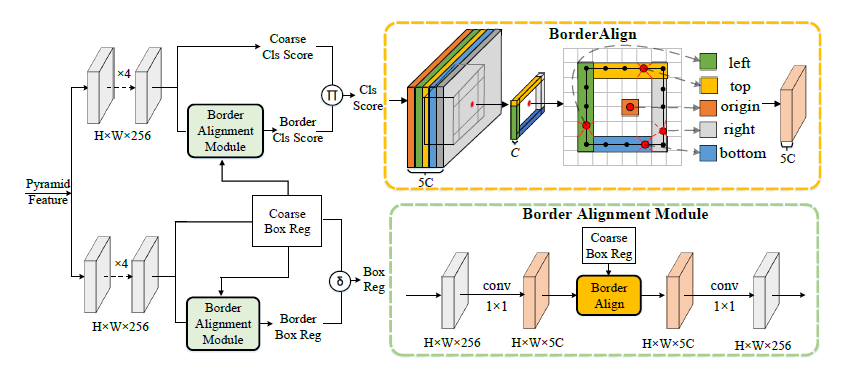

# border_align_forward算子开发设计方案

* #### 文档基本信息

| 算子名称    | border_align_forward                                        |
| --------- | ------------------------------------------------------------ |
| 编制人/日期 |    郑斌/2022-1-5                                             |
| 审批人/日期 |    周晨阳/2022-1-10                                          |
| 审批人/日期 |    王远/2022-1-10                                            |
| 审批人/日期 |    李卓华/2022-4-20                                           |

* #### 修改记录

| 版本号  | 修订人 | 修订日期 | 修订描述 |
| ------ | ----- | -------- | -------- |
| V1.0   | 郑斌   | 2022-1-5 | 首次提交 |
| V2.0   | 王远   | 2023-8-3 | 方案无调整，重构代码 |

* #### 内容描述

本文档为`border_align_forward`算子的设计文档，包括需求分析、接口设计、方案设计、性能优化记录和方案实施部分。

* #### 算子需求checklist


算子需求提出者需要`check`的部分如下：

- 1.1 算子需求分析
- 1.2 算子功能和应用场景描述
- 1.3 算子输入输出参数要求
- 1.4 算子限制
- 1.5 验收标准
- 2.2 接口设计
- 3.5 测试用例（需求提出者`check`算子需求表中所给规模是否列出）

## 1 需求分析

### 1.1 算子需求分析

| 算子功能简介                                                 | 用于边界检测，通过提取物体边界的极值点来优化网络特征。 |
| ------------------------------------------------------------ | ----------------------------------------- |
| 需求来源                                                     | mmcv                        |
| 应用网络                                                     |  BorderDet                   |
| 输入数据类型                                                 |  input和boxes的类型为half/float，pool_size的类型为int32_t                         |
| 输入Shape                                                    |  input: [N, H, W, 4C], boxes: [N, K, 4]
| 输入Layout                                                   | input: NHWC             |
| 输出数据类型                                                 | output数据类型和input保持一致，argmax_idx输出类型为int32_t                          |
| 输出Shape                                                    |  outputput:[N, K, 4, C], argmax_idx:[N, K, 4, C]
| 输出Layout                                                   | NHWC                                    |
| 模式(可选）                                                  |   无                                       |
| 是否含有dim/axis等类似语义的参数且该参数支持负数/其他特殊处理 | 否                                        |
| 是否含有labels/index等类似语义的参数且该参数支持负数/界外情况/其他特殊处理 | 否                                        |
| 是否需要支持原位                                             | 否                                   |
| 是否需要支持stride机制                                       | 否                                        |
| 是否需要支持广播                                             | 否                                        |
| 0元素检查是否直接返回                                        | 是（返回MLUOP_STATUS_BAD_PARAM）                                        |
| 其他特殊需求(在线量化，融合，转数提前等，可选)               |        无                                   |
| 本次开发优先支持的规模/模式                                  |        无                                   |


### 1.2 算子功能和应用场景描述



`border_align_forward`用于边界检测，它通过提取物体边界的极值点来优化网络特征。根据输入`boxes`提取输入`input`的边界特征，通过最大池化输出边界的最大特征。

该算子的应用场景：`BorderDet`网络。 例：

```python
input_arr=torch.tensor([[[[ 1.,  2.,  3.,  4.],
                       [ 5.,  6.,  7.,  8.],
                       [ 9., 10., 11., 12.]],
                      
                      [[ 6.,  7.,  5.,  8.],
                       [ 2.,  1.,  3.,  4.],
                       [12.,  9., 11., 10.]],
                      
                      [[-2., -3.,  2.,  0.],
                       [-4., -5.,  1., -1.],
                       [-1., -1., -1., -1.]],
                      
                      [[ 0., -1.,  2.,  1.],
                       [-4., -3., -2., -1.],
                       [-1., -2., -3., -4.]]]], device='cuda:0')

boxes_arr=torch.tensor([[[0., 0., 2., 1.],
                       [1., 0., 3., 1.],
                       [1., 0., 2., 1.],
                       [0., 0., 3., 1.],
                       [0., 0., 1., 2.],
                       [0., 0., 2., 2.],
                       [1., 0., 2., 1.],
                       [1., 0., 3., 1.],
                       [0., 1., 1., 2.],
                       [0., 0., 3., 2.],
                       [1., 0., 3., 2.],
                       [2., 0., 3., 2.]]], device='cuda:0')

 border_align(input_arr,boxes_arr,1) 

 tensor([[[[ 3.,  6.,  1.,  2.],
          [ 4.,  7., -1.,  1.],
          [ 3.,  7.,  1.,  2.],
          [ 4.,  6., -1.,  1.],
          [ 2., 12., -1., -1.],
          [ 3., 12., -1.,  2.],
          [ 3.,  7.,  1.,  2.],
          [ 4.,  7., -1.,  1.],
          [ 6., 12., -1., -2.],
          [ 4., 12., -1.,  1.],
          [ 4.,  9., -1.,  1.],
          [ 4., 11., -1.,  1.]]]], device='cuda:0')
```
### 1.3 算子输入输出参数要求

| 参数        | 语义               | 类型（输入/输出） | 支持类型     | 物理布局 | 规模约束 |
| ----------- | ------------------ | ----------------- | ------------ | -------- | -------- |
| handle      | 句柄，保存运行的上下文信息   | 输入              | mluOpHandle_t | /        | /       |
| input_desc | 输入input的描述信息 | 输入              |  /  | /      | input的维度必须为4且最后一维必须是4的倍数       |
| input     | 输入数据，指向input的mlu地址的指针           | 输入              | half, float | NHWC |   /    |
| boxes_desc | 输入boxes的描述信息   | 输入              | /  | /        | boxes的维度必须为3且最后一维必须为4       |
| boxes      | 输入数据，指向boxes的mlu地址的指针          | 输入              |half, float  | ARRAY | /       |
| pool_size        | 池化核尺寸                          |输入                 |int32_t       |      scalar|/  |
|output_desc | 输出的描述信息 | 输入              |  /  | /      | /       |
| output     | 输出数据，指向output的mlu地址的指针           | 输出             | half, float | NHWC | /       |
| argmax_idx_desc | 输出最大值对应的idx的描述信息   | 输入              | /  | /        | /       |
| argmax_idx      | 输出数据，指向argmax_idx的mlu地址的指针          | 输出              |int32_t  | NHWC | /       |  

### 1.4 算子限制
| 限制类型   | 详细说明       |
| ---------- | -------------- |
| 原位限制   | 不支持原位     |
| stride限制 | 不支持`stride`机制 |
| 广播限制   | 不支持广播     |
|数据范围限制|算子的第二个输入`boxes`不支持nan和inf|
| 数据类型限制 |支持`half`、`float`，且`input`和`output`须保持一致|

### 1.5 验收标准

#### 1.5.1 精度验收标准

- 精度验收标准：动态阈值。

#### 1.5.2 性能验收标准

- IO效率或计算效率至少有一个不低于50%。
- 部分效率比较低的规模在4.算子性能优化记录中进行说明。
- 附上算子测试报告链接，测试报告必须包括框架给出的网络中规模的性能数据以及对应效率值。

## 2 算子接口设计

### 2.1 参考接口

- MMCV

```c++
void BorderAlignForwardCUDAKernelLauncher(const Tensor &input,
                                          const Tensor &boxes,
                                          Tensor output,
                                          Tensor argmax_idx,
                                          const int pool_size)

```
### 2.2 接口设计

```c++
mluOpStatus_t MLUOP_WIN_API
mluOpBorderAlignForward(mluOpHandle_t handle,
                        const mluOpTensorDescriptor_t input_desc,
                        const void *input,
                        const mluOpTensorDescriptor_t boxes_desc,
                        const void *boxes,
                        const int32_t pool_size,
                        const mluOpTensorDescriptor_t output_desc,
                        void *output,
                        const mluOpTensorDescriptor_t argmax_idx_desc,
                        void *argmax_idx);
```
## 3 实现方案设计

### 3.1 实现方案

`tensor.shape`：
- `input` 维度为 `[N, H, W, 4C]`（竞品为`[N, 4C, H, W]`）。
  - `4C` 表示 `C` 组 `top, left, bottom, right`。
  - `H,W` 为 `feature-map` 的高和宽，可通过 `box` 坐标（`x,y`对应`H,W`）获取特征值。
- `boxes` 维度为 `[N, K, 4]`，最后一维数据表示 `box` 左下、右上两处坐标信息 `x1, y1, x2, y2`。
- `output` 维度为 `[N, K, 4, C]`。
- `argmax_idx` 维度为 `[N, K, 4, C]`。


**计算原理说明：**

以 `input.shape=[1, H, W, 4]`、`boxes.shape=[1, 1, 4]` 为例:
- 通过坐标信息计算得 `box` 的 `height`、`width`。
- 分别在 `box` 4 条边上滑动取点，每次滑动的 `stride` 计算如下：
  - `top` ：起始点为`x1,y1`，`x_stride = width / pool_size; y_stride = 0`。
  - `left` ：起始点为`x1,y1`，`x_stride = 0; y_stride = height / pool_size`。
  - `bottom` ：起始点为`x2,y2`，`x_stride = -width / pool_size; y_stride = 0`。
  - `right` ：起始点为`x2,y2`，`x_stride = 0; y_stride = -height / pool_size`。
- 浮点数 `top_x,top_y` 是 `top` 边上的滑动点坐标，使用其附近四个点坐标信息在 `input` 获取特征值，并进行双线性差值计算。遍历整条边可得 `pool_size+1` 个双线性差值结果，选择其中最大值、最大值对应坐标作为输出存储至`output`、`argmax_idx`中。
- 依次完成四条边计算，最终输出 `shape` 为 `[1,1,4,1]`的`output`、`argmax_idx`。

**实现方案：** 

`core` 间拆 `N*K`：
1. 第一层循环，对每个 `core` 需要处理的 `box` 做遍历，每次处理一个 `box`。
2. 第二层循环，对4条 `border` 做遍历。
3. 第三层循环，`C`较大时无法一次处理整个 `C`，因此对`C`做遍历，依据片上空间计算一次能处理的长度`C_seg`，直至处理完整个 `C`。
4. 第四层循环，对 `box` 的指定边做 `pool_size + 1` 次双线性插值，并取最大像素点 `max_val` 和最大像素点的池化次数 `idx` 作为输出。

### 3.2 伪代码实现（可选）

伪代码表示如下：

```c++
  /*
   * NRAM partition
   *  |--------------------------------------------------------|
   *  | Semantics  | NRAM                                      |
   *  |------------|-------------------------------------------|
   *  | PING       | input_lt | input_lb | input_rt | input_rb |
   *  |------------|----------|----------|----------|----------|
   *  | PONG       | input_lt | input_lb | input_rt | input_rb |
   *  |------------|----------|----------|----------|----------|
   *  | Other      | output   |argmax_idx| boxes    |
   *  |---------------------------------------------|
   *
   *  MAX_NRAM_SIZE =
   *      PING {4 * deal_num * sizeof(T)} +
   *      PONG {4 * deal_num * sizeof(T)} +
   *      Other{    deal_num * sizeof(T) +
   *                deal_num * sizeof(int32_t) + 128byte}
   */
  const int32_t pingpong_split_num = 4 + 4;
  const int32_t deal_num =
      PAD_DOWN(((MAX_NRAM_SIZE - NFU_ALIGN_SIZE) /
                (pingpong_split_num * sizeof(T) + sizeof(T) + sizeof(int32_t))),
               NFU_ALIGN_SIZE);
  const int32_t pingpong_gap = 4 * deal_num;


  /*
   * input.shape      = [N, H, W, border_num * C]
   * boxes.shape      = [N, K, coord_num]
   * output.shape     = [N, K, border_num, C]
   * argmax_idx.shape = [N, K, border_num, C]
   * coord_num  = 4;
   * border_num = 4;
   *
   * Partition output:
   *   Split the num of boxes(N*K) among taskDim, Mulitple core
   *   load the different part of the output in each loop.
   *
   * Calculation process:
   *  layer 0: 0 ~ N*K
   *  layer 1: 0 ~ border_num
   *  layer 2: 0 ~ C
   *  layer 3: 0 ~ pool_size
   */
  const int32_t coord_num = 4;
  const int32_t boxes_num = N * K;
  const int32_t boxes_num_per_core =
      boxes_num / taskDim + int32_t((boxes_num % taskDim) > taskId);

  // layer 0: loop over range(0, boxes_num_per_core)
  for (int32_t i = 0; i < boxes_num_per_core; ++i) {
    // load boxes[n, k, :]
    // calculate width,height,x_stride and y_stride
    const int32_t nk_offset = taskId + i * taskDim;
    __memcpy(boxes_nram, (T *)boxes + nk_offset * coord_num,
             coord_num * sizeof(T), GDRAM2NRAM);
    const T box_width = boxes_nram[2] - boxes_nram[0];
    const T box_height = boxes_nram[3] - boxes_nram[1];
    T x_stride = 0;
    T y_stride = 0;

    // layer 1: loop over [0:Top, 1:Left, 2:Bottom, 3:Right]
    for (int32_t border = 0; border < BORDER_NUM; ++border) {
      switch (border) {
        case 0: {  // Top
          x_stride = box_width / pool_size;
          y_stride = 0;
        } break;
        case 1: {  // Left
          x_stride = 0;
          y_stride = box_height / pool_size;
        } break;
        case 2: {  // Bottom
          x_stride = -box_width / pool_size;
          y_stride = 0;
        } break;
        case 3: {  // Right
          x_stride = 0;
          y_stride = -box_height / pool_size;
        } break;
      }
      /* boxes[n,k,0:4] indicates the information on the bottom left
         and top right points: [lb_x, lb_y, rt_x, rt_y]  */
      T x = *(boxes_nram + border / 2 * 2);
      T y = *(boxes_nram + border / 2 * 2 + 1);

      // gdram_ptr of ouput,argmax_idx
      T *base_output = output + nk_offset * BORDER_NUM * C + border * C;
      int32_t *base_argmax_idx =
          argmax_idx + nk_offset * BORDER_NUM * C + border * C;

      // layer 2: loop over range(0, C)
      const int32_t c_repeat = C / deal_num;
      const int32_t c_rem = C % deal_num;
      for (int32_t c_seg_idx = 0; c_seg_idx < c_repeat; ++c_seg_idx) {
        pipeline();
      }
      if (c_rem != 0) {
        pipeline();
      }
    }
  }

  __mlu_func__ void pipeline() {
    /*
    * Pipeline:
    *   The pipeline is processed in three stages: Load, Compute,
    *   Store. The allocated memory space of NRAM is divided into
    *   two parts: PING and Pong. In a single time slice, PING is
    *   used to process IO stream and PONG is used for computation.
    *   Both of them are processed synchronously until finished.
    *
    * diagram of PINGPONG:
    * |------|-----------------------------------------------------|
    * |      |                    space                            |
    * |------|-----------------------------------------------------|
    * | time |   Ping   |   Pong   |   Ping   |   ...   |   Pong   |
    * |------|-----------------------------------------------------|
    * |  0   |    L0    |          |          |         |          |
    * |  1   |    C0    |    L1    |          |         |          |
    * |  2   |          |    C1    |    L2    |         |          |
    * |  3   |          |          |    C2    |   ...   |          |
    * |  .   |          |          |          |   ...   |          |
    * |  .   |          |          |          |   ...   |   L_end  |
    * |  .   |          |          |          |         |   C_end  |
    * |  .   |          |          |          |         |   S      |
    * |------|-----------------------------------------------------|
    */

    load();
    __sync();

    for (int32_t i = 0; i < pool_size; ++i) {
      load();
      compute();
      __sync();
    }

    // store output & argmax
  }

  __mlu_func__ void load() {
    // memcp, load_num = c_segment
  }
  __mlu_func__ void compute() {
    // 1. getBilinearInterpolateResult
    // 2. calculate value and argmax_idx
    //    deal_num = c_segment
  }

```

### 3.3 拆分
### (任务拆分，多核拆分)

`core` 间拆 `N*k`。

### 3.4 性能优化设计

二级流水，拆分 & 流水见 3.2 节伪代码中注释

### 3.5 方案理论性能
### 3.6 可维护性设计

1、变量、函数和类名按照MLU_OPS命名规范，尽力做到只读名称而不需读注释就能读懂代码。

2、每个函数确保只实现一个功能，尽可能缩短函数的长度。

3、合理的防呆设计。

4、关键信息打印到log中。

### 3.7 测试用例设计

框架在需求列表中给出的算子在网络中用到的规模：
- input:[2, 7, 10, 1024] boxes:[2, 70, 4] pool_size:10
- input:[2, 25, 38, 1024] boxes:[2, 950, 4] pool_size:10
- input:[2, 10, 7, 512] boxes:[2, 70, 4] pool_size:10

随机测例：保证input的维度为4，boxes的维度为3，最后一个dim为4。
- input:[3, 10, 10, 4] boxes:[3, 5, 4] pool_size:8
- input:[10, 8, 10, 410] boxes:[3, 80, 4] pool_size:2
- input:[10, 8, 100, 8] boxes:[3, 800, 4] pool_size:1

反向测试：生成一些随机input和boxes，校验防呆能够报error。
- input:[3, 1, 2, 1, 256] boxes:[3, 5, 4] pool_size:5
- input:[3, 9, 2, 10] boxes:[3, 4] pool_size:10
- input:[3, 1, 0, 1] boxes:[13, 5, 3] pool_size:6

### 3.8 算子防呆检查

以下情形防呆报错并返回错误码 MLUOP_STATUS_BAD_PARAM：

 1、指针为空。

 2、输入为0元素。

 3、对数据类型做检查，数据类型不为half且不为float类型。

 4、对输入boxes的shape做防呆检查，维度不为3或者最后一个维度不为4。

 5、对输入input的shape做防呆检查，维度不为4或者最后一个维度不为4的倍数。

 6、input和boxes的第一个维度不相等。
 
## 4 算子性能优化记录

### 4.1 当前存在问题的规模说明

### 4.2 已经过优化的规模说明

## 5 方案实施

### 5.1 开发测试计划

- 2022.01.06 ~ 2022.01.10 调研源码+开始设计方案
- 2022.01.11 ~ 2022.01.14 设计方案：算子功能+接口设计+方案review
- 2022.01.17 ~ 2022.01.18 generator代码开发
- 2022.01.19 ~ 2022.01.21 gtest代码开发
- 2022.01.24 ~ 2022.02.08 算子主体框架开发
- 2022.02.09 ~ 2022.02.14 批量测试+测试报告+提交MR+代码review
- 2022.02.15 ~ 2022.02.22 提交MR+代码review
- 2022.02.23 算子入库


### 5.2 风险分析

暂无