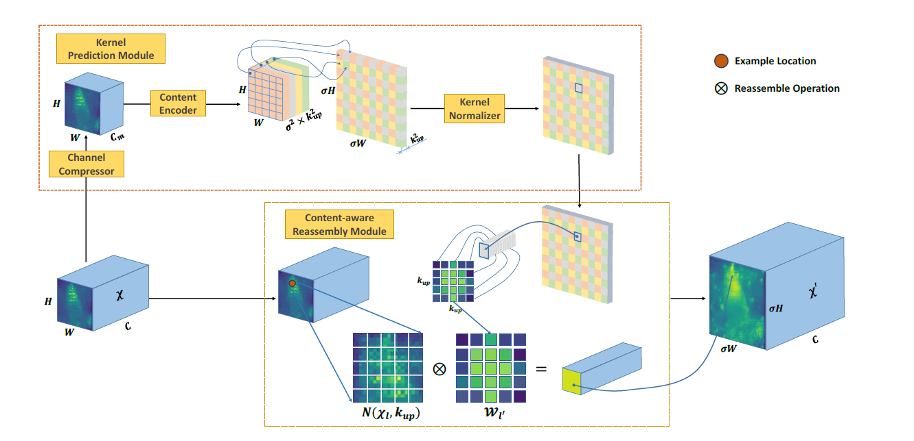

# CarafeBackward 算子开发设计方案


* #### 文档基本信息

| 算子名称    | carafe_backward  |
| ----------- | -------------  |   
| 编制人/日期 | 聂江龙/2023-2-6 |


* #### 修改记录

| 修订人 | 修订日期 | 修订描述 |
| ------ | -------  | -------  |
| 聂江龙  | 2023-2-6 | 首次提交 |

* #### 内容描述

本文档为`carafe_backward`算子的设计文档，包括需求分析、接口设计、方案设计、性能优化记录和方案实施部分。

* #### 算子需求checklist

算子需求提出者需要`提供`的信息如下：

- 算子接口描述
- 功能描述
- 框架版本 + 对应源码路径
- 需求对应网络
- 网络中用到的规模
- 常用规模下的参考接口性能（可选）
- 是否需要支持原位
- 是否需要支持stride机制
- 框架单元测试阈值指标（可选）
- 其他特殊需求（在线量化/融合/转数提前等，可选）
- 确认算子需求是否已经过框架层review

算子需求提出者需要`check`的部分如下：

- 1.1 算子需求分析
- 1.2 算子功能和应用场景描述
- 1.3 算子输入输出参数要求
- 1.4 算子限制
- 1.5 验收标准
- 2.2 接口设计
- 3.5 测试用例（需求提出者check算子需求表中所给规模是否列出）

## 1 需求分析

### 1.1 算子需求分析

| 算子功能简介| 求取Carafe算子的反向梯度，输入input，mask和grad_output，输出grad_input和grad_mask |
|-------------|--------------------------------------------------------------|
| 需求来源    | mmcv                                   |
| 应用网络    | FPN                                   |
| 输入数据类型| half, float                                                  |
| 输入Shape   | input: [batches, hi, wi, channels];<br>mask: [batches, hi * scale, wi * scale, group * k_up * k_up]<br>grad_output: [batches, hi * scale, wi * scale, channels] |
| 输入Layout  | input: NHWC; mask: NHWC; grad_output: NHWC          |
| 输出数据类型| half, float                                                  |
| 输出Shape   | grad_input: [batches, hi, wi, channels]<br>grad_mask: [batches, hi * scale, wi * scale, group * k_up * k_up] |
| 输出Layout  | NHWC                                                         |
| 模式(可选） | 无 |
| 是否需要支持原位        | 否                                                  |
| 是否需要支持stride机制  | 否                                                  |
| 是否需要支持广播  | 否                       |
| 0元素检查是否直接返回  | 是                                                  |
| 其他特殊需求(在线量化，融合，转数提前等，可选)|                                                        |
| 本次开发优先支持的规模/模式|    |

### 1.2 算子功能和应用场景描述

Content-Aware ReAssembly of FEatures（CARAFE）是一种通用、轻量级、高效的上采样算法。它具有（1）较广的感受野的特性，相比于传统的双线性插值，该算法能够通过利用更多周围像素的信息。（2）内容信息相关的感受野大小，CARAFE算法的感受野大小可以通过参数配置，实现动态可配置。（3）轻量级高效，CARAFE仅仅引入了很小的额外计算，并且可以很方便的组合到现有的人工智能网络结构中。在物体识别，语义分割，图像修复等任务上都展示出了很好的效果。



CARAFE总模块一共有2部分组成，分别是Kernel Prediction Module和Content-aware Ressembly Module。本算子是其中的Content-aware Ressembly Module部分。其公式如下：
```math
\begin{aligned}
\chi'_{l'}=\sum_{n=-r}^{r}\sum_{m=-r}^{r}W_{l' (n,m)}\chi_{(i+n,j+m)}
\end{aligned}
```
根据链式求导法则，CARAFEBackward反向公式如下：
```math
\begin{aligned}
{\delta}W_{l'(n,m)}&=\sum_{l'\in \Pi}(\sum_{n=-r}^{r}\sum_{m=-r}^{r}(\chi_{(i+n,j+m)}\delta\chi'_{l'}(p)))\\
{\delta}\chi_{(i,j)}&=\sum_{l'\in \Pi}(\sum_{n=-r}^{r}\sum_{m=-r}^{r}(W_{l'(n,m)}\delta\chi'_{l'})
\end{aligned}
```


### 1.3 算子输入输出参数要求

| 参数             | 语义                                                       | 类型（输入/输出） | 支持类型               | 物理布局 | 规模限制 |
| ---------------- | ---------------------------------------------------------- | ----------------- | ---------------------- | -------- | -------- |
| handle           | 句柄，用于获取当前资源                                     | 输入              | mluOpHandle_t           | /        | 无       |
| carafe_desc      | carafe 参数相关的描述符                                    | 输入              | mluOpCarafeDescriptor_t    | /        | 无       |
| input_desc       | 对输入节点的描述，包含维度、布局和数据类型信息           | 输入              | mluOpTensorDescriptor_t | /        | 无       |
| input            | 输入的节点数据                                           | 输入              | half, float            | NHWC     | 无       |
| mask_desc        | 关于原始输入的系数的描述，包含维度、布局和数据类型信息     | 输入              | mluOpTensorDescriptor_t | /        | 无       |
| mask             | 关于原始输入的系数                                         | 输入              | half, float            | NHWC     | 无       |
| grad_output_desc | 对输出数据梯度的描述，包含维度、布局和数据类型信息         | 输入              | mluOpTensorDescriptor_t | /        | 无       |
| grad_output      | 输出数据的梯度                                             | 输入              | half, float            | NHWC     | 无       |
| grad_input_desc  | 对输入数据梯度的描述，包含维度、布局和数据类型信息         | 输入              | mluOpTensorDescriptor_t | /        | 无       |
| grad_input       | 输入数据的梯度                                             | 输出              | half, float            | NHWC     | 无       |
| grad_mask_desc   | 关于原始输入的系数的梯度描述，包含维度、布局和数据类型信息 | 输入              | mluOpTensorDescriptor_t | /        | 无       |
| grad_mask        | 关于原始输入的系数的梯度                                   | 输出              | half, float            | NHWC     | 无       |

### 1.4 算子限制


| 限制类型     | 详细说明                              |
| ------------ | ------------------------------------- |
| 数据类型限制 | 所有tensor数据类型一致，为half，float |
| 布局限制     | 不支持NCHW的Layout                    |
| 规模限制     | kernel_size <=137                     |
| 功能限制     | 仅支持4维Tensor                       |
| 数据范围限制 | 无                                    |
| 原位限制     | 不支持原位                            |
| stride限制   | 不支持stride机制                      |
| 广播限制     | 不支持广播                            |
| 其他限制     | 算子用到atomic_add指令，half类型在200系列精度较低，因此在200系列仅支持小规模case。|

### 1.5 验收标准

#### 1.5.1 精度验收标准

- MLUOP精度验收标准：该算子为累加类算子，MLU300系列采用当前的 diff1 diff2 动态阈值评价公式，MLU200系列采用静态阈值 (3e-3)。

#### 1.5.2 性能验收标准

- 网络中使用到的规模性能优于或至少与参考接口性能持平。
- 部分与参考接口差距过大的规模在4.算子性能优化记录中进行说明。
- 附上算子测试报告链接，测试报告必须包括框架给出的网络中规模的性能数据。

## 2 算子接口设计

### 2.1 参考接口

- mmcv

```python

mmcv.ops.CARAFE(kernel_size, group_size, scale_factor)

```

CARAFE: Content-Aware ReAssembly of FEatures

Please refer to https://arxiv.org/abs/1905.02188 for more details.

> Parameters

​	**kernel_size** (int) - ressemble kernel size

​	**group_size** (int) - ressemble group size

​	**scale_factor** (int) - upsample ratio

> Returns

​	upsampled feature map

> **forward**(features, masks)

​	Defines the computation performed at every call.

​	Should be overridden by all subclases.

### 2.2 接口设计

公共部分请见前向设计文档：docs/design_docs/carafe_forward/carafe_forward.md

```c++
mluOpStatus_t mluOpCarafeBackward(mluOpHanle_t handle, 
                                const mluOpCarafeDescriptor_t carafe_desc,
                                const mluOpTensorDescriptor_t input_desc,
                                const void *input,
                                const mluOpTensorDescriptor_t mask_desc,
                                const void *mask,
                                const mluOpTensorDescriptor_t grad_output_desc,
                                const void *grad_output,
                                const mluOpTensorDescriptor_t grad_input,
                                void *grad_input,
                                const mluOpTensorDescriptor_t grad_mask,
                                void *grad_mask)
```


## 3 实现方案设计

### 3.1 实现方案

参考接口的实现作为CarafeBackward的性能保底方案。

### 3.2 伪代码实现（可选）

```python
def dummy_carafe_backward_nhwc(input, mask, grad_output, k_up, group, scale):
    n, ho, wo, co = grad_output.shape
    _, hi, wi, ci = input.shape
    c_per_group = co // group
    
    input = input.reshape(n, hi, wi, group, c_per_group)
    mask = mask.reshape(n, ho, wo, group, k_up * k_up)
    grad_output = grad_output.reshape(n, ho, wo, group, c_per_group)
    
    for i_iter in range(n * ho * wo * group):
        group_iter = i_iter % group
        w_iter = (i_iter // group) % wo
        h_iter = (i_iter // wo // group) % ho
        n_iter = (i_iter // ho // wo // group) % n
        
        down_h_iter = h_iter // scale
        down_w_iter = w_iter // scale
        
        start_h, end_h = down_h_iter - (k_up - 1) // 2, down_h_iter + (k_up - 1) // 2 + 1
        start_w, end_w = down_w_iter - (k_up - 1) // 2, down_w_iter + (k_up - 1) // 2 + 1
        
        for ih in range(start_h, end_h):
            for iw in range(start_w, end_w):
                if (ih < 0 or ih > hi or iw < 0 or iw > wi -1):
                    continue
                mask_ih = ih - down_h_iter + (k_up - 1) // 2
                mask_iw = iw - down_w_iter + (k_up - 1) // 2
                mask_c = mask_ih * k_up + mask_iw
                mask_value = mask[n_iter, h_iter, w_iter, group_iter, mask_c].item()
                input_value = input[n_iter, ih, iw, group_iter]
                grad_input[n_iter, ih, iw, group_iter] += mask_value * grad_output[n_iter, h_iter, w_iter, group_iter]
                grad_mask[n_iter, h_iter, w_iter, group_iter, mask_c] += (input_value * grad_output[n_iter, h_iter, w_iter, group_iter]).sum()
	grad_input = grad_input.reshape(n, hi, wi, ci)
    grad_mask = grad_mask.reshape(n, ho, wo, group * k_up * k_up)
    return grad_input, grad_mask
```


### 3.3 多核拆分

Default逻辑使用核间拆分（n * ho * wo * group）

启动BLOCK，尽量打满带宽。

在考虑均匀拆分的同时，还需要驻留的方案。

### 3.4 性能优化设计

优化逻辑使用片上驻留的方式，由于感受野大小可配置，尽量做到空间复用。

### 3.5 方案理论性能

无

### 3.6 可维护性设计

无

### 3.7 测试用例设计

- 框架在需求列表中给出的算子在网络中用到的规模：
  已满足所有网络中要求的规模

- 边界case：
  0元素case

  case中含有nan，inf的case

其他可根据需要进行补充。算子开发完毕后，补充测试报告链接。

### 3.8 算子防呆检查

- 列出算子需要做的防呆，比如

 1、指针为空防呆；

 2、0元素检查防呆，VLOG(5)打印信息，是否返回与框架沟通；

 3、是否需要对输入输出支持的dtype、layout以及shape进行防呆；

 4、input，grad_input形状相同，mask, grad_mask形状相同；

 5、算子存在的自身的相关参数防呆，mask与output的hw相同，为hi *scale, wi * scale，mask的channel为group * kernel_size * kernel_size ，input, mask, grad_output的batch个数相同，input和grad_output的channel相同。

 6、kernel_size >= 1，scale >= 1，kernel_size只能为奇数(因中心点两边的size需要相等)，channel个数需要被group整除。

 7、对于carafe_backward的限制：kernel_size <=137（因为把nram均分成5份，确保一份足够放得下一个kernel，因此会有这个限制）。
    carafe_forward的限制：kernel_size <=45且scale <=5,
    因此carafe的限制是：kernel_size <=45且scale <=5。    

主要是列出4,5,6,7防呆内容，方便review。

## 4 算子性能优化记录
    3个输入input,mask,grad_output中，mask,grad_output在片上驻留，input存在重复IO(来源于不同kernel的重复寻址)。后续考虑使用 sharam/wram 对input进行驻留，并结合流水的方式进行优化。

## 5 方案实施

### 5.1 开发计划

- 2021.7.5 调研源码+开始设计方案
- 2021.7.11 设计方案：算子功能+接口设计
- 2021.7.11 设计方案：排流水方案+伪代码
- 2021.7.11 设计方案：性能预估
- 2021.7.16 方案review
- 2021.7.19 generator代码开发
- 2021.7.26 算子主体框架开发
- 2021.7.29 gtest逻辑开发
- 2021.8.6 kernel代码开发
- 2021.8.15 文档代码开发，limitation。
- 2021.8.20 批量测试+测试报告
- 2021.8.25 提交MR+代码review
- 2021.8.28 算子入库

### 5.2 测试计划

- 2021.8.20，单元测试

### 5.3 风险分析

（1）反向累加精度问题:
     因200系列的atomic_add的累加精度不足，导致动态阈值无法通过,相同侧例在300系列可以通过。因此暂时对于300系列使用动态阈值，200系列使用静态阈值(且仅支持小规模case,否则half类型精度溢出)。
