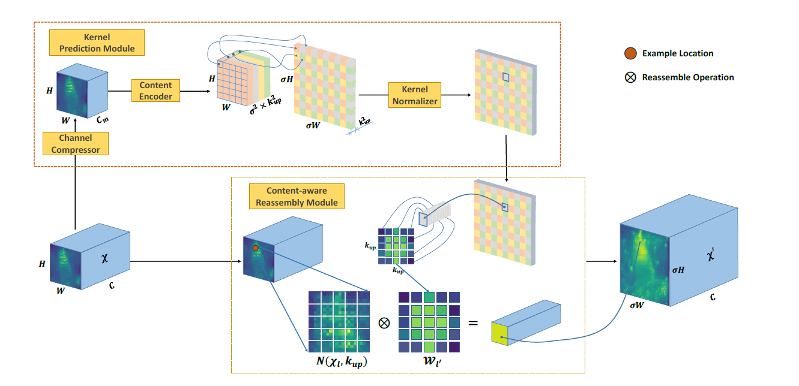

# CarafeForward 算子开发设计方案


* #### 文档基本信息

| 算子名称    | carafe_backward  |
| ----------- | -------------  |   
| 编制人/日期 | 聂江龙/2023-2-6 |


* #### 修改记录

| 修订人 | 修订日期 | 修订描述 |
| ------ | -------  | -------  |
| 聂江龙  | 2023-2-6 | 首次提交 |


* #### 内容描述

本文档为`CarafeForward`算子的设计文档，包括需求分析、接口设计、方案设计、性能优化记录和方案实施部分。

* #### 算子需求checklist

算子需求提出者需要`提供`的信息如下：

- 框架负责人
- 算子接口描述
- 功能描述
- 框架版本 + 对应源码路径
- 需求对应网络
- 网络中用到的规模
- 常用规模下的参考接口性能（可选）
- 是否需要支持原位
- 是否需要支持stride机制
- 框架单元测试阈值指标（可选）
- 其他特殊需求（在线量化/融合/转数提前等，可选）
- 确认算子需求是否已经过框架层review

算子需求提出者需要`check`的部分如下：

- 1.1 算子需求分析
- 1.2 算子功能和应用场景描述
- 1.3 算子输入输出参数要求
- 1.4 算子限制
- 1.5 验收标准
- 2.2 接口设计
- 3.5 测试用例（需求提出者check算子需求表中所给规模是否列出）

## 1 需求分析

### 1.1 算子需求分析

| 算子功能简介 | 根据上采样核函数mask对输入特征图input进行上采样，输出采样后的特征图output，详细描述在1.2中进行说明 |
|-------------|--------------------------------------------------------------|
| 需求来源    | mmcv                                     |
| 应用网络    | FPN |
| 输入数据类型| half, float                                                  |
| 输入Shape   | input: [N, Hi, Wi, Ci]<br />mask: [N, Hm, Wm, Cm] |
| 输入Layout  | input: NHWC<br />mask: NHWC  |
| 输出数据类型 | half, float                                                  |
| 输出Shape   | output: [N, Ho, Wo, Co]     |
| 输出Layout  | output: NHWC               |
| 模式(可选） | 无 |
| 是否需要支持原位        | 否                                                  |
| 是否需要支持stride机制  | 否                                                  |
| 是否需要支持广播  | 否                       |
| 0元素检查是否直接返回  | 是                                                  |
| 其他特殊需求(在线量化，融合，转数提前等，可选)| 无 |
| 本次开发优先支持的规模/模式| 优先支持NHWC的layout  |

### 1.2 算子功能和应用场景描述

**[CARAFE]( https://arxiv.org/abs/1905.02188)**（Content-Aware ReAssembly of FEatures [1]）是一种通用、轻量且非常有效的上采样算法，在物体识别，语义分割，图像修复等任务上都展示出很好的效果。其具有如下优点：

1. 更大的感受野：相比于传统的双线性插值，CARAFE能够通过利用更多周围像素的信息；
2. 内容信息相关：相比于反卷积使用固定的核函数，CARAFE根据输入内容动态生成核函数；
3. 轻量高效：CARAFE仅引入很小的额外计算量，且可以整合到现有的人工智能网络结构中。

CARAFE算法由2个模块组成（见下图，引自[1]中图2)：

1. **Kernel Prediction Module**：根据输入特征图生成上采样核（卷积滤波张量）函数（每个输出点对应不同的核函数），包含Channel Compressor（1x1 conv）, Content Encoder（conv）和Kernel Normalizer（softmax）三个组件；
2. **Content-aware Reassembly Module**：将每个上采样点对应的核函数矩阵（即卷积滤波张量矩阵）和输入特征图相应区域进行逐元素相乘并求和（加权求和），得到上采样后的特征图。



*Kernel Prediction Module* 可由MLUOP库中已有算子搭建实现，因此本算子`mluOpCarafeForward`主要实现*Content-aware Reassembly Module*部分的正向功能，即由输入特征图和上采样核函数输出上采样后的特征图。

图中符号的含义如下：

- $`\sigma`$为上采样倍数（大于等于1的整数）;
- $`H,W,C`$ 为输入特征图（$`\chi`$）的维度，分别对应高度、宽度和通道数，$`\sigma H, \sigma W, C`$为输出特征图（$`\chi'`$）的维度；
- $`k_{up}`$为上采样核函数的宽度（大于等于1的奇数）；
- $`l=(i,j), l'=(i',j')`$ 分别为输入和输出的特征图上的像素点位置并满足$`i=\lfloor i'/\sigma \rfloor, j=\lfloor j'/\sigma \rfloor`$；
- $`W_{l'}`$为对应输出特征图中$`l'`$位置的上采样核函数，$`N(\chi_l, k_{up})`$为输入特征图中以$`l`$为中心、宽度为$`k_{up}`$的窗口。

**正向计算公式：**
```math
\begin{aligned}
y[i',j',c] 
&=
\sum_{\underset{\underset{0\leq{n+\theta(i')-r}\lt{W}}{\bf{s.t.}}}{n=0}}^{k_{up}-1} 
\sum_{\underset{\underset{0\leq{m+\theta(j')-r}\lt{H}}{\bf{s.t.}}}{m=0}}^{k_{up}-1}
K [i',j',n,m]\cdot x \left[\theta(i')+n-r,\theta(j')+m-r,c\right] \\
&= 
\sum_{n=0}^{k_{up}-1} 
\sum_{m=0}^{k_{up}-1}
K [i',j',n,m] \cdot \bar{x} \left[\theta(i')+n-r,\theta(j')+m-r,c\right] \\
\end{aligned}
```
，其中$`y[i',j',c]`$为输出特征图在通道（$`c`$）、$`(i',j')`$位置的值；$`x[i,j,c]`$为输入特征图在通道（$`c`$）、$`(i,j)`$位置的值；$`K[i',j',\ldots]`$为对应输出特征图$`(i',j')`$位置的上采样核函数（为一个二维卷积滤波张量矩阵，与输入特征图上相应区域逐元素相乘并求和得到$`(i',j')`$位置的输出）；$`r=\lfloor (k_{up}-1)/2 \rfloor`$为核函数窗的半宽度；$`\theta(i)=\lfloor i/\sigma \rfloor`$为坐标映射函数，将输出特征图坐标转化为输入特征图坐标；$`\bar x`$是将$`x`$在宽度和高度方向补零元素得到的张量，即
```math
\bar x [i,j,c] = 
\begin{cases}
x[i,j,c] & (0 \leq i \lt W) \land (0 \leq j \lt H) \\
0         & (-r \leq i \lt 0) \lor (H \leq i \lt W+k_{up}-r) \lor  (-r \leq j \lt 0) \lor (H \leq j \lt H+k_{up}-r)
\end{cases}
```
，其中$`\bar x[i,j,c]`$的下标$`i`$的范围为$`\left[-r,\ldots,W+k_{up}-r \right)`$，下标$`j`$的范围为$`\left[-r,\ldots,H+k_{up}-r \right)`$。引入$`\bar x`$表示是为了便于进行反向公式推导（见下方）。

在实际使用中，考虑到不同通道可能存在差异，从而需要采用不同的上采样核函数，可将输入特征图的通道维度分为$`G`$组，不同组应用不同的上采样核函数（[2]）。其对应的正向公式为：
```math
y[i',j',c]=\sum_{n=0}^{k_{up}-1}\sum_{m=0}^{k_{up}-1} K[i',j',\eta(c),n,m] \cdot \bar{x}\left[\theta(i')+n-r,\theta(j')+m-r,c\right]
```
，其中$`\eta(c)=\lfloor c/ C_g \rfloor`$为通道号至对应组号的映射函数，$`C_g = \lfloor{ (C+G-1)/G\rfloor} `$为每组的通道数；$`K[i',j',g,\ldots]`$ 为输出特征图属于第$`g`$组的通道在$`(i',j')`$位置上对应的的上采样核函数。

注意：在程序实现中，各矩阵加入了batch维度，同时$`K`$的核函数卷积核张量合并为一个维度存放，即$`y[N,H_o,W_o,C], x[N,H,W,C],K[N,H_o,W_o,C_m]`$，其中：$`H_o=\sigma H, W_o=\sigma W`$，$`C_m = G \cdot k_{up}^2`$，且$`C_m`$维度将通道组和核函数窗按照$`(G, k_h, k_w)`$以行优先的方式摆放。

**反向计算公式：**

设$`L`$为损失函数，$`\partial L /\partial y[i,j,c]`$为损失函数对输出特征图的梯度张量：

1. **$`L`$对上采样核函数$`K`$的梯度张量：**

```math
\begin{aligned}
\frac{\partial{L}}{\partial{K}[i,j,g,n,m]} 
&=
\sum_{c=0}^{C-1} \sum_{i'=0}^{\sigma W-1} \sum_{j'=0}^{\sigma H-1} \frac{\partial{L}}{\partial{y}[i',j',c]} \cdot \frac{\partial{y[i',j',c]}}{\partial{K[i,j,g,n,m]}} \\
&= 
\sum_{c=0}^{C-1} 
\sum_{i'=0}^{\sigma W-1} \sum_{j'=0}^{\sigma H-1} \frac{\partial{L}}{\partial{y}[i',j',c]} \cdot \sum_{n'=0}^{k_{up}-1}\sum_{m'=0}^{k_{up}-1} 
\bar{x} \left[\theta(i')+n'-r,\theta(j')+m'-r,c\right] \cdot \frac{\partial{K [i',j',\eta(c),n',m']}}{\partial{K[i,j,g,n,m]}} \\
&=
\sum_{c=0}^{C-1} \delta_{g,\eta(c)} \frac{\partial{L}}{\partial{y}[i,j,c]} \cdot \bar{x} \left[\theta(i)+n-r,\theta(j)+m-r,c\right]
\end{aligned}
```

，其中$`\delta_{i,j}`$为Kronecker记号，即
```math
\delta_{i,j} = 
\begin{cases}
1   & i = j \\
0   & i \neq j
\end{cases}
```

2. **$`L`$对输入特征图$`x`$的梯度张量：**

```math
\begin{aligned}
\frac{\partial{L}}{\partial{x}[i,j,c]} 
&=
\frac{\partial{L}}{\partial{\bar{x}}[i,j,c]}  \\
&= 
\sum_{c'=0}^{C-1} \sum_{i'=0}^{\sigma W-1} \sum_{j'=0}^{\sigma H-1} \frac{\partial{L}}{\partial{y}[i',j',c']} \cdot \frac{\partial{y[i',j',c']}}{\partial{\bar{x}[i,j,c]}} \\
&=
\sum_{c'=0}^{C-1} \sum_{i'=0}^{\sigma W-1} \sum_{j'=0}^{\sigma H-1} 
\frac{\partial{L}}{\partial{y}[i',j',c']} \cdot 
\sum_{n'=0}^{k_{up}-1}\sum_{m'=0}^{k_{up}-1}  
{K [i',j',\eta(c'),n',m']}  \cdot 
\frac{\partial{\bar{x} \left[\theta(i')+n'-r,\theta(j')+m'-r,c'\right]}}{\partial{\bar{x}[i,j,c]}} \\
&= 
\sum_{i'=0}^{\sigma W-1} \sum_{j'=0}^{\sigma H-1} \sum_{n'=0}^{k_{up}-1}\sum_{m'=0}^{k_{up}-1}  
\delta_{i,\theta(i')+n'-r}\delta_{j,\theta(j')+m'-r}
\frac{\partial{L}}{\partial{y}[i',j',c]} \cdot  {K [i',j',\eta(c),n',m']}
\end{aligned}
```

**参考文献**

[1] arXiv:1905.02188 [cs.CV] （https://arxiv.org/abs/1905.02188）

[2] mmcv中CARAFE的实现（ https://github.com/open-mmlab/mmcv/blob/master/mmcv/ops/carafe.py）


### 1.3 算子输入输出参数要求

| 参数         | 语义                                                     | 类型（输入/输出） | 支持类型               | 物理布局 | 规模限制 |
| ------------ | -------------------------------------------------------- | ----------------- | ---------------------- | -------- | -------- |
| handle       | 句柄，用于获取当前资源                                   | 输入              | mluOpHandle_t           | /        | 无       |
| carafe_desc  | carafe 参数相关的描述符                                  | 输入              | mluOpCarafeDescriptor_t | /        | 无       |
| input_desc   | 对输入特征图的描述，包含维度、布局和数据类型信息         | 输入              | mluOpTensorDescriptor_t | /        | 无       |
| input        | 输入特征图数据                                           | 输入              | half, float            | NHWC     | 无       |
| mask_desc | 关于输入上采样核函数的描述，包含维度、布局和数据类型信息 | 输入              | mluOpTensorDescriptor_t | /        | 无       |
| mask      | 输入上采样核函数数据                                     | 输入              | half, float            | NHWC     | 无       |
| output_desc  | 对输出特征图数据的描述，包含维度、布局和数据类型信息     | 输入           | mluOpTensorDescriptor_t | /        | 无       |
| output       | 输出特征图数据                                           | 输出              | half, float            | NHWC     | 无       |

### 1.4 算子限制

| 限制类型     | 详细说明                                                     |
| ------------ | ------------------------------------------------------------ |
| 数据类型限制 | 所有tensor数据类型一致，为half或float                        |
| 布局限制     | 只支持NHWC的Layout                                           |
| 规模限制     | 无                                                           |
| 功能限制     | carafeDescriptor中dimNb必须设为4，即input，mask和output张量的维度必须为4。<br/>kernel_size <= 45，scale_factor <= 5。 |
| 数据范围限制 | 无                                                           |
| 原位限制     | 不支持原位                                                   |
| stride限制   | 不支持stride机制                                             |
| 广播限制     | 不支持广播                                                   |

### 1.5 验收标准

#### 1.5.1 精度验收标准

- MLUOP精度验收标准：该算子为累加类算子，采用当前的 diff1、diff2 评价公式，采用动态阈值。

#### 1.5.2 性能验收标准

- 网络中使用到的规模性能优于或至少与参考接口性能持平。
- 部分与参考接口差距过大的规模在4.算子性能优化记录中进行说明。

## 2 算子接口设计

### 2.1 参考接口

- [mmcv](https://github.com/open-mmlab/mmcv/blob/master/mmcv/ops/csrc/carafe_cuda_kernel.cuh)

```c++
template <typename scalar_t>
__global__ void CARAFEForward(
    const int num_kernels,
    const scalar_t *__restrict__ bottom_data,
    const scalar_t *__restrict__ bottom_mask,
    const int kernel_size,
    const int group_size,
    const int scale_factor, 
    const int channels,
    const int down_height,
    const int down_width,
    const int height,
    const int width,
    const int mask_channels,
    scalar_t *__restrict__ top_data);

template <typename scalar_t>
__global__ void carafe_naive_forward_cuda_kernel(
    const int nthreads,
    const scalar_t *bottom_data,
    const scalar_t *bottom_mask,
    const scalar_t *top_data,
    const int kernel_size,
    const int group_size,
    const int scale_factor, 
    const int channels,
    const int height,
    const int width);
```

python wrapper:
```python
mmcv.ops.CARAFE(kernel_size, group_size, scale_factor)
mmcv.ops.CARAFENaive(kernel_size, group_size, scale_factor)
```

注意：相比CARFENaive，CARAFE使用了shared memory来存放mask张量，但没有检查数据是否能够放入shared memory，因此较大的kernel_size和group_size会导致越界错误。目前测试的结果显示，只能在满足`group_size * kernel_size * kernel_size <= 363`的情况下，CARAFE才可以正常运行。CARAFENaive没有此处限制。相应的情况在MLU中进行了参数大小的检查，若超出范围，程序将报错。

### 2.2 接口设计

#### 2.2.1 **CARAFE描述符接口设计**

##### CARAFE描述符结构体

```c++
struct mluOpCarafeStruct {
  int dimNb;
  int kernel_size;
  int group_size;
  int scale_factor;
};
```

##### CARAFE描述符的创建接口

```c++
mluOpStatus_t mluOpCreateCarafeDescriptor(mluOpCarafeDescriptor_t *carafe_desc)
```

##### CARAFE描述符的设置接口

```c++
mluOpStatus_t mluOpSetCarafeDescriptor(mluOpCarafeDescriptor_t carafe_desc,
                                     const int dimNb,
                                     const int kernel_size,
                                     const int group_size,
                                     const int scale_factor)
```

##### CARAFE描述符的销毁接口

```c++
mluOpStatus_t mluOpDestroyCarafeDescriptor(mluOpCarafeDescriptor_t carafe_desc)
```

#### 2.2.2 **CarafeForward算子的接口**

```c++
mluOpStatus_t mluOpCarafeForward(mluOpHanle_t handle, 
                                const mluOpCarafeDescriptor_t carafe_desc,
                                const mluOpTensorDescriptor_t input_desc,
                                const void *input,
                                const mluOpTensorDescriptor_t mask_desc,
                                const void *mask,
                                const mluOpTensorDescriptor_t output_desc,
                                void *output)
```


## 3 实现方案设计

### 3.1 实现方案

**多核拆分策略**

由正向公式可知，每个样本（$`n \in [0,N-1]`$）和每个通道分组（$`g \in [0, G-1]`$）可独立运行，即可以拆分为$`N \times G`$个独立计算。每个计算为
```math
\begin{aligned}
y[i',j',c] 
&= 
\sum_{n=0}^{k_{up}-1}\sum_{m=0}^{k_{up}-1} K[i',j',\lfloor c/C_g \rfloor=g,n,m] \cdot \bar{x}\left[\theta(i')+n-r,\theta(j')+m-r,c\right]
\end{aligned}
```
。在继续对$`H, W, C`$方向进行拆分之前，注意以下两点：

- 对于每个输出位置（$`i',j'`$）的不同$`c`$值，复用$`K[i',j',g,\cdot,\cdot]`$子矩阵$`C_g`$次；
- $`\bar x`$上每个以$`i,j`$为中心的$`k_{up} \times k_{up}`$区域对应$`\sigma^2`$个输出$`y(i',j',c)`$：$`i' \in [\lfloor i/\sigma \rfloor, \lfloor i/\sigma \rfloor+\sigma-1]`$，$`j' \in [\lfloor j/\sigma \rfloor, \lfloor j/\sigma \rfloor+\sigma-1]`$，即$`\bar x`$上每个$`k_{up} \times k_{up}`$的子区域复用$`\sigma^2`$次。

根据公式可以看出，对$`C`$方向的拆分将导致$`K`$的重复传输，但不导致$`\bar x`$的重复传输；对$`H,W`$方向的拆分将导致$`\bar x `$的重复传输，原因是kernel的宽度导致多读入划分区域边界之外距离为$`(k_{up}-1)/2`$个点的数据，但不导致$`K`$的重复传输。因为片上空间有限，若$`H \times W`$的数值较大，则需要对$`H,W`$方向进行拆分，但尽量减少划分数目，即拆分区域尽量大，从而减少重复读入的数据；对$`C`$方向不进行拆分，由同一个核处理同一个通道组内全部的$`C`$。

**单核IO及计算策略**

在读取同一通道组的输入特征图$`input[N,H,W,C]`$数组时，尽量多的读入连续的$`C`$维度数据，增加IO效率。NRAM上数据的摆放方式尽量满足向量操作的条件，利用向量指令进行计算。

### 3.2 伪代码实现（可选）

```bash
# Job type = BLOCK

# parameters:
K: kernel size
G: group size
sigma: scale factor
Ho = H * sigma; Wo = W * sigma

# input/output tensors:
input[N, H, W, G*C]
mask[N, Ho, Wo, G*K^2]
output[N, Ho, Wo, G*C]

# Set data block dimension 
block_H, block_W, block_G, block_C
# Set grid dimension (number of blocks along H,W,G,C)
grid_H, grid_W, grid_G, grid_C

# Set arrays on NRAM
input_nram[block_H+K-1, block_W+K-1, block_G * block_C]
mask_nram[block_Ho, block_Wo, block_G * K^2], 
output_nram[block_Ho, block_Wo, block_G * block_C] 
 
# (N * grid_H * grid_W) iterations are distributed to all assigned cores. 
For (n,grid_h,grid_w,grid_g,grid_c) in [0:N-1]x[0:grid_H-1]x[0:grid_W-1]x[0:grid_G-1]x[0:grid_C-1]: 	
|	# load mask block from GDRAM to NRAM
|	mask_nram[block_H, block_W, block_G * K^2]
|
|   # load input block with expanded area from GDRAM to NRAM
|   input_nram[block_H+K-2, block_W+K-2, block_G * block_C]
|
|   # loop each center pixel on input block
|   For (h, w) in [0:block_H-1]x[0:block_W-1]:
|   |   # loop each output pixel
|   |   For (i, j) in [0:sigma-1]x[0:sigma-1]:
|   |   |   # loop each points inside the kernel window
|   |   |   For (kh, kw) in [0:K-1]x[0:K-1]:
|   |   |   |   # loop each group 
|   |   |   |   For g in [0:block_G-1] 
|   |   |   |   |	output_nram[sigma*h+i, sigma*w+j, g*block_C + 0:block_C-1] +=
|   |   |   |   |		input_nram[h+kh, w+kw, g*block_C + 0:block_C-1] 
|   |   |   |   |		* mask_nram[sigma*h+i, sigma*w+j, g*K^2 + K*kh + kw]
|   |   
|   |  	# write output block from NRAM to GDRAM
|   | 	output_gdram[n, block_Ho, block_Wo, block_G * block_C ] 
|   |     	= output_nram[[block_Ho, block_Wo, block_G * block_C]
```

### 3.3 多核拆分

使用核间拆分（N * grid_H * grid_W * grid_G * grid_C），每个拆分单元的依赖数据尽可能独立且不重复，同时利用NRAM上数据复用，尽量减少GDRAM上数据的重复读取。详见 “3.1 实现方案” 部分。

### 3.4 性能优化设计

优化GDRAM2NRAM数据读取方式，尽量保证连续区域整块读入：例如在读取$`input[N,H,W,C]`$数组时，尽量读入连续的$`C`$维度数据，利用带宽，增加IO效率。NRAM上数据的摆放方式尽量满足向量操作的条件，从而对NRAM上的连续数据进行向量操作：例如对$`\sum_{k_h,k_w} input\_nram[k_h,k_w,0:C'-1] \cdot mask\_nram[k_h,k_w]`$，可以对$`C`$维度进行`__bang_mul_scalar`计算，然后再进行`__bang_add`计算。

### 3.5 方案理论性能

无

### 3.6 可维护性设计

按照功能将代码分为若干文件：

- API入口文件：mluOpCarafeForward()
- 参数检查文件：checkParam()
- 拆分策略文件：genPolicy()
- 算子主体文件：mluOpBlockKernelCarafeForwardHalf/Float()，其中定义模板函数MLUKernelCarafeForward()

### 3.7 测试用例设计

- 框架在需求列表中给出的算子在网络中用到的规模：

  | input Height/Width (H, W) | 32,64,128,256,512 |
  |---|-----|
  | **input channels**        | 256,512,1024,2048 |
  | **kernel size**           | 5                 |
  | **group size**            | 1                 |
  | **scale factor**          | 2                 |

- 边界case：0元素case，含有**nan，inf**的case，错误的输入参数case。

### 3.8 算子防呆检查

算子输入参数检查按如下顺序进行：

1. 算子及输入输出张量的descriptor指针为空防呆。
2. 0元素检查防呆：VLOG(5)打印信息，并返回成功。
3. 算子输入参数防呆：`kernel_size`、`group_size`和`scale_factor`为正整数（>=1），且`kernel_size`为奇数。
4. 输入输出张量属性防呆：`input`，`mask`和`output`张量的数据类型一致，为half或float；layout均为NHWC，且张量维度必须为4；在片外内存上连续摆放。
5. 参数限制检查：`kernel_size <= 45`和`scale_factor <= 5`。
6. 输入输出张量形状防呆：`input`，`mask`和`output`的`N`相同；`mask`与`output`的`H, W`相同，为`Hm = Ho = scale_factor * Hi, Wm = Wo = scale_factor * Wi`；`mask`的`channel`数为`Cm = group_size * kernel_size * kernel_size`；`input`和`output`的`channel`数相同；`input`的`channel`数能被`group_size`整除。
7. 输入输出张量数据指针为空防呆。

## 4 算子性能优化记录

### 4.1 当前存在问题的规模说明

无。

### 4.2 已经过优化的规模说明

无。

## 5 方案实施

### 5.1 开发计划

example:

- 2021.7.5 调研源码+开始设计方案
- 2021.7.9 设计方案：算子功能+接口设计
- 2021.7.10 设计方案：排流水方案+伪代码
- 2021.7.10 设计方案：性能预估
- 2021.7.12 方案review
- 2021.7.14 generator代码开发
- 2021.7.15 算子主体框架开发
- 2021.7.17 gtest逻辑开发
- 2021.7.20 kernel代码开发
- 2021.8.1 文档代码开发，limitation。
- 2021.8.5 批量测试+测试报告
- 2021.8.9 提交MR+代码review
- 2021.8.12 算子入库

### 5.2 测试计划

- 2021.8.5 单元测试

### 5.3 风险分析
