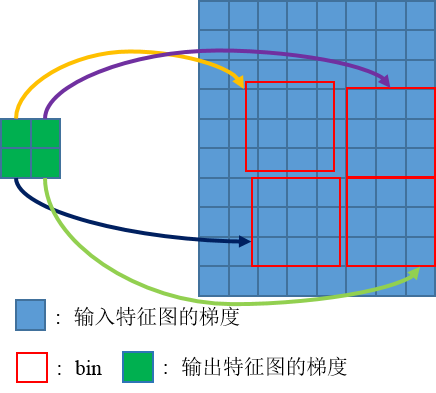
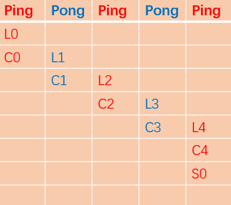

# DeformRoiPoolBackward 算子开发设计方案


* #### 文档基本信息

| 算子名称    | DeformRoiPoolBackward                     |
| --------- | -------------------------------------------|
| 编制人/日期 |    卜德飞 / 2022-3-28                       |
| 审批人/日期 |    张凯茜 / 2022-4-15                       |
| 审批人/日期 |    张国鹏 / 2022-4-15                       |
| 审批人/日期 |    王远  / 2022-4-15                        |

* #### 修改记录

| 版本号| 修订人 | 修订日期 | 修订描述 |
| ----- | ------ | -------  | -------  |
| V1.0  | 卜德飞  | 2022-03-28 | 首次提交 |

* #### 内容描述

本文档为`DeformRoiPoolBackward`算子的设计文档，包括需求分析、接口设计、方案设计、性能优化记录和方案实施部分。该算子为`DeformRoiPoolForward`算子的反向算子。
## 1 需求分析

### 1.1 算子需求分析

- DeformRoiPoolBackward算子功能是根据output的梯度，计算input和offset的梯度。

| 算子功能简介|                                |
|-------------|--------------------------------------------------------------|
| 需求来源    | mmcv                                       |
| 应用网络    | Faster RCNN                                               |
| 输入数据类型| `grad_output`、`input`、`rois`、`offset`的数据类型可以是half或float, `pooled_height`、`pooled_width`、`sampling_ratio`的数据类型均为int32；`spatial_scale`、`gamma`的数据类型均为float    |
| 输入Shape   | `grad_output`: [num_rois, pooled_height, pooled_width, channels]; `input`: [batches, hi, wi, channels]; `rois`: [num_rois, 5]; `offset`: [num_rois, 2, pooled_height, pooled_width]  |
| 输入Layout  | `grad_output`: NHWC, `input`: NHWC；`rois`: ARRAY, `offset`: ARRAY, `pooled_height`、`pooled_width`、`spatial_scale`、`sampling_ratio`、`gamma`均为标量     |
| 输出数据类型| half, float                                                  |
| 输出Shape   | `grad_input`: [batches, hi, wi, channels], `grad_offset`: [num_rois, 2, pooled_height, pooled_width]   |
| 输出Layout  | `grad_input`: NHWC, `grad_offset`: ARRAY          |
| 是否需要支持原位        | 否                                                  |
| 是否需要支持stride机制  | 否                                                  |
| 是否需要支持广播  | 否                        |
| 0元素检查是否直接返回  | 当grad_input的hi、wi为0时，正常执行，其余情况直接返回MLUOP_STATUS_BAD_PARAM                |

### 1.2 算子功能和应用场景描述

  该反向算子中给出输出的梯度、输入特征图、roi框的位置、offset，即可得到输入特征图和offset的梯度。
- 
- 输出的每个梯度`grad_bin`对应一个bin中所有点的梯度和，故bin中每个点的梯度`grad_pixel` = `grad_bin` / `count`。
- `count`为一个bin中采样像素总数量。
- offset的梯度可通过链式法则求得，对于一个bin，offset对应有两个值[ $x_{offset}$ , $y_{offset}$ ]，以任意一点的 $x_{offset}$ 的求取为例：
- $x_1$、 $x_2$ 、 $x_3$ 、 $x_4$ 是像素(x,y)对应的四邻域像素值， $w_1$ 、 $w_2$ 、 $w_3$ 、 $w_4$ 则是四邻域对应的权重。
```math
x = x_{start} + x_{offset}
```
```math
w1 = (y_{high} - y)*(x_{high} - x)
```
```math
val = w_1*x_1 + w_2*x_2 + w_3*x_3 + w_4*x_4
```
```math
\frac{\partial l}{\partial x_1} = \frac{\partial l}{\partial val} * \frac{\partial val}{\partial x_1}= grad\_pixel * w_1
```
```math
\frac{\partial l}{\partial x_{offset}} = \frac{\partial l}{\partial val} * \frac{\partial val}{\partial x_{offset}}
```
```math
\frac{\partial val}{\partial x_{offset}} = x_1*\frac{\partial w_1}{\partial x_{offset}} + x_2*\frac{\partial w_2}{\partial x_{offset}} + x_3*\frac{\partial w_3}{\partial x_{offset}}+x_4*\frac{\partial w_4}{\partial x_{offset}}
```
其中以 $\frac{\partial w_1}{\partial x_{offset}}$ 为例
```math
\frac{\partial w_1}{\partial x_{offset}} = \frac{\partial [(y_{high} - y)*(x_{high} - x)]}{\partial x_{offset}} = y - y_{high}
```
-  $\frac{\partial y}{\partial val}$ 是输出像素的梯度，即`grad_pixel`。

1、需要说明对nan/inf的特殊处理，输入存在nan/inf的，分为输入当中只包含nan、只包含inf、同时包含nan和inf的情况。


### 1.3 算子输入输出参数要求

| 参数             | 语义                | 类型（输入/输出） | 支持类型         | 物理布局 | 规模限制 |
| ---------------- | ------------------ | ----------------- | -------------- | -------- | -------- |
| handle          | 操作句柄             | 输入              | mluOpHandle_t             |   -   | 无    | 
| input_desc      | 输入特征图的描述信息          | 输入              | mluOpTensorDescriptor_t     |  -   | 无    |
| input           | 输入特征图指针                 | 输入              | fp16(half)/fp32          | NHWC  | 无   |
| grad_output_desc      | 输出特征图梯度的描述信息     | 输入              | mluOpTensorDescriptor_t     |  -   | 无    |
| grad_output      | 输出特征图梯度指针               | 输入              | fp16(half)/fp32          | NHWC  | 无   |
| rois_desc      |  感兴趣区域描述信息            | 输入              | mluOpTensorDescriptor_t     | - | 无     |
| rois           | 感兴趣区域指针           | 输入              | fp16(half)/fp32          | ARRAY  | 无   |
| offset_desc      |  偏移向量描述信息            | 输入              | mluOpTensorDescriptor_t     | - | 无     |
| offset           | 偏移向量指针          | 输入              | fp16(half)/fp32          | ARRAY  | 无   |
| pooled_height           | 特征图池化后的高              | 输入              | int      | -  | 无   |
| pooled_width           | 特征图池化后的宽              | 输入              | int      | -  | 无   |
| spatial_scale           | 输入特征图相较于原图的缩放比率             | 输入              | fp32   | -  | 无   |
| sampling_ratio           | 将roi分割为`pooled_height * pooled_width`个格子后，每个格子中使用的样本数量   | 输入  | int   | -  | 无   |
| gamma           |  偏移值的缩放系数  | 输入  | fp32   | -  | 无   |
| grad_input_desc      | 输入特征图梯度的描述信息          | 输入            | mluOpTensorDescriptor_t     |  -   | 无    |
| grad_input        | 输入特征图梯度指针              | 输出            | fp16(half)/fp32          | NHWC  | 无   |
| grad_offset_desc      | 偏移向量梯度的描述信息          | 输入            | mluOpTensorDescriptor_t     |  -   | 无    |
| grad_offset        | 偏移向量梯度指针              | 输出            | fp16(half)/fp32          | ARRAY  | 无   |

### 1.4 算子限制


| 限制类型    | 详细说明                                            |
| ----------- | ------------------------------------------------------------ |
| 数据类型限制| grad_output、input、rois、offset、grad_input和grad_offset的数据类型必须相同，并且仅支持float或half类型                        |
| 布局限制    | 仅支持layout为NHWC的input、grad_output和grad_input |
| 规模限制    | 无规模限制                              |
| 原位限制    | 不支持原位|
| stride限制  | 不支持stride机制|
| 数据限制  | grad_output、input、rois和offset不支持nan/inf|

### 1.5 验收标准

#### 1.5.1 精度验收标准

- 300系列的评价公式为`diff1、diff2、diff4`，验收标准采用动态阈值[10,10,1]。
- 200系列的评价公式为`diff1、diff2`，验收标准采用动态阈值[100,100]。
- 算子使用到了atomic_add，如果测例在200系列上不通过，可验证300系列上是否可以通过。

#### 1.5.2 性能验收标准

见 [MLU-OPS 性能验收标准](../MLU-OPS-Performance-Acceptance-Standard.md)。

## 2 算子接口设计

### 2.1 参考接口

- mmcv
```python
class DeformRoIPool(nn.Module):

    def __init__(self,
                 output_size,
                 spatial_scale=1.0,
                 sampling_ratio=0,
                 gamma=0.1):
        super(DeformRoIPool, self).__init__()
        self.output_size = _pair(output_size)
        self.spatial_scale = float(spatial_scale)
        self.sampling_ratio = int(sampling_ratio)
        self.gamma = float(gamma)

    def forward(self, input, rois, offset=None):
        return deform_roi_pool(input, rois, offset, self.output_size,
                               self.spatial_scale, self.sampling_ratio,
                               self.gamma)
```
- CUDA
```c++
void DeformRoIPoolBackwardCUDAKernelLauncher(
    Tensor grad_output, Tensor input, Tensor rois, Tensor offset,
    Tensor grad_input, Tensor grad_offset, int pooled_height, int pooled_width,
    float spatial_scale, int sampling_ratio, float gamma);
```

### 2.2 接口设计

```c++
mluOpStatus_t MLUOP_WIN_API mluOpDeformRoiPoolBackward(const mluOpHandle_t handle,
                                                       const mluOpTensorDescriptor_t grad_output_desc,
                                                       const void *grad_output,
                                                       const mluOpTensorDescriptor_t input_desc,
                                                       const void *input,
                                                       const mluOpTensorDescriptor_t rois_desc,
                                                       const void *rois,
                                                       const mluOpTensorDescriptor_t offset_desc,
                                                       const void *offset,
                                                       const int pooled_height,
                                                       const int pooled_width,
                                                       const float spatial_scale,
                                                       const int sampling_ratio,
                                                       const float gamma,
                                                       const mluOpTensorDescriptor_t grad_input_desc,
                                                       void *grad_input,
                                                       const mluOpTensorDescriptor_t grad_offset_desc,
                                                       void *grad_offset);
```

## 3 实现方案设计

### 3.1 实现方案
- 使用ping-pong流水
- 每次计算grad_output中的一个像素的梯度传播，通过坐标关系找到该点对应的roi区域，则该区域中所使用的每一个像素pixel的梯度为该梯度对应使用像素数的均值grad_pixel，找到该pixel对应的四邻域像素，则四邻域中每个像素的梯度为双线性插值使用的权重乘以grad_pixel。
- 如果offset不为空，则对grad_offset进行更新。grad_offset中的每个值受到bin中每个像素的影响，循环遍历完bin中所有的点，将所有点的梯度和保存下来，最后通过原子操作传递给grad_offset。
对梯度更新时采用原子操作，防止不同线程同时对相同位置的梯度进行更新。

### 3.2 伪代码实现（可选）
```c++
//此处省略获取rois中的坐标信息，并进行偏移操作，可参考deform_roi_pool forward实现
/****************************************
当不存在offset时的内存分配
|     nram_ping    |     nram_pong    |     nram_output     |
当存在offset时的内存分配
|   nram_ping  |   nram_pong  |   nram_output   | nram_input  | nram_grad_input | nram_grad_offset_x | nram_grad_offset_y |
*****************************************/
for (int bin_index = 0; bin_index < num_rois * pooled_height * pooled_width) {
  //对roi信息进行变换
  for (int iy = 0; iy < roi_bin_grid_h; iy++) {
    //获得y坐标
    for (int ix = 0; ix < roi_bin_grid_w; ix++) {
      //获得x坐标
      bilinear_interpolate_gradient(height, width, y, x, w1, w2, w3, w4, x_low, _x_high, y_low, y_high, is_empty);
      //x_low, _x_high, y_low, y_high组合出坐标(x, y)的四邻域像素的坐标，左上角， 像素坐标为(x_low, y_low)
      //w1, w2, w3, w4对应四邻域像素的权重
      //is_empty表示像素点(x, y)是否在有效区域

      if (is_empty) {
        is_ping_empty = true;
        continue;
      }
      int c_rem = channel;
      int c_slice = 0;
      if (is_ping_empty) {
        c_slice = c_slice < c_rem ? c_slice : c_rem;
        __memcpy(nram_ping, grad_output + grad_output_offset, channel * sizeof(T), GDRAM2NRAM);
        if (offset != NULL) {
          __memcpy(nram_input, input + n * height * width * channel + y_low * width * channel + x_low * channel, channel * sizeof(T), GDRAM2NRAM);
          __memcpy(nram_input + channel_align, input + n * height * width * channel + y_low * width * channel + x_high * channel, channel * sizeof(T), GDRAM2NRAM);
          __memcpy(nram_input + 2 * channel_align, input + n * height * width * channel + y_high * width * channel + x_low * channel, channel * sizeof(T), GDRAM2NRAM);
          __memcpy(nram_input + 3 * channel_align, input + n * height * width * channel + y_high * width * channel + x_high * channel, channel * sizeof(T), GDRAM2NRAM);
        }
        is_ping_empty = false;
      }
      while (c_rem > 0) {
        if (c_rem - c_slice > 0) {
          //load the rest channels data to nram
          //memcpy_asyn();
        } else {
          //load next bin data
          //memcpy_asyn();
        }
        //compute the grad_input
        __bang_mul_scalar(nram_output, nram_ping, w1, channel_align);
        __bang_atomic_reduce_add(nram_output
                                 grad_input + n * height * width * channel + y_low * width * channel + x_low * channel, 
                                 nram_output, channel_align);
        __bang_mul_scalar(nram_output, nram_ping, w2, channel_align);
        __bang_atomic_reduce_add(nram_output
                                 grad_input + n * height * width * channel + y_low * width * channel + x_high * channel, 
                                 nram_output, channel_align);
        __bang_mul_scalar(nram_output, nram_ping, w3, channel_align);
        __bang_atomic_reduce_add(nram_output
                                 grad_input + n * height * width * channel +  y_high * width * channel + x_low * channel,
                                 nram_output, channel_align);
        __bang_mul_scalar(nram_output, nram_ping, w4, channel_align);
        __bang_atomic_reduce_add(nram_output
                                 grad_input + n * height * width * channel +  y_high * width * channel + x_high * channel,
                                 nram_output, channel_align);
        if (offset != NULL) {
            // T input_00 = input[n * height * width * channel + y_low * width * channel + x_low * channel];
            // T input_01 = input[n * height * width * channel + y_low * width * channel + x_high * channel];
            // T input_10 = input[n * height * width * channel +  y_high * width * channel + x_low * channel];
            // T input_11 = input[n * height * width * channel +  y_high * width * channel + x_high * channel];
            // T ogx = gamma * roi_width * grad_pixel * (input11 * (y - y_low) + input_10 * (y_high - y) + input_01 * (y_low - y) + input_00 * (y - y_high));
            // T ogy = gamma * roi_height * grad_pixel * (input11 * (x - x_low) + input_01 * (x_high - x) + input_10 * (x_low - x) + input_00 * (x - x_high));
            T coe_x = gamma * roi_width;
            T coe_y = gamma * roi_height;
            T coe1 = y - y_low;
            T coe2 = y_high - y;
            T coe3 = x - x_low;
            T coe4 = x_high - x;
            //compute gamma * roi_width * grad_pixel
            __bang_mul_scalar(nram_grad_offset_x, nram_ping, coe_x, channel_align);
            __bang_add(nram_grad_offset_x, nram_grad_offset_x, channel_align);
            //compute (input11 - input01) * (y - y_low)
            __bang_sub(nram_input + 3 * channel_align, nram_input + channel_align, channel_align);
            __bang_mul_scalar(nram_input + 3 * channel_align, nram_input + 3 * channel_align, coe1, channel_align);
            __bang_add(nram_grad_offset_x, nram_input + 3 * channel_align, channel_align);
            //compute (input_10 - input_00) * (y_high - y)
            __bang_sub(nram_input + 2 * channel_align, nram_input, channel_align);
            __bang_mul_scalar(nram_input + 2 * channel_align, nram_input + 2 * channel_align, coe1, channel_align);
            __bang_add(nram_grad_offset_x, nram_input + 2 * channel_align, channel_align);
            //省略y方向的计算，y为相似操作
        }
      }
      if (offset != NULL) {
        //grad_x_offset更新
        __bang_atomic_reduce_add(nram_grad_offset_x,
                                 grad_offset + n * pooled_height * pooled_width * 2 + ph * pooled_width + pw, 
                                 nram_grad_offset_x, channel_align);
        //grad_x_offset更新
      }
    }
  }
}
```
### 3.3 拆分(任务拆分，多核拆分)
- 对grad_output进行拆分，共计 $num\\_{rois} * pooled\\_height * pooled\\_width * channls$ 个点。
- 每次处理一整个channel，故需 $num\\_rois * pooled\\_height * pooled\\_width$ 次。
- 当无法一次处理整个channel时，需要对channel进行拆分，每次处理NRAM能够容纳的最大C的整数倍数据。
### 3.4 性能优化设计
1、资源分配

| 表项            | 分配策略   |
| ----------------| -----------|
| NRAM            | 当offset不为空的时候，需要使用到input的数据，对input数据拷贝分ping-pong，其中ping,pong各分为4份，结合中间处理所需内存空间，整个空间减去128位(recude_sum预处理使用)进行13等分。当offset为空的时候，不需要input的数据，不需要ping-pong空间，空间被5等分。 |
```c++
/* NRAM partition
*
* If offset != NULL, NRAM partiton belows.
* |                                                                     |    ping   |    pong   |
* |---------------------------------------------------------------------|-----------|-----------|
* |nram_tmp1|nram_tmp2|nram_tmp3|nram_tmp4|nram_grad_output|nram_sum_tmp|p1|p2|p3|p4|p1|p2|p3|p4|
*
* If offset == NULL, ping and pang will not be needed.
* |                                                                                  |
* |----------------------------------------------------------------------------------|
* | nram_tmp1 | nram_tmp2 | nram_tmp3 |  nram_tmp4 | nram_grad_output | nram_sum_tmp |
*
*/
```

2、流水设计
- L:GDRAM2NRAM
- S:NRAM2GDRAM
- C:Compute
- 

### 3.5 可维护性设计

1、bangc 代码中加入必要的 log 信息，比如输入的规模、数据类型、layout 这些，以及如果出错会导致程序 core dump 的变量，比如 IO 指令的 data_size、dim xyz 的值等，这些信息都是有利于快速定位问题；

2、对每一个函数命名变量命名都有充分的注释；,

3、避免魔鬼数字，对于确定的数字尽量使用公共宏来替代。

### 3.7 测试用例设计

- 该算子在网络中用到的规模：
- case1:
input: [2, 256, 200, 304], float32; rois: [998, 5], float32; grad_output: (998, 256, 7, 7);
spatial_scale: 0.25;
- case2:
input: [2, 256, 100, 152], float32; rois: [13, 5], float32; grad_output: (13, 256, 7, 7)
spatial_scale 0.125;
- case3:
input: [2, 256, 50, 76], float32; rois: [11, 5], float32; grad_output: (11, 256, 7, 7)
spatial_scale 0.0625;
- case4:
input: [2, 256, 25, 38], float32; rois: [2, 5], float32; grad_output: (2, 256, 7, 7)
spatial_scale 0.03125.


### 3.8 算子防呆检查

 1、指针为空防呆；
 ```c++
  PARAM_CHECK("[mluOpDeformRoiPoolBackward]", grad_output_desc != NULL);
  PARAM_CHECK("[mluOpDeformRoiPoolBackward]", input_desc != NULL);
  PARAM_CHECK("[mluOpDeformRoiPoolBackward]", rois_desc != NULL);
  PARAM_CHECK("[mluOpDeformRoiPoolBackward]", grad_input_desc != NULL);
  ```

 2、0元素检查防呆；
 ```c++
  if (mluOpGetTensorElementNum(grad_output_desc) == 0 || input_desc->dims[0] == 0 ||
      mluOpGetTensorElementNum(rois_desc) == 0) {
    VLOG(5) << "[mluOpDeformRoiPoolBackward] Zero element tensor failure";
    return mluOp_STATUS_BAD_PARAM;
  }
  if (mluOpGetTensorElementNum(input_desc) == 0) {
    VLOG(5) << "[mluOpDeformRoiPoolBackward] Skip zero element tensor";
    return mluOp_STATUS_SUCCESS;
  }
  ```

 3、对输入输出支持的dtype、layout以及shape进行防呆；
```c++
  PARAM_CHECK("[mluOpDeformRoiPoolBackward]", grad_output_desc->layout == mluOp_LAYOUT_NHWC);
  PARAM_CHECK("[mluOpDeformRoiPoolBackward]", input_desc->layout == mluOp_LAYOUT_NHWC);
  PARAM_CHECK("[mluOpDeformRoiPoolBackward]", grad_input_desc->layout == mluOp_LAYOUT_NHWC);

  PARAM_CHECK("[mluOpDeformRoiPoolBackward]",
              input_desc->dtype == mluOp_DTYPE_FLOAT || input_desc->dtype == mluOp_DTYPE_HALF);
  PARAM_CHECK("[mluOpDeformRoiPoolBackward]", input_desc->dtype == grad_output_desc->dtype);
  PARAM_CHECK("[mluOpDeformRoiPoolBackward]", input_desc->dtype == rois_desc->dtype);
  PARAM_CHECK("[mluOpDeformRoiPoolBackward]", input_desc->dtype == grad_input_desc->dtype);

  PARAM_CHECK("[mluOpDeformRoiPoolBackward]", rois_desc->dim == 2);
  PARAM_CHECK("[mluOpDeformRoiPoolBackward]", rois_desc->dims[1] == 5);

  PARAM_CHECK("[mluOpDeformRoiPoolBackward]", pooled_height > 0);
  PARAM_CHECK("[mluOpDeformRoiPoolBackward]", pooled_width > 0);
  PARAM_CHECK("[mluOpDeformRoiPoolBackward]", grad_output_desc->dims[1] == pooled_height);
  PARAM_CHECK("[mluOpDeformRoiPoolBackward]", grad_output_desc->dims[2] == pooled_width);
```

 6、算子存在的自身的相关参数防呆。
 ```c++
  if (rois_desc->dims[0] != grad_output_desc->dims[0]) {
    LOG(ERROR) << "[mluOpDeformRoiPoolBackward] rois number = " << rois_desc->dims[0]
               << ", grad_output batch = " << grad_output_desc->dims[0]
               << ", they should be equal.";
    return mluOp_STATUS_BAD_PARAM;
  }
  if (input_desc->dims[3] != grad_output_desc->dims[3]) {
    LOG(ERROR) << "[mluOpDeformRoiPoolBackward] input channel = " << input_desc->dims[3]
               << ", output channel = " << grad_output_desc->dims[3] << ", they should be equal.";
    return mluOp_STATUS_BAD_PARAM;
  }
```


## 4 算子性能优化记录

### 4.1 当前存在问题的规模说明

### 4.2 已经过优化的规模说明
