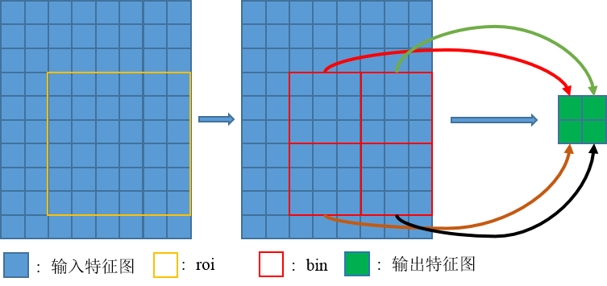
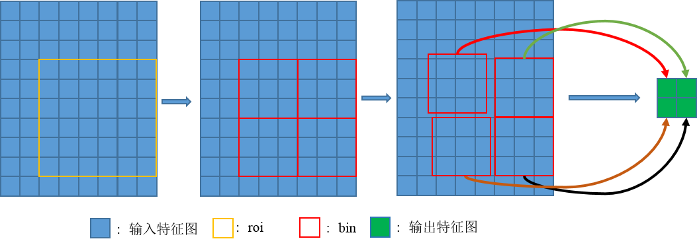
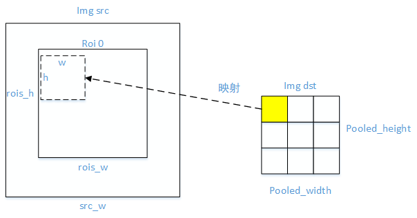
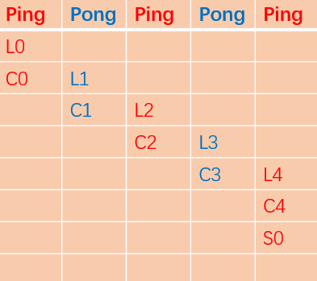

# DeformRoiPoolForward 算子开发设计方案


* #### 文档基本信息

| 算子名称    | DeformRoiPoolForward                       |
| ----------- | -------------- |
| 编制人/日期 |    卜德飞 / 2022-3-28                    |
| 审批人/日期 |    张凯茜 / 2022-4-15                    |
| 审批人/日期 |    张国鹏 / 2022-4-15                    |
| 审批人/日期 |    王远  / 2022-4-15                     |

* #### 修改记录

| 版本号| 修订人 | 修订日期 | 修订描述 |
| ----- | ------ | -------  | -------  |
| V1.0  | 卜德飞  | 2022-03-28 | 首次提交 |

* #### 内容描述

本文档为`DeformRoiPoolForward`算子的设计文档，包括需求分析、接口设计、方案设计、性能优化记录和方案实施部分。

## 1 需求分析

### 1.1 算子需求分析

- DeformRoiPoolForward算子功能是，首先对感兴趣区域的每个`bin`按照对应`offset`值进行偏移，然后将偏移后的感兴趣区域所覆盖的特征图转化为固定尺寸输出，转化方式为对所有采样点进行求平均值作为输出值，对于偏移后非整数的位置采用双线性插值获得该位置的像素值。

| 算子功能简介|                                |
|-------------|--------------------------------------------------------------|
| 需求来源    | mmcv                                       |
| 应用网络    | Faster RCNN、Mask RCNN                                                 |
| 输入数据类型| `input`、`rois`、`offset`的数据类型可以是half或float；`pooled_height`、`pooled_width`、`sampling_ratio`的数据类型均为int32；`spatial_scale`、`gamma`的数据类型均为float    |
| 输入Shape   | `input`: [batches, hi, wi, channels]；`rois`: [num_rois, 5]；`offset`: [num_rois, 2, pooled_height, pooled_width]  |
| 输入Layout  | `input`: NHWC；`rois`: ARRAY；`offset`: ARRAY, `pooled_height`、`pooled_width`、`spatial_scale`、`sampling_ratio`、`gamma`均为标量     |
| 输出数据类型| half, float                                                  |
| 输出Shape   | [num_rois, pooled_height, pooled_width, channels]                                  |
| 输出Layout  | NHWC                                                         |
| 是否需要支持原位        | 否                                                  |
| 是否需要支持stride机制  | 否                                                  |
| 是否需要支持广播  | 否                        |
| 0元素检查是否直接返回  | 当input的hi、wi为0时，正常执行，其余情况直接返回MLUOP_STATUS_BAD_PARAM                     |

### 1.2 算子功能和应用场景描述

1、Roi Pooling
- 能够将任意尺寸的候选区域转换为固定尺寸的特征图。
- 
- 设输入特征图为 `x`，roi为`w * h`大小且左上角点为`p0`的区域，Roi pooling将把roi区域分为`k * k`个bins，输出`y`为`k * k`大小的特征图。
- 对于第`(i, j)`个格子`(0 <= i,j < k)`，有下面的计算公式:
```math
y(i,j) = \frac{1}{n_{ij}} * \sum_{p\in bin(i,j)} x(p0 + p)
```
- $n_{ij}$ 表示`bin`中采样像素的个数， $bin(i,j)$ 可以解释为 $\lfloor i\frac{w}{k}\rfloor\leq p_x < \lceil (i+1)\frac{w}{k} \rceil$ , $\lfloor j\frac{h}{k}\rfloor\leq p_y < \lceil (j+1)\frac{h}{k} \rceil$

2、Deform Roi Pooling
- 在Roi Pooling的基础之上对`k * k`个bins中的每一个bin都对应添加一个偏移量 $\{\triangle p_{i,j}|0\leq i,j<k \}$ ，使得每个bin产生位置修正。
- 
```math
y(i,j) = \frac{1}{n_{ij}}*\sum_{p\in bin(i,j)} x(p0 + p + \triangle p_{i,j})\\
\triangle p_{i,j} = \gamma * \triangle \hat p_{i,j} \circ(w,h)
```
- $\triangle \hat p_{i,j}$ 是通过全连接层获得的归一化偏移量
- $\triangle p_{i,j}$ 是一个分数
- $\gamma$ 是预先设定的标量

1、需要说明对nan/inf的特殊处理，输入存在nan/inf的，分为输入当中只包含nan、只包含inf、同时包含nan和inf的情况。


### 1.3 算子输入输出参数要求

| 参数             | 语义                | 类型（输入/输出） | 支持类型         | 物理布局 | 规模限制 |
| ---------------- | ------------------ | ----------------- | -------------- | -------- | -------- |
| handle          | 操作句柄             | 输入              | mluOpHandle_t             |   -   | 无    | 
| input_desc      | 输入特征图的描述信息          | 输入              | mluOpTensorDescriptor_t     |  -   | 无    |
| input           | 输入特征图的指针                   | 输入              | fp16(half)/fp32          | NHWC  | 无   |
| rois_desc      |  感兴趣区域描述信息            | 输入              | mluOpTensorDescriptor_t     | - | 无     |
| rois           | 感兴趣区域的指针            | 输入              | fp16(half)/fp32          | ARRAY  | 无   |
| offset_desc      |  偏移值描述信息            | 输入              | mluOpTensorDescriptor_t     | - | 无     |
| offset           | 偏移值的指针            | 输入              | fp16(half)/fp32          | ARRAY  | 无   |
| pooled_height           | 特征图池化后的高              | 输入              | int      | -  | 无   |
| pooled_width           | 特征图池化后的宽              | 输入              | int      | -  | 无   |
| spatial_scale           | 输入特征图相较于原图的缩放比率             | 输入              | fp32      | -  | 无   |
| sampling_ratio           | 将roi分割为`pooled_height * pooled_width`个格子后，每个格子中使用的样本数量   | 输入  | int   | -  | 无   |
| gamma           |  偏移值的缩放系数  | 输入  | fp32   | -  | 无   |
| output_desc      | 输出特征图的描述信息          | 输入            | mluOpTensorDescriptor_t     |  -   | 无    |
| output           | 输出特征图的指针             | 输出            | fp16(half)/fp32          | NHWC  | 无   |

### 1.4 算子限制

| 限制类型    | 详细说明                                            |
| ----------- | ------------------------------------------------------------ |
| 数据类型限制| input、rois、offset和output的数据类型必须相同，并且仅支持float或half类型        |
| 布局限制    | 仅支持layout为NHWC的input和output |
| 规模限制    | input和output的最后一维必须相等；rois、offset(如果存在)和output的第一维必须相同，offset(如果存在)和output的中间两维必须相同 |
| 原位限制    | 不支持原位|
| stride限制  | 不支持stride机制|
| 数据限制  | input、rois和offset不支持nan/inf|

### 1.5 验收标准

#### 1.5.1 精度验收标准

- mluOp精度验收标准：验收标准使用动态阈值diff1,diff2:[10,10]

#### 1.5.2 性能验收标准

见 [MLU-OPS 性能验收标准](../MLU-OPS-Performance-Acceptance-Standard.md)。

## 2 算子接口设计

### 2.1 参考接口

- mmcv
```python
class DeformRoIPool(nn.Module):

    def __init__(self,
                 output_size,
                 spatial_scale=1.0,
                 sampling_ratio=0,
                 gamma=0.1):
        super(DeformRoIPool, self).__init__()
        self.output_size = _pair(output_size)
        self.spatial_scale = float(spatial_scale)
        self.sampling_ratio = int(sampling_ratio)
        self.gamma = float(gamma)

    def forward(self, input, rois, offset=None):
        return deform_roi_pool(input, rois, offset, self.output_size,
                               self.spatial_scale, self.sampling_ratio,
                               self.gamma)
```
- CUDA
```c++
void DeformRoIPoolForwardCUDAKernelLauncher(Tensor input, Tensor rois,
                                            Tensor offset, Tensor output,
                                            int pooled_height, int pooled_width,
                                            float spatial_scale,
                                            int sampling_ratio, float gamma)
```

### 2.2 接口设计

```c++
mluOpStatus_t mluOp_WIN_API mluOpDeformRoiPoolForward(const mluOpHandle_t handle,
                                                      const mluOpTensorDescriptor_t input_desc,
                                                      const void *input,
                                                      const mluOpTensorDescriptor_t rois_desc,
                                                      const void *rois,
                                                      const mluOpTensorDescriptor_t offset_desc,
                                                      const void *offset,
                                                      const int pooled_height,
                                                      const int pooled_width,
                                                      const float spatial_scale,
                                                      const int sampling_ratio,
                                                      const float gamma,
                                                      const mluOpTensorDescriptor_t output_desc,
                                                      void *output);
```

## 3 实现方案设计

### 3.1 实现方案
- 使用ping-pong流水
- 每次处理output中的一个点，通过坐标关系找到该点对应的roi区域，如果存在偏移值，则对该roi区域进行偏移操作，对偏移后bin内的所有像素点求均值，对于非整数坐标的像素点使用双线性插值获得该点对应的像素值。循环遍历完img dst中所有的点，即循环`num_rois * pooled_height * pooled_width`次（下面中为9个点，即遍历9次）。
- 
- 在处理bin中的点时，每次处理一个点(x,y平面上)对应的所有通道数据，可能由于通道数过大，导致无法一次拷贝整个通道数据到NRAM上，分为一次能够拷贝和不能处理两种情况。`nram_limit`表示NRAM能够处理的最大元素数。
- (1) roi选中的所有通道数据可以一次处理完：`8 * channels <= nram_limit - channels_align`
- 将通道内所有数据一次性拷贝至nram上，执行多次__bang_mul_scalar和__bang_add，最终获得每个channel上的平均值。
- (2) roi选中的所有通道数据不可以一次处理完：`8 * channels > nram_limit - channels_align`
- 分批拷贝数据，每次拷贝NRAM能够容纳的最大通道的整数倍数据。
- $c = (nram\\_limit - channels\\_align) / 8$
- $max\\_channels\\_per\\_core = nram\\_limit / c$
- $remain\\_channel = w * h % max\\_channels\\_per\\_core$
- $loop\\_num  = w * h / max\\_channels\\_per\\_core + remain\\_channel > 0$
- ping指针指向的内存一直进行计算，pong指针指向的内存一直进行数据加载，每次循环结束两者进行地址交换。
- 在一个bin内进行流水，当在ping上进行计算时，pong上进行数据拷贝。
- 每次都计算当前所有channel的均值，然后和上一次的均值再求平均，然后保存下来。最终获得所有channel的均值。
### 3.2 伪代码实现（可选）

### 3.3 拆分(任务拆分，多核拆分)
- 对output进行拆分，共计 $num\\_rois * pooled\\_height * pooled\\_width * channls$ 个点。
- 每次处理一整个通道的数据，故需 $num\\_rois * pooled\\_height * pooled\\_width$ 次。
- 当无法一次处理整个通道的数据时，需要对通道进行拆分，每次处理NRAM能够容纳的最大`c`的整数倍数据。
### 3.4 性能优化设计
1、资源分配

| 表项            | 分配策略   |
| ----------------| -----------|
| NRAM            | 分为ping pong两部分，ping计算时，pong进行IO |

- `nram_out：output(channels_align)`
- `nram_ping：input`
- `nram_pong：input`

2、流水设计
- `L:GDRAM2NRAM`
- `S:NRAM2GDRAM`
- `C:Compute`
- 

### 3.5 可维护性设计

1、bangc 代码中加入必要的 log 信息，比如输入的规模、数据类型、layout 这些，以及如果出错会导致程序 core dump 的变量，比如 IO 指令的 data_size、dim xyz 的值等，这些信息都是有利于快速定位问题；

2、对每一个函数命名变量命名都有充分的注释；,

3、避免魔鬼数字，对于确定的数字尽量使用公共宏来替代。

### 3.7 测试用例设计

- 该算子在网络中用到的规模：
- case1:
input: [2, 256, 200, 304], float32; rois: [998, 5], float32; output: (998, 256, 7, 7);
spatial_scale: 0.25;
- case2:
input: [2, 256, 100, 152], float32; rois: [13, 5], float32; output: (13, 256, 7, 7)
spatial_scale 0.125;
- case3:
input: [2, 256, 50, 76], float32; rois: [11, 5], float32; output: (11, 256, 7, 7)
spatial_scale 0.0625;
- case4:
input: [2, 256, 25, 38], float32; rois: [2, 5], float32; output: (2, 256, 7, 7)
spatial_scale 0.03125.

### 3.8 算子防呆检查

 1、指针为空防呆；
 ```c++
  PARAM_CHECK("[mluOpDeformRoiPoolForward]", handle != NULL);
  PARAM_CHECK("[mluOpDeformRoiPoolForward]", input_desc != NULL);
  PARAM_CHECK("[mluOpDeformRoiPoolForward]", rois_desc != NULL);
  PARAM_CHECK("[mluOpDeformRoiPoolForward]", output_desc != NULL);
  ```
 2、0元素检查防呆，VLOG(5)打印信息；
 ```c++
  if (input_desc->dims[0] == 0 || mluOpGetTensorElementNum(rois_desc) == 0 ||
      mluOpGetTensorElementNum(output_desc) == 0) {
    VLOG(5) << "[mluOpDeformRoiPoolForward] Zero element tensor failure";
    return mluOp_STATUS_BAD_PARAM;
  }
  if (mluOpGetTensorElementNum(input_desc) == 0 || mluOpGetTensorElementNum(output_desc) == 0) {
    VLOG(5) << "[mluOpDeformRoiPoolForward] Skip zero element tensor";
    return mluOp_STATUS_SUCCESS;
  }
  ```
 3、对输入输出支持的dtype、layout以及shape进行防呆；
```c++
  PARAM_CHECK("[mluOpDeformRoiPoolForward]", input_desc->layout == mluOp_LAYOUT_NHWC);
  PARAM_CHECK("[mluOpDeformRoiPoolForward]", output_desc->layout == mluOp_LAYOUT_NHWC);

  PARAM_CHECK("[mluOpDeformRoiPoolForward]",
              input_desc->dtype == mluOp_DTYPE_FLOAT || input_desc->dtype == mluOp_DTYPE_HALF);
  PARAM_CHECK("[mluOpDeformRoiPoolForward]", input_desc->dtype == rois_desc->dtype);
  PARAM_CHECK("[mluOpDeformRoiPoolForward]", input_desc->dtype == output_desc->dtype);
```

 4、算子存在的自身的相关参数防呆。
 ```c++
  if (offset_desc != NULL) {
    PARAM_CHECK("[mluOpDeformRoiPoolForward]", offset_desc->dtype == input_desc->dtype);
    PARAM_CHECK("[mluOpDeformRoiPoolForward]", offset_desc->dim == 4);
    PARAM_CHECK("[mluOpDeformRoiPoolForward]", offset_desc->dims[0] == rois_desc->dims[0]);
    PARAM_CHECK("[mluOpDeformRoiPoolForward]", offset_desc->dims[1] == 2);
    PARAM_CHECK("[mluOpDeformRoiPoolForward]", offset_desc->dims[2] == pooled_height);
    PARAM_CHECK("[mluOpDeformRoiPoolForward]", offset_desc->dims[3] == pooled_width);
  }
  
  PARAM_CHECK("[mluOpDeformRoiPoolForward]", rois_desc->dim == 2);
  PARAM_CHECK("[mluOpDeformRoiPoolForward]", rois_desc->dims[1] == 5);

  PARAM_CHECK("[mluOpDeformRoiPoolForward]", pooled_height > 0);
  PARAM_CHECK("[mluOpDeformRoiPoolForward]", pooled_width > 0);
  PARAM_CHECK("[mluOpDeformRoiPoolForward]", output_desc->dims[1] == pooled_height);
  PARAM_CHECK("[mluOpDeformRoiPoolForward]", output_desc->dims[2] == pooled_width);  
  if (rois_desc->dims[0] != output_desc->dims[0]) {
    LOG(ERROR) << "[mluOpDeformRoiPoolForward] rois number = " << rois_desc->dims[0]
               << ", output batch = " << output_desc->dims[0] << ", they should be equal.";
    return mluOp_STATUS_BAD_PARAM;
  }
  if (input_desc->dims[3] != output_desc->dims[3]) {
    LOG(ERROR) << "[mluOpDeformRoiPoolForward] input channel = " << input_desc->dims[3]
               << ", output channel = " << output_desc->dims[3] << ", they should be equal.";
    return mluOp_STATUS_BAD_PARAM;
  }
```

## 4 算子性能优化记录

### 4.1 当前存在问题的规模说明

### 4.2 已经过优化的规模说明
