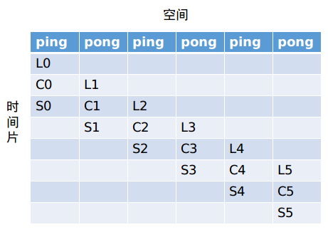

# diff_iou_rotated_sort_vertices_forward 算子开发设计方案

- #### 文档基本信息

| 算子名称    | diff_iou_rotated_sort_vertices_forward |
| ----------- | -------------------------------------- |
| 编制人/日期 | 吴少强/2023-4-11                       |
| 审批人/日期 | 刘端辉/2023-4-17                       |
| 审批人/日期 | 王远/2023-4-18                         |
| 审批人/日期 | 董成威/2023-4-18                       |

- #### 修改记录

| 版本号 | 修订人 | 修订日期  | 修订描述 |
| ------ | ------ | --------- | -------- |
| V1.0   | 吴少强 | 2023-4-11 | 首次提交 |

- #### 内容描述

本文档为`diff_iou_rotated_sort_vertices_forward`算子的设计文档，包括需求分析、接口设计、方案设计、性能优化记录和方案实施部分。

- #### 算子需求 checklist

* 算子接口描述
* 功能描述
* 框架版本 + 对应源码路径
* 需求对应网络
* 网络中用到的规模
* 是否需要支持原位
* 是否需要支持 stride 机制
* 框架单元测试阈值指标（可选）

## 1 需求分析

### 1.1 算子需求分析

| 算子功能简介                                                 | 对两个box相交构成的多边形有效顶点排序，输出排序后顶点索引 |
| ------------------------------------------------------------ | ------------------------------------------------------------ |
| 需求来源                                                     | MMCV                                                         |
| 应用网络                                                     | imvoxelnet                                                   |
| 输入数据类型                                                 | vertices: float32<br />mask: bool<br />num_valid: int32_t    |
| 输入 Shape                                                   | vertices: [B, N, 24, 2]<br />mask: [B, N, 24]<br />num_valid: [B, N] |
| 输入 Layout                                                  | ARRAY                                                        |
| 输出数据类型                                                 | int32_t                                                      |
| 输出 Shape                                                   | idx: [B, N, 9]                                               |
| 输出 Layout                                                  | ARRAY                                                        |
| 模式(可选）                                                  | 无                                                           |
| 是否含有 dim/axis 等类似语义的参数且该参数支持负数/其他特殊处理 | 无                                                           |
| 是否含有 labels/index 等类似语义的参数且该参数支持负数/界外情况/其他特殊处理 | 无                                                           |
| 是否需要支持原位                                             | 否                                                           |
| 是否需要支持 stride 机制                                     | 否                                                           |
| 是否需要支持广播                                             | 否                                                           |
| 0 元素检查是否直接返回                                       | N=0 返回 MLUOP_STATUS_SUCCESS，其余情况直接返回MLUOP_STATUS_BAD_PARAM |
| 其他特殊需求(在线量化，融合，转数提前等，可选)               | 无                                                           |
| 本次开发优先支持的规模/模式                                  |                                                              |

### 1.2 算子功能和应用场景描述

1. 算子功能：该算子为 `diff_iou_rotated` 整个计算过程中的一步，即完成对两个box相交构成的多边形有效顶点排序（参考算法按逆时针排序所有有效顶点），输出排序后顶点索引。

   - 输入输出 tensor 说明：

     1. 输入 `vertices: [B, N, 24, 2]` ： 保存两个 box 的交点坐标，其中 dim[2] = 24 表示交点数量，在实际`diff_iou_rotated` 计算时，

        24 等于 24，dim[3] = 2表示每个交点的坐标`x`和`y`；

     2. 输入 `mask:[B, N, 24]`：`24` 个交点是否为构成多边形的有效顶点，bool类型，0：无效，1：有效；

     3. 输入 `num_valid:[B, N]`：对`mask`的dim[2]求和的结果，表示多边形由几个顶点构成；

     4. 输出 `idx: [B, N, 9]`：两个矩形框相交，最大构成八边形，因此封闭八边形由8个顶点且重复第一个顶点构成，总共9个顶点的索引；

2. `diff_iou_rotated`的计算过程，分如下几步：

   1. 计算旋转后的 `box` 4个顶点坐标；
   2. 计算两个 `box` 交点及其有效性：计算两个旋转 `box` 的交点（共16个交点），并判断交点是否有效（是否有效：是否为构成相交多边形的有效顶点） ，得到 `valid_mask`；
   3. 计算 `box1` 和 `box2` 的顶点关系，即判断 `box1` 的4个角点是否在 `box2` 内 或者 `box2` 的4个点是否在 `box1` 内，输出 mask：`c1_in_2` 和 `c2_in_1`；
   4. 计算所有交点个数（ box1 和 box2 的8个角点 + 第2步中两个 `box` 交点（16个）），共24个点，及其有效性 `mask`（mask =  c1_in_2 + c2_in_1 + valid_mask ）；
   5. 对两个 `box` 相交构成的多边形有效顶点排序，输出排序后顶点索引；调用算子`diff_iou_rotated_sort_vertices_forward` 实现；
   6. 计算两个 `box` 交集面积: 根据第5步的计算结果 `idx`，计算交集面积 `intersection_area`；
   7. 计算 `iou`：两个 box 的面积为 `area1` 和 `area2`，则 `iou = intersection_area / (area1 + area2 - intersection_area)`；

3. nan/inf行为

   1. 输入vertices 存在nan/inf 的处理：只包含nan、只包含inf、同时包含nan/inf的情况。

4. example：

   ```python
   import mmcv
   import torch
   import sys
   
   from mmcv.utils import ext_loader
   ext_module = ext_loader.load_ext(
           '_ext',['diff_iou_rotated_sort_vertices_forward'])
   
   print(torch.__version__)
   def diff_iou_rotated_sort_vertices_forward():
       b = 1
       n = 4
   
       vertices = torch.randn((b, n, 24, 2), dtype=torch.float).cuda()
       mask = torch.randint(0, 2, (b, n, 24), dtype=torch.bool).cuda()
       num_valid = num_valid = torch.sum(mask.int(), dim=2).int().cuda()  # (B, N)
   
       print(vertices)
       print(mask)
       print(num_valid)
   
       idx = ext_module.diff_iou_rotated_sort_vertices_forward(
               vertices, mask, num_valid)
       
       print(idx)
   
   if __name__ == '__main__':
       diff_iou_rotated_sort_vertices_forward()
       
   """
   # vertices[1, 1, 24, 2]
   tensor([[[[    inf,  1.2343],
             [-1.7780,     inf],
             [ 0.3783,     inf],
             [    nan, -0.3525],
             [ 0.5128, -1.3507],
             [ 0.8502, -0.6566],
             [ 1.5277,  0.1336],
             [-0.3684,  1.5274],
             [-0.3581, -1.0142],
             [ 0.8423,  0.8622],
             [ 1.6489, -0.7533],
             [    inf,  0.7217],
             [-0.1898,     inf],
             [    nan,  0.3361],
             [ 1.1861,  0.2382],
             [ 2.7012,     inf],
             [ 0.3704, -0.6879],
             [ 1.1565, -0.5807],
             [    nan,  0.1900],
             [ 0.4597,     nan],
             [ 1.3887,     inf],
             [    inf,     nan],
             [ 1.3208,  1.2068],
             [-1.0437,     nan]]]], device='cuda:0')
   # mask[1, 1, 24]
   tensor([[[False,  True, False, False,  True, False, False,  True, False,  True,
             False,  True,  True, False, False, False, False, False, False,  True,
              True, False, False, False]]], device='cuda:0')
   # num_valid[1, 1]
   tensor([[8]], device='cuda:0', dtype=torch.int32)
   
   # idx[1, 1, 9]
   tensor([[[9, 1, 7, 4, 0, 4, 0, 4, 9]]], device='cuda:0', dtype=torch.int32)
   """
   
   """
   # B = 0
   tensor([], device='cuda:0', size=(0, 1, 24, 2))
   tensor([], device='cuda:0', size=(0, 1, 24), dtype=torch.bool)
   torch.Size([0, 1])
   tensor([], device='cuda:0', size=(0, 1), dtype=torch.int32)
   Traceback (most recent call last):
     File "diff_iou_rotated_kernel.py", line 48, in <module>
       diff_iou_rotated_sort_vertices_forward()
     File "diff_iou_rotated_kernel.py", line 43, in diff_iou_rotated_sort_vertices_forward
       vertices, mask, num_valid)
   RuntimeError: CUDA error: invalid configuration argument
   """
   
   """
   # N = 0
   tensor([], device='cuda:0', size=(1, 0, 24, 2))
   tensor([], device='cuda:0', size=(1, 0, 24), dtype=torch.bool)
   torch.Size([1, 0])
   tensor([], device='cuda:0', size=(1, 0), dtype=torch.int32)
   torch.Size([1, 0, 9])
   tensor([], device='cuda:0', size=(1, 0, 9), dtype=torch.int32)
   """
   ```

   

### 1.3 算子输入输出参数要求

| 参数           | 语义                                                         | 类型（输入/输出） | 支持类型                | 物理布局 | 规模限制 |
| -------------- | ------------------------------------------------------------ | ----------------- | ----------------------- | -------- | -------- |
| handle         | 当前可获得的资源（context）                                  | 输入              | mluOpHandle_t           | /        | 无       |
| vertices_desc  | 输入数据 vertices 的描述符，包含了 vertices 的数据类型、数据维度和布局等信息 | 输入              | mluOpTensorDescriptor_t | /        | 见1.4    |
| vertices       | 输入数据 vertices 的指针                                     | 输入              | float32                 | ARRAY    | 无       |
| mask_desc      | 输入数据 mask 的描述符，包含了 mask 的数据类型、数据维度和布局等信息 | 输入              | mluOpTensorDescriptor_t | /        | 见1.4    |
| mask           | 输入数据 mask 的指针                                         | 输入              | bool                    | ARRAY    | 无       |
| num_valid_desc | 输入数据 num_valid 的描述符，包含了 num_valid 的数据类型、数据维度和布局等信息 | 输入              | mluOpTensorDescriptor_t | /        | 见1.4    |
| num_valid      | 输入数据 num_valid 的指针                                    | 输入              | int32_t                 | ARRAY    | 无       |
| idx_desc       | 输出数据 idx 的描述符，包含了 idx 的数据类型、数据维度和布局等信息 | 输入              | mluOpTensorDescriptor_t | /        | 见1.4    |
| idx            | 输出数据 idx 的指针                                          | 输出              | int32_t                 | ARRAY    | 无       |

### 1.4 算子限制

| 限制类型     | 详细说明                                                     |
| ------------ | ------------------------------------------------------------ |
| 数据类型限制 | vertices: float32<br />mask: bool<br />num_valid: int32_t    |
| 布局限制     | ARRAY                                                        |
| 数据范围限制 | mask[B, N, 24]：bool类型，取值为0或者1<br />num_valid 取值范围为[0, 8] ：num_valid[B, N] = sum(mask[B, N, 24], dim=2)，即对mask最后一个维度求和<br />num_valid[B, N] <= 8：表示相交构成的多边形最多有8个有效顶点，否则输入不合法，不保证计算结果与参考接口一致 |
| 原位限制     | 不支持原位                                                   |
| stride 限制  | 不支持 stride 机制                                           |
| 广播限制     | 不支持广播                                                   |
| shape 限制   | B == vertices_desc.dims[0] == mask_desc.dims[0] == num_valid_desc.dims[0] == idx_desc.dims[0] |
| shape 限制   | N == vertices_desc.dims[1] == mask_desc.dims[1] == num_valid_desc.dims[1] == idx_desc.dims[1] |
| shape 限制   | vertices_desc.dims[2] == mask_desc.dims[2] == 24             |
| shape 限制   | vertices_desc.dims[3] == 2                                   |
| shape 限制   | idx_desc.dims[2] == 9                                        |

### 1.5 验收标准

#### 1.5.1 精度验收标准

按照[精度验收标准](../MLU-OPS-Accuracy-Acceptance-Standard.md)的要求明确本算子的精度标准。

本算子属于算术类算子，验收标准为 diff3=0。

#### 1.5.2 性能验收标准

见 [MLU-OPS 性能验收标准](../MLU-OPS-Performance-Acceptance-Standard.md)。

## 2 算子接口设计

### 2.1 参考接口

- MMCV

```c++
at::Tensor DiffIoURotatedSortVerticesCUDAKernelLauncher(at::Tensor vertices,
                                                        at::Tensor mask,
                                                        at::Tensor num_valid);
```

### 2.2 接口设计

```c++
mluOpStatus_t MLUOP_WIN_API
mluOpDiffIouRotatedSortVerticesForward(mluOpHandle_t handle,
                                       const mluOpTensorDescriptor_t vertices_desc,
                                       const void *vertices,
                                       const mluOpTensorDescriptor_t mask_desc,
                                       const void *mask,
                                       const mluOpTensorDescriptor_t num_valid_desc,
                                       const void *num_valid,
                                       const mluOpTensorDescriptor_t idx_desc,
                                       void *idx);
```

## 3 实现方案设计

### 3.1 实现方案

#### 3.1.1 计算原理说明

1. 该算子为 `diff_iou_rotated` 整个计算过程中的一步，主要完成对两个box相交构成的多边形有效顶点坐标排序，输出排序后顶点坐标索引。

2. 该算子有三个输入tensor，一个输出tensor，输入`vertices` 维度`[B, N, 24, 2]`，输入`mask` 维度`[B, N, 24]`，输入`num_valid` 维度`[B, N]`，输出`idx` 维度`[B, N, 9]`。

3. 参考接口计算原理说明：

   1. 从输入`mask[B, N, 8:]` 开始获取第一个mask值为0的索引，记为 `pad`，用于给输出`idx`填充无效索引，参考接口代码实现如下：

      ```c
      #define INTERSECTION_OFFSET 8
      int pad;  // index of arbitrary invalid intersection point (not box corner!)
      int m = 24;
      for (int j = INTERSECTION_OFFSET; j < m; ++j) {
      	if (!mask[i * m + j]) {
      		pad = j;
      		break;
      	}
      }
      ```

   2. 判断有效顶点数是否可以构成三角形，即判断 `num_valid[i]` 是否大于3（`num_valid` 合法取值范围`[0, 8]`）
      1. 若`num_valid[i]<3` 则将输出`idx[i][9]` 全部初始化为 `pad`，参考接口代码实现如下：

         ```c
         if (num_valid[i] < 3) {
           // not enough vertices, take an invalid intersection point
           // (zero padding)
           for (int j = 0; j < MAX_NUM_VERT_IDX; ++j) {
             idx[i * MAX_NUM_VERT_IDX + j] = pad;
           }
         }
         ```

      2. 若`num_valid[i]>=3` 则循环`num_valid[i]`次，从小到大（按顶点与坐标原点的夹角从小到大排序）依次保存有效顶点索引到`idx`中。顶点排序原理见下文 “4 顶点排序原理说明”；

      3. 将`idx[i][num_valid[i]]` 赋值为 `idx[i][0]`，构成封闭多边形 ，其余输出`idx[i][num_valid[i]+1:9]` 赋值为 `pad`；

   3. 特殊情况处理：当两个`box` 完全相同时，`idx`输出其中一个 `box` 的四个角点索引，其余赋值为 `pad`；

4. 顶点排序原理说明：

   - 通过分析参考接口的算法实现，算法按逆时针排序所有有效顶点（类似Graham扫描法），如下图所示：

     

     排序结果（按夹角从小到大排序）：`[p0, p1, ..., p7]`

     算子输出：将排序后顶点索引保存到 `idx` 中。

     参考接口代码实现（部分代码）如下：

     ```c
     // sort the valid vertices
     // note the number of valid vertices is known
     // note: check that num_valid[i] < MAX_NUM_VERT_IDX
     #define MAX_NUM_VERT_IDX 9
     #define EPSILON 1e-8
     // 依次遍历所有顶点
     int m = 24;
     for (int j = 0; j < num_valid[i]; ++j) {
       // initialize with a "big" value
       float x_min = 1;
       float y_min = -EPSILON;
       int i_take = 0;
       int i2;
       float x2, y2;
       if (j != 0) {
         i2 = idx[i * MAX_NUM_VERT_IDX + j - 1];
         x2 = vertices[i * m * 2 + i2 * 2 + 0];
         y2 = vertices[i * m * 2 + i2 * 2 + 1];
       }
       // 找到夹角最小的点，保存到idx[i * MAX_NUM_VERT_IDX + j] 中
       for (int k = 0; k < m; ++k) {
         float x = vertices[i * m * 2 + k * 2 + 0];
         float y = vertices[i * m * 2 + k * 2 + 1];
         if (mask[i * m + k] && compare_vertices(x, y, x_min, y_min)) {
           if ((j == 0) || (j != 0 && compare_vertices(x2, y2, x, y))) {
             x_min = x;
             y_min = y;
             i_take = k;
           }
         }
       }
       idx[i * MAX_NUM_VERT_IDX + j] = i_take;
     }
     ```
   
     其中 compare_vertices 接口用于比较两个点的大小关系。
   
   -  compare_vertices 接口说明：通过比较两个顶点 `cosθ`平方的大小（保留正负号），来判断两个点的大小关系。
   
     如下图中 p0 和 p1 点 的大小关系，调用 compare_vertices(p0_x, p0_y, p1_x, p1_y) ，结果返回 true，表示p0 < p1。
     
     
     
     参考接口代码实现如下：
     
     ```c
     /*
     compare normalized vertices (vertices around (0,0))
     if vertex1 < vertex2 return true.
     order: minimum at x-aixs, become larger in anti-clockwise direction
     */
     #define EPSILON 1e-8
     bool compare_vertices(float x1, float y1, float x2, float y2) {
       if (fabs(x1 - x2) < EPSILON && fabs(y2 - y1) < EPSILON)
         return false;  // if equal, return false
     
       if (y1 > 0 && y2 < 0) return true;
       if (y1 < 0 && y2 > 0) return false;
     
       // 通过计算 cosθ 的平方的大小，来判断两个点的大小关系
       float n1 = x1 * x1 + y1 * y1 + EPSILON;
       float n2 = x2 * x2 + y2 * y2 + EPSILON;
       float diff = fabs(x1) * x1 / n1 - fabs(x2) * x2 / n2;
     
       if (y1 > 0 && y2 > 0) {
         if (diff > EPSILON)
           return true;
         else
           return false;
       }
       if (y1 < 0 && y2 < 0) {
         if (diff < EPSILON)
           return true;
         else
           return false;
       }
       return false;
     }
     ```
     
     
     

#### 3.1.2 nram 空间划分

- 计算阶段所需额外的nram空间 `nram_pub_space`，大小 `4 * deal_num * 24`；

- 采用三级流水实现，因此将nram空间划分为两份：每一份的大小`max_nram_size/2`，其中一份的空间划分如下：

  `max_nram_size` 等于 `MAX_NRAM_SIZE - nram_pub_space`的nram空间大小：

  ```c
  int max_nram_size = MAX_NRAM_SIZE -  4 * deal_num * 24 * sizeof(T);
  ```

- `deal_num` 计算如下：

  ```c
  int deal_num = MAX_NRAM_SIZE / 2 / (4 * 24 * sizeof(T) + 24 * sizeof(bool) + (1 + 9) * sizeof(int));
  int deal_vertices_num = deal_num * 24 * 2;
  int deal_mask_num = deal_num * 24;
  int deal_num_valid_num = deal_num;
  int max_nram_size = MAX_NRAM_SIZE -  4 * deal_num * 24 * sizeof(T);
  int pingpong_offset = max_nram_size / 2;
  
  T *nram_pub_space = (T *)nram_buffer;
  
  // ping/pong
  char *nram_vertices = (char *)(nram_pub_space + 4 * deal_num * 24);
  char *nram_mask = nram_vertices + deal_vertices_num * sizeof(T);
  char *nram_num_valid = nram_mask + deal_mask_num * sizeof(bool);
  char *nram_idx = nram_num_valid + deal_num_valid_num * sizeof(int);
  ```

#### 3.1.3 实现方案

- 采用三级流水实现

- 实现过程：

  1. 任务拆分：根据3.3 拆分(任务拆分，多核拆分)章节介绍，对`B*N`进行拆分；

     计算每个task需要处理的数据量 `per_task_bn_num`

     ```c
     // 一个task需要处理的数据量 
     int total_bn_num = B * N;
     int per_task_bn_num = total_bn_num / taskDim;
     int rem_bn_num = total_bn_num % taskDim;
     // 根据taskId，计算当前task，需要处理的bn的数量 bn_num
     int bn_num = per_task_bn_num + (int)((taskId < rem_bn_num));
     // 根据taskId，计算起始索引 bn_idx
     int bn_idx = taskId * per_task_bn_num + ((taskId < rem_bn_num) ? taskId : rem_bn_num);
     ```

  2. 初始化阶段

     1. nram空间划分：根据3.1.2 nram空间划分，计算得到`deal_num`的大小；

     2. 根据 `bn_num` 和 `deal_num` 计算 repeat_n 和 rem_n

        ```c
        int repeat_n = bn_num / deal_num;
        int rem_num = bn_num % deal_num;
        ```

  3. 处理阶段：三级流水LCS

     1. 计算各tensor的GDRAM地址偏移

        ```c
        T *base_vertices = (T *)vertices + bn_idx * 24 * 2;
        bool *base_mask = (bool *)mask + bn_idx * 24;
        int32_t *base_num_valid = (int32_t *)num_valid + bn_idx;
        int32_t *base_idx = (int32_t *)idx + bn_idx * 9;
        ```

     2. 循环处理

        ```c
        // 三级流水计算过程
        if (repeat_n > 0) {
            // L[0]：load
            // load vertices数据，地址 vertices_addr = base_vertices，大小 deal_num * 24 * 2
            // load mask，地址 mask_addr = base_mask，大小 deal_num * 24
            // load num_valid，地址 mask_addr = base_num_valid，大小 deal_num
            __sync();
        }
        if (repeat_n > 1) {
            // L[1]
            // C[0]：计算
            __sync();
        }
        for (int n_iter = 0; n_iter < repeat_n - 2; ++n_iter) {
            // S[n_iter]store
            // L[n_iter + 2]
            // C[n_iter + 1]
            __sync();
        }
        if (repeat_n >= 2) {
        	// S[repeat_n - 2]
        }
        if (rem_num > 0) {
        	// L[repeat_n]
        }
        if (repeat_n > 0) {
        	// C[repeat_n - 1]
        }
        __sync();
        
        if (repeat_n > 0) {
        	// S[repeat_n - 1]
        }
        if (rem_num > 0) {
            // C[repeat_n]
            __sync();
            // S[repeat_n]
        }
        ```
     
        
     
     3. 计算过程详细说明：
     
        1. 计算所有顶点的cos值
     
           设点`p0(x, y)`， 计算 `f(p0) = abs(x) * x / (x * x + y * y)`，那么可以根据象限对`f(p0)`做加权，加权规则如下：
     
           | 象限         | 加权方法 |
           | ------------ | -------- |
           | 第一、二象限 | +0       |
           | 第三、四象限 | 取反，-2 |
     
           因cos函数为周期性函数，在[0, π]区间（第一二象限）单调递减，在[π, 2π]区间（第三四象限）单调递增，如下图所示：
     
           
     
           因此通过加权调整cos函数在[π, 2π]区间的计算结果，使得最终的函数在 [0, 2π] 单调递减，此时函数表达式如下：
     
           ```c
           value(theta) = {
               if theta < pi {
                   cos(theta)
               } else {
                   -cos(theta) - 2
               }
           }
           ```
     
           
     
           
     
           从上图可以看出，最终函数计算结果的有效区间为[1, -3]，因此对无效顶点处理时，将其计算结果置为-4，以便不影响有效顶点的排序结果。
     
           代码实现：compute_cosine 函数伪代码
     
           ```c
           template <typename T>
           static __mlu_func__ void compute_cosine(T *nram_vertices,
                                                   const bool *nram_vertices_mask,
                                                   T *nram_mask0, T *nram_temp0,
                                                   T *nram_temp1, const int point_num) {
             // 坐标处理让所有x连续，y连续：[x0,y0,x1,y1,...] -> [x0,x1,...]，[y0,y1,...]
             T *nram_vertices_x = nram_vertices;
             T *nram_vertices_y = nram_vertices + point_num;
             __bang_transpose(nram_temp0, nram_vertices, point_num, 2);
             __bang_move(nram_vertices_x, nram_temp0, 2 * point_num * sizeof(T));
           
             // 生成 y < 0 的 mask0，并对 mask0 乘 -1
             __bang_lt_scalar(nram_mask0, nram_vertices_y, (T)0.0, point_num);
             __bang_mul_scalar(nram_mask0, nram_mask0, (T)-1.0, point_num);
             // 生成 y >= 0 的 mask1
             __bang_ge_scalar(nram_temp1, nram_vertices_y, (T)0.0, point_num);
             // mask1 = mask0 + mask1
             __bang_add(nram_temp1, nram_temp1, nram_mask0, point_num);
             // x = x * mask1，即对 y<0 的点 x 坐标乘 -1
             __bang_mul(nram_vertices_x, nram_vertices_x, nram_temp1, point_num);
           
             // 计算cosine 
             // 计算 x * x + y * y + EPSILON
             __bang_square(nram_temp0, nram_vertices_x, point_num);
             __bang_square(nram_temp1, nram_vertices_y, point_num);
             __bang_add(nram_temp0, nram_temp0, nram_temp1, point_num);
             __bang_add_scalar(nram_temp0, nram_temp0, (T)EPSILON, point_num);
             // 计算 fabs(x) * x;
             __bang_abs(nram_temp1, nram_vertices_x, point_num);
             __bang_mul(nram_temp1, nram_temp1, nram_vertices_x, point_num);
           
             // 计算cosine = fabs(x) * x / (x * x + y * y + EPSILON)
             computeDiv(nram_temp0, nram_temp1, nram_temp0, point_num);
           
             // mask0 乘 2，加 cosine
             __bang_mul_scalar(nram_mask0, nram_mask0, (T)2.0, point_num);
             __bang_add(nram_temp0, nram_temp0, nram_mask0, point_num);
           
             // 特殊点处理：置 y=0 以及 无效点（vertices_mask=0）的 cosine 值为 -4
             __bang_ne_scalar(nram_mask0, nram_vertices_y, (T)0.0, point_num);
             __bang_int82float(nram_temp1, (int8_t *)(nram_vertices_mask), point_num, 0);
             __bang_and(nram_mask0, nram_mask0, nram_temp1, point_num);
             __bang_mul(nram_temp0, nram_temp0, nram_mask0, point_num);
             __bang_not(nram_mask0, nram_mask0, point_num);
             __bang_mul_scalar(nram_mask0, nram_mask0, (T)-4, point_num);
             __bang_add(nram_mask0, nram_temp0, nram_mask0, point_num);
           }
           ```
     
           
     
        2. 预处理 `mask` tensor，以便后续获取 pad
     
           首先将`nram_mask` 的前8个值填1，然后取反，以便在遍历 `deal_num` 时，可以调用 __bang_findfirst1 快速的找到pad，伪代码如下：
     
           ```c
           // set nram_temp0[24] = [1,1,1,1,1,1,1,1,0,0,0,...]
           int dim_m = 24;
           __bang_write_zero(nram_temp0, dim_m);
           __bang_write_value(nram_temp0, INTERSECTION_OFFSET, (T)1.0);
           __bang_int82float(nram_pad, (int8_t *)(nram_mask_p), deal_num * dim_m, 0);
           // 调用 cycle_maxequal 将 nram_mask 的前8个值set为1，其余保持不变，结果存 nram_pad 中
           __bang_cycle_maxequal(nram_pad, nram_pad, nram_temp0, deal_num * dim_m, dim_m);
           // 取反 nram_pad：以便后续调用 __bang_findfirst1 找到第一个不为0的值的索引
           __bang_not(nram_pad, nram_pad,  deal_num * dim_m);
           
           // 遍历
           for (int i = 0; i < deal_num; i++) {
           	int pad = (int)__bang_findfirst1(nram_pad + i * dim_m, dim_m);
           	...
           }
           ```
     
           
     
        3. 获取排序结果：循环 `deal_num` 次，依次找到每个多边形有效顶点排序后的索引
     
           ```c
           for (int i = 0; i < deal_num; i++) {
               // 获取多边形有效顶点个数
               int num_valid_points = nram_num_valid_p[i];
               // 获取 pad
               int pad = (int)__bang_findfirst1(nram_pad + i * dim_m, dim_m);
               // 初始化输出idx：刷pad
               __bang_write_value(nram_idx_p + i * MAX_NUM_VERT_IDX, MAX_NUM_VERT_IDX, pad);
           
               // 当有效顶点数 >= 3 时
               if (num_valid_points >= 3) {
                 // for corner case: the two boxes are exactly the same.
                 // in this case, idx would have duplicate elements, which makes the
                 // shoelace formula broken because of the definition, the duplicate
                 // elements only appear in the first 8 positions (they are "corners in
                 // box", not "intersection of edges")
                 if (num_valid_points == 8) {
                   __bang_eq(nram_temp0, nram_vertices_p + i * dim_m * 2,
                             nram_vertices_p + i * dim_m * 2 + 4, 4);
                   if (__bang_count(nram_temp0, 4) == 4) {
                     num_valid_points = 4;
                   }
                 }
                 
                 // 将输出idx前 num_valid_points 刷 0
                 __bang_write_zero(nram_idx_p + i * MAX_NUM_VERT_IDX, num_valid_points);
                 // 根据 第 1 步 计算cosine的结果，排序输出有效顶点索引，并对相同点去重
                 T *nram_cos = nram_mask0 + i * dim_m;
                 for (int j = 0; j < num_valid_points; ++j) {
                   // 获取顶点排序索引
                   __bang_argmax(nram_temp0, nram_cos, dim_m);
                   int i_take = (int)(*(uint32_t *)(nram_temp0 + 1));
                   // 索引 i_take 保存到 nram_idx_p[i * MAX_NUM_VERT_IDX + j] 中
                   nram_idx_p[i * MAX_NUM_VERT_IDX + j] = i_take;
                   // 相同cosine值做去重处理
                   T cos_max = nram_temp0[0];
                   __bang_eq_scalar(nram_temp1, nram_cos, cos_max, dim_m);
                   __bang_not(nram_temp0, nram_temp1, dim_m);
                   __bang_mul(nram_cos, nram_cos, nram_temp0, dim_m);
                   __bang_mul_scalar(nram_temp1, nram_temp1, (T)-4, dim_m);
                   __bang_add(nram_cos, nram_cos, nram_temp1, dim_m);
                 }
                 // duplicate the first idx
                 nram_idx_p[i * MAX_NUM_VERT_IDX + num_valid_points] =
                     nram_idx_p[i * MAX_NUM_VERT_IDX + 0];
               }
             }
           ```
     
        4. 额外空间 ：完成上述计算过程，需要额外的nram空间，大小`4 * deal_num * 24`
     
           ```c
           // nram_pub_space size = 4 * deal_num * 24
           T *nram_pad = nram_pub_space;
           T *nram_mask0 = nram_pad + deal_num * 24;
           T *nram_temp0 = nram_mask0 + deal_num * 24;
           T *nram_temp1 = nram_temp0 + deal_num * 24;
           ```
     
           

### 3.2 伪代码实现

### 3.3 拆分(任务拆分，多核拆分)

- 基本任务类型为BLOCK的任务。
- 输入`vertices` 维度 `[B, N, 24, 2]`，拆分`B * N`，将`B * N`平均拆分到所有task上处理。

### 3.4 性能优化设计

1、资源分配

| 表项 | 分配策略                                    |
| ---- | ------------------------------------------- |
| NRAM | 分 ping pong 两部分，ping 计算的时，pong IO |

2、流水设计

- 采用三级流水设计，L C S 之间排流水，即 GDRAM2NRAM、Compute、NRAM2GDRAM

  - `L:GDRAM2NRAM`
  - `S:NRAM2GDRAM`
  - `C:Compute`

  

### 3.5 可维护性设计

1、bangc 代码中加入必要的 log 信息，比如输入的规模、数据类型、layout 这些，以及如果出错会导致程序 core dump 的变量，比如 IO 指令的 data_size、dim xyz 的值等，这些信息都是有利于快速定位问题；

2、对每一个函数命名变量命名都有充分的注释；

3、避免魔鬼数字，对于确定的数字尽量使用公共宏来替代。

### 3.6 测试用例设计

- 算子在网络中用到的规模：

  - **input**

    ```c
    vertices: [1, 211, 24, 2]
    mask: [1, 211, 24]
    num_valid: [1, 211]
    ```

  - **output**

    ```c
    idx: [1, 211, 9]
    ```

- 边界 case：

  - 0元素测试

    ```c
    case1：B = 0
    tensor: vertices: [0, 211, 24, 2]
            mask: [0, 211, 24]
            num_valid: [0, 211]
            idx: [0, 211, 9]
    case2：N = 0
    tensor: vertices: [1, 0, 24, 2]
            mask: [1, 0, 24]
            num_valid: [1, 0]
            idx: [1, 0, 9]
    ```


其他可根据需要进行补充。算子开发完毕后，补充测试报告链接。

### 3.7 算子防呆检查

- 描述符指针为空防呆：handle、vertices_desc、 mask_desc、num_valid_desc、idx_desc；
- 对输入输出支持的 dtype、layout 以及 shape 进行防呆
  1. dtype防呆：vertices_desc：仅支持float32；
  2. dtype防呆：mask_desc：仅支持bool；
  3. dtype防呆：num_valid_desc、idx_desc：仅支持int32_t；
  4. dim防呆：
     1. B = vertices_desc.dims[0] == mask_desc.dims[0] == num_valid_desc.dims[0] == idx_desc.dims[0]；
     2. N = vertices_desc.dims[1] == mask_desc.dims[1] == num_valid_desc.dims[1] == idx_desc.dims[1]；
     3. vertices_desc.dims[2] == mask_desc.dims[2] == 24；
     4. vertices_desc.dims[3] == 2；
     5. idx_desc.dims[2] == 9；
- 0 元素检查防呆：N=0 返回 MLUOP_STATUS_SUCCESS，其余情况直接返回 MLUOP_STATUS_BAD_PARAM；
- 指针为空防呆：对vertices、mask、num_valid、idx指针为空防呆检查；
- large tensor防呆 （参考接口不支持large tensor）：对vertices_desc、 mask_desc、num_valid_desc、idx_desc 进行large tensor 防呆检查；

## 4 算子性能/精度问题 & 优化记录

### 4.1 当前存在问题的规模说明

暂无。

### 4.2 已经过优化的规模说明

暂无。

## 5 方案实施

### 5.1 开发测试计划

- 计划排期：

  4.10 ~ 4.18 ： 需求调研，竞品功能分析，方案文档设计和评审

  4.19 ~ 4.21 ：gtest、generator、host 代码实现，调试

  4.24 ~ 4.28 ：kernel端代码实现、调试、测试，整理测试报告

  5.1 ~ 5.5 ：PR，代码review，入库

### 5.2 风险分析

暂无。
