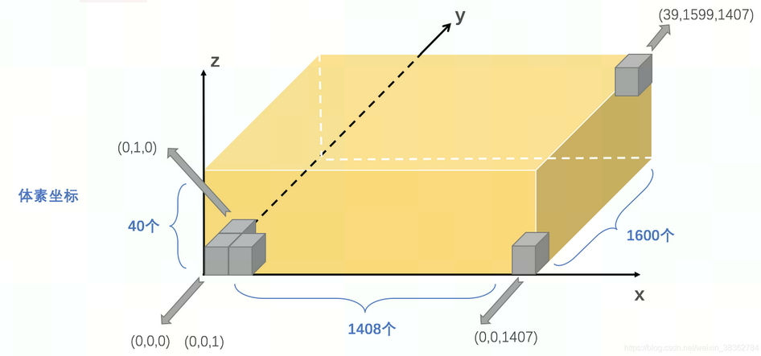
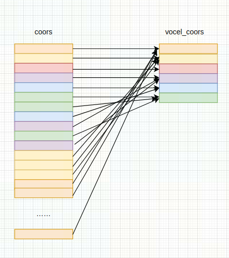

# DynamicPointToVoxelForward 算子开发设计方案

* #### 文档基本信息

| 算子名称      | DynamicPointToVoxelForward                                        |
| ------------- | ------------------------------------------------------------ |
| 编制人 / 日期 | 涂德江 / 2023-04-06                                          |
| 审批人 / 日期 | XXX / 2023-04-06                                            |
| 审批人 / 日期 | XXX / 2023-04-06                                            |
| 审批人 / 日期 | XXX / 2023-04-06                                          |

* #### 修改记录

| 版本号 | 修订人 | 修订日期   | 修订描述 |
| ------ | ------ | ---------- | -------- |
| v0.1  | 涂德江 | 2023-04-06 | 首次提交 |

* #### 内容描述

本文档为 `DynamicPointToVoxelForward` 算子的设计文档，包括需求分析、接口设计、方案设计、性能优化记录和方案实施部分。
- #### 算子需求 checklist

* 算子接口描述
* 功能描述
* 框架版本 + 对应源码路径
* 需求对应网络
* 网络中用到的规模
* 是否需要支持原位
* 是否需要支持 stride 机制
* 框架单元测试阈值指标（可选）

## 1 需求分析

### 1.1 算子需求分析

该需求分析为框架原生算子实现功能的需求分析，对于框架原生支持但 MLU-OPS 当前版本不支持的功能，需要在`1.4算子限制` 章节中显式注明。未明确注明不支持的功能，默认 MLU-OPS 全部支持。

| 算子功能简介           | 将具有相同体素坐标的多个点云数据，在特征维度上利用 `mean` 或 `max` 方法去重为一个点 |
| ---------------------- | ------------------------------------------------------------ |
| 需求来源               | mmcv                                                         |
| 应用网络               | mvxnet                                                       |
| 输入数据类型           | feats: float32 <br> coors: int32                             |
| 输入标量参数           | reduce_type: 枚举类型                                        |
| 输入Shape              | feats: [num_points, num_feats] <br> coors: [num_points, 3]   |
| 输入Layout             | ARRAY                                                        |
| 输出数据类型           | voxel_feats: float32 <br> voxel_coors: int32 <br> point2voxel_map: int32 <br> voxel_points_count: int32 <br> voxel_num: int32|
| 输出shape              | voxel_feats: [num_voxels, num_feats] <br> voxel_coors: [num_voxels, 3] <br> point2voxel_map: [num_points] <br> voxel_points_count: [num_voxels] <br> voxel_num: [1]  |
| 输出Layout             |  ARRAY                                                        |
| 是否需要支持原位       | 否                                                           |
| 是否需要支持stride机制 | 否                                                           |
| 是否需要支持广播       | 否                                                           |
| 0元素检查是否直接返回  | 输入的维度 num_points 、num_feats 和输出的维度 num_voxels 为 0 时，返回 MLUOP_STATUS_SUCCESS |

### 1.2 算子功能和应用场景描述

- #### 先验知识

3D点云数据集在三维空间中涉及到的数据信息一般包括: 位置信息、特征信息、三维空间范围、体素大小、体素坐标等，其中根据三维空间范围和体素大小，可以将一个三维空间划分为一个个体素坐标，其计算公式如下：

1）voxel_size:[voxel_x, voxel_y, voxel_z]，表示一个体素在x、y、z方向上的长宽高，即体素大小；

2）coors_range:[coors_x_min, coors_y_min, coors_z_min, coors_x_max, coors_y_max, coors_z_max]，给定的三维空间范围；

如图黄色长方体即是三维空间范围 coors_range, 灰色小方块即是体素大小 voxel_size;



将体素从点(coors_x_min, coors_y_min, coors_z_min)沿x、y、z正方向紧密排布，体素在x、y、z方向上切分出的网格数量分别为grid_x, grid_y, grid_z，采取四舍五入的方式计算:

```math
\begin{aligned}
grid\_x = round((coors\_x\_max - coors\_x\_min) / voxel\_x) \\
grid\_y = round((coors\_y\_max - coors\_y\_min) / voxel\_y) \\
grid\_z = round((coors\_z\_max - coors\_z\_min) / voxel\_z)
\end{aligned}
```

从 [0- grid_x)、[0- grid_y)、[0- grid_z), 任意一组数据组合就是三维空间体素坐标。

利用点云的位置信息可进一步获取其在三维空间中对应的体素坐标。其计算公式如下:

1）feats: [N, C], 表示有 N 个点云数据，每个点云有 C 个特征；

2）point_coors: [N, 3], 表示 N 个点云数据对应在三维空间中具体坐标信息；

将点云所在三维空间坐标信息转为三维体素网格坐标，则该点所在体素坐标 (c_x, c_y, c_z) 的计算公式为：

```math
\begin{aligned}
c\_x = floorf((point_coors[idx][0] - coors\_x\_min) / voxel\_x) \\
c\_y = floorf((point_coors[idx][1] - coors\_y\_min) / voxel\_y) \\
c\_z = floorf((point_coors[idx][2] - coors\_z\_min) / voxel\_z)
\end{aligned}
```
其中, idx的取值范围为:[0 - N), 这样就可以将点云的坐标信息 point_coors:[N, 3] 转为体素坐标 `coors`:[N, 3];

说明：根据转换公式计算得到的三维空间中体素坐标`coors`，其中每个体素坐标(c_x, c_y, c_z)，代表的是空间中一个小长方体位置，那么一个体素坐标位置可能包含多个点数据。

- #### 算子功能

`dynamic_point_to_voxel_forward`算子的主要功能就是将具有相同体素坐标的所有点数据，在 `num_feats` 特征维度上利用 `mean` 或 `max` 方法进行去重; 该算子包含三个输入:`feats`、`coors`、`reduce_type`，五个输出：`voxel_feats`、`voxel_coors`、`point2voxel_map`、`voxel_points_count`、`voxel_num`; 实现算子功能可以划分 2 个部分:

1）将体素坐标 `coors` 进行排序、去重，得到新的体素坐标 `voxel_coors`; 保存去重后体素的个数 num_voxels 到 `voxel_num`; 保存 `coors` 中每个体素坐标在 `voxel_coors` 中对应的索引到 `point2voxel_map`; 保存 `voxel_coors` 中每个体素坐标在 `coors` 中出现的个数到 `voxel_points_count`;

  

2）遍历 `feats` 中每个点，在特征维度上，对每个值根据 `reduce_type` 的方法进行计算，将结果保存到 `voxel_feats` 中; 当 `reduce_type` = `max`, 在特征维度上对每个值取最大的值; 当 `reduce_type` = `mean`, 将特征维度每个值都累加到 `voxel_feats` 对应位置中，再利用 `voxel_points_count` 获取该体素位置在原始体素中出现的个数，再对 `voxel_feats` 的特征维度求平均。

- #### example
```python
import torch
from torch.autograd import gradcheck

from mmcv.ops import DynamicScatter

def test_dynamic_scatter():
    dsmean = DynamicScatter([0.32, 0.32, 6],
                            [-74.88, -74.88, -2, 74.88, 74.88, 4], True)
    dsmax = DynamicScatter([0.32, 0.32, 6],
                           [-74.88, -74.88, -2, 74.88, 74.88, 4], False)
    feats = torch.rand(size=(20, 3), dtype=torch.float32, device='cuda') * 100 - 50
    coors = torch.randint(low=-1, high=20, size=(20, 3), dtype=torch.int32, device='cuda')

    feats_out_mean, coors_out_mean = dsmean(feats, coors)
    print(feats_out_mean)
    print(coors_out_mean)
    feats_out_max, coors_out_max = dsmax(feats, coors)
    print(feats_out_max)
    print(coors_out_max)

if __name__ == '__main__':
    test_dynamic_scatter()
```

- #### nan/inf

1）feats、voxel_feats 支持 nan/inf;

2）coors、voxel_coors、point2voxel_map、voxel_points_count、voxel_num 不支持 nan/inf。

###  1.3 算子输入输出参数要求

| 参数          | 语义                       | 类型（输入/输出） | 支持类型              | 物理布局 | 规模限制 |
| ------------- | -------------------------- | ----------------- | --------------------- | -------- | -------- |
| handle        | mluOp 上下文的指针         | 输入              | mluOpHandle_t         | -        | 无       |
| reduce_type   | 多点reduce操作的枚举       | 输入              | mluOpReduceMode_t     | -        | 无       |
| feats_desc    | 输入数据 feats 的描述符    | 输入              | mluOpTensorDescriptor | -        | 无       |
| feats         | 输入点云数据特征的指针     | 输入              | float32               | ARRAY    |  见 1.4  |
| coors_desc    | 输入数据 coors 的描述符    | 输入              | mluOpTensorDescriptor | -        | 无       |
| coors         | 输入点云体素坐标数据的指针 | 输入              | int32                 | ARRAY    | 见 1.4   |
| workspace     | 算子所需额外的空间         | 输入              | void*                 | -        | 无       |
| workspace_size| workspace所需大小          | 输入              | size_t                | -        | 无       |
| voxel_feats_desc | 输出数据 voxel_feats的描述符 | 输入         | mluOpTensorDescriptor | -        | 无       |
| voxel_feats   | 输出去重后点云特征数据的指针| 输出             | float32               | ARRAY    | 无       |
| voxel_coors_desc | 输出 voxel_coors 的描述符| 输入             | mluOpTensorDescriptor | -        | 无       |
| voxel_coors   | 输出去重后点云体素坐标数据的指针| 输出         | int32                 | ARRAY    | 无       |
| point2voxel_map_desc | 输出 point2voxel_map 的描述符| 输入     | mluOpTensorDescriptor | -        | 无       |
| point2voxel_map | 输出原始点在去重点中索引数据的指针| 输出     | int32                 | ARRAY    | 无       |
| voxel_points_count_desc| 输出 voxel_points_count 的描述符| 输入| mluOpTensorDescriptor | -        | 无       |
| voxel_points_count | 输出去重点在原始点集中重复个数的指针| 输出| int32                 | ARRAY    | 无       |
| voxel_num_desc | 输出 voxel_num 的描述符     | 输入            | mluOpTensorDescriptor | -        | 无       |
| voxel_num      | 输出去重后点的个数的指针    | 输出            | int32                 | ARRAY    | 无       |

### 1.4 算子限制

| 限制类型         | 详细说明                                                                                          |
| ---------------- | ------------------------------------------------------------------------------------------------- |
| 数据类型限制     | feats仅支持 float 类型; coors 仅支持 int32 类型                                                   |
| 布局限制         | 仅支持 layout 为 ARRAY                                                                            |
| 原位限制         | 不支持原位                                                                                        |
| stride限制       | 不支持 stride 机制                                                                                |
| 广播限制         | 不支持广播                                                                                        |
| shape 限制       | feats、coors、point2voxel_map的第一维度 dims[0] 都相等; voxel_num 的维度为 1                      |
| shape 限制       | voxel_feats、voxel_coors、voxel_points_count的第一维度 dims[0] 都相等，且<= feats的第一维度 dims[0]           |
| shape 限制       | voxel_feats、feats的第二维度 dims[1] 都相等; coors、voxel_coors的第二维度 dims[1] 都相等且等于 3              |

### 1.5 验收标准

#### 1.5.1 精度验收标准

按照[MLU-OPS 算子精度验收标准](../../../MLU-OPS-Accuracy-Acceptance-Standard.md)的要求明确本算子的精度标准。
本算子为复合类算子：
- #### voxel_feats
- 算子精度验收标准：diff1、diff2;
- 算子精度阈值描述：diff1 <= 3e-3 && diff2 <=3e-3;

- #### voxel_coors、point2voxel_map、voxel_points_count、voxel_num
- 算子精度验收标准：diff3;
- 算子精度阈值描述：diff3 = 0;

#### 1.5.2 性能验收标准

见 [MLU-OPS 性能验收标准](../../../MLU-OPS-Performance-Acceptance-Standard.md)：

## 2 算子接口设计

### 2.1 参考接口

- CUDA

```c++
std::vector<at::Tensor>
DynamicPointToVoxelForwardCUDAKernelLauncher(const at::Tensor &feats, 
                                             const at::Tensor &coors,
                                             const reduce_t reduce_type)
```

### 2.2 接口设计

```c++
typedef enum {
  MLUOP_REDUCE_SUM  = 0, /*!< Computes the sum value. */
  MLUOP_REDUCE_MEAN = 1, /*!< Computes the mean value. */
  MLUOP_REDUCE_MAX  = 2, /*!< Computes the maximun value. */
} mluOpReduceMode_t;

mluOpStatus_t MLUOP_WIN_API
mluOpGetDynamicPointToVoxelForwardWorkspaceSize(mluOpHandle_t handle,
                                                const mluOpTensorDescriptor_t feats_desc,
                                                const mluOpTensorDescriptor_t coors_desc,
                                                size_t *workspace_size)

mluOpStatus_t MLUOP_WIN_API 
mluOpDynamicPointToVoxelForward(const mluOpHandle_t handle,
                                const mluOpReduceMode_t reduce_type,
                                const mluOpTensorDescriptor_t feats_desc,
                                const void *feats,
                                const mluOpTensorDescriptor_t coors_desc,
                                const void *coors,
                                void *workspace,
                                const size_t workspace_size,
                                const mluOpTensorDescriptor_t voxel_feats_desc,
                                void *voxel_feats，
                                const mluOpTensorDescriptor_t voxel_coors_desc,
                                void *voxel_coors，
                                const mluOpTensorDescriptor_t point2voxel_map_desc,
                                void *point2voxel_map，
                                const mluOpTensorDescriptor_t voxel_points_count_desc,
                                void *voxel_points_count，
                                const mluOpTensorDescriptor_t voxel_num_desc,
                                void *voxel_num)

```

## 3 实现方案设计

### 3.1 实现方案

#### 3.1.1 计算原理说明

`dynamic_point_to_voxel_forward` 算子包含三个输入:`feats`、`coors`、`reduce_type`，五个输出：`voxel_feats`、`voxel_coors`、`point2voxel_map`、`voxel_points_count`、`voxel_num`; 根据 1.2 节算子功能, 可将算子 2 个部分分为 4 步来实现。

- #### 计算逻辑层面

1）对输入体素坐标 `coors` 排序、去重得到输出 `voxel_coors`、`point2voxel_map`、`voxel_points_count`、`voxel_num`;

2）当输入 `reduce_type` = `max`时, 对具有相同体素坐标的输入点云特征 `feats` 在特征维度 num_feats 上取最大值保存到 `voxel_feats` 中;

3）当输入 `reduce_type` = `mean`时, 对具有相同体素坐标的输入点云特征 `feats` 在特征维度 num_feats 上进行累加保存到 `voxel_feats` 中;

4）当输入 `reduce_type` = `mean`时, 根据 `voxel_points_count` 中每个位置的值对点云特征 `voxel_feats` 在特征维度 `num_feats` 上每个值求平均;

- #### 代码层面

步骤1）可复用仓库中已有的算子 unique 实现;

步骤2) 和 3）可同时进行代码编写实现;

步骤2) 、 3）、4) 可在同一个 kernel 中实现。


#### 3.1.2 实现方案

通过以上分析, 要实现 `dynamic_point_to_voxel_forward` 算子功能，其具体实现方案如下: 

- #### host 端

在 host 端主要进行两个 kernel 的逻辑调用:

1、mluOpUnique_v2 

```c++
  mluOpUniqueSort_t unique_mode = MLUOP_SORT_ASCEND;
  mluOpUniqueDescriptor_t unique_desc;
  MLUOP_CHECK(mluOpCreateUniqueDescriptor(&unique_desc));
  MLUOP_CHECK(mluOpSetUniqueDescriptor(unique_desc, unique_mode, 0, true, true));
  //unique op
  MLUOP_CHECK((mluOpUnique_v2(handle, unique_desc, coors_desc,
                              coors, workspace, workspace_size,
                              (int *)voxel_num, voxel_coors_desc,
                              voxel_coors, point2voxel_map_desc,
                              point2voxel_map, voxel_points_count_desc,
                              voxel_points_count)));
  MLUOP_CHECK(mluOpDestroyUniqueDescriptor(unique_desc));
  int32_t num_voxels = 0;
  cnrtMemcpy(&num_voxels, voxel_num, sizeof(int), CNRT_MEM_TRANS_DIR_DEV2HOST);
```
2、kernelDynamicPointToVoxelForward

```c++
//reduce
  const int num_points = feats_desc->dims[0];
  const int num_feats = feats_desc->dims[1];
  KERNEL_CHECK((KernelDynamicPointToVoxelForward(k_dim, k_type, handle->queue, reduce_type,
                                                 feats, num_points, num_feats, num_voxels,
                                                 point2voxel_map, voxel_points_count, voxel_feats)));
```

由于 unique kernel 是仓库已有算子，本设计文档不对其进行过多描述，下文主要针对 kernelDynamicPointToVoxelForward kernel 在设备端的实现方案进行详细描述。

- #### device 端

kernelDynamicPointToVoxelForward kernel 的实现方案主要分为 2 个部分，一部分完成 3.1.1 节中步骤 2）和 步骤 3）;另外一部分完成步骤 4）其具体过程如下：

- #### 第一部分

该部分主要对具有相同体素坐标的 `feats` 在特征维度上进行求 `max` 和 `add` 操作，具体步骤如下: 

step1: 对 `num_points` 进行任务拆分，计算每个 core 平均处理的点数量 `points_per_core` 和开始索引 `points_offset`，伪代码如下：

```c++
int remainder = num_points % taskDim;
int points_per_core = num_points / taskDim + (int)(taskId < remainder);
// offset of the point that core processes
int points_offset = taskId * (num_points / taskDim) + (taskId < remainder ? taskId : remainder);
```

step2: nram空间划分，先计算 `deal_p` (nram 可以划分的份数)和 `deal_h` (每份的数据量)的大小，伪代码如下：

```c++
int max_deal_h = (MAX_NRAM_SIZE / sizeof(float));
int deal_h = 0;
int deal_p = 0;
if(num_feats > max_deal_h){
  deal_p = 1;
  deal_h = max_deal_h;
} else{
  deal_h = num_feats;
  deal_p = (MAX_NRAM_SIZE / (deal_h * sizeof(float)))
}
```

当 deal_p = 1, deal_h = max_deal_h 时，nram 空间只用于保存 max_deal_h 个 float 类型的数据，否者，nram 空间将划分 deal_h 个 float 类型数据，deal_p 份。

step3: 根据 `points_per_core` 和 `deal_p` 计算 `repeat_p` (单 core 需要循环处理的次数)和 `rem_p`(单 core 最后一次要处理的点数)

```c++
int repeat_p = points_per_core / deal_p;
int rem_p = points_per_core % deal_p;
```
step4: 根据 `num_feats` 和 `deal_h` 计算 `repeat_h` (单点可一次处理的特征个数)和 `rem_h`(单点最后一次被处理的特征个数)

```c++
int repeat_h = num_feats / deal_h;
int rem_h = num_feats % deal_h;
```
step5: 循环处理, 对每份数据进行 __bang_atomic_reduce_max() 和 __bang_atomic_reduce_add() 处理

```c++
for (int32_t p_iter = 0; p_iter <= repeat_p; p_iter++){
  int32_t deal_p_num = (p_iter < repeat_p) ? deal_p : rem_p;
  if (deal_p_num == 0) {
    break;
  }
  int32_t deal_p_num_offset = p_iter * deal_p * num_feats;
  for(int32_t h_iter = 0; h_iter < repeat_h + 1; h_iter++){
    int32_t deal_h_num = (h_iter < repeat_h) ? deal_h : rem_h;
    if (deal_h_num == 0) {
        break;
    }
    int32_t deal_h_num_offset = deal_p_num_offset + h_iter * deal_p * deal_h
    float *base_feats_addr = base_feats + deal_h_num_offset;
    // load
    __memcpy(nram_feats, base_feats_addr, deal_p_num * deal_h_num* sizeof(float), GDRAM2NRAM);
    // index and atomic
    for (int32_t i = 0 ; i < deal_p_num; i++){
        int32_t point_idx = points_offset + p_iter * deal_p + i;
        int32_t reduce_to = point2voxel_map[point_idx];
        float * voxel_feats_offset = voxel_feats + reduce_to * num_feats + h_iter * deal_h;
        if (reduce_mode == REDUCE_MAX){
          __bang_atomic_reduce_max();
        } else{
          __bang_atomic_reduce_add();
        }
    }
  }
}
```

- #### 第二部分

该部分主要对 `reduce_type = mean` 时， 在 `voxel_feats` 每个特征维度上做 `div`操作，求 `mean`，具体步骤如下: 

step1: 对 `num_voxel` 进行任务拆分，计算每个 core 平均处理的点数量 `points_per_core` 和开始索引 `points_offset`，伪代码如下：

```c++
int remainder = num_voxel % taskDim;
int points_per_core = num_voxel / taskDim + (int)(taskId < remainder);
// offset of the point that core processes
int points_offset = taskId * (num_voxel / taskDim) + (taskId < remainder ? taskId : remainder);
```

step2: nram空间划分，将 nram 分为三份，一份存储需要加载的 `voxel_points_count`, 另外两份存储 `voxel_feats` 的 ping 和 pong, 用于流水操作, 再计算 `deal_v` (nram 可以划分的份数)和 `deal_h` (每份的数据量)的大小，伪代码如下：

```c++
// nram space
// |voxel_points_count|
// |voxel_feats_ping|voxel_feats_pong|
int max_deal_h = (MAX_NRAM_SIZE - sizeof(int32_t)) / (2 * sizeof(float));
int deal_h = 0;
int deal_v = 0;
if(num_feats > max_deal_h){
  deal_v = 1;
  deal_h = max_deal_h;
 } else{
  deal_h = num_feats;
  deal_v = (MAX_NRAM_SIZE - 2 * deal_h * sizeof(float)) / (sizeof(int32_t));
}
```

step3: 根据 `points_per_core` 和 `deal_v` 计算 `repeat_v` (单 core 需要循环处理的次数)和 `rem_v`(单 core 最后一次要处理的点数)

```c++
int repeat_v = points_per_core / deal_v;
int rem_v = points_per_core % deal_v;
```
step4: 根据 `num_feats` 和 `deal_h` 计算 `repeat_h` (单点可一次处理的特征个数)和 `rem_h`(单点最后一次被处理的特征个数)

```c++
int repeat_h = num_feats / deal_h;
int rem_h = num_feats % deal_h;
```
step5: 对 `voxel_feats` 的特征维度 num_feats 进行循环处理, 采用三级流水LCS

```c++
for(int v_iter = 0; v_iter <= repeat_v; v_iter++){
    int deal_v_num = (v_iter < repeat_v) ? deal_v : rem_v;
    if (deal_v_num == 0) {
      break;
    }
    float * base_voxel_feats_addr = base_voxel_feats + v_iter * deal_v * num_feats;
    int * base_points_count_addr = base_points_count + v_iter * deal_v;
    __memcpy(nram_points_count, base_points_count_addr, deal_v_num * sizeof(int), GDRAM2NRAM);
    if (num_feats <= max_deal_h) {
      // L(vi=0)
      if (deal_v_num > 0) {
        load();
        __sync();
      }
      if (deal_v_num > 1) {
        // L(vi=1)
        load();
        // C(vi=0)
        compute();
        __sync();
      }
      for (int vi = 0; vi < deal_v_num - 2; vi++) {
        // S(vi)
        store();
        // C(vi+1)
        compute();
        // L(vi+2)
        load();
        __sync();
      }

      if (deal_v_num > 1) {
        // S(vi = deal_v_num - 2)
        store();
        __sync();
      }
      if (deal_v_num > 0) {
        // C[deal_v_num - 1]
        compute();
      }
      __sync();
      if (deal_v_num > 0) {
        // S[deal_v_num - 1]
        store();
      }
    }else {
      // vi = points_offset + v_iter
      lcs();
        }
}
```

### 3.2 伪代码实现（可选）

```c++
int remainder = num_points % taskDim;
int points_per_core = num_points / taskDim + (int)(taskId < remainder);
// offset of the point that core processes
int points_offset = taskId * (num_points / taskDim) + (taskId < remainder ? taskId : remainder);
// nram space
// |feats|
int max_deal_h = (MAX_NRAM_SIZE / sizeof(float));
int deal_h = 0;
int deal_p = 0;
if(num_feats > max_deal_h){
  deal_p = 1;
  deal_h = max_deal_h;
} else{
  deal_h = num_feats;
  deal_p = (MAX_NRAM_SIZE / (deal_h * sizeof(float)))
}
float *nram_feats = (float *)nram_buffer;
float *base_feats = feats + points_offset * num_feats;
int repeat_p = points_per_core / deal_p;
int rem_p = points_per_core % deal_p;
int repeat_h = num_feats / deal_h;
int rem_h = num_feats % deal_h;

for (int32_t p_iter = 0; p_iter < repeat_p + 1; p_iter++){
  int32_t deal_p_num = (p_iter < repeat_p) ? deal_p : rem_p;
  if (deal_p_num == 0) {
    break;
  }
  int32_t deal_p_num_offset = p_iter * deal_p * num_feats;
  for(int32_t h_iter = 0; h_iter < repeat_h + 1; h_iter++){
    int32_t deal_h_num = (h_iter < repeat_h) ? deal_h : rem_h;
    if (deal_h_num == 0) {
        break;
    }
    int32_t deal_h_num_offset = deal_p_num_offset + h_iter * deal_p * deal_h
    float *base_feats_addr = base_feats + deal_h_num_offset;
    // load
    __memcpy(nram_feats, base_feats_addr, deal_p_num * deal_h_num* sizeof(float), GDRAM2NRAM);
    // index and atomic
    for (int32_t i = 0 ; i < deal_p_num; i++){
        int32_t point_idx = points_offset + p_iter * deal_p + i;
        int32_t reduce_to = point2voxel_map[point_idx];
        int32_t count = 
        float * voxel_feats_offset = voxel_feats + reduce_to * num_feats + h_iter * deal_h;
        if (reduce_mode == REDUCE_MAX){
          __bang_atomic_reduce_max();
        } else{
          __bang_atomic_reduce_add();
        }
      }
  }
}
if (reduce_mode == REDUCE_MEAN){
  int remainder = num_voxel % taskDim;
  int points_per_core = num_voxel / taskDim + (int)(taskId < remainder);
  // offset of the point that core processes
  int points_offset = taskId * (num_voxel / taskDim) + (taskId < remainder ? taskId : remainder);
  // nram space
  // |voxel_points_count|
  // |voxel_feats_ping|voxel_feats_pong|
  int max_deal_h = (MAX_NRAM_SIZE - sizeof(int32_t)) / (2 * sizeof(float));
  int deal_h = 0;
  int deal_v = 0;
  if(num_feats > max_deal_h){
    deal_v = 1;
    deal_h = max_deal_h;
  } else{
    deal_h = num_feats;
    deal_v = (MAX_NRAM_SIZE - 2 * deal_h * sizeof(float)) / (sizeof(int32_t));
  }

  int *nram_points_count = (int *)nram_buffer;
  float *voxel_feats_ping = (float *)(nram_points_count + deal_v);
  float *voxel_feats_pong = voxel_feats_ping + deal_h;
  int *base_points_count = (int *)voxel_points_count + points_offset;
  float *base_voxel_feats = (float *)voxel_feats + points_offset * num_feats;
  int repeat_v = points_per_core / deal_v;
  int rem_v = points_per_core % deal_v;
  int repeat_h = num_feats / deal_h;
  int rem_h = num_feats % deal_h;
  for(int v_iter = 0; v_iter <= repeat_v; v_iter++){
    int deal_v_num = (v_iter < repeat_v) ? deal_v : rem_v;
    if (deal_v_num == 0) {
      break;
    }
    float * base_voxel_feats_addr = base_voxel_feats + v_iter * deal_v * num_feats;
    int * base_points_count_addr = base_points_count + v_iter * deal_v;
    __memcpy(nram_points_count, base_points_count_addr, deal_v_num * sizeof(int), GDRAM2NRAM);
    if (num_feats <= max_deal_h) {
      // L(vi=0)
      if (deal_v_num > 0) {
        load();
        __sync();
      }
      if (deal_v_num > 1) {
        // L(vi=1)
        load();
        // C(vi=0)
        compute();
        __sync();
      }
      for (int vi = 0; vi < deal_v_num - 2; vi++) {
        // S(vi)
        store();
        // C(vi+1)
        compute();
        // L(vi+2)
        load();
        __sync();
      }

      if (deal_v_num > 1) {
        // S(vi = deal_v_num - 2)
        store();
        __sync();
      }
      if (deal_v_num > 0) {
        // C[deal_v_num - 1]
        compute();
      }
      __sync();
      if (deal_v_num > 0) {
        // S[deal_v_num - 1]
        store();
      }
    }else {
      // vi = points_offset + v_iter
      lcs();
        }
      }
    
  }
```
### 3.3 拆分(任务拆分，多核拆分)

- 基本任务类型为UNION1的任务。

- 多核拆

由 3.1.2小节知, 主要分为两部分

第一部分：

输入`feats:[num_points, num_feats]`，因算子主要是对具有相同体素的点去重，因此拆分`num_points`，将`num_points`平均拆分到所有task上处理。

第二部分：

输入`vocel_feats:[num_voxels, num_feats]`, `voxel_points_count:[num_voxel]`, 因算子主要是对输入求均值，因此拆分`num_voxel`，将`num_voxel`平均拆分到所有task上处理。


### 3.4 性能优化设计

- 资源分配

本设计文档主要对 kernelDynamicPointToVoxelForward 中用到的资源进行分配，unique 算子的资源分配可对应参考 unique 算子的设计文档

| 表项            | 分配策略                                                                      |
| --------------- | ----------------------------------------------------------------------------- |
| NRAM            | 参考 3.1.2节                                                                  |
| WRAM            | 未使用                                                                        |
| SRAM            | 未使用                                                                        |
| DRAM(workspace) | 未使用，只在依赖算子 unique 中需要（不作为主要讨论内容）                      |

- 流水设计

在 `reduce_type` = `mean` 时，在最后一步求均值时，采用了LCS三级流水，分别处理 `num_feats` 量大和量小的情况。

### 3.5 可维护性设计

1、bangc 代码中加入必要的 log 信息，比如输入的规模、数据类型、layout 这些，以及如果出错会导致程序 core dump 的变量，比如 IO 指令的 data_size、dim xyz 的值等，这些信息都是有利于快速定位问题；

2、对每一个函数命名变量命名都有充分的注释；

3、避免魔鬼数字，对于确定的数字尽量使用公共宏来替代。

### 3.6 测试用例设计

算子在网络中用到的规模：
- #### case1
input:

feats: torch.Size([17563,4]) fp32

coors: torch.Size([17563,3]) int32

reduce_type: 'mean'

output:

voxel_feats: torch.Size([13757, 4]) fp32

voxels_coors: torch.Size([13757, 3]) fp32

point2voxel_map: torch.Size([17563]) int32

voxel_points_count: torch.Size([13757]) int32

voxel_num: torch.Size([1]) int32

- #### case2
input:
feats: torch.Size([17563,64]) fp32

coors: torch.Size([17563,3]) int32

reduce_type: 'max'

output:
voxel_feats: torch.Size([13757, 64]) fp32

voxels_coors: torch.Size([13757, 3]) int32

point2voxel_map: torch.Size([17563]) int32

voxel_points_count: torch.Size([13757]) int32

voxel_num: torch.Size([1]) int32

其他可根据需要进行补充。算子开发完毕后，补充测试报告链接。

### 3.7 算子防呆检查

- 描述符指针为空防呆：handle、feats_desc、coors_desc、voxel_feats_desc、voxels_coors_desc、point2voxel_map_desc、
                      voxel_points_count_desc、voxel_num_desc；
- 对输入输出支持的 dtype、layout 以及 shape 进行防呆
  1. dtype防呆：feats_desc、voxel_feats_desc：仅支持float；
  2. dtype防呆：coors_desc、voxels_coors_desc、point2voxel_map_desc、voxel_points_count_desc、voxel_num_desc：仅支持int；
  3. dim防呆：
     1. feats_desc、coors_desc、point2voxel_map_desc的第一个维度大小相等且等于 num_points;
     2. voxel_feats_desc、voxels_coors_desc、voxel_points_count_des的第一个维度大小相等且等于 num_voxels;
     3. feats_desc、voxel_feats_desc的第2个维度大小相等且等于 num_feats;
     4. coors_desc、voxels_coors_desc的第2个维度大小相等且等于 3;
     5. num_points >= num_feats;
     6. voxel_num_desc 的维度为 1;
- 0 元素检查防呆：返回 MLUOP_STATUS_SUCCESS;
- 指针为空防呆：对feats、coors、voxel_feats、voxels_coors、point2voxel_map、voxel_points_count、voxel_num指针为空防呆检查;
- large tensor防呆 ：对feats、coors的检查;

## 4 算子性能优化记录

### 4.1 当前存在问题的规模说明

### 4.2 已经过优化的规模说明

## 5 方案实施

### 5.1 方案开发计划

1）2023.04.04 - 2023.04.05 ：算子竟品功能调研

2）2023.04.06 - 2023.04.13：算子设计报告撰写

3）2023.04.14 - 2023.04.14：算子设计报告评审

4）2023.04.17 - 2023.04.17：gtest端代码编写

5）2023.04.18 - 2023.04.21：host端代码编写

6）2023.04.24 - 2023.04.25：generator端代码编写

7）2023.04.26 - 2023.04.27：大规模测试和代码review

8）2023.04.28 - 2023.04.28：代码合入

### 5.2 风险分析

原子操作存在性能问题，性能可能达不到预期
