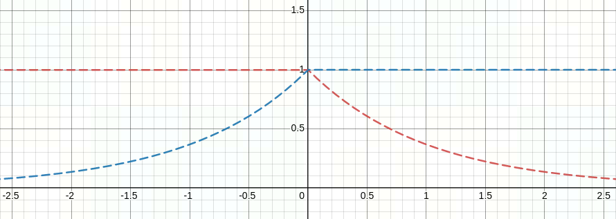
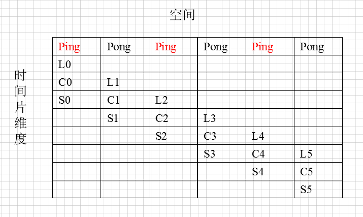
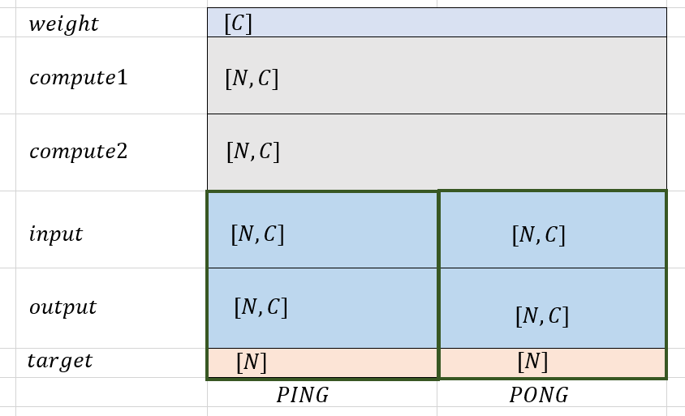

# FocalLossSigmoidBackward 算子开发设计方案

- #### 文档基本信息

| 算子名称    | FocalLossSigmoidForward                  |
| --------- | ---------------------------------------- |
| 编制人/日期 | 王远/2021-07-06                           |
| 审批人/日期 | 唐悦然/2021-08-17                         |
| 审批人/日期 | 周晨阳/2021-08-17                         |
| 审批人/日期 | 邓皓煜/2021-08-17                         |

- #### 修改记录

| 版本号 | 修订人 | 修订日期     | 修订描述       |
| ----- | ----- | ---------- | --------      |
| V1.0  | 王远   | 2021-07-06 | 首次提交       |
| V1.1  | 王远   | 2021-11-08 | 解除`input`规模限制，支持`half`类型输入，性能优化|
| V2.0  | 王远   | 2023-05-08 | 新增 `MLUOP_COMPUTATION_FAST`模式，支持 float inf&nan |
- #### 内容描述

本文档为`FocalLossSigmoidBackward`算子的设计文档，包括需求分析、接口设计、方案设计、性能优化记录和方案实施部分。

- #### 算子需求 checklist

* 算子接口描述
* 功能描述
* 框架版本 + 对应源码路径
* 需求对应网络
* 网络中用到的规模
* 是否需要支持原位
* 是否需要支持 stride 机制
* 框架单元测试阈值指标（可选）

## 1 需求分析

### 1.1 算子需求分析

该需求分析为框架原生算子实现功能的需求分析，对于框架原生支持但 MLU-OPS 当前版本不支持的功能，需要在`1.4算子限制` 章节中显式注明。未明确注明不支持的功能，默认 MLU-OPS 全部支持。

example:

| 算子功能简介                                  | 依据sigmoid计算输入数据的概率，通过概率值计算并输出focal_loss       |
| --------------------------------------------| ----------------------------------------------------------- |
| 需求来源                                      | PyTorch                                                    |
| 应用网络                                      | mmdet-retinanet                                            |
| 输入数据类型                                   | `target`支持`int32`，`input`、`weight`支持`half or float`、，`prefer、reduction`为枚举类型 |
| 输入标量参数                                   | `alpha`、`gamma`支持`float`                                 |
| 输入 Shape                                    | `input`: [N, C], `target`: [N], `weight`: [C]             |
| 输入 Layout                                   | `input`: ARRAY, `target`: ARRAY, `weight`: ARRAY          |
| 输出数据类型                                   | `half or float`                                            |
| 输出 Shape                                    | 输出shape 受 `reduction`影响，`reduction`为`None`时输出Shape为[N, C]                     |
| 输出 Layout                                   | ARRAY                                                       |
| 模式(可选）                                    | 无                                                          |
| 是否含有 dim/axis 等类似语义的参数且该参数支持负数/其他特殊处理 | 无 |
| 是否含有 labels/index 等类似语义的参数且该参数支持负数/界外情况/其他特殊处理 | 见1.4 |
| 是否需要支持原位                               | 否                                                        |
| 是否需要支持 stride 机制                       | 否                                                        |
| 是否需要支持广播                               | 否                                                        |
| 0 元素检查是否直接返回                          | 是                                                       |
| 其他特殊需求(在线量化，融合，转数提前等，可选)      |                                                          |
| 本次开发优先支持的规模/模式                    | 无                                                         |
- `[N, C]` 中 `N` 为数据输入数量，`C` 为数据类别数量。
-
### 1.2 算子功能和应用场景描述

`FocalLoss` 是在`CrossEntropyLoss` 的基础上增加了加权系数`alpha`和聚焦系数`gamma`，其目的是通过减少易分类样本的加权系数，从而使得模型在训练时更专注于难分类的样本。对于二分类问题：

```math
p = Sigmoid(input)
```
(1) `Cross Entropy Loss`公式为：
```math
\\
CE(p,target) =
\begin{cases}
-log (p),  & target=1 \\
-log(1-p), & otherwise
\end{cases}
```

(2) `Focal Loss` 公式为：


```math
FL(p_t) = -\alpha_t(1-p_t)^\gamma log(pt)
```

```math
p_t =
\begin{cases}
p,  & target=1 \\
1-p, & otherwise
\end{cases}
```

```math
\alpha_t =
\begin{cases}
\alpha,  & target=1 \\
1-\alpha, & otherwise
\end{cases}
```

此外，在`Focal Loss`的基础上，`MMCV`第三方算子增加了参数`weight`：
```math
FL_{i,j} = FL_{i,j}*weight_t　
\\
\begin{aligned}
s.t　& i=1,2,...,N \\
     & j=1,2,...,C \\
     & t=target_i
\end{aligned}
```

本节公式中，`p` 表示 `input` 通过`Sigmoid`函数计算所得的概率值， `alpha` 表示平衡因子，`gamma` 表示调节因子。

GPU `nan/inf` 行为:
NAN
```python
# =================
# NAN & gamma != 0
input = [[np.nan, np.nan]]
target  = torch.LongTensor([0]).cuda()
weight = None
alpha = 0.25
gamma = 2

# half、float 一致
# output - half : tensor([[nan, nan]]) 
# output - float: tensor([[nan, nan]])


# =================
# NAN & gamma != 0
input = [[np.nan, np.nan]]
target  = torch.LongTensor([0]).cuda()
weight = None
alpha = 0.25
gamma = 0

# half、float 不一致
# output - half :tensor([[nan, nan]])
# output - float:tensor([[21.8341, 65.5024]])
```

INF
```python
# =================
# +inf, gamma 为0或不为0，output 行为一致
input = [[np.inf, np.inf]]
target = torch.LongTensor([0]).cuda()
weight = None
alpha = 0.25
gamma = 2
 
# half、float 不一致
# output - half: tensor([[nan, inf]])
# output - float:tensor([[ 0.0000, 65.5024]])
 

# =================
# -inf, gamma 为0或不为0，output 行为一致
input = [[-np.inf, -np.inf]]
target  = torch.LongTensor([0]).cuda()
weight = None
alpha = 0.25
gamma = 2
 
# half、float 不一致
# output - half :tensor([[inf, nan]])
# output - float:tensor([[21.8341,  0.0000]], device='cuda:0')
```

MLU `nan/inf` 状态:
- `float`: `MLU` 计算结果对齐 `GPU`。
- `half`: 
  - 输入 `tensor` 仅包含`nan`、有效数，且`gamma!=0`时，`MLU` 计算结果对齐 `GPU`。
  - 其他 `nan、inf` 情景，`MLU` 计算结果不对齐 `GPU`，原因：`GPU` 部分计算过程使用位宽提升进行运算，导致 `GPU half,float` 行为不一致。

### 1.3 算子输入输出参数要求

| 参数      | 语义             | 类型（输入/输出） | 支持类型   | 物理布局  | 规模限制 |
| --------- | ----------------| -----------------| --------  | --------  | -------- |
| handle    |                                   | 句柄              |           | /        | 无       |
| prefer    | 算法        | 输入             | enum              | /         | 无       |
| reduction | 规约模式        | 输入              | enum            | /          | 无                     |
| input     | 输入数据        | 输入              | float/half          | 二维ARRAY  | shape为`[N, C]` |
| target    | 输入数据对应标签 | 输入              | int32           | 一维ARRAY   | shape为`[N]` |
| weight    | 加权系数            | 输入              | float/half          |一维ARRAY   | shape为`[C]` |
| alpha     | 平衡因子        | 输入              | float32          | /         | 无       |
| gamma     | 调节因子        | 输入              | float32          | /         | 无       |
| output    | 输出数据(`loss`)   | 输出            | float/half         | 二维ARRAY    | `shape`与`reduction`模式有关，当`reduction`模式为`None`时，`shape`为 `[N, C]` |

### 1.4 算子限制

| 限制类型     | 详细说明                                 |
| ------------| -------------------------------------  |
| 数据类型限制  | 数据类型需与1.3小节匹配                    |
| 功能限制     | 暂不支持`MLUOP_COMPUTATION_ULTRAHIGH_PRECISION`模式 (参数`prefer`) |
| 功能限制     | 暂不支持`None`以外模式 (参数`reduction`)        |
| 规模限制     | 无|
| 数据范围限制  | weight为`NULL`时，target 取值范围为 `[0,C]`    |
| 数据范围限制  | weight不为`NULL`时，target 取值范围为 `[0,C-1]` |
| 数据范围限制  |  `alpha` 支持任意值                            |
| 数据范围限制  |  `gamma` 取值范围为 `[0,+inf]`                 |
- weight为`NULL`，target 取值范围为 `[0,C]`，其中`[0,C-1]`表示target，`C` 表示全空状态。
- weight不为`NULL`，target 取值范围为 `[0,C)`，此时不支持全空状态。

### 1.5 验收标准

#### 1.5.1 精度验收标准

- 精度验收标准：该算子为激活类算子，gtest采用当前的 diff1、diff2 评价公式，验收标准为 0.3%。
- 精度验收标准：该算子为激活类算子，generate采用动态阈值， 验收标准为 `log10(mlu_diff)-log10(gpu_diff)<=1`。

#### 1.5.2 性能验收标准

- 网络中使用到的规模如下表所示。

| 输入数据     | 规模            |
| ------------| ----------------|
| input       | [2520,80]，[8892,80]，[34200,80]，[136800,80]，[547200,80]，[2772,80]，[9829,80]，[37800,80]，[151200,80]，[604800,80]   |

## 2 算子接口设计

### 2.1 参考接口

- mmcv
```python
class SigmoidFocalLossFunction(torch.autograd.Function):
    @staticmethod
    def forward(ctx,
                input,
                target,
                gamma=2.0,
                alpha=0.25,
                weight=None,
                reduction='mean')
```

- TensorFlow-addons
```python
class SigmoidFocalCrossEntropy(LossFunctionWrapper):
    def sigmoid_focal_cross_entropy(
                y_true:TensorLike,
                y_pred:TensorLike,
                alpha:FloatTensorLike=0.25,
                gamma:FloatTensorLike=2.0,
                from_logits:bool=False,)->tf.Tensor
```

### 2.2 接口设计

输入参数`prefer` 使用 `mlu_op.h`中定义的枚举类型`mluOpComputationPreference_t`
```c++
typedef enum {
  MLUOP_COMPUTATION_FAST = 0,
  /*!< Implementation with the fastest algorithm and lower precision. */
  MLUOP_COMPUTATION_HIGH_PRECISION = 1,
  /*!< Implementation with the high-precision algorithm regardless of the performance. */
  MLUOP_COMPUTATION_ULTRAHIGH_PRECISION = 2,
  /*!< Implementation with the ultrahigh-precision algorithm regardless of the performance. */
} mluOpComputationPreference_t;
```

输入参数`reduction` 使用 `mlu_op.h`中定义的枚举类型`mluOpLossReduction_t`
```c++
typedef enum {
  MLUOP_LOSS_REDUCTION_NONE = 0,
  /*!< No reduction is applied in the operation.*/
  MLUOP_LOSS_REDUCTION_SUM = 1,
  /*!< The elements of output are summed in the operation.*/
  MLUOP_LOSS_REDUCTION_MEAN = 2,
  /*!< The weighted mean of the output is applied in the operation.*/
} mluOpLossReduction_t;
```

```c++
mluOpStatus_t MLUOP_WIN_API mluOpFocalLossSigmoidForward(mluOpHandle_t handle,
                                                         const mluOpComputationPreference_t prefer,
                                                         const mluOpLossReduction_t reduction,
                                                         const mluOpTensorDescriptor_t input_desc,
                                                         const void *input,
                                                         const mluOpTensorDescriptor_t target_desc,
                                                         const void *target,
                                                         const mluOpTensorDescriptor_t weight_desc,
                                                         const void *weight,
                                                         const float alpha,
                                                         const float gamma,
                                                         const mluOpTensorDescriptor_t output_desc,
                                                         void *output) {
```

## 3 实现方案设计

### 3.1 实现方案

`Sigmoid` 的计算公式如下：
```math
  \begin{aligned}
  &\large p_{i,j} = \frac{1}{1+e^{-x_{i,j}}}
  \end{aligned}
```

暂不考虑`weight`的情况下，`Focal Loss Sigmoid Forward` 的计算公式如下：

```math
FL_{i,j} = -\alpha t_{i,j}(1-pt_{i,j})^\gamma log(pt_{i,j})\tag{1}
```

```math
pt_{i,j} =
\begin{cases}
p_{i,j},  & j==target_i \\
1-p_{i,j}, & otherwise
\end{cases}
```

```math
\alpha t_{i,j} =
\begin{cases}
\alpha,  & j==target_i \\
1-\alpha, & otherwise
\end{cases}
```

```math
\begin{aligned}
s.t　& i=1,2,...,N \\
     & j=1,2,...,C \\
     & t=target_i
\end{aligned}
```

若`weight`为`NULL`，则返回公式（1）计算结果。

```math
FL_{i,j} = FL_{i,j}*weight_t　\tag{2}
```

```math
\begin{aligned}
s.t　& i=1,2,...,N \\
     & j=1,2,...,C \\
     & t=target_i
\end{aligned}
```

否则，返回公式（2）计算结果`FL`，计算结束。


- 对于上述公式中的指数运算，可通过`log()`、`exp()`实现：
```math
x^y=e^{y*log(x)}
```

由于上式中`x,y`均为浮点类型，需要分别考虑以下六种情况：
1. `x>0`，` pow(x,y) = exp(y*log(x))`
2. `x=0,y=0`，`pow(x,y) = 1`
3. `x=0,y>0`，`pow(x,y) = 0`
4. `x=0,y<0`，`pow(x,y) = INF`
5. `x<0`，`y`为整数时，`pow(x,y) = (-1)^y * exp(y*log(|x|))`
6. `x<0`，`y`为非整数时，`pow(x,y) = NAN`

#### 3.1.1 MLUOP_COMPUTATION_FAST 方案

上述公式中 `log` 使用 `__mluop_log`。

#### 3.1.2 MLUOP_COMPUTATION_HIGH_PRECISION 方案

上述公式中 `log(1 - p)`，`1 - p` 接近 `0` 时函数曲线十分陡峭，容易造成精度丢失。

BANG C 中 log 指令精度较低，因此修改算法进行提升精度，此处对`log()`的输入进行变换：当公式变换为 `log(1+e^{-x})` ，且`x` 接近`FLT_MAX`时，因浮点有效数位有限，`1+e^{-x}` 易造成精度损失，此处通过引入 `-max(0,-x)` 解决该问题。

```math
\begin{aligned} 
   log(p) & = log(\frac{1}{1+e^{-x}}) \\
          & = log(\frac{e^{-max(0,-x)}}{e^{-max(0,-x)} + e^{-max(0,-x)-x}}) \\
          & = log(\frac{1}{e^{-max(0,-x)} + e^{-max(0,-x)-x}}) + log(e^{-max(0,-x)})  \\
          & = log(\frac{1}{e^{-max(0,-x)} + e^{-max(0,-x)-x}}) - max(0,-x) \\
\end{aligned}
```

```math
\begin{aligned} 
   log(1 - p) & = log(\frac{e^{-x}}{1+e^{-x}}) \\
              & = log(\frac{1}{\frac{1}{e^{-x}}+1}) \\
              & = log(\frac{1}{1+e^{x}}) \\
              & = log(\frac{e^{-max(0,x)}}{e^{-max(0,x)} + e^{-max(0,x)+x}}) \\
              & = log(\frac{1}{e^{-max(0,x)} + e^{-max(0,x)+x}}) + log(e^{-max(0,x)})  \\
              & = log(\frac{1}{e^{-max(0,x)} + e^{-max(0,x)+x}}) - max(0,x) \\
\end{aligned}
```

其中：

```math
e^{-max(0,-x)} \tag{3}
```

```math
e^{-max(0,-x) -x} \tag{4}
```

对应上式中所展开的两部分（公式3、4），此时较为平缓。下图中，公式3为蓝色虚线，公式4为红色虚线：



最终 `FL` 公式为：

```math
FL = -\alpha t_{i,j}(1-pt_{i,j})^\gamma log(pt_{i,j}) =
\begin{cases}
  - \alpha t_{i,j}(1-pt_{i,j})^\gamma * \{log(1 / [e^{-max(0,-x_{i,j})} + e^{-max(0,-x_{i,j}) - x_{i,j}}]\} - max(0,-x_{i,j})],  & j==target_i \\\tag{5}
  - \alpha t_{i,j}(1-pt_{i,j})^\gamma * \{log(1 / [e^{-max(0,x_{i,j})}  + e^{-max(0, x_{i,j}) + x_{i,j}}]\} - max(0,x_{i,j})],   & otherwise
\end{cases}

```

二者方案上的差别在于：
- `MLUOP_COMPUTATION_FAST` 方案对于 `log` 使用 `__mluop_log` 。
- `MLUOP_COMPUTATION_HIGH_PRECISION` 方案展开计算`log`，计算过程指令均为 `BANG C` 指令；

### 3.2 伪代码实现

无

### 3.3 拆分(任务拆分，多核拆分)

算子运行过程中独占被分配的`CLUSTER`，所以能使用其中全部的片上存储空间。通过地址偏移将输入数据从 `gdram` 搬移到对应的 `nram` 中，完成运算后将输出输入存回`gdram`。
1. 优先拆`N`:`input`规模为`[N, C]`，可以根据当前`core`的数量拆分`N`，`target`数据同样拆分`N`(与拆分后的`input`对齐)。`weight`数据不进行拆分。
2. 在拆`N`的基础上拆`C`: 假设拆解到每个`core`上的`input`规模为`[n_seg, C]`，由于片上空间无法一次完成`[1,C]`个数据的处理，因此将每个`core`一次处理的`input`规模限制为`[1, c_seg]`，`weight`数据量为`[1]`，`target`数据量为`[1]`。

### 3.4 性能优化设计

为了性能考虑，整个计算过程可以分为三级流水，即Gdram2Nram, Compute, Nram2Gdram。将NRAM上分配的空间分成两部分，一部分进行IO的同时，另一部分进行计算。每层时间片之间使用sync隔开。

三级流水线的排流水过程如下所示：



此处将`NRAM`空间分为三部分，分别用于 (1). 存储`alpha`、`gamma`、`weight`、`compute`，(2)`PING`，(3)` PONG`。
1. 拆分`N`时，`nram`空间划分如下图所示。
2. 拆分`NC`时，`weight`的空间大小为`128byte`(拆分`N`时`weight`的空间大小为`[C]`)，空间划分如下图所示。



### 3.5 可维护性设计

相对独立的功能做成函数，减少耦合、增加代码可读性；
关键变量及核心实现添加注释说明；

### 3.6 测试用例设计

- 网络中参数`reduction`恒为 `MLUOP_LOSS_REDUCTION_NONE`。
- 输入数据`input` 的`shape`为 `[N, C]`，测试规模设计如下表所示。

| input     |         |
| ------------| ----------------|
| 固定规模`[N,C]`   | [2520,80]，[8892,80]，[34200,80]，[136800,80]，[547200,80]，[2772,80]，[9829,80]，[37800,80]，[151200,80]，[604800,80]，[1,1]   |
| 固定规模`[N,C]`   | [100,50000]，[100,100000]，[100,150000]，[100,200000]   |
| 随机规模`[N,C]`   | `N` 取值区间: `[1,1000]`， `C` 取值区间: `[1,200]`   |
- 网络中参数`weight`为 `NULL` 与非`NULL`均进行测试。
- 输入数据类型 `float,half`均进行测试。

其他可根据需要进行补充。算子开发完毕后，补充测试报告链接。

### 3.7 算子防呆检查

1、指针为空防呆；
2、对输入输出支持的dtype、layout以及shape进行防呆；
3、零元素防呆。
4、算子存在的自身的相关参数防呆。

## 4 算子性能/精度问题 & 优化记录

相较 `MLUOP_COMPUTATION_HIGH_PRECISION` ，相同规模 `case` 在 `MLUOP_COMPUTATION_FAST` 模式 下，`mlu` 硬件时间提升百分比在 `10%~20%`。

### 4.1 当前存在问题的规模说明

- 无规模限制。

### 4.2 已经过优化的规模说明

- 2021.11.08 对算子进行优化，已有case性能均有提升。

## 5 方案实施

### 5.1 开发测试计划

- 2021.07.05 调研需求及源码
- 2021.07.12 编写设计方案：算子功能+接口设计+伪代码，设计方法评估
- 2021.07.26 gtest代码开发
- 2021.07.28 完成host端逻辑开发
- 2021.08.02 完成mlu kernel开发
- 2021.08.12 generator代码开发
- 2021.08.16 批量测试
- 2021.08.23 测试报告+代码review
- 2021.08.26 代码入库

### 5.2 风险分析

- 暂无
