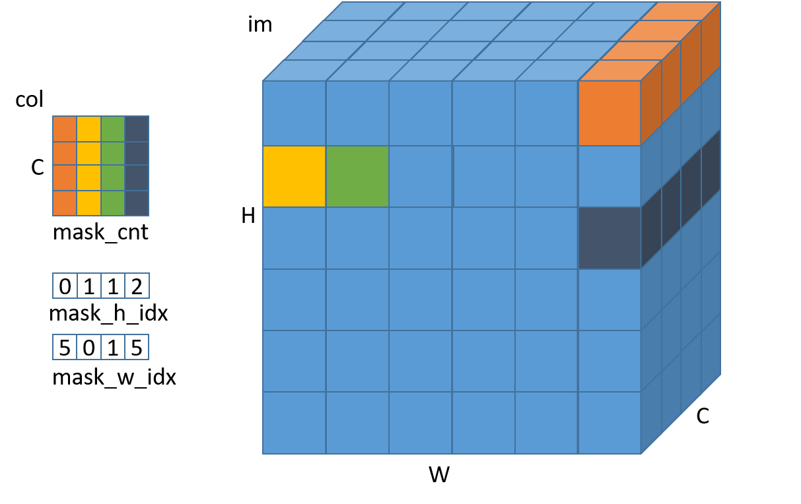

# masked_col2im_forward 算子开发设计方案


- #### 文档基本信息

| 算子名称    | masked_col2im_forward                 |
| --------- | -------------------------------------|
| 编制人/日期 | 卜德飞/2022-06-30                      |

- #### 修改记录

| 版本号| 修订人 | 修订日期 | 修订描述 |
| ----- | ------ | -------  | -------  |
| V1.0  | 卜德飞    | 2022-06-30  | 首次提交 |

- #### 内容描述

本文档为`masked_col2im_forward`算子的设计文档，包括需求分析、接口设计、方案设计、性能优化记录。

- #### 算子需求 checklist

* 算子接口描述
* 功能描述
* 框架版本 + 对应源码路径
* 需求对应网络
* 网络中用到的规模
* 是否需要支持原位
* 是否需要支持 stride 机制
* 框架单元测试阈值指标（可选）

## 1 需求分析

### 1.1 算子需求分析

该需求分析为框架原生算子实现功能的需求分析，对于框架原生支持但 MLU-OPS 当前版本不支持的功能，需要在`1.4算子限制` 章节中显式注明。未明确注明不支持的功能，默认 MLU-OPS 全部支持。


| 算子功能简介| 对col每个索引求得在mask_h_idx和mask_w_idx对应索引，根据该索引在mask_h_idx和mask_w_idx中得到对应坐标，将col中对应元素赋值给im对应位置                   |
|-------------|--------------------------------------------------------------|
| 需求来源    | mmcv                                       |
| 应用网络    | retinanet                                     |
| 输入数据类型| half, float                                                  |
| 输入Shape   | col: [channels, mask_cnt]; mask_h_idx: [mask_cnt]; mask_w_idx: [mask_cnt]     |
| 输入Layout  | 均为ARRAY   |
| 输出数据类型| half, float                                                  |
| 输出Shape   | im: [1, channels, height, width]                                  |
| 输出Layout  | NCHW                                              |
| 模式(可选） |                                                              |
| 是否含有dim/axis等类似语义的参数且该参数支持负数/其他特殊处理 | 否            |
| 是否含有labels/index等类似语义的参数且该参数支持负数/界外情况/其他特殊处理 | 否  |
| 是否需要支持原位        | 否                                                  |
| 是否需要支持stride机制  | 否                                                  |
| 是否需要支持广播  | 否                      |
| 0元素检查是否直接返回  | mask_h_idx，mask_w_idx和col的第二维支持0元素，返回MLUOP_STATUS_SUCCESS；col的第一维和im不支持0元素，MLUOP_STATUS_BAD_PARAM                        |

### 1.2 算子功能和应用场景描述


- 算子功能：该算子根据col中的索引index，计算得到对应mask_h_idx和mask_w_idx中的索引mask_index=index%mask_cnt。得到对应im中对应的坐标x=mask_w_idx[mask_index]，y=mask_h_idx[mask_index]，将对应col中元素赋值到im中(x, y, c)位置（其中c=index/mask_cnt）。

- 备注：

- 1、需要说明对nan/inf的特殊处理，输入存在nan/inf的，分为输入当中只包含nan、只包含inf、同时包含nan和inf的情况。
该算子属于IO类算子，支持nan和inf。

### 1.3 算子输入输出参数要求

| 参数             | 语义                                                         | 类型（输入/输出） | 支持类型               | 物理布局 | 规模限制 |
| ---------------- | ------------------------------------------------------------ | ----------------- | ---------------------- | -------- | -------- |
| handle           |  操作句柄                  | 输入              |    mluOpHandle_t      | /        | 无       |
| col_desc      |   输入特征图col的描述信息                           | 输入              |  mluOpTensorDescriptor_t    | /        | 无       |
| col   |         输入特征图col指针            | 输入              | half, float            | ARRAY     | 无       |
| mask_h_idx_desc      |     掩膜mask_h_idx的描述信息                            | 输入              |    mluOpTensorDescriptor_t       | /        | 无       |
| mask_h_idx       |   掩膜mask_h_idx指针          | 输入         | int32_t      | ARRAY | 无 |
| mask_w_idx_desc   |   掩膜mask_w_idx的描述信息     | 输入              |    mluOpTensorDescriptor_t       | /        | 无       |
| mask_w_idx       |   掩膜mask_w_idx指针          | 输入              | int32_t      | ARRAY    | 无      |
| workspace      |   workspace指针             | 输入              |    half, float        | /        | 无       |
| workspace_size |   workspace空间大小     | 输入              |   size_t          | /    | 无       |
| im_desc      |   输出特征图im的描述信息             | 输入              |    mluOpTensorDescriptor_t        | /        | 无       |
| im        |   输出特征图im指针                    | 输出              |   half, float           | NCHW    | 无       |

### 1.4 算子限制

| 限制类型    | 详细说明                                            |
| ----------- | ------------------------------------------------------------ |
| 数据类型限制| col和im仅支持half和float，且两者数据类型相同；mask_h_idx和mask_w_idx必须为int32_t                       |
| 布局限制    | im仅支持NCHW |
| 规模限制    | im的第一维大小必须是1；col的第二维、mask_h_idx的第一维和mask_w_idx的第一维大小相同；im的第二维和col的第一维大小相同               |
| 功能限制    | 无                         |
| 数据范围限制| mask_h_idx取整范围在[0，height-1]，height是输出col的高；mask_w_idx取整范围在[width-1],width是输出col的宽；mask_h_idx与mask_w_idx组成的坐标不允许重复     |
| 原位限制    | 不支持原位|
| stride限制  | 不支持stride机制|
| 广播限制    | 不支持广播|

### 1.5 验收标准

#### 1.5.1 精度验收标准

本算子属于纯 IO 类算子，验收标准为 diff3=0。

#### 1.5.2 性能验收标准

见 [MLU-OPS 性能验收标准](../MLU-OPS-Performance-Acceptance-Standard.md)。

## 2 算子接口设计

### 2.1 参考接口

- mmcv
```c++
void maked_col2im_forward(const Tensor col,
                          const Tensor mask_h_idx,
                          const Tensor mask_w_idx,
                          Tensor im,
                          int height,
                          int width,
                          int channels);
```

### 2.2 接口设计

```c++
mluOpStatus_t MLUOP_WIN_API
mluOpGetMaskedCol2imForwardWorkspaceSize(mluOpHandle_t handle,
                                         const mluOpTensorDescriptor_t col_desc,
                                         const mluOpTensorDescriptor_t mask_h_idx_desc,
                                         const mluOpTensorDescriptor_t mask_w_idx_desc,
                                         const mluOpTensorDescriptor_t im_desc,
                                         size_t *workspace_size);

mluOpStatus_t MLUOP_WIN_API
mluOpMaskedCol2imForward(mluOpHandle_t handle,
                         const mluOpTensorDescriptor_t col_desc,
                         const void *col,
                         const mluOpTensorDescriptor_t mask_h_idx_desc,
                         const void *mask_h_idx,
                         const mluOpTensorDescriptor_t mask_w_idx_desc,
                         const void *mask_w_idx,
                         const size_t workspace_size,
                         void *workspace,
                         const mluOpTensorDescriptor_t im_desc,
                         void *im);
```


## 3 实现方案设计

### 3.1 实现方案

- 该算子会将col中的channel * mask_cnt个数据赋值给im，每个channel的数据可以作为一组进行处理。为了使输入输出数据在channel维度连续，需要将输入col的shape由[co, mask_cnt]转置为[mask_cnt, co]，输出im由NCHW转置为NHWC。具体步骤如下：
- step1、host端调用mluOpTranspose_v2对col进行转置。
- step2、根据channel的大小选择不同处理逻辑：
  - step2-1、如果满足channel <= MAX_NRAM_SIZE / sizeof(T)，此时nram能够容纳多个channel，可以一次性memcpy(GDRAM2NRAM)连续MAX_NRAM_SIZE / sizeof(T) / channel * channel数据；分别计算这些channel对应im中的位置(mask_h_idx[index%mask_cnt], mask_w_idx[index%mask_cnt])，依次memcpy(NRAM2GDRAM)至im，其中index的范围为[0, mask_cnt]。
  - step2_2、如果满足channel > MAX_NRAM_SIZE / sizeof(T)，此时使用GDRAM2GDRAM的memcpy对单个位置的channel进行处理。
- step3、host端调用mluOpTranspose_v2对im进行转置。

### 3.2 伪代码实现（可选）

### 3.3 拆分(任务拆分，多核拆分)

1、基本任务类型是U1。

2、对mask_cnt进行数据拆分，拆分为mask_cnt / taskDim。

3、对不能均匀拆分的情况下，依次分配给前mask_cnt % taskDim个core。


### 3.4 性能优化设计
1、资源分配

| 表项            | 分配策略   |
| ----------------| -----------|
| NRAM            | MAX_NRAM_SIZE / sizeof(T)对channel向下取整大小 |
| WRAM            |  |
| SRAM            |  |
| DRAM(workspace) | 与col、im相同大小的内存空间以及transpose所需的空间 |

2、流水设计
纯IO算子，无流水。

### 3.5 可维护性设计

1、bangc 代码中加入必要的 log 信息，比如输入的规模、数据类型、layout 这些，以及如果出错会导致程序 core dump 的变量，比如 IO 指令的 data_size、dim xyz 的值等，这些信息都是有利于快速定位问题；

2、对每一个函数命名变量命名都有充分的注释；

3、避免魔鬼数字，对于确定的数字尽量使用公共宏来替代。

### 3.6 测试用例设计

- 算子在网络中用到的规模：
  - case1: float/half
  - col:[256, 200], mask_h_idx:[200], mask_d_idx:[200], im:[1, 256, 20, 20]
- 边界case：
  - case1: float
  - col:[163841, 2], mask_h_idx:[2], mask_d_idx:[2], im:[1, 163841, 20, 20]
  - case2: half
  - col:[327681, 2], mask_h_idx:[2], mask_d_idx:[2], im:[1, 327680, 20, 20]
其他可根据需要进行补充。算子开发完毕后，补充测试报告链接。

### 3.7 算子防呆检查

- 列出算子需要做的防呆，比如

1、指针为空防呆；

2、0 元素检查防呆，VLOG(5)打印信息，是否返回与框架沟通；

3、涉及 workspace 算子对于 workspace_size 的检查防呆；

4、是否需要对输入输出支持的 dtype、layout 以及 shape 进行防呆；

5、elementwise 算子则需要保证输入输出的每一个维度都要一样；

6、算子存在的自身的相关参数防呆。

主要是列出 4,5,6 防呆内容，方便 review。

## 4 算子性能/精度问题 & 优化记录

### 4.1 当前存在问题的规模说明

新算子暂无

### 4.2 已经过优化的规模说明

新算子暂无
