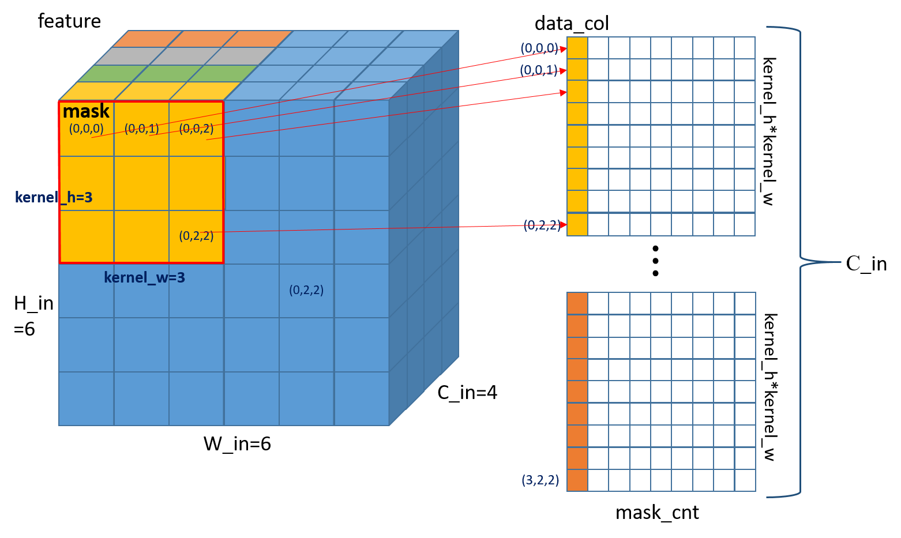
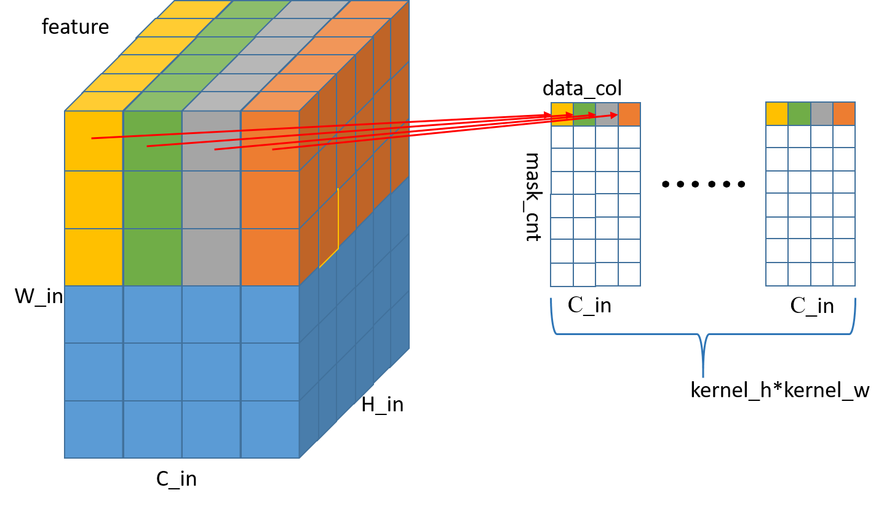

# mluOpMaskedIm2colForward 算子开发设计方案


* #### 文档基本信息

| 算子名称    | mluOpMaskedIm2colForward                                       |
| ----------- | ------------------------------------------------------------ |
| 编制人/日期 | 卜德飞/2022-6-6                                            |
| 审批人/日期 |  董成威/2022-6-6                                             |
| 审批人/日期 |  王远/2022-6-6                                             |
| 审批人/日期 |  马向军/2022-6-6                                             |

* #### 修改记录

| 版本号| 修订人 | 修订日期 | 修订描述 |
| ----- | ------ | -------  | -------  |
| V1.0  | 卜德飞 | 2022-6-6 | 首次提交 |

* #### 内容描述

本文档为`mluOpMaskedIm2colForward`算子的设计文档，包括需求分析、接口设计、方案设计、性能优化记录和方案实施部分。

## 1 需求分析

### 1.1 算子需求分析


| 算子功能简介| 根据mask_h_idx和mask_w_idx得到mask，在feature中拷贝mask区域的值，超出feature的部分使用0填充       |
|-------------|--------------------------------------------------------------|
| 需求来源    | mmcv                                       |
| 应用网络    | retinanet                                |
| 输入数据类型| half, float                                   |
| 输入Shape   | feature: $`[1, channels, hi, wi]`$ ; mask_h_idx: $`[mask\_cnt]`$ ; mask_w_idx: $`[mask\_cnt]`$  |
| 输入Layout  | feature: NCHW; mask_h_idx: ARRAY; mask_w_idx: ARRAY  |
| 输出数据类型| half, float                            |
| 输出Shape   | data_col: $`[kernel\_h*kernel\_w*channels, mask\_cnt]`$     |
| 输出Layout  | ARRAY                                          |
| 模式(可选） |                                                              |
| 是否含有dim/axis等类似语义的参数且该参数支持负数/其他特殊处理 | 无|
| 是否含有labels/index等类似语义的参数且该参数支持负数/界外情况/其他特殊处理 | 无 |
| 是否需要支持原位        | 否                                                  |
| 是否需要支持stride机制  | 否                            |
| 是否需要支持广播  | 否        |
| 0元素检查是否直接返回  | feature不支持0元素，返回MLUOP_STATUS_BAD_PARAM；data_col第一维不支持0元素，返回MLUOP_STATUS_BAD_PARAM;data_col第二维支持0元素，返回MLUOP_STATUS_SUCCESS;mask_h_idx和mask_w_idx支持0元素，返回MLUOP_STATUS_SUCCESS   |

### 1.2 算子功能和应用场景描述


- 算子功能：为了更直观理解，此处`feature`的layout为NCHW，`data_col`的shape为$`[kernel\_h*kernel\_w*channels, mask\_cnt]`$，由`mask_h_idx`和`mask_w_idx`中的值组成`mask`的左上角坐标，`kernel_w`和`kernel_h`分别为`mask`的宽高，将`feature`中被`mask`覆盖区域的值依次拷贝到`data_col`中，超出`feature`的部分使用0填充。

备注：

1、需要说明对nan/inf的特殊处理，输入存在nan/inf的，分为输入当中只包含nan、只包含inf、同时包含nan和inf的情况。
- 该算子为IO算子，支持nan和inf输入。

### 1.3 算子输入输出参数要求

| 参数             | 语义                                                         | 类型（输入/输出） | 支持类型               | 物理布局 | 规模限制 |
| ---------------- | ------------------------------------------------------------ | ----------------- | ---------------------- | -------- | -------- |
| handle           |  操作句柄                  | 输入              |    mluOpHandle_t      | /        | 无       |
| feature_desc      |   输入特征图feature的描述信息                           | 输入              |  mluOpTensorDescriptor_t    | /        | 无       |
| feature   |         输入特征图feature指针            | 输入              | half, float            | NCHW     | 无       |
| mask_h_idx_desc      |     掩膜mask_h_idx的描述信息                            | 输入              |    mluOpTensorDescriptor_t       | /        | 无       |
| mask_h_idx       |   掩膜mask_h_idx指针          | 输入   | int32_t      | ARRAY    | 无  |
| mask_w_idx_desc   |     掩膜mask_w_idx的描述信息       | 输入   |    mluOpTensorDescriptor_t   | /    | 无  |
| mask_w_idx       |   掩膜mask_w_idx指针          | 输入              | int32_t      | ARRAY    | 无  |
| data_col_desc      |   输出特征图data_col的描述信息   | 输入     |    mluOpHandle_t        | /        | 无       |
| data_col        |   输出特征图data_col指针     | 输出      |   half, float     | ARRAY    | 无  |
| data_col_desc      |   输出特征图data_col的描述信息       | 输入         |    mluOpHandle_t        | /        | 无       |
| data_col        |   输出特征图data_col指针                    | 输出              |   half, float           | ARRAY    | 无       |
| kernel_h        |   掩膜mask的高          | 输入              |   int           | /    | 无       |
| kernel_w        |   掩膜mask的宽          | 输入              |   int           | /    | 无       |
| pad_h        |   padding的高          | 输入              |   int           | /    | 无       |
| pad_w        |   padding的宽          | 输入              |   int           | /    | 无       |
| workspace      |   workspace指针             | 输入              |    half, float        | /        | 无       |
| workspace_size        |   workspace空间大小                    | 输入              |   size_t          | /    | 无       |
### 1.4 算子限制

| 限制类型    | 详细说明                                            |
| ----------- | ------------------------------------------------------------ |
| 数据类型限制| feature和data_col的数据类型为half或float，且两者数据类型相同；mask_h_idx和mask_w_idx的数据类型必须为int32_t  |
| 布局限制    | feature仅支持layout为NCHW，data_col仅支持shape为$`[channels*kernel\_h*kernel\_w, mask\_cnt]`$ |
| 规模限制    | $`feature->dims[0] == 1; data\_col->dims[0] == feature->dims[1] * kernel\_h * kernel\_w; data\_col->dims[1] == mask\_h\_idx->dims[0] == mask\_w\_idx->dims[0]`$  |
| 功能限制    | 无        |
| 数据范围限制| 无        |
| 原位限制    | 不支持原位|
| stride限制  | 不支持stride机制|
| 广播限制    | 不支持广播|

### 1.5 验收标准

#### 1.5.1 精度验收标准

本算子属于纯 IO 类算子，验收标准为 diff3=0。

#### 1.5.2 性能验收标准

见 [MLU-OPS 性能验收标准](../MLU-OPS-Performance-Acceptance-Standard.md)。

## 2 算子接口设计

### 2.1 参考接口

- mmcv-cuda
```c++
void MaskedIm2colForwardCUDAKernelLauncher(const Tensor bottom_data,
                                           const Tensor mask_h_idx,
                                           const Tensor mask_w_idx,
                                           Tensor top_data, const int kernel_h,
                                           const int kernel_w, const int pad_h,
                                           const int pad_w);
```

### 2.2 接口设计

```c++
mluOpStatus_t MLUOP_WIN_API
mluOpGetMaskedIm2colForwardWorkspaceSize(mluOpHandle_t handle,
                                         const mluOpTensorDescriptor_t feature_desc,
                                         const mluOpTensorDescriptor_t mask_h_idx_desc,
                                         const mluOpTensorDescriptor_t mask_w_idx_desc,
                                         const int kernel_h,
                                         const int kernel_w,
                                         const mluOpTensorDescriptor_t data_col_desc,
                                         size_t *workspace_size);

mluOpStatus_t MLUOP_WIN_API
mluOpMaskedIm2colForward(mluOpHandle_t handle,
                         const mluOpTensorDescriptor_t feature_desc,
                         const void *feature,
                         const mluOpTensorDescriptor_t mask_h_idx_desc,
                         const void *mask_h_idx,
                         const mluOpTensorDescriptor_t mask_w_idx_desc,
                         const void *mask_w_idx,
                         const int kernel_h,
                         const int kernel_w,
                         const int pad_h,
                         const int pad_w,
                         void *workspace,
                         const size_t workspace_size,
                         const mluOpTensorDescriptor_t data_col_desc,
                         void *data_col);
```

## 3 实现方案设计

### 3.1 实现方案

- step1. host代码首先将feature的layout由NCHW转置为NHWC，转置后的feature保存在workspace中;
- step2. host代码中调用mluOpFill()对workspace中的data_col内存部分进行刷0；
- step3. 判断mask覆盖的区域在feature中实际有效的部分，仅需处理实际有效部分的像素即可，使用GDRAM2GDRAM的memcpy将mask在feature中的有效覆盖区域拷贝到workspace中的data_col对应位置。
- step4. host代码将workspace中的data_col的shape由$`[mask\_cnt, kernel\_h*kernel\_w*channels]`$转回$`[kernel\_h*kernel\_w*channels, mask\_cnt]`$，转置后的数据保存在data_col中;
### 3.2 伪代码实现（可选）

```c++
//host
//mluOpTranspose_v2对feature进行转置
//mluOpFill()对workspace中的data_col内存刷成0

//kernel
for (int mask_index = taskId; mask_index < mask_cnt; ++mask_index) {
  const int h_col = mask_h_idx[mask_index];
  const int w_col = mask_w_idx[mask_index];
  const int h_offset = h_col - pad_h;
  const int w_offset = w_col - pad_w;
  /* cuda implement, just a example.
  for (int i = 0; i < kernel_h; ++i) {
    int h_im = h_offset + i;
    for (int j = 0; j < kernel_w; ++j) {
      int w_im = w_offset + j;
      if (h_im >= 0 && w_im >= 0 && h_im < height && w_im < width) {
        *data_col_ptr = (scalar_t)data_im[(c_im * height + h_im) * width + w_im];
      } esle {
        *data_col_ptr = 0.0;
      }
      data_col_ptr += mask_cnt;
    }
  }
  */
  int h_start = h_offset;
  int h_end = h_offset + kernel_h;
  int w_start = w_offset;
  int w_end = w_start + kernel_w;
  if (h_start >= height || w_start >= width || h_end < 0 || w_end < 0) {
    continue;
  } else {
      int h_start_valid = __mluop_max(0, h_start);
      int h_end_valid = __mluop_min(height - 1, h_end);
      int w_start_valid = __mluop_max(0, w_start);
      int w_end_valid = __mluop_min(width - 1, w_end);
      __memcpy(data_col + index * kernel_h * kernel_w * channels + ((h_start_valid - h_start) * kernel_w + (w_start_valid - w_start)) * channels,
               feature + h_start_valid * width * channels + w_start_valid * channels,
               (w_end_valid - w_start_valid + 1) * channels * sizeof(T),
               GDRAM2GDRAM,
               kernel_w * channels * sizeof(T),
               width * channels * sizeof(T),
               h_end_valid - h_start_valid);
  }
}

//host
//mluOpTranspose_v2对data_col进行转置
```

### 3.3 拆分(任务拆分，多核拆分)

1、基本任务类型是U1。

2、对mask数量进行数据拆分，拆分为$`mask\_cnt / taskDim`$。

3、对不能均匀拆分的情况下，依次分配给前$`mask\_cnt \% taskDim`$个core。

### 3.4 性能优化设计
1、资源分配

| 表项            | 分配策略   |
| ----------------| -----------|
| NRAM            | 无 |
| WRAM            | 无 |
| SRAM            | 无 |
| DRAM(workspace) | 与feature、data_col相同大小的内存空间以及transpose所需的空间 |

2、流水设计
纯IO算子，无流水。

### 3.5 可维护性设计

1、bangc 代码中加入必要的 log 信息，比如输入的规模、数据类型、layout 这些，以及如果出错会导致程序 core dump 的变量，比如 IO 指令的 data_size、dim xyz 的值等，这些信息都是有利于快速定位问题；

2、对每一个函数命名变量命名都有充分的注释；

3、避免魔鬼数字，对于确定的数字尽量使用公共宏来替代。

### 3.6 测试用例设计

- 算子在网络中用到的规模：
  - case1: 
  - feature:[1, 256, 20, 20], mask_h_idx:[200], mask_d_idx:[200], data_col:[2304, 200]
  kernel_h = 3, kernel_w = 3, pad_h = 1, pad_w = 1.
  - case2: 
  - feature:[1, 256, 20, 20], mask_h_idx:[200], mask_d_idx:[200], data_col:[256, 200]
  kernel_h = 1, kernel_w = 1, pad_h = 1, pad_w = 1.

- 边界case：
  无

### 3.7 算子防呆检查

- 列出算子需要做的防呆，比如

1、指针为空防呆；

2、0 元素检查防呆，VLOG(5)打印信息，是否返回与框架沟通；

3、涉及 workspace 算子对于 workspace_size 的检查防呆；

4、是否需要对输入输出支持的 dtype、layout 以及 shape 进行防呆；

5、elementwise 算子则需要保证输入输出的每一个维度都要一样；

6、算子存在的自身的相关参数防呆。

主要是列出 4,5,6 防呆内容，方便 review。

## 4 算子性能/精度问题 & 优化记录

### 4.1 当前存在问题的规模说明
- 暂无

### 4.2 已经过优化的规模说明

- 暂无

## 5 方案实施

### 5.1 开发测试计划

- 2022.5.30 调研源码+开始设计方案
- 2022.6.1 设计方案：算子功能+接口设计
- 2022.6.7 方案review
- 2022.6.7 generator代码开发
- 2022.6.7 gtest代码开发
- 2022.6.8 算子主体框架开发
- 2022.6.10 批量测试+测试报告
- 2022.6.15 提交MR+代码review
- 2022.6.17 算子入库

### 5.2 风险分析
