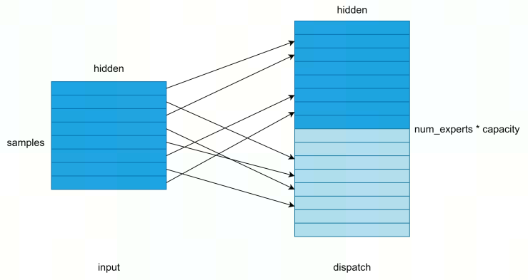
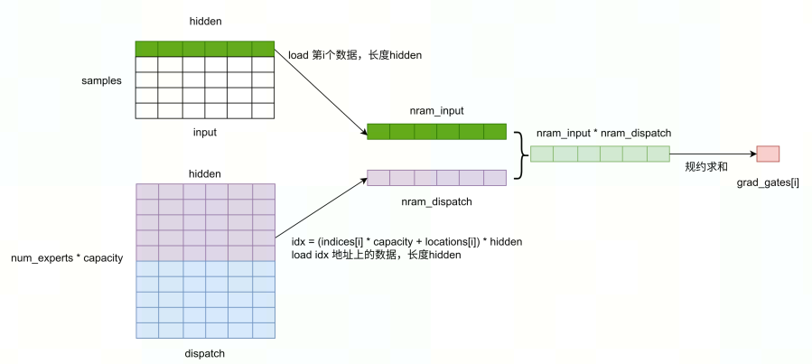
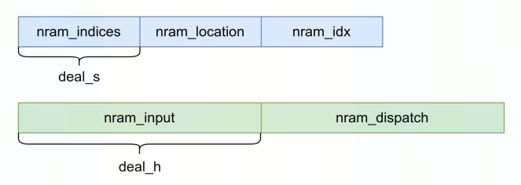

# moe_dispatch_backward_gate 算子开发设计方案

- #### 文档基本信息

| 算子名称    | moe_dispatch_backward_gate |
| ----------- | ------------ |
| 编制人/日期 | 吴少强/2023-2-20 |
| 审批人/日期 | 张皓喆/2023-2-24 |
| 审批人/日期 | 胡永安/2023-2-24 |
| 审批人/日期 | 王远/2023-2-24 |

- #### 修改记录

| 版本号 | 修订人 | 修订日期  | 修订描述 |
| ------ | ------ | --------- | -------- |
| V1.0   | 吴少强 | 2023-2-20 | 首次提交 |

- #### 内容描述

本文档为`moe_dispatch_backward_gate`算子的设计文档，包括需求分析、接口设计、方案设计、性能优化记录和方案实施部分。

- #### 算子需求 checklist

* 算子接口描述
* 功能描述
* 框架版本 + 对应源码路径
* 需求对应网络
* 网络中用到的规模
* 是否需要支持原位
* 是否需要支持 stride 机制
* 框架单元测试阈值指标（可选）

## 1 需求分析

### 1.1 算子需求分析

该需求分析为框架原生算子实现功能的需求分析，对于框架原生支持但 MLU-OPS 当前版本不支持的功能，需要在`1.4算子限制` 章节中显式注明。未明确注明不支持的功能，默认 MLU-OPS 全部支持。

| 算子功能简介                                                 | MoE算法中对输入进行重新分配（dispatch）的反向算子，用于计算gates的梯度 |
| ------------------------------------------------------------ | ------------------------------------------------------------ |
| 需求来源                                                     | tutel                                                        |
| 应用网络                                                     | swin-transformer                                             |
| 输入数据类型                                                 | float                                                        |
| 输入标量参数                                                 | samples: int<br />capacity: int<br />hidden: int<br />num_experts: int |
| 输入 Shape                                                   | indices: [samples]<br />locations: [samples]<br />input: [samples, hidden]<br />dispatch: [num_experts * capacity, hidden] |
| 输入 Layout                                                  | ARRAY                                                        |
| 输出数据类型                                                 | float                                                        |
| 输出 Shape                                                   | grad_gates: [samples]                                        |
| 输出 Layout                                                  | ARRAY                                                        |
| 模式(可选）                                                  | 否                                                           |
| 是否含有 dim/axis 等类似语义的参数且该参数支持负数/其他特殊处理 | 无                                                           |
| 是否含有 labels/index 等类似语义的参数且该参数支持负数/界外情况/其他特殊处理 | 无                                                           |
| 是否需要支持原位                                             | 否                                                           |
| 是否需要支持 stride 机制                                     | 否                                                           |
| 是否需要支持广播                                             | 否                                                           |
| 0 元素检查是否直接返回                                       | 是，返回 MLUOP_STATUS_SUCCESS                                |
| 其他特殊需求(在线量化，融合，转数提前等，可选)               | 无                                                           |
| 本次开发优先支持的规模/模式                                  |                                                              |

### 1.2 算子功能和应用场景描述

1. 算子功能：MoE算法中对输入进行重新分配（dispatch）的反向算子，用于计算gates的梯度。

   forward功能描述：根据`gates,indices,locations` ，将输入 `input` 重新分配到`dispatch`中，如下图所示：

   

   参数说明：

   `gates`：输入对应的不同专家的权重；

   `indices` ：输入选择重分配到哪个专家；

   `location`：输入重分配到某个专家所对应的`dispatch`的位置偏移；

   `input`：输入数据；

   `dispatch`：输出tensor，存放被重新分配后数据；

   伪代码如下：

   ```c
   for (int i = 0; i < samples; ++i) {
       if (locations[i] < capacity && indices[i] >= 0) {
           for (int j = 0; j < hidden; ++j) {
               dispatch[(indices[i] * capacity + locations[i]) * (hidden) + j] += gates[i] * input[i * (hidden) + j];
           }
       }
   }
   ```

2. nan/inf行为

   通过分析，参考接口代码实现中并未对nan/inf做特殊处理，因此mlu算子中也不需要做特殊处理。

3. 应用场景：该算子应用于 tutel 框架中的 MoE 算法中，MoE 算法的思想是将不同的输入分配给不同的专家进行处理，因此需要对输入顺序进行重新分配。

4. example：

   ```python
   import numpy as np
   import torch
   from tutel.jit_kernels import sparse as jit_kernel
   
   print(torch.__version__)
   def moe_dispatch_bwd_gate():
       samples=8192
       capacity=8192
       hidden=2048
       num_experts=2
       
       indices_t = np.asarray(np.random.randint(0, num_experts, size = samples))
       locations_t = np.asarray(np.random.randint(0, capacity, size = samples))
       input_t = np.asarray(np.random.randn(samples*hidden)*10, dtype=np.float32)
       dispatch_t = np.asarray(np.random.randn(num_experts*capacity*hidden)*10, dtype=np.float32)
       
       indices_gpu = torch.from_numpy(indices_t).cuda()
       locations_gpu = torch.from_numpy(locations_t).cuda()
       input_gpu = torch.from_numpy(input_t).cuda()
       dispatch_gpu = torch.from_numpy(dispatch_t).cuda()
   
       print(indices_gpu)
       print(locations_gpu)
       print(input_gpu)
       print(dispatch_gpu)
   
       grad_gates = torch.zeros([samples], dtype=input_gpu.dtype, device=input_gpu.device)
       dispatch_bwd_gate = jit_kernel.create_backward_gate(torch.float32, input_gpu.is_cuda)
       dispatch_bwd_gate(grad_gates, indices_gpu, locations_gpu, input_gpu, dispatch_gpu, extra=[samples, hidden, capacity])
       print(grad_gates)
   
   if __name__ == '__main__':
       moe_dispatch_bwd_gate()
       
   """
   tensor([1, 1, 0,  ..., 0, 1, 1], device='cuda:0')
   tensor([2326, 1359, 6146,  ..., 6383, 6670, 6245], device='cuda:0')
   tensor([ 16.7559,   0.6270,   2.3763,  ..., -13.7224,   2.1961,  -0.6358],
          device='cuda:0')
   tensor([-5.4294, 10.6417, -3.0077,  ...,  4.9271, -5.8398,  7.7017],
          device='cuda:0')
   tensor([  5392.1895, -10363.2705,  -2754.5903,  ...,   6650.3115,
            -4451.3540,   3303.7568], device='cuda:0')
   """
   """
   samples=0
   tensor([], device='cuda:0', dtype=torch.int64)
   tensor([], device='cuda:0', dtype=torch.int64)
   tensor([], device='cuda:0')
   tensor([13.6998,  1.6660, 10.6602,  ..., -7.0050, 17.3825,  7.6282],
          device='cuda:0')
   tensor([], device='cuda:0')
   """
   """
   hidden=0
   tensor([0, 0, 0,  ..., 0, 1, 0], device='cuda:0')
   tensor([1129, 3556, 7926,  ..., 2611, 8101, 7391], device='cuda:0')
   tensor([], device='cuda:0')
   tensor([], device='cuda:0')
   tensor([0., 0., 0.,  ..., 0., 0., 0.], device='cuda:0')
   """
   ```

   

### 1.3 算子输入输出参数要求

| 参数            | 语义                                                         | 类型（输入/输出） | 支持类型                | 物理布局 | 规模限制 |
| --------------- | ------------------------------------------------------------ | ----------------- | ----------------------- | -------- | -------- |
| handle          | 当前可获得的资源（context）                                  | 输入              | mluOpHandle_t           | /        | 无       |
| indices_desc    | 输入数据 indices 的描述符，包含了 indices 的数据类型、数据维度和布局等信息 | 输入              | mluOpTensorDescriptor_t | /        | 见1.4    |
| indices         | 输入数据 indices 的指针                                      | 输入              | int                     | ARRAY    | 无       |
| locations_desc  | 输入数据 locations 的描述符，包含了 locations 的数据类型、数据维度和布局等信息 | 输入              | mluOpTensorDescriptor_t | /        | 见1.4    |
| locations       | 输入数据 locations 的指针                                    | 输入              | int                     | ARRAY    | 无       |
| input_desc      | 输入数据 input 的描述符，包含了 input 的数据类型、数据维度和布局等信息 | 输入              | mluOpTensorDescriptor_t | /        | 见1.4    |
| input           | 输入数据 input 的指针                                        | 输入              | float                   | ARRAY    | 无       |
| dispatch_desc   | 输入数据 dispatch 的描述符，包含了 dispatch 的数据类型、数据维度和布局等信息 | 输入              | mluOpTensorDescriptor_t | /        | 见1.4    |
| dispatch        | 输入数据 dispatch 的指针                                     | 输入              | float                   | ARRAY    | 无       |
| samples         | 输入数据，表示输入的个数，等效于batch_size                   | 输入              | int                     | /        | 无       |
| capacity        | 输入数据，表示专家能处理的最大输入个数                       | 输入              | int                     | /        | 无       |
| hidden          | 输入数据，表示单个token的向量长度                            | 输入              | int                     | /        | 无       |
| num_experts     | 输入数据，表示专家个数                                       | 输入              | int                     | /        | 无       |
| workspace       | 输入数据，算子所需的额外空间                                 | 输入              | void*                   | /        | 无       |
| workspace_size  | 输入数据，workspace的大小                                    | 输入              | size_t                  | /        | 无       |
| grad_gates_desc | 输出数据 grad_gates 的描述符，包含了 grad_gates 的数据类型、数据维度和布局等信息 | 输入              | mluOpTensorDescriptor_t | /        | 见1.4    |
| grad_gates      | 输出数据 grad_gates 的指针                                   | 输出              | float                   | ARRAY    | 无       |

### 1.4 算子限制

| 限制类型     | 详细说明                                                     |
| ------------ | ------------------------------------------------------------ |
| 数据类型限制 | indices: int<br />location: int<br />input: float<br />dispatch: float<br />grad_gates: float |
| 布局限制     | ARRAY                                                        |
| 功能限制     | 无                                                           |
| 数据范围限制 | indices 数据范围为 [0 ~ (num_experts - 1)]<br />locations 数据范围为 [0 ~ (capacity - 1)] |
| 原位限制     | 不支持原位                                                   |
| stride 限制  | 不支持 stride 机制                                           |
| 广播限制     | 不支持广播                                                   |
| 规模限制     | indices_desc、locations_desc、input_desc、grad_gates_desc的第一个维度大小等于samples <br />input_desc、dispatch_desc的第2个维度大小等于hidden <br />dispatch_desc的第1个维度大小等于num_experts * capacity |

### 1.5 验收标准

#### 1.5.1 精度验收标准

按照[精度验收标准](../MLU-OPS-Accuracy-Acceptance-Standard.md)的要求明确本算子的精度标准。

本算子属于累加类算子，验收标准为 diff1 <= 3e-3 && diff2 <= 3e-3。

#### 1.5.2 性能验收标准

见 [MLU-OPS 性能验收标准](../MLU-OPS-Performance-Acceptance-Standard.md)。

## 2 算子接口设计

### 2.1 参考接口

- tutel

  ```c
  // backward_gate
  // cpu 
  for (int i = 0; i < samples; ++i) {
        gates1_s[i] = 0;
        if (locations1_s[i] >= capacity || indices1_s[i] < 0)
          continue;
        for (int j = 0; j < hidden; ++j) {
          gates1_s[i] += dispatched_input[(indices1_s[i] * capacity + locations1_s[i]) * (hidden) + j] * reshaped_input[i * hidden + j];
        }
  }
  
  // cuda
  def create_backward_gate(param_dtype, is_cuda=True):
    if not is_cuda:
      return JitCompiler.generate_cpu_kernel(kernel_type=2)
  
    return JitCompiler.generate_kernel({'dtype': get_kernel_dtype(param_dtype), 'IS_FLOAT': 1 if param_dtype == torch.float32 else 0}, '''
    #define __dtype @dtype@
  
    extern "C" __global__ __launch_bounds__(32) void execute(void* __restrict__ grad_gates1_s, int* __restrict__ indices1_s, int* __restrict__ locations1_s, __dtype* __restrict__ reshaped_input, __dtype* __restrict__ dispatched_input, int samples, int hidden, int capacity) {
      // [thread_extent] blockIdx.x = 512
      // [thread_extent] threadIdx.x = 32
      for (int index = blockIdx.x; index < samples; index += gridDim.x) {
        if (locations1_s[index] >= capacity || indices1_s[index] < 0) {
          if (((int)threadIdx.x) == 0)
      #if @IS_FLOAT@
            ((float*)grad_gates1_s)[index] = 0;
      #else
            ((half*)grad_gates1_s)[index] = __float2half_rn(0.000000e+00f);
      #endif
          continue;
        }
        int indice = indices1_s[index] * capacity + locations1_s[index];
      #if @IS_FLOAT@
        __dtype grad_gates1_s_rf = 0.000000e+00f;
      #else
        __dtype grad_gates1_s_rf = __dtype(0, 0);
      #endif
        for (int i = threadIdx.x; i < hidden; i += 32)
          grad_gates1_s_rf += dispatched_input[indice * (hidden) + i] * reshaped_input[index * (hidden) + i];
  
    #if !defined(__HIPCC__)
        __dtype red_buf0[1];
        unsigned int mask[1];
        __dtype t0[1];
        red_buf0[(0)] = grad_gates1_s_rf;
        mask[(0)] = __activemask();
        t0[(0)] = __shfl_down_sync(mask[(0)], red_buf0[(0)], 16, 32);
        red_buf0[(0)] = (red_buf0[(0)] + t0[(0)]);
        t0[(0)] = __shfl_down_sync(mask[(0)], red_buf0[(0)], 8, 32);
        red_buf0[(0)] = (red_buf0[(0)] + t0[(0)]);
        t0[(0)] = __shfl_down_sync(mask[(0)], red_buf0[(0)], 4, 32);
        red_buf0[(0)] = (red_buf0[(0)] + t0[(0)]);
        t0[(0)] = __shfl_down_sync(mask[(0)], red_buf0[(0)], 2, 32);
        red_buf0[(0)] = (red_buf0[(0)] + t0[(0)]);
        t0[(0)] = __shfl_down_sync(mask[(0)], red_buf0[(0)], 1, 32);
        red_buf0[(0)] = (red_buf0[(0)] + t0[(0)]);
        red_buf0[(0)] = __shfl_sync(mask[(0)], red_buf0[(0)], 0, 32);
    #else
        __shared__ __dtype red_buf0[32];
        __syncthreads();
        ((volatile __dtype*)red_buf0)[(((int)threadIdx.x))] = grad_gates1_s_rf;
        if (((int)threadIdx.x) < 16) {
          ((volatile __dtype*)red_buf0)[(((int)threadIdx.x))] = ((__dtype)(((volatile __dtype*)red_buf0)[(((int)threadIdx.x))]) + (__dtype)(((volatile __dtype*)red_buf0)[((((int)threadIdx.x) + 16))]));
          ((volatile __dtype*)red_buf0)[(((int)threadIdx.x))] = ((__dtype)(((volatile __dtype*)red_buf0)[(((int)threadIdx.x))]) + (__dtype)(((volatile __dtype*)red_buf0)[((((int)threadIdx.x) + 8))]));
          ((volatile __dtype*)red_buf0)[(((int)threadIdx.x))] = ((__dtype)(((volatile __dtype*)red_buf0)[(((int)threadIdx.x))]) + (__dtype)(((volatile __dtype*)red_buf0)[((((int)threadIdx.x) + 4))]));
          ((volatile __dtype*)red_buf0)[(((int)threadIdx.x))] = ((__dtype)(((volatile __dtype*)red_buf0)[(((int)threadIdx.x))]) + (__dtype)(((volatile __dtype*)red_buf0)[((((int)threadIdx.x) + 2))]));
          ((volatile __dtype*)red_buf0)[(((int)threadIdx.x))] = ((__dtype)(((volatile __dtype*)red_buf0)[(((int)threadIdx.x))]) + (__dtype)(((volatile __dtype*)red_buf0)[((((int)threadIdx.x) + 1))]));
        }
        __syncthreads();
    #endif
        if (((int)threadIdx.x) == 0)
    #if @IS_FLOAT@
          ((float*)grad_gates1_s)[index] = red_buf0[(0)];
    #else
          ((half*)grad_gates1_s)[index] = red_buf0[(0)].x + red_buf0[(0)].y;
    #endif
      }
    }
    ''')
  
  // 调用
  self.func_bwd_gate = jit_kernel.create_backward_gate(self.dtype, indices_[0].is_cuda)
  ctx.config.func_bwd_gate(grad_gates1_s, i, l, combined_output, ctx.expert_output, extra=[ctx.config.indices_[0].size(0), ctx.config.aligned_dim, ctx.config.capacity])
  ```

### 2.2 接口设计

#### 2.2.1 申请workspace

根据3.3 拆分(任务拆分，多核拆分)章节介绍，当samples < taskDim 时，需要进行核间规约求和，因此需要额外的空间存储每个task计算的中间结果。

```c
mluOpStatus_t MLUOP_WIN_API
mluOpGetMoeDispatchBackwardGateWorkspaceSize(mluOpHandle_t handle,
                                             const mluOpTensorDescriptor_t input_desc,
                                             size_t *workspace_size);
```

#### 2.2.2 计算接口

```c++
mluOpStatus_t MLUOP_WIN_API
mluOpMoeDispatchBackwardGate(mluOpHandle_t handle,
                             const mluOpTensorDescriptor_t indices_desc,
                             const void *indices,
                             const mluOpTensorDescriptor_t locations_desc,
                             const void *locations,
                             const mluOpTensorDescriptor_t input_desc,
                             const void *input,
                             const mluOpTensorDescriptor_t dispatch_desc,
                             const void *dispatch,
                             const int samples,
                             const int capacity,
                             const int hidden,
                             const int num_experts,
                             void *workspace,
                             const size_t workspace_size,
                             const mluOpTensorDescriptor_t grad_gates_desc,
                             void *grad_gates);
```

## 3 实现方案设计

### 3.1 实现方案

#### 3.1.1 计算原理说明

MoE算法中对输入进行重新分配（dispatch）的反向算子，用于计算gates的梯度`grad_gates`。该算子有四个输入tensor，一个输出tensor，输入`indices`维度`[samples]`，输入`locations`维度`[samples]`，输入`input` 维度`[samples, hidden]`，输入`dispatch`维度`[num_experts * capacity, hidden]`，输出`grad_gates`维度`[samples]`，四个标量参数`samples,capacity,hidden,num_experts`。

根据输入`indices`、`locations`、`input`、`dispatch`计算gates的梯度`grad_gates`。在计算时，对于每个`grad_gates[i]`，需要将`input[samples, hidden]`和`dispatch[num_experts * capacity, hidden]`的计算结果在hidden维度做规约求和，如下图所示：



伪代码如下：

```c
for (int i = 0; i < samples; ++i) {
    grad_gates[i] = 0;
    if (locations[i] >= capacity || indices[i] < 0)
        continue;
    for (int j = 0; j < hidden; ++j) {
        grad_gates[i] += dispatch[(indices[i] * capacity + locations[i]) * (hidden) + j] * input[i * hidden + j];
    }
}
```

#### 3.1.2 nram空间划分

- 当 samples <= taskDim 时，`nram_indices,nram_location,nram_idx` 空间大小为 1（deal_s = 1），采用三级流水实现，因此将nram空间划分为两份：每一份的大小`MAX_NRAM_SIZE/2`，其中一份的空间划分如下：
  
  
  
- 当 samples > taskDim 时，在进行input和dispatch的计算过程采用三级流水实现，因此对`nram_input`和`nram_dispatch`划分ping/pong空间：

  

  说明：

  - `nram_indices,nram_location,nram_idx` 不需要划分ping/pong空间
  - `nram_input`和`nram_dispatch`划分ping/pong空间
  - `deal_s` 表示一次可load多少个`sample`维度的数据，当`deal_s`小于`samples`时，计算`repeat_s`和`rem_s`；
  - `deal_h`表述一次可以load的`hidden`维度的数据大小，当`deal_h`小于`hidden`时，计算`repeat_h`和`rem_h`；
  - 因为要对`hidden`维度进行规约求和，因此`deal_h`应尽可能等于`hidden`大小 ，这样可以一次将`hidden`维度的数据全部load上来进行计算、规约求和；

#### 3.1.3 实现方案

- 实现步骤

  根据 samples 大小，分两个kernel计算：

  1. 当 samples <= taskDim 时，调用`MLUKernelMoeDispatchBwdGate1`计算，主要实现步骤：

     - 任务拆分：根据3.3 拆分(任务拆分，多核拆分)章节介绍，对`samples`进行拆分；

       根据samples大小，计算每个sample由多少个task并行计算；

       根据`taskId` 计算起始索引`sample_idx` ，并计算每个task处理的hidden的大小和偏移，伪代码如下：

       ```c
       // 每个sample由多少个task来并行计算
       int one_sample_task_num = taskDim / samples;
       // 剩余task数，均分前n个sample
       int rem_task = taskDim % samples;
       int sample_idx = 0;
       // 根据taskId，计算起始索引 sample_idx
       if ((rem_task > 0) && (taskId < (one_sample_task_num + 1) * rem_task)) {
           sample_idx = (int)(taskId / (one_sample_task_num + 1));
           one_sample_task_num = one_sample_task_num + 1;
       } else {
           sample_idx = (int)((taskId - rem_task) / one_sample_task_num);
       }
       
       // 根据tadkId，计算需要处理的hidden的大小及偏移
       int logic_tid = taskId % one_sample_task_num;
       int hidden_per_task = hidden / one_sample_task_num;
       int rem_hidden_num = hidden % one_sample_task_num;
       int hidden_seg_num = hidden_per_task + (int)(logic_tid < rem_hidden_num);
       int hidden_data_offset = logic_tid * hidden_per_task + ((logic_tid < rem_hidden_num) ? logic_tid : rem_hidden_num);
       ```
       
     - 初始化阶段

       - nram空间划分：根据3.1.2 nram空间划分，计算得到`deal_h`的大小；

       - 根据`hidden_seg_num` 和 `deal_h` 计算 repeat_h 和 rem_h；

         ```c
         int repeat_h = hidden_seg_num / deal_h;
         int rem_h = hidden_seg_num % deal_h;
         ```
  
       - 计算输入input 的 GDRAM地址偏移

         ```c
         int input_addr_offset = sample_idx * hidden + hidden_data_offset;
         T *base_input_addr = (T *)input + input_addr_offset;
         ```
  
       - 计算输入dispatch的GDRAM地址偏移 

         ```c
         int indice = indices[sample_idx];
         int location = locations[sample_idx];
         int idx = (indice * capacity + location) * hidden;
         T *base_dispatch_addr = (T *)dispatch + idx + hidden_data_offset;
         ```

     - 处理阶段：三级流水LCS

       - 多task并行计算：每个task将中间计算结果暂存至workspace空间

         ```c
         T gard_gates = 0;
         for(int i = 0; i < repeat_h + 1; i++) {
             T *input_addr = base_input_addr + i * deal_h;
             T *dispatch_addr = base_dispatch_addr + i * deal_h;
             // load input数据，地址input_addr，大小deal_h
             // load dispatch数据，地址dispatch_addr，大小deal_h
             // compute：计算 input * dispatch，规约求和 gard_gates += 
         }
         if (samples == taskDim) {
             base_grad_gates[taskId] = gard_gates;
             return;
         } else {
             // store ：暂存workspace空间 
             workspace[taskId] = gard_gates;
         }
         ```
       
       - 核间规约：task0上进行最后的核间规约求和
       
         ```c
         __sync_all_ipu();
         if ((samples < taskDim) && (taskId == 0)) {
             // 每个sample由多少个task来并行计算
             int one_sample_task_num = taskDim / samples;
             // 剩余task数，均分给前n个sample
             int rem_task = taskDim % samples;
             int sample_idx = 0;
             // 从 workspace load所有中间计算结果
             T *nram_grad_gates = (T *)nram_buffer;
             __bang_write_zero(nram_grad_gates, samples);
             for (int ti = 0; ti < taskDim; ti++) {
                 if ((rem_task > 0) && (ti < (one_sample_task_num + 1) * rem_task)) {
                     sample_idx = (int)(ti / (one_sample_task_num + 1));
                 } else {
                     sample_idx = (int)((ti - rem_task) / one_sample_task_num);
                 }
                 nram_grad_gates[sample_idx] += workspace[ti];
             }
             // store
             __memcpy(base_grad_gates, nram_grad_gates, samples * sizeof(T), NRAM2GDRAM);
          }
         ```
  
  2. 当 samples > taskDim 时，调用`MLUKernelMoeDispatchBwdGate2`，主要实现步骤：
  
     - 任务拆分：根据3.3 拆分(任务拆分，多核拆分)章节介绍，对`samples`进行拆分；
  
       根据`samples` 计算每个`taskId` 要处理的数量`samples_num`，以及起始索引`sample_idx` ，伪代码如下；
  
       ```c
       // 一个task需要处理多个sample
       int per_task_sample_num = samples / taskDim;
       int rem_sample_num = samples % taskDim;
       // 根据taskId，计算当前task，需要处理的sample的数量 sample_num
       int samples_num = per_task_sample_num + (int)((taskId < rem_sample_num));
       // 根据taskId，计算起始索引 sample_idx
       int sample_idx = taskId * per_task_sample_num + ((taskId < rem_sample_num) ? taskId : rem_sample_num); 
       ```
  
     - 初始化阶段
  
       - nram空间划分：根据3.1.2 nram空间划分，计算得到`deal_s`和`deal_h`的大小；
  
       - 根据`samples_num`和`deal_s` 计算repeat_s和rem_s 
  
         ```c
         int repeat_s = samples_num / deal_s;
         int rem_s = samples_num % deal_s;
         ```
       
       - 根据`hidden` 和 `deal_h` 计算 repeat_h 和 rem_h
       
         ```c
         int repeat_h = hidden / deal_h;
         int rem_h = hidden % deal_h;
         ```
       
     - 处理阶段：三级流水LCS
  
        - 计算各输入tensor的GDRAM地址偏移
  
          ```c
          int *base_indices = (int *)indices + sample_idx;
          int *base_locations = (int *)locations + sample_idx;
          int input_addr_offset = sample_idx * hidden;
          T *base_input = (T *)input + input_addr_offset;
          T *base_grad_gates = (T *)grad_gates + sample_idx;
          ```
     
        - 循环处理
  
          ```c
          for (int i = 0; i < repeat_s + 1; i++) {
              int deal_s_num = (s_iter < repeat_s) ? deal_s : rem_s;
              if (deal_s_num == 0) {
                break;
              }
              
              T *base_input_addr = base_input + s_iter * deal_s * hidden;
              int *indices_addr = base_indices + i * deal_s;
              int *locations_addr = base_locations + i * deal_s;
              
              // step1
              // load indices 和 location 的数据，长度deal_s
              __memcpy(nram_indices, base_indices, deal_s_num * sizeof(T), GDRAM2NRAM);
              __memcpy(nram_location, base_locations, deal_s_num * sizeof(T), GDRAM2NRAM);
          
              // step2
              // 计算 idx = (nram_indices * capacity + nram_location) * hidden
              __bang_mul_scalar(nram_idx, nram_indices, capacity, deal_s_num);
              __bang_add(nram_idx, nram_idx, nram_location, deal_s_num);
              __bang_mul_scalar(nram_idx, nram_idx, hidden, deal_s_num);
          
              // step3
              // 判断 0 <= nram_location < capacity
              // 判断 0 <= nram_indices < num_experts  
              // 生成 mask: nram_mask
          
              // 复用nram_location空间
              T *nram_grad_gates = (T*)nram_location;
              __bang_write_zero(nram_grad_gates, deal_s_num);
              
              // 三级流水计算过程
              // step4
              if (deal_s_num > 1) {        
                  // 三级流水：依次处理 deal_s_num 个 samples，每个samples对应的所有hidden
                  // L(si=0)
                  // L(si=1)
                  // C(si=0)
                  __asm__ volatile("sync;");
          
                  for (int si = 0; si < deal_s_num - 2; si++) {
                      // L(si+2)
                      // C(si+1)
                      __asm__ volatile("sync;");
                  }
          
                  // C(si=deal_s_num - 1)
                  __asm__ volatile("sync;");
              } else {
                  // si = sample_idx + s_iter
                  if (nram_mask[0] == 1) {
                      T *base_dispatch_addr = (T *)dispatch + nram_idx[0];
                      
                      // 三级流水：计算某一个samples的所有hidden，依次处理 repeat_h 和 rem_h
                      lcs(base_input_addr, base_dispatch_addr, nram_input, nram_dispatch,
                          nram_grad_gates, repeat_h, rem_h, deal_h, pingpong_num);
                  } 
              }
              
              // step5：保存 nram_grad_gates 结果到 base_grad_gates
              __memcpy(base_grad_gates + i * deal_s, nram_grad_gates,
                       deal_s_num * sizeof(T), NRAM2GDRAM);
          }
          ```

### 3.2 伪代码实现

### 3.3 拆分(任务拆分，多核拆分)

- 基本任务类型为UNION1的任务。

- 输入`input` 维度`[samples, hidden]`，输出`grad_gates`的维度`[samples, num_experts]`，因需要在hidden维度进行规约求和，因此拆分`samples`，将`samples`平均拆分到所有task上处理，分两种情况：

  - 当 samples <= taskDim 时，则表示一个sample由多个task处理，拆分伪代码如下：

    ```c
    // 每个sample由多少个task来计算
    int one_sample_task_num = taskDim / samples;
    // 剩余task数，可将剩余task均分给前n个sample
    int rem_task = taskDim / samples;
    ```
  
    说明：前rem_task个sample中，每个sample可以由（one_sample_task_num + 1）个task处理，最后（samples - rem_task）个sample，每个sample由one_sample_task_num个task处理。因多个task处理一个sample，因此需要进行核间规约。
  
    在实际计算时，根据taskId，计算起始索引`sample_idx`，伪代码如下：
  
    ```c
    // 根据taskId，计算起始索引 sample_idx
    int sample_idx = 0;
    if ((rem_task > 0) && (taskId < (one_sample_task_num + 1) * rem_task)) {
        sample_idx = (int)(taskId / (one_sample_task_num + 1));
        one_sample_task_num = one_sample_task_num + 1:
    } else {
        sample_idx = (int)((taskId - rem_task) / one_sample_task_num);
    }
    ```
  
    举例：假设 samples = 18，taskDim = 32，则
  
    one_sample_task_num = taskDim / samples = 32/18 = 1 
  
    rem_task = taskDim % sample_num = 14
  
    说明：前14个sample中，每个sample由（2 = 1 + 1）个task处理，最后（4 = 18 - 14）个sample，每个sample由1个task处理。
  
    当taskId = 23时，处理sample_idx = 11的数据；
  
    当taskId = 29时，处理sample_idx = 15的数据；
  
    当taskId = 31时，处理sample_idx = 17的数据；
  
  - 当 samples > taskDim 时，则表示一个task需要处理多个sample，拆分伪代码如下：
  
    ```c
    int per_task_sample_num = samples / taskDim;
    int rem_sample_num = samples % taskDim;
    // 根据taskId，计算当前task，需要处理的sample的数量 sample_num
    int samples_num = per_task_sample_num + (int)((taskId < rem_sample_num));
    // 根据taskId，计算起始索引 sample_idx
    int sample_idx = taskId * per_task_sample_num + ((taskId < rem_sample_num) ? taskId : rem_sample_num);
    ```
  
    举例：假设 samples = 1048， hidden=2048，taskDim=32，则
  
    per_task_sample_num = samples / taskDim = 1048 / 32 = 32
  
    rem_sample_num = samples % taskDim = 1048 % 32 = 24
  
    samples_num = 32 + (int)((taskId < 24))
  
    说明：前24个task，每个task处理33个sample，最后8个task，每个task处理32个sample。

### 3.4 性能优化设计

1、资源分配

| 表项            | 分配策略                              |
| --------------- | ------------------------------------- |
| NRAM            | 划分见3.1.2 nram空间划分              |
| WRAM            | 未使用                                |
| SRAM            | 未使用                                |
| DRAM(workspace) | 当samples<taskDim时，需要暂存中间结果 |

2、流水设计

- 采用三级流水设计，L C S 之间排流水，即 GDRAM2NRAM、Compute、NRAM2GDRAM。

  

  

### 3.5 可维护性设计

1、bangc 代码中加入必要的 log 信息，比如输入的规模、数据类型、layout 这些，以及如果出错会导致程序 core dump 的变量，比如 IO 指令的 data_size、dim xyz 的值等，这些信息都是有利于快速定位问题；

2、对每一个函数命名变量命名都有充分的注释；

3、避免魔鬼数字，对于确定的数字尽量使用公共宏来替代。

### 3.6 测试用例设计

- 算子在网络中用到的规模：
  
  ```c
  int型变量：samples: 8192 ， capacity: 8192， hidden: 2048， num_experts: 2
  tensor：grad_gates: [8192]，float；
          indices: [8192]，int类型，数据范围为 [0 ~ (num_experts - 1)]
          locations: [8192]， int类型，数据范围为 [0 ~ (capacity - 1)]
          input: [8192, 2048]，float类型
          dispatch: [16384, 2048]， float类型
  ```
  
- 边界 case：

  0元素测试

  ```c
  case1:
  int型变量：samples: 0 ， capacity: 8192， hidden: 2048， num_experts: 2
  tensor：grad_gates: [0]，float；
          indices: [0]，int类型，数据范围为 [0 ~ (num_experts - 1)]
          locations: [0]， int类型，数据范围为 [0 ~ (capacity - 1)]
          input: [0, 2048]，float类型
          dispatch: [16384, 2048]， float类型
  case2:
  int型变量：samples: 8192 ， capacity: 8192， hidden: 0， num_experts: 2
  tensor：grad_gates: [8192]，float；
          indices: [8192]，int类型，数据范围为 [0 ~ (num_experts - 1)]
          locations: [8192]， int类型，数据范围为 [0 ~ (capacity - 1)]
          input: [8192, 0]，float类型
          dispatch: [16384, 0]， float类型
  case3:
  int型变量：samples: 8192 ， capacity: 0， hidden: 2048， num_experts: 2
  tensor：grad_gates: [8192]，float；
          indices: [8192]，int类型，数据范围为 [0 ~ (num_experts - 1)]
          locations: [8192]， int类型，数据范围为 [0 ~ (capacity - 1)]
          input: [8192, 2048]，float类型
          dispatch: [0, 2048]， float类型
  ```

其他可根据需要进行补充。算子开发完毕后，补充测试报告链接。

### 3.7 算子防呆检查

- 描述符指针为空防呆：handle、indices_desc、 locations_desc、input_desc、dispatch_desc、grad_gates_desc；
- 对输入输出支持的 dtype、layout 以及 shape 进行防呆
  1. dtype防呆：input_desc、dispatch_desc、grad_gates_desc：仅支持float；
  2. dtype防呆：indices_desc、locations_desc：仅支持int；
  3. dim防呆：
     1. indices_desc、locations_desc、grad_gates_desc、input_desc的第一个维度大小相等且等于samples；
     2. input_desc、dispatch_desc的第2个维度大小相等且等于hidden；
     3. dispatch_desc的第1个维度大小等于num_experts * capacity；
- 0 元素检查防呆：返回MLUOP_STATUS_SUCCESS；
- 指针为空防呆：对indices、locations、input、dispatch、grad_gates指针为空防呆检查；
- large tensor防呆 ：对indices_desc、 locations_desc、input_desc、dispatch_desc、grad_gates_desc的检查；

## 4 算子性能/精度问题 & 优化记录

### 4.1 当前存在问题的规模说明

暂无

### 4.2 已经过优化的规模说明

暂无

## 5 方案实施

### 5.1 开发测试计划

- 2023.2.13-2.17 调研源码+开始设计方案
- 2023.2.20-2.22 设计方案：算子功能+接口设计
- 2023.2.23 gtest 代码开发
- 2023.2.24 generator开发
- 2023.2.27-3.3 完成host/device 开发
- 2023.3.6-3.8 批量测试+测试报告
- 2023.3.9-3.10 提交 PR、算子入库

### 5.2 风险分析

暂无
