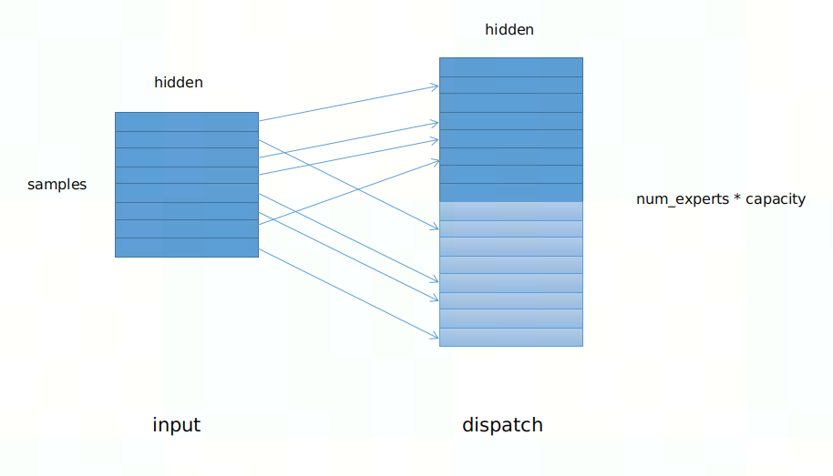
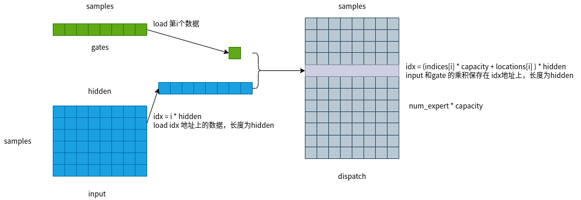
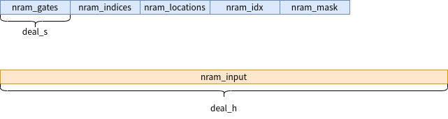
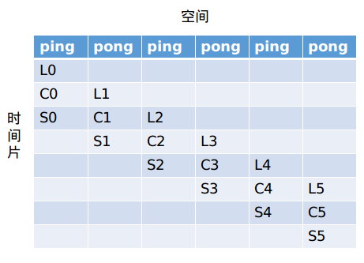

# moe_dispatch_forward 算子开发设计方案

- #### 文档基本信息

| 算子名称    | moe_dispatch_forward |
| ----------- | ---------------- |
| 编制人/日期 | 胡永安/2023-2-20 |
| 审批人/日期 | 吴少强/2022-8-26 |
| 审批人/日期 | 张皓喆/2022-8-26 |
| 审批人/日期 | 王远/2022-8-26 |

- #### 修改记录

| 版本号 | 修订人 | 修订日期  | 修订描述 |
| ------ | ------ | --------- | -------- |
| V1.0   | 胡永安 | 2023-2-20 | 首次提交 |

- #### 内容描述

本文档为`moe_dispatch_forward`算子的设计文档，包括需求分析、接口设计、方案设计、性能优化记录和方案实施部分。

- #### 算子需求 checklist

* 算子接口描述
* 功能描述
* 框架版本 + 对应源码路径
* 需求对应网络
* 网络中用到的规模
* 是否需要支持原位
* 是否需要支持 stride 机制
* 框架单元测试阈值指标（可选）

## 1 需求分析

### 1.1 算子需求分析

该需求分析为框架原生算子实现功能的需求分析，对于框架原生支持但 MLU-OPS 当前版本不支持的功能，需要在`1.4算子限制` 章节中显式注明。未明确注明不支持的功能，默认 MLU-OPS 全部支持。

example:

| 算子功能简介                                  | MoE算法中对输入重新分配                                     |
| ----------------------------------------------| ----------------------------------------------------------- |
| 需求来源                                      | tutel                                                       |
| 应用网络                                      | swin-transformer                                            |
| 输入数据类型                                  | float                                                       |
| 输入标量参数                                  | samples: int;<br />hidden: int;<br />capacity: int;<br />num_experts: int |
| 输入 Shape                                    | gates: [samples]; <br />indices: [samples]; <br />locations: [samples]; <br />input: [samples, hidden];|
| 输入 Layout                                   | ARRAY |
| 输出数据类型                                  | float |
| 输出 Shape                                    | dispatch: [num_experts * capacity, hidden] |
| 输出 Layout                                   | ARRAY |
| 模式(可选）                                   | 否 |
| 是否含有 dim/axis 等类似语义的参数且该参数支持负数/其他特殊处理| 无 |
| 是否含有 labels/index 等类似语义的参数且该参数支持负数/界外情况/其他特殊处理 | 无 |
| 是否需要支持原位                               | 否 |
| 是否需要支持 stride 机制                       | 否 |
| 是否需要支持广播                               | 否 |
| 0 元素检查是否直接返回                         | 是, 返回MLUOP_STATUS_SUCCESS |
| 其他特殊需求(在线量化，融合，转数提前等，可选) | 无 |
| 本次开发优先支持的规模/模式                    |    |


### 1.2 算子功能和应用场景描述

1. 算子功能：根据 `gates, indices, locations`，将输入 `input` 重新分配到 `dispatch`中。如下图所示：


2. 应用场景：该算子应用于 tutel 框架中的 MoE 算法中，MoE 算法的思想是将不同的输入分配给不同的专家进行处理，因此需要对输入顺序进行重新分配。

3. nan/inf行为

  通过分析，参考接口代码实现中并未对nan/inf做特殊处理，因此 mlu 算子中也不需要做特殊处理。


### 1.3 算子输入输出参数要求

| 参数            | 语义                                                         | 类型（输入/输出） | 支持类型                | 物理布局 | 规模限制 |
| --------------- | ------------------------------------------------------------ | ----------------- | ----------------------- | -------- | -------- |
| handle          | 当前可获得的资源（context）                                  | 输入              | mluOpHandle_t           | /        | 无       |
| gates_desc      | 输入数据 gates 的描述符，包含了 gates 的数据类型、数据维度和布局等信息 | 输入              | mluOpTensorDescriptor_t | /        | 见1.4    |
| gates           | 输入数据 gates 的指针                                   | 输入              | float                        | ARRAY    | 无       |
| indices_desc    | 输入数据 indices 的描述符，包含了 indices 的数据类型、数据维度和布局等信息 | 输入              | mluOpTensorDescriptor_t | /        | 见1.4    |
| indices         | 输入数据 indices 的指针                                      | 输入              | int                     | ARRAY    | 无       |
| locations_desc  | 输入数据 locations 的描述符，包含了 locations 的数据类型、数据维度和布局等信息 | 输入              | mluOpTensorDescriptor_t | /        | 见1.4    |
| locations       | 输入数据 locations 的指针                                    | 输入              | int                     | ARRAY    | 无       |
| input_desc      | 输入数据 input 的描述符，包含了 input 的数据类型、数据维度和布局等信息 | 输入              | mluOpTensorDescriptor_t | /        | 见1.4    |
| input           | 输入数据 input 的指针                                        | 输入              | float                   | ARRAY    | 无       |
| samples         | 输入数据，表示输入的个数，等效于batch-size                   | 输入              | int                     | /        | 无       |
| capacity        | 输入数据，表述专家能处理的最大输入个数                       | 输入              | int                     | /        | 无       |
| hidden          | 输入数据，表述单个token的向量长度                            | 输入              | int                     | /        | 无       |
| num_experts     | 输入数据，表述专家的数量                                     | 输入              | int                     | /        | 无       |
| dispatch_desc   | 输出数据 dispatch 的描述符，包含了 dispatch 的数据类型、数据维度和布局等信息 | 输入              | mluOpTensorDescriptor_t | /        | 见1.4    |
| dispatch        | 输出数据 dispatch 的指针                                     | 输出              | float                   | ARRAY    | 无       |


### 1.4 算子限制

| 限制类型     | 详细说明                                                     |
| ------------ | ------------------------------------------------------------ |
| 数据类型限制 | float                                                        |
| 布局限制     | ARRAY                                                        |
| 功能限制     | 无                                                           |
| 数据范围限制 | 有 indices 参数，该参数的取值范围为[0, ..., (num_experts-1)]; <br />有 locations 参数，该参数的取值范围为[0, ..., (capacity-1)] |
| 原位限制     | 不支持原位                                                   |
| stride 限制  | 不支持 stride 机制                                           |
| 广播限制     | 不支持广播                                                   |
| 规模限制     | gates_desc, indices_desc、locations_desc、input_desc的第一个维度大小等于samples <br />input_desc、dispatch_desc的第2个维度大小等于hidden <br />dispatch_desc的第1个维度大小等于num_experts * capacity |

### 1.5 验收标准

#### 1.5.1 精度验收标准

按照[精度验收标准](../MLU-OPS-Accuracy-Acceptance-Standard.md)的要求明确本算子的精度标准。

本算子属于算术类算子，验收标准为 diff3=0。

#### 1.5.2 性能验收标准

见 [MLU-OPS 性能验收标准](../MLU-OPS-Performance-Acceptance-Standard.md)。


## 2 算子接口设计

### 2.1 参考接口

- Tutel

```c++
// cpu
for (int i = 0; i < samples; ++i) {
  if (locations[i] < capacity && indices[i] >= 0) {
    for (int j = 0; j < hidden; ++j) {
      dispatched_input[(indices[i] * capacity + locations[i]) * (hidden) + j] = gates[i] * reshaped_input[i * (hidden) + j];
    }
  }
}

//cuda
#define __dtype @dtype@
extern "C" __global__ __launch_bounds__(1024) void execute(__dtype* __restrict__ gates, int* __restrict__ indices, int* __restrict__ locations, __dtype* __restrict__ reshaped_input, __dtype* __restrict__ dispatched_input, int samples, int hidden, int capacity) {
  // [thread_extent] blockIdx.x = 512
  // [thread_extent] threadIdx.x = 1024
  for (int i = blockIdx.x; i < samples; i += gridDim.x)
      if (locations[i] < capacity && indices[i] >= 0) {
          #pragma unroll
          for (int j = threadIdx.x; j < hidden; j += 1024)
              dispatched_input[(indices[i] * capacity + locations[i]) * (hidden) + j] = gates[i] * reshaped_input[i * (hidden) + j];
      }
}
```

### 2.2 接口设计

```c++
mluOpStatus_t MLUOP_WIN_API
mluOpMoeDispatchForward(mluOpHandle_t handle,
                        const mluOpTensorDescriptor_t gates_desc,
                        const void *gates,
                        const mluOpTensorDescriptor_t indices_desc,
                        const void *indices,
                        const mluOpTensorDescriptor_t locations_desc,
                        const void *locations,
                        const mluOpTensorDescriptor_t input_desc,
                        const void *input,
                        const int samples,
                        const int capacity,
                        const int hidden,
                        const int num_experts,
                        const mluOpTensorDescriptor_t dispatch_desc,
                        void *dispatch);
```

## 3 实现方案设计

### 3.1 实现方案

#### 3.1.1 计算原理说明

本算子用于对输入进行重新分配得到dispatch，该算子有四个输入tensor，一个输出tensor，输入`indices`维度`[samples]`，输入`locations`维度`[samples]`，输入`gates`维度`[samples]`，输入`input` 维度`[samples, hidden]`，输出`dispatch`维度`[num_experts * capacity, hidden]`，四个标量参数`samples,capacity,hidden,num_experts`。

根据输入`indices`、`locations`、`gates`、`input`计算 `dispatch` 。在计算时，取第 i 个 gates的值 与 索引为 i，长度为 hidden的input 进行乘积运算，运算完的结果保存至 dispatch 的指定位置。如下图所示：



伪代码实现

```c
for (int i = 0; i < samples; ++i) {
  if (locations[i] < capacity && indices[i] >= 0) {
    for (int j = 0; j < hidden; ++j) {
      dispatch[(indices[i] * capacity + locations[i]) * (hidden) + j] = gates[i] * input[i * (hidden) + j];
    }
  }
}
```

#### 3.1.2 nram空间划分

输入有两个维度`samples`, `hidden`，本可以两个维度同时进行拆分，但由于输出`dispatch` 的索引由`indices` 和 `locations` 的值决定，因此存在多个`input映射到一个输出的情况，如果拆分`samples`维度可能导致输出存在写冲突的错误，因此只能拆分`hidden`维度。nram空间需要保存如下变量：
- input：输入输出空间, 长度为deal_h。
- gates：不同专家的权重, 长度为deal_s。
- indices：输入重分配对应的专家索引, 长度为deal_s。
- locations：dispatch的位置偏移, 长度为deal_s。
- idx：输出`dispatch`对应的索引, 长度为deal_s。
- mask：是否需要进行重分配, 长度为deal_s。

nram 的空间划分如下：

  

  说明：

  - `deal_s`表述一次可load多少个`sample`维度的数据，当`deal_s`小于`samples`时，计算`repeat_s`和`rem_s`；
  - `deal_h`表述一次可以load的`hidden`维度的数据大小，当`deal_h`小于`hidden`时，计算`repeat_h`和`rem_h`；

#### 3.1.3 实现方案

- 实现步骤

  - 任务拆分：根据3.3 拆分(任务拆分，多核拆分)章节介绍，对`hidden`进行拆分；

    根据`samples` 计算每个`taskId` 要处理的数量`samples_num`，以及起始索引`sample_idx` ，伪代码如下；

    ```c
    int hidden_per_task = hidden / taskDim;
    hidden_per_task += (taskId < hidden % taskDim) ? 1 : 0;
    ```
  - 初始化阶段

    - 根据3.1.2 nram空间划分，计算得到`deal_s`和`deal_h`的大小
      ```c
      if (hidden_per_task > max_deal_h) {
        deal_h = max_deal_h;
        deal_s = 1;
      } else {
        deal_h = hidden_per_task;
        deal_s = (MAX_NRAM_SIZE - deal_h * sizeof(T)) / (4 * sizeof(int) + sizeof(T)) ;
        // deal_s表述处理的输入的个数，其最大有效值为samples
        deal_s = deal_s < samples ? deal_s : samples;
      }

    - 根据`samples_num`和`deal_s` 计算repeat_s和rem_s

      ```c
      int repeat_s = samples / deal_s;
      int rem_s = samples % deal_s;
      ```

    - 根据`hidden` 和 `deal_h` 计算 repeat_h 和 rem_h

      ```c
      int repeat_h = hidden_per_task / deal_h;
      int rem_h = hidden_per_task % deal_h;
      ```

  - 处理阶段

    - 计算各输入tensor的GDRAM地址偏移

      ```c
      T *nram_gates = nram_dispatch + deal_h;
      int *nram_indices = (int *)nram_gates + deal_s;
      int *nram_locations = nram_indices + deal_s;
      int *nram_idx = nram_locations + deal_s;
      int *nram_mask = nram_idx + deal_s;
      ```

    - 循环处理

      ```c
      for (int s_iter = 0; s_iter <= repeat_s; ++s_iter) {
        int deal_s_num = (s_iter == repeat_s) ? rem_s : deal_s;
        if (deal_s_num == 0) {
          break;
        }

        // load gates indices locations
        T *base_gates = (T *)gates + s_iter * deal_s_num;
        int *base_indices = (int *)indices + s_iter * deal_s_num;
        int *base_locations = (int *)locations + s_iter * deal_s_num;

        __memcpy(nram_gates, base_gates, deal_s_num * sizeof(T), GDRAM2NRAM);
        __memcpy(nram_indices, base_indices, deal_s_num * sizeof(int), GDRAM2NRAM);
        __memcpy(nram_locations, base_locations, deal_s_num * sizeof(int), GDRAM2NRAM);


        // compute dispatch idx = (nram_indices * capacity + nram_locations)
        __bang_mul_scalar(nram_idx, nram_indices, capacity, deal_s_num);
        __bang_add(nram_idx, nram_idx, nram_locations, deal_s_num);

        // 判断 0 <= nram_locations < capacity
        __bang_ge_scalar(nram_mask, nram_locations, (int)0, deal_s_num);
        __bang_lt_scalar(nram_locations, nram_locations, capacity, deal_s_num);
        __bang_and(nram_locations, nram_locations, nram_mask, deal_s_num);

        // 判断 0 <= nram_indices < num_experts
        __bang_ge_scalar(nram_mask, nram_indices, (int)0, deal_s_num);
        __bang_lt_scalar(nram_indices, nram_indices, num_experts, deal_s_num);
        __bang_and(nram_indices, nram_indices, nram_mask, deal_s_num);
        __bang_and(nram_mask, nram_indices, nram_locations, deal_s_num);

        T *base_input = (T *)input + s_iter * deal_s_num * hidden;
        for (int ds_iter = 0; ds_iter < deal_s_num; ++ds_iter) {
          if (nram_mask[ds_iter] != 1) {
            continue;
          }

          T *base_input_s = base_input + ds_iter * hidden;
          T *base_dispatch_s = dispatch + nram_idx[ds_iter] * hidden;

          for (int h_iter = 0; h_iter <= repeat_h; ++h_iter) {
            int deal_h_num = (h_iter == repeat_h) ? rem_h : deal_h;
            if (deal_h_num == 0) {
              break;
            }
            int input_offset = (hidden/taskDim)* taskId + (taskId < (hidden%taskDim) ? taskId : (hidden%taskDim));
            T *base_input_h = base_input_s + input_offset + h_iter * deal_h;
            T *base_dispatch_h = base_dispatch_s + input_offset + h_iter * deal_h;
            __memcpy(nram_input, base_input_h, deal_h_num * sizeof(T), GDRAM2NRAM);

            // dispatch = input * gates
            __bang_mul_scalar(nram_input, nram_input, nram_gates[ds_iter], deal_h_num);

            //store dispatch to GDRAM
            __memcpy(base_dispatch_h, nram_input, deal_h_num * sizeof(T), NRAM2GDRAM);

          } // repeat h
        } // deal s
      } // repeat s
      ```


### 3.2 伪代码实现

### 3.3 拆分(任务拆分，多核拆分)

- 基本任务类型为BLOCK的任务。
- 输入`input` 维度`[samples, hidden]`，输出`dispatch`的维度`[num_experts*capacity, hidden]`，拆分`hidden`维度：
    ```c
    int hidden_per_task = hidden / taskDim;
    hidden_per_task += (taskId < hidden % taskDim) ? 1 : 0;
    ```


### 3.4 性能优化设计

1、资源分配

| 表项            | 分配策略                              |
| --------------- | ------------------------------------- |
| NRAM            | 划分见3.1.2 nram空间划分              |
| WRAM            | 未使用                                |
| SRAM            | 未使用                                |
| DRAM(workspace) | 未使用                                |


2、流水设计

- 采用三级流水设计，L C S 之间排流水，即 GDRAM2NRAM、Compute、NRAM2GDRAM。

  


### 3.5 可维护性设计

1、bangc 代码中加入必要的 log 信息，比如输入的规模、数据类型、layout 这些，以及如果出错会导致程序 core dump 的变量，比如 IO 指令的 data_size、dim xyz 的值等，这些信息都是有利于快速定位问题；

2、对每一个函数命名变量命名都有充分的注释；

3、避免魔鬼数字，对于确定的数字尽量使用公共宏来替代。

### 3.6 测试用例设计

- 算子在网络中用到的规模：
  ```c
  int型变量：samples: 18432， capacity: 11520， hidden: 512， num_experts: 2
  tensor：gates: [18432]，float；
          indices: [18432]，int类型，数据范围为 [0 ~ (num_experts - 1)]
          locations: [18432]， int类型，数据范围为 [0 ~ (capacity - 1)]
          input: [18432, 512]，float类型
          dispatch: [23040, 512]， float类型
  ```

- 边界 case：

0元素测试

  ```c
  case1:
  int型变量：samples: 0 ， capacity: 8192， hidden: 2048， num_experts: 2
  tensor：gates: [0]，float；
          indices: [0]，int类型
          locations: [0]， int类型
          input: [0, 2048]，float类型
          dispatch: [16384, 2048]， float类型
  case2:
  int型变量：samples: 8192 ， capacity: 8192， hidden: 0， num_experts: 2
  tensor：gates: [8192]，float；
          indices: [8192]，int类型，数据范围为 [0 ~ (num_experts - 1)]
          locations: [8192]， int类型，数据范围为 [0 ~ (capacity - 1)]
          input: [8192, 0]，float类型
          dispatch: [16384, 0]， float类型
  case3:
  int型变量：samples: 8192 ， capacity: 0， hidden: 2048， num_experts: 2
  tensor：gates: [8192]，float；
          indices: [8192]，int类型，数据范围为 [0 ~ (num_experts - 1)]
          locations: [8192]， int类型，数据范围为 [0 ~ (capacity - 1)]
          input: [8192, 2048]，float类型
          dispatch: [0, 2048]， float类型
  ```

其他可根据需要进行补充。算子开发完毕后，补充测试报告链接。

### 3.7 算子防呆检查

- 描述符指针为空防呆：handle、gates_desc、indices_desc、 locations_desc、input_desc、dispatch_desc；
- 对输入输出支持的 dtype、layout 以及 shape 进行防呆
  1. dtype防呆：gates_desc、input_desc、dispatch_desc：仅支持float；
  2. dtype防呆：indices_desc、locations_desc：仅支持int；
  3. dim防呆：
     1. gates_desc、indices_desc、locations_desc、input_desc的第一个维度大小相等且等于samples；
     2. input_desc、dispatch_desc的第2个维度大小相等且等于hidden；
     3. dispatch_desc的第1个维度大小等于num_experts * capacity;
- 0 元素检查防呆：返回MLUOP_STATUS_SUCCESS；
- 指针为空防呆：indices、locations、input、dispatch、gates；
- large tensor防呆 ：对gates_desc、indices_desc、 locations_desc、input_desc、dispatch_desc的检查；

## 4 算子性能/精度问题 & 优化记录

### 4.1 当前存在问题的规模说明

暂无

### 4.2 已经过优化的规模说明

暂无

## 5 方案实施

### 5.1 开发测试计划

- 2023.2.13-2.17 调研源码+开始设计方案
- 2023.2.27-3.2 设计方案：算子功能+接口设计
- 2023.3.3 gtest 代码开发
- 2023.3.3 generator开发
- 2023.3.6-3.8 完成host/device 开发
- 2023.3.9 批量测试+测试报告
- 2023.3.10 提交 PR、算子入库

### 5.2 风险分析

暂无
