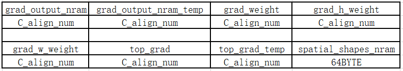

# ms_deform_attn_backward 算子开发方案设计
* #### 文档基本信息

| 算子名称    | ms_deform_attn_backward                                                      |
| ----------- | ---------------------------------------------------- |
| 编制人/日期 | 郑斌/2022-09-19                                            |

* #### 修改记录

| 版本号| 修订 人 | 修订日期 |修订描述 |
| ----- | ------ | -------  | -------  |
| V1.0  | 郑斌     |  2022-09-19    | 算子需求分析、接口和实现设计,首次提交 |
| V2.0  | 郑斌     |  2023-03-15   | 针对BEVFormer网络的性能优化。 |

* #### 内容描述

本文档为`ms_deform_attn_backward`算子的设计文档，包括需求分析、接口设计、方案设计。

* #### 算子需求checklist

* 算子接口描述
* 功能描述
* 框架版本 + 对应源码路径
* 需求对应网络
* 网络中用到的规模
* 是否需要支持原位
* 是否需要支持 stride 机制
* 框架单元测试阈值指标（可选）

## 1 需求分析

### 1.1 算子需求分析

| 算子功能简介| ms_deform_attn的反向过程，计算输入value，sampling_loc和attn_weight的梯度。               |
|-------------|--------------------------------------------------------------|
| 需求来源    | mmcv                                       |
| 应用网络    |   Deformable DETR                                               |
| 输入数据类型| value、sampling_loc、attn_weight、grad_output、grad_value、grad_sampling_loc和grad_attn_weight为float，spatial_shapes和level_start_index为int32。 im2col_step为int32_t。                                                |
| 输入Shape   | value:[batch, num_keys, num_heads, Channels]；<br> spatial_shapes:[num_levels, 2]；<br> level_start_index:[num_levels]；<br> sampling_loc:[batch, num_query, num_heads, num_levels, num_point, 2]；<br>attn_weight:[batch, num_query, num_heads, num_levels, num_point]；<br>grad_output:[batch, num_query, num_heads, Channels]。|
| 输入Layout  | value:ARRAY；<br> spatial_shapes:ARRAY；<br> sampling_loc:ARRAY；<br> attn_weight:ARRAY；<br> grad_output:ARRAY。 |
| 输出数据类型|  grad_value、grad_sampling_loc和grad_attn_weight类型为float。                                                 |
| 输出Shape   | grad_value:[batch, num_keys, num_heads, Channels]；<br>grad_sampling_loc:[batch, num_query, num_heads, num_levels, num_point, 2]； <br>grad_attn_weight:[batch, num_query, num_heads, num_levels, num_point]。                            |
| 输出Layout  | grad_value:ARRAY；<br> grad_sampling_loc:ARRAY；<br>grad_attn_weight:ARRAY。                                                   |
| 是否需要支持原位        | 否                                                  |
| 是否需要支持stride机制  | 否                                                  |
| 是否需要支持广播  | 否                       |
| 0元素检查是否直接返回  | 是（返回_STATUS_BAD_PARAM）                                                  |
| 其他特殊需求(在线量化，融合， 转数提前等， 可选)|    无                                                    |
| 本次开发优先支持的规模/模式| 无   |


### 1.2 算子功能和应用场景描述

ms_deform_attn的反向算子，计算grad_value，grad_sampling_loc和grad_attn_weight的梯度。

### 1.3 算子输入输出参数要求

| 参数        | 语义               | 类型（输入/输出） | 支持类型     | 物理布局 | 规模约束 |
| ----------- | ------------------ | ----------------- | ------------ | -------- | -------- |
| handle      |  句柄，保存运行的上下文信息。   | 输入              | mluOpHandle_t | /        | /       |
| value_desc | 输入value的描述信息。 | 输入              |  /  | /      | value的维度必须为4，其中第二个维度为$`\sum_{i=0}^{num\_levels} {H_i * W_i} `$，H和W分别为spatial_shapes的H和W。       |
| value     | 输入特征图所有像素点的特征值，指向value的mlu地址的指针。           | 输入              | float | ARRAY |   /    |
| spatial_shapes_desc | 输入spatial_shapes的描述信息   | 输入              | /  | /        | spatial_shapes的维度必须为2且最后一维必须为2。      |
| spatial_shapes      | 输入数据，multi-scale各尺寸输入特征图的长（H）和宽（W）。          | 输入              |int32_t  | ARRAY | /       |
| level_start_index_desc | 输入level_start_index的描述信息。   | 输入              | /  | /        | level_start_index的维度必须为1且维度和spatial_shapes的第一维相等。其中level_start_index[0] = 0，$` level\_start\_index[i] = \sum_{0}^{i} {H_i * W_i} `$，H和W分别为spatial_shapes的H和W。     |
| level_start_index      | 输入数据，各尺寸输入特征图对应到data_value的地址偏移。          | 输入              |int32_t  | ARRAY | /       |
| sampling_loc_desc | 输入sampling_loce的描述信息。 | 输入              |  /  | /      | sampling_loc的维度必须为6且第一维、第三维分别和value的第一维、第三维相等，第四维和level_start_index的维度相等。最后一个维度必须为2。     |
| sampling_loc     | 输入数据，采样点的归一化坐标。           | 输入              |  float | ARRAY |   /    |
| attn_weight_desc | 输入attn_weight的描述信息。 | 输入              |  /  | /      | attn_weight的维度必须为5且5个维度信息和level_start_index前5个维度相同。    |
| attn_weight     | 输入数据，attention的值。           | 输入              | float | ARRAY |   /    |
| grad_output_desc | 输入grad_output的描述信息，前向的输出结果。 | 输入              |  /  | /      | grad_output的维度必须为4，前三个维度信息和attn_weight的前三维相同，最后一个维度值为channels的值。      |
| grad_output     | 输入数据，指向grad_output的mlu地址的指针。           | 输入              |  float | ARRAY |   /    |
| im2col_step     | 输入数据，image转换成column的步长。           | 输入              |  float | ARRAY |   /    |
| grad_value_desc | 输出grad_value的描述信息。 | 输入              |  /  | /      | 维度信息和value相同。       |
| grad_value     | 输出数据，value的梯度信息指针。           | 输出             |  float | ARRAY |   /    |
| grad_sampling_loc_desc | 输出grad_sampling_loc的描述信息。 | 输入              |  /  | /      | 维度信息和sampling_loc相同。         |
| grad_sampling_loc     | 输出数据，sampling_loc的梯度信息指针。           | 输出              | float | ARRAY |   /    |
| grad_attn_weight_desc | 输出grad_attn_weight的描述信息。 | 输入              |  /  | /      | 维度信息和attn_weight相同。      |
| grad_attn_weight     | 输出数据，attn_weight的梯度信息指针。          | 输出              |  float | ARRAY |   /    |

### 1.4 算子类型限制


| 限制类型    | 详细说明                                            |
| ----------- | ------------------------------------------------------------ |
| 数据类型限制|  value、sampling_loc、attn_weight、grad_output、grad_value、grad_sampling_loc和grad_attn_weight为float，spatial_shapes和level_start_index为int32。         |
| 布局限制    | 仅支持ARRAY的Layout     |
| 规模限制    | 暂无 |
| 功能限制    | 暂无|
| 数据范围限制| 输入sampling_loc中不支持nan和inf。MLU500：value,sampling_loc,attn_weight and grad_output 暂时不支持NaN和inf。|
| 原位限制    | 不支持|
| stride限制  | 不支持|
| 广播限制    | 不支持|

### 1.5 验收标准

#### 1.5.1 精度验收标准

-  精度验收标准：该算子为复合类算子
- 300 系列的评价公式为`diff1、diff2、diff4`, 验收标准采用动态阈值[10,10,1]。
- 200系列的评价公式为`diff1、diff2`，验收标准采用动态阈值[10,10]。
- 算子使用到了atomic_add，如果测例在200系列上不通过，可验证300系列上是否可以通过。
- 因为fma不对齐问题，如果测例在300系列上不通过，需要将测例更改为cpu模式，此时采用静态阈值：half：1e-3，float：1e-5。

#### 1.5.2 性能验收标准


| 平台                 | 框架版本      | 数据类型 | 规模   | 计算效率(%)  | IO效率(%)    | 硬件时间(us) |
| -------------------- | ------------- | -------- | -------------- | --------- | --------- | ---------- |
| Tesla V100-SXM2 16GB | mmcv-1.5.1 + cuda-10.2 + pytorch-1.9 + driver-440.64.00 | data_value: float32data_spatial_shapes: int32data_level_start_index: int32data_sampling_loc: float32data_attn_weight: float32data_col: float32 | data_value: 2, 40000, 8, 32data_spatial_shapes: 1, 2data_level_start_index: 1data_sampling_loc: 2, 40000, 8, 1, 4, 2data_attn_weight: 2, 40000, 8, 1, 4 grad_outout: 2, 40000, 8, 32 | 79.92% | 54.06% | 1010 |
| Tesla V100-SXM2 16GB | mmcv-1.5.1 + cuda-10.2 + pytorch-1.9 + driver-440.64.00 | data_value: float32data_spatial_shapes: int32data_level_start_index: int32data_sampling_loc: float32data_attn_weight: float32data_col: float32 | data_value: 1, 40000, 8, 32data_spatial_shapes: 1, 2data_level_start_index: 1data_sampling_loc: 1, 900, 8, 1, 4, 2data_attn_weight: 1, 900, 8, 1, 4 grad_outout: 1, 900, 8, 32 | 68.88% | 46.52% | 29.44 |
| Tesla V100-SXM2 16GB | mmcv-1.5.1 + cuda-10.2 + pytorch-1.9 + driver-440.64.00 | data_value: float32data_spatial_shapes: int32data_level_start_index: int32data_sampling_loc: float32data_attn_weight: float32data_col: float32 | data_value: 6, 30825, 8, 32data_spatial_shapes: 4, 2data_level_start_index: 4data_sampling_loc: 6, 9664, 8, 4, 8, 2data_attn_weight: 6, 9664, 8, 4, 8 grad_outout: 6, 9664, 8, 32 | 75.12% | 55.54% | 1770 |

## 2 算子接口设计

### 2.1 参考接口

- mmcv

```c++
ms_deform_attn_cuda_backward(
    const at::Tensor &value, const at::Tensor &spatial_shapes,
    const at::Tensor &level_start_index, const at::Tensor &sampling_loc,
    const at::Tensor &attn_weight, const at::Tensor &grad_output,
    at::Tensor &grad_value, at::Tensor &grad_sampling_loc,
    at::Tensor &grad_attn_weight, const int32_t im2col_step);
```

### 2.2 接口设计
```c++
mluOpStatus_t MLUOP_WIN_API
mluOpMsDeformAttnBackward(mluOpHandle_t handle,
                          const mluOpTensorDescriptor_t value_desc,
                          const void *value,
                          const mluOpTensorDescriptor_t spatial_shapes_desc,
                          const void *spatial_shapes,
                          const mluOpTensorDescriptor_t level_start_index_desc,
                          const void *level_start_index,
                          const mluOpTensorDescriptor_t sampling_loc_desc,
                          const void *sampling_loc,
                          const mluOpTensorDescriptor_t attn_weight_desc,
                          const void *attn_weight,
                          const mluOpTensorDescriptor_t grad_output_desc,
                          const void *grad_output,
                          const int32_t im2col_step,
                          const mluOpTensorDescriptor_t grad_value_desc,
                          void *grad_value,
                          const mluOpTensorDescriptor_t grad_sampling_loc_desc,
                          void *grad_sampling_loc,
                          const mluOpTensorDescriptor_t grad_attn_weight_desc,
                          void *grad_attn_weight);
```

## 3 实现方案设计

### 3.1 实现方案

ms_deform_attn_backward算子三个输出的计算方法：

1、输出`grad_value`:`grad_value`的shape为[batch, num_keys, num_heads, Channels]，是输入`value`的梯度信息。在计算时通过`sampling_loc`中的坐标信息获取到`spatial_shapes`中对应的特征图尺寸`spatial_w`和`spatial_h`，在通过双线性插值得到对应点的四邻域点以及每个点对应的加权系数（`w1`、`w2`、`w3`和`w4`），把加权系数乘以`grad_output`和`attn_weight`，再使用原子加将结果累加回gdram上。在mlu的实现上，可以一次处理多组`C`，若`C`大于`nram`上分配的内存，则对`C`循环处理。

2、输出`grad_sampling_loc`:`grad_sampling_loc`的shape为[batch, num_query, num_heads, num_levels, num_point, 2]，是输入`sampling_loc`的梯度信息。在上述步骤1的计算中，通过四邻域信息、`grad_ouput`和`attn_weight`能够得到每个`C`上的梯度信息，待所有的`C`计算完成后，通过`reduce`或者原子加的方法获取`grad_sampling_loc`的结果，若采样点不在特征图内，直接丢弃，不做后续的处理。

```math
h\_low = floorf(h)  \\

w\_low = floorf(w)  \\

lh = h - h\_low  \\

lw = w - w\_low  \\

hh = 1 - lh  \\

hw = 1 - lw  \\

grad\_h\_weight = -hw * v1 - lw * v2 + hw * v3 + lw * v4  \\

grad\_w\_weight = -hh * v1 + hh * v2 - lh * v3 + lh * v4  \\

top\_grad\_value = grad\_output * attn\_weight  \\

*grad\_sampling\_loc = \sum_{i=0}^{C - 1} {w * grad\_w\_weight * top\_grad\_value}  \\

*(grad\_sampling\_loc + 1) = \sum_{i=0}^{C - 1} {h * grad\_h\_weight * top\_grad\_value}  \\
```
- `w`和`h`分别为`spatial_shapes`中的宽和高，$`v1`$、$`v2`$、$`v3`$、$`v4`$是像素点对应的四邻域像素值，grad_output和attn_weight是输入。

3、输出`grad_attn_weight`:`grad_attn_weight`的shape为[batch, num_query, num_heads, num_levels, num_point]，是输入`attn_weight`的梯度信息。在上述步骤1的计算中，通过四邻域对应的加权系数和`grad_ouput`能够得到每个`C`上的梯度信息，待所有的`C`计算完成后，通过`reduce`或者原子加的方法获取`grad_attn_weight`的结果，若采样点不在特征图内，直接丢弃，不做后续的处理。

```math
val = w1 * v1 + w2 * v2 + w3 * v3 + w4 * v4  \\

grad\_attn\_weight = \sum_{index = 0}^{C - 1} {grad\_ouput[index] * val}  \\
```
- $`w1`$、$`w2`$、$`w3`$、$`w4`$是四邻域对应的加权系数，index是`grad_attn_weight`输出点对应的下标。

### 3.2 伪代码实现（可选）

```c++
// 伪代码中仅给出通用的实现版本，使用原子加的方案实现。
const int32_t split_num = 8;
const int32_t spatial_shapes_size = 64;
const int32_t deal_num = PAD_DOWN((MAX_NRAM_SIZE - spatial_shapes_size) / split_num / sizeof(T), align_num);
const int32_t total_num = batch * num_query * num_head * num_levels;
int32_t num_per_core = total_num / taskDim;
const int32_t num_rem = total_num % taskDim;
num_per_core = num_per_core + int32_t(taskId < num_rem);
int32_t start_per_core = num_rem > taskId ? (taskId * num_per_core)
          : ((num_per_core + 1) * num_rem + (taskId - num_rem) * num_per_core);
int32_t end_per_core = start_per_core + num_per_core;
for (int32_t num_loop = start_per_core; num_loop < end_per_core; ++num_loop) {
  int32_t l_col = num_loop % num_levels;
  int32_t b_col = num_loop / num_query / num_head / num_levels;
  int32_t attn_weight_offset = num_loop / num_levels * num_point;
  int32_t sampling_loc_offset = attn_weight_offset << 1;
  const int32_t value_offset = b_col * spatial_size * num_heads * channels;
 const int32_t level_start_id = data_level_start_index[l_col];
 const int32_t spatial_h_ptr = l_col << 1;
 __memcpy(spatial_shapes_nram, spatial_shapes + spatial_h_ptr, 2 * sizeof(T), GDRAM2NRAM);
 const int32_t spatial_h = spatial_shapes_nram[0];
 const int32_t spatial_w = spatial_shapes_nram[1];
 const int32_t value_ptr_offset =
     value_offset + level_start_id * qid_stride;
 const T *data_value_ptr = data_value + value_ptr_offset;
 T *grad_value_ptr = grad_value + value_ptr_offset;
 for (int32_t p_col = 0; p_col < num_point; ++p_col) {
  const T loc_w = data_sampling_loc[data_loc_w_ptr];
  const T loc_h = data_sampling_loc[data_loc_w_ptr + 1];
  const T weight = data_attn_weight[data_weight_ptr];
  const T h_im = loc_h * spatial_h - 0.5;
  const T w_im = loc_w * spatial_w - 0.5;
  const int32_t h_low = floorf(h);
  const int32_t w_low = floorf(w);
  const int32_t h_high = h_low + 1;
  const int32_t w_high = w_low + 1;

  const T lh = h - h_low;
  const T lw = w - w_low;
  const T hh = 1 - lh;
  const T hw = 1 - lw;

  const int32_t w_stride = nheads * channels;
  const int32_t h_stride = width * w_stride;
  const int32_t h_low_ptr_offset = h_low * h_stride;
  const int32_t h_high_ptr_offset = h_low_ptr_offset + h_stride;
  const int32_t w_low_ptr_offset = w_low * w_stride;
  const int32_t w_high_ptr_offset = w_low_ptr_offset + w_stride;
  const int32_t base_ptr = m * channels + c;

  const T w1 = hh * hw, w2 = hh * lw, w3 = lh * hw, w4 = lh * lw;
   if (h_im > -1 && w_im > -1 && h_im < spatial_h && w_im < spatial_w) {
     for(int32_t C_loop = 0; C_loop < C_repeat; ++C_loop){
       msDeformAttnCol2imBilinear();
     }
     if(C_tail != 0) {
       msDeformAttnCol2imBilinear();
     }
   }
 }

}
void msDeformAttnCol2imBilinear(){

  __memcpy(top_grad, grad_output, deal_num * sizeof(T), GDRAM2NRAM);
  __bang_mul_scalar(top_grad_temp, top_grad, attn_weight, deal_num);
  __bang_write_zero(grad_h_weight, deal_num);
  __bang_write_zero(grad_w_weight, deal_num);
  if (h_low >= 0 && w_low >= 0) {
    const int32_t offset1 = h_low_ptr_offset + w_low_ptr_offset + base_ptr;
    __memcpy(grad_output_nram, grad_output + offset1, deal_num * sizeof(T), GDRAM2NRAM);
    //grad_h_weight -= hw * v1;
    __bang_mul_scalar(grad_weight, grad_output_nram, hw, deal_num);
    __bang_sub(grad_h_weight, grad_h_weight, grad_weight, deal_num);
    // grad_w_weight -= hh * v1;
    __bang_mul_scalar(grad_weight, grad_output_nram, hh, deal_num);
    __bang_sub(grad_w_weight, grad_w_weight, grad_weight, deal_num);
    __bang_mul_scalar(top_grad_temp, top_grad_temp, w1, deal_num);
   // for calc grad_attn_weight
    __bang_mul_scalar(grad_output_nram, grad_output_nram, w1, deal_num);

    __bang_atomic_reduce_add((T *)(grad_input + dst_offset),
                           (T *)top_grad_temp, deal_num);
  }
    if (h_low >= 0 && w_high <= width - 1) {
    const int32_t offset2 = h_low_ptr_offset + w_low_ptr_offset + base_ptr;
    __memcpy(grad_output_nram_temp, grad_output + offset2, deal_num * sizeof(T), GDRAM2NRAM);
    // grad_h_weight -= hw * v1;
    __bang_mul_scalar(grad_weight, grad_output_nram, lw, deal_num);
    __bang_sub(grad_h_weight, grad_h_weight, grad_weight, deal_num);
    // grad_w_weight -= hh * v1;
    __bang_mul_scalar(grad_weight, grad_output_nram, hh, deal_num);
    __bang_add(grad_w_weight, grad_w_weight, grad_weight, deal_num);
    __bang_mul_scalar(top_grad_temp, top_grad_temp, w2, deal_num);

    __bang_mul_scalar(grad_output_nram_temp, grad_output_nram_temp, w2, deal_num);
    __bang_add(grad_output_nram, grad_output_nram, grad_output_nram_temp, deal_num);

    __bang_atomic_reduce_add((T *)(grad_input + dst_offset),
                           (T *)top_grad_temp, deal_num);
  }
  if (h_high <= height - 1 && w_low >= 0) {
    const int32_t offset3 = h_high_ptr_offset + w_low_ptr_offset + base_ptr;
    __memcpy(grad_output_nram_temp, grad_output + offset3, deal_num * sizeof(T), GDRAM2NRAM);
    __bang_mul_scalar(grad_weight, grad_output_nram, lw, deal_num);
    __bang_add(grad_h_weight, grad_h_weight, grad_weight, deal_num);
    __bang_mul_scalar(grad_weight, grad_output_nram, lh, deal_num);
    __bang_sub(grad_w_weight, grad_w_weight, grad_weight, deal_num);
     __bang_mul_scalar(top_grad_temp, top_grad_temp, w3, deal_num);
    // for calc grad_attn_weight
     __bang_mul_scalar(grad_output_nram_temp, grad_output_nram_temp, w3, deal_num);
     __bang_add(grad_output_nram, grad_output_nram, grad_output_nram_temp, deal_num);

    __bang_atomic_reduce_add((T *)(grad_input + dst_offset),
                           (T *)top_grad_temp, deal_num);
  }
  if (h_high <= height - 1 && w_high <= width - 1) {
    const int32_t offset4 = h_high_ptr_offset + w_low_ptr_offset + base_ptr;
    __memcpy(grad_output_nram_temp, grad_output + offset4, deal_num * sizeof(T), GDRAM2NRAM);
    __bang_mul_scalar(grad_weight, grad_output_nram, lw, deal_num);
    __bang_add(grad_h_weight, grad_h_weight, grad_weight, deal_num);
    __bang_mul_scalar(grad_weight, grad_output_nram, lh, deal_num);
    __bang_add(grad_w_weight, grad_w_weight, grad_weight, deal_num);
    __bang_mul_scalar(top_grad_temp, top_grad_temp, w4, deal_num);
    // for calc grad_attn_weight
     __bang_mul_scalar(grad_output_nram_temp, grad_output_nram_temp, w4, deal_num);
     __bang_add(grad_output_nram, grad_output_nram, grad_output_nram_temp, deal_num);

    __bang_atomic_reduce_add((T *)(grad_input + dst_offset),
                           (T *)top_grad_temp, deal_num);
  }
  // calc grad_attn_weight
  __bang_atomic_reduce_add(); // store grad_attn_weight

  // calc grad_sampling_loc
  __bang_mul(grad_w_weight, grad_w_weight, top_grad, deal_num); //grad_w_weight
  __bang_mul_scalar(grad_w_weight, grad_w_weight, w, deal_num);
  __bang_atomic_reduce_add(); // store grad_sampling_loc

  // calc grad_sampling_loc + 1
  __bang_mul(grad_h_weight, grad_h_weight, top_grad, deal_num); //grad_h_weight
  __bang_mul_scalar(grad_h_weight, grad_h_weight, h, deal_num);
  __bang_atomic_reduce_add(); // store grad_sampling_loc + 1

}

```

### 3.3 拆分(任务拆分, 多核拆分)
1. 采用`xUnion1`任务类型；

2. 把`batch`、`num_query`、`num_heads`和`num_levels`均分给所有的`MLU core`，每个`MLU core`会处理`C`组数据，将激素那结果通过原子加累加会`gdram`；

3. 在计算算子的第二个输出`grad_sampling_loc`和第三个输出`grad_attn_weight`时，需要对`C`维度做规约，在对`C`维度的循环处理过程中，将每次处理的结果做`reduce`，如果存在循环处理，则每次循环通过原子加将结果累加到`gdram`。

nram划分：
- 
### 3.4 性能优化设计
1. 资源分配
2. 流水设计
算子实现较为复杂且原子加是io操作，当前版本不考虑排流水做优化。

### 3.5 方案理论性能
完成上述 3.1，3.2，3.3，3.4 几个步骤之后, 基本可以给出一个理论性能, 不需要每个算子都有过于复杂的公式, 但一旦要对自己的算子有一个心里预期， 最终实现之后的效率值是多少。
### 3.5 可维护性设计
1. bangC代码中加入必要的 log 信息，比如输入的规模，数据类型，layout这些，以及如果出错会导致程序`core dump`的变量，比如`IO`指令的`data_size`，`dim xyz`的值等， 这些信息都是有利于快速定位问题；
2. 对每一个函数命名/变量命名都有充分的注释；
3. 避免魔鬼数字，对于确定的数字尽量使用公共宏来代替。

### 3.6 测试用例设计

- 覆盖 PolicyFunc 涉及的所有分支；
- 覆盖 kernel 处理不同规模的所有分支；
- 覆盖 kernel 涉及的所有不同数据类型和取值范围。
测试 case 举例：暂时无法获取网络框架的case，后续补充。

### 3.7 约束说明

### 3.8 算子防呆检查
- 所有输入和输出的指针为空防呆；
- 0 元素检查防呆；
- 涉及 workspace 算子对于 workspace_size 的检查与防呆；
- 对输入、输出支持的 dtype 进行防呆；
- 输入输出的维度信息防呆等。

## 4 算子性能优化记录

1、针对BEVFormer网络的性能优化

在BEVFormer网络中，输入的C通道只有32，需要处理的点数据量比较大，如果每个MLU core每次只处理一个点的数据，板卡的IO无法打满，计算量也无法打满，
在片上会有大量的内存闲置，导致整体性能变差。对于这种场景，一次处理多个点，把方案中的标量计算部分转换成矢量计算，计算出这些点的加权系数以及偏移信息，
保存在片上。在load value时，一次load多个点的数据到片上（在MLU500上，可以使用dld做优化），在计算时候，就可以一次计算多个点输出，提高算子的性能。
网络规模：data_value: [6, 30825, 8, 32]，data_spatial_shapes: [4, 2]，data_level_start_index: [4]，data_sampling_loc: [6, 9664, 8, 4, 8, 2]
data_attn_weight: [6, 9664, 8, 4, 8]，grad_output: [6, 9664, 8, 32]。

优化方案：
a、把batch * num_query拆分给所有的MLU core，假设单次可以处理deal_n个，则每次能够计算的点num_per_core
为deal_n * num_head * num_levels * num_points。通过双线行插值计算出num_per_core个点的插值信息保存在片上。

b、在load value时，循环把num_per_core个点的数据信息laod到片上，直至num_per_core个点都load完成。

c、分别计算grad_value、grad_attn_weight和grad_sampling_loc。
