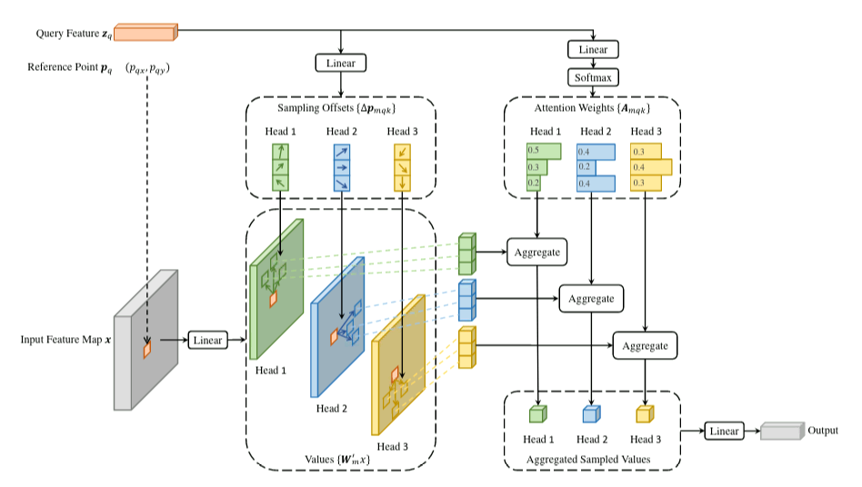
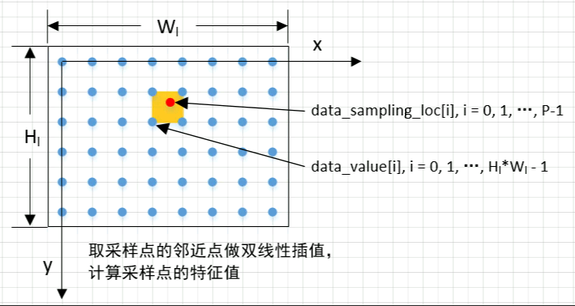

# Multi-scale Deformable Attention Forward算子开发设计方案
* #### 文档基本信息

| 算子名称    | ms_deform_attn_forward                                     |
| ---------- | ---------------------------------------------------------- |
| 编制人/日期 | 张少鹏/2022-09-13                                           |
| 审批人/日期 | 王远/2022-09-29                                             |
| 审批人/日期 | 郑斌/2022-09-29                                             |
| 审批人/日期 | 卜德飞/2022-09-29                                           |

* #### 修改记录
| 版本号| 修订人 | 修订日期 | 修订描述 |
| ----- | ------ | -------  | -------  |
| V1.0  | 张少鹏  | 2022-09-13 | 首次提交 |
* #### 内容描述
本文档为`ms_deform_attn_forward`算子的设计文档，包括需求分析、接口设计、方案设计、性能优化记录和方案实施部分。
* #### 算子需求checklist
算子需求提出者需要`提供`的信息如下：
- 框架负责人
- 算子接口描述
- 功能描述
- 框架版本 + 对应源码路径
- 需求对应网络
- 网络中用到的规模
- 是否需要支持原位
- 是否需要支持stride机制
- 框架单元测试阈值指标（可选）
- 其他特殊需求（在线量化/融合/转数提前等，可选）
- 确认算子需求是否已经过框架层review（滤除MLUOP已支持的算子）

算子需求提出者需要`check`的部分如下：
- 1.1 算子需求分析
- 1.2 算子功能和应用场景描述
- 1.3 算子输入输出参数要求
- 1.4 算子限制
- 1.5 验收标准
- 2.2 接口设计
- 3.5 测试用例（需求提出者check算子需求表中所给规模是否列出）
## 1 需求分析
### 1.1 算子需求分析
| 算子功能简介| 应用于图像处理的多头注意力机制模块                              |
|------------|--------------------------------------------------------------|
| 需求来源    | mmcv                                                         |
| 应用网络    | Deformable DETR                                              |
| 输入数据类型| data_value: float32<br>data_spatial_shapes: int32<br>data_level_start_index: int32<br>data_sampling_loc: float32<br>data_attn_weight: float32 |
| 输入Shape   | data_value: [bs, num_keys, num_heads, channels]<br>data_spatial_shapes: [num_levels, 2]<br>data_level_start_index: [num_levels]<br>data_sampling_loc: [bs, num_queries, num_heads, num_levels, num_points, 2]<br>data_attn_weight: [bs, num_queries, num_heads, num_levels, num_points] |
| 输入Layout  | ARRAY                                                       |
| 输出数据类型| data_col: float32                                            |
| 输出Shape   | data_col: [bs, num_queries, num_heads, channels]            |
| 输出Layout  | ARRAY                                                        |
| 是否需要支持原位        | 否                                                 |
| 是否需要支持stride机制  | 否                                                 |
| 是否需要支持广播  | 否                                                       |
| 0元素检查是否直接返回  | 仅在num_levels和num_points维度上支持0元素，此时data_col输出值全0，返回MLUOP_STATUS_SUCCESS；其他情况下不支持0元素，返回MLUOP_STATUS_BAD_PARAM |
### 1.2 算子功能和应用场景描述
multi-scale deformable attention算子为Deformable DETR的核心模块，为更好地去理解，下面先描述single-scale deformable attention，然后在此基础上介绍multi-scale deformable attention的算法原理。- Deformable Attention ModuleSingle-scale deformable attention模块结构框图如下|  |
| :--: |
| 图1 |输入特征图为$`x\in \mathbb{R}^{C\times H\times W}`$，设$`q`$为query元素索引，对应特征值$`z_q`$以及2d参考点坐标$`p_q`$，deformable attention特征值计算公式为：
```math
DeformAttn(z_q,p_q,x)=\sum_{m=1}^{M}W_m[\sum_{k=1}^{K}A_{mqk}\cdot W_m^{'}x(p_q+\Delta p_{mqk})]
```
其中，$`m`$为attention中head的索引，$`k`$为采样key值的索引，并且$`K`$是key的总和数$`(K\ll HW)`$。对第m个head，第k个采样点，$`\Delta p_{mqk}`$和$`A_{mqk}`$分别为采样点偏移和attention加权系数值。$`A_{mqk}`$取值范围为$`[0,1]`$，满足归一化条件$`\sum_{k=1}^{K}A_{mqk}=1`$。$`\Delta p_{mqk}\in \mathbb{R}^2`$是无取值范围约束的2d实数。由于$`p_q+\Delta p_{mqk}`$是小数，因此在计算$`x(p_q+\Delta p_{mqk})`$时采用了双线性插值。$`\Delta p_{mqk}`$和$`A_{mqk}`$都是通过对query特征值$`z_q`$做linear projection获得的。在实现上，将query特征值$`z_q`$的$`3MK`$个channel输入到linear projection中，首先对前$`2MK`$个channel编码得到采样偏移$`\Delta p_{mqk}`$，剩下的$`MK`$个channel输入给softmax来得到attention加权系数$`A_{mqk}`$。- Multi-scale Deformable Attention Module设$`\{ x^l \}_{l=1}^L`$为输入的multi-scale特征图，$`x^l\in \mathbb{R}^{C\times H_l\times W_l}`$。$`\hat p_q\in [0,1]^2`$为每个query元素$`q`$的各个采样点的归一化坐标。
```math
MSDeformAttn(z_q,\hat p_q,\{ x^l \}_{l=1}^L)=\sum_{m=1}^{M}W_m[\sum_{l=1}^{L}\sum_{k=1}^{K}A_{mlqk}\cdot W_m^{'}x^l(\phi_l(\hat p_q)+\Delta p_{mlqk})]
```
其中，$`m`$为attention中head的索引，$`l`$为输入特征level的索引，$`k`$为采样点的索引。对第m个head，第l个特征level，第k个采样点，$`\Delta p_{mlqk}`$和$`A_{mlqk}`$分别为采样点偏移和attention加权系数值。加权系数$`A_{mlqk}`$满足$`\sum_{l=1}^L\sum_{k=1}^{K}A_{mlqk}=1`$归一化条件。同时，这里使用归一化坐标$`\hat p_q\in [0,1]^2`$来表示精确坐标，其中(0,0)和(1,1)分别表示左上角点和右下角点。函数$`\phi_l(\hat p_q)`$为$`\hat p_q`$在第$`l`$个输入特征图中的坐标。multi-scale deformable attention与上述的single-scale比较相似，区别是前者从multi-scale特征图中采样$`LK`$个点，后者是采样single-scale特征图中的$`K`$个点。
此外，该算子在实现上保留每个head的特征值，体现在输出data_col的head维度上，即算子未做上式多头加权求和操作而是输出保留各head信息。备注：1、输入data_sampling_loc归一化坐标不应存在nan/inf。
2、输入data_value、data_attn_weight中可包含nan/inf。
### 1.3 算子输入输出参数要求
| 参数             | 语义                                                         | 类型（输入/输出） | 支持类型               | 物理布局 | 规模限制 |
| ---------------- | ------------------------------------------------------------ | ----------------- | ---------------------- | -------- | -------- |
| handle           | handle                                                       | 输入              | mluOpHandle_t           | /        | 无       |
| data_value_desc  | 对输入data_value的描述                                        | 输入              | mluOpTensorDescriptor_t | /        | 无       |
| data_value       | 输入特征图所有像素点的特征值                                    | 输入              | float32                | ARRAY    | [bs, num_keys, num_heads, channels]       |
| data_spatial_shapes_desc | 对输入data_spatial_shapes的描述                       | 输入              | mluOpTensorDescriptor_t | /        | 无       |
| data_spatial_shapes      | multi-scale各尺寸输入特征图的长和宽                    | 输入              | int32                  | ARRAY    | [num_levels, 2]       |
| data_level_start_index_desc | 对输入data_level_start_index的描述                 | 输入              | mluOpTensorDescriptor_t | /        | 无       |
| data_level_start_index      | 各尺寸输入特征图对应到data_value的地址偏移           | 输入              | int32                  | ARRAY    | [num_levels]       |
| data_sampling_loc_desc | 对输入data_sampling_loc的描述                           | 输入              | mluOpTensorDescriptor_t | /        | 无       |
| data_sampling_loc      | 采样点的归一化坐标                                       | 输入              | float32               | ARRAY    | [bs, num_queries, num_heads, num_levels, num_points, 2]       |
| data_attn_weight_desc  | 对输入data_attn_weight的描述                            | 输入              | mluOpTensorDescriptor_t | /        | 无       |
| data_attn_weight       | attention加权系数值                                         | 输入              | float32               | ARRAY    | [bs, num_queries, num_heads, num_levels, num_points]       |
| im2col_step      | 用于image to column的步长                                     | 输入              | int32                  | /        | 无       |
| data_col_desc    | 对输出data_col的描述                                          | 输入              | mluOpTensorDescriptor_t | /        | 无       |
| data_col         | 输出attention特征值                                           | 输出              | float32                | ARRAY    | [bs, num_queries, num_heads, channels]       |
### 1.4 算子限制
| 限制类型    | 详细说明                                            |
| ----------- | ------------------------------------------------------------ |
| 数据类型限制| data_value, data_sampling_loc, data_attn_weight, data_col 所指向元素的数据类型为float，data_spatial_shapes, data_level_start_index 所指向元素的数据类型为int32 |
| 数据范围限制| $`data\_value.dims[1]=\sum_{l=1}^{L}H_l*W_l`$<br>data_level_start_index由data_spatial_shapes计算得到，$`data\_level\_start\_index[0]=0; data\_level\_start\_index[i]=\sum_{l=1}^{i}H_l*W_l,i=1,...L-1`$ |
| 原位限制    | 不支持原位       |
| stride限制  | 不支持stride机制 |
| 广播限制    | 不支持广播        |
### 1.5 验收标准
#### 1.5.1 精度验收标准
- MLUOP精度验收标准：输出data_col适配动态阈值，采用动态阈值标准：diffs = [diff1, diff2, diff4]，threshold_rate = [10, 10, 1]。
#### 1.5.2 性能验收标准
- 参考接口性能分析：

| 平台                 | 框架版本     | 数据类型 | 数据规模        | 计算效率  | IO效率   | Hardware time(ms) |
| -------------------- | ----------- | ------- | --------------- | -------- | -------- | ----------------- |
| Tesla V100-SXM2 16GB | mmcv-1.5.1 + cuda-10.2 + pytorch-1.9 + driver-440.64.00 | data_value: float32<br>data_spatial_shapes: int32<br>data_level_start_index: int32<br>data_sampling_loc: float32<br>data_attn_weight: float32<br>data_col: float32 | data_value: [2, 40000, 8, 32]<br>data_spatial_shapes: [1, 2]<br>data_level_start_index: [1]<br>data_sampling_loc: [2, 40000, 8, 1, 4, 2]<br>data_attn_weight: [2, 40000, 8, 1, 4]<br>data_col: [2, 40000, 8, 32]  | 39.127004% | 80.750851% | 1.743355ms |
| Tesla V100-SXM2 16GB | mmcv-1.5.1 + cuda-10.2 + pytorch-1.9 + driver-440.64.00 | data_value: float32<br>data_spatial_shapes: int32<br>data_level_start_index: int32<br>data_sampling_loc: float32<br>data_attn_weight: float32<br>data_col: float32 | data_value: [1, 40000, 8, 32]<br>data_spatial_shapes: [1, 2]<br>data_level_start_index: [1]<br>data_sampling_loc: [1, 900, 8, 1, 4, 2]<br>data_attn_weight: [1, 900, 8, 1, 4]<br>data_col: [1, 900, 8, 32]  | 28.257790% | 67.967224% | 29.856us |
| Tesla V100-SXM2 16GB | mmcv-1.5.1 + cuda-10.2 + pytorch-1.9 + driver-440.64.00 | data_value: float32<br>data_spatial_shapes: int32<br>data_level_start_index: int32<br>data_sampling_loc: float32<br>data_attn_weight: float32<br>data_col: float32 | data_value: [6, 30825, 8, 32]<br>data_spatial_shapes: [4, 2]<br>data_level_start_index: [4]<br>data_sampling_loc: [6, 9664, 8, 4, 8, 2]<br>data_attn_weight: [6, 9664, 8, 4, 8]<br>data_col: [6, 9664, 8, 32]  | 34.306033% | 82.415587% | 2.467792ms |- 网络中使用到的规模性能优于或至少与参考接口性能持平。
- 部分与参考接口性能差距过大的规模在4.算子性能优化记录中进行说明。
- 附上算子测试报告链接，测试报告必须包括框架给出的网络中规模的性能数据以及对应效率值。

## 2 算子接口设计
### 2.1 参考接口- MMCV

```c++
// 给出MMCV接口
// CUDA(https://github.com/open-mmlab/mmcv/blob/v1.6.1/mmcv/ops/csrc/pytorch/cuda/ms_deform_attn_cuda.cu):
at::Tensor ms_deform_attn_cuda_forward(const at::Tensor &value,
                                       const at::Tensor &spatial_shapes,
                                       const at::Tensor &level_start_index,
                                       const at::Tensor &sampling_loc,
                                       const at::Tensor &attn_weight,
                                       const int im2col_step)
```

### 2.2 接口设计

```c++
mluOpStatus_t MLUOP_WIN_API mluOpMsDeformAttnForward(mluOpHandle_t handle,
                                                     const mluOpTensorDescriptor_t data_value_desc,
                                                     const void *data_value,
                                                     const mluOpTensorDescriptor_t data_spatial_shapes_desc,
                                                     const void *data_spatial_shapes,
                                                     const mluOpTensorDescriptor_t data_level_start_index_desc,
                                                     const void *data_level_start_index,
                                                     const mluOpTensorDescriptor_t data_sampling_loc_desc,
                                                     const void *data_sampling_loc,
                                                     const mluOpTensorDescriptor_t data_attn_weight_desc,
                                                     const void *data_attn_weight,
                                                     const int im2col_step,
                                                     const mluOpTensorDescriptor_t data_col_desc,
                                                     void *data_col)
```
## 3 实现方案设计
### 3.1 实现方案- 输入输出数据及参数释义
data_value : [bs, num_keys, num_heads, channels]
各尺寸特征图内所有像素点的特征值，如图2所示
data_spatial_shapes : [num_levels, 2]
multi-scale各尺寸输入特征图的长和宽，最低维`2`表示(h, w)，即图2中$`[H_l, W_l], l=1,2,…,L`$
data_level_start_index : [num_levels]
各尺寸输入特征图对应到data_value的地址起始偏移
data_sampling_loc : [bs, num_queries, num_heads, num_levels, num_points, 2]
采样点的归一化坐标，最低维`2`表示(x, y)，表示采样点在x、y坐标轴下相对于$`[W_l, H_l]`$的归一化坐标
data_attn_weight : [bs, num_queries, num_heads, num_levels, num_points]
attention加权系数值，即在图1基础上将Attention Weights($`A_{mqk}`$)扩展到multi-scale下的$`A_{mlqk}`$
data_col : [bs, num_queries, num_heads, channels]
输出attention特征值bs: batch size，输入数据batch数量
num_keys: multi-scale所有尺度特征图的像素点数量总和
num_heads: multi-head attention的head数量
channels: 特征值数量
num_levels: multi-scale所有尺度特征图的数量
num_queries: attention的query数量
num_points: 各尺寸特征图的采样点数量
|  |
| :--: |
| 图2 |-
该算子保留每个head的信息输出，由1-2小节得到其计算公式为
```math
MSDeformAttn(z_q,\hat p_q,\{ x^l \}_{l=1}^L)=\sum_{l=1}^{L}\sum_{k=1}^{P}A_{mlqk}\cdot x^l(\phi_l(\hat p_q)+\Delta p_{mlqk})
```
从多核拆分和计算过程角度出发，实现方案如下：

1. 我们做如下多核拆分，算子输出结果data_col规模为[bs, num_queries, num_heads, channels]，拆bs、num_queries、num_heads三个维度，每个mlu core计算输出(bs * num_queries * num_heads) / taskDim * channels个元素。

2. mlu core内循环处理(bs * num_queries * num_heads) / taskDim次，每次计算得到channels个元素输出需处理multi-scale的$`L`$个特征图，其中每个特征图采样$`P`$个点，即共处理$`LP`$个采样点。对每个采样点做双线性插值得到该点的channels个特征值，每个采样点的channels个特征值都对应一个attention加权系数值，将$`LP`$个采样点的特征值做加权求和，就得到了channels个元素输出。

3. 在处理每个采样点时，通过输入data_sampling_loc的采样点归一化坐标和data_spatial_shapes的特征图尺寸，标量计算得到该采样点的坐标(x, y)。由于特征图外像素点特征值padding为0值，在双线性插值前先做如下预处理：采样点邻近点都不在特征图内的采样点对应特征值均为0值，不需做双线性插值和累加；采样点邻近点部分在特征图内的采样点，在做双线性插值时只对特征图内像素点做插值。

4. 根据采样点坐标(x, y)在输入data_value获得各邻近点的channels个特征值，矢量计算双线性插值后采样点的channels个特征值。这步计算第$`l`$个特征图内采样点的双线性插值即上式中的$`x^l()`$，设采样点邻近的左上角像素点的channels个特征值为矢量v1，右上角像素点的channels个特征值为矢量v2，左下角像素点的channels个特征值为矢量v3，右下角像素点的channels个特征值为矢量v4，则采样点的双线性插值计算公式为

```math
h\_low = floorf(y)  \\
w\_low = floorf(x)  \\
h\_high = h\_low + 1  \\
w\_high = w\_low + 1  \\
lh = y - h\_low  \\
lw = x - w\_low  \\
hh = 1 - lh  \\
hw = 1 - lw  \\w1 = hh * hw, w2 = hh * lw, w3 = lh * hw, w4 = lh * lw  \\
x^l(\phi_l(\hat p_q)+\Delta p_{mlqk}) = (w1 * v1 + w2 * v2 + w3 * v3 + w4 * v4)
```

5. 每个采样点的channels个特征值都对应一个attention加权系数，由输入data_attn_weight得到。根据MSDeformAttn计算公式，算子输出data_col的channels个特征值由$`LP`$个采样点的特征值对attention加权系数做加权求和计算得到。这里将$`A_{mlqk}\cdot x^l(\phi_l(\hat p_q)+\Delta p_{mlqk})`$计算结果累加在nram空间上。

6. 重复步骤3、4、5，直至处理完multi-scale特征图的$`LP`$个采样点，将累加在nram上的channels个特征值输出结果store至算子输出data_col。若步骤3、4、5的channels个特征值在nram空间上一次处理不完，则循环处理。

7. 步骤3、4、5、6计算得到的是第batch_idx个batch，第query_idx个query，第head_idx个head上的channels个特征值，重复上述步骤直至处理完成该mlu core拆分到的bs、num_queries、num_heads三个维度。- 根据测例规模，当channels值较大，不能一次将channels个特征值load到nram上时，需循环多次处理所有channels。由于channels间计算彼此独立，设每次最多处理nram_channels_limit个channel，则循环处理nram_channels_limit个attention特征值的load、compute、store，直至处理完所有channels，nram空间可复用。- 具体实现上，每个kernel所需load的数据量对于输入data_spatial_shapes, data_level_start_index, data_sampling_loc, data_attn_weight可根据tensor维度计算确定。但是输入data_value对于不同尺度的特征图，所需load数据量依赖于输入data_spatial_shapes中存储的每个尺度特征图的大小。这里每次load整张特征图内所有点显然是不合适的，而是在双线性插值时load对应点在channel维度上的所有数据。前者可能存在浪费IO的情况（所有采样点的邻近点没有覆盖特征图内所有点），而后者可能存在重复IO的情况（对于特征图内某个点同时是多个采样点的邻近点存在重复IO）。

### 3.2 伪代码实现

```cpp
#include <math.h>

#define FOUR_SPLIT 4

__nram__ char nram_buffer[MAX_NRAM_SIZE];

template <typename T>
__mlu_func__ void bilinear_interpolation(const T *data_value_gdram,
                                         T *data_value_nram,
                                         T *sample_point_value,
                                         T *auxiliary_b,
                                         const size_t deal_num,
                                         const int &height,
                                         const int &width,
                                         const int &num_heads,
                                         const int &channels,
                                         const T &h,
                                         const T &w,
                                         const int &head_idx) {
  const int h_low = floorf(h);
  const int w_low = floorf(w);
  const int h_high = h_low + 1;
  const int w_high = w_low + 1;
  const T lh = h - h_low;
  const T lw = w - w_low;
  const T hh = 1 - lh;
  const T hw = 1 - lw;
  const T w1 = hh * hw;
  const T w2 = hh * lw;
  const T w3 = lh * hw;
  const T w4 = lh * lw;
  const int w_stride = num_heads * channels;
  const int h_stride = width * w_stride;
  const int h_low_ptr_offset = h_low * h_stride;
  const int h_high_ptr_offset = h_low_ptr_offset + h_stride;
  const int w_low_ptr_offset = w_low * w_stride;
  const int w_high_ptr_offset = w_low_ptr_offset + w_stride;
  const int base_ptr_offset = head_idx * channels;
  __bang_write_value((T *)sample_point_value, deal_num, (T)0);
  // top-left point
  if (h_low >= 0 && w_low >= 0) {
    const int v1_offset = h_low_ptr_offset + w_low_ptr_offset + base_ptr_offset;
    // sample_point_value += v1 * w1
    __memcpy(data_value_nram, data_value_gdram + v1_offset, deal_num * sizeof(T), GDRAM2NRAM);
    __bang_mul_scalar((T *)auxiliary_b, (T *)data_value_nram, (T)w1, deal_num);
    __bang_add((T *)sample_point_value, (T *)sample_point_value, (T *)auxiliary_b, deal_num);
  }
  // top-right point
  if (h_low >= 0 && w_high <= width - 1) {
    const int v2_offset = h_low_ptr_offset + w_high_ptr_offset + base_ptr_offset;
    // sample_point_value += v2 * w2
    __memcpy(data_value_nram, data_value_gdram + v2_offset, deal_num * sizeof(T), GDRAM2NRAM);
    __bang_mul_scalar((T *)auxiliary_b, (T *)data_value_nram, (T)w2, deal_num);
    __bang_add((T *)sample_point_value, (T *)sample_point_value, (T *)auxiliary_b, deal_num);
  }
  // bottom-left point
  if (h_high <= height - 1 && w_low >= 0) {
    const int v3_offset = h_high_ptr_offset + w_low_ptr_offset + base_ptr_offset;
    // sample_point_value += v3 * w3
    __memcpy(data_value_nram, data_value_gdram + v3_offset, deal_num * sizeof(T), GDRAM2NRAM);
    __bang_mul_scalar((T *)auxiliary_b, (T *)data_value_nram, (T)w3, deal_num);
    __bang_add((T *)sample_point_value, (T *)sample_point_value, (T *)auxiliary_b, deal_num);
  }
  // bottom-right point
  if (h_high <= height - 1 && w_high <= width - 1) {
    const int v4_offset = h_high_ptr_offset + w_high_ptr_offset + base_ptr_offset;
    // sample_point_value += v4 * w4
    __memcpy(data_value_nram, data_value_gdram + v4_offset, deal_num * sizeof(T), GDRAM2NRAM);
    __bang_mul_scalar((T *)auxiliary_b, (T *)data_value_nram, (T)w4, deal_num);
    __bang_add((T *)sample_point_value, (T *)sample_point_value, (T *)auxiliary_b, deal_num);
  }
}

template <typename T>
__mlu_global__ void msdeformattnforwardUnion1(const char *data_value_gdram,
                                              const char *data_spatial_shapes_gdram,
                                              const char *data_level_start_index_gdram,
                                              const char *data_sampling_loc_gdram,
                                              const char *data_attn_weight_gdram,
                                              const int batch_size,
                                              const int num_keys,
                                              const int num_heads,
                                              const int channels,
                                              const int num_levels,
                                              const int num_queries,
                                              const int num_points,
                                              char *data_col_gdram) {
  if (__is_mpu()) {
    return;
  }
  size_t spatial_size = 2 * sizeof(int32_t);
  size_t span_num_deal = PAD_DOWN((MAX_NRAM_SIZE - spatial_size) / FOUR_SPLIT / sizeof(T), NFU_ALIGN_SIZE);
  size_t align_num = NFU_ALIGN_SIZE;
  int32_t channels_seg_num = channels / span_num_deal;
  size_t channels_rem = channels % span_num_deal;
  size_t channels_align_rem = CEIL_ALIGN(channels_rem, align_num);
  char *data_spatial_shapes_nram = nram_buffer;
  char *data_value_nram = data_spatial_shapes_nram + spatial_size;
  char *data_col_nram = data_value_nram + span_num_deal * sizeof(T);
  char *auxiliary_a = data_col_nram + span_num_deal * sizeof(T);
  char *auxiliary_b = auxiliary_a + span_num_deal * sizeof(T);
  for (int kernel_idx = taskId; kernel_idx < batch_size * num_queries * num_heads; kernel_idx += taskDim) {
    // kernel_idx = batch_idx * num_queries * num_heads + query_idx * num_heads + head_idx
    const int head_idx = kernel_idx % num_heads;
    int temp = kernel_idx / num_heads;
    const int query_idx = temp % num_queries;
    temp /= num_queries;
    const int batch_idx = temp;
    char *data_value_gdram_start = data_value_gdram + batch_idx * num_keys * num_heads * channels * sizeof(T);
    char *data_sampling_loc_gdram_start = data_sampling_loc_gdram + kernel_idx * num_levels * num_points * 2 * sizeof(T);
    char *data_attn_weight_gdram_start = data_attn_weight_gdram + kernel_idx * num_levels * num_points * sizeof(T);
    char *data_col_gdram_start = data_col_gdram + kernel_idx * channels * sizeof(T);
    for (int c_seg_idx = 0; c_seg_idx < channels_seg_num; ++c_seg_idx) {
      __bang_write_value((T *)data_col_nram, span_num_deal, (T)0);
      for (int level_idx = 0; level_idx < num_levels; ++level_idx) {
        const int level_start_id = ((int32_t *)data_level_start_index_gdram)[level_idx];
        const int spatial_h_ptr = level_idx << 1;
        __memcpy(data_spatial_shapes_nram, data_spatial_shapes_gdram + spatial_h_ptr * sizeof(int32_t),
                 2 * sizeof(int32_t), GDRAM2NRAM);
        const int spatial_h = ((int32_t *)data_spatial_shapes_nram)[0];
        const int spatial_w = ((int32_t *)data_spatial_shapes_nram)[1];
        const T *data_value_ptr = data_value_gdram_start + (level_start_id * num_heads * channels +
                                  c_seg_idx * span_num_deal) * sizeof(T);
        for (int point_idx = 0; point_idx < num_points; ++point_idx) {
          const T loc_w = ((T *)data_sampling_loc_gdram_start)[(level_idx * num_points + point_idx) * 2];
          const T loc_h = ((T *)data_sampling_loc_gdram_start)[(level_idx * num_points + point_idx) * 2 + 1];
          const T weight = ((T *)data_attn_weight_gdram_start)[level_idx * num_points + point_idx];
          const T h_im = loc_h * spatial_h - 0.5;
          const T w_im = loc_w * spatial_w - 0.5;
          if (h_im > -1 && w_im > -1 && h_im < spatial_h && w_im < spatial_w) {
            bilinear_interpolation(data_value_ptr, data_value_nram, auxiliary_a, auxiliary_b, span_num_deal,
              spatial_h, spatial_w, num_heads, channels, h_im, w_im, head_idx);
            __bang_mul_scalar((T *)auxiliary_a, (T *)auxiliary_a, (T)weight, span_num_deal);
            __bang_add((T *)data_col_nram, (T *)data_col_nram, (T *)auxiliary_a, span_num_deal);
          }
        }
      }
      __memcpy(data_col_gdram_start + c_seg_idx * span_num_deal * sizeof(T), data_col_nram,
               span_num_deal * sizeof(T), NRAM2GDRAM);
    }
    if (channels_rem > 0) {
      __bang_write_value((T *)data_col_nram, channels_align_rem, (T)0);
      for (int level_idx = 0; level_idx < num_levels; ++level_idx) {
        const int level_start_id = ((int32_t *)data_level_start_index_gdram)[level_idx];
        const int spatial_h_ptr = level_idx << 1;
        __memcpy(data_spatial_shapes_nram, data_spatial_shapes_gdram + spatial_h_ptr * sizeof(int32_t),
                 2 * sizeof(int32_t), GDRAM2NRAM);
        const int spatial_h = ((int32_t *)data_spatial_shapes_nram)[0];
        const int spatial_w = ((int32_t *)data_spatial_shapes_nram)[1];
        const T *data_value_ptr = data_value_gdram_start + (level_start_id * num_heads * channels +
                                  channels_seg_num * span_num_deal) * sizeof(T);
        for (int point_idx = 0; point_idx < num_points; ++point_idx) {
          const T loc_w = ((T *)data_sampling_loc_gdram_start)[(level_idx * num_points + point_idx) * 2];
          const T loc_h = ((T *)data_sampling_loc_gdram_start)[(level_idx * num_points + point_idx) * 2 + 1];
          const T weight = ((T *)data_attn_weight_gdram_start)[level_idx * num_points + point_idx];
          const T h_im = loc_h * spatial_h - 0.5;
          const T w_im = loc_w * spatial_w - 0.5;
          if (h_im > -1 && w_im > -1 && h_im < spatial_h && w_im < spatial_w) {
            bilinear_interpolation(data_value_ptr, data_value_nram, auxiliary_a, auxiliary_b, channels_align_rem,
              spatial_h, spatial_w, num_heads, channels, h_im, w_im, head_idx);
            __bang_mul_scalar((T *)auxiliary_a, (T *)auxiliary_a, (T)weight, channels_align_rem);
            __bang_add((T *)data_col_nram, (T *)data_col_nram, (T *)auxiliary_a, channels_align_rem);
          }
        }
      }
      __memcpy(data_col_gdram_start + channels_seg_num * span_num_deal * sizeof(T), data_col_nram,
               channels_rem * sizeof(T), NRAM2GDRAM);
    }
  }
}
```

### 3.3 拆分(任务拆分，多核拆分)

**任务类型U1：**

输出数据data_col规模为[bs, num_queries, num_heads, channels]，多核拆分在bs、num_queries、num_heads三个维度上进行拆分，平分到每个core中。

### 3.4 性能优化设计

1、资源分配

| 表项            | 分配策略   |
| ----------------| -----------|
| NRAM            | 用于保存输入data_value和输出data_col数据，以及中间计算结果的暂存空间 |

- nram空间划分
```cpp
/****************************************************************************************
 * | spatial_shapes     | data_value_p1_ping | data_value_p2_ping | data_value_p3_ping |
 * | data_value_p4_ping | data_value_p1_pong | data_value_p2_pong | data_value_p3_pong |
 * | data_value_p4_pong | data_col           | auxiliary_a        | auxiliary_b        |
 * | 128bytes           | deal_size          | deal_size          | deal_size          |
 * | deal_size          | deal_size          | deal_size          | deal_size          |
 * | deal_size          | deal_size          | deal_size          | deal_size          |
 ****************************************************************************************/
```
2、流水设计

mlu每次循环处理$`L`$个不同尺度的特征图，每个特征图内有$`P`$个采样点。处理$`LP`$个采样点共load $`LP`$次数据，compute$`LP`$次数据，store$`1`$次数据。这里在load/compute/store间排流水。

### 3.5 方案理论性能
完成上述3.1，3.2，3.3，3.4几个步骤之后，基本可以给出一个理论性能，不需要每一个算子都有过于复杂的公式，但是一定要对自己的算子有一个心理的预期，最终实现之后的效率值是多少。在不同平台、数据类型下，nram划分以及所用BangC指令个数略有差异，现以MLU370X4平台输入float32数据为例。

记batch_size = B, num_keys = K, num_levels = L, num_heads = M, num_queries = Q, num_points = P, channels = C输入输出数据规模：

data_value: [B, K, M, C]
data_spatial_shapes: [L, 2]
data_level_start_index: [L]
data_sampling_loc: [B, Q, M, L, P, 2]
data_attn_weight: [B, Q, M, L, P]
data_col: [B, Q, M, C]

由于算子算法本身在计算过程中存在基于输入数据的分支判断（取决于采样点位置是否在特征图内，以及采样点邻近点是否在特征图像素点点集内），理论计算量的上下限大致如下

MLU TheoryIOs(max) = (4 * B * Q * M * L * P * C + B * Q * M * L * P * 2 + B * Q * M * L * P + B * Q * M * C) * sizeof(T) + (L * 2 + L) * sizeof(int) bytes

MLU TheoryOps(max) = B * Q * M * L * P * ((C - 1) / span_num_deal + 1) * 11 ops

其中，span_num_deal为一个时间片内处理的channels数量。IO Efficieny = ((4 * B * Q * M * L * P * C + B * Q * M * L * P * 3 + B * Q * M * C) * sizeof(T) + 3L * sizeof(int)) / real_time / peak_bandwidth

Compute Efficieny = MLU TheoryOps / real_time / peak_compute_force
算子是IO瓶颈还是CP瓶颈具体取决于测例规模。

dtype: float32
data_value: [2, 40000, 8, 32]
data_spatial_shapes: [1, 2]
data_level_start_index: [1]
data_sampling_loc: [2, 40000, 8, 1, 4, 2]
data_attn_weight: [2, 40000, 8, 1, 4]
data_col: [2, 40000, 8, 32]
MLU TheoryIOs(max) = 1,423,360,012 bytes
MLU TheoryOps(max) = 28,160,000 ops

**说明：**

以MLU370X4资源预估
MLU ComputeForce : 1.024e+12 (op/s)
MLU IoBandWidth  : 307.2 (GB/s)
IO_TIME = 4.3151279654e-03 s
CP_TIME = 2.75e-05 s
IO_TIME > CP_TIME, 因此该测例规模下是IO瓶颈。

### 3.6 可维护性设计
1、bangc代码中加入必要的 log信息，比如输入的规模、数据类型、layout这些，以及如果出错会导致程序core dump的变量，比如IO指令的data_size、dim xyz的值等，这些信息都是有利于快速定位问题。

2、对每一个函数命名变量命名都有充分的注释。

3、避免魔鬼数字，对于确定的数字尽量使用公共宏来替代。


### 3.7 测试用例设计- 框架在需求列表中给出的算子在网络中用到的规模：
  | 测例规模                                                   | source data type | destination data type |
  | ---------------------------------------------------------- | ---------------- | --------------------- |
  | data_value: [2, 40000, 8, 32]<br>data_spatial_shapes: [1, 2]<br>data_level_start_index: [1]<br>data_sampling_loc: [2, 40000, 8, 1, 4, 2]<br>data_attn_weight: [2, 40000, 8, 1, 4]<br>data_col: [2, 40000, 8, 32]     | data_value: float32<br>data_spatial_shapes: int32<br>data_level_start_index: int32<br>data_sampling_loc: float32<br>data_attn_weight: float32   | data_col: float32   |
  | data_value: [1, 40000, 8, 32]<br>data_spatial_shapes: [1, 2]<br>data_level_start_index: [1]<br>data_sampling_loc: [1, 900, 8, 1, 4, 2]<br>data_attn_weight: [1, 900, 8, 1, 4]<br>data_col: [1, 900, 8, 32]     | data_value: float32<br>data_spatial_shapes: int32<br>data_level_start_index: int32<br>data_sampling_loc: float32<br>data_attn_weight: float32   | data_col: float32   |
  | data_value: [6, 30825, 8, 32]<br>data_spatial_shapes: [4, 2]<br>data_level_start_index: [4]<br>data_sampling_loc: [6, 9664, 8, 4, 8, 2]<br>data_attn_weight: [6, 9664, 8, 4, 8]<br>data_col: [6, 9664, 8, 32]     | data_value: float32<br>data_spatial_shapes: int32<br>data_level_start_index: int32<br>data_sampling_loc: float32<br>data_attn_weight: float32   | data_col: float32   |其他可根据需要进行补充。算子开发完毕后，补充测试报告链接。

### 3.8 算子防呆检查
1、指针为空防呆。

2、0元素检查防呆，VLOG(5)打印信息。

3、对输入输出支持的dtype、layout以及shape进行防呆。

4、算子存在的自身的相关参数防呆。

## 4 算子性能/精度问题 & 优化记录

### 4.1 当前存在问题的规模说明
列出当前已知但暂无人力解决的性能/精度异常。

### 4.2 已经过优化的规模说明无

## 5 方案实施

### 5.1 开发测试计划
- 2022.09.14 ~ 2022.09.20 调研源码、算子设计文档
- 2022.09.20 ~ 2022.09.23 方案review
- 2022.09.26 ~ 2022.09.27 generator、gtest代码开发
- 2022.09.28 ~ 2022.10.11 算子主体框架开发
- 2022.10.12 ~ 2022.10.20 大规模测试+测试报告、代码调测
- 2022.10.21 ~ 2022.10.24 提交MR+代码review
- 2022.10.25 算子入库
### 5.2 风险分析
