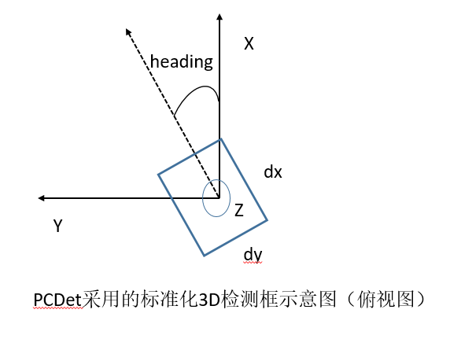

# points_in_boxes 算子开发设计方案

* #### 文档基本信息

| 算子名称    | `points_in_boxes`                                            |
| ----------- | --------------------- |
| 编制人/日期 | 张才贤/2023-03-10                                            |
| 审批人/日期 | 司凤洋/2023-03-24                                            |
| 审批人/日期 | 王远/2023-03-24                                              |
| 审批人/日期 | 周晨阳/2023-03-24                                            |

* #### 修改记录

| 版本号| 修订人 | 修订日期 | 修订描述 |
| ----- | ------ | -------  | -------  |
| V1.0  | 张才贤 | 2023-03-10 | 首次提交 |

* #### 内容描述

本文档为`points_in_boxes`算子的设计文档，包括需求分析、接口设计、方案设计、性能优化记录和方案实施部分。

* #### 算子需求checklist

算子需求提出者需要`提供`的信息如下：

- 框架负责人
- 算子接口描述
- 功能描述
- 框架版本 + 对应源码路径
- 需求对应网络
- 网络中用到的规模
- 常用规模下的竞品性能（可选）
- 是否需要支持原位
- 是否需要支持stride机制
- 框架单元测试阈值指标（可选）
- 其他特殊需求（在线量化/融合/转数提前等，可选）
- 确认算子需求是否已经过框架层review（滤除MLUOP已支持的算子）

算子需求提出者需要`check`的部分如下：

- 1.1 算子需求分析
- 1.2 算子功能和应用场景描述
- 1.3 算子输入输出参数要求
- 1.4 算子限制
- 1.5 验收标准
- 2.2 接口设计
- 3.5 测试用例（需求提出者check算子需求表中所给规模是否列出）

## 1 需求分析

### 1.1 算子需求分析


| 算子功能简介| 简要填写算子功能，详细描述在1.2中进行说明                    |
|-------------|--------------------------------------------------------------|
| 需求来源    | Pytorch                                                      |
| 应用网络    | PointPillar                                                  |
| 输入数据类型| float                                                        |
| 输入Shape   | points: [B, M, 3]; boxes: [B, T, 7];                         |
| 输出数据类型| int                                                          |
| 输出Shape   | points_indices[B, M]                                         |
| 是否需要支持原位        | 否                                               |
| 是否需要支持stride机制  | 否                                               |
| 是否需要支持广播        | 否                                               |
| 0元素检查是否直接返回   | 是                                               |


### 1.2 算子功能和应用场景描述

该算子作为PointPillar的功能模块，常用于自动驾驶激光点云3D目标检测中。点云是某个坐标系下的点的数据集。点包含了丰富的信息，包括三维坐标 X，Y，Z、颜色、分类值、强度值、时间等等。
在3D 视觉领域，处理对象主要是点云。相对于图像，点云有其不可替代的优势——深度，也就是说三维点云直接提供了三维空间的数据，而图像则需要通过透视几何来反推三维数据。
点云的获取主要通过三维成像传感器获得，也可以通过LiDAR激光探测与测量获得，主要通过星载，机载和地面三种方式。

该算子有2个输入Tensor，分别为 points: [B, M, 3], boxes: [B, T, 7]：

- 其中B代表Batch Size, M代表points的数量，points低维度的3个数字包括的信息为：X, Y, Z, 代表点的三维坐标。

- 其中T代表物体3D框的数量，boxes低维度的7个数字信息是(cx, cy, cz, dx, dy, dz, heading), 其中(cx, cy, cz) 为物体3D框的几何中心位置，(dx, dy, dz)分别为物体3D框在heading角度为0时沿着x-y-z三个方向的长度，heading为物体在俯视图下的朝向角 (沿着x轴方向为0度角，逆时针x到y角度增加), 如下图所示。



1个输出Tensor，points_indices: [B, M]，表示每个points在对应框的索引。

该算子的功能主要是检测给定的点云数据中每个点属于哪个3D框，输出表示对应框的索引，如果不存在对应的框，输出-1。

该算子的实现主要参考pytorch实现的点云3D目标检测代码库OpenPCDet，其中集成了PointPillar的开源实现。

其中对于给定的points(x, y, z), box(cx, cy, cz, dx, dy, dz, rz), 检测points是否在box内的公式如下：

```math
in\_flag = \lvert (z - cz) \rvert <= \frac{dz}{2} \ \& \\
\lvert (x - cx) * cos(-rz) - (y - cy) * sin(-rz)\rvert < \frac{dx}{2} \ \& \\
\lvert (x - cx) * sin(-rz) + (y - cy) * cos(-rz)\rvert < \frac{dy}{2}
```
### 1.3 算子输入输出参数要求

| 参数             | 语义                           | 类型（输入/输出） | 支持类型               | 物理布局 | 规模限制 |
| ---------------- | ------------------------------ | ----------------- | ---------------------- | -------- | -------- |
| handle           |                                | 输入              |                        | /        | 无       |
| points_desc      |                                | 输入              |                        | /        | 无       |
| points           |                                | 输入              | float                  | ARRAY    | 无       |
| boxes_desc       |                                | 输入              |                        | /        | 无       |
| boxes            |                                | 输入              | float                  | ARRAY    | 无       |
| points_indices_desc |                                | 输入              |                        | /        | 无       |
| points_indices      |                                | 输出              | int32_t                  | ARRAY    | 无       |

### 1.4 算子限制

该小节为limitation.md的补充。详细描述与框架需求相比，算子尚有哪些功能/模式/范围/数据类型/xxx不支持。
使用表格或分段列出均可。

| 限制类型    | 详细说明                  |
| ----------- | ------------------------- |
| 原位限制    | 不支持原位 |
| stride限制  | 不支持stride机制 |
| 广播限制    | 不支持广播 |

### 1.5 验收标准

#### 1.5.1 精度验收标准

精度验收标准：
  - Pytorch框架该算子不支持double数据类型的计算，所以无法适配动态阈值。
  - Pytorch框架中该算子GPU目前也只支持了float数据类型，与GPU算子保持一致，half数据类型不作交付。
  - 在Limitation文档中说明，设置静态阈值，验收标准为A类，diff3=0。

#### 1.5.2 性能验收标准

- 附上算子测试报告链接，测试报告必须包括框架给出的网络中规模的性能数据以及对应效率值。

## 2 算子接口设计

### 2.1 参考接口

- pytorch接口
```python
def points_in_boxes_gpu(points, boxes):
  """
    :param points: (B, M, 3)
    :param boxes: (B, T, 7), num_valid_boxes <= T
    :return box_idxs_of_pts: (B, M), default background = -1
  """
```
- pytorch cuda kernel接口
```c++
_global_ void points_in_boxes_kernel(int batch_size,
    int boxes_num, int pts_num, const float *boxes,
    const float *pts, int *box_idx_of_points);
```


### 2.2 接口设计

```c++
mluOpStatus_t MLUOP_WIN_API mluOpPointsInBoxes(mluOpHandle_t handle,
                                            const mluOpTensorDescriptor_t points_desc,
                                            const void *points,
                                            const mluOpTensorDescriptor_t boxes_desc,
                                            const void *boxes,
                                            const mluOpTensorDescriptor_t points_indices_desc,
                                            void *points_indices);

```
| 参数名称          | 参数说明                                                     |
| :------------------------------- | ------------------------------------- |
| handle            | 当前 kernel 的 context                                       |
| points_desc        | points tensor 的描述符                                        |
| points        | points 在 DDR 上的指针                                        |
| boxes_desc        | boxes tensor 的描述符                                        |
| boxes        | boxes 在 DDR 上的指针                                        |
| points_indices_desc             | points indices tensor 的描述符                                 |
| points_indices        | points indices 在 DDR 上的指针                                        |


## 3 实现方案设计

### 3.1 实现方案
参考Pytorch框架gpu的实现代码：
```c++
_device_ inline void lidar_to_local_coords(float shift_x, float shift_y, float rot_angle, float &local_x, float &local_y){
  float cosa = cos(-rot_angle), sina = sin(-rot_angle);
  local_x = shift_x * cosa + shift_y * (-sina);
  local_y = shift_x * sina + shift_y * cosa;
}

_device_ inline int check_pt_in_box3d(const float *pt, const float *box3d, float &local_x, float &local_y){
  // param pt: (x, y, z)
  // param box3d: [x, y, z, dx, dy, dz, heading] (x, y, z) is the box center
  const float MARGIN = 1e-5;
  float x = pt[0], y = pt[1], z = pt[2];
  float cx = box3d[0], cy = box3d[1], cz = box3d[2];
  float dx = box3d[3], dy = box3d[4], dz = box3d[5], rz = box3d[6];
  if (fabsf(z - cz) > dz / 2.0)
    return 0;
  lidar_to_local_coords(x - cx, y - cy, rz, local_x, local_y);
  float in_flag = (fabs(local_x) < dx / 2.0 + MARGIN) & (fabs(local_y) < dy / 2.0 + MARGIN);
  return in_flag;
}

_global_ void points_in_boxes_kernel(int batch_size, int boxes_num, int pts_num, const float *boxes,
    const float *pts, int *box_idx_of_points){
  // params boxes: (B, N, 7) [x, y, z, dx, dy, dz, heading] (x, y, z) is the box center
  // params pts: (B, npoints, 3) [x, y, z] in LiDAR coordinate
  // params boxes_idx_of_points: (B, npoints), default -1

  int bs_idx = blockIdx.y;
  int pt_idx = blockIdx.x * blockDim.x + threadIdx.x;
  if (bs_idx >= batch_size || pt_idx >= pts_num) return;

  boxes += bs_idx * boxes_num * 7;
  pts += bs_idx * pts_num * 3 + pt_idx * 3;
  box_idx_of_points += bs_idx * pts_num + pt_idx;

  float local_x = 0, local_y = 0;
  int cur_in_flag = 0;
  for (int k = 0; k < boxes_num; k++){
    cur_in_flag = check_pt_in_box3d(pts, boxes + k * 7, local_x, local_y);
    if (cur_in_flag) {
      box_idx_of_points[0] = k;
      break;
    }
  }
}

void points_in_boxes_launcher(int batch_size, int boxes_num, int pts_num, const float *boxes,
    const float *pts, int *box_idx_of_points){
  // params boxes: (B, N, 7) [x, y, z, dx, dy, dz, heading] (x, y, z) is the box center
  // params pts: (B, npoints, 3) [x, y, z]
  // params boxes_idx_of_points: (B, npoints), default -1
  cudaError_t err;

  dim3 blocks(DIVUP(pts_num, THREADS_PER_BLOCK), batch_size);
  dim3 threads(THREADS_PER_BLOCK);
  points_in_boxes_kernel<<<blocks, threads>>>(batch_size, boxes_num, pts_num, boxes, pts, box_idx_of_points);

  err = cudaGetLastError();
  if (cudaSuccess != err){
    fprintf(stderr, "CUDA kernel failed : %s\n", cudaGetErrorString(err)); exit(-1);
  }
#ifdef DEBUG
  cudaDeviceSynchronize(); // for using printf in kernel function
#endif
}
```
我们可以看到cuda在实现中block拆分了points\_num和batch\_size两个维度，thread拆分了points\_num维度。对于每个points，遍历boxes检查points是否在box中，输出第一个所在box的索引，如果不存在，输出-1。
  MLU实现方案计算步骤如下：

  1. load points、boxes到片上，进行转置，区分MLU arch进行转置，因为原始输入的shape是 (B, M, 3), (B, T, 7)，低维度无法向量化计算，且不对齐， 也可以考虑在370以及更高架构上使用deform IO指令transpose成(B, 3, M), (B, 7, T)。

  2. 检测点是否在框内。有两种方案:

    - 一种是在M维度上遍历points坐标，其中的每个元素m和box的T维度进行向量运算，之后利用bang_findfirst1寻找第一个不为0的box，作为output。
    - 另外就是在T维度上遍历boxes坐标，其中的每个box和points的M维度进行向量运算，之后利用一系列elementwise运算将对应box的索引加到output中。

  方案1，2的理论计算量差不多，虽然方案1实现较为简单，但是考虑到实际网络规模M >> T, 方案2的循环次数较少，计算效率较高，理论性能较好，推荐实现方案2。

  需要注意的是采用方案1的话，步骤1只需要转置boxes，对应的，采用方案2，只需要转置points。

  3. store nram2gdram。

### 3.2 伪代码实现（可选）
下面给出方案2的伪代码。
  ```c++
__nram__ float tmp, tmp1, tmp2, tmp3, a, b, last;
void check_point_in_box(float *X, float *Y, float *Z, float cx, float cy, float cz, float dx, float dy, float dz, float rz, int num) {
  __bang_sub_scalar(tmp, Z, cz, num);
  __bang_active_abs(tmp, tmp, num);
  __bang_write_value(tmp1, num, 0.5 * dz);
  __bang_le(a, tmp, tmp1, num);
  float cosa = std::cos(-rz);
  float sina = std::sin(-rz);
  __bang_sub_scalar(tmp, X, cx, num);
  __bang_sub_scalar(tmp1, Y, cy, num);
  __bang_mul_scalar(tmp2, tmp, cosa, num);
  __bang_mul_scalar(tmp3, tmp1, sina, num);
  __bang_sub_scalar(tmp2, tmp2, tmp3, num);  //  local_x

  __bang_mul_scalar(tmp, tmp, sina, num);
  __bang_mul_scalar(tmp1, tmp1, cosa, num);
  __bang_add_scalar(tmp, tmp, tmp1, num);  //  local_y

  __bang_active_abs(tmp2, tmp2, num);
  __bang_write_value(tmp1, num, 0.5 * dx);
  __bang_lt(b, tmp2, tmp1, num);
  __bang_mul(a, a, b, num);

  __bang_active_abs(tmp, tmp, num);
  __bang_write_value(tmp1, num, 0.5 * dy);
  __bang_lt(b, tmp, tmp1, num);
  __bang_mul(a, a, b, num);  // in_flag
}

void points_in_boxes_kernel(int batch_size, int boxes_num, int pts_num, const float *boxes,
    const float *pts, int *box_idx_of_points) {
  split batch_size among jobs;
  split pts_num in the job;
  compute point_addr;
  compute boxes_addr;
  compute output_addr;
  int m = find_limit(boxes_num);   // m : point limit
  loop batch_size for b in range(batch_size):
    loop points_num for i in range(pts_num/m):
      load_async(points, point_addr);
      load_async(boxes, boxes_addr);
      transpose(points);  // m, 3===>3, m, 此处为了性能和兼容200对齐要求，可以用两次transpose实现。
      X = points[0];
      Y = points[m];
      Z = points[2*m];
      bang_write_zero(last, 0);
      loop boxes for t in range(boxes_num):
        boxes = b * T * 7 + t * 7;
        (cx, cy, cz, dx, dy, dz, rz) = boxes[0:7];
        check_point_in_box(X, Y, Z, cx, cy, cz, dx, dy, dz, rz, m);
        __bang_le(tmp, last, 0, num);
        __bang_mul(tmp, tmp, a, num);
        __bang_mul_scalar(tmp, tmp, t+1, num);
        __bang_add(last, last, tmp, num);
      __bang_sub_scalar(last, last, -1, num);
      __mluop_float2int(last, last, num);
      store_async(output_addr, last);
}

  ```

### 3.3 拆分(任务拆分，多核拆分)
拆分建议分几个维度来写，job间拆分，cluster间拆分，cluster内拆分：

1、基本任务类型是什么：Block

拆分维度主要集中在batch size和points num两个维度上，job间和job内都拆分points num。

主要考虑到比如batch size较小，point num较大时（比如网络规模中batch size=1）job间拆分batch size, 可能造成core占用率低的问题。

### 3.4 性能优化设计
1、资源分配

| 表项 | 分配策略   |
| -----| -----------|
| NRAM | 2 * sizeof(float) * points(3, m), boxes(T, 7) |
| DRAM | 不需要额外的DRAM空间，直接存放output的结果 |
| 表项            | 分配策略    |
| -----| -----------|
| NRAM | points(3, m) or [temp0(m),temp1(m),idx(m)] \| x(m) \| y(m) \| z(m) \| boxes(T, 7) \|
| DRAM | 不需要额外的DRAM空间，直接存放output的结果 |


2、流水设计
参考下一章节，理论计算时间远大于IO时间，因此可以不排三级流水。

### 3.5 方案理论性能

完成上述3.1，3.2，3.3，3.4几个步骤之后，基本可以给出一个理论性能，不需要每一个算子都有过于复杂的公式，但是一定要对自己的算子有一个心理的预期，最终实现之后的效率值是多少。

根据网络规模case之一：

boxes\_tensor:(1,66,7) pts\_tensor:(1, 272414, 3) box\_idx\_of\_points\_tensor:(1, 272414)

假定B=1, T=66, M=272414，测试平台X8(bandwidths=307.2GB/s, compute\_force=32GOps * 16(fp32类型，core数))

```c++
theroy_ios = B * (T * 7 + M * 3 + M) * sizeof(float);
theory_ops = B * (2 * M * 3 + 27 * T * M + 2 * M);

theroy_io_time = theory_ios / bandwidths / 1000 = 14.19 us
theory_compute_time = theory_ops / compute_force = 952 us
```
综上所述，本算子是计算瓶颈，计算时间远大于IO时间，因此可以不排三级流水。
### 3.6 可维护性设计

1、bangc代码中加入必要的 log信息，比如输入的规模、数据类型、layout这些，以及如果出错会导致程序core dump的变量，比如IO指令的data_size、dim xyz的值等，这些信息都是有利于快速定位问题。

2、对每一个函数命名变量命名都有充分的注释

3、避免魔鬼数字，对于确定的数字尽量使用公共宏来替代 (宏的调用说明以及含义已经注释写在kernels代码中)

### 3.7 测试用例设计

- 框架在需求列表中给出的算子在网络中用到的规模(无，框架没提供)：
下面是pointpillar网络规模：
```c++
boxes_tensor:(1,66,7) pts_tensor:(1, 272414, 3) box_idx_of_points_tensor:(1, 272414)

boxes_tensor:(1,66,7) pts_tensor:(1, 273651, 3) box_idx_of_points_tensor:(1, 273651)

boxes_tensor:(1,74, 7) pts_tensor:(1, 273887, 3) box_idx_of_points_tensor:(1, 273887)

boxes_tensor:(1,75, 7) pts_tensor:(1, 274207, 3) box_idx_of_points_tensor:(1, 274207)

boxes_tensor:(1,75, 7) pts_tensor:(1, 273697, 3) box_idx_of_points_tensor:(1, 273697)

boxes_tensor:(B, N, 7) pts_tensor:(B, npoints, 3) box_idx_of_points_tensor:(B, npoints)

B:1~100

N: 1~1000

npoints: 1~1000000
```
- 边界case：
  1. 根据job类型, 1 MLU core(Block)er
  2. 根据nram空间计算单次处理的最大m(points.size(1))， 小于m, 大于m，等于m.
  3. 根据各个维度是否对齐.

其他可根据需要进行补充。算子开发完毕后，补充测试报告链接。

### 3.8 算子防呆检查

 1、指针为空防呆。

 2、0元素检查防呆，VLOG(5)打印信息。

 3、对输入输出支持的dtype、layout以及shape进行防呆。

 4、算子存在的自身的相关参数防呆。

## 4 算子性能优化记录

### 4.1 当前存在问题的规模说明

### 4.2 已经过优化的规模说明

## 5 方案实施

### 5.1 开发测试计划
- 2023.03.08 ~ 2023.03.10 调研源码、开始设计方案
- 2023.03.13 ~ 2023.03.14 设计方案
- 2023.03.15 ~ 2023.03.16 方案review
- 2023.03.17 ~ 2023.03.20 generator代码开发
- 2023.03.21 ~ 2023.03.22 gtest代码开发
- 2023.03.23 ~ 2023.03.24 算子主体框架开发
- 2023.03.27 ~ 2023.03.29 大规模测试+测试报告、代码调测
- 2023.03.30 ~ 2023.03.31 提交MR+代码review
- 2023.04.03 算子入库

### 5.2 风险分析
无。
