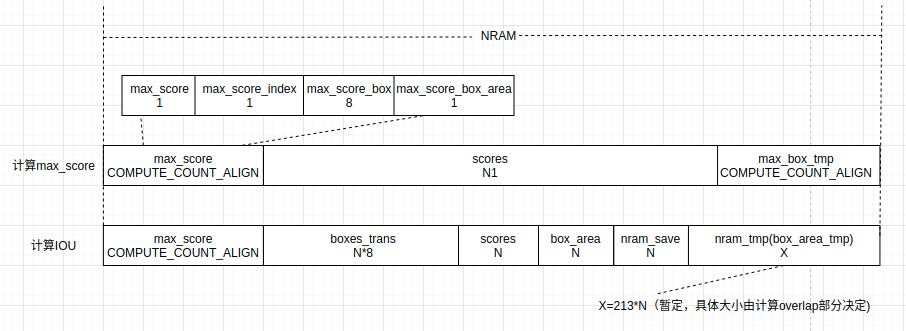

# poly_nms 算子开发设计方案


* #### 文档基本信息

| 项目名称    | Training Solution |
| ----------- | ----------------- |
| 算子名称    | poly_nms     |
| JIRA编号    | [CNNLCORE-6878]   |
| 编制人/日期 |  谷中豪/2022-05-31 |
| 审批人/日期	|  张欣杨/2022-06-15|
| 审批人/日期	|  周晨阳/2022-06-15|
| 审批人/日期	|  王远/2022-06-15 |

* #### 修改记录

| 版本号| 修订人 | 修订日期 | 修订描述 |
| ----- | ------ | -------  | -------  |
| V1.0  | 谷中豪   | 2022-05-31 | 首次提交 |
* #### 内容描述

本文档为`poly_nms`算子的设计文档，包括需求分析、接口设计、方案设计、性能优化记录和方案实施部分。

* #### 算子需求checklist

算子需求提出者需要`提供`的信息如下：

- 框架负责人
- 算子接口描述
- 功能描述
- 框架版本 + 对应源码路径
- 需求对应网络
- 网络中用到的规模
- 常用规模下的竞品性能（可选）
- 是否需要支持原位
- 是否需要支持stride机制
- 框架单元测试阈值指标（可选）
- 其他特殊需求（在线量化/融合/转数提前等，可选）
- 确认算子需求是否已经过框架层review（滤除mluOp已支持的算子）

算子需求提出者需要`check`的部分如下：

- 1.1 算子需求分析
- 1.2 算子功能和应用场景描述
- 1.3 算子输入输出参数要求
- 1.4 算子限制
- 1.5 验收标准
- 2.2 接口设计
- 3.5 测试用例（需求提出者check算子需求表中所给规模是否列出）

## 1 需求分析

### 1.1 算子需求分析
| 算子功能简介| 多边形的非极大值抑制，用于删除高度冗余的多边形输入框 |
|-------------|--------------------------------------------------------------|
| 需求来源    | PyTorch                                      |
| 应用网络    | FasterRCNN，trans obb                                          |
| 输入数据类型| float                                                  |
| 输入Shape   | boxes:dim[N, 9], iou_threshold:float |
| 输入Layout  | boxes:ARRAY, iou_threshold:标量                              |
| 输出数据类型 | int32_t                                         |
| 输出Shape   | output:dim[N]，输出实际长度为result_num; result_num:dim=1      |
| 输出Layout  | output:ARRAY，result_num::ARRAY                                     |
| 模式(可选） | 否 |
| 是否含有dim/axis等类似语义的参数且该参数支持负数/其他特殊处理 | 否 |
| 是否含有labels/index等类似语义的参数且该参数支持负数/界外情况/其他特殊处理 | 否 |
| 是否需要支持原位        | 否                                                  |
| 是否需要支持stride机制  | 否                                                 |
| 是否需要支持广播  | 否                       |
| 0元素检查是否直接返回  | 是 (返回MLUOP_STATUS_SUCCESS)                                              |
| 其他特殊需求(在线量化，融合，转数提前等，可选)|        无                                                |
| 本次开发优先支持的规模/模式|   |


### 1.2 算子功能和应用场景描述

**算子功能：** `poly_nms`(polygon nms)算子用于计算多边形非极大值抑制，删除高度冗余的多边形框。

**应用场景：** `poly_nms`算子应用于`FasterRCNN`，`trans obb`网络。

**AerialDetection 示例：**

```py
def pnms_test():
    nms_thresh=0.1
    dets = np.asarray(np.random.randn(70，9)， dtype=np.float32)
    boxes_gpu=torch.from_numpy(dets).cuda()
    keep = poly_nms(boxes_gpu， nms_thresh)
    print("output:")
    print(keep[1])

output:
# 输出为[0]
dets = [[0， 0， 1， 0， 1， 1， 0， 1， 3]]

# box2 和 box0，box1 没有交集，box1 和 box0 有交集，且iou>0.1，输出结果为[1，2]
dets = [[0， 0， 1， 0， 1， 1， 0， 1， 1]， [0.5， 0.5， 1.5， 0.5， 1.5， 1.5， 0.5， 1.5， 2]，[0， 0， -0.5， 0， -0.5， -0.5， 0， -0.5， 3]]

# box0 和 box1，box2 均有交集，且iou>0.1，输出为[0]
dets =  [[0， 0， 1， 0， 1， 1， 0， 1， 3]， [0.5， 0.5， 1.5， 0.5， 1.5， 1.5， 0.5， 1.5， 2]，[0， 0， 0.5， 0， 0.5， 0.5， 0， 0.5， 1]]

# box0 和 box1 有交集，且iou=0.1428 > nms_thresh(0.1)，box0，box1 都和 box2 没交集，输出为[0，2]
dets = [[0， 0， 1， 0， 1， 1， 0， 1， 3]， [0.5， 0.5， 1.5， 0.5， 1.5， 1.5， 0.5， 1.5， 2]，[0， 0， -0.5， 0， -0.5， -0.5， 0， -0.5， 1]]

# 以下为nan，inf，-inf行为
# 输入scores包含inf: box0 和 box1 相交， box2 和 box0，box1 不相交，输出[0，2]
dets = [[0， 0， 2， 0， 2， 2， 0， 2， np.inf]， [1.5， 1.5， 2.5， 1.5， 2.5， 2.5， 1.5， 2.5， 1]，[0， 0， -0.5， 0， -0.5， -0.5， 0， -0.5， 3]]

# 输入scores包含-inf: box0 和 box1 相交， box2 和 box0，box1 不相交，输出[1，2]
dets = [[0， 0， 2， 0， 2， 2， 0， 2， -np.inf]， [1.5， 1.5， 2.5， 1.5， 2.5， 2.5， 1.5， 2.5， 1]，[0， 0， -0.5， 0， -0.5， -0.5， 0， -0.5， 3]]

# 输入scores有nan，box0 和box1 相交且iou > iout_thresh，输出较大score的box，最终输出[0,2]
dets = [[0, 0, 2, 0, 2, 2, 0, 2, np.nan], [1.5, 1.5, 2.5, 1.5, 2.5, 2.5, 1.5, 2.5, 1],[0, 0, -0.5, 0, -0.5, -0.5, 0, -0.5, 3]]

# 输入box1坐标包含inf，认为该box和其他boxes不相交， box1， box2 也不相交， 输出[0,1,2] 
dets = [[np.inf, 0, 2, 0, 2, 2, np.inf, 2, 2], [1.5, 1.5, 2.5, 1.5, 2.5, 2.5, 1.5, 2.5, 1],[0, 0, -0.5, 0, -0.5, -0.5, 0, -0.5, 3]]

# 输入boxes坐标包含inf，认为该box和其他boxes不相交, 输出[0,1,2] 
dets = [[0, 0, np.inf, np.inf, 2, 2, 0, 2, 2], [1.5, 1.5, np.inf, np.inf, 2.5, 2.5, 1.5, 2.5, 1],[0, 0, -0.5, 0, -0.5, -0.5, 0, -0.5, 3]]

# 输入box1坐标包含nan，认为和其他boxes不相交， box1 和 box2 之间也不相交，输出[0,1,2] 
dets = [[0, 0, 2, 0, 2, 2, 0, np.nan, 2], [1.5, 1.5, 2.5, 1.5, 2.5, 2.5, 1.5, 2.5, 1],[0, 0, -0.5, 0, -0.5, -0.5, 0, -0.5, 3]]
```

### 1.3 算子输入输出参数要求

| 参数             | 语义                           | 类型（输入/输出） | 支持类型               | 物理布局 | 规模限制 |
| ---------------- | ------------------------------ | ----------------- | ---------------------- | -------- | -------- |
| **handle**           |        操作句柄                        | 输入              |    mluOpHandle_t   | /        | 无       |
| **boxes_desc**      |    输入boxes的形状描述             | 输入              |           /             | /        | 无       |
| **boxes**         |    计算所需的输入框        | 输入              | float             | ARRAY    | dim=2， shape[1] =9 |
| **iou_threshold**   |   计算所需的阈值             | 输入              |    float                   | /       | 标量       |
| **workspace**        |   指向额外GDRAM空间的指针          | 输入             |  void *                  | /          | 无       |
| **workspace_size**   |   输入参数，workspace的空间大小   | 输入             |  size_t                  | /          | 无       |
| **output_desc**      |  输出数据output的形状描述       | 输出       |   /     | /          | 无       |
| **output**          |  指向output数据的mlu地址的指针    | 输出       |  int32_t      | ARRAY     |dim=1，shape[0]==boxes.shape[0]       |
| **result_num**      |  指向result_num数据的mlu地址的指针,表示output实际输出index的个数    | 输出       |  int32_t      | ARRAY     |dim=1，shape[0]=1 |


### 1.4 算子限制

| 限制类型     | 详细说明                                                     |
| ------------ | ------------------------------------------------------------ |
| 输入限制     |  输入input1必须满足dim=2，shape[1]=9；输入input1必须满足格式:[[x1， y1， x2， y2， x3， y3， x4， y4， score]，..]  |
| 数据类型限制 | 只支持float输入  |
| 数据范围限制 | 无 |
|  原位限制     | 不支持原位                                                 |
| stride限制   | 不支持stride                                      |
| 广播限制     | 不支持广播                                                   |


### 1.5 验收标准


#### 1.5.1 精度验收标准
该算子为算术类算子，采用当前的 diff3 评价公式，验收标准为：
- 静态阈值 diff3 == 0

#### 1.5.2 性能验收标准

- 网络中使用到的规模性能优于或至少与竞品性能持平。
- 部分与竞品差距过大的规模在4.算子性能优化记录中进行说明。
- 附上算子测试报告链接，测试报告必须包括框架给出的网络中规模的性能数据以及对应效率值。


**竞品性能测试**

在Tesla V100-SXM2-16GB平台上测试poly_nms算子性能；
需求未提供的网络中算子规模， 借鉴nms算子规模([70，9]，[119，9])，并补充规模（[500，9] [1000，9] [2000，9]）进行性能分析，循环调用算子100次取得平均性能结果如下：

测试规模[70，9]，[119，9] [500，9] [1000，9] [2000，9]，iou_thresh=0.2

测试环境： Tesla V100-SXM2-16GB +  PyTorch 1.6.0

| 平台                 | 框架版本      | 数据类型 | 规模     | 计算效率  | IO效率    | Hardware time(us) |
| -------------------- | ------------- | -------- | --------  | --------- | --------- | ----------------- |
| Tesla V100-SXM2-16GB | Pytorch 1.6.0 | float    | [70， 9]   | 0.118567% | 0.157380% | 9.348685          |
|                      |               | float    | [119， 9]  | 0.288131% | 0.493981% | 9.319030     |
|                      |               | float    | [500， 9]  | 5.471360% | 10.057026% | 9.324388            |
|                      |               | float    | [1000， 9] | 20.074295% |36.867370% | 10.359996           |
|                      |               | float    | [2000， 9] | 20.078246%    | 43.877368% |  41.368463          |

## 2 算子接口设计

### 2.1 参考接口

- **AerialDetection** https://github.com/dingjiansw101/AerialDetection/blob/master/mmdet/ops/poly_nms/src/poly_nms_cuda.cpp
```c++
at::Tensor poly_nms_cuda(const at::Tensor boxes， float nms_overlap_thresh);
```

### 2.2 接口设计

#### 2.2.1 poly_nms获取额外申请空间大小

```c++
mluOpStatus_t MLUOP_WIN_API
mluOpGetPolyNmsWorkspaceSize(mluOpHandle_t handle,
                            const mluOpTensorDescriptor_t boxes_desc,
                            size_t *size);
```

**参数描述：**

- `handle`：输入参数。操作句柄，内部绑定device和对应的queue。
- `size`：输入参数。需要用户申请的额外的空间大小，通过`mluOpGetPnmsWorkspaceSize`获取。
- `mluOpTensorDescriptor_t`: 输入tensor的形状描述。

#### 2.2.2 poly_nms计算接口

```c++
mluOpStatus_t MLUOP_WIN_API mluOpPolyNms(mluOpHandle_t handle,
                                        const mluOpTensorDescriptor_t boxes_desc,
                                        const void *boxes,
                                        float iou_threshold,
                                        void *workspace,
                                        size_t workspace_size,
                                        const mluOpTensorDescriptor_t output_desc,
                                        void *output,
                                        void *result_num);
```

## 3 实现方案设计

### 3.1 实现方案

`poly_nms`(polygon nms)算子用于计算多边形非极大值抑制， 删除冗余的多边形框。

poly_nms算子有两个输入，input1是2维Tensor，包含四边形的四个顶点坐标及其对应的score，具体信息为：
[[x1， y1， x2， y2， x3， y3， x4， y4， score]，...];
input2 是float数，是给定的iou的阈值iou_thresh。

- **poly_nms算子CPU实现**
1. 将scores降序排序；
2. 用score最大的box分别和其余的box做iou计算， 如果iou大于iou_thresh，认为这两个box相交，删除score值小的box；
3. 再选取次大的score，重复第二步计算；
4. 输出剩于box的index(升序输出)。

- **MLU实现步骤**
1. 借助workspace将输入input_boxes由Nx9转置为9xN(提前将所有数据转置，是因为在第二步计算max_score时，需要重复load所有数据计算scores最大值，计算过程中每次repeat时load的数据量较小，需要重复多次load并进行转置计算，对性能有损耗，故需提前转置。)；


1. 计算max_score: __bang_max()方法从scores中获取score最大值及对应的max_score_index；
   注意:获取scores中最大socre，该步骤需要load所有input_boxes数据， 获取所有数据中的最大值，不是本次循环计算中加载数据的最大值;对于U1任务，需要计算每个core上最大值， 然后把每个core上最大值加载到sram上计算global_max_score， 再把global_max_score copy到每个core中；

2. 保存max_score_index到nram_save中，保存数量大于nram_save空间时， 将nram_save数据copy到device端后重新保存；
   
3. 计算不规则四边形iou：计算max_score对应的max_score_box和其他的boxes的iou，如果iou > iou_thresh， 则认为该box和max_score_box交集过大，把交集过大的box对应的score置为FLT_MIN；
   
4. 第3步计算完后，在剩余scores中重新计算max_score，如果max_score <= FLT_MIN，则计算完成，否则重复第二步；
   
5. copy所有的max_score_index到output，对output做升序排序；
   
6. 根据output中max_score_index数量来修改output_desc中dimSize的大小；
 
- **nram 空间划分**
  
  
  nram_space暂划分为（COMPUTE_COUNT_ALIGN + 213*N）份，具体划分块数由计算overlap部分决定

- **实现流程图**

  

- **计算过程示意**

  


- **计算不规则四边形IOU**
1. 计算overlap：参考竞品计算两个四边形overlap的计算方法：https://github.com/dingjiansw101/AerialDetection/blob/master/mmdet/ops/poly_nms/src/poly_nms_kernel.cu#L144；
2. 计算四边形面积box1_area1，box2_area：不规则四边形面积计算使用叉乘方法计算；
3. iou = overlap / (box1_area + box2_area - overlap)。

- **不规则四边形面积计算**
  
  已知四边形四个顶点坐标(x1，y1)， (x2，y2)， (x3，y3)， (x4，y4)
```c++
// 向量计算
box_area = 1/2 * ((x1*y2 - y1*x2) + (x2*y3-y2*x3) + (x3*y4 - y3*x4) + (x4*y1 - y4*x1))

// 标量计算
p[4] = p[0];
for(int i = 0;i<4;i++)
{
  ret += p[i].x * p[i+1].y - p[i].y * p[i+1].x；
}
box_area = ret/2;
```


### 3.2 伪代码实现

```c++
...
// 1. 借助workspace完成input_boxes转置
_mlu_func_ void boxesTranspose(const void *input_boxes，
                                   const int input_num_boxes，
                                   const int input_stride，
                                   void *output，
                                   const mluOpsDataType_t data_type_input) {
  ...
    __memcpy((char*)boxes， (char*)input_boxes + (input_offset + loop * actual_box_num) * 4， actual_box_num * 4，
             GDRAM2NRAM);
    __bang_transpose((float*)trans_boxes， (float*)boxes， input_num_boxes， input_stride);
    __memcpy((char*)output + (input_offset + loop * actual_box_num) * 4， (char*)trans_boxes， actual_box_num * 4，
             NRAM2GDRAM);
  ...
}
// 2. 主要实现过程 block or U1
template <typename IN_DT， typename OUT_DT>
__mlu_func__ void pnms_detection(uint32_t &output_box_num，
                                 OUT_DT *output_data，
                                 const Addr dst，
                                 IN_DT *input_data_ptr，
                                 const Addr src，
                                 IN_DT *buffer，/*nram_buffer*/
                                 const int buffer_size，
                                 IN_DT *workspace，
                                 const int taskDim，
                                 const int input_box_num，
                                 const int input_stride，
                                 const float iou_thresh) {
  int input_data_len = input_box_num * input_stride;
  int input_core_len = 0;
  int input_offset = 0;
  if (taskDim == 1) {
    input_core_len = input_data_len;
    input_offset = 0;
  } else {
    int avg_core = input_data_len / taskDim;
    int rem = input_data_len % taskDim;
    input_core_len = avg_core + (taskId < rem ? 1 : 0);
    input_offset = avg_core * taskId + (taskId <= rem ? taskId : rem);
  }

  int limit = (buffer_size - COMPUTE_COUNT_ALIGN * sizeof(IN_DT)) / 224 / sizeof(IN_DT);
  int max_seg_num = FLOOR_ALIGN(limit， COMPUTE_COUNT_ALIGN);
  int max_seg_pad = max_seg_num * sizeof(IN_DT);

  int repeat = input_core_len / max_seg_num;
  int remain = input_core_len % max_seg_num;
  int remain_pad = CEIL_ALIGN(remain， COMPUTE_COUNT_ALIGN);

  IN_DT *input_box_ptr;
  IN_DT *input_score_ptr;

  input_box_ptr = input_data_ptr;
  input_score_ptr = input_box_ptr + 8 * input_strides;

  // init nram ptr
  IN_DT *boxes;
  IN_DT *scores;
  IN_DT *max_box;
  IN_DT *max_box_tmp;
  OUT_DT *nram_save;
  IN_DT *nram_tmp;
  IN_DT *box_area_tmp;
  IN_DT *intersection_area;

  boxes = nram_buffer;
  scores = nram_buffer + 8 * max_seg_pad;
  max_box = scores + max_seg_pad;       // (max_score，max_box，max_index，max_area) 11 个数
  max_box_tmp = max_box + NFU_ALIGN_SIZE;  // 2个数， 存放__bang_max结果 [max_score， max_index]
  box_area = max_box_tmp + NFU_ALIGN_SIZE;
  intersection_area = box_area + max_seg_pad;
  nram_save = (OUT_DT)((char *)intersection_area + max_seg_pad);
  nram_tmp = (IN_DT)((char *)nram_save + max_seg_pad);
  box_area_tmp = nram_tmp;

  int nram_save_count = 0;
  int nram_save_limit_count = 0;
  nram_save_limit_count = max_seg_pad / sizeof(IN_DT);

  for (int i = 0; i < repeat; i++) {
    int actual_box_num;
    if (rem != 0) {
      actual_box_num = (i == repeat - 1) ? rem : max_seg_num;
    } else {
      actual_box_num = max_seg_num;
    }

    // 1 get_max_score_index(); output: max_box (max_score，max_box，max_index，max_area) 11 个数
    // 获取scores中最大socre，该步骤需要load所有input_boxes数据， 获取所有数据中的最大值，不是本次循环计算中加载数据的最大值
    // 对于U1任务，需要计算每个core上最大值， 然后把每个core上最大值加载到sram上计算global_max_score， 再把global_max_score copy到每个core中
    get_max_score_index(input_box_ptr， input_score_ptr， boxes， scores， max_box， max_box_tmp，
                        box_point_num， input_offset， actual_box_num， repeat， remain， taskDim，
                        load_dir， store_dir);

    // 获取到max_score后，将其对应的index 保存到nram_save中
    // 如果nram_save中保存的数据量超过分配空间大小，则将nram_save 先copy到output_ptr
    OUT_DT *save_ptr;
    int save_offset = 0;
    int save_ptr_num = 0;
    save_ptr = nram_save;
    save_offset = nram_save_count;
    save_ptr_num = nram_save_limit_count;

    if (coreId == 0) {
      __memcpy(save_ptr + save_offset， (uint32_t *)(max_box + 9)， 1 * sizeof(uint32_t)， NRAM2NRAM，
               1 * sizeof(uint32_t)， 1 * sizeof(uint32_t)， 0);
      nram_save_count++;
      output_box_num++;
      __memcpy(output_data， nram_save， nram_save_count * sizeof(uint32_t)， store_dir);
      // nram_save空间存放index过多   store to sram/gdram
      if (nram_save_count == nram_save_limit_count) {
        pvLock();
        __memcpy(output_data， nram_save， nram_save_count * sizeof(uint32_t)， store_dir);
        pvUnlock();
        output_data += nram_save_count;
        nram_save_count = 0;
      }  //  store selected index  NRAM->GDRAM
    }    // if coreId == 0

    // 结束条件: if the max_score <= FLT_MIN， end
    if (core_limit == 1) {
      if (float(max_box[0]) <= FLT_MIN) {
        break;
      }
    } else {
      if (float(max_box[0]) <= FLT_MIN) {
        if (coreId == 0) {
          loop_end_flag[0] = 1;
        }
      }
      __sync_cluster();
      if (loop_end_flag[0] == 1) {
        break;
      }
    }

    // 2 cal_poly_areas(); output: box_area
    cal_poly_areas<IN_DT， IN_DT>(boxes， boxes + actual_box_num * sizeof(IN_DT)， boxes + 2 * actual_box_num * sizeof(IN_DT)，
                                 boxes + 3 * actual_box_num * sizeof(IN_DT)， boxes + 4 * actual_box_num， * sizeof(IN_DT)
                                 boxes + 5 * actual_box_num * sizeof(IN_DT)， boxes + 6 * actual_box_num * sizeof(IN_DT)，
                                 boxes + 7 * actual_box_num * sizeof(IN_DT)， box_area， box_area_tmp， input_stride);

    // 3 cal_intersection_area(); 所需空间从nram_tmp中分配
    cal_intersection_area(input_box_ptr， input_score_ptr， boxes， max_box， intersetion_area，
                          nram_tmp， box_point_num， input_offset， actual_box_num， repeat， remain，
                          taskDim， load_dir， store_dir);

    // 4 compare iou with iou_thresh(); iou>iou_thresh， 将其对应的score置FLT_MIN；
    // area_U = box_area + max_area - area_I
    __bang_add_const((float *)box_area， (float *)box_area， (float)max_box[10]， actual_box_num);
    __bang_sub((float *)box_area， (float *)box_area， (float *)intersetion_area， actual_box_num);
    // area_U = area_U * iou_thresh
    __bang_mul_const((float *)box_area， (float *)box_area， (float)iou_thresh， actual_box_num);
    // masked = intersetion_area = area_I <= area_U
    __bang_le((float *)intersetion_area， (float *)intersetion_area， (float *)box_area，
              actual_box_num);
    // scores = scores * intersetion_area;
    __bang_mul((float *)scores， (float *)scores， (float*)intersetion_area， actual_box_num);

   // compare scores with 0 ->intersetion_area
    __bang_eq_scalar((float *)intersetion_area， (float *)scores， (float )0.0，
              actual_box_num);
    // intersetion_area = intersetion_area(masked) * FLT_MIN
    __bang_mul_const((float *)intersetion_area， (float *)intersetion_area， (float )FLT_MIN，
      actual_box_num);
      // scores = scores + intersetion_area
    __bang_add((float *)scores， (float *)scores， (float *)intersetion_area，
      actual_box_num);

    __memcpy((float *)input_score_ptr + offset， (float *)scores， actual_box_num， NRAM2GDRAM);
  }
}
```

### 3.3 拆分(任务拆分，多核拆分)

**拆分策略**

根据输入boxes数据量分Block和U1的任务类型，对于不同的任务类型划分，计算max_score方法有所不同。
1. 对于Block任务，根据NRAM空间计算max_seg_pad，由此计算全部数据的repeat和remain；计算max_score时需要注意max_score是所有input_scores的最大值，不是每次repeat计算量中的最大值；
2. 对于U1任务，需要计算每个core上的max_score，将每个core上的max_score copy到sram计算global_max_score，再将global_max_score copy到每个core上进行计算。

### 3.4 性能优化设计

1. 流水设计

   nram所需分配空间太大，暂不划分乒乓空间，不做流水。

### 3.5 方案理论性能

由于计算overlap算法复杂，计算过程无法全部向量化，存在部分标量循环实现，所以性能暂无估计，其他部分已做了向量化的优化。实际由于标量计算占比时间很大，会有额外的寄存器换入换出操作，以及额外的间接寻址时间，造成理论预估时间不准确。 

### 3.6 可维护性设计

1、bangc代码中加入必要的 log信息，比如输入的规模、数据类型、layout，任务类型，以及如果出错会导致程序core dump的变量，比如IO指令的data_size、dim xyz的值等，这些信息都是有利于快速定位问题；

2、对每一个函数命名变量命名都有充分的注释；

3、避免魔鬼数字，对于确定的数字尽量使用公共宏来替代。

### 3.7 测试用例设计

- 测试规模：boxes：(1-500), iou_thresh：[0.0, 1.0]；

### 3.8 算子防呆检查
 1. 指针为空防呆；
 2. 0元素检查防呆，VLOG(5)打印信息；
 3. input，output的数据类型须保持一致，且符合算子类型支持限制；
 4. 对shape进行防呆，需要保证输入boxes满足要求。

## 4 算子性能/精度问题 & 优化记录

### 4.1 当前存在问题的规模说明

无

### 4.2 已经过优化的规模说明


## 5 方案实施

### 5.1 开发测试计划

- **总体计划**：2022.5.31-2022.07.8  poly_nms算子开发 共6周
- **开发计划**：2022.5.31~2022. 6.10  需求分析以及设计文档撰写 10天
- 2022.6.13~2022.6.15 generator、gtest开发  3天 
- 2022.6.16~2022.6.29 主体代码实现  10天
- 2022.6.30~2022.7.5 测试，输出测试报告  3天
- 2022.7.6~2022.7.8 提交MR+代码review、算子入库  4天

### 5.2 风险分析
- 性能风险：poly_nms算子中计算overlap部分算法复杂，无法全部使用向量化计算，有部分操作不得不使用标量代替，比如输出数据的排序，200系列上的除法运算以及其他算法本身的计算限制，所以性能会有影响。
- 规模限制：输入boxes个数，270系列限制在(1-500)，290系列限制在(1-1000) ,300系列限制在(0-2000)，超出规模会有计算超时风险。
- 本次提交不支持输入包含nan和inf的case。