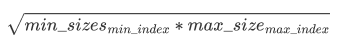
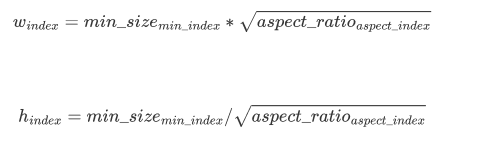
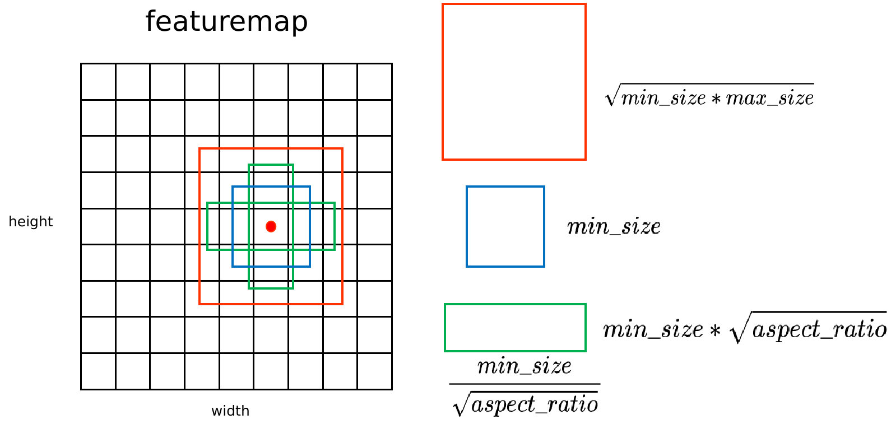
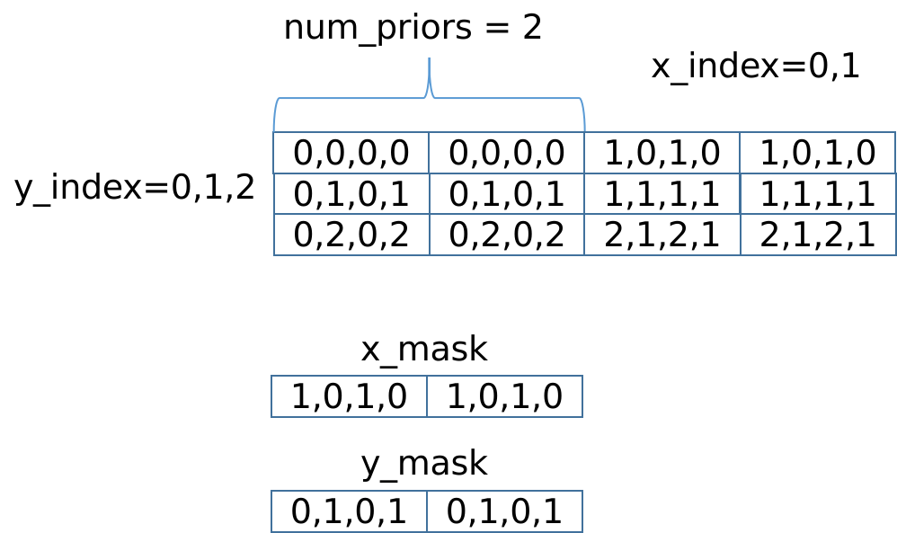
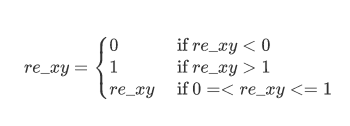

# prior_box 算子开发设计方案

- #### 文档基本信息

  | 项目名称    | Training Solution |
  | ----------- | ----------------- |
  | 算子名称    | prior_box         |
  | JIRA 编号   | CNNLCORE-7837     |
  | 编制人/日期 | 马向军/2022-08-10 |
  | 审批人/日期 |                   |
  | 审批人/日期 |                   |

- #### 修改记录

  | 版本号 | 修订人 | 修订日期   | 修订描述 |
  | ------ | ------ | ---------- | -------- |
  | V1.0   | 马向军 | 2022-08-10 | 首次提交 |

- #### 内容描述

本文档为 `prior_box` 算子的设计文档，包括需求分析、接口设计、方案设计、性能优化记录和方案实施部分。

- #### 算子需求 checklist

算子需求提出者需要 `提供` 的信息如下：

- 算子接口描述
* 功能描述
* 框架版本 + 对应源码路径
* 需求对应网络
* 网络中用到的规模
* 是否需要支持原位
* 是否需要支持 stride 机制
* 框架单元测试阈值指标（可选）

## 1 需求分析

### 1.1 算子需求分析

| 算子功能简介                                                 | 在输入的 feature_map 上每个点生成 num_priors 个候选框        |
| ------------------------------------------------------------ | ------------------------------------------------------------ |
| 需求来源                                                     | Tensorflow                                                   |
| 输入数据类型                                                 | min_sizes: float32<br />max_sizes: float32<br />aspect_ratios: float32<br />variance: float32 |
| 输入Shape                                                    | min_sizes: [min_sizes_num]<br />max_sizes: [max_sizes_num]<br />aspect_ratios: [aspect_ratios_num]<br />variance: [4] |
| 输入标量参数                                                 | height: int<br />width: int<br />im_height: int<br />im_width: int<br />step_width: float32<br />step_height: float32<br />offset: float32<br />is_clip: bool<br />min_max_aspect_ratios_order |
| 输入Layout                                                   | min_sizes: ARRAY<br />max_sizes: ARRAY<br />aspect_ratios: ARRAY<br />variance: ARRAY |
| 输出数据类型                                                 | output: float32<br />var: float32                            |
| 输出Shape                                                    | output: [height,width,num_priors,4]<br />var: [height,width,num_priors,4] |
| 输出Layout                                                   | output: ARRAY<br />var: ARRAY                                |
| 模式（可选）                                                 | 无                                                           |
| 是否含有dim/axis等类似语义的参数且该参数支持负数/其它特殊处理 | 无                                                           |
| 是否含有labels/index等类似语义的参数且该参数支持负数/界外情况/其它特殊处理 | 无                                                           |
| 是否需要支持原位                                             | 否                                                           |
| 是否需要支持stride机制                                       | 否                                                           |
| 是否需要支持广播                                             | 否                                                           |
| 是否支持0元素                                                | min_sizes/aspect_ratios/variance 0元素直接返回 MLUOP_BAD_PARAM <br>output/var/  0元素返回 MLUOP_STATUS_SUCCESS<br>max_sizes 0元素正常计算 |
| 其他特殊需求                                                 |                                                              |

### 1.2 算子功能和应用场景描述

**算子功能**： 

`prior_box`为`SSD`(Single Shot MultiBox  Detector)算法生成候选框。具体的在输入`input`的每个位置产生`num_priors`个候选框。候选框的坐标为（x1,y1,x2,y2）,代表候选框的左上和右下的点的坐标。总共生成 boxes_num = height * width * num_priors 个候选框，其中：

- 一个点生成的`num_priors`个候选框的中心都一样，默认为每个网格的中心，`offset`为候选框的中心位移

  eg：（0,0）处的候选框中心点为（0+offset，0+offset）

- 每个点生成的第j（0<j<=num_priors）个候选框之间对应的宽，高都一样（对超出边界的候选框不裁剪的前提下）

  eg：第一个点生成的第1个候选框和第二个点生成的第1个候选框的宽高相等

  

生成候选框算法的伪代码为：

```python
pixel_pos = GetPixelPos(width,height,1,4)  # shape of (W,H,1,4)  获取每个框的初始位置
box_offset = GetBoxOffset(1,1,num_priors,4)  # shape of (1,1,num_priors,4) 获取每个框的坐标点的偏移
lower_bound = [0]  # shape of (1,1,1,1)  //todo
upper_bound = [W,H,W,H]  # shape of (1,1,1,4) //todo
output = pixel_pos + box_offset  # shape of (W,H,num_priors,4)
output = max(lower_bound,output)
output = min(upper_bound,output)
```


生成候选框的坐标的过程如下：

`num_priors`由`min_sizes`、`max_sizes`和`aspect_ratios`的数目决定，候选框的宽高尺寸在（min_size,max_size）之间，该尺寸根据`aspect_ratios`在序列中生成。

`input`的宽、高，分别记作`width`、`height`； 

`image`的宽、高，分别记作`im_width`、`im_height`；

候选框的最小尺寸：记作`min_sizes`；

候选框的最大尺寸：记作`max_sizes`；

候选框的长宽比：记作`aspect_ratios`；

`step_h`为候选框在`im_height`上的步长；

`step_w`为候选框在`im_width`上的步长；

其中：

- 一个`min_sizes`生成一个正方形的候选框，总共生成 `min_num`个正方形（`min_num`为`min_sizes`的长度），边长为`min_sizes[min_index]` ，其中 0=< min_index <min_num，为`min_sizes`的索引

- 一个`max_sizes`生成一个正方形的候选框，总共生成`max_num`个正方形（`max_num`为`max_sizes`的长度）

  对应的边长计算公式为：

  ​                                                                                                               

  其中`max_index`和`min_index`相等，且 0 =< min_index < min_num；

- 一个`aspect_ratios`生成1个候选框，总共生成 `aspect_num` * `min_num` 个候选框（`aspect_num`为`aspect_ratios`的长度）

  对应的候选框的边长计算公式为：

  

  其中 0=<aspect_index<aspect_num，0 < index <= aspect_num * min_num，`aspect_index`为`aspect_ratios`的索引，`index`为候选框的索引。

如图所示：



设以上计算得到的一个候选框的宽高分别为width、height

- 候选框中心点坐标映射到原图，x、y为候选框在`input`（feature_map）上网格点的位置，cx、cy为候选框在image上网格中心点的位置

  ```c++
  cx = (x+offset)*step_w  
  cy = (y+offset)*step_h 
  
- 计算候选框的坐标(x1,y1,x2,y2)，则：

  ```c++
  x1 = cx - width/2
  y1 = cy - height/2
  x2 = cx + width/2
  y2 = cx + height/2   
  ```

- 候选框坐标归一化，即候选框的坐标（x1,y1,x2,y2）,归一化到[0,1]之间，具体为

  ```c++
  x1 = x1/im_width
  y1 = y1/im_height
  x2 = x2/im_width
  y2 = y2/im_height
  ```

- 如果`is_clip`为True，按照下面方式对归一化后的候选框进行裁剪处理，反之不裁剪越界的框

  ```python
  max(x1,0)，max(y1,0)，max(x2,0)，max(y2,0)
  min(x1,1)，min(y1,1)，min(x2,1)，min(y2,1) 
  ```

- 若`min_max_aspect_ratios_order`为True，候选框的顺序需要按照[min_sizes,max_sizes,aspect_ratios]的顺序生成，否则按照[min_sizes,aspect_ratios,max_sizes]的方式生成


生成候选框的方差的过程如下：

​	读取`variance`中候选框解码的方差值，一组方差为4个值，根据最终的候选框的数量`boxes_num`，将`variance`拷贝`boxes_num`次，生成  		[height,width,num_priors,4]形状的Tensor。


输出有两个：

第一个记作`output`，形状为[height,width,num_priors,4]的Tensor，意思是为`input`每个像素生成`num_priors`个候选框，候选框坐标为（x1,y1,x2,y2）。代表候选框的左上和右下的点的坐标；

第二个记作`var`，形状为[height,width,num_priors,4]的Tensor，意思是为所有候选框设置1个解码方差。解码方差的值为`variance`。

- example：

```python
import paddle.fluid as fluid
import numpy as np
import paddle
paddle.enable_static()
shape_ = [1,3,4,4]
box, var = fluid.layers.prior_box(
         input=input,
         image=image,
         min_sizes=[2.],
         aspect_ratios=[1.0],
         is_clip=True,
         flip=True)        
place = fluid.CUDAPlace()
exe = fluid.Executor(place)
exe.run(fluid.default_startup_program())
input_data = np.random.rand(1,3,4,4).astype("float32")
image_data = np.random.rand(1,3,4,4).astype("float32")
box_out, var_out = exe.run(fluid.default_main_program(),
        feed={"input":input_data,"image":image_data},
        fetch_list=[box,var],
        return_numpy=True)
```


**应用场景**：`SSD`

### 1.3 算子输入输出参数要求

| 参数                        | 语义                                                     | 类型（输入/输出） | 支持类型                | 物理布局 | 规模限制 |
| --------------------------- | -------------------------------------------------------- | ----------------- | ----------------------- | -------- | -------- |
| handle                      | MLU-OPS句柄，保存运行的上下文信息                        | 输入              | mluOpHandle_t           | /        | 无       |
| min_sizes_desc              | 输入min_sizes（生成的候选框的最小尺寸）的描述信息        | 输入              | mluOpTensorDescriptor_t | ARRAY    | 见1.4    |
| min_sizes                   | 输入min_sizes的指针                                      | 输入              | void                    | /        | 无       |
| aspect_ratios_desc          | 输入aspect_ratios_desc（生成的候选框的长宽比）的描述信息 | 输入              | mluOpTensorDescriptor_t | ARRAY    | 无       |
| aspect_ratios               | 输入aspect_ratios的指针                                  | 输入              | void                    | /        | 无       |
| variance_desc               | 输入variance的描述符（候选框对应的解码方差）             | 输入              | mluOpTensorDescriptor_t | ARRAY    | 无       |
| variance                    | 输入variance的指针                                       | 输入              | void                    | /        | 无       |
| max_sizes_desc              | 输入max_sizes（生成的候选框的最大尺寸）的描述信息        | 输入              | mluOpTensorDescriptor_t | ARRAY    | 无       |
| max_sizes                   | 输入max_sizes的指针                                      | 输入              | void                    | /        | 无       |
| height                      | 输入input的高度信息                                      | 输入              | int                     | /        | 无       |
| width                       | 输入input的宽度信息                                      | 输入              | int                     | /        | 无       |
| im_height                   | 输入image的高度信息                                      | 输入              | int                     | /        | 无       |
| im_width                    | 输入image的宽度信息                                      | 输入              | int                     | /        | 无       |
| step_w                      | 生成候选框的点在输入图像宽度方向的步长                   | 输入              | float                   | /        | 无       |
| step_h                      | 生成候选框的点在输入图像高度方向的步长                   | 输入              | float                   | /        | 无       |
| offset                      | 候选框的中心点偏移                                       | 输入              | float                   | /        | 无       |
| is_clip                     | 是否对生成的候选框坐标做裁剪                             | 输入              | bool                    | /        | 无       |
| min_max_aspect_ratios_order | 候选框的输出顺序是否需要和caffe保持一致                  | 输入              | bool                    | /        | 无       |
| output_desc                 | 输出output的描述符（生成候选框的坐标）                   | 输入              | mluOpTensorDescriptor_t | ARRAY    | 见1.4    |
| output                      | 输出output的指针                                         | 输出              | void                    | /        | 无       |
| var_desc                    | 输出var的描述符 （每个候选框对应的解码方差）             | 输入              | mluOpTensorDescriptor_t | ARRAY    | 见1.4    |
| var                         | 输出var的指针                                            | 输出              | void                    | /        | 无       |

### 1.4 算子限制

| 限制类型     | 详细说明                                                     |
| ------------ | ------------------------------------------------------------ |
| 数据类型限制 | 输入输出的Tensor只支持 float32 类型                          |
| 布局限制     | 输入输出的Tensor只支持 ARRAY 类型                            |
| 规模限制     | min_sizes、aspect_ratios的维度必须为1维 <br />variance 的 shape[0]  为4且variance的维度必须为1维<br />output 和 var 的维度必须为4维且每个维度都相等<br />output 和 var 的shape[0]等于height，shape[1]等于width<br />min_sizes 至少包含一个元素<br />若max_sizes 非空，max_sizes 的 shape[0] 和 min_sizes 的 shape[0] 需相等<br />output的第三个维度num_priors需满足：num_priors等于min_sizes的shape[0]乘以aspect_ratios的shape[0]再加max_size的shape[0] |
| 数据范围限制 | min_sizes、aspect_ratios、variance 中的元素必须大于0<br />step_h、step_w 必须大于0, height，width必须大于等于0<br />max_sizes 中对应位置的元素必须比 min_sizes 中的元素大，即max_sizes[i] > min_sizes[i] |
| 原位限制     | 不支持原位                                                   |
| stride限制   | 不支持 stride 机制                                           |
| 广播限制     | 不支持广播                                                   |

### 1.5 验收标准

#### 1.5.1 精度验收标准

- 精度验收标准

  该算子属于算术类算子
  
  按照[精度验收标准](../../MLU-OPS-Accuracy-Acceptance-Standard.md)的要求明确本算子的精度标准。
  
  第一个输出output：
  
  - 算子精度验收标准：diff1、diff2；
  
  - 算子精度阈值描述：diff1 <= 3e-3 && diff2 <=3e-3；
  
  第二个输出var：
  
  - 算子精度验收标准：diff3；
  - 算子精度阈值描述：diff3 == 0；

#### 1.5.2 性能验收标准 

- 见 [MLU-OPS 性能验收标准](../../MLU-OPS-Performance-Acceptance-Standard.md)。

Paddle cuda性能测试： 在`Tesla V100-SXM2-16GB`平台上测试`Paddle`框架的`prior_box`算子性能； 算子输入输出规模分别为:

| Input             | Image             | min_sizes | max_sizes | aspect_ratios | variance          | flip | is_clip | step      | offset | min_max_aspect_ratios_order |
| ----------------- | ----------------- | --------- | --------- | ------------- | ----------------- | ---- | ------- | --------- | ------ | --------------------------- |
| [64, 256, 1, 1]   | [64, 3, 300, 300] | [261]     | [315]     | [2]           | [0.1,0.1,0.2,0.2] | 1    | 1       | [300,300] | 0.5    | 1                           |
| [64, 256, 3, 3]   | [64, 3, 300, 300] | [207]     | [261]     | [2]           | [0.1,0.1,0.2,0.2] | 1    | 1       | [100,100] | 0.5    | 1                           |
| [64, 256, 38, 38] | [64, 3, 300, 300] | [21]      | [45]      | [2]           | [0.1,0.1,0.2,0.2] | 1    | 1       | [8,8]     | 0.5    | 1                           |
| [64, 256, 5, 5]   | [64, 3, 300, 300] | [153]     | [207]     | [2,3]         | [0.1,0.1,0.2,0.2] | 1    | 1       | [64,64]   | 0.5    | 1                           |
| [64, 512, 10, 10] | [64, 3, 300, 300] | [99]      | [153]     | [2,3]         | [0.1,0.1,0.2,0.2] | 1    | 1       | [32,32]   | 0.5    | 1                           |
| [64, 512, 19, 19] | [64, 3, 300, 300] | [45]      | [99]      | [2,3]         | [0.1,0.1,0.2,0.2] | 1    | 1       | [16,16]   | 0.5    | 1                           |

性能结果如下：

测试环境： Tesla V100-SXM2-16GB + Paddle（develop分支）

| 平台                 | 框架版本          | 数据类型 | 规模（Input）     | 计算效率  | IO效率    | Hardware time(us) |
| -------------------- | ----------------- | -------- | ----------------- | --------- | --------- | ----------------- |
| Tesla V100-SXM2-16GB | Paddle（develop） | float32  | [64, 256, 1, 1]   | 0.026978% | 0.171919% | 11.776            |
|                      |                   | float32  | [64, 256, 3, 3]   | 0.041092% | 0.192615% | 11.576            |
|                      |                   | float32  | [64, 256, 38, 38] | 3.859605% | 0.008295% | 12.512            |
|                      |                   | float32  | [64, 256, 5, 5]   | 0.085335% | 0.218838% | 10.845            |
|                      |                   | float32  | [64, 512, 10, 10] | 0.282323% | 0.488793% | 12.064            |
|                      |                   | float32  | [64, 512, 19, 19] | 0.976554% | 0.808574% | 11.739            |

## 2. 算子接口设计

### 2.1 参考接口

- `Paddle cuda`接口

```c++
void GenPriorBox(T* out,
                 const T* aspect_ratios,
                 const int height,
                 const int width,
                 const int im_height,
                 const int im_width,
                 const int as_num,
                 const T offset,
                 const T step_width,
                 const T step_height,
                 const T* min_sizes,
                 const T* max_sizes,
                 const int min_num,
                 bool is_clip,
                 bool min_max_aspect_ratios_order) 
```

```c++
void SetVariance(T* out,
                 const T* var,
                 const int vnum,
                 const int num)
```

### 2.2 接口设计

`prior_box` 算子的接口

```c++
mluOpsStatus_t MLUOP_WIN_API 
mluOpPriorBox(mluOpHandle_t handle,
              mluOpTensorDescriptor_t min_sizes_desc,
              const void *min_sizes,
              mluOpTensorDescriptor_t aspect_ratios_desc,
              const void *aspect_ratios,
              mluOpTensorDescriptor_t variance_desc,
              const void *variance,
              mluOpTensorDescriptor_t max_sizes_desc,
              const void *max_sizes,
              int height,
              int width,
              int im_height,
              int im_width,
              float step_w,
              float step_h,
              float offset,
              bool is_clip,
              bool min_max_aspect_ratios_order,
              mluOpTensorDescriptor_t output_desc,
              void *output,
              mluOpTensorDescriptor_t var_desc,
              void *var);
```


## 3 实现方案设计

### 3.1 实现方案

- step1：对`height`进行拆分，均分为`taskDim`份，第 i （i为taskId）个 `task`上拆分得到长度为`per_task_h_num`的`height_seg`。

  计算每个`task`上处理的`height_seg`的起始位置`task_height_seg_begin`和`task_height_seg_end`

  计算每个`task`上需要处理的点的数量`task_pixel_num`

  ```c++
  task_pixel_num = per_task_h_num * width
  ```

  计算每个点生成的`num_priors`个候选框需要占用的`nram`空间大小`one_pixel_size`

  ```C++
  one_pixel_size = num_priors * 4 * sizeof(T)  // T为候选框坐标的数据类型，4为候选框的（x1,y1,x2,y2）四个坐标
  ```

  根据`nram`大小可计算出一次最多处理的点数为`deal_pixel_num`

  ```
  deal_pixel_num = MAX_NRAM_SIZE / one_pixel_size
  ```

  - 若deal_pixel_num = 0，则对`num_priors`进行循环处理
  - 若deal_pixel_num > 0，则对`task_pixel_num`进行循环处理，设一次循环处理的点数为`one_loop_pixel_num`

- step2：计算`num_priors`的坐标位置

  - 将`one_loop_pixel_num`个点生成的所有候选框的坐标初始化，初始化的坐标为`boxes`，为方便计算，将每个点生成的框的左上和右下点的坐标都初始化为该点在`feature_map`上的坐标 

    

    具体为：如图，假设 num_priors = 2

    对`one_loop_pixel_num`循环处理，一次循环只初始化一个点的`num_priors`个框的坐标，设该点在`feature_map`上的索引为`pixel_index`

    - 调用__bang_write_zero()将`boxes`置为0，即 boxes = [0,0,0,0,0,0,0,0]
    - 计算当前处理的点的位置，x_index = pixel_index % width，y_index = pixel_index / width，图中x_index = 0,1，y_index = 0,1,2。
    - 将`x_index`（上图中x的坐标）和`x_mask`相乘，得到`tmp_x`（tmp_x为x_index,x_mask相乘的结果），tmp_x = [x_index,0,x_index,0,x_index,0,x_index,0]

    - 将`tmp_x`和`boxes`相加得到新的`boxes`，即boxes = [x_index,0,x_index,0,x_index,0,x_index,0]
    - 将`y_index`（上图中y的坐标）和y_mask相乘，得到`tmp_y`（tmp_y为y_index,y_mask相乘的结果），tmp_y = [0,y_index,0,y_index,0,y_index,0,y_index]

    - 将`tmp_y`和`boxes`相加得到新的`boxes`，这里`boxes`的shape为[one_loop_pixel_num,num_priors,4]

  - 调用__bang_write_value生成框中心坐标的偏移，记作`offset_nram`，长度为`one_pixel_size`

    ```c++
    __bang_write_value(offset_nram,one_pixel_size,(T)offset)
    ```

  - 根据`step_w`和`step_h，构造步长的向量，设为step_wh_nram`

    ```c++
    __bang_mul_const(tmp,x_mask,step_w,one_pixel_size)  			// (step_w,0,step_w,0)
    __bang_add(step_wh_nram,step_wh_nram,tmp,one_pixel_size)	
    __bang_mul_const(tmp,y_mask,step_h,one_pixel_size)  			// (0,step_h,0,step_h)
    __bang_add(step_wh_nram,step_wh_nram,tmp,one_pixel_size)        // (step_w,step_h,step_w,step_h)
    ```

  - 根据`min_size`，`max_size`，`aspect_ratios`，构造每个框（x1,y1,x2,y2）的位移向量，设为`box_wh_nram`

  - 根据`im_width`和`im_height`，构造归一化向量，设为`recip_wh_nram`

    ```c++
    __bang_mul_const(tmp,x_mask,1/im_width,one_pixel_size)  	 // (1/im_width,0,1/im_width,0)
    __bang_add(recip_wh_nram,recip_wh_nram,tmp,one_pixel_size)	
    __bang_mul_const(tmp,y_mask,1/im_height,one_pixel_size)   // (0,1/im_height,0,1/im_height)
    __bang_add(recip_wh_nram,recip_wh_nram,tmp,one_pixel_size)   //(1/im_width,1/im_height,1/im_width,1/im_height)
    ```

  - 计算相对于原图的坐标，具体为：

    ```c++
    //得到每个框相对于feature_map的中心点
    __bang_cycle_add(boxes,boxes,offset_nram,one_loop_pixel_num * one_pixel_size,one_pixel_size) 
    //得到每个框相对于image的中心点
    __bang_cycle_mul(boxes,boxes,step_wh_nram,one_loop_pixel_num * one_pixel_size,one_pixel_size) 
    //得到每个框相对于image的坐标
    __bang_cycle_add(boxes,boxes,box_wh_nram,one_loop_pixel_num * one_pixel_size,one_pixel_size) 
    //得到相对image归一化后的坐标
    __bang_cycle_mul(boxes,boxes,recip_wh_nram,one_loop_pixel_num * one_pixel_size,one_pixel_size) 
    ```

- step3：如果`is_clip`为 True ，对`boxes`的坐标进行裁剪

  

- step4：将裁剪后的`boxes`的坐标从`nram`拷贝到`gdram`

- step5：重复step2 ~ step4，直到处理完`task_pixel_num`

- step6：设置候选框解码时的方差

  ​	每个候选框都对应相同大小的一组方差`variance`，因此将`variance`拷贝`num_priors`次，则得到一个点上所有候选框的解码方差。

  具体步骤如下：

  1. 计算每个`task`上要生成的`var`的大小，设为`var_count_task`，var_count_task = height_seg * width * num_priors

  2. 根据`nram`大小计算，`nram`上一次最多处理多少个`variance`，设为`var_count_nram`

     ```c++
     var_count_nram = MAX_NRAM_SIZE / sizeof(T) / 4  //T为variance的元素类型，4为variance的元素数量
     ```

  3. 若一次处理不完，则对`var_conut_task`进行循环处理，一次处理的大小设为`one_loop_var_num`

  4. 根据`vaiance`的元素，构造`variance_nram`的向量

    `variance`中只包含4个元素，`variance`的大小设为`VARIANCE_SIZE` = 64;  

    ```c++
    for(int i=0;i<4;i++)
    {
      variance_nram[i] = variance[i]
    }
    ```

  5. 在`nram`生成`one_loop_var_num`大小的解码方差。

    ```c++
    __bang_cycle_add(var_count_nram,var_count_nram,variance_nram,one_loop_var_num * VARIANCE_SIZE,VARIANCE_SIZE)
    ```

  6. 将`var_count_nram`从`nram`拷贝到`gdram`
  
  7. 重复步骤3-6，直到处理完`var_count_task`

### 3.2 伪代码实现（可选）

### 3.3 拆分（任务拆分，多核拆分）

1. 基本任务类型是 `BLOCK`；
2. 对 `height`进行数据拆分，拆分为`height / taskDim`；
3. 不能均匀拆分的情况下，依次分配给前`rem_num`个`core`，其中`rem_num = height % taskDim`；

### 3.4 性能优化设计

1. 资源分配

| 表项              | 分配策略 |
| ----------------- | -------- |
| NRAM              | 见下图   |
| WRAM              | 无       |
| SRAM              | 无       |
| DRAM（workspace） | 无       |

`nram`内存空间划分：  

 

boxes大小为one_pixel_size * one_loop_pixel_num，其它大小都为`one_pixel_size`

   2. 流水设计 

​    无

### 3.5 方案理论性能

### 3.6 可维护性设计

1. `bangc`代码中加入必要的`log`信息，比如输入的规模，数据类型，`layout`这些，以及如果出错会导致程序`core dump`的变量，比如`IO`指令的`data_size`、`dim`的值等，这些信息都是有利于快速定位问题；
2. 对每一个函数命名变量命名都有充分的注释；
3. 避免魔鬼数字；

### 3.7 测试用例设计

| Image             | Input             | min_sizes | max_sizes | aspect_ratios | variance          | flip | clip | step      | offset | min_max_aspect_ratios_order |
| ----------------- | ----------------- | --------- | --------- | ------------- | ----------------- | ---- | ---- | --------- | ------ | --------------------------- |
| [64, 3, 300, 300] | [64, 256, 1, 1]   | [261]     | [315]     | [2]           | [0.1,0.1,0.2,0.2] | 1    | 1    | [300,300] | 0.5    | 1                           |
| [64, 3, 300, 300] | [64, 256, 3, 3]   | [207]     | [261]     | [2]           | [0.1,0.1,0.2,0.2] | 1    | 1    | [100,100] | 0.5    | 1                           |
| [64, 3, 300, 300] | [64, 256, 38, 38] | [21]      | [45]      | [2]           | [0.1,0.1,0.2,0.2] | 1    | 1    | [8,8]     | 0.5    | 1                           |
| [64, 3, 300, 300] | [64, 256, 5, 5]   | [153]     | [207]     | [2,3]         | [0.1,0.1,0.2,0.2] | 1    | 1    | [64,64]   | 0.5    | 1                           |
| [64, 3, 300, 300] | [64, 512, 10, 10] | [99]      | [153]     | [2,3]         | [0.1,0.1,0.2,0.2] | 1    | 1    | [32,32]   | 0.5    | 1                           |
| [64, 3, 300, 300] | [64, 512, 19, 19] | [45]      | [99]      | [2,3]         | [0.1,0.1,0.2,0.2] | 1    | 1    | [16,16]   | 0.5    | 1                           |

### 3.8 算子防呆检查

1. 指针为空防呆； 
2. 对输入输出支持的`dtype`、`layout`以及`shape`进行防呆； 
3. 算子自身相关参数防呆，主要包括卷积参数、输入输出数据及描述符的防呆； 
4. 0元素检查防呆； 

## 4 算子性能优化记录

### 4.1 当前存在问题的规模说明

- 暂无

### 4.2 已经优化过的规模说明

- 暂无

## 5. 方案实施

### 5.1 开发测试计划

- 2022.08.10 调研源码+开始设计方案
- 2022.08.15-08.19 完成设计方案和gtest，generator代码开发
- 2022.08.22-08.26  完成算子host,device端代码开发
- 2022.08.29-09.02  完成算子大规模测试和测试报告
- 2022.09.05-09.06  完成算子review意见修改和入库

### 5.2 风险分析