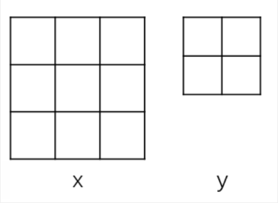
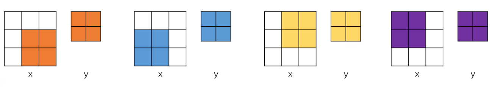

# psamask 算子开发设计方案

- #### 文档基本信息
| 算子名称    | psamask        |
| ----------- | -------------- |
| 编制人/日期     | 李卓华/2021-9-16        |
| 审批人/日期    | 周晨阳/2021-11-10       |
| 审批人/日期    | 邓皓煜/2021-11-10       |
| 审批人/日期    | 卜德飞/2021-11-10       |

- #### 修改记录

| 修订人 | 修订日期   | 修订描述 |
| ------ | ---------- | -------- |
|  李卓华 | 2021-9-15| 首次提交 |
|  李卓华 | 2021-11-3 | 修改方案 |

- #### 内容描述


本文档为`psamask`算子的设计文档，包括需求分析、前向与反向的接口设计、方案设计、性能优化记录和方案实施部分。


## 1 需求分析

### 1.1 算子需求分析

psamask算子需要提供两个模式的实现，分别是：COLLECT和DISTRIBUTE。

| 算子功能简介                                                                 | 根据mask大小为输入打上mask    |
| ---------------------------------------------------------------------------- | --------------------------------------- |
| 需求来源               | mmcv                              |
| 应用网络               | psanet                               |
| 输入数据类型               | float                               |
| 输入Shape               | [N, h_feature, w_feature, h_mask * w_mask]                              |
| 输入Layout               | NHWC                              |
| 输出数据类型               | float                              |
| 输出Shape               | [N, h_feature, w_feature, h_feature * w_feature]                              |
| 输出Layout               | NHWC                              |
| 是否含有dim/axis等类似语义的参数且该参数支持负数/其他特殊处理               | 否                              |
| 是否含有labels/index等类似语义的参数且该参数支持负数/界外情况/其他特殊处理               | 否                              |
| 是否需要支持原位               | 否                              |
| 是否需要支持stride机制                | 否                              |
| 是否需要支持广播               | 否                              |
| 0元素检查是否直接返回               | 是                              |


### 1.2 算子功能和应用场景描述


psamask算子的功能是根据给定的mask尺寸，以一定的规则提取input张量中的数据到output张量中。psamask算子应用于psanet，通过自适应学习一个注意力掩码，将特征映射上的每个位置与其他位置联系起来，来缓和CNN的局部邻域约束。


### 1.3 算子输入输出参数要求

#### 1.3.1 mluOpPsamaskForward

| 参数             | 语义                               | 类型（输入/输出） | 支持类型    | 物理布局   | 规模限制 |
| ---------------- | ---------------------------------- | ----------------- | ----------- | ---------- | -------- |
| handle           | 算子上下文信息                    | /                 | /           | /          | 无       |
| psa_type  | 计算模式| 输入 | int | /     | 无       |
| x_desc       | input的描述符                 | mluOpTensorDescriptor_t           |  /      | NHWC       | 无       |
| x  | 输入tensor | 输入 | 输入    | float  | 无       |
| h_mask       | mask的h大小                  | 输入              | int       |  /      | 无       |
| w_mask       | mask的w大小                  | 输入              | int       |  /      | 无       |
| y_desc          | output的描述符                  | mluOpTensorDescriptor_t              | /       |  /      | 无       |
| y  | 输出tensor | 输入 | 输出    | float  | 无       |

#### 1.3.1 mluOpPsamaskBackward

| 参数             | 语义                               | 类型（输入/输出） | 支持类型    | 物理布局   | 规模限制 |
| ---------------- | ---------------------------------- | ----------------- | ----------- | ---------- | -------- |
| handle           | 算子上下文信息                    | /                 | /           | /          | 无       |
| psa_type  | 计算模式| 输入 | int | /     | 无       |
| dy_desc | output梯度的描述符                 | mluOpTensorDescriptor_t           |  /      | NHWC       | 无       |
| dy  | output梯度tensor | 输入 | 输入    | float  | 无       |
| h_mask       | mask的h大小                  | 输入              | int       |  /      | 无       |
| w_mask       | mask的w大小                  | 输入              | int       |  /      | 无       |
| dx_desc         | input梯度的描述符                  | mluOpTensorDescriptor_t              | /       |  /      | 无       |
| dx   | input梯度 | 输入 | 输出    | float  | 无       |


### 1.4 算子限制

| 限制类型     | 详细说明 |
| ------------ | --------------------------------------------------------------------------------------------------------------- |
| 数据类型限制 | input和output类型只支持float    |
| 布局限制 | input和output布局只支持NHWC    |
| shape限制 | input和output的NHW维度大小必须一致，且H = h_feature, W = w_feature；input的通道大小c_i = h_mask * w_mask；output的通道大小c_o = h_feature * w_feature    |
| 原位限制 | 不支持原位    |
| stride限制 | 不支持stride     |
| 广播限制 | 不支持广播    |
                                     
### 1.5 验收标准

#### 1.5.1 精度验收标准

- 由于是纯io算子，需要做到0误差。
- diff3 = 0

#### 1.5.2 性能验收标准

- 性能IO/计算效率有一项不低于50%

## 2 算子接口设计

### 2.1 参考接口

- mmcv

```c++
void PSAMaskForwardCUDAKernelLauncher(const int psa_type, const Tensor input,
                                      Tensor output, const int num_,
                                      const int h_feature, const int w_feature,
                                      const int h_mask, const int w_mask,
                                      const int half_h_mask,
                                      const int half_w_mask)

void PSAMaskForwardCUDAKernelLauncher(const int psa_type, const Tensor input,
                                      Tensor output, const int num_,
                                      const int h_feature, const int w_feature,
                                      const int h_mask, const int w_mask,
                                      const int half_h_mask,
                                      const int half_w_mask)
```

### 2.2 接口设计

```c++
// mluOpPsamaskForward函数原型
mluOpStatus_t MLUOP_WIN_API mluOpPsamaskForward(mluOpHandle_t handle,
                                             	const int psa_type,
                                             	const mluOpTensorDescriptor_t x_desc,
                                             	const void* x,
                                             	const int h_mask,
                                             	const int w_mask,
                                             	const mluOpTensorDescriptor_t y_desc,
                                             	void* y)

// mluOpPsamaskBackward函数原型
mluOpStatus_t MLUOP_WIN_API mluOpPsamaskBackward(mluOpHandle_t handle,
                                              	const int psa_type,
                                              	const mluOpTensorDescriptor_t dy_desc,
                                              	const void* dy,
                                              	const int h_mask,
                                              	const int w_mask,
                                              	const mluOpTensorDescriptor_t dx_desc,
                                              	void* dx)
```

## 3 实现方案设计

### 3.1 实现方案

input和output的layout都是NHWC。令input的shape为[n, h_feature, w_feature, c_i]，输出output的shape为[n, h_feature, w_feature, c_o]。则有c_o =  h_feature* w_feature，若指定mask的尺寸为h_mask , w_mask，则c_i = h_mask * w_mask。

为方便说明提取的过程，假设h_feature = w_feature = 2, h_mask = w_mask = 3。将input和output的在C维度上展开到二维如下图所示，左边是input通道展开的结果，右边是output通道展开的结果。



#### 3.1.1 COLLECT

COLLECT计算方式是根据mask size，从input上提取一个矩形区域的数据，搬移到ouput的对应位置上，output没有被覆盖到的位置为0。

下图演示了一个batch内提取的内容位置及其提取到的位置的过程：



不同的颜色表示他们是对应了不同的H维度和W维度上的数据。在固定了NHW维度后，input和output在C维度上的对应关系如下：

| input     | output |
| ------------ | ------ |
| hidx | hidx + h - (h_mask - 1) // 2  |
| widx | widx + w - (w_mask - 1) // 2 |

其中，h和w的取值区间分别是[0, h_feature)、[0, w_feature)。hidx和widx的取值区间(左闭右开)分别由下式决定：
|      | 左端点 | 右端点 |
| ------------ | ------ |------ |
| hidx | max(0, (h_mask - 1) // 2 - h)  | min(h_mask, h_feature + (h_mask - 1) // 2 - h) |
| widx | max(0, (w_mask - 1) // 2 - w)| min(w_mask, w_feature + (w_mask - 1) // 2 - w) |

伪代码表示如下

```python
    c_o = h_feature * w_feature
    h_o_offset = w_feature * c_o
    w_o_offset = c_o
    c_i = h_mask * w_mask
    h_i_offset = w_feature * c_i
    w_i_offset = c_i
    n_o_offset = h_feature  w_feature  c_o
    n_i_offset = h_feature  w_feature  c_i
    half_h_mask = (h_mask - 1) // 2
    half_w_mask = (w_mask - 1) // 2

    for n in range(num):
        for h in range(h_feature)：
            for w in range(w_feature):
                h_start = max(0, half_h_mask - h)
                w_start = max(0, half_w_mask - w)
                h_end = min(h_mask, h_feature + half_h_mask - h)
                w_end = min(w_mask, w_feature + half_w_mask - w)
                for hidx in range(h_start, h_end):
                    for widx in range(w_start, w_end):
                        mask_index = n  n_i_offset  h  h_i_offset  w  w_i_offset  (hidx  w_mask  widx)
                        out_index = n  n_o_offset  h  h_o_offset  w * w_o_offset + \
                                  ((hidx  h  half_h_mask) * w_feature  (widx + w  half_w_mask))
                        output[out_index] = input[mask_index]
```

#### 3.1.2 DISTRIBUTE

DISTRIBUTE的计算逻辑跟COLLECT非常相似，唯一的区别是distribute版是将提取的数据搬移到输出的HW维度上，而collect版是搬移到输出的C维度上，又因为有C = H * W，所以逻辑上确实可以这样做，只需要将3.1.1中的所有输出图看成是HW方向的展开就可以了。

伪代码表示如下

```python
    c_o = h_feature * w_feature
    h_o_offset = w_feature * c_o
    w_o_offset = c_o
    c_i = h_mask * w_mask
    h_i_offset = w_feature * c_i
    w_i_offset = c_i
    n_o_offset = h_feature  w_feature  c_o
    n_i_offset = h_feature  w_feature  c_i
    half_h_mask = (h_mask - 1) // 2
    half_w_mask = (w_mask - 1) // 2

    for n in range(num):
        for h in range(h_feature):
            for w in range(w_feature):
                h_start = max(0, half_h_mask - h)
                w_start = max(0, half_w_mask - w)
                h_end = min(h_mask, h_feature + half_h_mask - h)
                w_end = min(w_mask, w_feature + half_w_mask - w)
                for hidx in range(h_start, h_end):
                    for widx in range(w_start, w_end):
                        mask_index = n  n_i_offset  h  h_i_offset  w  w_i_offset  (hidx  w_mask  widx)
                      out_index = n  n_o_offset  (hidx  h - half_h_mask)  h_o_offset + \
                                  (widx  w - half_w_mask)  w_o_offset  h  w_feature + w
                        output[out_index] = input[mask_index]
```

### 3.2 性能优化设计

#### 3.2.1 刷零的位置

由于output没有被input提取的数据覆盖到的位置需要为0，因此在做数据搬移之前需要先对输出做刷零处理。
一种方案是将0刷在GDRAM，既output的最终位置上，只把input数据load到片上，每次从input中提取部分数据再store到GDRAM的对应位置上。这会带来两个问题：

1. 刷零需要拼算子，增加invoke kernel的时间。
2. NRAM到GDRAM的数据太少，太稀疏，会导致io效率较低。

所以改进的思路是希望不要拼算子就能实现刷0，且尽可能增加NRAM到GDRAM的数据量。
目前的方案是将片上空间分成两部分，一部分是input的，另一部分是output的，刷零直接在片上刷，在片上得出最终的output后，再整体搬移到GDRAM上，这样就可以解决上述的两个问题。

#### 3.2.2 关于distribute的改进

distribute计算方式与collect的区别是，input中提取的数据是搬移到output的一个HW面上（N和C维度相同），但由于数据的layout是NHWC，这会导致数据非常稀疏(每次都只是搬运较少的数据且数据之间并不连续)。
为了在layout为NHWC的情况下也能获得较高的io效率，目前的方案为：在3.2.2所述的片上空间划分的基础上，把output的空间再一份为二（已刷零），首先把input的数据按照collect的方式搬运到第一块output空间，然后把这些数据transpose到第二块空间，此时在第二块空间上的output就是最终要的结果。transpose的方法是将C上的数据展开为2维，并转到HW维度上，而原本HW维度的数据合并为一维，并转到C维度上，由于C = H * W，所以该transpose能够实现。

### 3.3 拆分(任务拆分，多核拆分)

本设计暂时针对U1设计。

#### 3.2.1 cluster间拆分

两个版本的psamask对于input的读取逻辑都是一样的，所以可以使用同样的拆分逻辑。由于N, H, W维度上都是相互独立的，且考虑到数据的存储顺序，优先考虑在N上拆分，如果N小于cluster的数量，则在H上拆，如果H也不够，则在W上拆，如果全都不够，则取其中的最大者，目的是尽可能地使用最多的cluster。

#### 3.2.2 core间拆分

逻辑与cluster间拆分一致。

#### 3.2.3 findlimit问题

首先，假设至少能放得下一个c_i  w_seg  h_seg，这里的w_seg是指最终拆分到一个core上的w大小，h_seg，n_seg同理。那么collect方式下需要的输出空间就是n_limit  c_o  w_seg * h_seg， 由于distribute方式的输出空间大小是collect方式下的两倍，所以设置计算类型psa_mask为0时表示collect方式，为1时表示distribute方式，故输出空间大小可以合并表示为：
n_limit  c_o  w_seg  h_seg  (psa_mask + 1)。

```c++
int input = n_limit  h_feature  w_feature * ci;
int output = n_limit  h_feature  w_feature  co  (psa_mask + 1);
int total_ram = input + output;
//CT_size >= total_ram，求解n_limit

//n_limit < 1 的话
//假设至少能放下一个ci * w_seg
int input = h_limit  w_feature  ci;
int output = h_limit  w_feature  co * (psa_mask + 1);
int total_ram = input + output;

//h_limit < 1 的话
//进一步假设至少能放下一个ci，同理可计算得到w_limit
int input = w_limit * ci;
int output = w_limit  co  (psa_mask + 1);
int total_ram = input + output;
//若w_limit < 1 的话，就认为mask太大，报错暂不支持。
```

### 3.4 算子防呆检查

 1、指针为空防呆；

 2、输入和输出的类型需要一致；

 3、输入输出的layout都为NHWC；

 4、输入输出除了C维度外，其余的维度的size需要一致；

 5、输入的通道数必须等于h_mask * w_mask；

 6、输出的通道数必须等于h_feature * w_feature。

## 4 方案实施

### 4.1 开发测试计划

9.15 - 9.16 调研psamask算子功能 + 源码

9.17 - 9.18 编写设计文档，和框架对接

9.22 - 9.25 完成host端逻辑 

9.26 - 10.15 完成pasmask前向的kernel开发

10.18 - 10.20 测试

10.21 - 10.29 代码review

11.1 - 11.5 完成pasmask反向的kernel开发

11.6 - 11.10 提交测试报告+代码review

### 4.2 风险分析

暂未发现风险。
