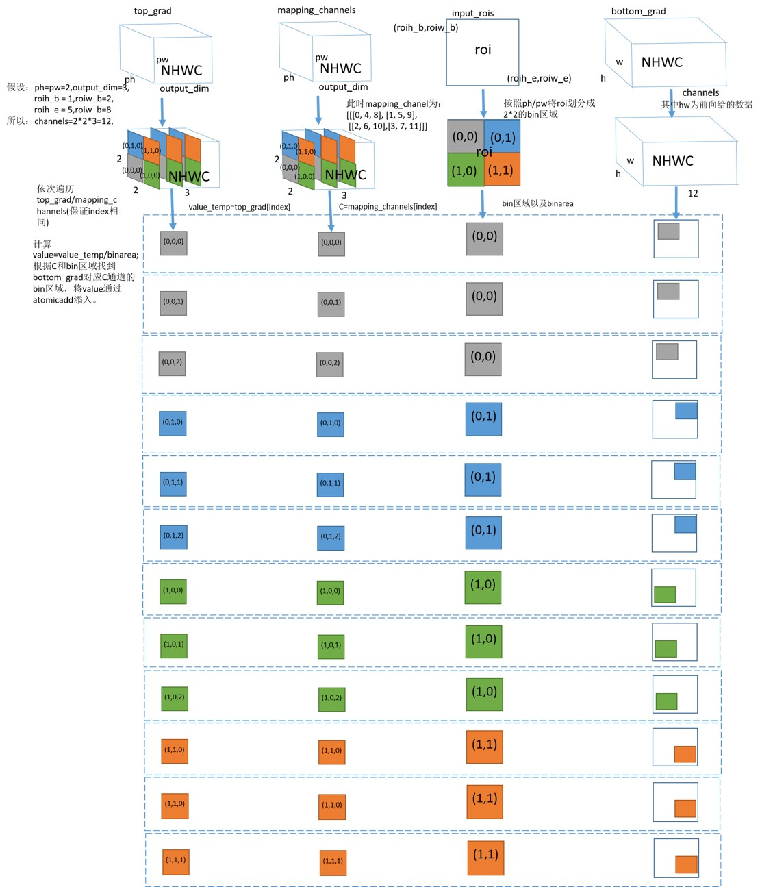

# psroipool_backward 算子开发设计方案

- #### 文档基本信息

| 算子名称    | psroipool_backward       |
| ----------- | -------------- |
| 编制人/日期 | 张欣杨/2022-7-18 |

- #### 修改记录

| 修订人 | 修订日期   | 修订描述 |
| ------ | ---------- | -------- |
| 张欣杨    | 2022-7-18 | 首次提交 |

- #### 内容描述

本文档为`psroipool_backward`算子的设计文档，包括需求分析、接口设计、方案设计、性能优化记录和方案实施部分。

- #### 算子需求 checklist

* 算子接口描述
* 功能描述
* 框架版本 + 对应源码路径
* 需求对应网络
* 网络中用到的规模
* 是否需要支持原位
* 是否需要支持 stride 机制
* 框架单元测试阈值指标（可选）

## 1 需求分析

### 1.1 算子需求分析

| 算子功能简介                                                                 | psroipool算子的反向  |
| ---------------------------------------------------------------------------- | --------------------------------------- |
| 需求来源               | Pytorch                              |
| 应用网络               | R-FCN                            |
| 输入数据类型           |  top_grad: float; mapping_channel: int; </br>rois: float                              |
| 输入 Shape            | top_grad: [rois_num, hi, wi, output_dim]; </br>mapping_channel: [rois_num, hi, wi, output_dim]; </br>rois: [rois_num, rois_offset]  |
| 输入 Layout           | top_grad: NHWC; mapping_channel: NHWC; </br>rois: ARRAY             |
| 输出数据类型            | bottom_grad: float|
| 输出 Shape            | bottom_grad: [batches, ho, wo, channels]         |
| 输出 Layout              |bottom_grad: NHWC  |
| 模式(可选）                      |                                           |
| 是否含有 dim/axis 等类似语义的参数且该参数支持负数/其他特殊处理              | 无                         |
| 是否含有 labels/index 等类似语义的参数且该参数支持负数/界外情况/其他特殊处理 | 无                           |
| 是否需要支持原位           | 否         |
| 是否需要支持 stride 机制   | 否                                                           |
| 是否需要支持广播           | 否                                                           |
| 0 元素检查是否直接返回      | top_grad: (是, return MLUOP_STATUS_SUCCESS); </br>mapping_channel:(是, return MLUOP_STATUS_SUCCESS); </br>rois: (否，return MLUOP_STATUS_BAD_PARAM); </br>bottom_grad: (是, return MLUOP_STATUS_SUCCESS)         |
| 其他特殊需求(在线量化，融合，转数提前等，可选)                               |                                                                |
| 本次开发优先支持的规模/模式                                                  |                                |

### 1.2 算子功能和应用场景描述

算子功能： psroipool算子的反向

应用场景： 该算子应用于R-FCN网络。

- example:

竞品中top_grad、mapping_channel、bottom_grad都是NCHW的layout，下面example与竞品对齐。

```

接口：
psroi_pooling.psroi_pooling_backward_cuda(self.pooled_height, self.pooled_width, self.spatial_scale, self.output_dim,  \
        self.output, self.rois, grad_input, self.mappingchannel)

{pooled_height = 2, pooled_width = 2, spatial_scale = 0.25, output_dim = 1}
top_grad: shape is  [2, 1, 2, 2]
          tensor([[[[1., 1.],
                    [1., 1.]]],
                  [[[1., 1.],
                    [1., 1.]]]], device='cuda:0')
mapping_channel: shape is [2, 1, 2, 2]
                 tensor([[[[0, 1],
                           [2, 3]]],
                         [[[0, 1],
                          [2, 3]]]], device='cuda:0')
rois: shape is [2, 5]
      tensor([[0.0000, 1.0000, 2.0000, 2.0000, 3.0000],
              [0.0000, 1.0000, 2.0000, 2.0000, 3.0000]],
              device='cuda:0')
print(bottom_grad)
bottom_grad: shape is  [2, 2 * 2 * 1, 3, 3]
             tensor([[[[2., 0., 0.],
                       [0., 0., 0.]],
                      [[2., 0., 0.],
                       [0., 0., 0.]],
                     [[[2., 0., 0.],
                       [0., 0., 0.]],
                      [[2., 0., 0.],
                       [0., 0., 0.]]]], device='cuda:0')

```

```

# 0元素检查
# 1. rois为0，报错

torch.FatalError: invalid argument 2: out of range at /opt/pytorch/pytorch/torch/lib/THC/generic/THCTensor.c:23

# 2. top_grad为0，未报错

top_grad = torch.from_numpy(np.array((0,0,0,0))).float().cuda()
print(bottom_grad)
tensor([[[[0., 0., 0.],
          [0., 0., 0.]],
         [[0., 0., 0.],
          [0., 0., 0.]],
        [[[0., 0., 0.],
          [0., 0., 0.]],
         [[0., 0., 0.],
          [0., 0., 0.]]]], device='cuda:0')
[torch.cuda.FloatTensor of size 2x2x2x3 (GPU 0)]

# 3. mapping_channel为0，未报错

mappingchannel = torch.from_numpy(np.array((0,0,0,0))).int().cuda()
print(bottom_grad)
tensor([[[[8., 0., 0.],
          [0., 0., 0.]],
         [[0., 0., 0.],
          [0., 0., 0.]],
        [[[0., 0., 0.],
          [0., 0., 0.]],
         [[0., 0., 0.],
          [0., 0., 0.]]]], device='cuda:0')
[torch.cuda.FloatTensor of size 2x2x2x3 (GPU 0)]

# inf/nan检查
# 1. rois支持inf
rois = torch.from_numpy(np.array(
                        [[np.inf, np.inf, np.inf, np.inf, np.inf],
                         [np.inf, np.inf, np.inf, np.inf, np.inf]])).float().cuda()
print(bottom_grad)
tensor([[[[0., 0., 0.],
          [0., 0., 0.]],
         [[0., 0., 0.],
          [0., 0., 0.]],
        [[[0., 0., 0.],
          [0., 0., 0.]],
         [[0., 0., 0.],
          [0., 0., 0.]]]], device='cuda:0')
[torch.cuda.FloatTensor of size 2x2x2x3 (GPU 0)]

# 2. top_grad支持inf
top_grad = torch.from_numpy(np.array([[[[np.inf, np.inf],
                                       [np.inf, np.inf]]],
                                     [[[np.inf, np.inf],
                                       [np.inf, np.inf]]]])).float().cuda()

print(bottom_grad)
tensor([[[[inf, 0., 0.],
          [0., 0., 0.]],
         [[inf, 0., 0.],
          [0., 0., 0.]],
        [[[inf, 0., 0.],
          [0., 0., 0.]],
         [[inf, 0., 0.],
          [0., 0., 0.]]]], device='cuda:0')
[torch.cuda.FloatTensor of size 2x2x2x3 (GPU 0)]

# 3. rois支持nan
rois = torch.from_numpy(np.array(
                        [[np.nan, np.nan, np.nan, np.nan, np.nan],
                         [np.nan, np.inf, np.nan, np.nan, np.nan]])).float().cuda()
print(bottom_grad)
tensor([[[[0., 0., 0.],
          [0., 0., 0.]],
         [[0., 0., 0.],
          [0., 0., 0.]],
        [[[0., 0., 0.],
          [0., 0., 0.]],
         [[0., 0., 0.],
          [0., 0., 0.]]]], device='cuda:0')
[torch.cuda.FloatTensor of size 2x2x2x3 (GPU 0)]

# 4. top_grad支持nan
top_grad = torch.from_numpy(np.array([[[[np.nan, np.nan],
                                        [np.nan, np.nan]]],
                                      [[[np.nan, np.nan],
                                        [np.nan, np.nan]]]])).float().cuda()

print(bottom_grad)
tensor([[[[nan, 0., 0.],
          [0., 0., 0.]],
         [[nan, 0., 0.],
          [0., 0., 0.]],
        [[[nan, 0., 0.],
          [0., 0., 0.]],
         [[nan, 0., 0.],
          [0., 0., 0.]]]], device='cuda:0')
[torch.cuda.FloatTensor of size 2x2x2x3 (GPU 0)]

```

### 1.3 算子输入输出参数要求

| 参数             | 语义                               | 类型（输入/输出） | 支持类型    | 物理布局   | 规模限制 |
| ---------------- | ---------------------------------- | ----------------- | ----------- | ---------- | -------- |
| handle           | 算子上下文信息                    | /                 | /           | /          | 无       |
| top_grad_desc  | 输入数据的描述符                   | 输入              | mluOpTensorDescriptor_t    | /     | 无       |
| top_grad       | 输入数据的指针                 | 输入              |  float      | NHWC       | 无       |
| rois_desc  | 输入roi的描述符                | 输入              | mluOpTensorDescriptor_t | /          | 无       |
| rois       | 输入roi的指针                  | 输入              | float       |  ARRAY      | 无       |
| mapping_channel_desc | 输入mapping_channel的描述符 | 输入              | mluOpTensorDescriptor_t          | /       | 无       |
| mapping_channel      | 输入mapping_channel数据的指针| 输入              | int32_t      | NHWC       | 无       |
| pooled_height    | 池化后的高度                      | 输入              | uint32_t          | /          | 无       |
| pooled_width    | 池化后的宽度                      | 输入              | uint32_t           | /          | 无       |
| spatial_scale    | 变换的尺度                     | 输入              | float      |   /       | 无       |
| output_dim      | 输出的channel                      | 输入              | uint32_t          | /          | 无       |
| bottom_grad_desc | 输出数据的描述符                   | 输入              | mluOpTensorDescriptor_t       | /     | 无       |
| bottom_grad      | 输出数据的指针                     | 输出              | float      | NHWC       | 无       |

### 1.4 算子限制

| 限制类型     | 详细说明                                                                                                        |
| ------------ | --------------------------------------------------------------------------------------------------------------- |
| 数据类型限制 | 输入数据（包括top_grad、rois）和输出数据（bottom_grad）的类型必须相同，而且仅支持float。输入数据（mapping_channel）类型必须是int32_t。         |
| 布局限制     | 对于top_grad、mapping_channel不支持NCHW的layout，并且每个roi只支持[batch_id, roi_x_start, roi_y_start, roi_x_end, roi_y_end]规模。 |
| 数据规模限制 | 无                                                            |
| 原位限制     | 不支持原位                                                                                                      |
| stride 限制  | 不支持 stride 机制                                                                                              |
| 广播限制     |  参数不支持广播                                                                                              |
| 输入参数限制 | pooled_height = pooled_width,rois_offset = 5,</br>output_dim >= 1,spatial_scale > 0,</br>channels = pooled_height * pooled_width * output_dim,</br>每个roi只支持[batch_id, roi_start_h, roi_start_w, roi_end_h, roi_end_w], 0 <= batch_id <= batches - 1, </br> mapping_channel的shape必须与top_grad的shape保持一致，并且其每个batches均要满足对channels间隔pooled_height * pooled_width的遍历。</br>例如：假设batches = 2, pooled_height = 2, pooled_width =2, output_dim = 3, channels = 2 * 2 * 3, 则mapping_channel为: [[[[0, 4, 8], [1, 5, 9]], [[2, 6, 10], [3, 7 ,11]]], [[[0, 4, 8], [1, 5, 9]], [[2, 6, 10], [3, 7 ,11]]]]。 |
| nan/inf限制 | top_grad支持nan/inf测例，rois参数的nan/inf无法与竞品对齐，由于在计算过程中使用了ceil/floor函数，硬件指令功能限制无法与竞品对齐。已在mlu_ops.h中说明。|

### 1.5 验收标准

#### 1.5.1 精度验收标准

  DIFF1<=0.003

  DIFF2<=0.003

#### 1.5.2 性能验收标准

- 无

## 2 算子接口设计

#### 2.1 参考接口

- PyTorch

```c++
int psroi_pooling_backward_cuda(int pooled_height,
                                int pooled_width,
                                float spatial_scale,
                                int output_dim, 
                                THCudaTensor* top_grad,
                                THCudaTensor* rois,
                                THCudaTensor* bottom_grad,
                                THCudaIntTensor* mappingchannel)
```

#### 2.2 接口设计

```c++
mluOpStatus_t MLUOP_WIN_API 
mluOpPsRoiPoolBackward(mluOpHandle_t handle,
                       const int pooled_height,
                       const int pooled_width,
                       const float spatial_scale,
                       const int output_dim, 
                       const mluOpTensorDescriptor_t top_grad_desc,
                       const void *top_grad,
                       const mluOpTensorDescriptor_t rois_desc,
                       const void *rois,
                       const mluOpTensorDescriptor_t mapping_channel_desc,
                       const void *mapping_channel,
                       const mluOpTensorDescriptor_t bottom_grad_desc,
                       void *bottom_grad);
```

## 3 实现方案设计

### 3.1 实现方案



由上图可以看出，psroipool_backward的计算过程可以总结为：

step1: 根据pooled_height和pooled_width将当前处理的roi划分为pooled_height * pooled_width个bin区域。

step2: 遍历top_grad和mapping_channel中各个点(一次处理output_dim个数据)，从top_grad取出value_temp，从mapping_channel取出C。根据top_grad的index计算出当前处理的roi_num以及当前处理的是哪个bin区域。

step3: 计算出step2得到的bin区域面积bin_area，结合step2得到的value_temp计算出value = value_temp / bin_area. 根据value、C、bin区域找到bottom_grad中对应的bin区域，对这块区域值通过atomic_add将value值添加。

考虑到数据每次处理的bottom_grad过于离散，在实际计算时候先将结果保存成（batches, ho, wo, pooled_height * pooled_width, output_dim），这样可以保证一个output_dim中的数据是连续的。最后再借助workspace将计算结果transpose成（batches, ho, wo, output_dim, pooled_height * pooled_width）形式输出。（这种方案不需要使用mapping_channel参数，mapping_channel参数为前向保存input中的C，是有序的，因此为了与竞品对齐，mapping_channel参数需要保证有序，详细规律见1.4 算子输入限制）。

### 3.2 伪代码实现（可选）

```c++

// 考虑先不拆output_dim: 2 * output_dim < nram_size
top_grad_buffer = nram_src;
nram_buffer = top_grad_buffer + output_dim;
// 每个核的output_dim的遍历
for (output_dim_index = output_dim_begin; index < output_dim_end; output_index++){
    __nramset((T *)top_grad_buffer, output_dim, (float)0);
    __memcpy(top_grad_buffer, top_grad, output_dim * sizeof(float), GDRAM2NRAM);
    roi_num = output_dim_index / (pooled_width * pooled_height);
    ph = (output_dim_index % (pooled_width * pooled_height)) / pooled_width;
    pw = (output_dim_index % (pooled_width * pooled_height)) % pooled_width;

    roi_batch_ind = rois[roi_num * 5]
    // 计算出每一个点(ph,pw)对应在roi_num中大小，计算出hstart,wstart,hend,wend
    is_empty = (hend <= hstart) || (wend <= wstart);
    if (is_empty){
        bin_area = (hend - hstart) * (wend * wstart);
        bin_area_rechip = 1 / bin_area;
        offset_bottom_grad = bottom_grad +
                roi_batch_ind * channels * height * width;
        for (h = hstart; h < hend; h++) {
            for (w = wstart; w < wend; w++) {
                bottom_index = (h * width + w) * channels + (ph * pooled_height + pw) * ouput_dim;
                __bang_mul_const(nram_buffer, top_grad_buffer, bin_area_recip, output_dim);
                __bang_atomic_add(nram_buffer, offset_bottom_grad + bottom_index, nram_buffer, output_dim);
            }
        }
    } 
}

// 所有计算之后对bottom_grad做transpose
最后通过workspace对bottom_grad做transpose，将(batches, ho, wo, output_dim * (pooled_height * pooled_width))\
转成(batches, ho, wo, (pooled_height * pooled_width) * output_dim);

```

### 3.3 拆分(任务拆分，多核拆分)

针对psroipool_backward的拆分是根据taskId拆rois_num * hi * wi，下图中num_deal为nram可以处理的output_dim数量。

nram空间划分：


### 3.4 性能优化设计

无

### 3.5 可维护性设计

算子中已经加入了用于快速定位的调试信息。

### 3.6 测试用例设计

```c++
(1)top_grad:[320, 7, 7, 8], LAYOUT_NHWC, DTYPE_FLOAT
   rois:[320，5], LAYOUT_ARRAY, DTYPE_FLOAT
   mapping_channel:[320, 7, 7, 8], LAYOUT_NHWC, DTYPE_INT32
   bottom_grad:[2, 14, 14, 392], LAYOUT_NHWC, DTYPE_FLOAT
   psroipool_backward_param{spatial_scale=1, output_dim=8, pooled_height=7, pooled_width=7}
(2)top_grad:[493, 3, 3, 21], LAYOUT_NHWC, DTYPE_FLOAT
   input:[493, 5], LAYOUT_ARRAY, DTYPE_FLOAT
   mapping_channel:[493, 3, 3, 21], LAYOUT_NHWC, DTYPE_INT32
   bottom_grad:[8, 14, 14,198], LAYOUT_NHWC, DTYPE_FLOAT
   psroipool_backward_param{spatial_scale=0.0625, output_dim=21, pooled_height=3,pooled_width=3} 

```

### 3.7 算子防呆检查

- 算子指针防呆

1. handle != NULL

2. top_grad_desc != NULL

3. top_grad != NULL

4. rois_desc != NULL

5. rois != NULL

6. bottom_grad_desc != NULL    

7. bottom_grad != NULL

8. mapping_channel_desc != NULL    

9. mapping_channel != NULL

- 针对零元素

1. top_grad: return MLUOP_STATUS_SUCCESS

2. rois: return MLUOP_STATUS_BAD_PARAM

3. mapping_channel: return MLUOP_STATUS_SUCCESS

- 算子参数防呆

1. pooled_width = pooled_height

2. top_grad_layout = MLUOP_LAYOUT_NHWC

3. mapping_channel_layout == MLUOP_LAYOUT_NHWC

4. bottom_grad_layout = MLUOP_LAYOUT_NHWC

5. output_dim >= 1

6. spatial_scale > 0

7. rois_offset == 5

8. top_grad_dtype == MLUOP_DTYPE_FLOAT

9. rois_dtype == MLUOP_DTYPE_FLOAT

10. bottom_grad_dtype == MLUOP_DTYPE_FLOAT

11. mapping_channel_dtype == MLUOP_DTYPE_INT32

12. channels == pooled_height * pooled_width * output_dim

13. top_grad_desc->dim == 4

14. rois_desc->dim == 2

15. bottom_grad_desc->dim == 4

16. mapping_channel_desc->dim == 4

17. top_grad_desc->dim[0] = mapping_channel_desc->dim[0]

18. top_grad_desc->dim[1] = mapping_channel_desc->dim[1]

19. top_grad_desc->dim[2] = mapping_channel_desc->dim[2]

20. top_grad_desc->dim[3] = mapping_channel_desc->dim[3]

21. pooled_height = top_grad_desc->dim[1]

22. pooled_width = top_grad_desc->dim[2]

23. output_dim = top_grad_desc->dim[3]

## 4 算子性能优化记录

### 4.1 当前存在问题的规模说明

无。

### 4.2 已经过优化的规模说明

无。

## 5 方案实施

### 5.1 开发测试计划

2022.7.12～2022.7.13 完成竞品源码测试调研。

2022.7.14～2022.7.16 psroipool_backward设计文档。

2022.7.17～2022.7.18 完成generator开发。

2022.7.19～2022.7.22 完成gtest开发。

2022.7.23～2022.8.3 完成host/device开发。

2022.8.4～2022.8.5 完成测试报告。

2022.8.6～2022.8.11 review代码合入。

### 5.2 风险分析

1、与前向一样，也存在fma问题。