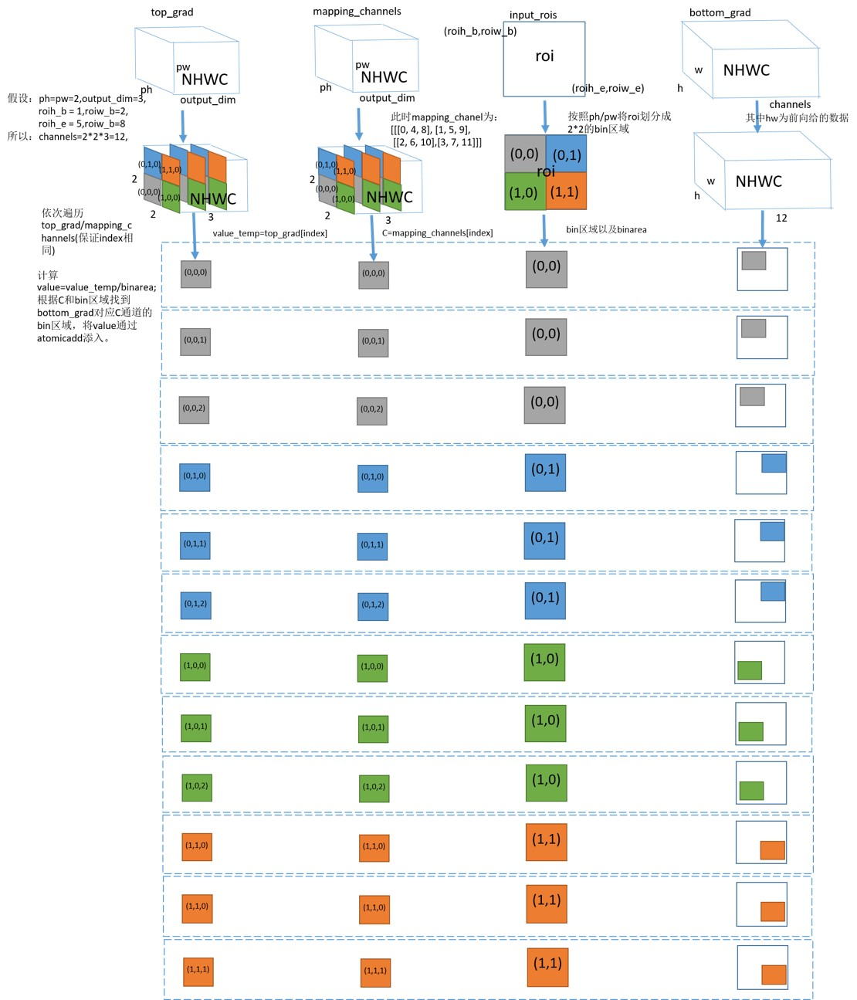

# psroipool_backward 算子开发设计方案

- #### 文档基本信息

| 算子名称    | psroipool_backward       |
| ----------- | -------------- |
| 编制人/日期 | 涂德江/2022-8-2 |
| 审批人/日期 | 卜德飞/2022-8-3 |
| 审批人/日期 | 王远/2022-8-3   |

- #### 修改记录

| 修订人 | 修订日期   | 修订描述 |
| ------ | ---------- | -------- |
| 涂德江    | 2022-8-2 | 首次提交 |

- #### 内容描述

本文档为`psroipool_backward`算子的设计文档，包括需求分析、接口设计、方案设计、性能优化记录和方案实施部分。

- #### 算子需求 checklist

* 算子接口描述
* 功能描述
* 框架版本 + 对应源码路径
* 需求对应网络
* 网络中用到的规模
* 是否需要支持原位
* 是否需要支持 stride 机制
* 框架单元测试阈值指标（可选）

## 1 需求分析

### 1.1 算子需求分析

| 算子功能简介                                                                 | psroipool算子的反向  |
| ---------------------------------------------------------------------------- | --------------------------------------- |
| 需求来源               | Pytorch                              |
| 应用网络               | R-FCN                            |
| 输入数据类型           |  top_grad: float; mapping_channel: int32_t; </br>rois: float                              |
| 输入 Shape            | top_grad: [rois_num, hi, wi, output_dim]; </br>mapping_channel: [rois_num, hi, wi, output_dim]; </br>rois: [rois_num, rois_offset]  |
| 输入 Layout           | top_grad: NHWC; mapping_channel: NHWC; </br>rois: ARRAY             |
| 输出数据类型            | bottom_grad: float|
| 输出 Shape            | bottom_grad: [batches, ho, wo, channels]         |
| 输出 Layout              |bottom_grad: NHWC  |
| 模式(可选）                      |                                           |
| 是否含有 dim/axis 等类似语义的参数且该参数支持负数/其他特殊处理              | 无                         |
| 是否含有 labels/index 等类似语义的参数且该参数支持负数/界外情况/其他特殊处理 | 无                           |
| 是否需要支持原位           | 否         |
| 是否需要支持 stride 机制   | 否                                                           |
| 是否需要支持广播           | 否                                                           |
| 0 元素检查是否直接返回      | top_grad: (是, return MLUOP_STATUS_SUCCESS); </br>mapping_channel:(是, return MLUOP_STATUS_SUCCESS); </br>rois: (否，return MLUOP_STATUS_BAD_PARAM); </br>bottom_grad: (是, return MLUOP_STATUS_SUCCESS)         |
| 其他特殊需求(在线量化，融合，转数提前等，可选)                               |                                                                |
| 本次开发优先支持的规模/模式                                                  |                                |

### 1.2 算子功能和应用场景描述

算子功能： psroipool 算子的反向

应用场景： 该算子应用于R-FCN网络。

- example:

参考接口中 top_grad、mapping_channel、bottom_grad 都是 NCHW 的 layout，下面 example 与参考对齐。

```python
# 接口
psroi_pooling.psroi_pooling_backward_cuda(self.pooled_height, 
                                          self.pooled_width, 
                                          self.spatial_scale, 
                                          self.output_dim,
                                          self.top_grad, 
                                          self.rois, 
                                          bottom_grad, 
                                          self.mappingchannel)
{pooled_height = 2, pooled_width = 2, spatial_scale = 0.25, output_dim = 1}

top_grad: shape is  [2, 1, 2, 2]
          tensor([[[[1., 1.],
                    [1., 1.]]],
                  [[[1., 1.],
                    [1., 1.]]]], device='cuda:0')

mapping_channel: shape is [2, 1, 2, 2]
                 tensor([[[[0, 1],
                           [2, 3]]],
                         [[[0, 1],
                          [2, 3]]]], device='cuda:0')

rois: shape is [2, 5]
      tensor([[0.0000, 1.0000, 2.0000, 2.0000, 3.0000],
              [0.0000, 1.0000, 2.0000, 2.0000, 3.0000]],
              device='cuda:0')

bottom_grad: shape is  [2, 2 * 2 * 1, 3, 3]
             tensor([[[2., 0., 0.],
                       [0., 0., 0.],
                       [0., 0., 0.]],
                      [[2., 0., 0.],
                       [0., 0., 0.],
                       [0., 0., 0.]],
                       [[2., 0., 0.],
                       [0., 0., 0.],
                       [0., 0., 0.]],
                       [[2., 0., 0.],
                       [0., 0., 0.],
                       [0., 0., 0.]],
                     [[[2., 0., 0.],
                       [0., 0., 0.],
                       [0., 0., 0.]],
                       [[2., 0., 0.],
                       [0., 0., 0.],
                       [0., 0., 0.]],
                       [[2., 0., 0.],
                       [0., 0., 0.],
                       [0., 0., 0.]],
                      [[2., 0., 0.],
                       [0., 0., 0.],
                       [0., 0., 0.]]]], device='cuda:0')
```

```python
# 0元素检查
# 1) rois为0，报错
torch.FatalError: invalid argument 2: out of range at /opt/pytorch/pytorch/torch/lib/THC/generic/THCTensor.c:23

# 2) top_grad为0，未报错
top_grad = torch.from_numpy(np.array((0,0,0,0))).float().cuda()
print(bottom_grad)
tensor([[[[0., 0., 0.],
          [0., 0., 0.]],
         [[0., 0., 0.],
          [0., 0., 0.]]],
        [[[0., 0., 0.],
          [0., 0., 0.]],
         [[0., 0., 0.],
          [0., 0., 0.]]]], device='cuda:0')
[torch.cuda.FloatTensor of size 2x2x2x3 (GPU 0)]

# 3. mapping_channel为0，未报错
mappingchannel = torch.from_numpy(np.array((0,0,0,0))).int().cuda()
print(bottom_grad)
tensor([[[[8., 0., 0.],
          [0., 0., 0.]],
         [[0., 0., 0.],
          [0., 0., 0.]]],
        [[[0., 0., 0.],
          [0., 0., 0.]],
         [[0., 0., 0.],
          [0., 0., 0.]]]], device='cuda:0')
[torch.cuda.FloatTensor of size 2x2x2x3 (GPU 0)]

# inf/nan检查
# 1) rois支持inf
rois = torch.from_numpy(np.array(
                        [[np.inf, np.inf, np.inf, np.inf, np.inf],
                         [np.inf, np.inf, np.inf, np.inf, np.inf]])).float().cuda()
print(bottom_grad)
tensor([[[[0., 0., 0.],
          [0., 0., 0.]],
         [[0., 0., 0.],
          [0., 0., 0.]]],
        [[[0., 0., 0.],
          [0., 0., 0.]],
         [[0., 0., 0.],
          [0., 0., 0.]]]], device='cuda:0')
[torch.cuda.FloatTensor of size 2x2x2x3 (GPU 0)]

# 2) top_grad支持inf
top_grad = torch.from_numpy(np.array([[[[np.inf, np.inf],
                                       [np.inf, np.inf]]],
                                     [[[np.inf, np.inf],
                                       [np.inf, np.inf]]]])).float().cuda()
print(bottom_grad)
tensor([[[[inf, 0., 0.],
          [0., 0., 0.]],
         [[inf, 0., 0.],
          [0., 0., 0.]]],
        [[[inf, 0., 0.],
          [0., 0., 0.]],
         [[inf, 0., 0.],
          [0., 0., 0.]]]], device='cuda:0')
[torch.cuda.FloatTensor of size 2x2x2x3 (GPU 0)]

# 3) rois支持nan
rois = torch.from_numpy(np.array(
                        [[np.nan, np.nan, np.nan, np.nan, np.nan],
                         [np.nan, np.inf, np.nan, np.nan, np.nan]])).float().cuda()
print(bottom_grad)
tensor([[[[0., 0., 0.],
          [0., 0., 0.]],
         [[0., 0., 0.],
          [0., 0., 0.]]],
        [[[0., 0., 0.],
          [0., 0., 0.]],
         [[0., 0., 0.],
          [0., 0., 0.]]]], device='cuda:0')
[torch.cuda.FloatTensor of size 2x2x2x3 (GPU 0)]

# 4) top_grad支持nan
top_grad = torch.from_numpy(np.array([[[[np.nan, np.nan],
                                        [np.nan, np.nan]]],
                                      [[[np.nan, np.nan],
                                        [np.nan, np.nan]]]])).float().cuda()
print(bottom_grad)
tensor([[[[nan, 0., 0.],
          [0., 0., 0.]],
         [[nan, 0., 0.],
          [0., 0., 0.]]],
        [[[nan, 0., 0.],
          [0., 0., 0.]],
         [[nan, 0., 0.],
          [0., 0., 0.]]]], device='cuda:0')
[torch.cuda.FloatTensor of size 2x2x2x3 (GPU 0)]
```

### 1.3 算子输入输出参数要求

| 参数             | 语义                               | 类型（输入/输出） | 支持类型    | 物理布局   | 规模限制 |
| ---------------- | ---------------------------------- | ----------------- | ----------- | ---------- | -------- |
| handle           | 算子上下文信息                    | /                 | /           | /          | 无       |
| top_grad_desc  | 输入数据 top_grad 的描述符，包含了 top_grad 的数据类型、数据维度和布局等信息| 输入 | mluOpTensorDescriptor_t | /     | 无       |
| top_grad       | 输入数据 top_grad 的指针                 | 输入              |  float      | NHWC       | 无       |
| rois_desc  | 输入数据 rois 的描述符，包含了 rois 的数据类型、数据维度和布局等信息| 输入 | mluOpTensorDescriptor_t | /  | 无       |
| rois       | 输入数据 rois 的指针                  | 输入              | float       |  ARRAY      | 无       |
| mapping_channel_desc | 输入数据 mapping_channel 的描述符，包含了 mapping_channel 的数据类型、数据维度和布局等信息 | 输入              | mluOpTensorDescriptor_t          | /       | 无       |
| mapping_channel      | 输入数据 mapping_channel 的指针| 输入              | int32_t      | NHWC       | 无       |
| pooled_height    | 特征图池化后的高                      | 输入              | uint32_t          | /          | 无       |
| pooled_width    | 特征图池化后的宽                     | 输入              | uint32_t           | /          | 无       |
| spatial_scale    | 输出 image 的大小相对原始图像的比例，也是 rois 在相应的 image 中的大小比例| 输入              | float      |   /       | 无       |
| output_dim      | 特征图池化后输出的 channel   | 输入              | uint32_t          | /          | 无       |
| bottom_grad_desc | 输出数据 bottom_grad 的描述符，包含了 bottom_grad 的数据类型、数据维度和布局等信息  | 输入              | mluOpTensorDescriptor_t       | /     | 无       |
| bottom_grad      | 输出数据 bottom_grad 的指针          | 输出              | float      | NHWC       | 无       |

### 1.4 算子限制

| 限制类型     | 详细说明 |
| ------------ | --------------------------------------------------------------------------------------------------------------- |
| 数据类型限制 | 输入数据（包括top_grad、rois）和输出数据（bottom_grad）的类型必须相同，而且仅支持 float。输入数据（mapping_channel）类型必须是 int32_t。         |
| 布局限制     | 对于 top_grad、mapping_channel 不支持 NCHW 的 layout，并且每个 roi 只支持 [batch_id, roi_x_start, roi_y_start, roi_x_end, roi_y_end] 规模。 |
| 数据规模限制 | 无                                                            |
| 原位限制     | 不支持原位                                                                                                      |
| stride 限制  | 不支持 stride 机制                                                                                              |
| 广播限制     |  参数不支持广播                                                                                              |
| 输入参数限制 | pooled_height = pooled_width, rois_offset = 5, </br>output_dim >= 1, spatial_scale > 0, </br>channels = pooled_height * pooled_width * output_dim, </br>每个 roi 只支持 [batch_id, roi_start_h, roi_start_w, roi_end_h, roi_end_w], 0 <= batch_id <= batches - 1
| nan/inf限制 | top_grad 支持 nan/inf 测例，rois 由于在计算过程中参与了 ceil/floor 函数，硬件指令功能限制无法与竞品对齐。已在 mlu_ops.h 中说明。|

### 1.5 验收标准

#### 1.5.1 精度验收标准

按照[精度验收标准](../MLU-OPS-Accuracy-Acceptance-Standard.md)的要求明确本算子的精度标准。
- 算子精度验收标准：diff1、diff2；
- 算子精度阈值描述：diff1 <= 3e-3 && diff2 <= 3e-3；

#### 1.5.2 性能验收标准

见 [MLU-OPS 性能验收标准](../MLU-OPS-Performance-Acceptance-Standard.md)。

## 2 算子接口设计

#### 2.1 参考接口

- cuda接口

```c++
int psroi_pooling_backward_cuda(int pooled_height,
                                int pooled_width,
                                float spatial_scale,
                                int output_dim, 
                                THCudaTensor* top_grad,
                                THCudaTensor* rois,
                                THCudaTensor* bottom_grad,
                                THCudaIntTensor* mappingchannel)
```
#### 2.2 接口设计
```c++
mluOpStatus_t MLUOP_WIN_API 
mluOpPsRoiPoolBackward(mluOpHandle_t handle,
                       const int pooled_height,
                       const int pooled_width,
                       const float spatial_scale,
                       const int output_dim, 
                       const mluOpTensorDescriptor_t top_grad_desc,
                       const void *top_grad,
                       const mluOpTensorDescriptor_t rois_desc,
                       const void *rois,
                       const mluOpTensorDescriptor_t mapping_channel_desc,
                       const void *mapping_channel,
                       const mluOpTensorDescriptor_t bottom_grad_desc,
                       void *bottom_grad);
```

## 3 实现方案设计

### 3.1 实现方案



由上图可以看出，psroipool_backward 的计算过程可以总结为（为了简化下文提到的 ph/pw 分别代表 pooled_height/pooled_width）：

step1: 首先计算nram上最多可以处理的 output_dim 数量 nram_output_dim_num。如果 nram_output_dim_num >= 1，执行 step2，否则执行 step3。
```c++
output_dim_align = CEIL_ALIGN(output_dim * sizeof(float), ALIGN_SIZE_128);
// nram 上最多可以存放的 output_dim 数量，128 是为 atomic_add 使用
nram_output_dim_num = (NRAM_BYTE_CNT - 128) / (output_dim_align * sizeof(float) + output_dim * sizeof(int));
```
step2: 根据 nram_output_dim_num 拆 core 上分到的 output_dim 数量 num_per_core。remain 的 output_dim 单独处理，执行 step4。

step3: 计算出 nram 上最多可以处理的数据量 max_deal_num，remain 部分单独处理，遍历执行 num_per_core 次，将 core 上分配的 output_dim 处理后执行 step4。
```c++
max_deal_num = 
      FLOOR_ALIGN((NRAM_BYTE_CNT - 128) / (sizeof(float) + sizeof(int)) * sizeof(float), ALIGN_SIZE_128);
```
step4: 根据 top_grad 的 index 计算出当前处理的 roi_num、ph、pw，根据 roi_num、ph、pw 找到当前 roi 中 bin 区域，求出 bin 区域的坐标以及 bin 区域面积 bin_area。

step5: 遍历当前 index 下 top_grad 和 mapping_channel 中各个点(index 必须一致)，从 top_grad 取出 value_temp，从 mapping_channel 取出 C。

step6: 根据 bin_area 和 value_temp 计算出当前 value 值, 根据 value、C、bin 区域找到 bottom_grad 中对应的 bin 区域各个点的位置bottom_offset，对这块区域值通过 atomic_add 将 value 值添加。
```c++
// deal_num 为实际处理的数据量，hstart、hend、wstart、wend 为 bin 区域坐标，width、channels 分为 bottom_grad 的 width、channels
value = value_temp / bin_area; 
for (int i = 0; i < deal_num; i ++){
    int c = mapping_channel_buffer[index];
    for (h = hstart; h < hend; h++) {
        for (w = wstart; w < wend; w++) {
            __bang_atomic_add(nram_buffer, bottom_grad + bottom_offset, value);
        }
    }
}
```

### 3.2 伪代码实现

见3.1

### 3.3 拆分(任务拆分，多核拆分)

针对 psroipool_backward 的拆分是根据 taskId 拆 rois_num * hi * wi。

1、下图划分为 nram 可以放下一个 output_dim 的情况，其中 N 为 nram 可以处理的 output_dim 数量。

nram 空间划分：


2、下图给 nram 放不下一个 output_dim 的情况，需要拆 output_dim，其中 deal_num 为实际可以存放到 nram 的数据量。

nram 空间划分：


### 3.4 性能优化设计

无

### 3.5 可维护性设计

1、bangc 代码中加入必要的 log 信息，比如输入的规模、数据类型、layout 这些，以及如果出错会导致程序 core dump 的变量，比如 IO 指令的 data_size、dim xyz 的值等，这些信息都是有利于快速定位问题；

2、对重要的函数命名、变量命名要有充分的注释；

3、避免魔鬼数字，对于确定的数字尽量使用公共宏来替代。

### 3.6 测试用例设计

```c++
(1)top_grad:[320, 7, 7, 8], LAYOUT_NHWC, DTYPE_FLOAT
   rois:[320，5], LAYOUT_ARRAY, DTYPE_FLOAT
   mapping_channel:[320, 7, 7, 8], LAYOUT_NHWC, DTYPE_INT32
   bottom_grad:[2, 14, 14, 392], LAYOUT_NHWC, DTYPE_FLOAT
   psroipool_backward_param{spatial_scale=1, output_dim=8, pooled_height=7, pooled_width=7}
(2)top_grad:[493, 3, 3, 21], LAYOUT_NHWC, DTYPE_FLOAT
   input:[493, 5], LAYOUT_ARRAY, DTYPE_FLOAT
   mapping_channel:[493, 3, 3, 21], LAYOUT_NHWC, DTYPE_INT32
   bottom_grad:[8, 14, 14,198], LAYOUT_NHWC, DTYPE_FLOAT
   psroipool_backward_param{spatial_scale=0.0625, output_dim=21, pooled_height=3, pooled_width=3} 
```

### 3.7 算子防呆检查

- 算子指针防呆

1. handle != NULL

2. top_grad_desc != NULL

3. top_grad != NULL

4. rois_desc != NULL

5. rois != NULL

6. bottom_grad_desc != NULL    

7. bottom_grad != NULL

8. mapping_channel_desc != NULL    

9. mapping_channel != NULL

- 针对零元素

1. top_grad: return MLUOP_STATUS_SUCCESS

2. rois: return MLUOP_STATUS_BAD_PARAM

3. mapping_channel: return MLUOP_STATUS_SUCCESS

4. bottom_grad: return MLUOP_STATUS_SUCCESS

- 算子参数防呆

1. pooled_width == pooled_height

2. top_grad_layout == MLUOP_LAYOUT_NHWC

3. mapping_channel_layout == MLUOP_LAYOUT_NHWC

4. bottom_grad_layout == MLUOP_LAYOUT_NHWC

5. output_dim >= 1

6. spatial_scale > 0

7. rois_offset == 5

8. top_grad_dtype == MLUOP_DTYPE_FLOAT

9. rois_dtype == MLUOP_DTYPE_FLOAT

10. bottom_grad_dtype == MLUOP_DTYPE_FLOAT

11. mapping_channel_dtype == MLUOP_DTYPE_INT32

12. channels == pooled_height * pooled_width * output_dim

13. top_grad_desc->dim == 4

14. rois_desc->dim == 2

15. bottom_grad_desc->dim == 4

16. mapping_channel_desc->dim == 4

17. top_grad_desc->dim[0] == mapping_channel_desc->dim[0]

18. top_grad_desc->dim[1] == mapping_channel_desc->dim[1]

19. top_grad_desc->dim[2] == mapping_channel_desc->dim[2]

20. top_grad_desc->dim[3] == mapping_channel_desc->dim[3]

21. pooled_height == top_grad_desc->dim[1]

22. pooled_width == top_grad_desc->dim[2]

23. output_dim == top_grad_desc->dim[3]

## 4 算子性能优化记录

### 4.1 当前存在问题的规模说明

无。

### 4.2 已经过优化的规模说明

无。

## 5 方案实施

### 5.1 开发测试计划

2022.7.12～2022.8.2 完成竞品源码测试调研。

2022.8.2～2022.8.3 psroipool_backward 设计文档。

2022.8.4～2022.8.5 完成 generator 开发。

2022.8.8～2022.8.9 完成 gtest 开发。

2022.8.10～2022.8.12 完成 host/device 开发。

2022.8.15～2022.8.17 完成测试报告。

2022.8.18～2022.8.19 review 代码合入。

### 5.2 风险分析

1、与前向一样，也存在 fma 问题。