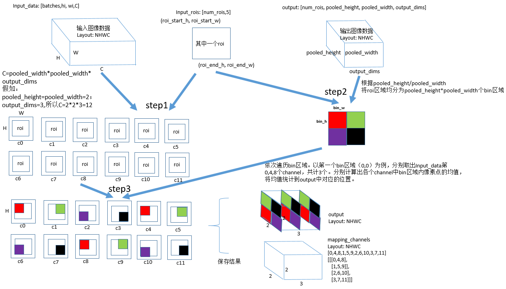
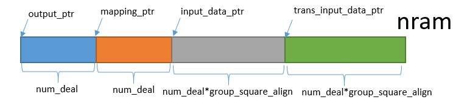
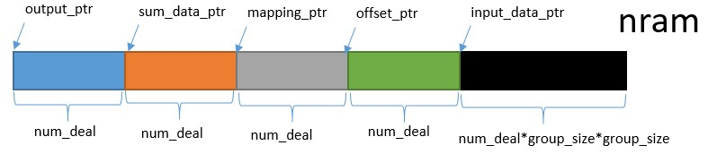

# psroipool_forward 算子开发设计方案

- #### 文档基本信息

| 算子名称    | psroipool_forward       |
| ----------- | -------------- |

- #### 修改记录

| 修订人 | 修订日期   | 修订描述 |
| ------ | ---------- | -------- |

- #### 内容描述

本文档为`psroipool_forward`算子的设计文档，包括需求分析、接口设计、方案设计、性能优化记录和方案实施部分。

- #### 算子需求 checklist

* 算子接口描述
* 功能描述
* 框架版本 + 对应源码路径
* 需求对应网络
* 网络中用到的规模
* 是否需要支持原位
* 是否需要支持 stride 机制
* 框架单元测试阈值指标（可选）

## 1 需求分析

### 1.1 算子需求分析

| 算子功能简介                                                                 | 一种针对位置敏感区域的池化方式  |
| ---------------------------------------------------------------------------- | --------------------------------------- |
| 需求来源               | Pytorch                              |
| 应用网络               | R-FCN                            |
| 输入数据类型           |  float                             |
| 输入 Shape            | input: [batches, hi, wi，channels]; rois: [rois_num，rois_offset]   |
| 输入 Layout           | input: NHWC; rois: ARRAY              |
| 输出数据类型            |  output: float; mapping_channel: int                                |
| 输出 Shape            | output: [rois_num, ho, wo，output_dims]; mapping_channel: [rois_num, ho, wo，output_dims]        |
| 输出 Layout              | output: NHWC; mapping_channel: NHWC                                  |
| 模式(可选）                      |                                           |
| 是否含有 dim/axis 等类似语义的参数且该参数支持负数/其他特殊处理              | 无                         |
| 是否含有 labels/index 等类似语义的参数且该参数支持负数/界外情况/其他特殊处理 | 无                           |
| 是否需要支持原位                                                             | 否         |
| 是否需要支持 stride 机制                                                     | 否                                                           |
| 是否需要支持广播                                                             | 否                                                           |
| 0 元素检查是否直接返回                                                       | input(是, return MLUOP_STATUS_SUCCESS) rois(否，return MLUOP_STATUS_BAD_PARAM)                               |
| 其他特殊需求(在线量化，融合，转数提前等，可选)                               |                                                                |
| 本次开发优先支持的规模/模式                                                  |                                |

### 1.2 算子功能和应用场景描述

首先要了解什么是roipool?

在目标检测算法中，region proposal产生的ROI大小不一，而分类网络的FC层要固定的输入，所以roipool起到一个连接作用。

roipool层为Faster RCNN网络中用于将不同图像经过卷积层后得到的feature map进行维度统一的操作，输入为一个feature map以及需要从中提取的ROI框坐标值，输出为一个维度归一化的feature map。

psroipool的操作与roipool类似，不同之处在于不同空间维度输出的图片特征来自不同的feature map channels，且对每个小区域进行的是Average Pooling，不同于roipool的Max Pooling。对于一个输出 k * k 的结果，不同空间维度的特征取自输入feature map中不同的组，即将输入的feature map在通道维度均匀分为k * k组，每组的channel数与输出的channel一致。详细描述见下面方案设计中的流程图。

### 1.3 算子输入输出参数要求

| 参数             | 语义                               | 类型（输入/输出） | 支持类型    | 物理布局   | 规模限制 |
| ---------------- | ---------------------------------- | ----------------- | ----------- | ---------- | -------- |
| handle           | 算子上下文信息                     | /                 | /           | /          | 无       |
| input_desc  | 输入数据的描述符                   | 输入              | mluOpTensorDescriptor_t           | /          | 无       |
| input       | 输入数据的指针                 | 输入              |  float      | NHWC       | 无       |
| rois_desc  | 输入roi的描述符                    | 输入              | mluOpTensorDescriptor_t | /          | 无       |
| rois       | 输入roi的指针                  | 输入              | float       |  ARRAY      | 无       |
| pooled_height    | 池化后的高度                      | 输入              | uint32_t          | /          | 无       |
| pooled_width    | 池化后的宽度                      | 输入              | uint32_t           | /          | 无       |
| group_size       |  组的大小                        | 输入             | uint32_t      | /       | 无       |
| spatial_scale    | 变换的尺度                     | 输入              | float      |   /       | 无       |
| output_dims      | 输出的channel                      | 输入              | uint32_t          | /          | 无       |
| output_desc | 输出数据的描述符                   | 输入              | mluOpTensorDescriptor_t           | /          | 无       |
| output      | 输出数据的指针                     | 输出              | float      | NHWC       | 无       |
| mapping_channel_desc | 输出mapping_channel的描述符            | 输入              | mluOpTensorDescriptor_t          | /          | 无       |
| mapping_channel      | 输出mapping_channel数据的指针           | 输出              | int32_t      | NHWC       | 无       |

### 1.4 算子限制

| 限制类型     | 详细说明                                                                                                        |
| ------------ | --------------------------------------------------------------------------------------------------------------- |
| 数据类型限制 | 输入数据（包括input和intput_rois）和输出数据（output）的类型必须相同，而且仅支持float。输出数据（mapping_channel）类型必须是int。           |
| 布局限制     | 对于input不支持NCHW的layout，并且每个roi只支持[batch_id, roi_x_start, roi_y_start, roi_x_end, roi_y_end]规模，</br>roi的首位必须是batch_id。 |
| 数据规模限制 | 无                                                            |
| 原位限制     | 不支持原位                                                                                                      |
| stride 限制  | 不支持 stride 机制                                                                                              |
| 广播限制     |  参数不支持广播                                                                                              |
| 输入参数限制 | group_size=pooled_height=pooled_width,rois_offset=5,</br>group_size>=1,output_dim>=1,spatial_scale>0,</br>channels = pooled_height *pooled_width * output_dim,</br>每个roi只支持[batch_id, roi_start_h, roi_start_w, roi_end_h, roi_end_w],</br>0 <= batch_id <= batch - 1 |
| nan/inf限制 | 已支持 |

### 1.5 验收标准

#### 1.5.1 精度验收标准

  DIFF1<=0.003

  DIFF2<=0.003

#### 1.5.2 性能验收标准

- 无

## 2 算子接口设计

### 2.1 参考接口

- PyTorch

```c++
int psroi_pooling_forward_cuda(int pooled_height,
                               int pooled_width,
                               float spatial_scale,
                               int group_size,
                               int output_dim,
                               THCudaTensor *features,
                               THCudaTensor* rois,
                               THCudaTensor* output,
                               THCudaIntTensor* mappingchannel);
```

### 2.2 接口设计

```c++
mluOpStatus_t MLUOP_WIN_API
mluOpPsRoiPoolForward(mluOpHandle_t handle,
                      const int pooled_height, const int pooled_width,
                      const float spatial_scale, const int group_size,
                      const int output_dim,
                      const mluOpTensorDescriptor_t input_desc,
                      const void *input,
                      const mluOpTensorDescriptor_t rois_desc,
                      const void *rois,
                      const mluOpTensorDescriptor_t output_desc,
                      void *output,
                      const mluOpTensorDescriptor_t mapping_channel_desc,
                      void *mapping_channel);
```

## 3 实现方案设计

### 3.1 实现方案



​	由上图可以看出，psroipool_forward的计算过程可以总结为：

（1)step1，在原始图像input:[batches,hi,wi,C]上计算出当前roi:[batch_id, roi_start_h, roi_start_w, roi_end_h, roi_end_w]的起始位置和终止位置。

（2)step2，通过roi:[batch_id, roi_start_h, roi_start_w, roi_end_h, roi_end_w]和output:[num_rois,pooled_height,pooled_width,output_dims]中pooled_height/pooled_width的比例，将当前roi平均划分为若干个bin，并且循环处理每一个bin.

（3)step3，针对当前的bin，计算出当前bin的起始位置和终止位置。对bin_h和bin_w每一个点进行循环处理，一次处理c方向上的数据，共计output_dim。对取出的bin_h * bin_w 个output_dim像素进行对位相加后进行取平均，即为输出图像上对应的c方向上的数据，并记录保存当前C到mapping_channels，过程在对步骤3进行循环，即可处理下一个bin(如果output_dim超过nram上最多能处理的数量max_deal,则需要拆分output_dim)。

- 后期优化方案

由于每一个c方向上需要的数据并不是连续的，但时间隔都是相同的，当前采用的是整体load到nram上，再transpose的，由于transpose的对齐限制，需要使用stride_io进行取数，而stride_io的性能不仅很差，由于还增加了转置的过程，但有效数据却只有output_dim个，所以针对这个问题，考虑使用VAA模块，可以对离散数据进行load，而且不需要使用stride_io，可以整体将数据load到片上再进行gather处理，从而有效的提升了算子的带宽。

### 3.2 伪代码实现（可选）

```c++
// 每一个核的roi循环
for (roi_id = roi_begin;roi_id < roi_end;roi_id++) {
// 按照输出数据的height方向进行循环
    for (ph = 0; ph <pooled_height; ph++) {
// 按照输出数据的width方向进行循环
        for (pw = 0; pw < pooled_iwdth; pw++) {
            // 计算出每一个点(ph,pw)对应在roi中大小，计算出hstart,wstart,hend,wend
            // 针对每一个映射点进行循环处理
            for (h = hstart; h < hend; h++) {
                for (w = wstart; w < wend; w++) {
                //将每一个类对应的group_size*group_size个点分别load到片上，预计
                //output_dim*group_size*group_size个点
                    __memcpy_stride_io(dir = GDRAM2NRAM， data_size =
                                      output_dim*group_size*group_size);
                    // [outpu_dim_align, group_square_align]->
                    // [group_square_align, outpu_dim_align]
                    // 因为load上来的数据需要的只是(h,w)对应的那一个数据，
                    // 但是output_dim方向的数据地址并不连续，通过转置可以将需要处理的数据放在一起
                    __bang_tanspsoe();
                    __bang_add();
                }
            }
            __bang_mlu_const(); // 除以当前bin的大小
        }
    }
}
```

后期优化

```c++
for (int h = hstart; h < hend; ++h) {
   for (int w = wstart; w < wend; ++w) {
      // load whole channels, that channels = group_size * group_size * output_dim
      int load_offset = bidx * height * width * channels + (h * width + w) * channels;
      T *src = bottom_data_ptr + load_offset + c_offset;
      __memcpy(src_channel_data, src, group_size * group_size * output_dim * sizeof(T),
                GDRAM2NRAM);
      mlisa_vaa_nram_to_nram(dst, src_channel_data, offset_nram, output_dim);
      __sync();
      // add
      __bang_add(sum_data, sum_data, dst, output_dim_align);
    }
}
```

### 3.3 拆分(任务拆分，多核拆分)

针对PsRoipool的拆分是根据taskId拆roi_num，每一个核独立计算自己的roi。

为了避免规模限制对outout_dim做拆分，拆分规则如下：

- 当前nram划分

int num_deal = FLOOR_ALIGN(NRAM_BYTE_CNT / ((2 + 2 * group_square_align) * sizeof(T)),
                                     ALIGN_SIZE);

nram划分如下：



- 后期优化

int num_deal = FLOOR_ALIGN(NRAM_BYTE_CNT / ((4 + group_size * group_size) * sizeof(T)),
                                     ALIGN_SIZE);

nram划分如下：



### 3.4 性能优化设计

该算子没有任何算子优化设计，所有任务全串行。

### 3.5 可维护性设计

算子中已经加入了用于快速定位的调试信息。

### 3.6 测试用例设计

```c++
(1)input:[1, 14, 14, 392], LAYOUT_NHWC, DTYPE_FLOAT
   rois:[320，5], LAYOUT_ARRAY, DTYPE_FLOAT
   output:[320, 7, 7, 8], LAYOUT_NHWC, DTYPE_FLOAT
   mapping_channels:[320, 7, 7, 8], LAYOUT_NHWC, DTYPE_INT32
   psroipool_forward_param{spatial_scale=1, group_size=7, output_dim=8, pooled_height=7, pooled_width=7}
(2)input:[2, 14, 14,198], LAYOUT_NHWC, DTYPE_FLOAT
   input:[493, 5], LAYOUT_ARRAY, DTYPE_FLOAT
   output:[493, 3, 3, 21], LAYOUT_NHWC, DTYPE_FLOAT
   mapping_channels:[493, 3, 3, 21], LAYOUT_NHWC, DTYPE_INT32
   psroipool_forward_param{spatial_scale=0.0625, group_size=3,output_dim=21, pooled_height=3,pooled_width=3}

```

### 3.7 算子防呆检查

- 算子指针防呆

1. handle != NULL

2. input_desc != NULL

3. input != NULL

4. rois_desc != NULL

5. rois != NULL

6. output_desc != NULL

7. output != NULL

8. mapping_channels_desc != NULL

9. mapping_channels != NULL

- 针对零元素

1. input: return MLUOP_STATUS_SUCCESS

2. rois: return MLUOP_STATUS_BAD_PARAM

- 算子参数防呆

1. group_size = pooled_height

2. pooled_width = pooled_height

3. input_layout = MLUOP_LAYOUT_NHWC

4. group_size >= 1

5. output_dim >= 1

6. spatial_scale > 0

7. rois_offset == 5

8. mapping_channels_layout == MLUOP_LAYOUT_NHWC

9. input_dtype == MLUOP_DTYPE_FLOAT

10. rois_dtype == MLUOP_DTYPE_FLOAT

11. output_dtype == MLUOP_DTYPE_FLOAT

12. mapping_channels_dtype == MLUOP_DTYPE_INT32

13. channels == pooled_height * pooled_width * output_dim （channels指的是输入图像的C)

14. input_desc->dim == 4

15. rois_desc->dim == 2

16. output_desc->dim == 4

17. mapping_channel_desc->dim == 4

## 4 算子性能优化记录

### 4.1 当前存在问题的规模说明

无。

### 4.2 已经过优化的规模说明

无。

## 5 方案实施

### 5.1 开发测试计划

2022.6.6～2022.6.10 完成竞品源码测试调研。

2022.6.11～2022.6.15 psroi_pooling_forward设计文档。

2022.6.16～2022.6.25 完成gtest/generator开发。

2022.6.26～2022.7.3 完成mluops代码开发及测试报告。

2022.7.4～2022.7.7 代码合入。

### 5.2 风险分析

1、该算子存在fma问题，case中roi_num越大时候出现概率越大，目前测试了一组较大规模的测例，出现的概率为：3/92。
