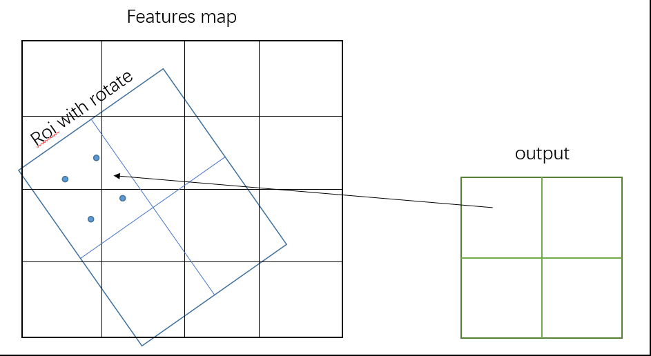

# roi_align_rotated 算子开发设计方案

* #### 文档基本信息

| 算子名称    | roi_align_rotated                                            |
| ----------- | ------------------------------------------------------------ |
| 编制人/日期 | 涂德江/2021-11-22                                            |
| 审批人/日期 | 王远/2021-11-25   |
| 审批人/日期 | 卜德飞/2021-11-25 |

* #### 修改记录

| 版本号| 修订人 | 修订日期 | 修订描述 |
| ----- | ------ | -------  | -------  |
| V 1.0  | 涂德江    | 2021-11-22 | 首次提交 |

* #### 内容描述

本文档为`roi_align_rotated`算子的设计文档，包括需求分析、接口设计、方案设计、性能优化记录和方案实施部分。

## 1 需求分析

### 1.1 算子需求分析

roi_align_rotated算子应用于FOTS网络结构中，以双线性插值的方式提取非整数大小且带有旋转的roi的特征图。

| 算子功能简介| 以双线性插值的方式提取非整数大小且带有旋转的roi的特征图|
|-------------|--------------------------------------------------------------|
| 需求来源    | mmcv                                     |
| 应用网络    | FOTS                                                 |
| 输入数据类型| half, float                                                  |
| 输入Shape   | input1: [batch, hi, wi, channels]; input2: [roi_nums, 6]    |
| 输入Layout  | input1: NHWC; input2: ARRAY |
| 输出数据类型| half, float |
| 输出Shape   | [roi_nums, ho, wo, channels] |
| 输出Layout  | NHWC |
|是否含有dim/axis等类似语义的参数且该参数支持负数/其他特殊处理 | 否|
|是否含有labels/index等类似语义的参数且该参数支持负数/界外情况/其他特殊处理 | 否|
|是否需要支持原位        | 否   |
| 是否需要支持stride机制  | 否       |
| 是否需要支持广播  | 否                       |
| 0元素检查是否直接返回  | 是                                            |                                                      |

### 1.2 算子功能和应用场景描述

在FOTS网络中，roi_align_rotated算子用于统一检测和识别到端到端的pipeline中，输入检测分支中得到的带有旋转角度的bounding boxes，提取对应的特征图用于后续的识别。


### 1.3 算子输入输出参数要求
#### 1.3.1 roi_align_rotated_forward

| 参数          | 语义 | 类型（输入/输出） | 支持类型    | 物理布局 | 规模限制 |
| ------------- | ---- | ----------------- | ----------- | -------- | -------- |
| handle        | MLUOP句柄，保存运行的上下文信息     | 输入              |             | /        | 无       |
| features_desc | 输入特征图数据的描述信息     | 输入              |             | /        | features的维度必须是4       |
| features      | 输入数据，指向输入特征图数据的mlu首地址     | 输入              | half, float | NHWC     | 无       |
| rois_desc     | roi数据的描述信息     | 输入              |             | /        | rois的维度必须是2，且第二维的大小必须是6       |
| rois          |  输入数据，指向rois的mlu地址    | 输入              | half, float | ARRAY    | 无       |
| pooled_height | 输出output的height     | 输入              | int         | /        | 无       |
| pooled_width  | 输出output的width    | 输入              | int         | /        | 无       |
| sample_ratio  | 一个bin的采样率     | 输入              | int         | /     | 无       |
| spatial_scale | rois在feature map上的缩放比例     | 输入              | float       | /        | 无       |
| aligned       | 决定rois中的像素是否需要偏移     | 输入              | bool        | /        | 无       |
| clockwise     | 是否顺时针旋转     | 输入              | bool        | /        | 无       |
| output_desc   | 输出数据的描述信息     | 输入              |             | /        | output的维度必须是4，且第一维大小与rois的第一维大小一致，第二维大小与pooled_height一致，第三维大小与pooled_width一致，第四维大小与featrues的第四维大小一致       |
| output        | 指向输出数据的mlu首地址     | 输出              | half, float | NHWC     | 无       |
#### 1.3.1 roi_align_rotated_backward
| 参数          | 语义 | 类型（输入/输出） | 支持类型    | 物理布局 | 规模限制 |
| ------------- | ---- | ----------------- | ----------- | -------- | -------- |
| handle        |MLUOP句柄，保存运行的上下文信息      | 输入              |             | /        | 无       |
| top_grad_desc | 输入数据的描述信息     | 输入              |             | /        | top_grad的维度必须是4，且第一维大小与rois的第一维大小一致，第二维大小与pooled_height一致，第三维大小与pooled_width一致，第四维大小与bottom_grad的第四维大小一致      |
| top_grad      | 输入数据，指向output的梯度数据的mlu首地址   | 输入              | half, float | NHWC     | 无       |
| rois_desc     | rois数据的描述信息      | 输入              |             | /        | rois的维度必须是2，且第二维的大小必须是6       |
| rois          | 输入数据，指向roi的mlu地址     | 输入              | half, float | ARRAY    | 无       |
| pooled_height | 输出output的height     | 输入              | int         | /        | 无       |
| pooled_width  | 输出output的width    | 输入              | int         | /        | 无       |
| sample_ratio  | 一个bin的采样率     | 输入              | int         | /     | 无       |
| spatial_scale | rois在feature map上的缩放比例     | 输入              | float       | /        | 无       |
| aligned       | 决定rois中的像素是否需要偏移     | 输入              | bool        | /        | 无       |
| clockwise     | 是否顺时针旋转     | 输入              | bool        | /        | 无       |
| bottom_grad_desc   |  输出数据的描述信息    | 输入              |             | /        | bottom_grad的维度必须是4       |
| bottom_grad        | 输出数据，指向特征图的梯度数据的mlu首地址     | 输出              | half, float | NHWC     | 无       |
### 1.4 算子限制
#### 1.4.1 roi_align_rotated_forward
- rois是一个二维的Tensor，其中第一维与output的第一维相同，最后一维必须等于6。每个roi包含（batch_id，x，y, w, h, θ），其中，x和y表示的是roi中心点的坐标，w和h分别是roi的宽和高，θ表示边框逆时针旋转的角度。

- rois中batch_id的值在[0, batch-1]范围内，其中batch是features的第一维的大小，rois中参数x，y，w和h与spatial_scale的乘积值不能超过参数类型可表示的范围；rois中包含NaN和infinity数据时，只有x和y支持infinity数据，其它都不支持。

- output的最高维与rois的最高维相等，最后一维大小与features的最后一维相等。

- features, rois, output数据类型要相同。

#### 1.4.2 roi_align_rotated_backward
- rois是一个二维的Tensor，其中第一维与bottom_grad的第一维相同，最后一维必须等于6。每个roi包含（batch_id，x，y, w, h, θ），其中，x和y表示的是roi中心点的坐标，w和h分别是roi的宽和高，θ表示边框逆时针旋转的角度。

- rois中batch_id的值在[0, batch-1]范围内，其中batch是bottom_grad的第一维的大小，rois中参数x，y，w和h与spatial_scale的乘积值不能超过参数类型可表示的范围；当rois中包含NaN和infinity数据时，只有x和y支持infinity数据，其它都不支持。

- top_grad的最高维与rois的最高维相等，最后一维大小与bottom_grad的最后一维相等。

- top_grad, rois, bottom_grad数据类型要相同。

### 1.5 验收标准

#### 1.5.1 精度验收标准

- 采用动态阈值：
  diff=[diff1, diff2], threshold_rate=[10, 10]。

#### 1.5.2 性能验收标准

- IO效率和计算效率至少有一项不低于50%。

## 2 算子接口设计

### 2.1 参考接口

- MMCV
```c++
// forward
template <typename scalar_t>
__global__ void roi_align_rotated_forward_cuda_kernel(
    const int nthreads, const scalar_t *bottom_data,
    const scalar_t *bottom_rois, const scalar_t spatial_scale,
    const int sample_num, const bool aligned, const bool clockwise,
    const int channels, const int height, const int width,
    const int pooled_height, const int pooled_width, scalar_t *top_data);

// backward
template <typename scalar_t>
__global__ void roi_align_rotated_backward_cuda_kernel(
    const int nthreads, const scalar_t *top_grad,
    const scalar_t *bottom_rois, const scalar_t spatial_scale,
    const int sample_num, const bool aligned, const bool clockwise,
    const int channels, const int height, const int width,
    const int pooled_height, const int pooled_width, scalar_t *bottom_grad);
```

### 2.2 接口设计

```c++
// forward
mluOpStatus_t MLUOP_WIN_API mluOpRoiAlignRotatedForward(mluOpHandle_t handle,
                                                        const mluOpTensorDescriptor_t features_desc,
                                                        const void *features,
                                                        const mluOpTensorDescriptor_t rois_desc,
                                                        const void *rois,
                                                        const int pooled_height,
                                                        const int pooled_width,
                                                        const int sample_ratio,
                                                        const float spatial_scale,
                                                        const bool aligned,
                                                        const bool clockwise,
                                                        const mluOpTensorDescriptor_t output_desc,
                                                        void *output);

// backward
mluOpStatus_t MLUOP_WIN_API mluOpRoiAlignRotatedBackward(mluOpHandle_t handle,
                                                         const mluOpTensorDescriptor_t top_grad_desc,
                                                         const void *top_grad,
                                                         const mluOpTensorDescriptor_t rois_desc,
                                                         const void *rois,
                                                         const int pooled_height,
                                                         const int pooled_width,
                                                         const int sample_ratio,
                                                         const float spatial_scale,
                                                         const bool aligned,
                                                         const bool clockwise,
                                                         const mluOpTensorDescriptor_t bottom_grad_desc,
                                                         void *bottom_grad);
```

## 3 实现方案设计

### 3.1 实现方案

目前已实现的方案有一次处理一个输出点（如RoiAlignForward，RoiPoolingForward），和一次处理多个输出点（如Pool3dForward）两种。roi_align_rotated是典型的IO瓶颈算子，如果一次处理多个输出点，由于能load和store更多的数据，带宽应该会更高，但是由于本算子有rotate属性，同一个roi中的不同采样点并不是水平或竖直分布的，这就导致用于计算不同采样点的数据在input数据中并不总是连续的，且rotate属性也会导致一次load用于计算多个输出点的输入数据变得比较麻烦，而且也只是增加了memcpy的seg_num,最终带宽并不会有多大的提升。本方案采用一次处理一个输出点的方式。



如上图所示，假设pooled_height = pooled_width = 2（分别表示输出的高和宽），sample_h_ratio = sample_h_ratio  = 2 (分别表示h方向和w方向上采样点的数量)的情况，一个输出点由4个采样点计算得出，而每一个采样点又由4个feature map上的特征值通过双线性插值计算得出，所以每一个输出点都需要先通过循环，分别计算出每个采样点的特征值，再计算一个bin内所有采样点的特征值的平均。

由于一个roi在输入的同一个batch上是共享的，所以每一次可以load一整个C维度大小的数据上来，因为插值操作在C维度上是可以并行处理的，只需要计算一次，所以每次实际上是计算得到output上一整个C维度大小的数据。

### 3.2 伪代码实现（可选）

### 3.3 拆分
#### 3.3.1 任务拆分
多核之间进行基本块的拆分，每个核处理一定数量的基本块，基本块的拆分规则如下:

首先，对output进行拆分，由于一次处理一个output的点，而一个输出点对应了一个bin，假设output的shape 为[rois_num, pooled_height, pooled_width, channel]， 则bin的数量为rois_num * pooled_height * pooled_width。故一个bin就是一个基本块，每个核处理若干数量的bin。

#### 3.3.2 数据拆分
对于前向而言，nram的空间划分如下：
```c++
       |            ping           |            pong           |
|------|------|------|------|------|------|------|------|------|
|output|  p1  |  p2  |  p3  |  p4  |  p1  |  p2  |  p3  |  p4  |
|------|------|------|------|------|------|------|------|------|
```
其中，output上存放的数据大小等于输出的C维度的大小，ping跟pong上是用于计算的input上的数据，当C维度很大时会出现如下问题：
- 由于nram需要放下输出上完整的一个C维度的数据，当C维度很大时，就会挤占存放输入数据的空间，因此需要load很多次输入的数据才能计算完一个输出，IO效率会显著下降。
- 当nram没有办法完整的存放输出上一个C维度的数据时，算法将没办法处理，会产生规模限制。

因此，本方案采用空间均分的策略，即把nram均分为9部分，平衡每次计算的输入和输出的大小，避免产生过多的数据加载，同时也解除了规模限制。

对于反向而言，nram的空间划分如下：
```c++
|        ping       |        pong       |
|---------|---------|---------|---------|
|  input  |  output |  input  |  output |
|---------|---------|---------|---------|
    
```
与前向类似，反向计算时把空间均分为4部分，保持每次处理的input和output的大小相同。
### 3.4 性能优化设计
#### 1.排流水
RoiAlign类的算子是IO瓶颈，在一个bin中需要处理多个采样点，每个采样点的计算和load之间可以相互掩盖。
排三级流水，由于需要完整计算一个bin的所有数据之后才得出一个输出点的结果，也就是若干个load会产生一个store，故同一时刻只有L和C在同时进行：L0|C0,L1|C1,L2|C2,L3|C3,L4|C4...|S
每个core执行指令相同。L C S执行的操作分别如下：
1. L(gdram to nram): memcpy features; memcpy rois
2. C(nram): roi_align_rotated
3. S(nram to gdram): memcpy output;
#### 2.bin的分配方式
由3.3.1节可知，数据分配的最小单位是bin，每个core会被分配若干的bin，如果按顺序进行分配，既把若干连续的bin分配到一个core上的话，会存在core间计算不均衡的问题，例如把一个大的roi中的所有bin都分配到同一个core中。
本方案使用的分配方式为：第i个core计算第i + k * taskDim个bin，其中，k是整数,需要满足k * taskDim < rois_num * pooled_height * pooled_width 且k >= 0。该方式在大部分测例中都获得收益，但是如果roi是大小交替出现时，仍然会出现core间计算不均衡的问题，要解决这个问题，需要先把roi的大小进行排序，但由此又会引入排序带来的成本，考虑到这种情况属于少数，故暂不优化。
### 3.5 方案理论性能

方案理论性能为：max(IO_TIME, CP_TIME);

### 3.6 可维护性设计

1、每个函数都有相应的注释，表明该函数的功能以及参数信息；

2、算子对应的feature提交，bug修复等，均应记录在对应的维护表中；

3、在kernel入口处应用参数检查，log打印，kernel出口应有相应的debug信息打印；

4、不支持的数据类型与物理布局应有相应的检查报错;

### 3.7 算子防呆检查
前向：

 1、指针为空防呆；

 2、0元素检查防呆，VLOG(5)打印信息；

 3、features和output必须为4维，rois必须要为2维，且rois的第二维大小必须是6；

 4、features和output的layout必须相同，且都为NHWC；

 5、output和rois的第一维必须相等，features和output的第四维必须相等；

 6、output的HW维度需要分别与参数中的pooled_height和pooled_width保持一致。

 反向：
 
 1、指针为空防呆；

 2、0元素检查防呆，VLOG(5)打印信息；

 3、top_grad和bottom_grad必须为4维，rois必须要为2维，且rois的第二维大小必须是6；

 4、top_grad和bottom_grad的layout必须相同，且都为NHWC；

 5、top_grad和rois的第一维必须相等，top_grad和bottom_grad的第四位必须相等；

 6、top_grad的HW维度需要分别与参数中的pooled_height和pooled_width保持一致。

## 4 算子性能/精度问题 & 优化记录

### 4.1 当前存在问题的规模说明

暂无

### 4.2 已经过优化的规模说明

暂无

### 5.1 开发测试计划

11.15-11.19：训练-mmcv-roi_align _rotated_forward算子调研

11.22-11.27：编写设计文档，和框架对接

11.29-11.30：generator开发

12.1-12.8：host端开发

12.9-12.24：device端开发

12.27-12.31：gtest开发，测试，debug

1.3-1.13：编写测试报告，代码review

1.14-1.21：完成反向算子的开发，包括测试

2.7-2.14：撰写测试报告和完善算子设计文档

2.15-2.25：代码review

2.26：算子合入仓库
### 5.2 风险分析

暂无