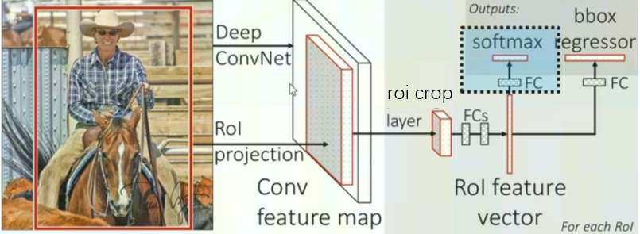

# roi_crop 算子开发设计方案

- #### 文档基本信息

| 算子名称    | roi_crop       |
| ----------- | -------------- |
| 编制人/日期 | 涂德江/2022-5-30 |
| 审批人/日期 | XX/2022-6-2   |
| 审批人/日期 | XX/2022-6-2   |
| 审批人/日期 | XX/2022-6-2   |

- #### 修改记录

| 修订人 | 修订日期   | 修订描述 |
| ------ | ---------- | -------- |
| 涂德江 | 2022-5-31 | 首次提交 |

- #### 内容描述

本文档为`roi_crop`算子的设计文档，分为`roi_crop_forward`和`roi_crop_backward`两部分，包括需求分析、接口设计、方案设计、性能优化记录和方案实施部分。

- #### 算子需求 checklist

* 算子接口描述
* 功能描述
* 框架版本 + 对应源码路径
* 需求对应网络
* 网络中用到的规模
* 是否需要支持原位
* 是否需要支持 stride 机制
* 框架单元测试阈值指标（可选）

## 1 需求分析

### 1.1 算子需求分析

该需求分析为框架原生算子实现功能的需求分析，对于框架原生支持但 MLU-OPS 当前版本不支持的功能，需要在`1.4算子限制` 章节中显式注明。未明确注明不支持的功能，默认 MLU-OPS 全部支持。

| 算子功能简介                | 简要填写算子功能，详细描述在 1.2 中进行说明|
| -------------------------- | ---------------------------------------- |
| 需求来源                    | PyTorch                                  |
| 应用网络                    | faster_rcnn、couplenet                   |
| 输入数据类型                | float                                    |
| 输入 Shape                  |1. roi_crop_forward:<br>input: [b,h,w,c]; grid: [n,out_h,out_w,2]<br>2. roi_crop_backward:<br>gradOutput: [n,out_h,out_w,c]；grid: [n,out_h,out_w,2]|
| 输入 Layout                 |1. roi_crop_forward:<br>input: NHWC; grid: ARRAY<br>2. roi_crop_backward:<br>gradOutput: NHWC；grid: ARRAY|
| 输出数据类型                 | float                                   |
| 输出 Shape                  |1. roi_crop_forward:<br>output:[n, out_h, out_w, c]<br>2. roi_crop_backward:<br>gradInput:[b,h,w,c]|
| 输出 Layout                 |1. roi_crop_forward:<br>ouput:NHWC<br>2. roi_crop_backward:<br>gradInput: NHWC            |
| 模式(可选）                 |            无                                |
| 是否含有 dim/axis 等类似语义的参数且该参数支持负数/其他特殊处理 | 否          |
| 是否含有 labels/index 等类似语义的参数且该参数支持负数/界外情况/其他特殊处理 | 否 |
| 是否需要支持原位             | 否                                               |
| 是否需要支持 stride 机制      |否                                               |
| 是否需要支持广播              | 否                                              |
| 0 元素检查是否直接返回        | 是                                              |
| 其他特殊需求(在线量化，融合，转数提前等，可选)      |            无               |
| 本次开发优先支持的规模/模式    | 无规模限制                                      |

### 1.2 算子功能和应用场景描述

#### 1.2.1 roi_crop_forward

**1) roi_crop_forward算子功能**


从输入的grid中提取一个（y, x）坐标映射参数, 反映射到input中的（Ax, Ay）处, 在input中对（Ax, Ay）使用向下取整, 得到对应的整数坐标,进而获取对应像数值, 通过邻近区域进行双线性插值计算输出output的像素值;

**2) 主要计算公式**

反映射:

Ax =  (x + 1) * (width - 1) / 2;  Ax_weight = 1 - (Ax - floor(Ax));

Ay = (y + 1) * (height - 1) / 2;  Ay_weight = 1 - (Ay - floor(Ay));

双线性插值计算output输出值:

output[address] = Ax_weight * Ay_weight * InTopLeft
                  + (1 - Ax_weight) * Ay_weight * InTopRight
                  + Ax_weight * (1 - Ay_weightt) * InBottomLeft
                  + (1 - Ax_weight) * (1 - Ay_weightt) * InBottomRight;

#### 1.2.2 roi_crop_backward

**1) roi_crop_backward算子功能**


从输入的grid提取一个（y, x）坐标映射参数, 反映射到gradInput中的（Ax, Ay）处, 在gradInput中对（Ax, Ay）处得到对应的整数坐标和权重, 再把gradOutput下的梯度值根据权重分配给gradInput;

**2) 主要计算公式**

atomicAdd(&gradInput_data[gradInputTopLeftAddress], Ax_weight * Ay_weight * gradOutput_Value);

atomicAdd(&gradInput_data[gradInputTopRightAddress], (1 - Ax_weight) * Ay_weight * gradOutput_Value);

atomicAdd(&gradInput_data[gradInputBottomLeftAddress], Ax_weight * (1 - Ay_weightt) * gradOutput_Value);

atomicAdd(&gradInput_data[gradInputBottomRightAddress], (1 - Ax_weight) * (1 - Ay_weight) * gradOutput_Value);

#### 1.2.3 算子主要应用场景



该算子多用在RPN提取的ROI感兴趣区域和backbone提取的feature map特征图的下一步操作, 在feature map特征矩阵中, 对roi感兴趣区域进行采样, 得到固定输出大小的特征矩阵, 用于后续网络的分类与回归任务。

### 1.3 算子输入输出参数要求

#### 1.3.1 roi_crop_forward

| 参数        | 语义 | 类型（输入/输出） | 支持类型    | 物理布局 | 规模限制 |
| ----------- | ---- | ----------------- | ----------- | -------- | -------- |
| handle      |mlu_ops上下文的指针| 输入              |mluOpHandle_t| /        | 无       |
| input_desc |输入数据input的形状描述结构体，定义了input的数据类型，数据维度和布局| 输入 |mluOpTensorDescriptor_t| / | 无 |
| input      |输入tensor input的地址| 输入              | float | NHWC     | 无       |
| grid_desc |输入数据gird的形状描述结构体，定义了grid的数据类型，数据维度和布局| 输入 |mluOpTensorDescriptor_t| / | 无    |
| grid      |输入tensor grid的地址| 输入              | float | ARRAY    | 无       |
| output_desc |输出数据output的形状描述结构体，定义了output的数据类型，数据维度和布局| 输入 |mluOpTensorDescriptor_t| /  | 无 |
| output      |输出tensor output的地址 | 输出         |    float         | NHWC     | 无       |

#### 1.3.2 roi_crop_backward

| 参数        | 语义 | 类型（输入/输出） | 支持类型    | 物理布局 | 规模限制 |
| ----------- | ---- | ----------------- | ----------- | -------- | -------- |
| handle      |mlu_ops上下文的指针  | 输入  |mluOpHandle_t             | /        | 无       |
| gradOutput_desc |输入数据gradOutput的形状描述结构体，定义了gradOutput的数据类型，数据维度和布局| 输入 |mluOpTensorDescriptor_t | /        | 无       |
| gradOutput      |输入tensor gradOutput的地址|输入 |  float    | NHWC     | 无       |
| grid_desc |输入数据gird的形状描述结构体，定义了grid的数据类型，数据维度和布局| 输入   |mluOpTensorDescriptor_t | /        | 无       |
| grid      |输入tensor grid的地址| 输入  |float | ARRAY    | 无       |
| gradInput_desc |输入数据gradInput的形状描述结构体，定义了gradInput的数据类型，数据维度和布局      | 输入  | mluOpTensorDescriptor_t  | /   | 无       |
| gradInput      |输入tensor gradInput的地址      | 输出              | float | NHWC    | 无       |

### 1.4 算子限制

`注意`：凡是没有在此处列出，但最终被框架检测到的算子限制，均会被视为算子 bug。在此处列出的限制，算子内做好防呆。

| 限制类型     | 详细说明  |
| ------------ | ---------------------------------|
| 数据类型限制 | input、grid、output、gradOutput和gradInput只支持float    |
| 布局限制     | input、gradInput、output和gradOutput为NHWC；grid为ARRAY  |
| 规模限制     | 无限制                            |
| 功能限制     | 无限制     |
| 数据范围限制 | grid中数据范围:[-1,1]        |
| 原位限制     | 不支持原位   |
| stride 限制  | 不支持 stride 机制    |
| 广播限制     | 不支持广播  |
|nan/inf限制|grid不支持nan/inf数据|

### 1.5 验收标准

#### 1.5.1 精度验收标准

按照[精度验收标准](../MLU-OPS精度验收标准.md)的要求明确本算子的精度标准。
- 算子精度验收标准：diff1、diff2;
- 算子精度阈值描述：diff1 <= 3e-3 && diff2 <=3e-3;

#### 1.5.2 性能验收标准

见 [MLU-OPS 性能验收标准](../MLU-OPS性能验收标准.md)。

## 2 算子接口设计

### 2.1 参考接口

因算子是cuda自定义算子，这里给出网络中调用接口和cuda函数调用接口

#### 2.1.1 roi_crop_forward

- 网络调用接口
```c++
output = RoICropFunction()(input1, input2);
```
- cuda函数接口
```c++
int BilinearSamplerBHWD_updateOutput_cuda(THCudaTensor *inputImages,
                                          THCudaTensor *grids,
                                          THCudaTensor *output)
```
#### 2.1.2 roi_crop_backward

- cuda函数接口
```c++
int BilinearSamplerBHWD_updateGradInput_cuda(THCudaTensor *inputImages, THCudaTensor *grids, THCudaTensor *gradInputImages,
                                        THCudaTensor *gradGrids, THCudaTensor *gradOutput);
```
### 2.2 接口设计

#### 2.2.1 roi_crop_forward

```c++
mluOpStatus_t MLUOP_WIN_API mluOpRoiCropForward(const mluOpHandle_t handle,
                                                const mluOpTensorDescriptor_t input_desc,
                                                const void *input,
                                                const mluOpTensorDescriptor_t grid_desc,
                                                const void *grid,
                                                const mluOpTensorDescriptor_t output_desc,
                                                void *output)
```
#### 2.2.2 roi_crop_backward
```c++
mluOpStatus_t MLUOP_WIN_API mluOpRoiCropBackward(const mluOpHandle_t handle,
                                                 const mluOpTensorDescriptor_t gradOutput_desc,
                                                 const void *gradOutput,
                                                 const mluOpTensorDescriptor_t grid_desc,
                                                 const void *grid,
                                                 const mluOpTensorDescriptor_t gradInput_desc,
                                                 void *gradInput)
```
## 3 实现方案设计

### 3.1 实现方案

#### 3.1.1 roi_crop_forward

- step1: 根据grid中bin的个数进行任务规模划分，每个IPU分到task_bins份，task_bins = taskId < rem_bins ? bin_n/taskDim + 1 : bin_n/taskDim;
- step2: 1个bin需要input下的4个channels得到output下的1个channels,所以拆分NRAM为8等份,每份PAD_DOWN(MAX_NRAM_SIZE/ 8 / sizeof(float),NFU_ALIGN_SIZE / sizeof(float))个数据,用于存储input的8个channels数据量(ping占4个，pong占4个),nram支持原位计算,output可以复用nram的空间。
- step3: 每个IPU循环获取gw,gh,gn等信息,进而得到input和output的偏移地址,拷贝GDRAM中数据到NRAM;
- step4: nram下使用三级流水,进行计算。

#### 3.1.2 roi_crop_backward

- step1: 根据grid中bin的个数进行任务规模划分，每个IPU分到task_bins份，task_bins = taskId < rem_bins ? bin_n/taskDim + 1 : bin_n/taskDim;
- step2: 1个bin需要gradOutput下的1个channels得到gradOutput下的4个channels,所以拆分NRAM为10等份,每份PAD_DOWN(MAX_NRAM_SIZE/ 10 / sizeof(float),NFU_ALIGN_SIZE / sizeof(float))个数据,用于存储gradOutput的2个channels数据量(ping占1个，pong占1个),用于存储gradInput的8个channels数据量(ping占4个，pong占4个),
- step3: 每个IPU循环获取gw,gh,gn等信息,进而得到gradOutput和gradInput的偏移地址,拷贝GDRAM中数据到NRAM;
- step4: nram下使用三级流水,进行计算。

### 3.2 伪代码实现（可选）

#### 3.2.1 roi_crop_forward
```c++
//可选
```
#### 3.2.1 roi_crop_backward
```c++
//可选
```

### 3.3 拆分(任务拆分，多核拆分)

基本任务类型是U1。根据算子的实现方案可知，roi_crop_forward和roi_crop_backward算子都是依据grid中bin的数据进行拆分的，因此：
将grid中的n * out_h * out_w作为总元素数分到每个IPU上公式如下：<br>
bin_n = n * out_h * out_w;<br>
task_bins = (taskId < ( bin_n % taskDim)) ? bin_n / taskDim + 1 : bin_n / taskDim;<br>
每个IPU要对不同的数据区域做处理，所以需要根据taskId加偏移，获取每个IPU要处理的bin的索引;<br>
rem_bins = bin_n % taskDim;<br>
bins_first_per = (bin_n / taskDim) * taskId + (taskId > rem_bins ? rem_bins : taskId);<br>
bins_loop_per = bins_first_per + task_bins;<br>

### 3.4 性能优化设计

1、资源分配

| 表项            | 分配策略                                |
| --------------- | -------------------------------------- |
| NRAM            | 1.roi_crop_forward:<br>NRAM进行8等份拆分（ping占4个，pong占4个）<br>2.roi_crop_backward:<br>NARM进行10等份（ping占5个，pong占5个）|
| WRAM            | 未使用                                  |
| SRAM            | 未使用                                  |
| DRAM(workspace) | 未使用                                  |

2、流水设计

采用三级流水设计，L C S之间排流水，即GDRAM2NRAM、Compute、NRAM2GDRAM。这里又可以细分为：<br>
1）通道层面上的流水和bin层面上的流水组合（NRAM的一个等份不能一次性加载一个通道数据）；<br>
2）bin层面上的流水（NRAM的一个等份可以一次性加载一个通道数据；<br>
计算部分：<br>
1）roi_crop_forward算子主要使用__bang_mul_const()、_bang_add()；<br>
2）roi_crop_backward算子主要使用__bang_mlu_const()、atomic_add();<br>

### 3.5 可维护性设计

1、bangc 代码中加入必要的 log 信息，比如输入的规模、数据类型、layout 这些，以及如果出错会导致程序 core dump 的变量，比如 IO 指令的 data_size、dim xyz 的值等，这些信息都是有利于快速定位问题;

2、对每一个函数命名变量命名都有充分的注释;

3、避免魔鬼数字，对于确定的数字尽量使用公共宏来替代。

### 3.6 测试用例设计

- 算子在网络中用到的规模：
1、roi_crop_forward

|input、grid、output|source data type |destination data type|
|----|----|----|
|[b,h,w,c]、[n,out_h,out_w,2]、[n,out_h,out_w,c]|float |float|

2、roi_crop_backward

|gradOutput、grid、gradInput|source data type |destination data type|
|----|----|----|
|[n,out_h,out_w,c]、[n,out_h,out_w,2]、[n,h,w,c]|float |float|

- 边界 case：
grid:[-1,1] 

其他可根据需要进行补充。算子开发完毕后，补充测试报告链接。

### 3.7 算子防呆检查

1、指针为空防呆；
2、0 元素检查防呆，VLOG(5)打印信息，是否返回与框架沟通；
3、涉及 workspace 算子对于 workspace_size 的检查防呆；
4、是否需要对输入输出支持的 dtype、layout 以及 shape 进行防呆；
5、elementwise 算子则需要保证输入输出的每一个维度都要一样；
6、算子存在的自身的相关参数防呆。
主要是列出 4,5,6 防呆内容，方便 review。

## 4 算子性能优化记录

### 4.1 当前存在问题的规模说明

只需列出在测试过程中发现的性能/精度异常的规模。

### 4.2 已经过优化的规模说明

此项仅填写未在 4.1 中列出的规模，否则填入 4.1.

## 5 方案实施

### 5.1 开发测试计划
1、开发时间不宜过长，但是测试时间要预留充分，建议开发: 测试 = 1 :1
2、调研需求，接口设计之后可以直接开发 gtest，理解原理
3、方案设计 + 代码开发 + 测试是一个连续的过程
#### 5.1.1 roi_crop_forward
- 2022.4.19 ~ 4.21 调研源码+开始设计方案
- 2022.4.22 设计方案评审：算子功能+接口设计
- 2022.4.24 算子在mlu_ops下的 gtest代码开发
- 2022.4.25 ~ 4.29  算子在mlu_ops下的host、kernel代码开发
- 2022.5.5 算子在红区CNNL下的generator开发
- 2022.5.10 ~ 5.18 大规模测试
- 2022.5.23 提交交MR+代码review
- 2022.5.25算子入库

#### 5.1.2 roi_crop_backward
- 5.30 ~ 6.1 算子需求分析和方案设计
- 6.2 算子方案评审
- 6.6 算子在mlu_ops下的gtest开发
- 6.7 ~ 6.10算子在mlu_ops下的host、kernel代码开发
- 6.11 算子在红区CNNL下的generator开发
- 6.13 - 5.16大规模测试
- 6.17 提交交MR+代码review
- 6.20 算子入库

### 5.2 风险分析

对功能、精度、性能问题的影响分析和后续解决计划。
