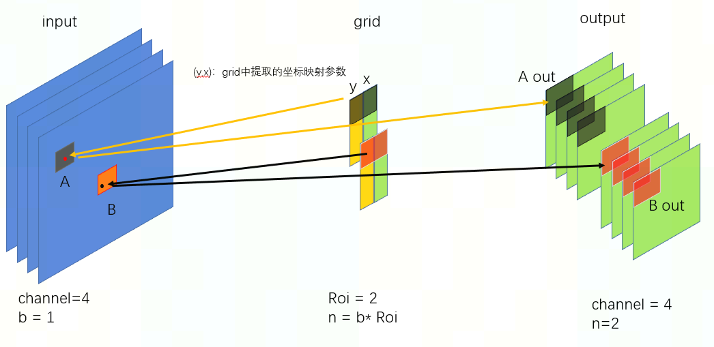
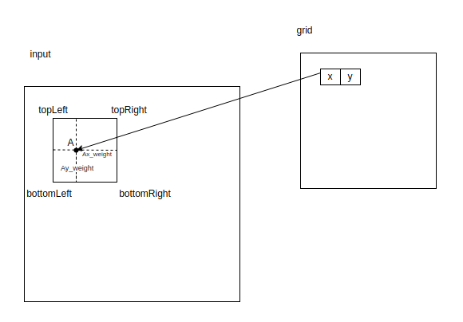
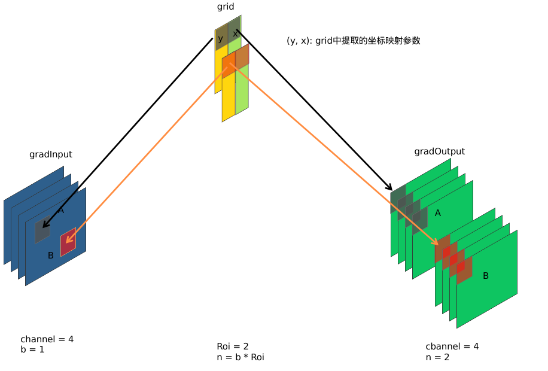
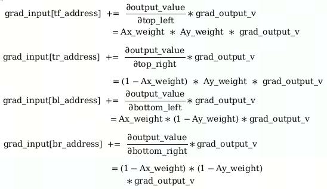

# roi_crop 算子开发设计方案

- #### 文档基本信息

| 算子名称    | roi_crop       |
| ----------- | -------------- |
| 编制人/日期 | 涂德江/2022-5-30 |
| 审批人/日期 | 卜德飞/2022-6-15 |
| 审批人/日期 | 吴少强/2022-6-19 |
| 审批人/日期 | 王远/2022-7-1    |
| 审批人/日期 | 周晨阳/2022-7-4  |

- #### 修改记录

| 修订人 | 修订日期   | 修订描述 |
| ------ | ---------- | -------- |
| 涂德江 | 2022-5-31 | 首次提交 |

- #### 内容描述

本文档为`roi_crop`算子的设计文档，分为`roi_crop_forward`和`roi_crop_backward`两部分，包括需求分析、接口设计、方案设计、性能优化记录和方案实施部分。

- #### 算子需求 checklist

* 算子接口描述
* 功能描述
* 框架版本 + 对应源码路径
* 需求对应网络
* 网络中用到的规模
* 是否需要支持原位
* 是否需要支持 stride 机制
* 框架单元测试阈值指标（可选）

## 1 需求分析

### 1.1 算子需求分析

该需求分析为框架原生算子实现功能的需求分析，对于框架原生支持但 MLU-OPS 当前版本不支持的功能，需要在`1.4算子限制` 章节中显式注明。未明确注明不支持的功能，默认 MLU-OPS 全部支持。

| 算子功能简介                | 根据感兴趣区域提取固定大小的输出特征|
| -------------------------- | ---------------------------------------- |
| 需求来源                    | PyTorch                                  |
| 应用网络                    | faster_rcnn、couplenet                   |
| 输入数据类型                | float                                    |
| 输入 Shape                  |1. roi_crop_forward:<br>input: [b,h,w,c]; grid: [n,out_h,out_w,2]<br>2. roi_crop_backward:<br>grad_output: [n,out_h,out_w,c]; grid: [n,out_h,out_w,2]<br>注：n是b的整数倍|
| 输入 Layout                 |1. roi_crop_forward:<br>input: NHWC; grid: ARRAY<br>2. roi_crop_backward:<br>grad_output: NHWC; grid: ARRAY|
| 输出数据类型                 | float                                   |
| 输出 Shape                  |1. roi_crop_forward:<br>output:[n, out_h, out_w, c]<br>2. roi_crop_backward:<br>grad_input:[b,h,w,c]|
| 输出 Layout                 |1. roi_crop_forward:<br>ouput:NHWC<br>2. roi_crop_backward:<br>grad_input: NHWC            |
| 模式(可选）                 |            无                                |
| 是否含有 dim/axis 等类似语义的参数且该参数支持负数/其他特殊处理 | 否          |
| 是否含有 labels/index 等类似语义的参数且该参数支持负数/界外情况/其他特殊处理 | 否 |
| 是否需要支持原位             | 否                                               |
| 是否需要支持 stride 机制      |否                                               |
| 是否需要支持广播              | 否                                              |
| 0 元素检查是否直接返回        | 是（返回: MLUOP_STATUS_BAD_PARAM ）                  |
| 其他特殊需求(在线量化，融合，转数提前等，可选)      |            无               |
| 本次开发优先支持的规模/模式    | 无规模限制                                      |

### 1.2 算子功能和应用场景描述

#### 1.2.1 roi_crop_forward

**1) roi_crop_forward 算子功能**



从输入的 grid 中提取一个 (y, x) 坐标映射参数，反映射到 input 中的 A 处得到坐标信息(Ax, Ay)，获取A点附近整数点位 top_left, top_right, bottom_left, bottom_right 四处像素值, 根据 grid 中每个像素位 bin 的索引获得 output 中对应的偏移地址，最后通过双线性插值计算输出 output 的像素值。

**2) 主要计算公式**



反映射:

Ax =  (x + 1) * (width - 1) / 2;  Ax_weight = 1 - (Ax - floor(Ax));

Ay = (y + 1) * (height - 1) / 2;  Ay_weight = 1 - (Ay - floor(Ay));

双线性插值计算 output 输出值：

output_value = Ax_weight * Ay_weight * top_left
                  + (1 - Ax_weight) * Ay_weight * top_right
                  + Ax_weight * (1 - Ay_weightt) * bottom_left
                  + (1 - Ax_weight) * (1 - Ay_weightt) * bottom_right；

这里的 Ax_weight 和 Ay_weight 是坐标点 (Ax, Ay) 到 bottom_right 右下角点的距离，其它类似。

#### 1.2.2 roi_crop_backward

**1) roi_crop_backward 算子功能**



根据 grid 中 bin 的索引获取 grad_output 中对应的梯度值 grad_output_v，从 grid 中获取的每个（y, x）坐标映射参数，可以反映射到 grad_input 中的A处得到坐标信息(Ax, Ay) ，获取 A 点附近四处整数点位偏移地址 tl_address、tr_address、bl_address、br_address；最后根据卷积滤波张量信息计算 A 点附近四处整数点位可获得的梯度值。

**2) 主要计算公式**

反映射:

Ax =  (x + 1) * (width - 1) / 2;  Ax_weight = 1 - (Ax - floor(Ax));

Ay = (y + 1) * (height - 1) / 2;  Ay_weight = 1 - (Ay - floor(Ay));

梯度计算：



#### 1.2.3 算子主要应用场景

该算子多用在 RPN 提取的 ROI 感兴趣区域和 backbone 提取的 feature_map 特征图的下一步操作，在 feature_map 特征矩阵中，对 ROI 感兴趣区域进行采样，得到固定输出大小的特征矩阵，用于后续网络的分类与回归任务。


### 1.3 算子输入输出参数要求

#### 1.3.1 roi_crop_forward

| 参数        | 语义 | 类型（输入/输出） | 支持类型    | 物理布局 | 规模限制 |
| ----------- | ---- | ----------------- | ----------- | -------- | -------- |
| handle      |MLU-OPS 上下文的指针| 输入              |mluOpHandle_t| /        | 无       |
| input_desc |对输入数据 input 的形状描述，包含了 input 的数据类型、数据维度和布局等信息| 输入 |mluOpTensorDescriptor_t| / | 无 |
| input      |输入 tensor input 的地址| 输入              | float | NHWC     | 无       |
| grid_desc |对输入数据 gird 的形状描述，包含了 grid 的数据类型、数据维度和布局等信息| 输入 |mluOpTensorDescriptor_t| / | 无    |
| grid      |输入 tensor grid 的地址| 输入              | float | ARRAY    | 无       |
| output_desc |对输出数据 output 的形状描述，包含了 output 的数据类型、数据维度和布局等信息| 输入 |mluOpTensorDescriptor_t| /  | 无 |
| output      |输出 tensor output 的地址 | 输出         |    float         | NHWC     | 无       |

#### 1.3.2 roi_crop_backward

| 参数        | 语义 | 类型（输入/输出） | 支持类型    | 物理布局 | 规模限制 |
| ----------- | ---- | ----------------- | ----------- | -------- | -------- |
| handle      |MLU-OPS 上下文的指针  | 输入  |mluOpHandle_t             | /        | 无       |
| grad_output_desc |对输入数据 grad_output 的形状描述，包含了 grad_output 的数据类型、数据维度和布局等信息| 输入 |mluOpTensorDescriptor_t | /        | 无       |
| grad_output      |输入 tensor grad_output 的地址|输入 |  float    | NHWC     | 无       |
| grid_desc |对输入数据 gird 的形状描述结构体，包含了 grid 的数据类型、数据维度和布局等信息| 输入   |mluOpTensorDescriptor_t | /        | 无       |
| grid      |输入 tensor grid 的地址| 输入  |float | ARRAY    | 无       |
| grad_input_desc |对输出数据 grad_input 的形状描述，包含了 grad_input 的数据类型、数据维度和布局等信息      | 输入  | mluOpTensorDescriptor_t  | /   | 无       |
| grad_input      |输出 tensor grad_input 的地址      | 输出              | float | NHWC    | 无       |

### 1.4 算子限制

| 限制类型     | 详细说明  |
| ------------ | ---------------------------------|
| 数据类型限制 | input,grid,output,grad_output和grad_input只支持float    |
| 布局限制     | input,grad_input,output和grad_output为NHWC; grid为ARRAY  |
| 规模限制     | 无限制                            |
| 功能限制     | 无限制     |
| 数据范围限制 | grid 中数据范围：[-1,1]        |
| 原位限制     | 不支持原位   |
| stride 限制  | 不支持 stride 机制    |
| 广播限制     | 不支持广播  |
|nan / inf 限制|grid 不支持 nan / inf 数据|

### 1.5 验收标准

#### 1.5.1 精度验收标准

按照[精度验收标准](../MLU-OPS-Accuracy-Acceptance-Standard.md)的要求明确本算子的精度标准。
- 算子精度验收标准：diff1、diff2；
- 算子精度阈值描述：diff1 <= 3e-3 && diff2 <=3e-3；

#### 1.5.2 性能验收标准

见 [MLU-OPS 性能验收标准](../MLU-OPS-Performance-Acceptance-Standard.md)。

## 2 算子接口设计

### 2.1 参考接口

#### 2.1.1 roi_crop_forward

- cuda函数接口
```c++
int BilinearSamplerBHWD_updateOutput_cuda(THCudaTensor *inputImages,
                                          THCudaTensor *grids,
                                          THCudaTensor *output)
```
#### 2.1.2 roi_crop_backward

- cuda函数接口
```c++
int BilinearSamplerBHWD_updategradInput_cuda(THCudaTensor *inputImages, 
                                             THCudaTensor *grids, 
                                             THCudaTensor *gradInputImages,
                                             THCudaTensor *gradGrids, 
                                             THCudaTensor *gradOutput);
```
### 2.2 接口设计

#### 2.2.1 roi_crop_forward

```c++
mluOpStatus_t MLUOP_WIN_API mluOpRoiCropForward(const mluOpHandle_t handle,
                                                const mluOpTensorDescriptor_t input_desc,
                                                const void *input,
                                                const mluOpTensorDescriptor_t grid_desc,
                                                const void *grid,
                                                const mluOpTensorDescriptor_t output_desc,
                                                void *output)
```
#### 2.2.2 roi_crop_backward
```c++
mluOpStatus_t MLUOP_WIN_API mluOpRoiCropBackward(const mluOpHandle_t handle,
                                                 const mluOpTensorDescriptor_t grad_output_desc,
                                                 const void *grad_output,
                                                 const mluOpTensorDescriptor_t grid_desc,
                                                 const void *grid,
                                                 const mluOpTensorDescriptor_t grad_input_desc,
                                                 void *grad_input)
```
## 3 实现方案设计

### 3.1 实现方案

#### 3.1.1 roi_crop_forward

- step1: 根据 grid 中 bin 的个数进行任务规模划分，每个 MLU core 分到 task_bins 份，task_bins = taskId < rem_bins ? bin_n / taskDim + 1 : bin_n / taskDim (bin_n = n * out_h * out_w)；
- step2: 根据双线性插值原理，1个 bin 需要 input 下的 4 个 channels 得到 output 下的 1 个 channels，所以拆分 NRAM 为 8 等份，每份P AD_DOWN(MAX_NRAM_SIZE / 8 / sizeof(float)，NFU_ALIGN_SIZE / sizeof(float)) 个数据，用于存储 input 的 8 个 channels 数据量(ping 占 4 个，pong 占 4 个)，NRAM 支持原位计算，output 可以复用 NRAM 的空间；
- step3: 每个 MLU core 循环获取 gw、gh、gn 等信息，进而得到 input 和 output 的偏移地址，拷贝 GDRAM 中数据到 NRAM；
- step4: NRAM 下使用三级流水，进行计算。

#### 3.1.2 roi_crop_backward

- step1: 根据 grid 中 bin 的个数进行任务规模划分，每个 MLU core 分到 task_bins 份，task_bins = taskId < rem_bins ? bin_n / taskDim + 1 : bin_n / taskDim；
- step2: 根据双线性插值梯度计算公式知，1 个 bin 需要 grad_output 下的 1 个 channels 得到 grad_output 下的 4 个 channels，所以拆分 NRAM 为 10 等份，每份 PAD_DOWN(MAX_NRAM_SIZE/ 10 / sizeof(float)，NFU_ALIGN_SIZE / sizeof(float))个数据，用于存储 grad_output 的 2 个 channels 数据量(ping 占 1 个，pong 占 1 个)，用于存储 grad_input 的 8 个 channels 数据量(ping 占 4 个，pong 占 4 个)；
- step3: 每个 MLU core 循环获取 gw、gh、gn 等信息，进而得到 grad_output 和 grad_input 的偏移地址，拷贝 GDRAM 中数据到 NRAM；
- step4: NRAM 下使用三级流水，进行计算。

### 3.2 伪代码实现（可选）

#### 3.2.1 roi_crop_forward
```c++
//可选
```
#### 3.2.1 roi_crop_backward
```c++
//可选
```

### 3.3 拆分(任务拆分，多核拆分)

基本任务类型是 U1。根据算子的实现方案可知，roi_crop_forward 和roi_crop_backward 算子都是依据 grid 中 bin 的数据进行拆分的，因此：
将 grid 中的 n * out_h * out_w 作为总元素数分到每个 MLU core 上公式如下：<br>
bin_n = n * out_h * out_w;<br>
task_bins = (taskId < ( bin_n % taskDim)) ? bin_n / taskDim + 1 : bin_n / taskDim;<br>
每个 MLU core 要对不同的数据区域做处理，所以需要根据 taskId 加偏移，获取每个 MLU core 要处理的 bin 的索引;<br>
rem_bins = bin_n % taskDim;<br>
bins_first_per = (bin_n / taskDim) * taskId + (taskId > rem_bins ? rem_bins : taskId);<br>
bins_loop_per = bins_first_per + task_bins;<br>

### 3.4 性能优化设计

1、资源分配

| 表项            | 分配策略                                |
| --------------- | -------------------------------------- |
| NRAM            | 1. roi_crop_forward:<br>NRAM 进行 8 等份拆分（ping 占 4 个，pong 占 4 个）<br>2. roi_crop_backward:<br>NARM 进行 10 等份（ping 占 5 个，pong 占 5 个）|
| WRAM            | 未使用                                  |
| SRAM            | 未使用                                  |
| DRAM(workspace) | 未使用                                  |

2、流水设计

采用三级流水设计，L C S 之间排流水，即 GDRAM2NRAM、Compute、NRAM2GDRAM。这里可以细分为：<br>
1）bin 的流水（NRAM 等分的每块空间可以一次性加载 bin 中 channels 个数据)；<br>
2）channels 很大的流水 (这里是对bin的流水的补充，当 NRAM 等分到的每块空间不足以一次性加载 bin 中的 channels 个数据，在这种情况下就需对 channels 个数据进行流水计算)；<br>
计算部分：<br>
1）roi_crop_forward 算子主要使用 __bang_mul_scalar()、_bang_add()；<br>
2）roi_crop_backward 算子主要使用 __bang_mlu_const()、atomic_add()；<br>

### 3.5 可维护性设计

1、bangc 代码中加入必要的 log 信息，比如输入的规模、数据类型、layout 这些，以及如果出错会导致程序 core dump 的变量，比如 IO 指令的 data_size、dim xyz 的值等，这些信息都是有利于快速定位问题；

2、对重要的函数命名、变量命名要有充分的注释；

3、避免魔鬼数字，对于确定的数字尽量使用公共宏来替代。

### 3.6 测试用例设计

- 算子在网络中用到的规模：

1、roi_crop_forward

|input|grid|output|source data type |destination data type|
|----|----|----|----|----|
|1，5，5，1|1，3，1，2|1，3，1，1|float |float|
|1，32，32，500|1，5，5，2|1，5，5，500|float |float|
|1，32，32，50000|1，5，5，2|1，5，5，50000|float |float|
|4，32，32，500|16，3，5，2|16，3，5，500|float |float|
|4，13，15，5000|16，5，9，2|16，5，9，5000|float |float|
|8，32，32，500|16，25，25，2|16，25，25，500|float |float|

2、roi_crop_backward

|grad_output|grid|grad_input|source data type |destination data type|
|----|----|----|----|----|
|[1, 3, 1, 1]|[1, 3, 1, 2]|[1, 5, 5, 500]|float |float|
|[1, 5, 5, 500]|[1, 5, 5, 2]|[1, 32, 32, 500]|float |float|
|[1, 5, 5, 50000]|[1, 5, 5, 2]|[1, 32, 32, 50000]|float |float|
|[16, 3, 5, 50000]|[16, 3, 5, 2]|[4, 32, 32, 50000]|float |float|
|[16, 13, 25, 500]|[16, 13, 25, 2]|[4, 32, 32, 500]|float |float|
|[16, 25, 25, 500]|[16, 25, 25, 2]|[4, 32, 32, 500]|float |float|

- 边界 case: grid:[-1,1] 

其他可根据需要进行补充。算子开发完毕后，补充测试报告链接。

### 3.7 算子参数检查

1、检查描述符与数据指针是否为空；

2、检测 tensor 是否为 0 元素；

3、检查输入、输出 tensor 的数据类型、物理布局和规模是否正确；

## 4 算子性能优化记录

### 4.1 当前存在问题的规模说明

只需列出在测试过程中发现的性能/精度异常的规模。

### 4.2 已经过优化的规模说明

此项仅填写未在 4.1 中列出的规模，否则填入 4.1.

## 5 方案实施

### 5.1 开发测试计划

#### 5.1.1 roi_crop_forward

- 2022.4.19 ~ 4.21 调研源码+开始设计方案
- 2022.4.22 设计方案评审：算子功能+接口设计
- 2022.4.24 算子在 MLU-OPS 下的 GTest 代码开发
- 2022.4.25 ~ 4.29  算子在 MLU-OPS 下的 host、kernel 代码开发
- 2022.5.5 算子在黄区下的 Generator 开发
- 2022.5.10 ~ 5.18 大规模测试
- 2022.5.23 提交交 MR + 代码 review
- 2022.5.25 算子入库

#### 5.1.2 roi_crop_backward

- 5.30 ~ 6.1 算子需求分析和方案设计
- 6.2 算子方案评审
- 6.6 算子在 MLU-OPS 下的 GTest 开发
- 6.7 ~ 6.10 算子在 MLU-OPS 下的 host、kernel 代码开发
- 6.11 算子在黄区下的 Generator开发
- 6.13 ~ 5.16 大规模测试
- 6.17 提交交 MR + 代码 review
- 6.20 算子入库

### 5.2 风险分析

对功能、精度、性能问题的影响分析和后续解决计划。
