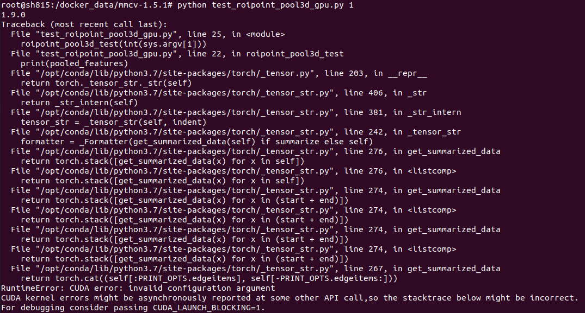
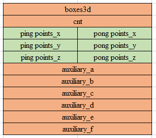

# roipoint_pool3d 算子开发设计方案


* #### 文档基本信息

| 算子名称    | roipoint_pool3d                                              |
| ----------- | ------------------------------------------------------------ |
| 编制人/日期 | 张少鹏/2022-05-30                                          |
| 审批人/日期 | 张皓哲/2022-06-15                                          |
| 审批人/日期 | 王远/2022-06-15                                            |
| 审批人/日期 | 周晨阳/2022-06-15                                          |

* #### 修改记录

| 版本号| 修订人 | 修订日期 | 修订描述 |
| ----- | ------ | -------  | -------  |
| V1.0  | 张少鹏 | 2022-05-30 | 首次提交 |

* #### 内容描述

本文档为`roipoint_pool3d`算子的设计文档，包括需求分析、接口设计、方案设计、性能优化记录和方案实施部分。

* #### 算子需求checklist

算子需求提出者需要`提供`的信息如下：

- 框架负责人
- 算子接口描述
- 功能描述
- 框架版本 + 对应源码路径
- 需求对应网络
- 网络中用到的规模
- 常用规模下的竞品性能（可选）
- 是否需要支持原位
- 是否需要支持stride机制
- 框架单元测试阈值指标（可选）
- 其他特殊需求（在线量化/融合/转数提前等，可选）
- 确认算子需求是否已经过框架层review（滤除MLUOP已支持的算子）

算子需求提出者需要`check`的部分如下：

- 1.1 算子需求分析
- 1.2 算子功能和应用场景描述
- 1.3 算子输入输出参数要求
- 1.4 算子限制
- 1.5 验收标准
- 2.2 接口设计
- 3.5 测试用例（需求提出者check算子需求表中所给规模是否列出）

## 1 需求分析

### 1.1 算子需求分析

| 算子功能简介| 筛选proposal内的点云数据坐标和特征                             |
|-------------|--------------------------------------------------------------|
| 需求来源    | mmcv                                                         |
| 应用网络    | partA2                                                       |
| 输入数据类型| points : float16, float32<br>point_features : float16, float32<br>boxes3d : float16, float32 |
| 输入Shape   | points : [B, N, 3]<br>points_features : [B, N, C]<br>boxes3d : [B, M, 7] |
| 输入Layout  | ARRAY                                                            |
| 输出数据类型| pooled_features : float16, float32<br>pooled_empty_flag : int32   |
| 输出Shape   | pooled_features : [B, M, sampled_pts_num, 3+C]<br>pooled_empty_flag : [B, M] |
| 输出Layout  | ARRAY                                                             |
| 是否需要支持原位        | 否                                                     |
| 是否需要支持stride机制  | 否                                                     |
| 是否需要支持广播        | 否                                                     |
| 0元素检查是否直接返回   | 否，不支持输入0元素                                      |

参考接口输入0元素测试结果

points_num = 0 :



### 1.2 算子功能和应用场景描述

Roipoint_pool3d算子用于PointRCNN模型，功能是筛选出3D bounding boxes内的点云数据坐标和特征。LiDAR坐标系下，判断点云数据坐标是否在box边框内的计算公式为：

```math
cz = cz + \frac{dz}{2} \\
local\_x = (x - cx) * cos(-rz) - (y - cy) * sin(-rz) \\
local\_y = (x - cx) * sin(-rz) + (y - cy) * cos(-rz) \\
in\_flag = |local\_x| < \frac{dx}{2} \& |local\_y| < \frac{dy}{2} \& |z - cz| <= \frac{dz}{2}
```

### 1.3 算子输入输出参数要求

| 参数             | 语义                                                         | 类型（输入/输出）  | 支持类型                | 物理布局 | 规模限制 |
| ---------------- | ------------------------------------------------------------ | ----------------- | ---------------------- | -------- | -------- |
| handle                 | handle                                                 | 输入              | mluOpHandle_t             | /        | 无               |
| batch_size             | batch的数量                                            | 输入               | int                      | /        | 无              |
| pts_num                | 点云数据的数量                                          | 输入              | int                      |  /       | 无               |
| boxes_num              | 3D box的数量                                           | 输入               | int                      | /        | 无               |
| feature_in_len         | 特征值的数量                                            | 输入              | int                      | /        | 无               |
| sampled_pts_num        | 3D boxes内点云数据的采样点数                            | 输入               | int                      | /        | 无               |
| points_desc            | 对输入points的描述                                      | 输入              | mluOpTensorDescriptor_t   | /        | 无               |
| points                 | 点云数据的坐标                                          | 输入              | float16,float32          | ARRAY    | [B, N, 3]        |
| point_features_desc    | 对输入point_features的描述                              | 输入              | mluOpTensorDescriptor_t   | /        | 无               |
| point_features         | 点云数据的特征                                          | 输入              | float16,float32          | ARRAY    | [B, N, C]        |
| boxes3d_desc           | 对输入boxes3d的描述                                     | 输入              | mluOpTensorDescriptor_t   | /        | 无               |
| boxes3d                | 3D boxes的边界框信息                                    | 输入              | float16,float32          | ARRAY    | [B, M, 7]        |
| workspace              | 算子所需workspace空间                                   | 输入              | void *                   | /        | 无               |
| workspace_size         | workspace空间大小                                       | 输入              | size_t                   | /        | 无               |
| pooled_features_desc   | 对输出pooled_features的描述                             | 输入              | mluOpTensorDescriptor_t   | /        | 无               |
| pooled_features        | 3D boxes内的点云数据信息                                | 输出              | float16,float32          | ARRAY    | [B, M, sampled_pts_num, 3+C] |
| pooled_empty_flag_desc | 对输出pooled_empty_flag的描述                           | 输入              | mluOpTensorDescriptor_t   | /        | 无               |
| pooled_empty_flag      | 3D boxes内是否有点云数据                                | 输出              | int32                    | ARRAY    | [B, M]           |

### 1.4 算子限制

| 限制类型    | 详细说明                                                      |
| ----------- | ------------------------------------------------------------ |
| 数据类型限制 | points, point_features, boxes3d, pooled_features 所指向元素的数据类型应保持一致 |
| 数据规模限制 | points.dim = 3, point_features.dim = 3, boxes3d.dim = 3, pooled_features.dim = 4, pooled_empty_flag.dim = 2, points.dims[2] = 3, boxes.dims[2] = 7 |
| 原位限制    | 不支持原位                                                    |
| stride限制  | 不支持stride机制                                              |
| 广播限制    | 不支持广播                                                    |

### 1.5 验收标准

#### 1.5.1 精度验收标准

- MLUOP精度验收标准：

输出pooled_features适配动态阈值，采用动态阈值标准：diffs = [diff1, diff2, diff4]，threshold_rate = [10, 10, 1]。

输出pooled_empty_flag适配动态阈值，采用动态阈值标准：diffs = [diff1, diff2, diff4]，threshold_rate = [0, 0, 1]。

经沟通由于参考接口float/half运算存在位宽提升操作，适配二级精度 - 特殊项3。

#### 1.5.2 性能验收标准

- 参考接口性能分析：

| 平台                 | 框架版本     | 数据类型 | 数据规模        | 计算效率  | IO效率   | Hardware time(ms) |
| -------------------- | ----------- | ------- | --------------- | -------- | -------- | ----------------- |
| Tesla V100-SXM2 16GB | mmcv-1.5.1 + cuda-10.2 + pytorch-1.9 + driver-440.64.00 | float32 | points: [16, 16384, 3]<br>point_features: [16, 16384, 128]<br>boxes3d: [16, 128, 7]<br>num_sampled_points: 512<br>pooled_features: [16, 128, 512, 131]<br>pooled_empty_flag: [16, 128]  | assign_pts_to_box3d: 8.274618%<br>get_pooled_idx: 0.791249%<br>roipoint_pool3d_forward: 0.715854% | assign_pts_to_box3d: 58.340336%<br>get_pooled_idx: 2.368091%<br>roipoint_pool3d_forward: 17.239019% | assign_pts_to_box3d: 2.947488ms<br>get_pooled_idx: 6.369888ms<br>roipoint_pool3d_forward: 120.879136ms |
| Tesla V100-SXM2 16GB | mmcv-1.5.1 + cuda-10.2 + pytorch-1.9 + driver-440.64.00 | float32 | points: [32, 16384, 3]<br>point_features: [32, 16384, 128]<br>boxes3d: [32, 128, 7]<br>num_sampled_points: 512<br>pooled_features: [32, 128, 512, 131]<br>pooled_empty_flag: [32, 128]  | assign_pts_to_box3d: 6.415553%<br>get_pooled_idx: 1.558271%<br>roipoint_pool3d_forward: 0.694731% | assign_pts_to_box3d: 45.108732%<br>get_pooled_idx: 4.707940%<br>roipoint_pool3d_forward: 17.386582% | assign_pts_to_box3d: 7.625088ms<br>get_pooled_idx: 6.443680ms<br>roipoint_pool3d_forward: 251.651680ms |
| Tesla V100-SXM2 16GB | mmcv-1.5.1 + cuda-10.2 + pytorch-1.9 + driver-440.64.00 | float32 | points: [64, 16384, 3]<br>point_features: [64, 16384, 128]<br>boxes3d: [64, 128, 7]<br>num_sampled_points: 512<br>pooled_features: [64, 128, 512, 131]<br>pooled_empty_flag: [64, 128]  | assign_pts_to_box3d: 8.079314%<br>get_pooled_idx: 3.043757%<br>roipoint_pool3d_forward: 0.694855% | assign_pts_to_box3d: 56.748395%<br>get_pooled_idx: 9.254236%<br>roipoint_pool3d_forward: 17.524824% | assign_pts_to_box3d: 12.115936ms<br>get_pooled_idx: 6.579392ms<br>roipoint_pool3d_forward: 499.772352ms |
| Tesla V100-SXM2 16GB | mmcv-1.5.1 + cuda-10.2 + pytorch-1.9 + driver-440.64.00 | float32 | points: [128, 16384, 3]<br>point_features: [128, 16384, 128]<br>boxes3d: [128, 128, 7]<br>num_sampled_points: 512<br>pooled_features: [128, 128, 512, 131]<br>pooled_empty_flag: [128, 128] | assign_pts_to_box3d: 8.082102%<br>get_pooled_idx: 5.701440%<br>roipoint_pool3d_forward: 0.693960% | assign_pts_to_box3d: 56.642375%<br>get_pooled_idx: 17.394815%<br>roipoint_pool3d_forward: 17.560148% | assign_pts_to_box3d: 24.290112ms<br>get_pooled_idx: 7.029760ms<br>roipoint_pool3d_forward: 984.111936ms |
| Tesla V100-SXM2 16GB | mmcv-1.5.1 + cuda-10.2 + pytorch-1.9 + driver-440.64.00 | float32 | points: [1, 16384, 3]<br>point_features: [1, 16384, 128]<br>boxes3d: [1, 128, 7]<br>num_sampled_points: 512<br>pooled_features: [1, 128, 512, 131]<br>pooled_empty_flag: [1, 128]     | assign_pts_to_box3d: 8.053277%<br>get_pooled_idx: 0.049786%<br>roipoint_pool3d_forward: 2.595212% | assign_pts_to_box3d: 56.329738%<br>get_pooled_idx: 0.148705%<br>roipoint_pool3d_forward: 23.209472% | assign_pts_to_box3d: 191.904000ms<br>get_pooled_idx: 6.325568ms<br>roipoint_pool3d_forward: 1.817632ms |

- 网络中使用到的规模性能优于或至少与参考接口性能持平。
- 部分与参考接口差距过大的规模在4.算子性能优化记录中进行说明。
- 附上算子测试报告链接，测试报告必须包括框架给出的网络中规模的性能数据以及对应效率值。

## 2 算子接口设计

### 2.1 参考接口

- MMCV

```c++
// 给出MMCV接口
// No CPU implementation for now
// CUDA(https://github.com/open-mmlab/mmcv/blob/v1.5.1/mmcv/ops/csrc/pytorch/cuda/roipoint_pool3d_cuda.cu):
void RoIPointPool3dForwardCUDAKernelLauncher(
  int batch_size, int pts_num, int boxes_num, int feature_in_len,
  int sampled_pts_num, const Tensor xyz, const Tensor boxes3d,
  const Tensor pts_feature, Tensor pooled_features,
  Tensor pooled_empty_flag)
```

### 2.2 接口设计

```c++
mluOpStatus_t MLUOP_WIN_API 
mluOpGetRoiPointPool3dWorkspaceSize(mluOpHandle_t handle,
                                    const int batch_size,
                                    const int pts_num,
                                    const int boxes_num,
                                    const int feature_in_len,
                                    const int sampled_pts_num,
                                    const mluOpTensorDescriptor_t points_desc,
                                    const mluOpTensorDescriptor_t point_features_desc,
                                    const mluOpTensorDescriptor_t boxes3d_desc,
                                    const mluOpTensorDescriptor_t pooled_features_desc,
                                    const mluOpTensorDescriptor_t pooled_empty_flag_desc,
                                    size_t *size)

mluOpStatus_t MLUOP_WIN_API 
mluOpRoiPointPool3d(mluOpHandle_t handle,
                    const int batch_size,
                    const int pts_num,
                    const int boxes_num,
                    const int feature_in_len,
                    const int sampled_pts_num,
                    const mluOpTensorDescriptor_t points_desc,
                    const void *points,
                    const mluOpTensorDescriptor_t point_features_desc,
                    const void *point_features,
                    const mluOpTensorDescriptor_t boxes3d_desc,
                    const void *boxes3d,
                    void *workspace,
                    size_t workspace_size,
                    const mluOpTensorDescriptor_t pooled_features_desc,
                    void *pooled_features,
                    const mluOpTensorDescriptor_t pooled_empty_flag_desc,
                    void *pooled_empty_flag);
```

## 3 实现方案设计

### 3.1 实现方案

roipoint_pool3d算子实现的功能是筛选出3D boxes内的点云数据坐标和特征，mmcv内cuda实现拆分为3个kernel，mlu合并成1个kernel进行实现。
1. 首先对每个3d box遍历batch内所有点云数据，计算其是否在box边框内部。从mlu计算效率角度出发，计算需采用矢量运算（计算公式详见1.2小节），即拆成x、y、z矢量分别计算。但是points输入数据规模为[B, N, 3], x矢量、y矢量、z矢量在低纬度不连续，因此计算前要通过transpose将points规模[B, N, 3]转置为[3, B, N]。这里做统一处理，将points以其数据规模[B, N, 3]整体做转置，放到第一步来做，通过调用mluOpTranspose_v2将计算结果存储到workspace空间。
2. 多核拆分从B、M两个维度进行拆分（详见3.3小节），每个core处理拆分到的3d boxes，最小计算单元为计算3d box对应batch内的N个点云坐标是否在box边框内部。
3. 最小计算单元见如下伪代码。输入数据boxes3d表征LiDAR坐标系下3d box的参数(cx, cy, cz, dx, dy, dz, rz)，其中，(cx, cy, cz)表示3d box底面中心点坐标，(dx, dy, dz)分别表示3d box的长宽高，rz表示box在俯视图下的朝向角（xy平面内），朝向角为x轴方向逆时针到box朝向的角度。(x, y, z)为点云数据在LiDAR坐标系中的坐标，旋转坐标系，计算点云数据在box坐标系（以box长宽高为x轴、y轴、z轴）中的坐标(local_x, local_y, z)，并判断其是否在box边框内部。
4. 统计3d box内的点云数据数量，得到输出pooled_empty_flag。此外，不足采样点数则duplicate至采样点数，超出采样点数则做截取。
5. 若3d box内存在点云数据，则将box内采样点数量的点云数据坐标及其特征值输出至pooled_features。其中，输入数据point_features规模为[B, N, C]，这一步将特征值collect至pooled_features输出，由于是对每个特征值提取box内的sampled_pts_num个点，而数据在point_features的低纬度不连续，这里也是统一做transpose处理，将point_features整体做转置，转置为[B, C, N]，放到第一步来做，到本步骤灌入数据是转置后低纬度连续的数据。

```cpp
void roipoint_pool3d_union1(const int batch_size,
                            const int pts_num,
                            const int boxes_num,
                            const int feature_in_len,
                            const int sampled_pts_num,
                            const char *points_xyz_gdram,
                            const char *point_features_gdram,
                            const char *boxes3d_gdram,
                            char *pooled_features_gdram,
                            char *pooled_empty_flag_gdram) {
  size_t boxes_per_core = (batch_size * boxes_num) / taskDim;
  size_t boxes_rem      = (batch_size * boxes_num) % taskDim;
  // calc batch_start, batch_end, first_batch_box_start, last batch_box_end for each core
  int32_t batch_start   = taskId < (boxes_rem + 1) ? (taskId * (boxes_per_core + 1)) / boxes_num :
                          (taskId * boxes_per_core + boxes_rem) / boxes_num;
  int32_t batch_end     = taskId < boxes_rem ?
                          ((taskId + 1) * (boxes_per_core + 1) - 1) / boxes_num :
                          ((taskId + 1) * boxes_per_core + boxes_rem - 1) / boxes_num;
  size_t first_batch_box_start = taskId < (boxes_rem + 1) ?
                                 (taskId * (boxes_per_core + 1)) - batch_start * boxes_num :
                                 taskId * boxes_per_core + boxes_rem - batch_start * boxes_num;
  size_t last_batch_box_end = taskId < boxes_rem ?
                              (taskId + 1) * (boxes_per_core + 1) - batch_end * boxes_num :
                              ((taskId + 1) * boxes_per_core + boxes_rem) - batch_end * boxes_num;

  // points : [B, N, 3]
  char *points_start     = points_gdram + (batch_idx * pts_num * 3) * sizeof(T);
  // points_xyz : [3, B, N]
  char *points_x_start   = points_xyz_gdram + (batch_idx * pts_num) * sizeof(T);
  char *points_y_start   = points_xyz_gdram + (batch_idx * pts_num + 1 * batch_size * pts_num) * sizeof(T);
  char *points_z_start   = points_xyz_gdram + (batch_idx * pts_num + 2 * batch_size * pts_num) * sizeof(T);
  // point_features: [B, N, C]
  char *point_features_start    = point_features_gdram + (batch_idx * pts_num * feature_in_len) * sizeof(T);
  // boxes3d : [B, M, 7]
  char *boxes3d_start           = boxes3d_gdram + (taskId * boxes_per_core * 7) * sizeof(T);
  // pooled_features : [B, M, sampled_pts_num, 3+C]
  char *pooled_features_start   = pooled_features_gdram + (taskId * sampled_pts_num * (3 + feature_in_len)) * sizeof(T);
  // pooled_empty_flag : [B, M]
  char *pooled_empty_flag_start = pooled_empty_flag_gdram + (taskId * boxes_per_core) * sizeof(int);

  size_t boxes3d_size  = PAD_UP(boxes_num * 7, NFU_ALIGN_SIZE) * sizeof(T);
  size_t cnt_size      = PAD_UP(boxes_num, NFU_ALIGN_SIZE) * sizeof(int);
  size_t span_num_deal = PAD_DOWN((MAX_NRAM_SIZE - boxes3d_size - cnt_size) / TWELVE_SPLIT / sizeof(T), NFU_ALIGN_SIZE);
  size_t align_num     = NFU_ALIGN_SIZE;
  size_t repeat        = pts_num / span_num_deal;
  size_t rem           = pts_num % span_num_deal;
  size_t align_rem     = CEIL_ALIGN(rem, align_num);
  char *boxes3d        = nram_buffer;
  char *cnt            = nram_buffer + boxes3d_size;
  char *ping_input1    = cnt + cnt_size;
  char *ping_input2    = ping_input1 + span_num_deal * sizeof(T);
  char *ping_input3    = ping_input2 + span_num_deal * sizeof(T);
  size_t ping_pong_gap = span_num_deal * sizeof(T) * 3;
  char *auxiliary_a    = ping_input3 + span_num_deal * sizeof(T);
  char *auxiliary_b    = auxiliary_a + span_num_deal * sizeof(T);
  char *auxiliary_c    = auxiliary_b + span_num_deal * sizeof(T);
  char *auxiliary_d    = auxiliary_c + span_num_deal * sizeof(T);
  char *auxiliary_e    = auxiliary_d + span_num_deal * sizeof(T);
  char *auxiliary_f    = auxiliary_e + span_num_deal * sizeof(T);
  size_t span_num_deal_size = span_num_deal * sizeof(T);
  size_t span_store_size    = span_num_deal * sizeof(T);

  for (int bs_idx = batch_start; bs_idx <= batch_end; bs_idx++) {
    // 在流水的任一时间片内，load/compute/store操作如下
    {
      // load
      __memcpy_async(boxes3d, boxes3d_start + bs_idx * boxes_num * 7,
                     boxes_per_core * 7 * sizeof(T), GDRAM2NRAM);
      __memcpy_async(ping_input1, points_x_start + (bs_idx * pts_num) * sizeof(T), span_num_deal_size, GDRAM2NRAM);
      __memcpy_async(ping_input2, points_y_start + (bs_idx * pts_num) * sizeof(T), span_num_deal_size, GDRAM2NRAM);
      __memcpy_async(ping_input3, points_z_start + (bs_idx * pts_num) * sizeof(T), span_num_deal_size, GDRAM2NRAM);
      __memcpy_async(point_features, point_features_start, span_num_deal_size, GDRAM2NRAM);
      __bang_write_zero((T *)cnt, boxes_num);

      size_t box_start = bs_idx == batch_start ? first_batch_box_start : 0;
      size_t box_end   = bs_idx == batch_end ? last_batch_box_end : boxes_num;
      // compute and store
      for (int box_idx = box_start; box_idx < box_end; box_idx++) {
        check_pts_in_box3d(boxes3d + box_idx * 7 * sizeof(T), pts_num,
                           (T *)ping_input1, (T *)ping_input2, (T *)ping_input3,
                           (T *)auxiliary_a, (T *)auxiliary_b, (T *)auxiliary_c,
                           (T *)pts_assign);

        // Selects elements in index vector according to the corresponding values in pts_assign vector
        // __bang_select returns selected elements vector and the number of selected elements
        // pooled_features collect points (x, y, z) and point_features C
        __bang_select(auxiliary_a, points, pts_assign, span_num_deal);
        __bang_select(auxiliary_b, point_features, pts_assign, span_num_deal);

        // store points (x, y, z) and point_features C to pooled_features
        size_t deal_size = min(cnt, sampled_pts_num);
        // pooled_features : [B, M, sampled_pts_num, 3+C]
        // memcpy with stride
        __memcpy_async((T *)pooled_features_gdram + cnt[box_idx], auxiliary_a, deal_size, NRAM2GDRAM, ..., ..., ...);
        __memcpy_async((T *)pooled_features_gdram + cnt[box_idx], auxiliary_b, deal_size, NRAM2GDRAM, ..., ..., ...);

        // select_num : __bang_select returns the number of selected elements
        cnt[box_idx] += select_num;
        // 流水的最后一个时间片，box内点云数据计数完成
        if (rem > 0) {
          if (cnt[box_idx] == 0) {
            pooled_empty_flag[index] = 1;
          } else if (cnt[box_idx] < sampled_pts_num) {
            pooled_empty_flag[index] = 0;
            // duplicate same points for sampling
            // memcpy with stride to pooled_features
            // store pooled_features
            __memcpy_async(pooled_features_gdram, ..., ..., NRAM2GDRAM);
          }
          // store pooled_empty_flag
          __memcpy_async(pooled_empty_flag_gdram, ..., ..., NRAM2GDRAM);
        }
      }
      __asm__ volatile("sync;");
    }
  }
}

template <typename T>
void check_pts_in_box3d(const T *boxes3d,
                        const size_t deal_num,
                        T *x,
                        T *y,
                        T *z,
                        T *auxiliary_a,
                        T *auxiliary_b,
                        T *auxiliary_c,
                        T *auxiliary_d,
                        T *auxiliary_e,
                        T *auxiliary_f,
                        T *pts_assign) {
  // param box3d: (cx, cy, cz, dx, dy, dz, rz) in LiDAR coordinate, cz in the
  // bottom center
  T cx = boxes3d[0];
  T cy = boxes3d[1];
  T cz = boxes3d[2];
  T dx = boxes3d[3];
  T dy = boxes3d[4];
  T dz = boxes3d[5];
  T rz = boxes3d[6];
  // shift to the center since cz in box3d is the bottom center
  cz += 0.5 * dz;

  T cosa = std::cos(-rz);
  T sina = std::sin(-rz);

  // x - cx
  __bang_sub_scalar(auxiliary_a, x, cx, deal_num);
  // y - cy
  __bang_sub_scalar(auxiliary_b, y, cy, deal_num);
  // z - cz
  __bang_sub_scalar(auxiliary_c, z, cz, deal_num);
  // |z - cz|
  __bang_active_abs(auxiliary_c, auxiliary_c, deal_num);
  // |z - cz| > dz / 2.0
#if __BANG_ARCH__ >= 322
  __bang_gt_scalar(auxiliary_c, auxiliary_c, (0.5 * dz), deal_num);
#else
  __bang_write_value(auxiliary_d, deal_num, (0.5 * dz));
  __bang_lt(auxiliary_c, auxiliary_d, auxiliary_c, deal_num);
#endif
  // !(|z - cz| > dz / 2.0)
  __bang_not(auxiliary_c, auxiliary_c, deal_num);
  // (x - cx) * cos(-rz)
  __bang_mul_scalar(auxiliary_d, auxiliary_a, cosa, deal_num);
  // (y - cy) * sin(-rz)
  __bang_mul_scalar(auxiliary_e, auxiliary_b, sina, deal_num);
  // local_x = (x - cx) * cos(-rz) + (y - cy) * -sin(-rz)
  __bang_sub(auxiliary_d, auxiliary_d, auxiliary_e, deal_num);
  // |local_x|
  __bang_active_abs(auxiliary_d, auxiliary_d, deal_num);
  // |local_x| < dx / 2.0
#if __BANG_ARCH__ >= 322
  __bang_lt_scalar(auxiliary_d, auxiliary_d, (0.5 * dx), deal_num);
#else
  __bang_write_value(auxiliary_e, deal_num, (0.5 * dx));
  __bang_gt(auxiliary_d, auxiliary_e, auxiliary_d, deal_num);
#endif
  // (x - cx) * sin(-rz)
  __bang_mul_scalar(auxiliary_e, auxiliary_a, sina, deal_num);
  // (y - cy) * cos(-rz)
  __bang_mul_scalar(auxiliary_f, auxiliary_b, cosa, deal_num);
  // local_y = (x - cx) * sin(-rz) + (y - cy) * cos(-rz)
  __bang_add(auxiliary_e, auxiliary_e, auxiliary_f, deal_num);
  // |local_y|
  __bang_active_abs(auxiliary_e, auxiliary_e, deal_num);
  // |local_y| < dy / 2.0
#if __BANG_ARCH__ >= 322
  __bang_lt_scalar(auxiliary_e, auxiliary_e, (0.5 * dy), deal_num);
#else
  __bang_write_value(auxiliary_f, deal_num, (0.5 * dy));
  __bang_gt(auxiliary_e, auxiliary_f, auxiliary_e, deal_num);
#endif
  // pts_assign = |x - cx| < dx / 2.0 && |y - cy| < dy / 2.0 && |z - cz| <= dz / 2.0
  __bang_mul(pts_assign, auxiliary_c, auxiliary_d, deal_num);
  __bang_mul(pts_assign, pts_assign, auxiliary_e, deal_num);
}
```

### 3.2 伪代码实现

详见3.1小节。

### 3.3 多核拆分

**任务类型U1：**

计算过程中，中间计算结果pts_assign规模为[B, M, N]，输出数据pooled_features规模为[B, M, sampled_pts_num, 3+C]，输出数据pooled_empty_flag规模为[B, M]，多核拆分在B、M两个维度上进行拆分，将所有3d boxes平分到每个core中。

### 3.4 性能优化设计
1、资源分配

| 表项            | 分配策略    |
| ----------------| -----------|
| NRAM            | boxes3d \| cnt \| ping_points_x \| ping_points_y \| ping_points_z \| pong_points_x \| pong_points_y \| pong_points_z \| auxiliary_a \| auxiliary_b \| auxiliary_c \| auxiliary_d \| auxiliary_e \| auxiliary_f |
| DRAM(workspace) | 保存points、point_features转置后的计算结果 |

- nram空间划分

```cpp
/***********************************************************************************************
 * | boxes3d                   | cnt                      |
 * | ping points               | pong points              | aux_a ~ aux_f            |
 * | 7 * boxes_num * sizeof(T) | boxes_num * sizeof(int)  |
 * | 3 * deal_num * sizeof(T)  | 3 * deal_num * sizeof(T) | 6 * deal_num * sizeof(T) |
 ***********************************************************************************************/
```



- workspace空间划分

points转置按其数据规模[3, B, N]申请workspace空间，point_features转置按其数据规模[B, C, N]申请workspace空间。输入数据points规模为[B, N, 3]，point_features规模为[B, N, C]，当前版本mluOpTranspose_v2调用mluOpGetTransposeWorkspaceSize根据此参数计算不需额外workspace空间。

2、流水设计

mlu每次load进来span_num_deal个point，分配给该core需处理boxes_num_deal个box。即load一次数据，需compute boxes_num_deal次数据并store boxes_num_deal次数据，因此在L与CS之间排流水。在一个时间片内，load 和 compute&store 并行处理。

### 3.5 方案理论性能

完成上述3.1，3.2，3.3，3.4几个步骤之后，基本可以给出一个理论性能，不需要每一个算子都有过于复杂的公式，但是一定要对自己的算子有一个心理的预期，最终实现之后的效率值是多少。

在不同平台、精度、数据类型下，nram划分以及所用BangC指令个数略有差异，现以MLU370X4平台输入float数据为例。

记batch_size = B, points_num = N, boxes_num = M, feature_in_len = C, sampled_pts_num = S

输入输出数据规模：
points(torch.Tensor) : [B, N, 3]
points_features(torch.Tensor) : [B, N, C]
boxes3d(torch.Tensor) : [B, M, 7]
pooled_features(torch.Tensor) : [B, M, S, 3+C]
pooled_empty_flag(torch.Tensor) : [B, M]

MLU TheoryIOs = (B * M * 7 + B * N * 3 + B * N * C + B * M * S * (3 + C)) * sizeof(T) + B * M * sizeof(int) bytes
由于算子算法本身可能存在计算过程中提前return的情况（取决于输入数据，若已采集到采样点个数的点云数据或处理数据没有box内点云数据，则后续计算则会略过），理论计算量的上下限大致如下
MLU TheoryOps(max) = (21 + C) * B * N * M ops
MLU TheoryOps(min) = MIN((21 + C) * B * N * M * (span_num_deal / N), 19 * B * N * M) ops
其中，span_num_deal为一个时间片内处理的点云数据个数。

IO Efficieny = ((B * M * 7 + B * N * 3 + B * N * C + B * M * S * (3 + C)) * sizeof(T) + B * M * sizeof(int)) / real_time / peak_bandwidth
Compute Efficieny = MLU TheoryOps / real_time / peak_compute_force
算子是IO瓶颈还是CP瓶颈具体取决于测例规模。

以下面测例规模计算IO效率和计算效率：
dtype: float
points: [128, 16384, 3]
point_features: [128, 16384, 128]
boxes3d: [128, 128, 7]
num_sampled_points: 512
pooled_features: [128, 128, 512, 131]
pooled_empty_flag: [128, 128]
MLU TheoryIOs = 5,495,062,528 bytes
MLU TheoryOps(max) = 39,996,882,944 ops

**说明：** 以MLU370X4资源预估
MLU ComputeForce : 1.024e+12 (op/s)
MLU IoBandWidth  : 307.2 (GB/s)

IO_TIME = 0.016659101 s
CP_TIME = 0.039059456 s

CP_TIME > IO_TIME, 因此该测例规模下是计算瓶颈。

### 3.6 可维护性设计

1、bangc代码中加入必要的log信息，比如输入的规模、数据类型、layout这些，以及如果出错会导致程序core dump的变量，比如IO指令的data_size、dim xyz的值等，这些信息都是有利于快速定位问题。

2、对每一个函数命名变量命名都有充分的注释。

3、避免魔鬼数字，对于确定的数字尽量使用公共宏来替代。

### 3.7 测试用例设计

- 网络规模未提供，待补充

  | 测例规模                                                   | source data type | destination data type |
  | ---------------------------------------------------------- | ---------------- | --------------------- |
  | points: [16, 16384, 3]<br>point_features: [16, 16384, 128]<br>boxes3d: [16, 128, 7]<br>num_sampled_points: 512<br>pooled_features: [16, 128, 512, 131]<br>pooled_empty_flag: [16, 128]     | float32   | float32   |
  | points: [32, 16384, 3]<br>point_features: [32, 16384, 128]<br>boxes3d: [32, 128, 7]<br>num_sampled_points: 512<br>pooled_features: [32, 128, 512, 131]<br>pooled_empty_flag: [32, 128]     | float32   | float32   |
  | points: [64, 16384, 3]<br>point_features: [64, 16384, 128]<br>boxes3d: [64, 128, 7]<br>num_sampled_points: 512<br>pooled_features: [64, 128, 512, 131]<br>pooled_empty_flag: [64, 128]     | float32   | float32   |
  | points: [128, 16384, 3]<br>point_features: [128, 16384, 128]<br>boxes3d: [128, 128, 7]<br>num_sampled_points: 512<br>pooled_features: [128, 128, 512, 131]<br>pooled_empty_flag: [128, 128]   | float32   | float32   |
  | points: [1, 16384, 3]<br>point_features: [1, 16384, 128]<br>boxes3d: [1, 128, 7]<br>num_sampled_points: 512<br>pooled_features: [1, 128, 512, 131]<br>pooled_empty_flag: [1, 128]       | float32   | float32   |

其他可根据需要进行补充。算子开发完毕后，补充测试报告链接。

### 3.8 算子防呆检查

 1、指针为空防呆。

 2、0元素检查防呆，VLOG(5)打印信息。

 3、对输入输出支持的dtype、layout以及shape进行防呆。

 4、算子存在的自身的相关参数防呆。

## 4 算子性能/精度问题 & 优化记录

### 4.1 当前存在问题的规模说明

列出当前已知但暂无人力解决的性能/精度异常。

### 4.2 已经过优化的规模说明

无

## 5 方案实施

### 5.1 开发测试计划

- 2022.05.30 ~ 2022.06.05 调研源码、开始设计方案
- 2022.06.06 ~ 2022.06.10 设计方案：排流水方案+伪代码
- 2022.06.10 ~ 2022.06.16 方案review
- 2022.06.17 ~ 2022.06.18 generator代码开发
- 2022.06.18 ~ 2022.06.19 gtest代码开发
- 2022.06.20 ~ 2022.06.30 算子主体框架开发
- 2022.07.01 ~ 2022.07.11 大规模测试+测试报告、代码调测
- 2022.07.12 ~ 2022.07.14 提交MR+代码review
- 2022.07.15 算子入库

### 5.2 风险分析

  暂无风险
