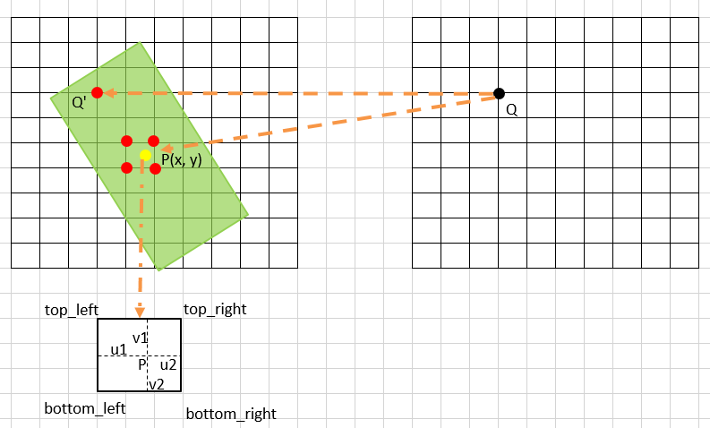
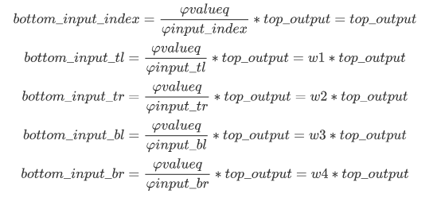
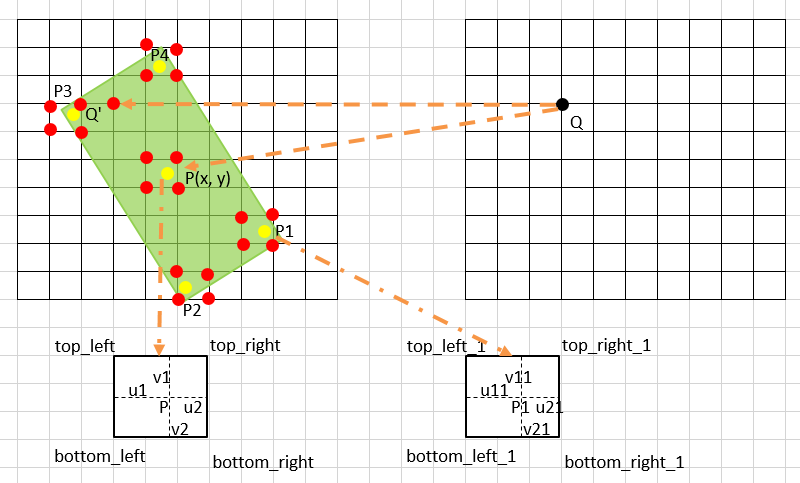
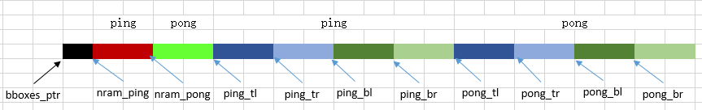
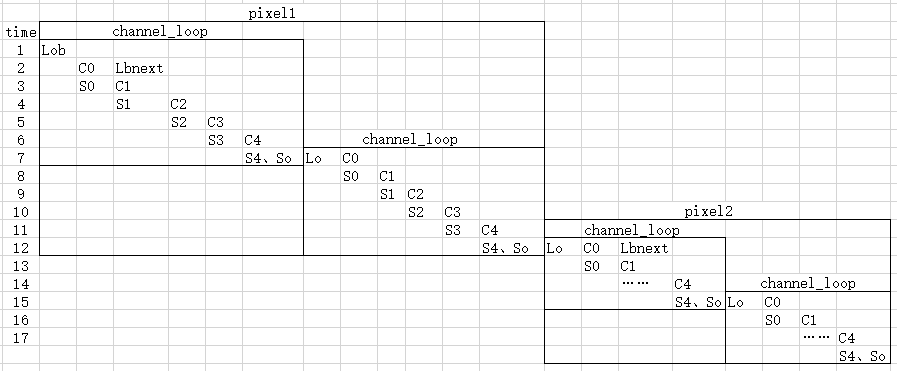

# RotatedFeatureAlignBackward 算子开发设计方案

* #### 文档基本信息

| 算子名称      | RotatedFeatureAlignBackward                                   |
| ------------- | ------------------------------------------------------------ |
| 编制人 / 日期 | 涂德江 / 2022-09-28                                          |
| 审批人 / 日期 | 郑斌 / 2022-10-12                                            |

* #### 修改记录

| 版本号 | 修订人 | 修订日期   | 修订描述 |
| ------ | ------ | ---------- | -------- |
| v0.1  | 涂德江 | 2022-10-11 | 首次提交 |

* #### 内容描述

本文档为 `RotatedFeatureAlignBackward` 算子的设计文档，包括需求分析、接口设计、方案设计、性能优化记录和方案实施部分。该算子为 `RotatedFeatureAlignForward` 算子的反向算子。

## 1 需求分析

### 1.1 算子需求分析

RotatedFeatureAlignBackward 算子是 RotatedFeatureAlignForward 算子的反向，算子的功能是根据 output 的梯度，计算 input 的梯度。

| 算子功能简介           | RotatedFeatureAlignForward的反向算子，计算 input 的梯度                   |
| ---------------------- | ------------------------------------------------------------ |
| 需求来源               | mmcv                                                         |
| 应用网络               | MMRotate                                                     |
| 输入数据类型           | top_output、bboxes 支持 half 和 float 类型；<br>spatial_scale 的数据类型为 float；<br>points 的数据类型为 int |
| 输入Shape              | top_output: [batch, height, width, channels]；<br> bboxes: [batch, height, width, 5] |
| 输入Layout             | top_output: NHWC；<br>bboxes: ARRAY；<br>spatial_scale、points 均为标量 |
| 输出数据类型           | bottom_input 支持 half，float 类型                                                  |
| 输出shape              | bottom_input: [batch, height, width, channels]                                      |
| 输出Layout             | bottom_input: NHWC                                                         |
| 是否需要支持原位       | 否                                                           |
| 是否需要支持stride机制 | 否                                                           |
| 是否需要支持广播       | 否                                                           |
| 0元素检查是否直接返回  | 是，返回 MLUOP_STATUS_BAD_PARAM |

### 1.2 算子功能和应用场景描述

该反向算子主要应用于旋转目标检测网络中进行梯度回传，根据输出的梯度、输入特征图和旋转锚点框中采样点的位置信息，得到输入特征图的梯度。

- 梯度计算

假设 bboxes 针对每个像素的位置信息为（y，x，hb，wb，a），其中 x 和 y 为锚点框的中心点坐标，hb 和 wb 为锚点框的高和宽，a 为锚点框的旋转角。现对输出梯度 top_output 中某个像素 Q 进行梯度计算得到输入特征图的梯度 bottom_input。

1）当 points = 1 时，只利用锚点框中心点 P 的位置信息进行梯度计算



前向计算过程：

图中，黄色点 P:(x，y) 为锚点框中心点坐标，由于 P 点不一定落在像素整数坐标位置上，因此需要计算 P 点邻近的四个整数像素点位置进行双线性插值计算 P 点的像素值。这里将 P 点的左上角位置 top_left 点的像素值定为 input[tl]，相应的权重为 w1 = v2 * u2；将 P 点的右上角位置 top_right 点的像素值定为 input[tr]，相应的权重为 w2 = v2 * u1；将 P 点的左下角位置 bottom_left 点的像素值定为 input[bl]，相应的权重为 w3 = v1 * u2；将 P 点的右下角位置 bottom_right 点的像素值定为 input[br]，相应的权重为 w4 = v1 * u1, 将Q 点在 input 上的像素值定位像素值定为 input[index]。这样可得到 Q 点像素值 valueq:

valueq = input[index] + input[tl] \* w1 + input[tr] \* w2 + input[bl] \* w3 + input[br] \* w4

反向计算过程：

分别对 input[index]、input[tl]、input[tr]、input[bl]、input[br] 进行梯度计算，得



其中，bottom_input_index 表示 input[index] 处导数、bottom_input_tl 表示 input[tl] 处导数、bottom_input_tr 表示 input[tr] 处导数、bottom_input_bl 表示 input[bl] 处导数、bottom_input_br 表示 input[br] 处导数。

2）当 points = 5 时，利用锚点框中心点 P 和周围四个采样点 P1、P2、P3、P4 的位置信息进行梯度计算



图中, 黄色点 P：(x，y) 为锚点框中心点坐标，其它四个点坐标通过 P 点的计算方式为：

P1：(x + wb / 2 \* cosf(a) - hb / 2 \* sinf(a)，y + w / 2 \* consf(a) + hb / 2 \* sinf(a))
 
P2：(x - wb / 2 \* cosf(a) - hb / 2 \* sinf(a)，y - w / 2 \* consf(a) + hb / 2 \* sinf(a))

P3：(x - wb / 2 \* cosf(a) + hb / 2 \* sinf(a)，y - w / 2 \* consf(a) - hb / 2 \* sinf(a))

P4：(x + wb / 2 \* cosf(a) - hb / 2 \* sinf(a)，y + w / 2 \* consf(a) - hb / 2 \* sinf(a))

前向计算过程：

分别对 P、P1、P2、P3、P4 这五个点进行双线性插值计算每个点对应的像素值，以 P1 点为例子，如上图左侧，将 P1点的左上角位置 top_left_1 点的像素值定为 input[tl1]，相应的权重为 w11 = v21 * u21；将 P1 点的右上角位置 top_right_1 点的像素值定为 input[tr1]，相应的权重为 w21 = v21 * u11；将 P1 点的左下角位置 bottom_left_1 点的像素值定为 input[bl1]，相应的权重为 w31 = v11 * u21；将 P1 点的右下角位置 bottom_right_1 点的像素值定为 input[br1]，相应的权重为 w41 = v11 * u11。则可以得到 P1 点像素值 valuep1:

valuep1 = input[tl1] * w11 + input[tr1] * w21 + input[bl1] * w31 + input[br1] * w41

同理可以得到：valuep2，valuep3，valuep4，valuep，这样 Q 点的像素值为 valueq = input[index] + valuep + valuep1 + valuep2 + valuep3 + valuep4

反向计算过程：

分别对 input[index]、input[tl]、input[tr]、input[bl]、input[br] 、input[tl1]、input[tr1]、input[bl1]、input[br1]、input[tl2]、input[tr2]、input[bl2]、input[br2]、input[tl3]、input[tr3]、input[bl3]、input[br3]、input[tl4]、input[tr4]、input[bl4]、input[br4] 进行求导计算，其公式和 points = 1 的公式基本相同。只是将 points = 1 的公式循环执行了五次。

- 算子说明

当数据中存在 nan / inf 时，需要将输入分为只包含 nan、只包含 inf、同时包含 nan 和 inf 这三种情况。

###  1.3 算子输入输出参数要求

| 参数          | 语义                       | 类型（输入/输出） | 支持类型             | 物理布局 | 规模限制 |
| ------------- | -------------------------- | ----------------- | -------------------- | -------- | -------- |
| handle        | mluOp 上下文的指针           | 输入              | mluOpHandle_t         | -        | 无       |
| top_output_desc    | 输入梯度特征图的描述信息       | 输入              | mluOpTensorDescriptor | -        | 无       |
| top_output         | 输入梯度特征图的指针           | 输入              | half ，float         | NHWC     |  bottom_input 和 top_output 每一维度必须相等    |
| bboxes_desc   | 锚点框的描述信息           | 输入              | mluOpTensorDescriptor | -        | 无       |
| bboxes        | 锚点框的指针               | 输入              | half，float          | ARRAY    |  bottom_input 和 bboxes 前三维度必须相等；bboxes 的最后一维度必须等于 5        |
| spatial_scale | 输入特征图相较于原图的比率 | 输入              | float                | scalar       | 无       |
| points        | 采样点数量                 | 输入              | int                  | scalar        | 无       |
| bottom_input_desc   | 输出梯度特征图的描述信息       | 输入              | mluOpTensorDescriptor | -        | 无       |
| bottom_input        | 输出梯度特征图的指针           | 输出              | half，float          | NHWC     | 无       |

### 1.4 算子限制

`注意`：凡是没有在此处列出，但最终被框架检测到的算子限制，均会被视为算子 bug。

在此处列出的限制，算子内做好防呆。

| 限制类型     | 详细说明                                                     |
| ------------ | ------------------------------------------------------------ |
| 数据类型限制 | top_output、bboxes 和 bottom_input 的数据类型必须相同，并且仅支持 float 或 half 类型 |
| 布局限制     | 仅支持 layout 为 NHWC                    |
| 规模限制     | bottom_input 和 top_output 每一维度必须相等；bottom_input 和 bboxes 前三维度必须相等；bboxes 的最后一维度必须等于 5 |
| 原位限制     | 不支持原位                                                   |
| stride限制   | 不支持 stride 机制                                             |
| 数据限制     | top_output 支持 nan、inf 数据；bboxes 和 spatial_scale 不支持 nan、inf数据; points的取值只能是 1 或 5 |

### 1.5 验收标准

#### 1.5.1 精度验收标准

- 300系列的评价公式为 `diff1、diff2、diff4`，验收标准使用动态阈值[10, 10, 1]。
- 200系列的评价公式为 `diff1、diff2`，验收标准采用动态阈值[10, 10]。
- 算子使用到了 atomic_add, 如果测例在 200 系列上不通过，可验证 300 系列上是否可以通过。
- 因为 fma 不对齐问题，如果测例在300系列上不通过，需要将测例更改为 cpu 模式，此时采用静态阈值：half: 1e-3，float: 1e-5。 

#### 1.5.2 性能验收标准

- 网络中使用到的规模性能优于或至少与竞品性能持平。 
- 测试报告：

## 2 算子接口设计

### 2.1 参考接口

- CUDA

```c++
void RotatedFeatureAlignBackwardCUDAKernelLauncher(const Tensor top_grad,
                                                   const Tensor best_bboxes,
                                                   const float spatial_scale,
                                                   const int points,
                                                   Tensor bottom_grad)
```

### 2.2 接口设计

```c++
mluOpStatus_t MLUOP_WIN_API mluOpRotatedFeatureAlignBackward(const mluOpHandle_t handle,
                                                             const mluOpTensorDescriptor_t top_output_desc,
                                                             const void *top_output,
                                                             const mluOpTensorDescriptor_t bboxes_desc,
                                                             const void *bboxes,
                                                             const float spatial_scale,
                                                             const int points,
                                                             const mluOpTensorDescriptor_t bottom_input_desc,
                                                             void *bottom_input)
```

## 3 实现方案设计

### 3.1 实现方案

- 计算说明

1）top_output 中 C 通道的数据对应同一个 bboxes 位置信息，因此可以进行整 C 数据计算，当 C 很大超出 nram 空间划分的每份的内存时，需要对 C 进行拆分；

2）当 points = 5 时，其计算方式和 points = 1 一样，因此采用 for 循环处理即可；

3）任务规模：batch * height * width，将任务规模分配到 core 上，core 处理的每个任务（整 C 的数据）记作 pixel;

- nram 空间划分

将 nram 空间均匀划分 SEG_NUM 份：

SEG_NUM = (1 + 4 ) * 2 + 1

其中，第一个 1 表示用于存储 top_output 中梯度数据部分，4 表示用于存储一个采样点映射到 bottom_input 中 4 个位置的像素数据内存部分，2 表示进行 ping-pong 流水的内存分配，第二个 1 表示存储 bboxes 最后一维度数据内存，如图所示：



- 计算过程

以 points = 5 为例，该算子主要对每个 core 处理的 pixel 个数、每个 pixel 的 C 维度数据和 points 个数进行流水计算，如下图所示：



其中，pixel1、pixel2 …… 为每个 core 处理的任务数量，Lob 为加载一个 pixel 位置的 top_output 数据和对应的 bboxes 信息，Lo 为加载的一个 pixel 位置的 top_output 数据，channel_loop 为对 C 通过拆分的份数(见伪代码)，So 是对 index 位置进行 atomic_add 操作，C0、S0、C1 S1 …… 为 points = 5 的五次计算。整个计算过程可以梳理为：

step1：加载 top_output 中 C 通道数据到 nram_ping，并 atomic_add 到 bottom_input 中对应位置，加载 bboxes 中位置信息到 bboxes_ptr(64 字节对齐)。<br>
setp2: 根据 bboxes_ptr 中信息计算 P 点在 bottom_input 四领域的权重，分别为：w1、w2、w3、w4。
step3：通过 Q 点计算 P 点在 bottom_input 四领域中梯度数据到 ping_tl、ping_tr、ping_bl、ping_br，如果一次无法加载 C 中数据，需对 C 通道进行拆分<br>
step4：将 step3 中的计算结果通过 atomic_add 方式存储到 bottom_input 中<br>
step5：当 points = 5 时，循环处理 step2、step3<br>
step6：对以上计算执行流水操作

### 3.2 伪代码实现（可选）

```c++
int type_align = NFU_ALIGN_SIZE / sizeof(T);
int nram_max_deal_num = MAX_NRAM_SIZE / sizeof(T);
int nram_split_deal_num = FLOOR_ALIGN((nram_max_deal_num - offset_rois) / SEG_NUM, type_align); 
int channel_rem = channels % nram_split_deal_num;
int channel_loops = channels / nram_split_deal_num + (channel_rem != 0 ? 1 : 0);
int pixel_first = taskId;
int pixel_end = batches * height * width;

int pixel_i = 0; // 记录一个core计算的pixel个数
for (int pixel_index = pixel_first; pixel_index < pixel_end; pixel_index += taskDim) {
  pixel_i ++;
  // 对 C 拆分     
  for (int channel_loop_index = 0; channel_loop_index < channel_loops; ++channel_loop_index) {
    // 只执行一次
    if (channel_loop_index == 0 && pixel_i == 1){
      load(); // load bboxes数据到bboxes_ptr
      // 计算 采样点坐标
      load(); // 加载 top_output 中 C 数据到 nram_ping
      bilinearInterpolateGradient(px,py); // 双线性插值

      commpute(); // compute Q点映射到P点四领域中 C 数据到 ping_tl、ping_tr、ping_bl、ping_br
      if (pixel_index + taskDim < pixel_end) {
        load(); // load next bboxes 防止流水打断
      } 
    }
    for(int i = 1; i < points; i++){
      bilinearInterpolateGradient(px,py); // 双线性插值
      compute();  // 4次乘法
      __mluOp_atomic_add_reduce(); // 4次store	
      __asm__ volatile("sync;");
      swap(nram_ping, nram_pong);
    }
    // S4
    __mluOp_atomic_add_reduce();
    // store 原位
    __mluOp_atomic_add_reduce();
    // 处理下一个 Lo、C0
    if (channel_loop_index + 1 <= channel_loops){
        load(); // 加载 top_output 中 rem C 数据到 nram_ping
        bilinearInterpolateGradient(px,py); // 双线性插值
        compute(); // compute Q点映射到P点四领域中 rem C 数据到 pong_tl、pong_tr、pong_bl、pong_br 
    } else if(pixel_index + taskDim < pixel_end){
        // load 下一个pixel中的 Lob C0
        // 计算 采样点坐标
        load(); // 加载 top_output 中 C 数据到 nram_pong
        bilinearInterpolateGradient(px,py); // 双线性插值
        commput(); // compute Q点映射到P点四领域中 C 数据到 ping_tl、ping_tr、ping_bl、ping_br 
        if (pixel_index + 2 * taskDim < pixel_end) {
          load(); // load bboxes数据到bboxes_ptr
        }
    }
    __asm__ volatile("sync;");
    swap(nram_ping, nram_pong);
    swap(nram_pong, nram_ping);
}
```

### 3.3 拆分（任务拆分，多核拆分）

- 对 top_output 中数据进行拆分，共计 batch * height * width * channels 个数据；
- 每次处理一整个通道的数据，因此需要处理 batch * height * width 次；
- 当无法一次处理整个通道的数据时，需要对通道进行拆分，每次处理 nram 能够容纳的最大 C 的整数倍数据。

```c++
int channel_rem = channels % nram_split_deal_num;
int channel_loops = channels / nram_split_deal_num + (channel_rem != 0 ? 1 : 0);
int pixel_first = taskId;
int pixel_end = batches * height * width;
// 对 batch * height * width 拆分
for (int pixel_index = pixel_first; pixel_index < pixel_end; pixel_index += taskDim) {
  // 对 C 拆分     
  for (int channel_loop_index = 0; channel_loop_index < channel_loops; ++channel_loop_index) {
  }
}
```

### 3.4 性能优化设计

- 资源分配

| 表项 | 分配策略                                         |
| ---- | ------------------------------------------------ |
| NRAM | 将 NRAM 空间减去 bboxes 数据空间（64字节对齐），再均分 10 等份，详细见 3.1 节 nram 空间划分 |

- 流水设计

采用 LCS 三级流水设计，做好 IO 和 compute 指令并行，尽量采用向量化操作，减少标量操作次数。

### 3.5 方案理论性能

IO_TIME = 理论 IO_SIZE / 理论带宽

CP_TIME = 理论 OPS / 理论峰值

方案理论性能为：max(IO_TIME，CP_TIME)；

### 3.6 可维护性设计

1、代码中加入必要的 log 信息（如输入的规模、数据类型、layout 等）

2、对重要的函数命名、变量命名都要有充分的解释

3、避免魔鬼数字，对于确定的数字尽量使用公共宏来替代

### 3.7 测试用例设计

框架在需求列表中给出的算子在网络中用到的规模：

|case_name|top_output|bboxes|bottom_input|spatial_scale|points|
|---------|-----|------|------|-------------|------|
|case1|[2,4,4,30]|[2,4,4,5]|[2,4,4,30]|0.25|5|
|case2|[2,50,50,600]|[2,50,50,5]|[2,50,50,600]|0.125|5|
|case3|[2,4,40,30]|[2,4,40,5]|[2,4,40,30]|0.25|1|
|case4|[2,100,50,200]|[2,100,50,5]|[2,100,50,200]|0.125|1|

说明：这里 case 的维度是 NHWC；竞品的维度是 NCHW；

- 算子竞品性能分析

|平台|框架版本|数据类型|规模|计算效率(%)|IO效率(%)|Hardware time(us)|
|---|-------|-------|---|----------|-----|-----------------|
|  Tesla V100-SXM2-16GB |  Pytorch 1.6.0     |   float32    |  case1  |     0.609536     |  2.567579 |   20.135668   |
|   |     |  float32     |   case2 |     15.123138    |     25.035126         |    3.894436      |
|   |     |   float32    |  case3 |     2.92085     |  7.320871 |    16.56448      |
|   |       |   float32   |  case4  |    6.28187     | 13.693896  |    1.259747     |
|   |      |  float16     | case1   |      0.844285    |  2.779546 |    119.74848      |
|   |     |   float16    | case2   |      19.184389    |     44.079021    |     234.251284      |
|   |      |   float16    |  case3  |    4.51354      |  12.363629 |    1.966139    |
|   |     |   float16    | case4   |     10.6198892     |  24.001917 |     156.9744531     |

边界 case:

待补充

### 3.8 算子防呆检查

参考链接：[MLUOP文档、防呆与打印](http://wiki.cambricon.com/pages/viewpage.action?pageId=72502072) 

- 列出算子需要做的防呆

1、指针为空防呆；
 ```c++
  PARAM_CHECK("[mluOpRotatedFeatureAlignBackward]", handle != NULL);
  PARAM_CHECK("[mluOpRotatedFeatureAlignBackward]", top_output_desc != NULL);
  PARAM_CHECK("[mluOpRotatedFeatureAlignBackward]", bboxes_desc != NULL);
  PARAM_CHECK("[mluOpRotatedFeatureAlignBackward]", bottom_input_desc != NULL);
  ```
 2、0元素检查防呆，VLOG(5)打印信息，是否返回与框架沟通；
 ```c++
  if (mluOpGetTensorElementNum(bboxes_desc) == 0 || mluOpGetTensorElementNum(top_output_desc) == 0 ||
      mluOpGetTensorElementNum(bottom_input_desc) == 0) {
    VLOG(5) << "[mluOpRotatedFeatureAlignBackward] Zero element tensor failure.";
    return MLUOP_STATUS_BAD_PARAM;
  }
  ```
 3、涉及workspace算子对于workspace_size的检查防呆；
    无workspace
 4、是否需要对输入输出支持的dtype、layout、dim以及shape进行防呆；
```c++
  PARAM_CHECK("[mluOpRotatedFeatureAlignBackward]", top_output_desc->dim == 4);
  PARAM_CHECK("[mluOpRotatedFeatureAlignBackward]", bboxes_desc->dim == 4);
  PARAM_CHECK("[mluOpRotatedFeatureAlignBackward]", bottom_input_desc->dim == 4);

  PARAM_CHECK("[mluOpRotatedFeatureAlignBackward]",
              top_output_desc->dtype == MLUOP_DTYPE_FLOAT || top_output_desc->dtype == MLUOP_DTYPE_HALF);
  PARAM_CHECK("[mluOpRotatedFeatureAlignBackward]", top_output_desc->dtype == bboxes_desc->dtype);
  PARAM_CHECK("[mluOpRotatedFeatureAlignBackward]", top_output_desc->dtype == bottom_input_desc->dtype);

  PARAM_CHECK("[mluOpRotatedFeatureAlignBackward]", top_output_desc->layout == MLUOP_LAYOUT_NHWC);
  PARAM_CHECK("[mluOpRotatedFeatureAlignBackward]", bottom_input_desc->layout == MLUOP_LAYOUT_NHWC);
```

 5、算子存在的自身的相关参数防呆。
 ```c++
 for (int i = 0; i < top_output_desc->dim; i++) {
    if (top_output_desc->dims[i] != bottom_input_desc->dims[i]) {
      LOG(ERROR) << "[mluOpRotatedFeatureAlignBackward] Check failed: top_output_desc->dims[" << i
                 << "] should be equal to bottom_input_desc->dims[" << i << "].";
      return MLUOP_STATUS_BAD_PARAM;
    }
  }

  for (int i = 0; i < top_output_desc->dim - 1; i++) {
    if (top_output_desc->dims[i] != bboxes_desc->dims[i]) {
      LOG(ERROR) << "[mluOpRotatedFeatureAlignBackward] Check failed: top_output_desc->dims[" << i
                 << "] should be equal to bboxes_desc->dims[" << i << "].";
      return MLUOP_STATUS_BAD_PARAM;
    }
  }
  PARAM_CHECK("[mluOpRotatedFeatureAlignBackward]", bboxes_desc->dims[3] == 5);
  PARAM_CHECK("[mluOpRotatedFeatureAlignBackward]", points == 1 || points == 5);
  PARAM_CHECK("[mluOpRotatedFeatureAlignBackward]", spatial_scale > 0);
```

6、large tensor防呆
```c++
  const size_t top_output_element_num = mluOpGetTensorElementNum(top_output_desc);
  const size_t bottom_input_element_num = mluOpGetTensorElementNum(bottom_input_desc);
  const size_t bboxes_element_num = mluOpGetTensorElementNum(bboxes_desc);

  TENSOR_NUM_CHECK("[mluOpRotatedFeatureAlignBackward]", top_output_element_num, LARGE_TENSOR_NUM, "");
  TENSOR_NUM_CHECK("[mluOpRotatedFeatureAlignBackward]", bottom_input_element_num, LARGE_TENSOR_NUM, "");
  TENSOR_NUM_CHECK("[mluOpRotatedFeatureAlignBackward]", bboxes_element_num, LARGE_TENSOR_NUM, "");
```

## 4 算子性能优化记录

### 4.1 当前存在问题的规模说明

### 4.2 已经过优化的规模说明

此项仅填写未在4.1中列出的规模，否则填入4.1.

实用链接：[算子公共优化点整理](http://wiki.cambricon.com/pages/viewpage.action?pageId=42948442)

## 5 方案实施

### 5.1 方案开发计划

算子排期修改：

1）9.28 算子调研

2）9.29  - 10.13算子方案设计

3）10.14算子方案评审

4）10.17  算子generator端代码开发

5）10.18 算子gtest端代码开发

6）10.19 算子host端代码开发

7）10.20- 10.21 算子kernel端代码开发

8）10.24 - 10.25 大规模测试

9）10.26 - 10.27 提交 MR + 代码 review

10）10.31 算子入库

### 5.2 风险分析


