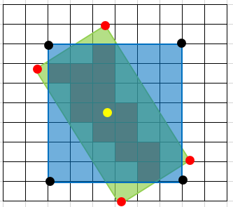
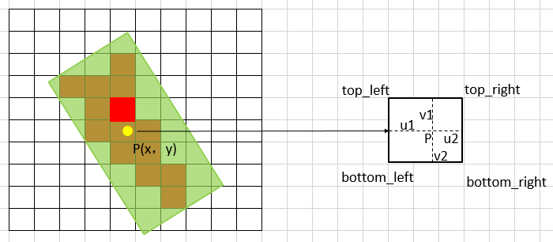
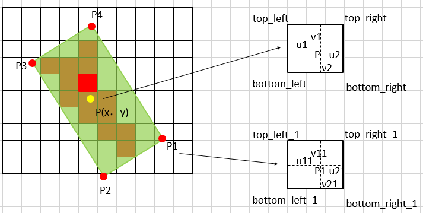
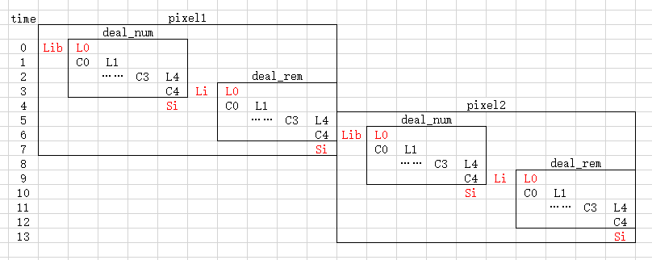

# RotatedFeatureAlignForward 算子开发设计方案

* #### 文档基本信息

| 算子名称      | RotatedFeatureAlignForward                                  |
| ------------- | ------------------------------------------------------------ |
| 编制人 / 日期 | 涂德江 / 2022-08-30                                          |
| 审批人 / 日期 | 郑斌 / 2022-09-05                                             |
| 审批人 / 日期 | 王远 / 2022-09-05                                             |
| 审批人 / 日期 | 董成威 / 2022-09-05                                             |

* #### 修改记录

| 版本号 | 修订人 | 修订日期   | 修订描述 |
| ------ | ------ | ---------- | -------- |
| v0.1  | 涂德江 | 2022-08-30 | 首次提交 |
| V1.0 | 涂德江|   2022-09-20|  |

* #### 内容描述

本文档为 `RotatedFeatureAlignForward` 算子的设计文档，包括需求分析、接口设计、方案设计、性能优化记录和方案实施部分。

## 1 需求分析

### 1.1 算子需求分析

RotatedFeatureAlignForward 算子功能是：利用旋转锚点框中的位置信息对输入特征图中的像素值进行特征插值矫正，逐像素的重建输入特征图特征信息，该特征插值方法是根据旋转锚点的位置信息进行一次或是五次双线性插值。

| 算子功能简介           | 根据旋转锚点位置信息逐像素重建特征图                   |
| ---------------------- | ------------------------------------------------------------ |
| 需求来源               | mmcv                                                         |
| 应用网络               | MMRotate                                                     |
| 输入数据类型           | input、bboxes 支持 half 和 float 类型；<br>spatial_scale 的数据类型为 float；<br>points 的数据类型为 int |
| 输入Shape              | input: [batch, height, width, channels]；<br> bboxes: [batch, height, width, 5] |
| 输入Layout             | input: NHWC；<br>bboxes: ARRAY；<br>spatial_scale、points 均为标量 |
| 输出数据类型           | half，float                                                  |
| 输出shape              | [batch, height, width, channels]                                      |
| 输出Layout             | NHWC                                                         |
| 是否需要支持原位       | 否                                                           |
| 是否需要支持stride机制 | 否                                                           |
| 是否需要支持广播       | 否                                                           |
| 0元素检查是否直接返回  | 是，返回 MLUOP_STATUS_BAD_PARAM |

### 1.2 算子功能和应用场景描述

该算子主要应用于旋转目标检测网络中对提取的特征图进行逐像素重构，相比水平锚点框（下图浅蓝色），旋转锚点框（下图浅绿色）对旋转目标（下图红色）特征的重构更加紧凑。



- 特征插值计算

假设 bboxes 针对每个像素的位置信息为（x，y，hb，wb，a），其中 x 和 y 为锚点框的中心点坐标，hb 和 wb 为锚点框的高和宽，a 为锚点框的旋转角。现对特征图中某个像素（深红色像素块）对应的锚点框（浅绿色）进行特征插值计算。

1）当 points = 1 时，取锚点框中心点 P 的位置信息进行计算



图中，黄色点 P: (x ，y ) 为锚点框中心点坐标，由于 P 点不一定落在整数像素坐标位置上，如图右侧，因此需要计算 P 点最邻近的四个整数点像素位置进行双线性插值计算 P 点的像素值。将 P 点的左上角位置 top_left 点的坐标索引定为 tl，相应的权重为 w1 = v2 * u2；将 P 点的右上角位置 top_right 点的坐标索引定为 tr，相应的权重为 w2 = v2 * u1；将 P 点的左下角位置 bottom_left 点的坐标引定为 bl，相应的权重为 w3 = v1 * u2；将 P 点的右下角位置 bottom_right 点的坐标索引定为 br，相应的权重为 w4 = v1 * u1。由双线性插值定义可以得到 P 点像素值 valuep:

valuep = input[tl] \* w1 + input[tr] \* w2 + input[bl] \* w3 + input[br] \* w4

2）当 points = 5 时，取锚点框中心点 P 和周围四个点 P1、P2、P3、P4 的位置信息进行计算



图中, 黄色点 P：(x，y) 为锚点框中心点坐标，其它四个点坐标通过 P 点的计算方式为：

P1：(x + wb / 2 \* cosf(a) - hb / 2 \* sinf(a)，y + w / 2 \* consf(a) + hb / 2 \* sinf(a))
 
P2：(x - wb / 2 \* cosf(a) - hb / 2 \* sinf(a)，y - w / 2 \* consf(a) + hb / 2 \* sinf(a))

P3：(x - wb / 2 \* cosf(a) + hb / 2 \* sinf(a)，y - w / 2 \* consf(a) - hb / 2 \* sinf(a))

P4：(x + wb / 2 \* cosf(a) - hb / 2 \* sinf(a)，y + w / 2 \* consf(a) - hb / 2 \* sinf(a))

分别对 P、P1、P2、P3、P4 这五个点进行双线性插值计算每个点对应的像素值，以 P1 点为例子，如上图左侧，将 P1点的左上角位置 top_left_1 点的坐标索引定为 tl1，相应的权重为 w11 = v21 * u21；将 P1 点的右上角位置 top_right_1 点的坐标索引定为 tr1，相应的权重为 w21 = v21 * u11；将 P1 点的左下角位置 bottom_left_1 点的坐标索引定为 bl1，相应的权重为 w31 = v11 * u21；将 P1 点的右下角位置 bottom_right_1 点的坐标索引定为 br1，相应的权重为 w41 = v11 * u11。由双线性插值定义可以得到 P1 点像素值 valuep1:

valuep1 = input[tl1] * w11 + input[tr1] * w21 + input[bl1] * w31 + input[br1] * w41

同理可以得到：valuep2，valuep3，valuep4，valuep。

3）output 结果输出

```c++
if (points == 1){
    output[index] = input[index] + valuep
}
if (points == 5){
    output[index] = input[index] + valuep + valuep1 + valuep2 + valuep3 + valuep4 
}
```

- 算子说明

当数据中存在 nan / inf 时，需要将输入分为只包含 nan、只包含 inf、同时包含 nan 和 inf 这三种情况。

###  1.3 算子输入输出参数要求

| 参数          | 语义                       | 类型（输入/输出） | 支持类型             | 物理布局 | 规模限制 |
| ------------- | -------------------------- | ----------------- | -------------------- | -------- | -------- |
| handle        | mluOp 上下文的指针           | 输入              | mluOpHandle_t         | -        | 无       |
| input_desc    | 输入特征图的描述信息       | 输入              | mluOpTensorDescriptor | -        | 无       |
| input         | 输入特征图的指针           | 输入              | half ，float         | NHWC     |  见 1.4     |
| bboxes_desc   | 锚点框的描述信息           | 输入              | mluOpTensorDescriptor | -        | 无       |
| bboxes        | 锚点框的指针               | 输入              | half，float          | ARRAY    | 见 1.4        |
| spatial_scale | 输入特征图相较于原图的比率 | 输入              | float                | scalar       | 无       |
| points        | 采样点数量                 | 输入              | int                  | scalar        | 无       |
| output_desc   | 输出特征图的描述信息       | 输入              | mluOpTensorDescriptor | -        | 无       |
| output        | 输出特征图的指针           | 输出              | half，float          | NHWC     | 无       |

### 1.4 算子限制

`注意`：凡是没有在此处列出，但最终被框架检测到的算子限制，均会被视为算子 bug。

在此处列出的限制，算子内做好防呆。

| 限制类型     | 详细说明                                                     |
| ------------ | ------------------------------------------------------------ |
| 数据类型限制 | input、bboxes 和 output 的数据类型必须相同，并且仅支持 float 或 half 类型 |
| 布局限制     | 仅支持 layout 为 NHWC 的 input 和 output                    |
| 规模限制     | input 和 output 每一维度必须相等；input 和 bboxes 前三维度必须相等；bboxes 的最后一维度必须等于 5 |
| 原位限制     | 不支持原位                                                   |
| stride限制   | 不支持 stride 机制                                             |
| 数据限制     | input 支持 nan、inf 数据；bboxes 和 spatial_scale 不支持 nan、inf数据; points的取值只能是 1 或 5 |

### 1.5 验收标准

#### 1.5.1 精度验收标准

- 300系列的评价公式为 `diff1、diff2、diff4`，验收标准使用动态阈值[10, 10, 1]。
- 200系列的评价公式为 `diff1、diff2`，验收标准采用动态阈值[10, 10]。
- 因为 fma 不对齐问题，如果测例在300系列上不通过，需要将测例更改为 cpu 模式，此时采用静态阈值：half: 1e-3，float: 1e-5。 

#### 1.5.2 性能验收标准

- 网络中使用到的规模性能优于或至少与竞品性能持平。 
- 测试报告：

## 2 算子接口设计

### 2.1 参考接口

- CUDA

```c++
void RotatedFeatureAlignForwardCUDAKernelLauncher(const Tensor features,
                                                  const Tensor best_bboxes,
                                                  const float spatial_scale,
                                                  const int points,
                                                  Tensor output)
```

### 2.2 接口设计

```c++
mluOpStatus_t MLUOP_WIN_API mluOpRotatedFeatureAlignForward(const mluOpHandle_t handle,
                                                            const mluOpTensorDescriptor_t input_desc,
                                                            const void *input,
                                                            const mluOpTensorDescriptor_t bboxes_desc,
                                                            const void *bboxes,
                                                            const float spatial_scale,
                                                            const int points,
                                                            const mluOpTensorDescriptor_t output_desc,
                                                            void *output)
```

## 3 实现方案设计

### 3.1 实现方案

- 计算说明

1）input 中 C 通道的数据对应同一个 bboxes 位置信息，因此可以进行整 C 数据计算，当 C 很大超出 nram 空间划分的每份的内存时，需要对 C 进行拆分；

2）当 points = 5 时，其计算方式和 points = 1 一样，因此采用 for 循环处理即可；

3）将 batch * height * width 的数据量做为任务规模，将 batch * height * width 进行 core 划分；

- nram 空间划分

将 nram 空间均匀划分 sep_num 份：

sep_num = (1 + 4 ) * 2 + 1

其中，第一个 1 表示用于存储 input 当前要矫正的像素数据内存部分，累加后结果也放在该处，4 表示用于存储一个采样点映射到 input 中的 4C 像素数据内存部分，2 表示进行 ping-pong 流水的内存分配，第二个 1 表示存储 bboxes 最后一维度数据内存，如图所示：


- 计算过程

以 points = 5 为例，该算子可以通过对每个 core 处理的像素个数、每个像素个数 C 维度数据、每个数据对应的 bboxes 进行流水计算，如下图所示：



其中，pixel1、pixel2 …… 为每个 core 处理的整 C 对应的像素位置，Lib 为加载一个像素位置的 input 数据和对应的 bboxes 信息，Li 为加载的一个像素位置的 input 数据，deal_num为每次处理的 C 中的数据个数，Si 为存储计算结果，L0、C0、L1 …… 为 points = 5 的五次计算。整个计算过程可以梳理为：

step1：加载 input 中 C 通道数据到 nram_ping, 加载 P 点四领域像素位置中 C 通道数据到 ping_tl、ping_tr、ping_bl、ping_br，如果一次无法加载 C 中数据，需对 C 通道进行拆分<br>
step2：根据 ping_tl、ping_tr、ping_bl、ping_br 数据进行双线性插值计算 P 点在 C 通道的像素值<br>
step3：将 step2 中的计算结果累加到 nram_ping 中<br>
step4：当 points = 5 时，循环处理 step2、step3<br>
step5: 将 step4 中结果存储到 output 中<br>
step6：对 以上计算执行流水操作

### 3.2 伪代码实现（可选）

```c++
int type_align = NFU_ALIGN_SIZE / sizeof(T);
int nram_max_deal_num = MAX_NRAM_SIZE / sizeof(T);
int nram_split_deal_num = FLOOR_ALIGN((nram_max_deal_num - offset_rois) / SEG_NUM, type_align); 
int channel_rem = channels % nram_split_deal_num;
int channel_loops = channels / nram_split_deal_num + (channel_rem != 0 ? 1 : 0);
int pixel_first = taskId;
int pixel_end = batches * height * width;

int pixel_i = 0; // 记录一个core计算的pixel个数
for (int pixel_index = pixel_first; pixel_index < pixel_end; pixel_index += taskDim) {
  pixel_i ++;
  // 对 C 拆分     
  for (int channel_loop_index = 0; channel_loop_index < channel_loops; ++channel_loop_index) {
    // 只执行一次
    if (channel_loop_index == 0 && pixel_i == 1){
        load(); // load bboxes数据到bboxes_ptr
        // 计算 采样点坐标
        load(); // 加载 input 中 C 数据到 nram_ping
        bilinearInterpolate(px,py); // 双线性插值
        load(); // load P点四领域中 C 数据到 ping_tl、ping_tr、ping_bl、ping_br 
    }
    for(int i = 1; i < points; i++){
        bilinearInterpolate(px,py); // 双线性插值
		load();  // 4次load
		Compute(); // 4次乘法  4次加法	
        swap(nram_ping, nram_pong);
        __asm__ volatile("sync;");	
    }
    // 处理 C4 和下一个loop 的 Li、LO
    compute();
    if (channel_loop_index + 1 <= channel_loops){
        load(); // 加载 input 中 rem C 数据到 nram_ping
        bilinearInterpolate(px,py); // 双线性插值
        load(); // load P 点四领域中 rem C 数据到 pong_tl、pong_tr、pong_bl、pong_br 
    } else if(pixel_index + taskDim < pixel_end){
        // load 下一个pixel中的 Lib L0
        load(); // load bboxes数据到bboxes_ptr
        // 计算 采样点坐标
        load(); // 加载 input 中 C 数据到 nram_pong
        bilinearInterpolate(px,py); // 双线性插值
        load(); // load P点四领域中 C 数据到 ping_tl、ping_tr、ping_bl、ping_br 
    }
    swap(nram_ping, nram_pong);
    swap(nram_pong, nram_ping);
    __asm__ volatile("sync;");
    store(); // 保存输出nram_pong
}
```

### 3.3 拆分（任务拆分，多核拆分）

- 对 input 中数据进行拆分，共计 batch * height * width * channels 个数据；
- 每次处理一整个通道的数据，因此需要处理 batch * height * width 次；
- 当无法一次处理整个通道的数据时，需要对通道进行拆分，每次处理nram能够容纳的最大 C 的整数倍数据。

```c++
int channel_rem = channels % nram_split_deal_num;
int channel_loops = channels / nram_split_deal_num + (channel_rem != 0 ? 1 : 0);
int pixel_first = taskId;
int pixel_end = batches * height * width;
// 对 batch * height * width 拆分
for (int pixel_index = pixel_first; pixel_index < pixel_end; pixel_index += taskDim) {
  // 对 C 拆分     
  for (int channel_loop_index = 0; channel_loop_index < channel_loops; ++channel_loop_index) {
  }
}
```

### 3.4 性能优化设计

- 资源分配

| 表项 | 分配策略                                         |
| ---- | ------------------------------------------------ |
| NRAM | 将NRAM空间减去bboxes数据空间（64字节对齐），再均分10等份，详细见3.1节 nram空间划分 |

- 流水设计

采用 LCS 三级流水设计，做好 IO 和 compute 指令并行，尽量采用向量化操作，减少标量操作次数。

### 3.5 方案理论性能

IO_TIME = 理论IO_SIZE / 理论带宽

CP_TIME = 理论OPS / 理论峰值

方案理论性能为：max(IO_TIME，CP_TIME)；

### 3.6 可维护性设计

1、代码中加入必要的 log 信息（如输入的规模、数据类型、layout 等）

2、对重要的函数命名、变量命名都要有充分的解释

3、避免魔鬼数字，对于确定的数字尽量使用公共宏来替代

### 3.7 测试用例设计

框架在需求列表中给出的算子在网络中用到的规模：

|case_name|input|bboxes|output|spatial_scale|points|
|---------|-----|------|------|-------------|------|
|case1|[2,4,4,3]|[2,4,4,5]|[2,4,4,3]|0.25|1|
|case2|[2,100,125,256]|[2,100,125,5]|[2,100,125,256]|0.125|1|
|case3|[2,4,4,3]|[2,4,4,5]|[2,4,4,3]|0.25|5|
|case4|[2,100,125,256]|[2,100,125,5]|[2,100,125,256]|0.125|5|

说明：这里 case 的维度是 NHWC；竞品的维度是 NCHW；

- 算子竞品性能分析

|平台|框架版本|数据类型|规模|计算效率(%)|IO效率(%)|Hardware time(us)|
|---|-------|-------|---|----------|-----|-----------------|
|  Tesla V100-SXM2-16GB |  Pytorch 1.9.0     |   float32    |  case1  |     0.01     |  0.18 |   3.14       |
|   |     |  float32     |   case2 |     25.431     | 64.553  |     408.2     |
|   |     |   float32    |  case3 |    0.1145      | 0.1906  |     10.219     |
|   |       |   float32   |  case4  |      57.344    |  62.335 |   481.748       |
|   |      |  float16     | case1   |     0.0799     |  0.1525 |     6.292     |
|   |     |   float16    | case2   |     75.463     | 45.132  |   179.15       |
|   |      |   float16    |  case3  |     0.1582     |  0.1153 |    10.2819      |
|   |     |   float16    | case4   |    89.624      | 27.9044  |     644.622     |

边界 case:

待补充

### 3.8 算子防呆检查

参考链接：[MLUOP文档、防呆与打印](http://wiki.cambricon.com/pages/viewpage.action?pageId=72502072) 

- 列出算子需要做的防呆

1、指针为空防呆；
 ```c++
  PARAM_CHECK("[mluOpRotatedFeatureAlignForward]", handle != NULL);
  PARAM_CHECK("[mluOpRotatedFeatureAlignForward]", input_desc != NULL);
  PARAM_CHECK("[mluOpRotatedFeatureAlignForward]", bboxes_desc != NULL);
  PARAM_CHECK("[mluOpRotatedFeatureAlignForward]", output_desc != NULL);
  ```
 2、0元素检查防呆，VLOG(5)打印信息，是否返回与框架沟通；
 ```c++
  if (mluOpGetTensorElementNum(bboxes_desc) == 0 || mluOpGetTensorElementNum(input_desc) == 0 ||
      mluOpGetTensorElementNum(output_desc) == 0) {
    VLOG(5) << "[mluOpRotatedFeatureAlignForward] Zero element tensor failure.";
    return MLUOP_STATUS_BAD_PARAM;
  }
  ```
 3、涉及workspace算子对于workspace_size的检查防呆；
    无workspace
 4、是否需要对输入输出支持的dtype、layout、dim以及shape进行防呆；
```c++
  PARAM_CHECK("[mluOpRotatedFeatureAlignForward]", input_desc->dim == 4);
  PARAM_CHECK("[mluOpRotatedFeatureAlignForward]", bboxes_desc->dim == 4);
  PARAM_CHECK("[mluOpRotatedFeatureAlignForward]", output_desc->dim == 4);
  PARAM_CHECK("[mluOpRotatedFeatureAlignForward]",
              input_desc->dtype == MLUOP_DTYPE_FLOAT || input_desc->dtype == MLUOP_DTYPE_HALF);
  PARAM_CHECK("[mluOpRotatedFeatureAlignForward]", input_desc->dtype == bboxes_desc->dtype);
  PARAM_CHECK("[mluOpRotatedFeatureAlignForward]", input_desc->dtype == output_desc->dtype);

  PARAM_CHECK("[mluOpRotatedFeatureAlignForward]", input_desc->layout == MLUOP_LAYOUT_NHWC);
  PARAM_CHECK("[mluOpRotatedFeatureAlignForward]", output_desc->layout == MLUOP_LAYOUT_NHWC);
```

 5、算子存在的自身的相关参数防呆。
 ```c++
 for (int i = 0; i < input_desc->dim; i++) {
    if (input_desc->dims[i] != output_desc->dims[i]) {
      LOG(ERROR) << "[mluOpRotatedFeatureAlignForward] Check failed: input_desc->dims[" << i
                 << "] should be equal to output_desc->dims[" << i << "].";
      return MLUOP_STATUS_BAD_PARAM;
    }
  }

  for (int i = 0; i < input_desc->dim - 1; i++) {
    if (input_desc->dims[i] != bboxes_desc->dims[i]) {
      LOG(ERROR) << "[mluOpRotatedFeatureAlignForward] Check failed: input_desc->dims[" << i
                 << "] should be equal to bboxes_desc->dims[" << i << "].";
      return MLUOP_STATUS_BAD_PARAM;
    }
  }
  PARAM_CHECK("[mluOpRotatedFeatureAlignForward]", bboxes_desc->dims[3] == 5);
   PARAM_CHECK("[mluOpRotatedFeatureAlignForward]", points == 1 || points == 5);
  PARAM_CHECK("[mluOpRotatedFeatureAlignForward]", spatial_scale > 0);
```

6、large tensor防呆
```c++
  const size_t input_element_num = mluOpGetTensorElementNum(input_desc);
  const size_t output_element_num = mluOpGetTensorElementNum(output_desc);
  const size_t bboxes_element_num = mluOpGetTensorElementNum(bboxes_desc);

  TENSOR_NUM_CHECK("[mluOpRotatedFeatureAlignForward]", input_element_num, LARGE_TENSOR_NUM, "");
  TENSOR_NUM_CHECK("[mluOpRotatedFeatureAlignForward]", output_element_num, LARGE_TENSOR_NUM, "");
  TENSOR_NUM_CHECK("[mluOpRotatedFeatureAlignForward]", bboxes_element_num, LARGE_TENSOR_NUM, "");
```

## 4 算子性能优化记录

### 4.1 当前存在问题的规模说明

### 4.2 已经过优化的规模说明

此项仅填写未在4.1中列出的规模，否则填入4.1.

实用链接：[算子公共优化点整理](http://wiki.cambricon.com/pages/viewpage.action?pageId=42948442)

## 5 方案实施

### 5.1 方案开发计划

1）8.29 算子调研

2）8.30 - 9.2 算子方案设计

3）9.5 算子方案评审

4）9.6 算子 generator 端代码开发

5）9.7 算子 gtest 端代码开发

6）9.8 - 9.9 算子 host 端代码开发

7）9.12 - 9.14 算子 kernel 端代码开发

8）9.15 - 9.16 大规模测试

9）9.19 - 9.20 提交 MR + 代码 review

10）9.23 算子入库

### 5.2 风险分析


