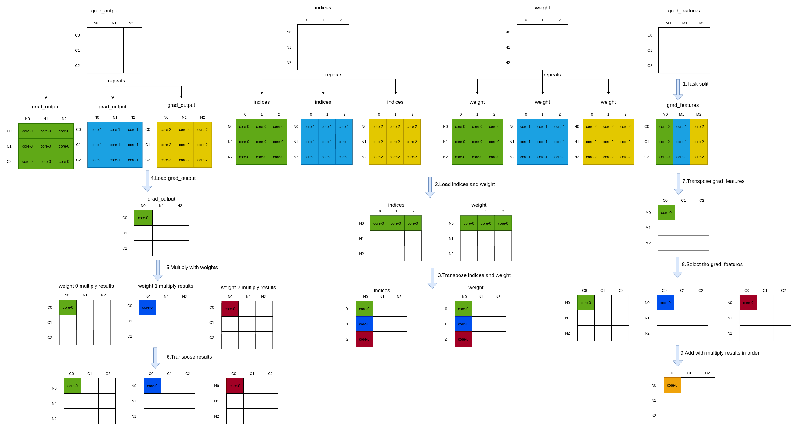

# three_interpolate_backward 算子开发设计方案

- #### 文档基本信息

| 算子名称    | three_interpolate_backward       |
| ----------- | -------------- |
| 编制人/日期 | 郭浩东/2022-12-12 |
| 审批人/日期 | 卜德飞/2022-12-19 |
| 审批人/日期 | 杜泽坤/2022-12-19 |
| 审批人/日期 | 刘端辉/2022-12-19 |

- #### 修改记录

| 修订人 | 修订日期   | 修订描述 |
| ------ | ---------- | -------- |
| 郭浩东    | 2022-12-12 | 首次提交 |

- #### 内容描述

本文档为`three_interpolate_backward`算子的设计文档，包括需求分析、接口设计、方案设计、性能优化记录和方案实施部分。

- #### 算子需求 checklist

* 算子接口描述
* 功能描述
* 框架版本 + 对应源码路径
* 需求对应网络
* 网络中用到的规模
* 是否需要支持原位
* 是否需要支持 stride 机制
* 框架单元测试阈值指标（可选）

## 1 需求分析

### 1.1 算子需求分析

| 算子功能简介                  | 对三个输入特征做加权线性插值获得目标特征 |
| ------------------------------| ------------------------------------------- |
| 需求来源                      | PyTorch                      |
| 应用网络                      | PointNet++                                 |
| 输入数据类型                   | grad_output: half, float; indices: int; weights: half, float      |
| 输入 Shape                    | grad_output: [B, C, N]; indices: [B, N, 3]; weights: [B, N, 3] |
| 输入 Layout                   | grad_output: ARRAY; indices: ARRAY; weights: ARRAY                 |
| 输出数据类型                   | grad_features: half, float                                 |
| 输出 Shape                    | grad_features: [B, C, M]                 |
| 输出 Layout                   | grad_features: ARRAY                                        |
| 模式(可选）                    | 否 |
| 是否含有 dim/axis 等类似语义的参数且该参数支持负数/其他特殊处理 | 否 |
| 是否含有 labels/index 等类似语义的参数且该参数支持负数/界外情况/其他特殊处理 | 否 |
| 是否需要支持原位                | 否                                     |
| 是否需要支持 stride 机制        | 否                                     |
| 是否需要支持广播                | 否                                     |
| 0 元素检查是否直接返回          | 是: B、C、M、N 任一为0时返回 MLUOP_BAD_PARAM  |
| 其他特殊需求(在线量化，融合，转数提前等，可选)| 无                        |
| 本次开发优先支持的规模/模式     |   |

### 1.2 算子功能和应用场景描述

**算子功能：** `three_interpolate_backward`是three_interpolate_forward的反向。

**应用场景：** `three_interpolate_backward`算子应用于`PointNet++`。

**mmcv 示例：**
```py
import torch
import random
import numpy as np
from mmcv.ops import three_interpolate
from mmcv.utils import ext_loader
ext_module = ext_loader.load_ext('_ext', ['three_interpolate_backward'])

B = 2
C = 128
M = 64
N = 256

features = np.random.random((B, C, M)).astype(np.float32)
features = torch.from_numpy(features).cuda()
features.requires_grad_()

indices = np.random.randint(0, M-1, size=(B, N, 3))
indices = torch.from_numpy(indices).int().cuda()

weights = np.random.random((B, N, 3)).astype(np.float32)
weights = torch.from_numpy(weights).cuda()

output = three_interpolate(features, indices, weights)

grad_output = np.random.random((B, C, N)).astype(np.float32)
grad_output = torch.from_numpy(grad_output).cuda()
output.backward(grad_output)

print(features.grad.shape)
print(features.grad.dtype)
print(features.grad)
print(features.shape)
print(features.dtype)
print(features)

grad_output = np.random.random((B, C, N)).astype(np.float32)
grad_output = torch.from_numpy(grad_output).cuda()
indices = np.random.randint(0, M-1, size=(B, N, 3))
indices = torch.from_numpy(indices).int().cuda()
weights = np.random.random((B, N, 3)).astype(np.float32)
weights = torch.from_numpy(weights).cuda()
grad_features = grad_output.new_zeros(B, C, M)
ext_module.three_interpolate_backward(
    grad_output, indices, weights, grad_features, b=B, c=C, n=N, m=M)
print(grad_features.shape)
print(features.grad.dtype)
print(grad_features)

output:
torch.Size([2, 128, 64])
torch.float32
tensor([[[2.8436, 3.0220, 1.9610,  ..., 2.0351, 2.8646, 0.0000],
         [2.2713, 2.2445, 1.8294,  ..., 1.9297, 2.1597, 0.0000],
         [3.2969, 2.4257, 1.8696,  ..., 2.3116, 3.0038, 0.0000],
         ...,
         [3.7290, 2.6329, 1.8211,  ..., 1.8507, 2.9349, 0.0000],
         [2.5087, 2.5972, 1.8805,  ..., 1.3625, 2.7399, 0.0000],
         [2.8655, 2.9446, 1.6395,  ..., 2.1624, 3.3105, 0.0000]],

        [[3.5003, 4.6215, 2.2682,  ..., 5.0744, 3.0584, 0.0000],
         [3.6375, 7.6312, 3.0404,  ..., 5.9998, 3.2194, 0.0000],
         [3.8334, 6.1035, 2.4448,  ..., 5.5534, 4.2928, 0.0000],
         ...,
         [3.7392, 4.7567, 2.1927,  ..., 5.6010, 3.7598, 0.0000],
         [3.2331, 5.0327, 2.3579,  ..., 5.1443, 4.4016, 0.0000],
         [2.1630, 5.0663, 1.6663,  ..., 4.7732, 3.1600, 0.0000]]],
       device='cuda:0')
torch.Size([2, 128, 64])
torch.float32
tensor([[[4.3070e-01, 8.3068e-01, 6.3177e-01,  ..., 6.5140e-01,
          5.4170e-01, 5.1805e-01],
         [9.6069e-01, 9.5459e-01, 3.7544e-01,  ..., 9.1431e-01,
          9.6496e-01, 6.9491e-01],
         [3.8188e-01, 1.9973e-02, 1.5057e-01,  ..., 6.7278e-05,
          1.5706e-01, 7.1705e-01],
         ...,
         [9.1707e-01, 7.9491e-01, 5.6309e-02,  ..., 6.7291e-01,
          8.1816e-01, 9.1879e-01],
         [2.4737e-01, 2.2416e-01, 5.2018e-02,  ..., 1.3590e-01,
          3.5013e-02, 9.2662e-01],
         [3.7506e-01, 8.9385e-01, 1.4762e-01,  ..., 2.0683e-01,
          5.6789e-01, 6.1972e-01]],

        [[8.9985e-01, 4.2865e-01, 3.1974e-01,  ..., 3.8536e-01,
          8.1074e-01, 5.8238e-01],
         [1.6096e-01, 9.7123e-01, 4.8103e-01,  ..., 4.0515e-01,
          1.9095e-01, 8.8335e-01],
         [2.5608e-01, 7.3238e-01, 9.1869e-01,  ..., 3.6330e-01,
          6.8704e-01, 4.8414e-01],
         ...,
         [8.9011e-01, 9.4490e-01, 3.5156e-01,  ..., 8.6310e-02,
          7.4318e-01, 6.5315e-01],
         [2.1380e-01, 5.1931e-01, 6.3995e-01,  ..., 3.6325e-01,
          5.3971e-01, 1.2401e-02],
         [3.6758e-01, 6.3986e-01, 5.1154e-02,  ..., 9.7203e-02,
          8.2342e-01, 6.6491e-01]]], device='cuda:0', requires_grad=True)
torch.Size([2, 128, 64])
torch.float32
tensor([[[2.6769, 2.5794, 3.8363,  ..., 2.7943, 3.2638, 0.0000],
         [3.7236, 2.6224, 2.6447,  ..., 4.9771, 1.7471, 0.0000],
         [4.3940, 2.0421, 3.0444,  ..., 4.1032, 3.9606, 0.0000],
         ...,
         [3.3205, 2.3264, 3.0392,  ..., 5.6297, 3.4577, 0.0000],
         [3.0610, 3.1895, 3.3741,  ..., 4.7236, 2.9029, 0.0000],
         [3.0037, 1.8332, 4.1269,  ..., 4.3443, 2.2449, 0.0000]],

        [[4.2085, 4.0446, 2.7365,  ..., 2.6489, 5.0590, 0.0000],
         [4.6495, 4.2834, 3.3203,  ..., 2.5691, 4.9990, 0.0000],
         [3.9507, 3.8203, 4.1020,  ..., 3.8888, 5.1272, 0.0000],
         ...,
         [5.4090, 3.3075, 2.9488,  ..., 2.5168, 4.7843, 0.0000],
         [4.6951, 3.7266, 1.7576,  ..., 2.8395, 6.5784, 0.0000],
         [5.1470, 3.7194, 2.9965,  ..., 4.1860, 3.7236, 0.0000]]],
       device='cuda:0')
##--------------------------------------------------------------------
# indices中下标取值范围越界和负数行为分析
# 正常情况下indices中的下标取值范围为[0,M-1]，cuda kernel中indices超过M-1或者为负数时，cuda kernel正常返回但是输出结果是随机的

##--------------------------------------------------------------------
# 0元素行为分析
# M=0 反向的cuda kernel正常返回，且grad_features(B, C, M)是零元素
torch.Size([2, 128, 0])
tensor([], device='cuda:0', size=(2, 128, 0))

# B,C,N 任意为0, cuda RuntimeError:
Traceback (most recent call last):
  File "test_three_interpolate_backward.py", line 25, in <module>
    output = three_interpolate(features, indices, weights)
  File "/mmcv/mmcv/mmcv/ops/three_interpolate.py", line 43, in forward
    ext_module.three_interpolate_forward(
RuntimeError: CUDA error: invalid configuration argument

# M=0 且 B,C,N 任意为0, cuda RuntimeError:
Traceback (most recent call last):
  File "test_three_interpolate_backward.py", line 25, in <module>
    output = three_interpolate(features, indices, weights)
  File "/mmcv/mmcv/mmcv/ops/three_interpolate.py", line 43, in forward
    ext_module.three_interpolate_backward(
RuntimeError: CUDA error: invalid configuration argument

##--------------------------------------------------------------------
# nan和inf行为分析
# features和weights中有nan和inf/-inf时, cuda kernel正常返回
```

### 1.3 算子输入输出参数要求

| 参数        | 语义 | 类型（输入/输出） | 支持类型    | 物理布局 | 规模限制 |
| ----------- | ---- | ----------------- | ----------- | -------- | -------- |
| handle      |   操作句柄   | 输入              | mluOpHandle_t        | /        | 无       |
| grad_output_desc |   输入 grad_output 的形状描述   | 输入              | mluOpTensorDescriptor_t | /        | 无       |
| grad_output      |   表示待插值的输入特征数据，shape是[B, C, N], B是batch大小，C是channel大小，N表示一个输入channel上特征点的个数   | 输入              | half, float | ARRAY     | 无       |
| indices_desc |   输入 indices 的形状描述   | 输入              | mluOpTensorDescriptor_t | /        | 无       |
| indices      |   表示输出特征上三个最近邻特征的索引，shape是[B, N, 3], B是batch大小，N表示一个输入channel上特征点的个数，3表示有三个最近邻特征索引   | 输入              | int | ARRAY    | 无       |
| weights_desc |   输入 weights 的形状描述   | 输入              | mluOpTensorDescriptor_t | /        | 无       |
| weights      |   表示输出特征上三个最近邻特征的权重，shape是[B, N, 3], B是batch大小，N表示一个输入channel上特征点的个数，3表示有三个最近邻特征权重   | 输入              | half, float | ARRAY     | 无       |
| grad_features_desc |   输出 grad_features 的形状描述   | 输入              | mluOpTensorDescriptor_t | /        | 无       |
| grad_features      |   表示输出特征数据，shape是[B, C, N], B是batch大小，C是channel大小，M表示一个输出channel上特征点的个数   | 输出              | half, float | ARRAY     | 无       |

### 1.4 算子限制

| 限制类型     | 详细说明                                                     |
| ------------ | ------------------------------------------------------------ |
| 输入限制     | 输入参数shape必须满足要求:<br>grad_output：[B, C, N]<br>indices:[B, N, 3]<br>weights: [B, N, 3] |
| 输出限制     | 输出参数shape必须满足要求:<br>grad_features:[B, C, M] |
| 数据类型限制 | grad_output、weights仅支持float或者half类型输入 <br> indices只支持int类型输入 |
| 数据范围限制 | 输入参数indices表示输出特征上三个最近邻特征的索引，该索引必须在[0, M-1]范围内，并且该索引取值在2系列板卡上最大值为2^23-1 |
| 原位限制     | 不支持原位                                                   |
| stride限制   | 不支持stride                                                |
| 广播限制     | 不支持广播                                                   |

### 1.5 验收标准

#### 1.5.1 精度验收标准

按照[精度验收标准](../MLU-OPS精度验收标准.md)的要求明确本算子的精度标准。

- 算子精度验收标准：diff1、diff2；
- 算子精度阈值描述：diff1 <= 3e-3 && diff2 <=3e-3；

#### 1.5.2 性能验收标准

见 [MLU-OPS 性能验收标准](../MLU-OPS性能验收标准.md)。

## 2 算子接口设计

### 2.1 参考接口

- `MMCV cuda`接口

```c++
void three_interpolate_backward_cuda_kernel(
    int b, int c, int n, int m,
    const T *grad_out, const int *__restrict__ idx,
    const T *weight, T *grad_points)
```

### 2.2 接口设计

```c++
mluOpStatus_t MLUOP_WIN_API mluOpThreeInterpolateBackward(mluOpHandle_t handle,
                                                          const mluOpTensorDescriptor_t grad_output_desc,
                                                          const void *grad_output,
                                                          const mluOpTensorDescriptor_t indices_desc,
                                                          const void *indices,
                                                          const mluOpTensorDescriptor_t weights_desc,
                                                          const void *weights,
                                                          const mluOpTensorDescriptor_t grad_features_desc,
                                                          void *grad_features);
```

## 3 实现方案设计

### 3.1 实现方案

下列步骤中出现的B表示完整的batch大小，C表示完整的channel大小，Co表示片上channel方向一次处理的数据量，N表示一个输出channel中所有元素的大小，No表示一个输出channel中片上一次处理的数据量，M表示一个输入channel中所有元素的大小，Mo表示一个输入channel中片上一次处理的数据量。
- step1: 根据 B*M 两个维度进行任务规模划分，每个 core 分到 task_repeats 份，task_repeats = taskId < rem_num ? repeat_m / taskDim + 1 : repeat_m / taskDim (repeat_m = B * M / Mo)；
- step2: 加载 indices 数据 No*3 和 weight 数据 No*3 以及 grad_output 数据 Co*No；
- step3: 加载 indices 数据 No*3 并转换成 3*No，加载 weight 数据 No*3 并转换成 3*No；
- step4: 加载 grad_output 数据 Co*No；
- step5: 将 grad_output 乘上 weight得到 Co*No;
- step6: 将乘完后的数据做Transpose成 No*Co;
- step7: 将 grad_features 数据 Transpose 成 Mo*Co；
- step8: 根据 indices 选择对应的 grad_features;
- step9: 将选中的 grad_features 和 Transpose 后的乘法结果相加;
- step10: 循环处理 step4 到 step9，重复次数为 features 数据 N 方向 N / No 次；
- step11: 将 N 方向 N / No 次循环后累加的结果从 NRAM 拷贝到 GDRAM 上对应的输出地址上；
- step12: 循环处理 step2 到 step11，重复次数为 features 数据 C 方向 C / Co 次；
- step13: 每个 core 循环处理 task_repeats 次 step2 到 step12。

step1到step9的处理流程如下图所示：




### 3.2 伪代码实现


### 3.3 拆分(任务拆分，多核拆分)

1、基本任务类型是 `UNION1`；

2、对 `B*M`两个方向进行数据拆分，每个core上每次处理一个batch的M方向上的Mo个数据，其中每个core循环处理的次数为`(B * M / Mo) / taskDim`，每个core最后一次循环处理的数据不足Mo时，会按照实际剩余数据进行计算；
- 每次NRAM上会加载M,C,N多个维度的数据，在满足每个方向上最小的计算对齐需求的前提下，N方向拆分的No会是最大的，片上空间会优先满足N方向拆分的需求；
- 其次如果一次可以加载完整的N*C到片上或者C大于N，C方向拆分的Co会是第二大的，片上空间会以第二优先级来满足C方向拆分的需求，否则M方向拆分的Mo会是第二大的维度，片上空间会以第二优先级来满足M方向拆分的需求。

3、不能均匀拆分的情况下，依次分配给前`rem_num`个`core`，其中`rem_num = (B * M / Mo) % taskDim`。

### 3.4 性能优化设计

1、资源分配

| 表项            | 分配策略                                                               |
| --------------- | ---------------------------------------------------------------------- |
| NRAM            | 见下图     |
| WRAM            | 无                                                     |
| SRAM            | 无 |
| DRAM(workspace) | 无                 |

`nram`内存空间划分：


grad_output空间大小为Co*No, grad_output_transpose空间大小为No*Co+Co, grad_features空间大小为Co*Mo，grad_features_transpose空间大小为max(Co*Mo, Co*No), weight、weight_transpose、indices和indices_transpose空间大小为No*3，indices_transpose_addition、indices_transpose_float和indices_transpose_float_addition空间大小为No。

2、流水设计
无

### 3.5 可维护性设计

1、bangc 代码中加入必要的 log 信息，比如输入的规模、数据类型、layout 这些，以及如果出错会导致程序 core dump 的变量，比如 IO 指令的 data_size、dim xyz 的值等，这些信息都是有利于快速定位问题；

2、对每一个函数命名变量命名都有充分的注释；

3、避免魔鬼数字，对于确定的数字尽量使用公共宏来替代。

### 3.6 测试用例设计

| 网络规模测试       |   输入输出尺寸                                                                                    |
| ---------------- | ----------------------------------------------------------------------------------------------- |
| case1            | grad_out=[16, 512, 64], indices=[16, 64, 3], weights=[16, 64, 3] grad_features=[16, 512, 16]           |
| case2            | grad_out=[16, 256, 256], indices=[16, 256, 3], weights=[16, 256, 3] grad_features=[16, 256, 64]        |
| case3            | grad_out=[16, 256, 1024], indices=[16, 1024, 3], weights=[16, 1024, 3] grad_features=[16, 256, 256]    |
| case4            | grad_out=[16, 128, 4096], indices=[16, 4096, 3], weights=[16, 4096, 3] grad_features=[16, 128, 1024]   |
| case5            | grad_out=[16, 16, 64], indices=[16, 64, 3], weights=[16, 64, 3] grad_features=[16, 16, 512]            |
| case6            | grad_out=[16, 64, 256], indices=[16, 256, 3], weights=[16, 256, 3] grad_features=[16, 64, 256]         |
| case7            | grad_out=[16, 1024, 4096], indices=[16, 4096, 3], weights=[16, 4096, 3] grad_features=[16, 1024, 128]  |
| case8            | grad_out=[16, 1, 128], indices=[16, 128, 3], weights=[16, 128, 3] grad_features=[16, 1, 1024]          |
| case9            | grad_out=[16, 128, 512], indices=[16, 512, 3], weights=[16, 512, 3] grad_features=[16, 128, 256]       |
| case10           | grad_out=[16, 512, 2048], indices=[16, 2048, 3], weights=[16, 2048, 3] grad_features=[16, 512, 128]    |

| 边界规模测试        |   输入输出尺寸                                                                                   |
| ----------------- | ---------------------------------------------------------------------------------------------- |
| case11            | grad_out=[0, 128, 128], indices=[0, 128, 3], weights=[0, 128, 3] grad_features=[0, 128, 128]          |
| case12            | grad_out=[16, 0, 128], indices=[16, 128, 3], weights=[16, 128, 3] grad_features=[16, 128, 0]          |
| case13            | grad_out=[16, 128, 128], indices=[16, 128, 3], weights=[16, 128, 3] grad_features=[16, 128, 0]        |
| case14            | grad_out=[16, 128, 0], indices=[16, 0, 3], weights=[16, 0, 3] grad_features=[16, 128, 128]            |
| case15            | grad_out=[0, 0, 0], indices=[0, 0, 3], weights=[0, 0, 3] grad_features=[0, 0, 0]                      |
| case16            | grad_out=[1, 1, 1], indices=[1, 1, 3], weights=[1, 1, 3] grad_features=[1, 1, 1]                      |
| case17            | grad_out=[7, 63, 129], indices=[7, 129, 3], weights=[7, 129, 3] grad_features=[7, 63, 127]            |
| case18            | grad_out=[15, 1025, 1023], indices=[15, 1023, 3], weights=[15, 1023, 3] grad_features=[15, 1025, 1023]|
| case19            | grad_out=[25, 1029, 1025], indices=[25, 1025, 3], weights=[25, 1025, 3] grad_features=[25, 1029, 1027]|
| case20            | grad_out=[29, 2047, 999], indices=[29, 999, 3], weights=[29, 999, 3] grad_features=[29, 2047, 2033]   |

### 3.7 算子防呆检查


1、指针为空防呆；

2、0 元素检查防呆，VLOG(5)打印信息；

3、对输入输出支持的 dtype、layout 以及 shape 进行防呆；

## 4 算子性能优化记录

### 4.1 当前存在问题的规模说明

### 4.2 已经过优化的规模说明

## 5 方案实施

### 5.1 开发测试计划

- 2022.12.07 算子调研+开始设计方案
- 2022.12.12 设计方案：算子功能+接口设计
- 2022.12.13 generator和gtest代码开发
- 2022.12.14 方案设计评审
- 2022.12.15 算子host/device代码实现、功能调试，大规模测试
- 2022.12.16 输出测试报告，提交 PR
- 2022.12.19 算子入库

### 5.2 风险分析