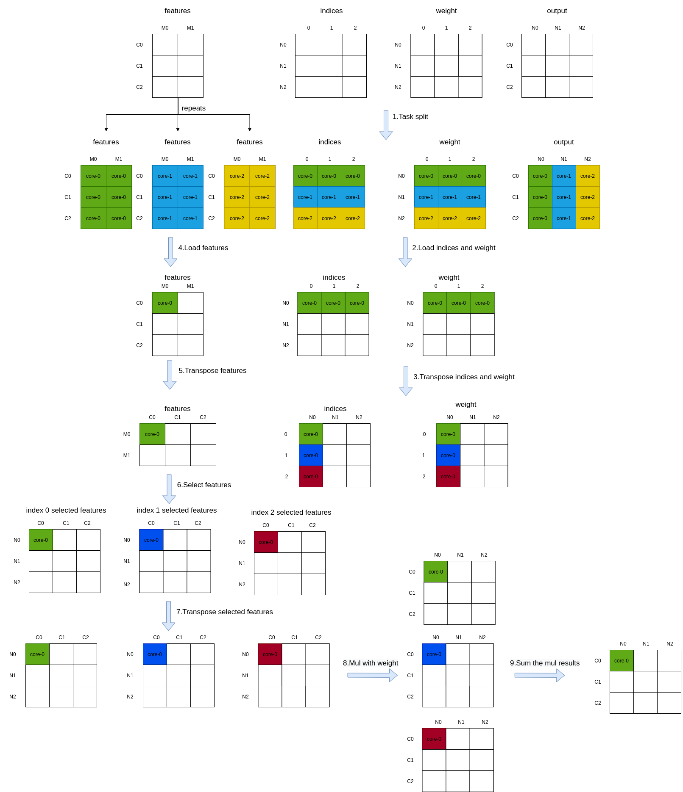

# three_interpolate_forward 算子开发设计方案

- #### 文档基本信息

| 算子名称    | three_interpolate_forward       |
| ----------- | -------------- |
| 编制人/日期 | 郭浩东/2022-9-14 |
| 审批人/日期 | 卜德飞/2022-9-14 |
| 审批人/日期 | 杜泽坤/2022-9-14 |
| 审批人/日期 | 刘端辉/2022-9-14 |

- #### 修改记录

| 修订人 | 修订日期   | 修订描述 |
| ------ | ---------- | -------- |
| 郭浩东    | 2022-9-14 | 首次提交 |

- #### 内容描述

本文档为`three_interpolate_forward`算子的设计文档，包括需求分析、接口设计、方案设计、性能优化记录和方案实施部分。

- #### 算子需求 checklist

* 算子接口描述
* 功能描述
* 框架版本 + 对应源码路径
* 需求对应网络
* 网络中用到的规模
* 是否需要支持原位
* 是否需要支持 stride 机制
* 框架单元测试阈值指标（可选）

## 1 需求分析

### 1.1 算子需求分析

| 算子功能简介                  | 对三个输入特征做加权线性插值获得目标特征 |
| ------------------------------| ------------------------------------------- |
| 需求来源                      | PyTorch                      |
| 应用网络                      | PointNet++                                 |
| 输入数据类型                  | features: half, float; indices: int; weights: half, float      |
| 输入 Shape                    | features: [B, C, M]; indices: [B, N, 3]; weights: [B, N, 3] |
| 输入 Layout                   | features: ARRAY; indices: ARRAY; weights: ARRAY                 |
| 输出数据类型                  | output: half, float                                 |
| 输出 Shape                    | output: [B, C, N]                 |
| 输出 Layout                   | output: ARRAY                                        |
| 模式(可选）                    | 否 |
| 是否含有 dim/axis 等类似语义的参数且该参数支持负数/其他特殊处理 | 否 |
| 是否含有 labels/index 等类似语义的参数且该参数支持负数/界外情况/其他特殊处理 | 否 |
| 是否需要支持原位                | 否                                     |
| 是否需要支持 stride 机制        | 否                                     |
| 是否需要支持广播                | 否                                     |
| 0 元素检查是否直接返回          | 是: B、C、M、N 任一为0时返回 MLUOP_BAD_PARAM  |
| 其他特殊需求(在线量化，融合，转数提前等，可选)| 无                        |
| 本次开发优先支持的规模/模式     |   |

### 1.2 算子功能和应用场景描述

**算子功能：** `three_interpolate_forward`对三个输入特征做加权线性插值获得目标特征。其中三个输入特征在`features`中的下标由`indices`决定，将选择出来的三个输入特征乘上对应的`weights`，并将对应的乘法结果进行累加得到目标特征，对于每个batch，在每个channel上重复上述过程N次就得到加权插值后的输出结果。<br>

**应用场景：** `three_interpolate_forward`算子应用于`PointNet++`。

**mmcv 示例：**
```py
import torch
import random
import numpy as np
from mmcv.ops import three_interpolate

B = 2
C = 128
M = 64
N = 256

features = np.random.random((B, C, M)).astype(np.float32)
features = torch.from_numpy(features).cuda()

indices = np.random.randint(0, M-1, size=(B, N, 3))
indices = torch.from_numpy(indices).int().cuda()

weights = np.random.random((B, N, 3)).astype(np.float32)
weights = torch.from_numpy(weights).cuda()

output = three_interpolate(features, indices, weights)

print(output.shape)
print(output.dtype)
print(output)

output:
torch.Size([2, 128, 256])
torch.float32
tensor([[[0.2459, 0.4881, 0.4446,  ..., 0.9791, 0.6877, 1.2631],
         [0.1603, 0.3038, 0.4135,  ..., 1.1505, 1.1404, 1.3750],
         [0.1586, 0.3562, 0.4230,  ..., 1.2729, 0.6525, 1.1663],
         ...,
         [0.0616, 0.2403, 0.5752,  ..., 0.7492, 0.8854, 1.1634],
         [0.0802, 0.4682, 0.5335,  ..., 1.1417, 1.0660, 0.7692],
         [0.0466, 0.4075, 0.4629,  ..., 1.4709, 1.2155, 0.6646]],

        [[0.7648, 0.2696, 0.7172,  ..., 0.9090, 0.9551, 1.3177],
         [0.4936, 0.2763, 1.6332,  ..., 1.3347, 0.9938, 1.2504],
         [0.5537, 0.3287, 0.3567,  ..., 0.6261, 0.6594, 0.3143],
         ...,
         [1.0197, 0.1709, 0.7723,  ..., 0.7058, 0.6635, 0.9024],
         [0.4853, 0.3642, 1.2457,  ..., 1.3041, 0.8758, 1.3149],
         [1.0028, 0.3558, 1.4674,  ..., 0.7384, 0.5373, 0.7365]]],
       device='cuda:0')
##--------------------------------------------------------------------
# indices中下标取值范围越界和负数行为分析
# 正常情况下indices中的下标取值范围为[0,M-1]，cuda kernel中indices超过M-1或者为负数时，cuda kernel正常返回但是输出结果是随机的

##--------------------------------------------------------------------
# 0元素行为分析
# M=0 cuda kernel正常返回，但是使用cuda kernel返回的output时cuda RuntimeError:
Traceback (most recent call last):
  File "test_three_interpolate_forward.py", line 27, in <module>
    print(output)
  File "/opt/conda/lib/python3.8/site-packages/torch/tensor.py", line 193, in __repr__
    return torch._tensor_str._str(self)
  File "/opt/conda/lib/python3.8/site-packages/torch/_tensor_str.py", line 383, in _str
    return _str_intern(self)
  File "/opt/conda/lib/python3.8/site-packages/torch/_tensor_str.py", line 358, in _str_intern
    tensor_str = _tensor_str(self, indent)
  File "/opt/conda/lib/python3.8/site-packages/torch/_tensor_str.py", line 242, in _tensor_str
    formatter = _Formatter(get_summarized_data(self) if summarize else self)
  File "/opt/conda/lib/python3.8/site-packages/torch/_tensor_str.py", line 90, in __init__
    nonzero_finite_vals = torch.masked_select(tensor_view, torch.isfinite(tensor_view) & tensor_view.ne(0))
RuntimeError: CUDA error: an illegal memory access was encountered

# B,C,N 任意为0, cuda RuntimeError:
Traceback (most recent call last):
  File "test_three_interpolate_forward.py", line 20, in <module>
    output = three_interpolate(features, indices, weights)
  File "/mmcv/mmcv/mmcv/ops/three_interpolate.py", line 43, in forward
    ext_module.three_interpolate_forward(
RuntimeError: CUDA error: invalid configuration argument

# M=0 且 B,C,N 任意为0, cuda RuntimeError:
Traceback (most recent call last):
  File "test_three_interpolate_forward.py", line 20, in <module>
    output = three_interpolate(features, indices, weights)
  File "/mmcv/mmcv/mmcv/ops/three_interpolate.py", line 43, in forward
    ext_module.three_interpolate_forward(
RuntimeError: CUDA error: invalid configuration argument

##--------------------------------------------------------------------
# nan和inf行为分析
# features和weights中有nan和inf/-inf时, cuda kernel正常返回
```

### 1.3 算子输入输出参数要求

| 参数        | 语义 | 类型（输入/输出） | 支持类型    | 物理布局 | 规模限制 |
| ----------- | ---- | ----------------- | ----------- | -------- | -------- |
| handle      |   操作句柄   | 输入              | mluOpHandle_t        | /        | 无       |
| features_desc |   输入 features 的形状描述   | 输入              | mluOpTensorDescriptor_t | /        | 无       |
| features      |   表示待插值的输入特征数据，shape是[B, C, M], B是batch大小，C是channel大小，M表示一个输入channel上特征点的个数   | 输入              | half, float | ARRAY     | 无       |
| indices_desc |   输入 indices 的形状描述   | 输入              | mluOpTensorDescriptor_t | /        | 无       |
| indices      |   表示输出特征上三个最近邻特征的索引，shape是[B, N, 3], B是batch大小，N表示一个输出channel上特征点的个数，3表示有三个最近邻特征索引   | 输入              | int | ARRAY    | 无       |
| weights_desc |   输入 weights 的形状描述   | 输入              | mluOpTensorDescriptor_t | /        | 无       |
| weights      |   表示输出特征上三个最近邻特征的卷积滤波张量，shape是[B, N, 3], B是batch大小，N表示一个输出channel上特征点的个数，3表示有三个最近邻特征卷积滤波张量   | 输入              | half, float | ARRAY     | 无       |
| output_desc |   输出 output 的形状描述   | 输入              | mluOpTensorDescriptor_t | /        | 无       |
| output      |   表示输出特征数据，shape是[B, C, N], B是batch大小，C是channel大小，N表示一个输出channel上特征点的个数   | 输出              | half, float | ARRAY     | 无       |

### 1.4 算子限制

| 限制类型     | 详细说明                                                     |
| ------------ | ------------------------------------------------------------ |
| 输入限制     | 输入参数shape必须满足要求:<br>features：[B, C, M]<br>indices:[B, N, 3]<br>weights: [B, N, 3] |
| 输出限制     | 输出参数shape必须满足要求:<br>output:[B, C, N] |
| 数据类型限制 | features、weights仅支持float或者half类型输入 <br> indices只支持int类型输入 |
| 数据范围限制 | 输入参数indices表示输出特征上三个最近邻特征的索引，该索引必须在[0, M-1]范围内，并且该索引取值在2系列板卡上最大值为2^23-1 |
| 原位限制     | 不支持原位                                                   |
| stride限制   | 不支持stride                                                |
| 广播限制     | 不支持广播                                                   |

### 1.5 验收标准

#### 1.5.1 精度验收标准

按照[精度验收标准](../MLU-OPS-Accuracy-Acceptance-Standard.md)的要求明确本算子的精度标准。

- 算子精度验收标准：diff1、diff2；
- 算子精度阈值描述：diff1 <= 3e-3 && diff2 <=3e-3；

#### 1.5.2 性能验收标准

见 [MLU-OPS 性能验收标准](../MLU-OPS-Performance-Acceptance-Standard.md)。

## 2 算子接口设计

### 2.1 参考接口

- `MMCV cuda`接口

```c++
void three_interpolate_forward_cuda_kernel(
    int b, int c, int m, int n,
    const T *points,
    const int *__restrict__ idx,
    const T *weight,
    T *out);
```

### 2.2 接口设计

```c++
mluOpStatus_t MLUOP_WIN_API mluOpThreeInterpolateForward(mluOpHandle_t handle,
                                                         const mluOpTensorDescriptor_t features_desc,
                                                         const void *features,
                                                         const mluOpTensorDescriptor_t indices_desc,
                                                         const void *indices,
                                                         const mluOpTensorDescriptor_t weights_desc,
                                                         const void *weights,
                                                         const mluOpTensorDescriptor_t output_desc,
                                                         void *output);
```

## 3 实现方案设计

### 3.1 实现方案

下列步骤中出现的B表示完整的batch大小，C表示完整的channel大小，Co表示片上channel方向一次处理的数据量，N表示一个输出channel中所有元素的大小，No表示一个输出channel中片上一次处理的数据量，M表示一个输入channel中所有元素的大小，Mo表示一个输入channel中片上一次处理的数据量。
- step1: 根据 B*N 两个维度进行任务规模划分，每个 core 分到 task_repeats 份，task_repeats = taskId < rem_num ? repeat_n / taskDim + 1 : repeat_n / taskDim (repeat_n = B * N / No)；
- step2: 加载 indices 数据 No*3 和 weight 数据 No*3；
- step3: 将 indices 数据 No*3 并转换成 3*No，将 weight 数据 No*3 并转换成 3*No；
- step4: 加载 features 数据 Co*Mo；
- step5: 将 features 数据 Co*Mo transpose 成 Mo*Co；
- step6: 根据 indices 数据对 Mo*Co 数据进行选择，累计循环选择三次，每次选择后的 features数据为 No*Co；
- step7: 并将选择后的数据 No*Co transpose 成 Co*No；
- step8: 将选择并 transpose 后的数据 Co*No 和加载的 weight 数据 1*No 进行相乘，累计做三次乘法；
- step9: 对三次相乘的结果进行累加并暂时存储到 output 的 NRAM 空间上；
- step10: 循环处理 step4 到 step9，重复次数为 features 数据 M 方向 M / Mo 次；
- step11: 将 M 方向 M / Mo 次循环后累加的结果从 NRAM 拷贝到 GDRAM 上对应的输出地址上；
- step12: 循环处理 step4 到 step11，重复次数为 features 数据 C 方向 C / Co 次；
- step13: 每个 core 循环处理 task_repeats 次 step2 到 step12。

step1到step9的处理流程如下图所示：




### 3.2 伪代码实现

### 3.3 拆分(任务拆分，多核拆分)

1、基本任务类型是 `UNION1`；

2、对 `B*N`两个方向进行数据拆分，每个core上每次处理一个batch的N方向上的No个数据，其中每个core循环处理的次数为`(B * N / No) / taskDim`，每个core最后一次循环处理的数据不足No时，会按照实际剩余数据进行计算；
- 每次NRAM上会加载M,C,N多个维度的数据，在满足每个方向上最小的计算对齐需求的前提下，M方向拆分的Mo会是最大的，片上空间会优先满足M方向拆分的需求；
- 其次如果一次可以加载完整的M*C到片上或者C大于M，C方向拆分的Co会是第二大的，片上空间会以第二优先级来满足C方向拆分的需求，否则N方向拆分的No会是第二大的维度，片上空间会以第二优先级来满足N方向拆分的需求。

3、不能均匀拆分的情况下，依次分配给前`rem_num`个`core`，其中`rem_num = (B * N / No) % taskDim`。

### 3.4 性能优化设计

1、资源分配

| 表项            | 分配策略                                                               |
| --------------- | ---------------------------------------------------------------------- |
| NRAM            | 见下图     |
| WRAM            | 无                                                     |
| SRAM            | 无 |
| DRAM(workspace) | 无                 |

`nram`内存空间划分：


features空间大小为max(Co*Mo, Co*No), features_transpose空间大小为Co*Mo, features_selected和output空间大小为Co*No, weight、weight_transpose、indices和indices_transpose空间大小为No*3，indices_transpose_addition、indices_transpose_float和indices_transpose_float_addition空间大小为No。

2、流水设计
无

### 3.5 可维护性设计

1、bangc 代码中加入必要的 log 信息，比如输入的规模、数据类型、layout 这些，以及如果出错会导致程序 core dump 的变量，比如 IO 指令的 data_size、dim xyz 的值等，这些信息都是有利于快速定位问题；

2、对每一个函数命名变量命名都有充分的注释；

3、避免魔鬼数字，对于确定的数字尽量使用公共宏来替代。

### 3.6 测试用例设计

| 网络规模测试       |   输入输出尺寸                                                                                    |
| ---------------- | ----------------------------------------------------------------------------------------------- |
| case1            | features=[16, 512, 16], indices=[16, 64, 3], weights=[16, 64, 3] output=[16, 512, 64]           |
| case2            | features=[16, 256, 64], indices=[16, 256, 3], weights=[16, 256, 3] output=[16, 256, 256]        |
| case3            | features=[16, 256, 256], indices=[16, 1024, 3], weights=[16, 1024, 3] output=[16, 256, 1024]    |
| case4            | features=[16, 128, 1024], indices=[16, 4096, 3], weights=[16, 4096, 3] output=[16, 128, 4096]   |
| case5            | features=[16, 16, 512], indices=[16, 64, 3], weights=[16, 64, 3] output=[16, 16, 64]            |
| case6            | features=[16, 64, 256], indices=[16, 256, 3], weights=[16, 256, 3] output=[16, 64, 256]         |
| case7            | features=[16, 1024, 128], indices=[16, 4096, 3], weights=[16, 4096, 3] output=[16, 1024, 4096]  |
| case8            | features=[16, 1, 1024], indices=[16, 128, 3], weights=[16, 128, 3] output=[16, 1, 128]          |
| case9            | features=[16, 128, 256], indices=[16, 512, 3], weights=[16, 512, 3] output=[16, 128, 512]       |
| case10           | features=[16, 512, 128], indices=[16, 2048, 3], weights=[16, 2048, 3] output=[16, 512, 2048]    |

| 边界规模测试        |   输入输出尺寸                                                                                   |
| ----------------- | ---------------------------------------------------------------------------------------------- |
| case11            | features=[0, 128, 128], indices=[0, 128, 3], weights=[0, 128, 3] output=[0, 128, 128]          |
| case12            | features=[16, 0, 128], indices=[16, 128, 3], weights=[16, 128, 3] output=[16, 0, 128]          |
| case13            | features=[16, 128, 0], indices=[16, 128, 3], weights=[16, 128, 3] output=[16, 128, 128]        |
| case14            | features=[16, 128, 128], indices=[16, 0, 3], weights=[16, 0, 3]  output=[16, 128, 0]           |
| case15            | features=[0, 0, 0], indices=[0, 0, 3], weights=[0, 0, 3] output=[0, 0, 0]                      |
| case16            | features=[1, 1, 1], indices=[1, 1, 3], weights=[1, 1, 3] output=[1, 1, 1]                      |
| case17            | features=[7, 63, 127], indices=[7, 129, 3], weights=[7, 129, 3] output=[7, 63, 129]            |
| case18            | features=[15, 1025, 1023], indices=[15, 1023, 3], weights=[15, 1023, 3] output=[15, 1025, 1023]|
| case19            | features=[25, 1029, 1027], indices=[25, 1025, 3], weights=[25, 1025, 3] output=[25, 1029, 1025]|
| case20            | features=[29, 2047, 2033], indices=[29, 999, 3], weights=[29, 999, 3] output=[29, 2047, 999]   |

### 3.7 算子防呆检查


1、指针为空防呆；

2、0 元素检查防呆，VLOG(5)打印信息；

3、对输入输出支持的 dtype、layout 以及 shape 进行防呆；

## 4 算子性能优化记录

### 4.1 当前存在问题的规模说明

### 4.2 已经过优化的规模说明

## 5 方案实施

### 5.1 开发测试计划

- 2022.8.1 算子调研+开始设计方案
- 2022.8.4 设计方案：算子功能+接口设计
- 2022.8.15 设计方案：离散访存方式
- 2022.8.22 设计方案：向量化计算方式
- 2022.9.1 设计方案：任意规模拆分方式
- 2022.9.14 方案设计评审
- 2022.9.15 generator和gtest代码开发
- 2022.9.19 算子host/device代码实现、功能调试，大规模测试
- 2022.9.26 输出测试报告，提交 PR
- 2022.9.27 算子入库

### 5.2 风险分析
