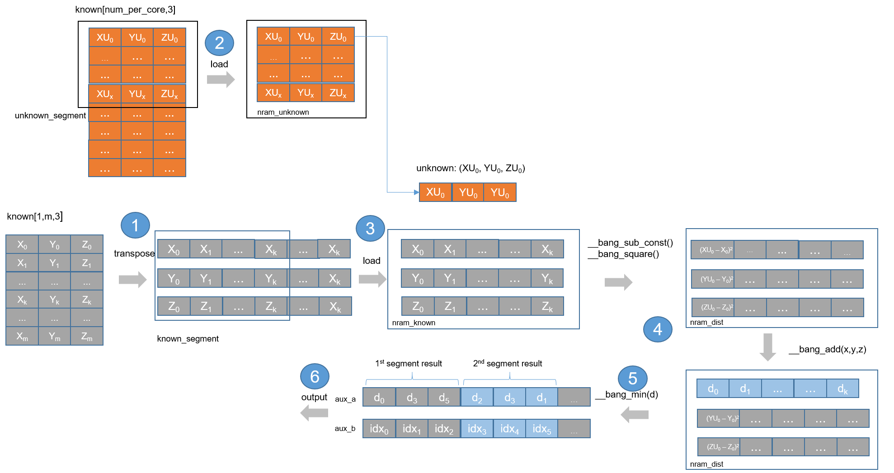
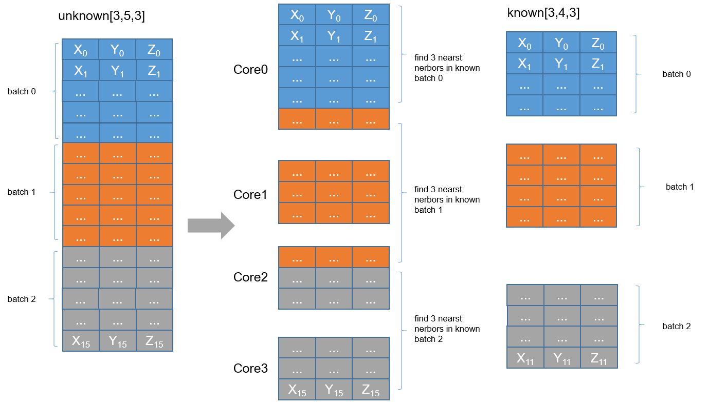

# threeNN算子开发设计方案


* #### 文档基本信息

| 算子名称    | ThreeNNForward                                              |
| ----------- | ------------------------------------------------------------ |
| 编制人/日期 | 刘端辉/2022-06-06                                            |
| 审批人/日期 | 张少鹏/2022-06-24                                                |
| 审批人/日期 | 王远/2022-06-24                                                |

* #### 修改记录

| 版本号| 修订人 | 修订日期 | 修订描述 |
| ----- | ------ | -------  | -------  |
| V1.0  | 刘端辉    | 2022-06-06 | 首次提交 |

* #### 内容描述

本文档为`ThreeNNForward`算子的设计文档，包括需求分析、接口设计、方案设计、性能优化记录和方案实施部分。

* #### 算子需求checklist

算子需求提出者需要`提供`的信息如下：

- 框架负责人
- 算子接口描述
- 功能描述
- 框架版本 + 对应源码路径
- 需求对应网络
- 网络中用到的规模
- 常用规模下的竞品性能（可选）
- 是否需要支持原位
- 是否需要支持stride机制
- 框架单元测试阈值指标（可选）
- 其他特殊需求（在线量化/融合/转数提前等，可选）
- 确认算子需求是否已经过框架层review（滤除MLUOP已支持的算子）

算子需求提出者需要`check`的部分如下：

- 1.1 算子需求分析
- 1.2 算子功能和应用场景描述
- 1.3 算子输入输出参数要求
- 1.4 算子限制
- 1.5 验收标准
- 2.2 接口设计
- 3.5 测试用例（需求提出者check算子需求表中所给规模是否列出）

## 1 需求分析

### 1.1 算子需求分析

| 算子功能简介| 从known集合中找到unknown集合中每个点的前三个邻近点                    |
|-------------|--------------------------------------------------------------|
| 需求来源    | PyTorch                                       |
| 应用网络    | centerpoint             |
| 输入数据类型| half, float                                                  |
| 输入Shape   | unknown: `[b, n, 3]`; known: `[b, m, 3]`;  |
| 输入Layout  | unknown: ARRAY; known: ARRAY                                  |
| 输出数据类型| dist2: half, float; idx: int32                                                 |
| 输出Shape   | dist2: [b, n, 3]; idx: [b, n, 3]                                  |
| 输出Layout  | ARRAY                                                         |
| 模式(可选） |                                                              |
| 是否含有dim/axis等类似语义的参数且该参数支持负数/其他特殊处理 | 否|
| 是否含有labels/index等类似语义的参数且该参数支持负数/界外情况/其他特殊处理 | 否|
| 是否需要支持原位        | 否                                                  |
| 是否需要支持stride机制  | 否                                                  |
| 是否需要支持广播  | 否                       |
| 0元素检查是否直接返回  | unknown不支持0元素，返回MLUOP_STATUS_BAD_PARAM;<br/>known dim1支持0元素，返回MLUOP_STATUS_SUCCESS |


### 1.2 算子功能和应用场景描述
- 算子功能：为点云`unknown`集合中的点的寻找来自`known`集合中的前`3`个邻近点。点云数据点的坐标为`(x, y, z)`， 通过计算平方差距离后排序，得到前3个邻近点及其在集合中的`index`。`unknown[b, n, 3]`包含 `b`个`batch`，每个`batch`包含`n`个点坐标，`known[b, m, 3]`包含`b`个batch，每个`batch`包含`m`个点坐标。设点 `point1: (xu_1, yu_2, zu_3)` 是unkown 中的点，点 `point2: (xk_01, yk_02, zk_03)`是known 中点，距离`dist2`计算公式为：

```math
dist2 = (xu_{1} - xk_{01})^2 + (yu_{2} - yk_{02})^2+ (zu_{3} - zk_{03})^2
```

- 应用场景：`centerpoint`等。
- 备注说明：NAN/INF: 参考接口输入出现nan或inf，dist 计算都为inf。
- example:
```python
ext_module = ext_loader.load_ext('_ext', ['three_nn_forward'])
B = 2
N = 3
M = 4
dist2 = torch.cuda.FloatTensor(B, N, 3).cuda()
idx = torch.cuda.IntTensor(B, N, 3).cuda()
unknown = torch.rand(B,N,3).cuda()
known = torch.rand(B, M, 3).cuda()
ext_module.three_nn_forward(unknown, known, dist2, idx, B, N, M)

"""
    unknown shape:  torch.Size([2, 3, 3])
    tensor([[[0.9381, 0.2671, 0.9055],
             [0.7244, 0.6917, 0.0026],
             [0.3927, 0.0399, 0.7615]],

           [[0.1387, 0.6927, 0.5180],
             [0.6640, 0.8528, 0.6928],
             [0.4866, 0.9297, 0.5870]]], device='cuda:0')
    known shape:  torch.Size([2, 4, 3])
    tensor([[[0.5020, 0.7031, 0.4423],
             [0.3479, 0.4305, 0.2259],
             [0.1832, 0.1273, 0.2115],
             [0.7557, 0.5998, 0.4678]],

            [[0.5281, 0.0788, 0.6776],
             [0.2943, 0.5079, 0.5893],
             [0.0043, 0.9342, 0.9288],
             [0.0495, 0.1189, 0.7149]]], device='cuda:0')
    dist2 shape:  torch.Size([2, 3, 3])
    tensor([[[0.3355, 0.5949, 0.8369],
             [0.2259, 0.2429, 0.2599],
             [0.3540, 0.4414, 0.5315]],

            [[0.0635, 0.2451, 0.3760],
             [0.2664, 0.4975, 0.6177],
             [0.2149, 0.3495, 0.7339]]], device='cuda:0')
    idx shape:  torch.Size([2, 3, 3])
    tensor([[[3, 0, 1],
             [3, 0, 1],
             [2, 1, 3]],

            [[1, 2, 3],
             [1, 2, 0],
             [1, 2, 0]]], device='cuda:0', dtype=torch.int32)
"""
```


### 1.3 算子输入输出参数要求

| 参数             | 语义                                                         | 类型（输入/输出） | 支持类型               | 物理布局 | 规模限制 |
| ---------------- | ------------------------------------------------------------ | ----------------- | ---------------------- | -------- | -------- |
| handle           | MLUOP句柄，保存运行上下文信息                                   | 输入              |mluOpHandle_t            | /        | 无       |
| unknown_desc      | 输入参数unknown的描述信息                                      | 输入              |                        | /        | 无       |
| unknown           | 指向unknown数据的mlu地址的指针                                                             | 输入              | half, float            | ARRAY | 无       |
| known_desc      | 输入参数known的描述信息                                                             | 输入              |                        | /        | 无       |
| known           | 指向known数据的mlu地址的指针 | 输入              | half, float            | ARRAY    | 无       |
| workspace    | 输入workspace数据的mlu地址的指针 | 输入              | half,float | ARRAY | 无       |
| workspace_size | 输入workspace的空间大小 | 输入              | size_t | ARRAY | 无       |
| dist2_desc    | 输出参数dist的描述信息 | 输入             |  | /        | 无       |
| dist2 | 输出dist数据的mlu地址的指针 | 输出 | half, float | ARRAY | 无 |
| idx_desc | 输出参数idx的描述信息 | 输入 | | / | 无 |
| idx          | 输出idx数据的mlu地址的指针 | 输出              | int32 | ARRAY | 无       |


### 1.4 算子限制

| 限制类型     | 详细说明                                                     |
| ------------ | ------------------------------------------------------------ |
| 数据类型限制 | `unknown`、`known`、`dist2`数据类型须一致，支持`half, float`类型 |
| 规模限制     | 输入tensor 为3维，`unkown.dim(0) == known.dim(0)`, `unknown.dim(2) == known.dim(2) == 3` |
| 数据范围限制 | 无                                                           |
| 原位限制     | 不支持原位                                                   |
| stride限制   | 不支持stride机制                                             |
| 广播限制     | 不支持广播                                                   |


### 1.5 验收标准

#### 1.5.1 精度验收标准

- 精度验收标准：本算子因参考接口有FMA 优化，适应二级精度特殊项3。dist2 输出采用动态阈值标准：diffs = [diff1, diff2, diff4]，threshold_rate = [10, 10, 1]；idx 输出采用动态阈值标准：diffs = [diff1, diff2, diff4]，threshold_rate = [0, 0, 1]。仅300以上系列支持nan/inf。

    

#### 1.5.2 性能验收标准
- 参考接口性能分析：

| 平台                 | 框架版本     | 数据类型 | 数据规模 (unknown.shape, known.shape)   | 计算效率  | IO效率   | Hardware time(us) |
| -------------------- | ----------- | ------- | --------------- | -------- | -------- | ----------------- |
| Tesla V100-SXM2 16GB | mmcv1.5.2+<br/>pytorch 1.9+<br/>cuda10.2 | half | ([2, 256, 3], [2, 64, 3]) | 0.155776% | 0.788883% | 25.640640 |
|  |  | half | ([2, 1024, 3], [2, 256, 3]) | 0.588958% | 3.194045% | 91.257280 |
|  |  | half | ([2, 4096, 3], [2, 1024, 3]) | 2.466538% | 13.588761% | 333.672320 |
|  |  | half | ([2, 16384, 3], [2, 4096, 3])| 10.072456% | 55.713005% | 1295.166 |
|  |  | half | ([3, 256, 3], [3, 64, 3]) | 0.233811% | 1.182045% | 25.659840|
|  |  | half | ([3, 1024, 3], [3, 256, 3]) | 0.878793% | 4.766247% | 91.707840 |
|  |  | half | ([3, 4096, 3], [3, 1024, 3]) | 3.690757% | 20.333131% | 334.968640 |
|  |  | half | ([3, 16384, 3], [3, 4096, 3])| 9.662878% | 53.446147% | 1359.3502 |
|  |  | float | ([2, 256, 3], [2, 64, 3]) | 0.193386% | 0.658938% | 20.636160 |
|  |  | float | ([2, 1024, 3], [2, 256, 3]) | 0.805509% | 2.525876% | 66.716160 |
|  |  | float | ([2, 4096, 3], [2, 1024, 3]) | 3.513497% | 10.284327% | 234.803840 |
|  |  | float | ([2, 16384, 3], [2, 4096, 3])| 14.533838% | 41.233959% | 900.542720 |
|  |  | float | ([3, 256, 3], [3, 63, 3]) | 0.285920% | 0.974942% | 20.802286 |
|  |  | float | ([3, 1024, 3], [3, 256, 3]) | 1.208559% | 3.796497% | 66.688960 |
|  |  | float | ([3, 4096, 3], [3, 1024, 3]) | 5.250767% | 15.368240% | 235.846080 |
|  |  | float | ([3, 16384, 3], [3, 4096, 3])| 24.669653% | 69.983171% | 1059.739 |

  

## 2 算子接口设计

### 2.1 参考接口

- MMCV-CUDA
```c++
// 给出MMCV 接口
// CUDA(https://github.com/open-mmlab/mmcv/blob/v1.5.2/mmcv/ops/csrc/pytorch/cuda/three_nn_cuda.cu)
void ThreeNNForwardCUDAKernelLaunch(int b,                                 
                                    int n,
                                    int m,
                                    Tensor unkown_tensor,
                                    Tensor known_tensor, 
                                    Tensor dist2_tensor, 
                                    Tensor idx_tensor)
// unknown: (B, N, 3)
// known: (B, M, 3)
// output:
//      dist2: (B, N, 3)
//      idx: (B, N, 3)
```

### 2.2 接口设计

```c++
mluOpStatus_t MLUOP_WIN_API
mluOpGetThreeNNForwardWorkspaceSize(mluOpHandle_t handle,
                                   const mluOpTensorDescriptor_t known_desc,
                                   size_t *workspace_size);

mluOpStatus_t MLUOP_WIN_API 
mluOpThreeNNForward(mluOpHandle_t handle,
                   const mluOpTensorDescriptor_t unknown_desc,
                   const void *unknown,
                   const mluOpTensorDescriptor_t known_desc,
                   const void *known,
                   void *workspace,
                   const size_t workspace_size,
                   const mluOpTensorDescriptor_t dist2_desc,
                   void *dist2,
                   const mluOpTensorDescriptor_t idx_desc,
                   void *idx)
```


## 3 实现方案设计

### 3.1 实现方案

为计算每个unknown单点与known点集中每个点的dist2，本方案如下:
- NRAM 空间划分使用：
```c++
  //        |--NFU_ALIGN_SIZE--|-2*NFU_ALIGN_SIZE-|-X*3*sizeof(T)-|
  // space: |   aux_sort_a     |  aux_sort_b      |  nram_unknown |
  //
  //        | ------        (Y * 7 *sizeof(T)) ---------------- |
  //        |   nram_known   |    nram_dist     |   nram_dest   |
  //
  //        | -X * NFU_ALIGN_SIZE -| - X*2* NFU_ALIGN_SIZE--|
  //        |  output_dist(aux_a)  |  output_dist(aux_b)    |
  //  200 series
  //  X = (MAX_NRAM - 3 * NFU_ALIGN_SIZE) * (2/3) / (3 * sizeof(T) + 3 * NFU_ALIGN_SIZE)
  //  Y = (MAX_NRAM - 3 * NFU_ALIGN_SIZE) * (1/3) / (7 * sizeof(T))
```

- step 1. host代码对known 数据进行layout转置，由(b, m, 3) 转为 (b, 3, m)， 方便后续进行向量运算。
假设`known`内点集坐标为： 
```math
[(xk_{01}, yk_{02}, zk_{03})_{0}, (xk_{11}, yk_{12}, zk_{13})_{1}, ..., (xk_{k1}, yk_{k2}, zk_{k3})_{k}]
```

进行`transpose`后数据摆放为:
```math
[(xk_{01}, xk_{11}, ..., xk_{k1}), (yk_{02}, yk_{12}, ..., yk_{k2}), (zk_{03}, zk_{13}, ..., zk_{k3})]
```
- step 2. 
    - a. 假设每个mlu core 需要处理 num_per_core个unknown点，根据划分好的nram_unknown空间对unknown数据分块处理，每一块为unknown_segment，假设num_per_core size 小于nram_unknown空间，则只有一个unknown_segment。
    - b. 根据划分好的nram_known空间大小对known batch进行分块处理，每一块为known_segment，如果known batch size小于nram_known空间，则只有一个known_segment。
```c++
int num_per_core = b * n / taskDim;// 每个core需要处理的unknown点数量

int unknown_num_deal = PAD_DOWN(MAX_RAM_SIZE / 3 / (3 * sizeof(T) + 128 + 64 * sizeof(int)), NFU_ALIGN_SIZE);
int unknown_repeat = num_per_core / unknown_num_deal;  // num_per_core非常大时， unknown segment 数
int unknown_rem = num_per_core % unknown_num_deal;  // unknown 余数块

int known_num_deal =PAD_DOWN(MAX_RAM_SIZE / 3 / (3 * sizeof(T)), NFU_ALIGN_SIZE);
int known_repeat = m / known_num_deal;  // 当known非常大时，known segment数
int known_rem = m % known_num_deal;  // known余数块大小

for(int j = 0; j < unknown_repeat; j++) {  // unknown segment数量分块处理
  step 3 load_unknown_segment();  // load unknown segment
  for (int i = 0; i < known_repeat; ++i) { // known 数据需重复load
    step 4  // 开始时对应的known batch数据第i known_segment加载
    for (int k = 0; k < unknown_num_deal; ++k) {// 对当前unknown_segment 内的点逐个进行计算
    {
      Step 5  // 计算dist
      step 6  // 计算最小前3dist
    }
  }
  if(known_rem > 0) {  // 处理known余数块部分
    step 4  // 开始时对应的known batch数据第i segment加载
    for (int k = 0; k < unknown_num_deal; ++k) {  // 对当前unknown_segment 内的点逐个进行计算
    {
      Step 5  // 计算dist
      step 6  // 计算最小前3dist
    }
  }
  step 7
}
if(unknown_rem > 0) {
  // 与上unknwon_segment内相同逻辑处理
}
```
- step 3. 对每一块`unknown_segment`数据`load` 到`nram_unknown`。
- step 4. 对每一块`known_segment`点集坐标`load` 到`nram_known`。
- step 5. dist计算
一个`unknown`点与`known_segment`内点集所有点的`dist2`。可用`__bang_sub_const()`分别计算`x, y, z`的差值,`__bang_square()`对差值平方, `__bang_add()`对前两次运算的结果相加可得`dist2`，用到指令`__bang_sub_const(), __bang_square(), __bang_add()`。
```c++
  // nram_unknown:[x, y, z]
  // nram_known:[[x, ...,x_k],[y, ..., y_k],[z, ..., z_k]], k = known_num
  // nram_dist: 计算所得距离存放空间
  // known_num: 一次处理的known点个数
  // (x1 - x2)
  __bang_sub_const(nram_dist, nram_known, nram_unknown[0], known_count_align);
  // (y1 - y2)
  __bang_sub_const(nram_dist + known_count_align, nram_known + known_count_align, nram_unknown[1],
                   known_count_align);
  // (z1 - z2)
  __bang_sub_const(nram_dist + 2 * known_count_align, nram_known + 2 * known_count_align,
                   nram_unknown[2], known_count_align);
  // (x1 - x2)^2 + (y1 - y2)^2 + (z1 - z2)^2
  __bang_square(nram_dist, nram_dist, 3 * known_count_align);
  __bang_add(nram_dist, nram_dist, nram_dist + known_count_align, known_count_align);
  __bang_add(nram_dist, nram_dist, nram_dist + 2 * known_count_align, known_count_align);
```

- step 5. 计算最小前3个`dist2`及其`index`。
  - a. 若只有一个`known_segment`, 使用`__bang_min()` 对`known_segment`所有点的dist2计算最小值及index，再将该位置置对应数据类型的最大值，进行下一次取最小值，重复3次可得前3最小值及其index，分别存储在aux_a, aux_b。
  - b. 若`known`数据需分多个`segment`处理，将每个分块中的最小前3`dist2`收集后再次进行比较得出最小前3`dist2`，才为`unknown`点跟本`known`集合所有点的最小前3`dist2`。如上使用`__bang_min()`重复取值，但分别存储在`aux_a + offset`, `aux_b + offset`，`offset` 随着每处理一个`known_segment`往后移动`3个数据位置`。如`aux_a`空间存满，则对`aux_a`已存在的`dist2`数据进行一次最小前3 `dist2`计算，并放在 `aux_a, aux_b`前3位置，其他位置清空，以待处理下一个`known_segment`。
```c++
// T *aux_a: [(0, 1, 2), (3, 4, 5), ..., 128/sizeof(T)]
// int *aux_b: [(0, 1, 2), (3, 4, 5), ..., 64]
template <typename T>
__mlu_func__ void auxFuncSort(char *aux_a, char *aux_b) {
  char dest[128];
  T value[3];
  int indice[3];

  for (int i = 0; i < 3; i++)
  {
    __bang_min((T *)dest, aux_a, NFU_ALIGN_SIZE / sizeof(T));
    (T *)value[i] = (T)dest[0];
    int index = getIndice((T)dest);
    indice[i] = aux_b[index];
    (T *)aux_a[i] = getLargetValue();
  }
  __nram_set((T *)aux_a, NFU_ALIGN_SIZE / sizeof(T), getLargetValue());
  __nram_set(aux_b, 64, 0);
  __memcpy(aux_a, value, 3 * sizeof(T), NRAM2NRAM);
  __memcpy(aux_b, indice, 3 * sizeof(int), NRAM2NRAM);
}

if(deal_offset >= NFU_ALIGN_SIZE/sizeof(T) / 3) {
  // aux_a空间已满，求出前部分known分块数据前3小dist，清空aux_a,aux_b
  // 以处理后续known分块数据
  auxFuncSort(nram_aux_a, nram_aux_b);
  deal_offset = 3;
}

char dest[NFU_ALIGN_SIZE];
for (int i = 0; i < 3; i++) {
  __bang_min((T *)dest, (T *)dist, known_num_deal);
  (T *)nram_aux_a[i + deal_offset] = (T)dest[0];
  int index = getIndice((T)dest);
  nram_aux_b[i + deal_offset] = index;
  (T *)nram_aux_a[i + deal_offset] = getLargetValue();
}
deal_offset += 3;
```
- step 6. 输出aux_a的前三个值及aux_b中的index
```c++
if(deal_offset > 3) {
  // 当known有拆分时，对 aux_a, aux_b中的数据求最小的前三
  auxFuncSort(nram_aux_a, nram_aux_b);
  deal_offset = 3;
}
```


### 3.2 伪代码实现(可选)


### 3.3 拆分(任务拆分，多核拆分)
- 任务类型U1：对unknown 的坐标点数 b * n进行均匀拆分, 平均分为taskDim份进行计算。
```cpp
  // 多核拆分
  // 启动U1任务，并且计划占用所有可用的cluster
  cnrtDim3_t k_dims;
  k_dims.x = mluop::runtime::getCoreNumOfEachUnionCapability(handle);
  k_dims.y = mluop::runtime::getClusterLimitCapability(handle);
  k_dims.z = 1;
  cnrtFunctionType_t k_type = CNRT_FUNC_TYPE_UNION1;
```
数据拆分如图所示：



每个task对分到的unknown数据点依次进行处理，当unknown的点发生batch变动时，对应known数据需要load相应batch数据。若known size 非常大的情况下，需要对known数据进行分块load处理。分块计算详细逻辑请参考实现方案step2。

### 3.4 性能优化设计
1、资源分配

| 表项            | 分配策略   |
| ----------------| -----------|
| NRAM            | 保存神经元数据，分八部分，详见3.1 |
| DRAM(workspace)            | 与known相同大小的内存空间以及transpose所需的空间 |

### 3.5 方案理论性能
### 3.6 可维护性设计

1、bangc代码中加入必要的 log信息，比如输入的规模、数据类型、layout这些，以及如果出错会导致程序core dump的变量，比如IO指令的data_size、dim xyz的值等，这些信息都是有利于快速定位问题。   (待整理完善，对log进行规范)

2、对每一个函数命名变量命名都有充分的注释。

3、避免魔鬼数字，对于确定的数字尽量使用公共宏来替代 。

### 3.7 测试用例设计

- 以下为调研的网络中用到的规模：

  | (unknown.shape, known.shape)  | (unknown,known) data type | output dist data type | output idx data type |
  | :---------------------------: | :--------------: | :---------------: | :---------------: |
  |  ([2, 256, 3], [2 , 64, 3])   |   half, float    |    half, float    |        int        |
  | ([2, 1024, 3],  [2, 256, 3])  |   half, float    |    half, float    |        int        |
  | ([2, 4096, 3],  [2, 1024, 3]) |   half, float    |    half, float    |        int        |
  | ([2, 16384, 3], [2, 4096, 3]) |   half, float    |    half, float    |        int        |
  |  ([3, 256, 3], [3 , 64, 3])   |   half, float    |    half, float    |        int        |
  | ([3, 1024, 3],  [3, 256, 3])  |   half, float    |    half, float    |        int        |
  | ([3, 4096, 3],  [3, 1024, 3]) |   half, float    |    half, float    |        int        |
  | ([3, 16384, 3], [3, 4096, 3]) |   half, float    |    half, float    |        int        |
其他可根据需要进行补充。 算子开发完毕后，补充测试报告链接。
  


### 3.8 算子防呆检查
防呆报错使用错误码： `MLUOP_STATUS_BAD_PARAM, MLUOP_STATUS_NOT_SUPPORTED`。
1. 检查`handle/unknown_desc/known_desc/dist2_desc/idx_desc`是否为空；
2. 检查输入输出空间指针`unknown_ptr, known_ptr, dist2_ptr, idx_ptr`是否为空；
3. 检查`tensor dim` 是3维；`unknown dim0，dist2 dim0, idx dim0`与 `known dim0`相等，且等于`b`；`unknown dim2, dist2 dim2, idx dim2` 与 `known dim2`相等，且为`3`； 检查`unknown dim1, dist2 dim1, idx dim1`是否为`n`，`known dim1` 是否为`m`；
4. 检查`unknown` 与`known tensor datatype`，只支持`half`和`float`；
5. 检查0元素，`unknown dim(0) dim(1)` 为0，返回`MLUOP_STATUS_BAD_PARAM`, `known dim(1)` 为`0`，返回`MLUOP_STATUS_SUCCESS`。
6. 涉及workspace算子对于workspace_size的检查防呆；


## 4 算子性能/精度问题 & 优化记录

###  4.1 当前存在问题的规模说明

（首次提交，暂无）

###  4.2 已经过优化的规模说明

（首次提交，暂无）


## 5 方案实施

### 5.1 开发测试计划

- 2022.06.06 ~ 2022.06.16 调研源码 + 设计方案：算子功能+接口设计
- 2020.06.17 ~ 2022.06.23 generator, gtest, 主体代码开发
- 2020.06.24 ~ 2022.06.27 批量测试 + 测试报告
- 2022.06.28 ~ 2022.06.30 提交MR + 代码review、算子入库

### 5.2 风险分析

暂无