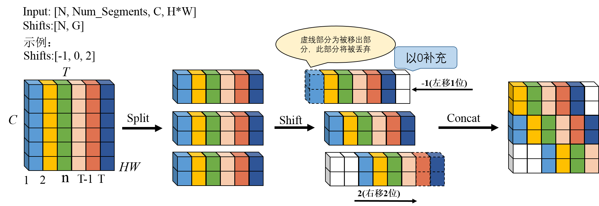

# mluOpTinShiftBackward && mluOpTinShiftForward 算子开发设计方案


* #### 文档基本信息

| 算子名称  | mluOpTinShiftBackward && mluOpTinShiftForward        |
| ----------- | ------------------------------------- |
| 编制人/日期 | 卜德飞/2021-09-27                      |
| 审批人/日期 | 周晨阳/2021-11-11                      |
| 审批人/日期 | 鲁德辉/2021-11-11                      |
| 审批人/日期 | 邓皓煜/2021-11-11                      |


* #### 修改记录

| 版本号| 修订人 | 修订日期 | 修订描述 |
| ----- | ------ | ------- | ------- |
| V1.0 | 卜德飞  | 2021-09-27 | 首次提交 |


* #### 内容描述

本文档为`mluOpTinShiftBackward`、`mluOpTinShiftForward`算子的设计文档，包括需求分析、接口设计、方案设计、性能优化记录和方案实施部分。

## 1 需求分析

### 1.1 算子需求分析

| 算子功能简介| 对输入进行分组后分别对不同的时间序列进行shift操作，丢弃位移后超出时间序列的数据，位移后无数据补充的位置用0填充 |
|-----------------|-----------------------------------------------------------------|
| 需求来源       |     mmcv                                                 |
| 应用网络         |   TIN(Temporal Interelacing Network)                            |
| 输入数据类型     |   input: fp16(half)/fp32; shifts:int32           |
| 输入Shape       |   input: [batches, num_segments, channels, H*W]; shifts: [batches, group_size]  |
| 输入Layout      |   input: ARRAY; shifts: ARRAY                                 |
| 输出数据类型     |   fp16(half)/fp32             |
| 输出Shape       |   output: [batches, num_segments, channels, H*W]                        |
| 输出Layout      |   ARRAY                                                      |
| 是否需要支持原位             | 否                          |
| 是否需要支持stride机制       | 否                          |
| 0元素检查是否直接返回        | input和output的第二维支持0元素，返回MLUOP_STATUS_SUCCESS；其余维度不支持0元素,返回MLUOP_STATUS_BAD_PARAM    |


### 1.2 算子功能和应用场景描述

- 算子功能：该算子实现shift操作，特点在于以channel维度进行分组，在时间维度上对不同组进行不同的shift操作，主要用于时间序列的时空信息交错。
 
- 示例中的输入尺寸为：Input：[1, 6, 6, 1]，Shifts:[-1, 0, 2]
- 输入按照通道分为3组，每组含2个通道。第一组的偏移量为-1，往左移1个时间序列；第二组的偏移量为0，保持不变；第三组的偏移量为2，往右移2个时间序列。其中C为通道数，G为分组数，C必须为G的整数倍。

备注：

1、需要说明对nan/inf的特殊处理，输入存在nan/inf的，分为输入当中只包含nan、只包含inf、同时包含nan和inf的情况。
- 该算子支持nan和inf输入。

### 1.3 算子输入输出参数要求
#### 1.3.1 mluOpTinShiftForward
| 参数               | 语义                       | 类型（输入/输出） | 支持类型                 | 物理布局 | 规模限制 |
| ----------------- | ------------------------- | --------------- | ------------------------ | -------- | -------- |
| handle          | 操作句柄             | 输入              | mluOpHandle_t             |   -   | 无    |    
| input_desc      | 输入特征图的尺寸信息          | 输入              | mluOpTensorDescriptor_t     |  -   | 无    |  
| input           | 输入特征图                   | 输入              | fp16(half)/fp32  | ARRAY  | 无   | 
| shifts_desc     | shifts操作值的尺寸信息        | 输入              | mluOpTensorDescriptor_t     |  -  | 无    |  
| shifts          |  shifts操作值                | 输入              | int32  | ARRAY  | 无   | 
| output_desc     | 输出特征图的尺寸信息          | 输入              | mluOpTensorDescriptor_t     |  -   | 无    |  
| output          | 经过shift操作之后的特征图     | 输出              | fp16(half)/fp32  | ARRAY  | 无   |  

#### 1.3.2 mluOpTinShiftBackward
| 参数               | 语义                       | 类型（输入/输出） | 支持类型                 | 物理布局 | 规模限制 |
| ----------------- | ------------------------- | --------------- | ------------------------ | -------- | -------- |
| handle          | 操作句柄             | 输入              | mluOpHandle_t             |   -   | 无    |    
| grad_output_desc      | 输出梯度值的尺寸信息          | 输入              | mluOpTensorDescriptor_t  |  -   | 无    |  
| grad_output           | 输出梯度值                   | 输入              | fp16(half)/fp32  | ARRAY  | 无   | 
| shifts_desc     | shifts操作值的尺寸信息        | 输入              | mluOpTensorDescriptor_t     |  -  | 无    |  
| shifts          |  shifts操作值                | 输入              | int32  | ARRAY  | 无   | 
| grad_input_desc     | 输入梯度的尺寸信息          | 输入              | mluOpTensorDescriptor_t     |  -   | 无    |  
| grad_input          | 经过shift操作之后的输出梯度结果     | 输出              | fp16(half)/fp32  | ARRAY  | 无   |  

### 1.4 算子限制

| 限制类型   | 详细说明             |
| --------- | -------------------- |
| 数据类型限制   |  输入和输出的类型一致，且只支持half或float |
| 布局限制 | input必须是四维tensor，shifts必须是2维tensor|
| 规模限制 | 无|
| 功能限制    | 无        |
| 数据范围限制| 无        |
| 原位限制    | 不支持原位|
| stride限制  | 不支持stride机制|
| 广播限制    | 不支持广播|

### 1.5 验收标准

#### 1.5.1 精度验收标准

本算子属于纯 IO 类算子，验收标准为 diff3=0。

#### 1.5.2 性能验收标准

见 [MLU-OPS 性能验收标准](../MLU-OPS-Performance-Acceptance-Standard.md)。

## 2 算子接口设计

### 2.1 Forward
#### 2.1.1 参考接口

- mmcv
``` python
 output = mmcv.ops.tin_shift(input, shifts)
```
- CUDA
```c++
 void tin_shift_forward(Tensor input, Tensor shifts, Tensor output)
```

### 2.1.2 接口设计
```c++
mluOpStatus_t MLUOP_WIN_API
mluOpTinShiftForward(mluOpHandle_t handle,
                     const mluOpTensorDescriptor_t input_desc,
                     const void *input,
                     const mluOpTensorDescriptor_t shifts_desc,
                     const void *shifts,
                     const mluOpTensorDescriptor_t output_desc,
                     void *output);
```

### 2.2 Backward
#### 2.2.1 参考接口

- mmcv
``` python
 output = mmcv.ops.tin_shift(input, shifts)
 output.backward(input)
```
- CUDA
```c++
 void tin_shift_backward(Tensor input, Tensor shifts, Tensor output)
```

### 2.2.2 接口设计
```c++
mluOpStatus_t MLUOP_WIN_API
mluOpTinShiftBackward(mluOpHandle_t handle,
                      const mluOpTensorDescriptor_t grad_output_desc,
                      const void *grad_output,
                      const mluOpTensorDescriptor_t shifts_desc,
                      const void *shifts,
                      const mluOpTensorDescriptor_t grad_input_desc,
                      void *grad_input);
```

## 3 实现方案设计

### 3.1 实现方案
- 总方案为将数据从GDRAM拷贝到NRAM时将偏移量施加在数据上，然后将数据从NRAM拷贝回GDRAM。
- 1、当一个核心的内存可以存储一个channel的数据(t_size * hw_size)时，每个核心每次处理一个channel的数据；
- 1.1、确定每个channel的shift操作，由于是以channel为组在时间维度进行位移，则同一channel的数据进行相同的操作，故仅需判断每个channel的第一个位置的shift操作;每个channel的第一个位置即时间序列0位置处，索引计算方式为(cur_channel_index为当前处理的通道数)：
```c++
int index = (cur_channel_index % channel_size) * hw_size + n_index * t_size * channel_size * hw_size;
```
- 1.2、将数据从GDRAM拷贝至NRAM，将shift作用于输入地址或目标地址，根据offset的正负分为两种情况处理；
- 1.2.1、offset > 0
```c++
__memcpy(data_nram + t_shift * hw_size * sizeof(T), input + index, hw_size * sizeof(T), GDRAM2NRAM, hw_size * sizeof(T), channel_size * hw_size * sizeof(T), t_size - 1 - t_shift);
```
- 1.2.2、offset <= 0
```c++
__memcpy(data_nram, input + (index - t_shift * channel_size * hw_size), hw_size * sizeof(T), GDRAM2NRAM, hw_size * sizeof(T), channel_size * hw_size * sizeof(T), t_size - 1 + t_shift);
```
- 1.3、在步骤1.2完成以后将数据从NRAM拷贝回GDRAM，
```c++
__memcpy(output + index, data_nram, hw_size * sizeof(T), NRAM2GDRAM, channel_size * hw_size * sizeof(T), hw_size * sizeof(T), t_size - 1);
```
- 2、当一个核心的内存不足以存储一个channel的数据时，将channel的数据在时间维度上进行拆分
- 2.1 单个channel在时间维度拆分，设单个核心能容纳的份数为G，有以下几种情况（以G=3为例）:
- 
- 2.1.1 情况1
- &emsp;offset所在位置刚好分组的整数倍位置，则仅需对当次数据通过偏移量的大小进行合适的处理，搬移出去的位置以0填充。
- 2.1.2 情况2
- &emsp;相比于情况1，offset刚好分割了一次数据迁移，使得该次数据部分是偏移后的数据，一部分是0填充得到的数据；
- 2.1.3 情况3
- &emsp;相比于情况2，offset所在的位置使得最后一次数据迁移时，会把最后一组不够整分组的数据进行搬移。
- 以上情况还需对offset的正负进行讨论。
- 3、当一个核心的内存不足以存储一个HW的数据时，将对HW进行拆分，由一个核心分批处理一个HW。

### 3.2 伪代码实现（可选）

### 3.3 拆分(任务拆分，多核拆分)

- 1、基本任务类型 : U1
- 2、cluster内拆分：
- &emsp;2.1、当一个核心的内存可以存储一个channel的数据时，以channel进行拆分，每个核每次接收一个channel的数据;
- &emsp;2.2、当一个核心的内存不足以存储一个channel的数据时，将单个channel的数据在时间维度上进行拆分;
- &emsp;2.3、当一个核心的内存不足以存储一个HW的数据时，将对HW数据进行拆分；

### 3.4 性能优化设计

1、资源分配
| 表项      | 分配策略  |
| ----------------| -----------|
| NRAM      | 保存神经元数据 |

### 3.5 可维护性设计

1、bangc 代码中加入必要的 log 信息，比如输入的规模、数据类型、layout 这些，以及如果出错会导致程序 core dump 的变量，比如 IO 指令的 data_size、dim xyz 的值等，这些信息都是有利于快速定位问题；

2、对每一个函数命名变量命名都有充分的注释；

3、避免魔鬼数字，对于确定的数字尽量使用公共宏来替代。

### 3.6 测试用例设计

无

### 3.5 算子防呆检查
- 1、指针为空防呆；
- 2、0元素检查防呆；
- 3、输入输出的dtype、shape均一致防呆；
- 4、输入的通道数为偏移量的分组数的整数倍防呆；
- 5、输入input和输出output的维数必须为4；
- 6、输入shifts的维数必须为2；
- 7、输入input的第一维大小必须等于输入shifts的第一维大小。


## 4 算子性能优化记录

### 4.1 当前存在问题的规模说明

| 提交日期  | 提交JIRA号 | 问题规模 | 问题描述   | 是否已修复  | 修复JIRA号  |
| ----------- | -----------|----------|--------------|--------------|--------------|


## 5 方案实施

### 5.1 开发测试计划

- 2021.9.13 - 2021.9.15 调研tin_shift_forward和tin_shift_backward功能+源码

- 2021.9.16 - 2021.9.18 编写设计文档

- 2021.9.19 - 2021.9.28 generator代码开发

- 2021.9.29 - 2021.10.12 gtest代码开发

- 2021.10.13 - 2021.10.19 HOST端逻辑开发

- 2021.10.20 - 2021.11.5 完成kernel开发

- 2021.11.6 - 2021.11.12 测试

- 2021.11.12 - 2021.11.16编写测试报告+代码review

- 2021.11.17 代码合入仓库

### 5.2 风险分析

暂无