# yolo_box 算子开发设计方案

- #### 文档基本信息

| 算子名称    | yolo_box         |
| ----------- | ---------------- |
| 编制人/日期 | 吴少强/2022-8-16 |
| 审批人/日期 | 王远/2022-8-25   |
| 审批人/日期 | 董成威/2022-8-25 |

- #### 修改记录

| 修订人 | 修订日期  | 修订描述 |
| ------ | --------- | -------- |
| 吴少强 | 2022-8-16 | 首次提交 |

- #### 内容描述

本文档为`yolo_box`算子的设计文档，包括需求分析、接口设计、方案设计、性能优化记录和方案实施部分。

- #### 算子需求 checklist

* 算子接口描述
* 功能描述
* 框架版本 + 对应源码路径
* 需求对应网络
* 网络中用到的规模
* 是否需要支持原位
* 是否需要支持 stride 机制
* 框架单元测试阈值指标（可选）

## 1 需求分析

### 1.1 算子需求分析

| 算子功能简介                                                 | 从检测网络的backbone输出部分，计算真实检测框bounding box信息 |
| :----------------------------------------------------------- | ------------------------------------------------------------ |
| 需求来源                                                     | Paddle                                                       |
| 应用网络                                                     | ppyolo                                                       |
| 输入数据类型                                                 | x: float<br />img_size: int<br />anchors: int                |
| 输入 Shape                                                   | x: [N, C, H, W]<br />img_size: [N, 2]<br />anchors: [2*S]    |
| 输入 Layout                                                  | x: ARRAY<br />img_size: ARRAY<br />anchors: ARRAY            |
| 输入标量参数                                                 | class_num: int<br />conf_thresh: float<br />downsample_ratio: int<br />clip_bbox: bool<br />scale: float<br />iou_aware: bool<br />iou_aware_factor: float |
| 输出数据类型                                                 | float                                                        |
| 输出 Shape                                                   | boxes: [N, S, 4, H\*W]<br />scores: [N, S, class_num, H\*W]  |
| 输出 Layout                                                  | boxes: ARRAY <br />scores: ARRAY                             |
| 模式(可选）                                                  | 否                                                           |
| 是否含有 dim/axis 等类似语义的参数且该参数支持负数/其他特殊处理 | 否                                                           |
| 是否含有 labels/index 等类似语义的参数且该参数支持负数/界外情况/其他特殊处理 | 否                                                           |
| 是否需要支持原位                                             | 否                                                           |
| 是否需要支持 stride 机制                                     | 否                                                           |
| 是否需要支持广播                                             | 否                                                           |
| 0 元素检查是否直接返回                                       | 是 ：<br />输入输出tensor的维度N为0时，返回MLUOP_STATUS_SUCCESS<br />输入x tensor的H或W为0时，返回MLUOP_STATUS_SUCCESS |
| 其他特殊需求(在线量化，融合，转数提前等，可选)               | 无                                                           |
| 本次开发优先支持的规模/模式                                  | 无                                                           |

### 1.2 算子功能和应用场景描述

1. **算子功能**

   yolo_box负责从检测网络的backbone输出部分，计算真实检测框bounding box(以下简称bbox)信息。

2. **输入tensor说明**

   1. **输入x tensor**：shape为`[N,C,H,W]`，第二维（C）存储每个bbox的坐标信息、置信度、分类得分。 `W` 和` H`为特征图feature map的宽和高，对于特征图中的每个像素点，预测`S`个检测框，`S`由`anchors tensor`的大小决定，即`S=anchors.size()/2`。

      - C维度的大小由`iou_aware`的取值决定：

        - 当`iou_aware==false`时，C等于`S*(5+class_num)` ，其中5分别为bbox坐标信息，如图1中`x0,y0`（坐标偏移值），`w0,h0`（尺度缩放）、置信度`conf`，其中`class_num`为类别数，且`class_num`须大于0，最后`class_num`个值表示每个类别的分类得分。

        - 当`iou_aware==true`时，C等于 `S*(6+class_num)`，因在最前面上增加了`S`个`iou`值，因此C等于 `S+S*(5+class_num)` ，即` S*(6+class_num)` 。

      - C维度的数据摆放说明：

        举例：输入`x tensor`，shape为` [N,C,H,W]`，假设S=2，class_num=2时，C维度的数据摆放如下：

        - 当`iou_aware=false`时 ，其中一个bbox的数据摆放为:

          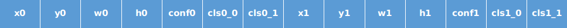 

          <div align='center' >图1</div>

        - 当`iou_aware=true`时 ，其中一个bbox的数据摆放为:

          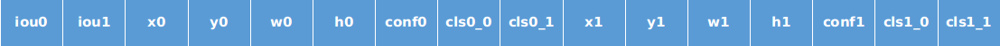
          <div align='center' >图2</div>

        ​	说明：图1、图2中`x0`的大小为`H*W`，其他数据的大小与`x0`相同。

      - 像素点坐标信息说明：

        从输入`x tensor`中取出一个像素点对应的坐标信息，表示为t<sub>x</sub>，t<sub>y</sub>，t<sub>w</sub>，t<sub>h</sub>，含义如下图所示：

        <div align='center' >
            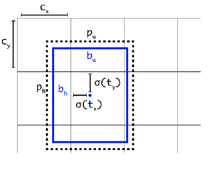
        </div>
        
        <div align='center' >图3</div>
        
        其中c<sub>x</sub>、c<sub>y</sub>、p<sub>w</sub>、p<sub>h</sub>分别表示特征图左上角顶点坐标的横坐标偏移、纵坐标偏移、anchor的宽、anchor的高。

   2. **输入img_size tensor**：shape为`[N,2]`，保存每个输入图像的高度和宽度，用于对输出图像按输入图像比例调整输出框的大小，数据类型int。

   3. **输入anchors tensor**： shape为`[2*S]`，表示anchor的宽度和高度，计算时将逐对解析，其中S表示每个像素点应预测的框的数量，数据类型int。

3. **bbox计算过程及公式**

   bbox计算分三步：坐标解码、坐标（左上角和右下角）还原、坐标裁剪。

   1. bbox坐标解码：图1中`x0,y0`表示解码前坐标偏移值，`w0,h0`表示解码前尺度缩放。解码后中心点坐标以及宽高的计算，如**公式(1)**:

      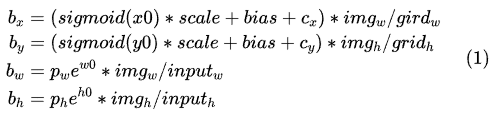

      参数说明：

      - c<sub>x</sub>、c<sub>y</sub>为特征图左上角顶点坐标的横坐标偏移、纵坐标偏移
      - p<sub>w</sub>、p<sub>h</sub>为anchor宽和高，从`anchors`中成对获取
      - scale为bbox中心点坐标的缩放系数
      - bias = -0.5 * (scale - 1)，表示bbox中心点坐标的偏移量
      - grid<sub>w</sub>、grid<sub>h</sub>为标量值，分别等于`x tensor`的W、H维度的大小
      - inputW = downsample_ratio * grid<sub>w</sub>、inputH=downsample_ratio * grid<sub>h</sub>，其中downsample_ratio表示输入yolo_box的下采样率，应依次设置为32,16,8
      - img<sub>w</sub>、img<sub>h</sub>为`img_size`的最低维元素，表示输入图像的宽和高
      - 计算结果：b<sub>x</sub>、b<sub>y</sub>为预测框的中心点坐标，b<sub>w</sub>、b<sub>h</sub>为预测框的宽和高

   2. bbox坐标（左上角和右下角）还原，计算公式如下（**公式2**）：

      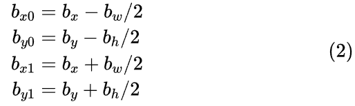

      说明：

      1. b<sub>x0</sub>、b<sub>y0</sub>表示bbox的左上角坐标，与图1中的`x0,y0`大小相等，为`H*W`
      2. b<sub>x1</sub>、b<sub>y1</sub>表示bbox的右下角坐标，与图1中的`x0,y0`大小相等，为`H*W`

   3. bbox坐标（b<sub>x0</sub>、b<sub>y0</sub>、b<sub>x1</sub>、b<sub>y1</sub>）裁剪：、

      如果`clip_bbox==true`，则将输出bbox坐标裁剪到 `img_size` 范围内，计算公式如下（**公式3**）：

      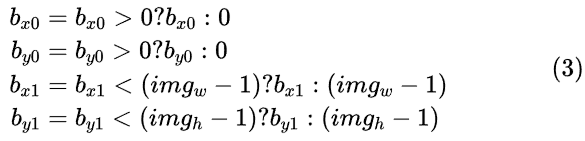

   4. 注意：在计算bbox时，当计算的置信度得分score<sub>conf</sub>小于conf_thresh，需要将该预测框的bbox坐标设置为0。

4. **scores计算过程及公式**

   - scores计算过程分三步：
     1. 计算置信度`conf`。
     2. 计算置信度得分score<sub>conf</sub>，当置信度得分score<sub>conf</sub>小于conf_thresh，忽略该score<sub>pred</sub>的计算，结果设置为0。
     3. 最终分类得分score<sub>pred</sub>等于置信度得分score<sub>conf</sub>和分类得分score<sub>class</sub>的乘积。

   - score<sub>pred</sub>计算步骤及公式

     - 如图2所示，获取bbox0的置信度`conf0`、分类0得分`cls0_0`，以及当`iou_aware==true`时，读取`iou0`，大小均为`H*W`。

     - 置信度`conf`计算公式（**公式4**）

       

     - 置信度得分score<sub>conf</sub>计算公式（**公式5**）

       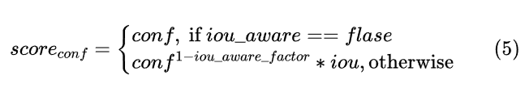

       其中iou的计算公式如下：

       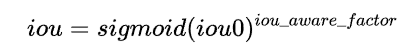

       其中`iou_aware_factor`为iou aware因子。

       公式中包含了x的y次方计算，在计算时对公式做了转换，如下图所示：

       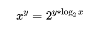

     - 最终分类得分score<sub>pred</sub>计算公式（**公式6**）
     
       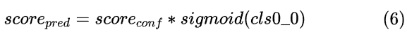
     
       score<sub>pred</sub>为检测框bbox0的分类0的得分，大小为`H*W`。

5. 参考接口行为分析

   1. nan/inf行为
      - 参数中仅x tensor、conf_thresh、scale_x_y、iou_aware_factor可以含nan/inf。
      - 当clip_bbox=True时（将输出的bbox裁剪到img_size范围内），因此bbox结果不含nan/inf。
      - 通过分析，参考接口代码实现中并未对nan/inf做特殊处理，因此mlu算子中也不需要做特殊处理。

### 1.3 算子输入输出参数要求

| 参数             | 语义                                                         | 类型（输入/输出） | 支持类型                | 物理布局 | 规模限制 |
| ---------------- | ------------------------------------------------------------ | ----------------- | ----------------------- | -------- | -------- |
| handle           | 当前可获得的资源（context）                                  | 输入              | mluOpHandle_t           | /        | 无       |
| x_desc           | 对输入数据 x 的形状描述，包含了 x 的数据类型、数据维度和布局等信息 | 输入              | mluOpTensorDescriptor_t | /        | 见1.4    |
| x                | 输入 tensor x 的地址，包含每个网格中框的坐标、置信度、分类得分等信息 | 输入              | float                   | ARRAY    | 无       |
| img_size_desc    | 对输入数据 img_size 的形状描述，包含了 img_size 的数据类型、数据维度和布局等信息 | 输入              | mluOpTensorDescriptor_t | /        | 见1.4    |
| img_size         | 输入 tensor img_size 的地址，包含输入图像的宽和高            | 输入              | int                     | ARRAY    | 无       |
| anchors_desc     | 对输入数据 anchors 的形状描述，包含了 anchors 的数据类型、数据维度和布局等信息 | 输入              | mluOpTensorDescriptor_t | /        | 见1.4    |
| anchors          | anchor的宽度和高度                                           | 输入              | int                     | ARRAY    | 无       |
| class_num        | 要预测的类别数，class_num>0                                  | 输入              | int                     | /        | 无       |
| conf_thresh      | 检测框的置信度得分阈值，置信度得分低于阈值的框应该被忽略     | 输入              | float                   | /        | 无       |
| downsample_ratio | 从网络输入到yolo_box操作输入的下采样率，因此应依次为第一个，第二个和第三个yolo_box运算设置该值为32,16,8 | 输入              | int                     | /        | 无       |
| clip_bbox        | 是否将输出的bbox裁剪到 img_size 范围内，默认为True           | 输入              | bool                    | /        | 无       |
| scale            | 放缩解码边界框的中心点，默认值：1.0                          | 输入              | float                   | /        | 无       |
| iou_aware        | 是否使用iou aware因子，默认值false                           | 输入              | bool                    | /        | 无       |
| iou_aware_factor | iou aware因子，默认值0.5                                     | 输入              | float                   | /        | 无       |
| boxes_desc       | 对输出数据 boxes 的形状描述，包含了 boxes 的数据类型、数据维度和布局等信息 | 输入              | mluOpTensorDescriptor_t | /        | 见1.4    |
| boxes            | 输出 tensor boxes 的地址，保存每个框的左上角和右下角的坐标   | 输出              | float                   | ARRAY    | 无       |
| scores_desc      | 对输出数据  scores 的形状描述，包含了 scores 的数据类型、数据维度和布局等信息 | 输入              | mluOpTensorDescriptor_t | /        | 见1.4    |
| scores           | 输出 tensor scores 的地址，保存每个框中每个类别的最终得分    | 输出              | float                   | ARRAY    | 无       |

### 1.4 算子限制

| 限制类型     | 详细说明                                                     |
| ------------ | ------------------------------------------------------------ |
| 数据类型限制 | x、boxes、scores：仅支持float                                |
| 布局限制     | x、img_size、anchors、boxes、scores：ARRAY                   |
| 规模限制     | anchors的shape为`[2*S]`，S须大于0，且 S % 2 == 0<br />x的shape为`[N,C,H,W]`，C须大于0<br />img_size的shape为`[N, 2]`，dim[1]为2<br />boxes的shape为`[N, S, 4, H*W]`，dim[1]==S，dim[2]为4<br />scores的shape为`[N, S, class_num, H*W]`，dim[1]==S，dim[2]为class_num<br />class_num须大于0且在200平台上小于1535，在300平台上小于2559，此处class_num的取值上限由NRAM空间大小决定，计算公式：(MAX_NRAM_SIZE / sizeof(float) / 2 / 32) - 2 （见scores空间划分） |
| 功能限制     | 无限制                                                       |
| 数据范围限制 | 无                                                           |
| 原位限制     | 不支持原位                                                   |
| stride 限制  | 不支持 stride 机制                                           |
| 广播限制     | 不支持广播                                                   |

### 1.5 验收标准

#### 1.5.1 精度验收标准

按照[精度验收标准](../MLU-OPS-Accuracy-Acceptance-Standard.md)的要求明确本算子的精度标准。

本算子属于复合类算子，验收标准为 diff1 <= 3e-3 && diff2 <= 3e-3

#### 1.5.2 性能验收标准

- 参考接口性能分析

  | 平台                 | 框架版本 | 数据类型 | 规模                                                         | 计算效率  | IO效率  | Hardware Time（us） |
  | :------------------- | :------- | :------- | :----------------------------------------------------------- | :-------- | :------ | :------------------ |
  | Tesla V100-SXM2 16GB | paddle   | float    | img_size=[8, 2]<br />x=[8, 255, 19, 19]<br />anchors[6]<br />class_num=80 | 4.080262% | 26.336% | 70.9472             |
  | Tesla V100-SXM2 16GB | paddle   | float    | img_size=[8, 2]<br />x=[8, 255, 38, 38]<br />anchors[6]<br />class_num=80 | 3.62%     | 23.285% | 316.387             |
  | Tesla V100-SXM2 16GB | paddle   | float    | img_size=[8, 2]<br />x=[8, 255, 76, 76]<br />anchors[6]<br />class_num=80 | 1.2599%   | 18.447% | 3592.198            |

  - 网络中使用到的规模性能优于或至少与参考接口性能持平。
  - 部分与参考接口差距过大的规模在4.算子性能优化记录中进行说明。
  - 附上算子测试报告链接，测试报告必须包括框架给出的网络中规模的性能数据以及对应效率值。

## 2 算子接口设计

### 2.1 参考接口

```c++
template <typename T, typename Context>
void YoloBoxKernel(const Context& dev_ctx,
                   const DenseTensor& x,
                   const DenseTensor& img_size,
                   const std::vector<int>& anchors,
                   int class_num,
                   float conf_thresh,
                   int downsample_ratio,
                   bool clip_bbox,
                   float scale_x_y,
                   bool iou_aware,
                   float iou_aware_factor,
                   DenseTensor* boxes,
                   DenseTensor* scores);
```

### 2.2 接口设计

```c++
mluOpsStatus_t MLUOP_WIN_API 
mluOpYoloBox(mluOpHandle_t handle,
             const mluOpTensorDescriptor_t x_desc,
             const void *x,
             const mluOpTensorDescriptor_t img_size_desc,
             const void *img_size,
             const mluOpTensorDescriptor_t anchors_desc,
             const void *anchors,
             const int class_num,
             const float conf_thresh,
             const int downsample_ratio,
             const bool clip_bbox,
             const float scale,
             const bool iou_aware,
             const float iou_aware_factor,
             const mluOpTensorDescriptor_t boxes_desc,
             void *boxes,
             const mluOpTensorDescriptor_t scores_desc,
             void* scores);
```

## 3 实现方案设计

### 3.1 实现方案

#### 3.1.1 计算原理说明

yolo_box负责从检测网络的backbone输出部分，计算真实检测框bbox信息。该算子三个输入tensor，两个输出tensor，输入`x`维度`[N, C, H, W]`，输入`img_size`维度`[N, 2]`，输入`anchors`维度`[2*S]`，输出`boxes`维度`[N, S, 4, H*W]`，输出`scores`维度`[N, S, class_num, H*W]`。

根据输入`anchors`的size，得到每个像素点应预测框的数目`S(S=anchors.size()/2)`的大小，根据1.2的计算公式，分别计算每个框的左上角b<sub>x0</sub>，b<sub>y0</sub>，右下角坐标b<sub>x1</sub>，b<sub>y1</sub>，以及每个类别的分类得分`score_pred`。

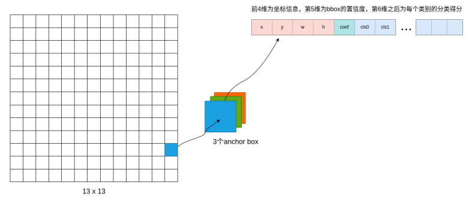

从上图可以看出：

- 该例子中每个特征图大小为13*13，其中每个像素点都通过3个anchor预测bbox信息；

- 从网络backbone拿到预测的每个bbox信息包含了（5+class_num）维数据；

- C维度的前4个元素用来解码真实的bbox坐标，第5个元素置信度需要和后续每一个元素（分类得分）做乘积，得到所有分类的真实得分；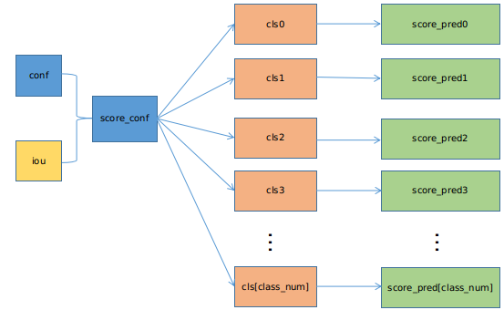  

  其中cls[class_num-1]表示有class_num个分类得分。

#### 3.1.2 nram空间划分

采用排流水，因此将nram空间划分为两份：

  

说明：每一份的大小`MAX_NRAM_SIZE/2`；

1. boxes空间划分: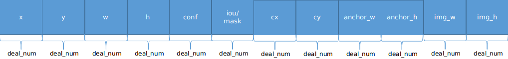

2. scores空间划分：

   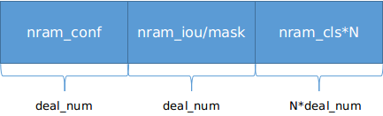  

#### 3.1.3 实现方案

由于参与坐标计算和分类得分计算的数据彼此独立，因此可实现两个功能函数，分别完成boxes和scores的计算，计算步骤如下：

- **boxes计算步骤：**

  1. 任务拆分：根据3.3 拆分(任务拆分，多核拆分)章节介绍，对`H*W`进行拆分，切分为taskDim份，计算得到`num_hw`；

     ```c
     int hw_per_task = (H*W) / taskDim;
     int rem_hw = (H*W) % taskDim;
     int num_hw = hw_per_task + (tasdId < rem_hw);
     ```

  2. 初始化阶段：

     - host端根据anchors的大小，计算得到anchor的数量，记为`anchor_s`，将其传入kernel中，伪代码如下；

       ```c
       int anchor_s = mluOpGetTensorElementNum(anchors_desc) / 2;
       ```

     - 初始化boxes内存：host端将输出`boxes`空间初始化为0，shape为`[N, S, 4, H*W]`。host端调用mluOpBlockKernelFillZeroByte的kernel，完成初始化，伪代码如下：

       ```c
         KERNEL_CHECK((mluOpBlockKernelFillZeroByte(k_dim, k_type, handle->queue,
                                                    N * S * 4 * H * W * sizeof(float), boxes)));
       ```

     - nram空间划分：根据 3.1.2 nram空间划分boxes空间划分，计算得到`deal_num`的大小；

     - 根据输入`x[N, C, H, W]`的维度W和H大小，分别计算标量值grid<sub>w</sub>、grid<sub>h</sub>、input<sub>w</sub>、input<sub>h</sub>；根据标量参数`scale`计算标量值`bias`( bias=-0.5 * (scale - 1))；

       ```c
       int gridw = W;
       int gridh = H;
       int inputw = gridw * downsample_ratio;
       int inputh = gridh * downsample_ratio;
       int bias = -0.5 * (scale - 1);
       ```

     - 当`deal_num>=(N*S*num_hw)`时，表示一次可以处理整个`[N, S, num_hw]`的数据；
     - 当`deal_num>=(S*num_hw) && deal_num<(N*S*num_hw)`时，表示一次至少可以处理一个`[S, num_hw]`的数据，则拆分`N`，外层循环最多`N`次；
     - 当`deal_num>=(num_hw) && deal_num<(S*num_hw)`时，表示一次至少可以处理一个`[num_hw]`的数据，则最外层循环`N`，中间循环最多`S`次；
     - 当`deal_num<(num_hw)`时，表示一次无法处理整个`[num_hw]`，则最外层循环`N*S`，根据`deal_num`，拆分`num_hw`；

  3. 处理阶段：

     1. 当`deal_num>=(N*S*num_hw)`时，表示一次可以处理整个`[N, S, num_hw]`的数据；

        ​	假设输入`x tensor`的shape为`[8, 3*(5+80), 19, 19]`，即`iou_ware==false, N=8, S=3, H=19, W=19`，假设 `taskDim=16`，则`num_hw = (H*W)/taskDim=23`，以taskId=0为例，说明每个nram空间计算时的数据；

        - 初始化`nram_cx[num_hw]`：取值范围为`0~x.dims[3]-1`，根据当前任务处理的数据起始索引，初始化nram_cx，表示特征图左上角顶点坐标的横坐标偏移向量，在计算bbox坐标`bx`时，需要该向量参与计算，当taskId=0时，`nram_cx`空间数据内容如下：

          ```c
          nram_cx[23] = [0,1,2,3,......,18, // h=0, num=19
                         0,1,2,3];          // h=1, num=4
          ```

        - 初始化`nram_cy[num_hw]`: 取值范围为`0~x.dims[2]-1`，根据当前任务处理的数据起始索引初始化nram_cy，表示特征图左上角顶点坐标的横坐标偏移向量，在计算bbox坐标`by`时，需要该向量参与计算，当taskId=0时，`nram_cy`空间数据内容如下：

          ```c
          nram_cy[23] = [0,0,0,0,......,0, // h=0, num=19
                         1,1,1,1];         // h=1, num=4	
          ```

        - 根据`img_size tensor`，shape为`[N,2]`，分别初始化`img_w[N, S, num_hw]、img_h[N, S, num_hw]`，当taskId=0时，`img_w`空间数据内容如下：

          ```c
          img_w[8, 3, 23] = [w0,...,w0,w0,...,w0,w0,...,w0], // n=0, 3*23
                            [w1,...,w1,w1,...,w1,w1,...,w1], // n=1, 3*23
                            ......];
          ```

        - 根据`anchors tensor`，shape为`[2*S]`，初始化`anchors_h[N, S, num_hw]，anchors_w[N, S, num_hw]`，当taskId=0时，`anchors_w`空间数据内容如下：

          ```c
          anchors_w[8, 3, 23] = [an_w0,...,   // n=0, s=0, 23
                                 an_w1,...,   // n=0, s=1, 23
                                 an_w2,...,   // n=0, s=2, 23
                                 an_w0,...,   // n=1, s=0, 23
                                 ......];
          ```

        - load数据：分别从`x tensor`中load坐标信息`x,y,w,h`，置信度`conf`，当`iou_aware==true`时，读取`iou`值，读取大小为`deal_num`，当taskId=0时，`nram_x`空间数据内容如下：

          ```c
          nram_x[8, 3, 23] = [x0,x0,x0,......, // n=0, s=0, 23
                              x1,x1,x1,......, // n=0, s=1, 23
                              x2,x2,x2,......, // n=0, s=2, 23
                              x0,x0,x0,......, // n=1, s=0, 23
                              ......]
          ```

        - compute计算：详细说明见 **4. compute计算过程**

     2. 当`deal_num>=(S*num_hw) && deal_num<(N*S*num_hw)`时，表示一次至少可以处理一个`[S, num_hw]`的数据，则拆分`N`，外层循环最多`N`次；

        ```c
        int deal_n_once = deal_num / (S*num_hw);
        int repeat_n = N / deal_n_once;
        int rem_n = N % deal_n_once;
        for(int batch_iter = 0; batch_iter < repeat_n + 1; batch_iter++) {
            ...
        }
        ```

     3. 当`deal_num>=(num_hw) && deal_num<(S*num_hw)`时，表示一次至少可以处理一个`[num_hw]`的数据，则最外层循环`N`，中间循环最多`S`次；

        ```c
        int deal_s_once = deal_num / (num_hw);
        int repeat_s = S / deal_s_once;
        int rem_s = S % deal_n_once;
        for(int batch_iter = 0; batch_iter < N; batch_iter++) {
        	for(int s_iter = 0; s_iter < repeat_s + 1; s_iter++){
                ...
            }
        }
        ```

     4. 当`deal_num<(num_hw)`时，表示一次无法处理整个`[num_hw]`，则最外层循环`N*S`，根据`deal_num`，拆分`num_hw`；

        ```c
        int deal_hw_once = deal_num;
        int repeat_hw = num_hw / deal_hw_once;
        int rem_hw = num_hw % deal_hw_once;
        for(int batch_iter = 0; batch_iter < N; batch_iter++) {
            for(int s_iter = 0; s_iter < repeat_s + 1; s_iter++) {
                for(int hw_iter = 0; hw_iter < repeat_hw + 1; hw_iter++) {
                    ...
               }
            }
        }
        ```

     5. 说明：2，3，4三种情况与**`deal_num>(N*S*num_hw)`**的计算过程基本相同；

  4. compute计算过程：

     1. 根据**公式（4)** 和 **公式（5）** 计算得到`score_conf`，伪代码如下：

        ```c
        __bang_active_sigmoid(nram_conf, nram_conf, deal_num);
        if (iou_aware) {
            __bang_active_sigmoid(nram_iou, nram_iou, deal_num);
            __bang_log(nram_iou, nram_iou, deal_num);
            __bang_mul_scalar(nram_iou, nram_iou, iou_aware_factor, deal_num);
            __bang_pow2(nram_iou, nram_iou, deal_num); 
            
            __bang_log(nram_conf, nram_conf, deal_num);
            __bang_mul_scalar(nram_conf, nram_conf, 1-iou_aware_factor, deal_num);
            __bang_pow2(nram_conf, nram_conf, deal_num);
            __bang_mul(nram_conf, nram_conf, nram_iou, deal_num);
        }
        ```

     2. 根据`score_conf>conf_thresh`生成`score_mask`，`score_mask`中值为1和0，1表示置信度得分大于`conf_thresh`，0表示置信度得分小于`conf_thresh`，`score_mask`结果存放到nram_iou/mask空间，用于第（5）步将置信度得分小于`conf_thresh`的检测框结果set为0；

        ```c
        __bang_ge_scalar(nram_mask, nram_conf, conf_thresh, deal_num);
        ```

     3. 根据**公式（2）**、**公式（3）**，计算bbox的左上角`(x0,y0)`和右下角`(x1,y1)`坐标；

        1. 计算中心点坐标和宽高

           ```c
           // 中心点坐标和宽高计算
           __bang_active_sigmoid(nram_x, nram_x, deal_num);
           __bang_active_sigmoid(nram_y, nram_y, deal_num);
           __bang_mul_scalar(nram_x, nram_x, scale, deal_num);
           __bang_mul_scalar(nram_y, nram_y, scale, deal_num);
           __bang_add_scalar(nram_x, nram_x, bias, deal_num);
           __bang_add_scalar(nram_y, nram_y, bias, deal_num);
           __bang_add(nram_x, nram_x, nram_cx, deal_num);
           __bang_add(nram_y, nram_y, nram_cy, deal_num);
           __bang_mul(nram_x, nram_x, nram_imgw, deal_num);
           __bang_mul_scalar(nram_x, nram_x, 1/gridw, deal_num);
           __bang_mul(nram_y, nram_y, nram_imgh, deal_num);
           __bang_mul_scalar(nram_y, nram_y, 1/gridh, deal_num);
           __bang_active_exphp(nram_w, nram_w, deal_num);
           __bang_active_exphp(nram_h, nram_h, deal_num);
           __bang_mul(nram_w, nram_w, anchors_w, deal_num);
           __bang_mul(nram_h, nram_h, anchors_h, deal_num);
           __bang_mul(nram_w, nram_w, nram_imgw, deal_num);
           __bang_mul_scalar(nram_w, nram_w, 1/inputw, deal_num);
           __bang_mul(nram_h, nram_h, nram_imgh, deal_num);
           __bang_mul_scalar(nram_h, nram_h, 1/inputh, deal_num);
           ```

        2. 计算左上角和右下角坐标

           ```c
           // 左上角和右下角坐标计算
           // bx0 = bx - bw/2;
           // by0 = by - bh/2;
           // bx1 = bx + bw/2 = bx0 + bw;
           // by1 = by + bh/2 = by0 + bh;
           __bang_mul_scalar(nram_conf, nram_w, 0.5, deal_num);
           __bang_sub(nram_x, nram_x, nram_conf, deal_num);
           __bang_mul_scalar(nram_conf, nram_h, 0.5, deal_num);
           __bang_sub(nram_y, nram_y, nram_conf, deal_num);
           __bang_add(nram_w, nram_x, nram_w, deal_num);
           __bang_add(nram_h, nram_y, nram_h, deal_num);
           ```

        3. 坐标裁剪：当clip_bbox==true时，将bbox的左上角和右下角坐标裁剪到输入图像的宽img<sub>w</sub>和高img<sub>h</sub>

           ```c
           // bx0 = bx0 > 0 ? bx0 : 0;
           // by0 = by0 > 0 ? by0 : 0;
           // bx1 = bx1 < imgw ? bx1 : 0;
           // by1 = by1 < imgh ? by1 : 0;
           __bang_maxeq_scalar(nram_x, nram_x, 0, deal_num);
           __bang_maxeq_scalar(nram_y, nram_y, 0, deal_num);
           __bang_minequal(nram_w, nram_w, nram_imgw, deal_num);
           __bang_minequal(nram_h, nram_h, nram_imgh, deal_num);
           ```

     4. 将小于`conf_thresh`的框的坐标set为0，即将bbox坐标（左上角和右下角）乘以`score_mask`，`score_mask`存储在nram_mask中；

        ```c
        __bang_mul(nram_x, nram_x, nram_mask, deal_num);
        __bang_mul(nram_y, nram_y, nram_mask, deal_num);
        __bang_mul(nram_w, nram_w, nram_mask, deal_num);
        __bang_mul(nram_h, nram_h, nram_mask, deal_num);
        ```

- scores计算步骤：
  1. 任务拆分：根据3.3 拆分(任务拆分，多核拆分)章节介绍，对`H*W`进行拆分，切分为taskDim份，计算得到`num_hw`；

     ```c
     int hw_per_task = (H*W) / taskDim;
     int rem_hw = (H*W) % taskDim;
     int num_hw = hw_per_task + (tasdId < rem_hw);
     ```

  2. 初始化阶段：

     - 初始化scores内存：host端将输出`scores`空间初始化为0，shape为`[N, S, class_num, H*W]`。host端调用mluOpBlockKernelFillZeroByte的kernel，完成初始化，伪代码如下：

       ```c
         KERNEL_CHECK((mluOpBlockKernelFillZeroByte(k_dim, k_type, handle->queue,
                                                    N * S * class_num * H * W * sizeof(float), scores)));
       ```

     - nram空间划分：根据 3.1.2节分类得分空间划分，计算得到`deal_num`；

     - 当`deal_num>=(N*S*num_hw)`时，表示一次可以处理整个`[N, S, num_hw]`的数据；

     - 当`deal_num>=(S*num_hw) && deal_num<(N*S*num_hw)`时，表示一次至少可以处理一个`[S, num_hw]`的数据，则拆分`N`，外层循环最多`N`次；

     - 当`deal_num>=(num_hw) && deal_num<(S*num_hw)`时，表示一次至少可以处理一个`[num_hw]`的数据，则最外层循环`N`，中间循环最多`S`次；

     - 当`deal_num<(num_hw)`时，表示一次无法处理整个`[num_hw]`，则最外层循环`N*S`，根据`deal_num`，拆分`num_hw`；

  3. 处理阶段：

     1. 当`deal_num>(N*S*num_hw)`时，表示一次可以处理整个`[N, S, num_hw]`的数据；

        假设输入`x tensor`的shape为`[8, 3*(5+80), 19, 19]`，即`iou_ware==false, N=8, S=3, class_num=80, H=19, W=19`，假设` taskDim=16`，则`num_hw = (H*W)/taskDim=23`，以taskId=0为例，说明每个nram空间计算时的数据；

        - 当`deal_num>(N*S*num_hw)`时，表示一次可以处理整个`[N, S, num_hw]`的数据；

        - load数据：分别从`x tensor`中load置信度`conf`，当`iou_aware==true`时，读取`iou`值，load所有分类得分值`cls`，读取大小为`deal_num`，当taskId=0时，`nram_conf,nram_cls`空间数据内容如下：

          ```c
          nram_conf[8, 3, 23] = [conf0,......, // n=0, s=0, 23
                                 conf0,......, // n=0, s=1, 23
                                 conf0,......, // n=0, s=2, 23
                                 conf1,......, // n=1, s=0, 23
                                 conf1,......, // n=1, s=1, 23
                                 conf1,......, // n=1, s=2, 23
                                 ......,
                                 confN,......, // n=7, s=0, 23
                                 confN,......, // n=7, s=1, 23
                                 confN,......]; // n=7, s=2, 23
          nram_cls[8, 3, class_num, 23] = [cls0,..., // n=0, s=0, class0=23
                                           cls0,..., // n=0, s=1, class0=23
                                           cls0,..., // n=0, s=2, class0=23
                                           cls0,..., // n=1, s=0, class0=23
                                           ......,
                                           cls0,..., // n=7, s=2, class0=23
                                           
                                           cls1,..., // n=0, s=0, class1=23
                                           cls1,..., // n=0, s=1, class1=23
                                           cls1,..., // n=0, s=2, class1=23
                                           cls1,..., // n=1, s=0, class1=23
                                           ......,
                                           cls1,..., // n=7, s=2, class0=23
                                           
                                           ......,
                                           clsN,..., // n=0, s=0, classN=23                                  
                                           clsN,..., // n=0, s=1, classN=23
                                           clsN,..., // n=0, s=2, classN=23
                                           clsN,..., // n=1, s=0, classN=23
                                           ......,
                                           clsN,...]; // n=7, s=2, class0=23
          ```

          `nram_iou`与`nram_conf`的数据格式相同。

          说明：`nram_conf`与`nram_cls`计算时，有两种方式：

          - 扩展`nram_conf[8, 3, 23]` 为`[8, 3, class_num, 23]`；
          - 循环`N*S`次，每次完成一个`nram_conf[23]` 与 `nram_cls[class_num, 23]`的计算；

        - compute计算：详细说明见 **4. compute计算过程**；

     2. 其他三种情况，与boxes计算步骤中的切分逻辑相同

  4. compute计算过程：

     1. 根据**公式（4)** 和 **公式（5）** 计算得到`score_conf`，伪代码如下：

        ```c
        __bang_active_sigmoid(nram_conf, nram_conf, deal_num);
        if (iou_aware) {
            __bang_active_sigmoid(nram_iou, nram_iou, deal_num);
            __bang_log(nram_iou, nram_iou, deal_num);
            __bang_mul_scalar(nram_iou, nram_iou, iou_aware_factor, deal_num);
            __bang_pow2(nram_iou, nram_iou, deal_num);
            
            __bang_log(nram_conf, nram_conf, deal_num);
            __bang_mul_scalar(nram_conf, 1-iou_aware_factor, deal_num);
            __bang_pow2(nram_conf, nram_conf, deal_num);
            __bang_mul(nram_conf, nram_conf, nram_iou, deal_num);
        }
        ```

     2. 根据`score_conf>conf_thresh`生成`score_mask`，`score_mask`中值为1和0，1表示置信度得分大于`conf_thresh`，0表示置信度得分小于`conf_thresh`，`score_mask`结果存放到nram_mask空间，用于第（7）步将`score_conf<conf_thresh`的分类得分结果set为0；

        ```c
        __bang_ge_scalar(nram_mask, nram_conf, conf_thresh, deal_num);
        ```

     5. 将`score_conf`中`score_conf<conf_thresh`的值置成`conf_thresh`，防止因`score_conf`中含有-inf，导致score的计算结果为nan，参考接口结果为0；

        ```c
        __bang_maxeq_scalar(nram_conf, nram_conf, conf_thresh, deal_num);
        ```

     6. 根据 **公式（6）** 计算得到`score_pred`；

        ```c
        __bang_active_sigmoid(nram_cls, nram_cls, class_num * deal_num);
        __bang_cycle_mul(nram_cls, nram_cls, nram_conf, class_num * deal_num, deal_num);
        ```

     7. 将小于`conf_thresh`的`score_pred`结果set为0，即将`score_pred`结果乘以`score_mask`；

        ```c
        __bang_cycle_mul(nram_cls, nram_cls, nram_mask, class_num * deal_num, deal_num);
        ```

### 3.2 伪代码实现（可选）

### 3.3 拆分(任务拆分，多核拆分)

- 基本任务类型为BLOCK任务。

- 输入`x`的shape为`[N, C, H, W]`，当`iou_aware==false`时，C等于`S*(5+class_num)`，因此可以将输入`x`的shape看成`[N, S*(5+class_num), H, W]`，拆分`H*W`，将`H*W`平均拆分到所有task上处理；

    ```c
    int hw_per_task = (H*W) / taskDim;
    int rem_hw = (H*W) % taskDim;
    int num_hw = hw_per_task + (tasdId < rem_hw);
    ```

- 每个task处理数据规模为`[N, S, 5+class_num, num_hw]`；

- 计算时将bbox和score分开计算：

    - 计算bbox的数据规模为`[N, S, 5, num_hw]`，其中5表示4个坐标信息和1个置信度，分别为：
        - x坐标的规模：`[N, S, 1, num_hw]`，大小为`N*S*num_hw`
        - y坐标的规模：`[N, S, 1, num_hw]`，大小为`N*S*num_hw`
        - w坐标的规模：`[N, S, 1, num_hw]`，大小为`N*S*num_hw`
        - h坐标的规模：`[N, S, 1, num_hw]`，大小为`N*S*num_hw`
        - 置信度conf的规模：`[N, S, 1, num_hw]`，大小为`N*S*num_hw`

    - 计算score的数据规模为`[N, S, 1+class_num, num_hw]`，其中1+class_num表示1个置信度和class_num个分类得分值。
        - 置信度conf的规模：`[N, S, 1, num_hw]`，大小为`N*S*num_hw`
        - 分类得分class0的规模：`[N, S, 1, num_hw]`，大小为`N*S*num_hw`
        - 其他分类得分与class0的规模相同。

- 根据nram空间划分和数据规模，task内处理时有四种拆分情况，假设每一份nram空间大小为`deal_num`：

    - 当`deal_num>=(N*S*num_hw)`时，表示一次可以处理整个`[N, S, num_hw]`的数据；
    - 当`deal_num>=(S*num_hw) && deal_num<(N*S*num_hw)`时，表示一次至少可以处理一个`[S, num_hw]`的数据，则拆分`N`，外层循环最多`N`次；
    - 当`deal_num>=(num_hw) && deal_num<(S*num_hw)`时，表示一次至少可以处理一个`[num_hw]`的数据，则最外层循环`N`，中间循环最多`S`次；
    - 当`deal_num<(num_hw)`时，表示一次无法处理整个`[num_hw]`，则最外层循环`N*S`，根据`deal_num`，拆分`num_hw`；


### 3.4 性能优化设计

1、资源分配

| 表项            | 分配策略                                                     |
| --------------- | ------------------------------------------------------------ |
| NRAM            | 计算boxes时：NRAM 划分为ping\pong两大部分，其中每一部分划分见3.1实现方案<br />计算scores时：NRAM 划分为ping\pong两大部分，其中每一部分划分见3.1实现方案 |
| WRAM            | 未使用                                                       |
| SRAM            | 未使用                                                       |
| DRAM(workspace) | 未使用                                                       |

2、流水设计


- boxes计算流水：采用三级流水设计，L C S 之间排流水，即 GDRAM2NRAM、Compute、NRAM2GDRAM。

- scores计算流水：采用三级流水设计，L C S 之间排流水，即 GDRAM2NRAM、Compute、NRAM2GDRAM。

### 3.5 可维护性设计

1、bangc 代码中加入必要的 log 信息，比如输入的规模、数据类型、layout 这些，以及如果出错会导致程序 core dump 的变量，比如 IO 指令的 data_size、dim xyz 的值等，这些信息都是有利于快速定位问题。

2、对每一个函数命名变量命名都有充分的注释

3、避免魔鬼数字，对于确定的数字尽量使用公共宏来替代

### 3.6 测试用例设计

- 算子在网络中用到的规模：
  - case1
    - input tensor：ImgSize=[8, 2], X=[8, 255, 19, 19], 
    - output tensor：Boxes=[8, 1083, 4], Scores=[8, 1083, 80]

  - case2
    - input tensor：ImgSize=[8, 2], X=[8, 255,  38, 38], 
    - output tensor：Boxes=[8, 4332, 4], Scores=[8, 4332, 80]

  - case3
    - input tensor：ImgSize=[8, 2], X=[8, 255,  76, 76], 
    - output tensor：Boxes=[8, 17328, 4], Scores=[8, 17328, 80]


其他可根据需要进行补充。算子开发完毕后，补充测试报告链接。

### 3.7 算子防呆检查

- 描述符指针为空防呆：handle、x_desc、 img_size_desc、anchors_desc、boxes_desc、scores_desc

- 0 元素检查防呆

- 对输入输出支持的 dtype、layout 以及 shape 进行防呆
  	 1. dtype防呆：x_desc、boxes_desc、scores_desc：仅支持float
         	 1. dtype防呆：img_size_desc、anchors_desc：仅支持int
               	 1. layout防呆：x_desc仅支持NCHW
                 	 1. shape防呆：x_desc、img_size_desc、boxes_desc、scores_desc的N维度必须相等；x_desc的C维度防呆等；

- 指针为空防呆：x、img_size、anchors、boxes、scores

## 4 算子性能优化记录

### 4.1 当前存在问题的规模说明

无

| 提交日期 | 问题规模 | 问题描述 | 是否已修复 |
| -------- | -------- | -------- | ---------- |
|          |          |          |            |

### 4.2 已经过优化的规模说明

无

| 提交日期 | 修复规模 | 修复问题 |
| -------- | -------- | -------- |
|          |          |          |

## 5 方案实施

### 5.1 开发测试计划

- 总体计划：2022.8.16-2022.9.9
- 2022.8.16-2022.8.19：算子功能调研、竞品分析、方案设计编写
- 2022.8.22-2022.8.26：方案设计评审，generator和gtest代码开发
- 2022.8.29-2022.9.2：算子host/device代码实现、功能调试，大规模测试
- 2022.9.5-2022.9.9：输出测试报告，PR

### 5.2 风险分析

暂无。
