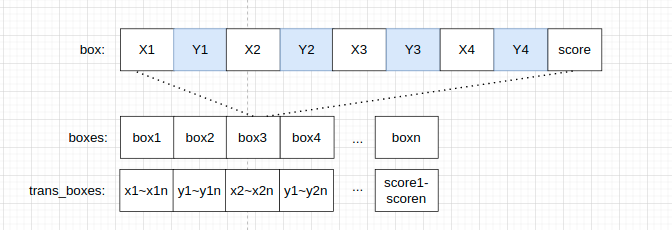
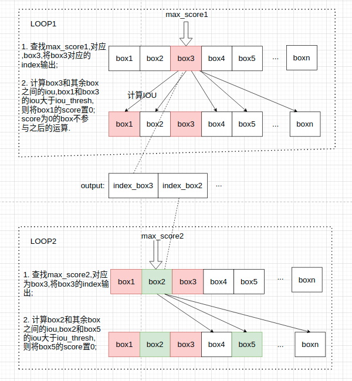
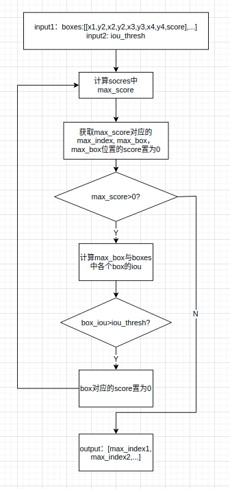

# poly_nms 算子开发设计方案


* #### 文档基本信息

| 项目名称    | Training Solution |
| ----------- | ----------------- |
| 算子名称    | poly_nms     |
| JIRA编号    | [CNNLCORE-6878]   |
| 编制人/日期 | 谷中豪/2022-05-31 |
| 审批人/日期	|  |
| 审批人/日期	|  |
| 审批人/日期	|   |

* #### 修改记录

| 版本号| 修订人 | 修订日期 | 修订描述 |
| ----- | ------ | -------  | -------  |
| V1.0  | 谷中豪   | 2022-05-31 | 首次提交 |
* #### 内容描述

本文档为`poly_nms`算子的设计文档，包括需求分析、接口设计、方案设计、性能优化记录和方案实施部分。

* #### 算子需求checklist

算子需求提出者需要`提供`的信息如下：

- 框架负责人
- 算子接口描述
- 功能描述
- 框架版本 + 对应源码路径
- 需求对应网络
- 网络中用到的规模
- 常用规模下的竞品性能（可选）
- 是否需要支持原位
- 是否需要支持stride机制
- 框架单元测试阈值指标（可选）
- 其他特殊需求（在线量化/融合/转数提前等，可选）
- 确认算子需求是否已经过框架层review（滤除mluOp已支持的算子）

算子需求提出者需要`check`的部分如下：

- 1.1 算子需求分析
- 1.2 算子功能和应用场景描述
- 1.3 算子输入输出参数要求
- 1.4 算子限制
- 1.5 验收标准
- 2.2 接口设计
- 3.5 测试用例（需求提出者check算子需求表中所给规模是否列出）

## 1 需求分析

### 1.1 算子需求分析
| 算子功能简介| 多边形的非极大值抑制，用于删除高度冗余的多边形输入框 |
|-------------|--------------------------------------------------------------|
| 需求来源    | PyTorch                                      |
| 应用网络    | FasterRCNN, trans obb                                          |
| 输入数据类型| float                                                  |
| 输入Shape   | input1: dim[N, 9]; input2:float |
| 输入Layout  | input1:ARRAY,input2:标量                              |
| 输出数据类型| uint_32_t                                                  |
| 输出Shape   | output1:dim[N],长度最大和N相等; output2:float数,表示output1数据长度          |
| 输出Layout  | output1:ARRAY , output2:标量                                        |
| 模式(可选） | 否 |
| 是否含有dim/axis等类似语义的参数且该参数支持负数/其他特殊处理 | 否 |
| 是否含有labels/index等类似语义的参数且该参数支持负数/界外情况/其他特殊处理 | 否 |
| 是否需要支持原位        | 否                                                  |
| 是否需要支持stride机制  | 否                                                 |
| 是否需要支持广播  | 否                       |
| 0元素检查是否直接返回  | 是 (返回MLUOP_STATUS_SUCCESS)                                              |
| 其他特殊需求(在线量化，融合，转数提前等，可选)|        无                                                |
| 本次开发优先支持的规模/模式|   |

其需要满足以下情况：
 - 1. 输入input1必须满足dim = 2,shape[1] =9
 - 2. input1:[[x1, y2, x2, y2, x3, y3, x4, y4, score],..]


### 1.2 算子功能和应用场景描述

**算子功能：** `poly_nms`(polygan nms)算子用于计算多边形非极大值抑制，删除高度冗余的多边形框。

**应用场景：** `poly_nms`算子应用于`FasterRCNN`,`trans obb`网络。

**PyTorch 1.9 官方示例：**

```py
def test_nms():
    nms_thresh = 0.1
    # #   box1和 box2，box3都有交集,且iou>0.1 输出为 [0]
    # dets = [[0, 0, 1, 0, 1, 1, 0, 1, 3], [0.5, 0.5, 1.5, 0.5, 1.5, 1.5, 0.5, 1.5, 1],[0, 0, 0.5, 0, 0.5, 0.5, 0, 0.5, 1]]
    
    # #  box1和 box2，box3都没有交集 输出为[0,1,2]
    # dets = [[0, 0, 1, 0, 1, 1, 0, 1, 3], [1.5, 1.5, 2.5, 1.5, 2.5, 2.5, 1.5, 2.5, 2],[0, 0, -0.5, 0, -0.5, -0.5, 0, -0.5, 1]]
 
    # #  box1和 box2有交集.且iou=0.1428>nms_thresh(0.1)，box1,box2都和box3没交集 输出为[0,2]
    # dets = [[0, 0, 1, 0, 1, 1, 0, 1, 3], [0.5, 0.5, 1.5, 0.5, 1.5, 1.5, 0.5, 1.5, 1],[0, 0, -0.5, 0, -0.5, -0.5, 0, -0.5, 1]]
   
    # dets = np.array(dets)
    keep = py_cpu_nms_poly(dets, nms_thresh)
    print(keep) 
```

### 1.3 算子输入输出参数要求

| 参数             | 语义                           | 类型（输入/输出） | 支持类型               | 物理布局 | 规模限制 |
| ---------------- | ------------------------------ | ----------------- | ---------------------- | -------- | -------- |
| **handle**           |        操作句柄                        | 输入              |    mluOpHandle_t   | /        | 无       |
| **boxes_desc**      |    输入boxes的形状描述             | 输入              |           /             | /        | 无       |
| **boxes**         |    计算所需的输入框        | 输入              | float             | ARRAY    | dim=2, shape[1] =9 |
| **nms_iou_thresh**   |   计算所需的阈值             | 输入              |    float                   | /       | 标量       |
| **workspace**        |   指向额外GDRAM空间的指针          | 输入             |  void *                  | /          | 无       |
| **workspace_size**   |   输入参数，**workspace**的空间大小   | 输入             |  size_t                  | /          | 无       |
| **output_desc**      |  输出数据output的形状描述       | 输出       |   /     | /          | 无       |
| **output**          |  指向output数据的mlu地址的指针    | 输出       |  uint_32_t      | ARRAY     |dim=1，shape[0]<=boxes.shape[0]       |
| **output_size**          |    输出的设备端指针，输出计算的所有有效输出框的个数  | 输出       |  uint_32_t      | /     |一个uint32_t类型的标量    |

### 1.4 算子限制

| 限制类型     | 详细说明                                                     |
| ------------ | ------------------------------------------------------------ |
| 输入限制     | boxes为二维张量，必须满足boxes.shape[1]=9         |
| 数据类型限制 | 只支持float  |
| 数据范围限制 | 无 |
|  原位限制     | 不支持原位                                                 |
| stride限制   | 不支持stride                                      |
| 广播限制     | 不支持广播                                                   |

### 1.5 验收标准


#### 1.5.1 精度验收标准
该算子为算术类算子，采用当前的 diff3 评价公式，验收标准为：
- 静态阈值 diff3 == 0

#### 1.5.2 性能验收标准

- 网络中使用到的规模性能优于或至少与竞品性能持平。
- 部分与竞品差距过大的规模在4.算子性能优化记录中进行说明。
- 附上算子测试报告链接，测试报告必须包括框架给出的网络中规模的性能数据以及对应效率值。


## 2 算子接口设计

### 2.1 参考接口

- **AerialDetection** https://github.com/dingjiansw101/AerialDetection/blob/master/mmdet/ops/poly_nms/src/poly_nms_cuda.cpp
```c++
at::Tensor poly_nms_cuda(const at::Tensor boxes, float nms_overlap_thresh);
```

### 2.2 接口设计

#### 2.2.1 poly_nms获取额外申请空间大小

```c++
mluOpStatus_t MLUOP_WIN_API mluOpGetPnmsWorkspaceSize(mluOpHandle_t handle, size_t *size);
```

**参数描述：**

- `handle`：输入参数。操作句柄，内部绑定device和对应的queue。
- `size`：输入参数。需要用户申请的额外的空间大小，通过`mluOpGetPnmsWorkspaceSize`获取。

#### 2.2.2 poly_nms计算接口

```c++
mluOpStatus_t MLUOP_WIN_API mluOpPnms(mluOpHandle_t handle,
                                      const mluOpTensorDescriptor_t boxes_desc,
                                      const void *boxes,
                                      const float pnms_iou_thresh,
                                      void *workspace,
                                      size_t workspace_size,
                                      mluOpTensorDescriptor_t output_desc,
                                      void *output,
                                      void *output_size);
```

## 3 实现方案设计

### 3.1 实现方案

`poly_nms`(polygan nms)算子用于计算多边形非极大值抑制, 删除冗余的多边形框.
- **竞品计算步骤**
1. 将scores降序排序;
2. 用score最大的box分别和其余的box做iou计算,如果iou大于iou_thresh,认为这两个box相交,删除score值小的box;
3. 选取次大的score, 重复第二步计算;
4. 输出剩于box的index(按照score降序输出)


poly_nms算子有两个输入，input1是2维Tensor，包含四边形的四个顶点坐标及其对应的score，具体信息为：
[[x1, y1, x2, y2, x3, y3, x4, y4, score],...];
input2 是float数，是给定的iou的阈值。


- **MLU实现步骤**
1. 借助workspace将输入box_data由NX9转置为9XN

2. 计算max_score: scores = boxes_trans + input_stride X 8，从scores中获取最大max_score;
3. 计算不规则四边形IOU：计算max_score对应的box和其他的boxes的iou，如果iou > iou_thresh, 则认为该box和max_box交集过大，把该box对应的score置0；
4. 第2步计算完后，在剩余scores中重新计算max_score，如果max_score <= 0,则计算完成，否则重复第二步；
5. 按照计算max_score的先后顺序，输出所有的max score对应box的index，还需要输出output_ptr中box的数量，便于取output_ptr中index数据；

- **计算过程示意**



- **实现流程图**

    


- **计算不规则四边形IOU**
1. 计算overlap：参考CNNL中 **box_iou_rotated** 中计算两个四边形overlap的计算方法；
2. 计算四边形面积box1_area1，box2_area：不规则四边形面积计算使用叉乘方法计算；
3. iou = overlap / (box1_area + box2_area - overlap);

- **不规则四边形面积计算**
已知四边形四个顶点坐标(x1,y1), (x2,y2), (x3,y3), (x4,y4)
```c++
// 向量计算
box_area = 1/2 * ((x1*y2 - y1*x2) + (x2*y3-y2*x3) + (x3*y4 - y3*x4) + (x4*y1 - y4*x1))

// 标量计算
p[4] = p[0];
for(int i = 0;i<4;i++)
{
  ret += p[i].x * p[i+1].y - p[i].y * p[i+1].x；
}
box_area = ret/2;
```

- **NL库中公共模块中overlap部分算子计算过程简单描述**：
1. 根据boxes坐标点，计算每条边相交与否，是否有互相包含的情况，得到交点坐标（总共24种可能性）；
2. 如果当前box pair相交的点数大于2个，则计算交叠面积，否则返回当前的`overlap`为0；
3. 按照 Convex-hull-graham 顶点扫描法，排序、筛选得出凸包形状的顶点集合。
4. 计算有效的交叠面积`overlap`.

### 3.2 伪代码实现

```c++
...
// 主要实现过程 block or U1
template <typename IN_DT, typename OUT_DT>
__mlu_func__ void pnms_detection(uint32_t &output_box_num,
                                 OUT_DT *output_data,
                                 const Addr dst,
                                 IN_DT *input_data_ptr,
                                 const Addr src,
                                 IN_DT *buffer,
                                 const int buffer_size,
                                 IN_DT *sram,
                                 const int taskDim,
                                 const int input_box_num,
                                 const int input_stride,
                                 const float thresh_iou) {
  // NRAM N=max_seg_pad
  // | tranx_box| scores| max_box(max_score,max_box,max_index,max_area)| max_box_tmp| box_area|
  // |    N*8    |  N     |  COMPUTE_COUNT_ALIGN                       | COMPUTE_COUNT_ALIGN|N|
  
  // |nram_save| nram_tmp(box,box_area_tmp)            |
  // | N       |X=213*N（暂定，具体划分由计算overlap部分决定）|

  // | total = X+11*N +2 *NFU_ALCOMPUTE_COUNT_ALIGNIGN_SIZE|
  int input_data_len = input_box_num * input_stride;
  int input_core_len = 0;
  int input_offset = 0;
  if (taskDim == 1) {
    input_core_len = input_data_len;
    input_offset = 0;
  } else {
    int avg_core = input_data_len / taskDim;
    int rem = input_data_len % taskDim;
    input_core_len = avg_core + (taskId < rem ? 1 : 0);
    input_offset = avg_core * taskId + (taskId <= rem ? taskId : rem);
  }

  int limit = (buffer_size - 2 * COMPUTE_COUNT_ALIGN * sizeof(IN_DT)) / 224;
  int max_seg_pad = FLOOR_ALIGN(limit, COMPUTE_COUNT_ALIGN);

  int repeat = input_core_len / max_seg_pad;
  int remain = input_core_len % max_seg_pad;
  int remain_pad = CEIL_ALIGN(remain, COMPUTE_COUNT_ALIGN);

  IN_DT *input_box_ptr;
  IN_DT *input_score_ptr;

  input_box_ptr = input_data_ptr;
  input_score_ptr = input_box_ptr + 8 * input_strides;

  // init nram ptr
  IN_DT *boxes;
  IN_DT *scores;
  IN_DT *max_box;
  IN_DT *max_box_tmp;
  OUT_DT *nram_save;
  IN_DT *nram_tmp;
  IN_DT *box_area_tmp;
  IN_DT *intersection_area;

  boxes = nram_buffer;
  scores = nram_buffer + 8 * max_seg_pad;
  max_box = scores + max_seg_pad;       // (max_score,max_box,max_index,max_area) 11 个数
  max_box_tmp = max_box + NFU_ALIGN_SIZE;  // 2个数, 存放__bang_max结果 [max_score, max_index]
  box_area = max_box_tmp + NFU_ALIGN_SIZE;
  intersection_area = box_area + max_seg_pad;
  nram_save = (OUT_DT)((char *)intersection_area + max_seg_pad);
  nram_tmp = (IN_DT)((char *)nram_save + max_seg_pad);
  box_area_tmp = nram_tmp;

  int nram_save_count = 0;
  int nram_save_limit_count = 0;
  nram_save_limit_count = max_seg_pad / sizeof(IN_DT);

  for (int i = 0; i < repeat; i++) {
    int actual_box_num;
    if (rem != 0) {
      actual_box_num = (i == repeat - 1) ? rem : max_seg_pad;
    } else {
      actual_box_num = max_seg_pad;
    }

    // 1 get_max_score_index(); output: max_box (max_score,max_box,max_index,max_area) 11 个数
    get_max_score_index(input_box_ptr, input_score_ptr, boxes, scores, max_box, max_box_tmp,
                      box_point_num, input_offset, actual_box_num, repeat, remain, taskDim,
                      load_dir, store_dir);

    // save max_index to nram_save
    OUT_DT *save_ptr;
    int save_offset = 0;
    int save_ptr_num = 0;
    save_ptr = nram_save;
    save_offset = nram_save_count;
    save_ptr_num = nram_save_limit_count;

    if (coreId == 0) {
      __memcpy(save_ptr + save_offset, (uint32_t *)(max_box + 9), 1 * sizeof(uint32_t), NRAM2NRAM,
               1 * sizeof(uint32_t), 1 * sizeof(uint32_t), 0);
      nram_save_count++;
      output_box_num++;
      __memcpy(output_data, nram_save, nram_save_count * sizeof(uint32_t), store_dir);
      // nram_save空间存放select index过多   store to sram/gdram
      if (nram_save_count == nram_save_limit_count) {
        pvLock();
        __memcpy(output_data, nram_save, nram_save_count * sizeof(uint32_t), store_dir);
        pvUnlock();
        output_data += nram_save_count;
        nram_save_count = 0;
      }  //  store selected index  NRAM->GDRAM
    }    // if coreId == 0

    // if the max scores <= 0, end  结束条件
    if (core_limit == 1) {
      if (float(max_box[0]) <= 0) {
        break;
      }
    } else {
      if (float(max_box[0]) <= 0) {
        if (coreId == 0) {
          loop_end_flag[0] = 1;
        }
      }
      __sync_cluster();
      if (loop_end_flag[0] == 1) {
        break;
      }
    }
    // 2 cal_poly_areas(); output: box_area
    cal_poly_areas<IN_DT, IN_DT>(boxes, boxes + actual_box_num, boxes + 2 * actual_box_num,
                                 boxes + 3 * actual_box_num, boxes + 4 * actual_box_num,
                                 boxes + 5 * actual_box_num, boxes + 6 * actual_box_num,
                                 boxes + 7 * actual_box_num, box_area, box_area_tmp, input_stride);

    // 3 cal_intersection_area();
    cal_intersection_area(input_box_ptr, input_score_ptr, boxes, max_box, intersetion_area,
                          nram_tmp, box_point_num, input_offset, actual_box_num, repeat, remain,
                          taskDim, load_dir, store_dir);

    // 4 compare iou with thresh_iou(); iou>thresh_iou, 将其对应的score置0；
    // area_U = box_area + max_area - area_I
    __bang_add_const((float *)box_area, (float *)box_area, (float)max_box[10], actual_box_num);
    __bang_sub((float *)box_area, (float *)box_area, (float *)intersetion_area, actual_box_num);
    // area_U = area_U * thresh_iou
    __bang_mul_const((float *)box_area, (float *)box_area, (float)thresh_iou, actual_box_num);
    // masked = intersetion_area = area_I <= area_U
    __bang_le((float *)intersetion_area, (float *)intersetion_area, (float *)box_area,
              actual_box_num);
    // scores = scores * intersetion_area;
    __bang_mul((float *)scores, (float *)scores, (float)intersetion_area, actual_box_num);

    __memcpy((float *)input_score_ptr + offset, (float *)scores, actual_box_num, NRAM2GDRAM);
  }
}

// 计算四边形overlap，所需空间从nram_tmp中划分, 以下用到的 getIntersectPts(),
// convexHullGraham(),polygonArea()方法为NL公共函数
template <typename IN_DT, typename OUT_DT>
__mlu_func__ void cal_intersection_area(const IN_DT *input_box_ptr /*GDRAM*/,
                                        const IN_DT *input_score_ptr /*GDRAM*/,
                                        const IN_DT *boxes /*NRAM*/,
                                        const IN_DT *scores /*NRAM*/,
                                        const IN_DT *max_box /*NRAM*/,
                                        IN_DT *intersetion_area,
                                        IN_DT *nram_tmp,
                                        const int box_point_num ,
                                        const int input_offset,
                                        const int max_seg_pad,
                                        const int repeat,
                                        const int remain,
                                        const int taskDim,
                                        mluMemcpyDirection_t load_dir,
                                        mluMemcpyDirection_t store_dir) {
  // 1. init getIntersectPts params
  // 2. getIntersectPts: output:intersect_pts_x,intersect_pts_y
  getIntersectPts((IN_DT *)box_pts_x, (IN_DT *)box_pts_y, (IN_DT *)max_box_pts_x,
                  (IN_DT *)max_box_pts_y, (IN_DT *)vec1_x, (IN_DT *)vec1_y, (IN_DT *)vec2_x,
                  (IN_DT *)vec2_y, (IN_DT *)intersect_pts_x, (IN_DT *)intersect_pts_y,
                  (IN_DT *)valid_pts, (IN_DT *)nums_in_ram, (IN_DT *)temp1_ram, (IN_DT *)temp2_ram,
                  (IN_DT *)temp3_ram, (IN_DT *)temp4_ram, (IN_DT *)temp5_ram, (IN_DT *)temp6_ram,
                  (IN_DT *)temp7_ram, (IN_DT *)temp8_ram, (IN_DT *)temp9_ram, (IN_DT *)temp10_ram,
                  seg_len);
  // 3 init convexHullGraham params
  // 4 convexHullGraham:  output: ordered_pts_x, ordered_pts_y
  convexHullGraham((IN_DT *)intersect_pts_x, (IN_DT *)intersect_pts_y, (IN_DT *)ordered_pts_x,
                   (IN_DT *)ordered_pts_y, (IN_DT *)dist_ram, (IN_DT *)valid_box,
                   (IN_DT *)valid_pts, (IN_DT *)nums_in_ram, (IN_DT *)temp7_ram, (IN_DT *)temp8_ram,
                   (IN_DT *)temp9_ram, (IN_DT *)temp_long_1, (IN_DT *)temp_long_2,
                   (IN_DT *)temp_long_3, input_stride, seg_len);

  // 5. init polygonArea params
  // 6. polygonArea :  output: intersetion_area
  polygonArea((IN_DT *)ordered_pts_x, (IN_DT *)ordered_pts_y, (IN_DT *)valid_box,
              (IN_DT *)valid_pts, (IN_DT *)nums_in_ram, (IN_DT *)intersetion_area,
              (IN_DT *)temp2_ram, (IN_DT *)temp3_ram, (IN_DT *)temp4_ram, (IN_DT *)temp5_ram,
              (IN_DT *)temp6_ram, (IN_DT *)temp7_ram, (IN_DT *)temp8_ram, (IN_DT *)temp9_ram,
              seg_len);
}

// 获取max_score, 及其对应的box四个点坐标，max_index，计算max_box_area
template <typename IN_DT, typename OUT_DT>
__mlu_func__ void get_max_score_index(scores IN_DT *input_box_ptr /*GDRAM*/,
                                    scores IN_DT *input_score_ptr /*GDRAM*/,
                                    IN_DT *boxes /*NRAM*/,
                                    IN_DT *scores /*NRAM*/,
                                    IN_DT *max_box /*NRAM*/,
                                    IN_DT *max_box_tmp,
                                    const int box_point_num ,
                                    const int input_offset,
                                    const int max_seg_pad,
                                    const int repeat,
                                    const int remain,
                                    const int core_limit,
                                    mluMemcpyDirection_t load_dir,
                                    mluMemcpyDirection_t store_dir) {
  /******FIND MAX START******/
  int max_index = 0;         // the max scores index
  int global_max_index = 0;  // for U1
  float max_area = 0;        // the max socre area
  max_box[0] = 0;            // init 0
  __bang_printf("max before\n");
  for (int i = 0; i <= repeat; i++) {
    if (i == repeat && remain == 0) {
      break;
    }
    int seg_len = 0;  // the length every nms compute
    int cpy_len = 0;  // the length every nms memcpy
   
    seg_len = ((i == repeat) ? remain_pad : max_seg_pad);
    __bang_printf("max: seg_len=%d\n", seg_len);
    cpy_len = i == repeat ? remain : max_seg_pad;
    __bang_printf("max: cpy_len=%d\n", cpy_len);

    /******NMS LOAD START******/
    __nramset(scores, seg_len, 0);
    __memcpy(scores, input_score_ptr + input_offset + i * max_seg_pad, cpy_len * sizeof(IN_DT),
             load_dir, cpy_len * sizeof(IN_DT), cpy_len * sizeof(IN_DT), 0);
    __bang_printf("max: scores copy ok \n");
    /******NMS LOAD END******/

    __bang_max(max_box_tmp, scores, seg_len);
    if (max_box_tmp[0] > max_box[0]) {
      max_box[0] = max_box_tmp[0];
      __bang_printf("max: max_box[0]=%f\n", max_box[0]);

      max_index =
            ((uint32_t *)max_box_tmp)[1] + i * max_seg_pad;  // offset start from head of input_data
      
    }
  }  // for repeat

  __bang_printf("max_index: %d\n", max_index);

  if (core_limit == 1) {
    for (int m = 0; m < 8; m++) {
      max_box[m + 1] = ((IN_DT *)(input_box_ptr + i * input_stride))[max_index];
    }
    for (int idx = 0; idx < 9; idx++) {
      __bang_printf("max_box[%d]: %f\n", idx, max_box[idx]);
    }

    // cal max_area start
    max_box[9] = max_box[1];
    max_box[10] = max_box[2];
    for (int j = 1; j < 8; j = j + 2) {
      max_area += max_box[j] * max_box[j + 3] - max_box[j + 1] * max_box[j + 2];
    }
    max_area = max_area / 2;
    __bang_printf("max_area: %f\n", max_area);
    // cal max_area end
    
    input_score_ptr[max_index] = 0;
    global_max_index = max_index;
    max_box[9] = max_index;  // max_score | max_x1,y1,x2,y2,x3,y3,x4,y4| max_indx| max_area|
    max_box[10] = max_area;
  } else if (core_limit == 4) {
    // find the max with sram
    // the max box's on every core
    if (coreId != 0x80) {
      for (int m = 0; m < 8; m++) {
        max_box[m + 1] = ((IN_DT *)(input_box_ptr + i * input_stride))[max_index];
      }
    }
    ((uint32_t *)(max_box + 9))[0] = max_index;
    // copy every core's box info to sram, sram： | max_score | max_x1,y1,x2,y2,x3,y3,x4,y4| max_indx
    for (int i = 0; i < 10; i++) {
      __memcpy(sram + 10 * taskId + i, max_box + i, 1 * sizeof(IN_DT), NRAM2SRAM);
    }
    __sync_cluster();

    // copy scores from sram to nram and find the max
    __nramset(max_box_tmp, COMPUTE_COUNT_ALIGN, 0);
    __memcpy(max_box_tmp, sram, core_limit * sizeof(IN_DT), SRAM2NRAM);

    __bang_max(max_box, max_box_tmp, max_box);
    int max_core = 0;
    max_core = ((uint32_t *)max_box)[1];
    
    // copy the max_box : SRAM to NRAM
    for (int m = 0; m < 10; m++) {
      __memcpy(max_box + (i + 1), sram + 10 * max_core + i, 1 * sizeof(IN_DT),
               SRAM2NRAM);
    }

    // cal max_box_area
    max_box[9] = max_box[1];
    max_box[10] = max_box[2];
    for (int j = 1; j < 8; j = j + 2) {
      max_area += max_box[j] * max_box[j + 3] - max_box[j + 1] * max_box[j + 2];
      max_box[9] = max_index;  // max_score | max_x1,y1,x2,y2,x3,y3,x4,y4| max_indx| max_area|
      max_box[10] = max_area;
    }
    max_area = max_area / 2;
    __bang_printf("max_area: %f\n", max_area);

    input_score_ptr[max_index] = 0;
    global_max_index = max_index;
  }
}
...
```

### 3.3 拆分(任务拆分，多核拆分)

**拆分策略**

借鉴CNNL中NMS算子任务划分:每个core中计算box数量不少于256,否则真实带宽会很小. 基于此, 根据输入boxes数据量分block和U1的任务类型：
1. 对于Block任务，根据NRAM空间计算len_core，由此计算全部数据的repeat和remain；计算max_score时需要注意max_score是所有input_scores的最大值，不是每次repeat计算量中的最大值
2. 对于U1任务，需要计算每个core上的max_score，将每个core上的max_score copy到sram上计算global_max_score，再将global_max_score copy到每个core上进行计算；

### 3.4 性能优化设计

1. 空间划分：

```c++
  NRAM N=max_seg_pad
  | tranx_box| scores| max_box(max_score,max_box,max_index,max_area)| max_box_tmp| box_area|
  |    N*8    |  N     |  COMPUTE_COUNT_ALIGN                       | COMPUTE_COUNT_ALIGN|N|
  
  |nram_save| nram_tmp(box,box_area_tmp)            |
  | N       |X=213*N（暂定，具体由计算overlap部分决定）|

  | total = X+11*N +2 *COMPUTE_COUNT_ALIGN|
```

```c++
  SRAM 
  |core1_max_box(max_score, max_box, max_index, max_box_are)| core2_max_box | core3_max_box| core4_max_box|
 
```

2. 流水设计

   nram所需分配空间太大，暂不划分乒乓空间，不做流水。

### 3.5 方案理论性能

由于NL库中公共模块的Convex-Hull-Graham排序顶点算法目前设计为标量循环实现，所以性能暂无估计，片上时间复杂度O(24x24xM)，其他部分已做了向量化的优化，时间复杂度为O(M). 片外循环的时间复杂度是O(NxM). 实际由于标量计算占比时间很大，会有额外的寄存器换入换出操作，以及额外的间接寻址时间，造成理论预估时间不准确。 

### 3.6 可维护性设计

1、bangc代码中加入必要的 log信息，比如输入的规模、数据类型、layout，任务类型，以及如果出错会导致程序core dump的变量，比如IO指令的data_size、dim xyz的值等，这些信息都是有利于快速定位问题。   

2、对每一个函数命名变量命名都有充分的注释

3、避免魔鬼数字，对于确定的数字尽量使用公共宏来替代

### 3.7 测试用例设计

- 框架在需求列表中给出的算子在网络中用到的规模
- 测试输入包含nan，inf，-inf的行为,
- 测试不同数据规模下block，U1任务分支

### 3.8 算子防呆检查
 1. 指针为空防呆；
 2. 0元素检查防呆，VLOG(5)打印信息；
 3. input，output的数据类型须保持一致，且符合算子类型支持限制；
 4. 对shape进行防呆，需要保证输入boxes满足要求；

## 4 算子性能/精度问题 & 优化记录

### 4.1 当前存在问题的规模说明

无

### 4.2 已经过优化的规模说明


## 5 方案实施

### 5.1 开发测试计划

- **总体计划**：2022.5.31-2022.07.8  poly_nms算子开发 共6周
- **开发计划**：2022.5.31~2022. 6.10  需求分析以及设计文档撰写 10天
- 2022.6.13~2022.6.15 generator、gtest开发  3天 
- 2022.6.16~2022.6.29 主体代码实现  10天
- 2022.6.30~2022.7.5 测试，输出测试报告  3天
- 2022.7.6~2022.7.8 提交MR+代码review、算子入库  4天

### 5.2 风险分析
