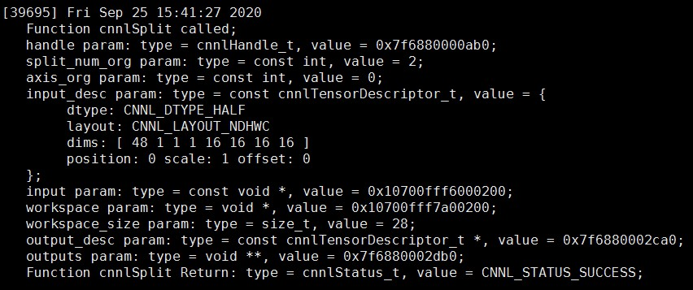

.. _调试方法:

调试方法
========

本文介绍Cambricon CNNL算子的调试方法。

打印算子接口的参数信息
--------------------------------

在运行Cambricon CNNL算子接口前，用户可以设置 ``NEUWARE_LOGINFO`` 环境变量，在运行算子接口时将传入的参数信息打印在屏幕上。该方法可以帮助用户检查参数是否传入正确。

设置方法如下：

::

  export NEUWARE_LOGINFO=cnnl

如果参数的数据类型是 ``cnnlTensorDescriptor_t``，则会将张量信息包括：维度数、各维度大小、数据类型、排列方式等打印在屏幕上。如果参数是指针，则会打印指针的地址。

根据打印信息，用户可以检查传入的变量信息，若参数信息都正确但未得到预期结果，则说明算子接口的使用可能存在问题，可以参考《Cambricon CNNL Developer Guide》中相关算子接口说明，查看调用方法是否有误。

以 ``cnnlSplit`` 算子接口为例：

::

  cnnlStatus_t CNNL_WIN_API cnnlSplit(cnnlHandle_t handle,
                                    const int split_num,
                                    const int axis,
                                    const cnnlTensorDescriptor_t input_desc,
                                    const void *input,
                                    void *workspace,
                                    size_t workspace_size,
                                    const cnnlTensorDescriptor_t output_desc[],
                                    void *outputs[]);

运行上面算子接口时，如果开启了 ``NEUWARE_LOGINFO`` 环境变量，屏幕上会打印出传入的参数 ``handle``、``input``、``workspace``、``output_desc``、``output`` 的指针地址，以及 ``split_num``、``axis``、``workspace_size`` 参数的赋值。``input_desc`` 为 ``cnnlTensorDescriptor_t`` 类型，所以返回输入张量的数据类型、排列方式、各维度大小等信息。

   示例算子接口的参数返回信息

.. _算子调试信息的保存:

算子调试信息的保存
--------------------------------

Cambricon CNNL提供了一个用于辅助算子调试的工具，开启功能后，该工具会将Cambricon CNNL API接受到的部分输入参数信息保存起来，方便用户更快捷地重现问题。用户也可将信息发送给寒武纪AE工程师来帮助复现问题。然而启用本功能将降低算子性能，因此仅能用于调试。

保存的调试信息主要包括：

- 输入输出tensor descriptor相关信息：

  -  规模（ ``dims`` ）；
  -  数据排布（ ``cnnlLayout_t`` ）；
  -  数据类型（ ``cnnlDataType_t`` ）；
  -  device上的数据（配合其他变量使用）；

- 算子自身的名字 （``op_name``） ，算子类别 （``op_type``）；
- 算子运行所需参数。但并非所有算子的运行参数信息都会保存，如 ``cnnlConvolutionForward`` 所需的 ``cnnlConvolutionDescriptor_t`` 描述符中参数不会被保存。

算子接受到的参数将会以Cambricon CNNL内部定义的 ``protobuf`` 格式保存到当前路径下的 ``gen_case`` 文件夹内。

开启方法
>>>>>>>>>>>>>
该工具可以通过设置环境变量 ``export CNNL_GEN_CASE=k`` 或者调用函数 ``cnnlSetGenCaseMode(k)`` （其中k为整数）来切换工具的功能等级，具体为：

- 当k为1时：开启算子调试信息保存功能。在调用任意Cambricon CNNL算子接口后，会在当前目录生成名为 ``gen_case`` 的文件夹，里面包含算子的调试信息文件。调试信息文件中会记录算子本次被调用时的输入输出形状以及算子参数等信息。

- 当k为2时：开启算子调试信息保存功能。在算子被调用时生成调试信息文件，调试信息文件会记录算子本次被调用时的输入输出形状、算子参数等信息以及算子输入输出数据。此功能需要配合环境变量CNNL_GEN_CASE_DUMP_DATA一起使用，CNNL_GEN_CASE_DUMP_DATA等于1时，会在调试文件中以文本形式保存数据，等于2时，会以二进制形式保存浮点数据，CNNL_GEN_CASE_DUMP_DATA_OUTPUT记录输出数据，用法类似。

- 当k为3时：开启算子调试信息保存功能。在算子被调用时，将算子的调试信息打印在屏幕上，不会保存成文件。调试信息包括算子本次被调用时的输入输出形状以及算子参数等信息。

- 当k为其他值时：关闭算子调试信息保存功能。

有关函数 ``cnnlSetGenCaseMode(int mode)`` 详情，可参考《Cambricon CNNL Developer Guide》。

Cambricon CNNL会自动创建路径并保存文件，并打印log信息提示调试信息已成功保存至上述路径。以Abs算子为例，设置 ``export CNNL_GEN_CASE=1`` 后，log信息打印如下：

::

  [2021-3-15 16:14:41] [CNNL] [Info]:[gen_case]: generate gen_case/abs/abs_20210315_16_14_41_647471_tid79955.prototxt

调试信息文件会输出至 ``gen_case`` 文件夹下的 ``abs`` 算子文件夹，文件名格式为 “算子名_日期_时_分_秒_随机数_tid线程ID.prototxt”。

调试信息文件
>>>>>>>>>>>>>>>

文件内容示例（片段）如下：

::

  op_name: "abs"  // 算子名
  op_type: ABS    // 算子类别
  input {         // 输入tensor的相关信息
    id: "x"       // 输入tensor的名字
    shape: {      // 输入tensor的规模
      dims: 10
      dims: 10
      dims: 10
      dims: 10
    }
    layout: LAYOUT_ARRAY  // 输入tensor的数据排布
    dtype: DTYPE_FLOAT    // 输入tensor的数据类型
  }
  output {        // 输出tensor的相关信息，格式与输入一致，略。
    /*...*/
  }

用户可以将上述文件发送给寒武纪AE工程师，方便快速定位问题。

.. _`MLU Unfinished问题定位`:

MLU Unfinished问题定位
--------------------------------

当出现mlu unfinished时, 可以参考本节描述的方法进行定位, 并联系寒武纪AE工程师获取帮助。

具体过程如下（以CNToolkit-2.3.1为例。随CNToolkit的更新迭代，不同版本的CNToolkit在细节上可能存在差异，但基本流程一致）：

当出现 ``mlu unfinished`` 时，将会有下述信息打印在屏幕上:

::

  2021-04-20 17:30:05.370267: [cnrtError] [11621] [Card : 0] cnrtQueueSync: MLU queue sync failed.

可以按下图给出的方法处理。

.. figure:: ../images/mlu_unfinished.pdf

1. 当出现mlu unfinished时，Cambricon CNNL会自动保存名为 ``core_***.cndump`` 的文件。保存路径为当前调用Cambricon CNNL API的可执行文件的同级路径。该文件是二进制文件，可以用CNToolkit工具链中的CNGDB工具进行解析。CNGDB的具体使用方式，请参考《寒武纪CNGDB用户手册》。从解析结果中，能获取到以下信息：

   - ``Device name`` 出现异常时硬件的型号信息。

   - ``MLU Kernel name`` 出现异常的 ``kernel name`` 信息。 ``kernel name`` 是在MLU上运行的函数。用户可以联系寒武纪AE工程师，根据 ``kernel name`` 信息推断出现问题的Cambricon CNNL算子。

   - 出现异常时硬件的状态信息， ``exception`` 代表异常的类型。例如 ``barrier sync timeout`` ，说明是硬件同步出现了问题。

2. 用户可单独运行上述过程得到的Cambricon CNNL算子，以确认算子是否存在问题。

3. 如果单算子可以复现问题，设置环境变量 ``CNNL_GEN_CASE`` ，或者在调用此算子前先调用 ``cnnlSetGenCaseMode`` 函数，然后重新运行该算子（此过程可以保存包含算子调试信息的 ``*.prototxt`` 文件）。最终将出现异常时的 ``core_***.cndump`` 文件、包含 ``*.prototxt`` 文件的 ``gen_case`` 文件夹，以及出现问题时操作系统的dmesg信息提供给寒武纪AE工程师，我们会尽快修复问题。关于如何保存算子的调试信息，详情参看 算子调试信息的保存_。

4. 如果在同参数下验证上述Cambricon CNNL算子没有问题，那导致问题的原因可能是较为底层或其他影响范围更大的特性没有正常工作。如果条件允许（复现问题成本不高），请尽可能缩小复现问题的条件范围，明确问题算子和出现问题的条件，可以帮助Cambricon CNNL更快地定位和解决问题。或者，直接联系寒武纪AE工程师获取帮助。
