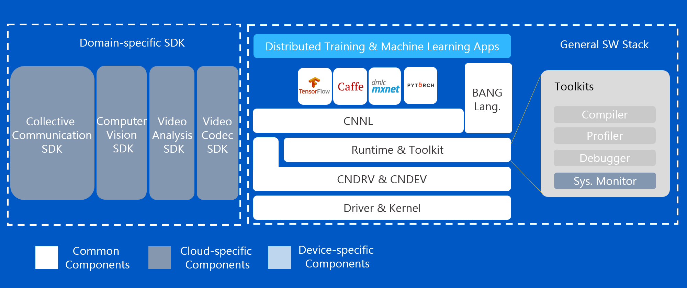

编程模型介绍
=================

寒武纪Cambricon BANGC OPS采用异构编程模型，实现了不同架构和指令集的混合编程。

异构编程模型
--------------

异构计算系统通常由通用处理器和协处理器组成，其中通用处理器作为控制设备，通常称为Host端（主机端），负责调度。协处理器作为辅助计算设备，即MLU端（设备端），负责专有领域的大规模并行计算。Host端和MLU端协同完成计算任务。

寒武纪Cambricon BANGC OPS异构编程模型是CPU和MLU的协作编程模型。Host端负责调用CNRT接口用来初始化设备、管理设备内存、准备Cambricon BANGC OPS的参数、调用Cambricon BANGC OPS接口以及释放设备资源。MLU端作为协处理器，帮助Host端CPU完成人工智能任务，并达到低能耗、高可用的效果。Cambricon BANGC OPS每个算子由Host端CPU发射，在MLU端异步执行。

.. _CNNL在寒武纪软件栈中如何工作:

Cambricon BANGC OPS在寒武纪软件栈中如何工作
--------------------------------------------------

在寒武纪软件栈中，如下图所示，Cambricon BANGC OPS作为一个网络运算库，提供了人工智能计算所需要的算子接口。在框架层如TensorFlow等通过调用Cambricon BANGC OPS算子接口，实现对应的框架层算子在MLU上的高性能加速计算。Cambricon BANGC OPS算子的计算通过软件栈底层CNRT（Cambricon Runtime Library，寒武纪运行时库）和CNDrv 接口（Cambricon Driver API，寒武纪驱动API）完成与寒武纪MLU设备底层驱动的交互和计算任务。

   寒武纪软件栈

Cambricon BANGC OPS是如何工作的
---------------------------------

对于一个网络模型，用户通过调用常用框架，如PyTorch、TensorFlow等或自定义框架，解析模型并生成Cambricon BANGC OPS算子计算所需要的输入参数和数据。根据输入参数和数据，主机端调用Cambricon BANGC OPS算子接口，完成算子的高性能计算。

由于Cambricon BANGC OPS算子的计算是在MLU设备端完成，Cambricon BANGC OPS通过句柄与计算时使用的MLU设备和队列绑定。MLU设备端的设备初始化、计算时输入输出数据的内存分配、队列的创建等都是通过主机端调用CNRT接口完成。

MLU设备端完成计算后，计算结果通过调用CNRT接口返回到主机端CPU来进行下一步任务。

Cambricon BANGC OPS头文件
---------------------------

Cambricon BANGC OPS头文件包含了支持的Cambricon BANGC OPS算子接口和Cambricon BANGC OPS数据类型声明。当主机端调用Cambricon BANGC OPS算子所在的文件时，用户需要包含Cambricon BANGC OPS头文件 ``mlu_op.h`` 。
