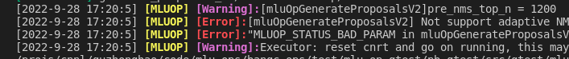

API日志
=================

本章介绍Cambricon BANGC OPS的API日志。

执行以下步骤，设置打印API日志：

1. 调用Cambricon BANGC OPS函数时，在想要打印信息的位置输入下面指令。用户需要在指令中选择日志级别为INFO、WARNING、ERROR或FATAL，并且在双引号中输入想要打印在屏幕上的内容。

   ::
   
      LOG(INFO/WARNING/ERROR/FATAL) << "Information printed on the screen."
   
2. 在运行Cambricon BANGC OPS算子前，设置 :ref:`MLUOP_MIN_VLOG_LEVEL` 环境变量指定日志的最小打印级别。该环境变量支持设置INFO及以上级别日志、WARNING及以上级别日志、ERROR及以上级别日志以及FATAL级别日志。

   例如在调用Cambricon BANGC OPS函数时，输入以下指令：

   ::
   
     LOG(INFO) << "Information printed on the screen.";
     LOF(WARNING) << "Information printed on the screen.";
     LOG(ERROR) << "Information printed on the screen.";
     LOG(FATAL) << "Information printed on the screen.;

   如果在环境变量中设置为WARNING，则只会在屏幕上打印最后三行内容。

下图为 :ref:`MLUOP_MIN_VLOG_LEVEL` 设置为WARNING时打印结果示例。

除此之外，用户可以通过设置 :ref:`MLUOP_LOG_ONLY_SHOW` 环境变量指定打印日志到屏幕的同时生成日志文件。
通过 :ref:`MLUOP_LOG_COLOR_PRINT` 环境变量设置使用颜色字体特效打印日志。详情查看 :ref:`环境变量`。