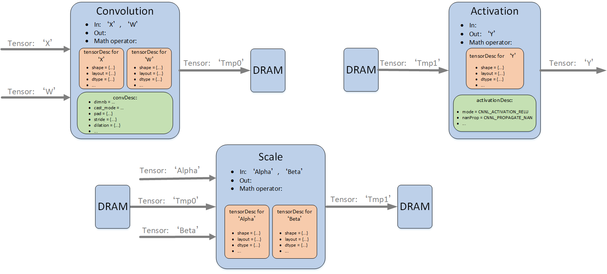
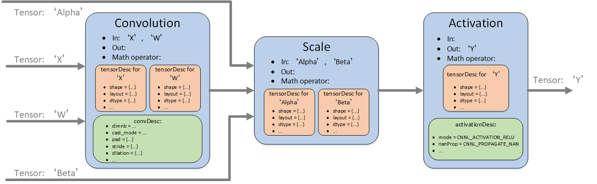

.. _fusionop:

算子融合
=================

算子融合是指根据用户设置的融合模式将多个单算子的简单计算融合成一个复杂的计算，是网络中常用的提速方式。Cambricon CNNL算子融合在算法上等效于按照融合模式中给定顺序依次执行。

算子融合的益处
-----------------------

算子融合通过将多个单算子融合成复杂算子的方式，可以有效减少片上与DRAM交互的时间，从而优化网络的性能。通常网络以单算子为单位执行，如Convolution Forward、BatchNorm等算子，所有算子的执行都可以分为下面三个步骤：Load（从DRAM加载数据到片上）、Compute（计算）、Store（将片上的数据存储回DRAM），因此整个网络的运行就是持续不断的Load、Compute、Store的过程。算子融合就是通过减少网络运行时Load和Store的时间来达到优化性能的目的。对于网络来说，算子之间的数据是可以复用的，所以可以考虑将中间算子的结果不存回DRAM，而是驻留在片上，直接作为下一个算子的输入，这样就可以很大程度上降低与DRAM交互的Load和Store的开销，从而优化网络性能。单算子逐层计算过程与算子融合计算过程见下图。

   单算子逐层计算过程

   算子融合计算过程

算子融合的使用场景
-----------------------

在Cambricon CNNL中，通过 ``cnnlFusedOps_t`` 指定支持的算子融合模式。详情查看《Cambricon CNNL Developer Guide》中的“cnnlFusedOps_t”。

融合模式指定了前向推理过程中融合算子的计算顺序，以下面融合模式为例：

- CNNL_CONV_SCALE_BN_ACTIVATION：融合成的复杂计算依次执行Convolution Forward、Scale、BatchNorm和Activation算子。

.. attention::
   | 在包含Convolutiion Forward等卷积类算子的融合模式里，卷积算子必须存在，其他算子是否融合是可选的。假设用户的网络片段为：Convolution Forward、Scale和Activation，此时用户仍然可以选择CNNL_CONV_SCALE_BN_ACTIVATION，不过复杂计算依次执行Convolution Forward、Scale和Activation算子。

算子融合重点接口和描述符
--------------------------

算子融合使用中涉及到的关键接口和数据结构如下：

- ``cnnlFusedOpsPlan`` 表示融合算子描述符，其包含融合算子内的所有单算子的静态参数（``cnnlFusedOpsConstParamPack``） 与动态参数（ ``cnnlFusedOpsVariantParamPack``）。
- ``cnnlFusedOpsConstParamPack`` 包含融合算子内的所有单算子的静态参数，如融合算子所用到的tensor descriptor。可以通过 ``cnnlSetFusedOpsConstParamPackAttribute`` 接口设置。
-  ``cnnlFusedOpsVariantParamPack`` 包含融合算子内的所有单算子的动态参数，如算子输入的数据地址与算子使用的WorkSpace地址等。可以通过 ``cnnlSetFusedOpsVariantParamPackAttribute`` 接口设置。

算子融合的计算
-----------------

算子融合的计算过程如下：

1. 调用 ``cnnlCreateFusedOpsPlan`` 接口创建融合算子描述符，在 ``cnnlCreateFusedOpsPlan`` 接口中需指定融合算子的融合模式。
2. 调用 ``cnnlCreateFusedOpsConstParamPack`` 创建融合算子的ConstParamPack。
3. 调用 ``cnnlSetFusedOpsConstParamPackAttribute`` 将融合算子的相关算子描述符的参数逐一加入到融合算子的ConstParamPack里面。
4. 调用 ``cnnlCreateFusedOpsVariantParamPack`` 创建融合算子的VariantParamPack。
5. 调用 ``cnnlMakeFusedOpsPlan`` 求融合计算过程中额外的workspace大小。
6. 调用 ``cnnlSetFusedOpsVariantParamPackAttribute`` 将张量描述符对应的数据地址等相关参数逐一加入到融合算子的VariantParamPack里面。
7. 调用 ``cnnlFusedOpsExecute`` 接口就可以完成指定的计算过程。
8. 调用相关接口释放资源。

相关接口以及结构体的详细说明，请参考《Cambricon CNNL Developer Guide》。了解使用示例，参考 :ref:`fusionsample`。
