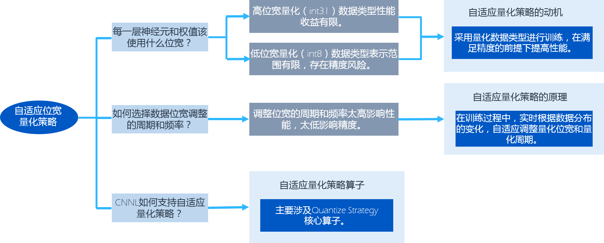
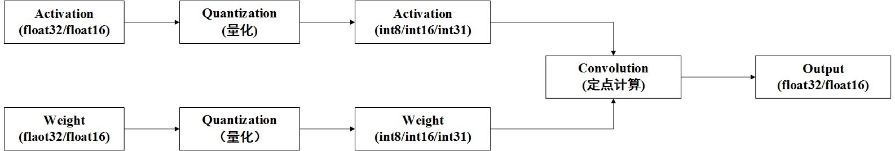
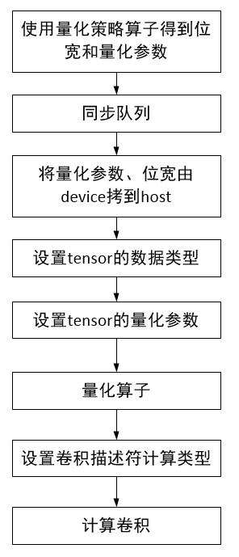
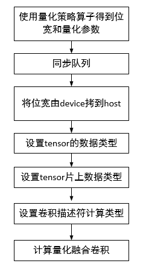
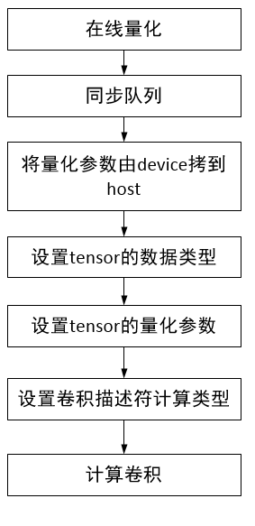
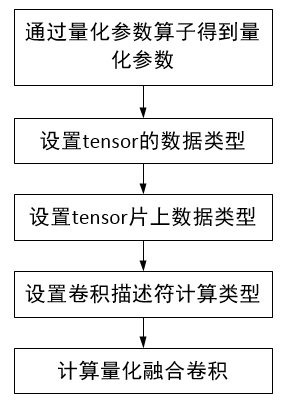

.. _量化:

定点量化
=================

定点量化的实质是用一组共享指数位的定点数来表示一组浮点数。共享指数确定了二进制小数的小数点的位置。将float32量化成int8后，存储空间可以减少为原来的1/4，IO吞吐量变为原来的4倍。

寒武纪硬件支持对浮点数据进行量化并支持使用定点数据进行卷积运算。用户可以通过Cambricon CNNL提供的相关算子来实现。Cambricon CNNL支持量化到int8、int16、int31三种类型。

定点量化的主要优点是在保证精度的前提下，减少数据和模型参数的占用空间，从而节省内存空间。此外，使用定点数据进行卷积运算，可以大大加快网络的训练和推理速度，降低训练和推理的时间，提高性能。

支持定点量化的Cambricon CNNL算子
--------------------------------

目前支持定点量化的Cambricon CNNL算子如下：

- cnnlConvolutionForward
- cnnlConvolutionBackwardData
- cnnlConvolutionBackwardFilter
- cnnlDeconvolution
- cnnlMatMul
- cnnlBatchMatMul
- cnnlBatchMatMulBCast
- cnnlPoolingForward
- cnnlPoolingForward_v2
- cnnlFusedExcute

关于上述定点量化的Cambricon CNNL算子具体量化模式支持，详情参考下面章节或参看《Cambricon CNNL Developer Guide》。

量化模式
----------

量化模式包括：无缩放系数量化、有缩放系数量化和非对称量化。用户可以通过 ``cnnlQuantizeMode_t`` 枚举指定量化模式。详情查看《Cambricon CNNL Developer Guide》。这几种量化模式的具体使用方法，将在下述的量化参数算子和量化算子部分进行具体介绍。

.. attention::
   | 当量化的位宽是31时，量化模式不支持有缩放系数量化和非对称量化模式。

量化模式涉及如下量化参数：

- position：量化参数中的定点位置。
- scale：量化参数中的缩放系数。
- offset：量化参数中的中心偏移。

Cambricon CNNL当前支持的position范围是[-128, 127]，当position参数的值超过该范围时，其结果是未定义的。如用户遇到该问题，可尝试使用scale参数进行缩放来解决问题。

无缩放系数量化
>>>>>>>>>>>>>>>

只使用position量化参数，不使用scale量化参数的量化方式。计算速度最快，量化损失最大。主要应用在量化训练场景。

无缩放系数量化的公式如下：

.. math::

   \begin{aligned}
   absmax = Max(Abs(D))\\
   position = floor(log_{2}(absmax)) - (n-2), if absmax\neq0\\
   position = 0, if absmax=0\\
   X_{quantize}=clamp(-2^{n-1},2^{n-1}-1,round(\frac{X}{2^{position}}))\\
   X_{dequantize}=X_{quantize} \times 2^{position}
   \end{aligned}

上述公式中D为计算量化参数的浮点数，n为量化位宽，X为待量化的浮点数，:math:`X_{quantize}` 为量化后定点数据，:math:`X_{dequantize}` 为反量化后浮点数据。

有缩放系数量化
>>>>>>>>>>>>>>>>>>>>

使用position和scale量化参数的量化方式。计算速度较快，量化损失较大。主要应用在一般的量化推理场景。

有缩放系数量化的公式如下：

.. math::

   \begin{aligned}
   absmax = Max(Abs(D))
   \end{aligned}

当absmax不等于0时，position和scale的计算如下：

.. math::

   \begin{aligned}
   position = floor(log_{2}(absmax)) - (n-2)\\
   scale = 2^{position} \times (2^{n-1}-1)\div absmax\\
   \end{aligned}

当absmax等于0时，position和scale的计算如下：

.. math::

   position = 0

.. math::

   scale = 1.0

量化和反量化的公式如下：

.. math::

   X_{quantize}=clamp(-2^{n-1},2^{n-1}-1,round(\frac{X \times scale}{2^{position}}))

.. math::

   X_{dequantize}=X_{quantize} \times (\frac{2^{position}}{scale})\\

上述公式中D为计算量化参数的浮点数，n为量化位宽，X为待量化的浮点数，:math:`X_{quantize}` 为量化后定点数据，:math:`X_{dequantize}` 为反量化后浮点数据。

非对称量化
>>>>>>>>>>>>>

使用position、scale和offset量化参数的方式。计算速度较慢，量化损失较小。一般用于卷积输入量化，主要原因是卷积输入经过激活后为非对称分布。

非对称量化的公式如下：

.. math::

   max=Max(0,Max(D))

.. math::

   min=Min(0,Min(D))

当 :math:`max-min` 不等于0时，position、scale和offset的计算如下：

.. math::

   \begin{aligned}
   position = floor(log_{2}(max-min)) - (n-1)\\
   scale = 2^{position} \times (2^n-1) \div (max - min)\\
   offset = round(-2^{n-1}- min \times (2^n-1)\div (max-min))\\
   \end{aligned}

当 :math:`max-min` 等于0时，position、scale和offset的计算如下：

.. math::

   position = 0

.. math::

   scale = 1.0

.. math::

   offset= 0

量化和反量化的公式如下：

.. math::

   X_{quantize}=clamp(-2^{n-1},2^{n-1}-1,round(\frac{X \times scale}{2^{position}} + offset))\\
   X_{dequantize}=(X_{quantize} - offset) \times (\frac{2^{position}}{scale})\\

上述公式中D为计算量化参数的浮点数，n为量化位宽，X为待量化的浮点数，:math:`X_{quantize}` 为量化后定点数据，:math:`X_{dequantize}` 为反量化后浮点数据。

量化舍入模式
-------------

量化舍入模式包括：round to nearest even、round to nearest off zero、round half up。用户可以通过 ``cnnlQuantizeRoundMode_t`` 枚举指定量化舍入模式，影响的是量化公式中浮点转定点时小数位的舍入精度。详情查看《Cambricon CNNL Developer Guide》。

量化类算子
-------------

Cambricon CNNL中与量化相关的算子主要为量化参数算子、量化算子、量化策略算子。以下是量化类算子的功能和应用场景。

量化参数算子
>>>>>>>>>>>>>>>>>>

执行量化参数的计算，根据输入的浮点数据和量化的位宽信息，计算量化参数position、scale、offset。应用于训练和推理场景。

用户可调用 ``cnnlQuantizeParam`` 接口实现。此外，该算子需要用户申请额外workspace在量化时使用。用户可以调用 ``cnnlGetQuantizeParamWorkspaceSize`` 接口获取workspace的大小。

.. _量化算子:

量化算子
>>>>>>>>>>>>>>>>

执行量化，根据量化位宽信息将浮点数据量化为定点数据。量化算子的输入为待量化的浮点数据，主要包括卷积输入、滤波、反向梯度等，输出为量化后定点数据。应用于训练和推理场景。

用户可以调用 ``cnnlQuantizeV1`` 和 ``cnnlQuantizeV2`` 接口完成算子量化。 ``cnnlQuantizeV1`` 接口支持host端的量化参数输入，``cnnlQuantizeV2`` 接口支持MLU 设备端的量化参数输入。

用户通过接口的 ``mode`` 参数指定量化模式：

- 如果设为无缩放系数量化，即CNNL_QUANTIZE_POSITION时，需先调用 ``cnnlSetTensorDescriptorPosition`` 接口设置position参数至 ``output_desc`` 描述符中。
- 如果设为有缩放系数量化，即CNNL_QUANTIZE_POSITION_SCALE时，需先调用 ``cnnlSetTensorDescriptorPositionAndScale`` 接口设置position、scale参数至 ``output_desc`` 描述符中。
- 如果设为非对称量化，即CNNL_QUANTIZE_POSITION_SCALE_OFFSET时，需先调用 ``cnnlSetTensorDescriptorPositionScaleAndOffset`` 接口设置position、scale和offset参数至 ``output_desc`` 描述符中。

量化策略算子
>>>>>>>>>>>>>>>>>>>

自适应位宽量化过程中，更新量化位宽、量化周期和量化参数position。用户可以调用 ``cnnlQuantizeStrategy`` 接口实现。只应用于训练场景。详情查看 自适应位宽量化策略_。

.. _自适应位宽量化策略:

自适应位宽量化策略
-------------------

为减少训练过程中计算量化参数所带来的计算消耗，寒武纪根据训练场景，开发了的一套自适应调整量化位宽和量化周期的策略。自适应量化位宽的逻辑关系和使用目的见下图。

   自适应位宽量化策略

自适应位宽量化策略主要是根据输入的浮点数据的分布情况，在保证训练精度的前提下，自适应调整量化的位宽和周期，进而达到训练精度和训练数据的平衡，提高训练的性能。用户可以通过自适应位宽量化算子实现该功能，详情查看 自适应位宽量化算子_。

自适应位宽量化涉及以下术语：

- 量化位宽：定点数据的位宽，即bitwidth，自适应位宽量化策略支持的位宽为8、16、31。

- 量化周期：下一次更新量化参数和当前更新量化参数的间隔代数。

- 自适应：根据浮点数据的分布，自适应位宽量化策略自动调整量化位宽和量化周期，无需用户的干预。

用户无需对每一次迭代都计算量化参数，而是间隔一定迭代后进行量化参数更新。在不更新的迭代中，上一次更新得到的量化参数被用来量化数据。只要更新间隔选择合适，该方法并不会带来训练精度损失，这是因为在训练过程中待量化数据，如输入数据、卷积核、反向梯度的变化是相对稳定的，具有一定连续性和相似性。最简单的方式是使用固定的更新周期，但是固定的更新周期适应性较差，因此需要自适应的更新周期调整。

自适应位宽量化模式
>>>>>>>>>>>>>>>>>>>>>>

自适应位宽量化支持通过自适应位宽量化策略自动调节位宽和周期。用户可以通过设置 ``cnnlQuantizeStrategyMode_t`` 指定量化模式。

- 位宽和量化周期均自适应。此模式为默认的模式，位宽和量化周期均会由量化策略算子自动调整，无需用户对量化位宽和周期做任何调整。建议用户使用此模式。

- 位宽固定，量化周期自适应。此模式下，用户需手动调整量化位宽。量化周期由量化策略算子自动调整。量化位宽支持的位宽为int8、int16或int31，高位宽量化（int31）数据类型性能收益有限。低位宽量化（int8）数据类型表示的范围有限，存在精度风险。因此建议用户使用位宽和量化周期均自适应模式。

- 位宽自适应，量化周期固定。此模式下，用户需要手动调整量化周期。量化位宽由量化策略算子自动调整。量化周期太高会影响性能，量化周期太低会影响精度，因此建议用户使用位宽和量化周期均自适应模式。

**量化模式使用方法**

量化的使用方法如下。其中，一个epoch为训练集中的全部样本训练一次。

- 位宽和量化周期均自适应。

  - 当迭代次数小于一个epoch的1%时，每1次迭代都进行量化参数的更新，需要调用量化策略算子和离线量化。此阶段量化参数的更新最为频繁。这里，一个epoch的前1%为自适应位宽量化算法的默认设置值。

  - 当迭代次数大于等于一个epoch的1%并且小于一个epoch时，量化参数是间隔的动态进行更新，量化周期为接口中interval值。在迭代次数达到下一次需要更新的迭代次数时，需要调用量化策略算子和离线量化。当迭代次数未达到下一次需要更新的迭代次数时，量化参数复用，直接调用离线量化。

  - 当迭代次数大于一个epoch时，量化参数的更新周期为epoch，即间隔一个epoch会更新一次。在迭代次数达到下一次需要更新的迭代次数时，需要调用量化策略算子和离线量化。当迭代次数未达到下一次需要更新的迭代次数时，量化参数复用，直接调用离线量化。

- 位宽固定、量化周期自适应。

  - 当迭代次数小于一个epoch的1%时，每1次迭代都进行量化参数的更新。此模式下位宽固定，不需要调用量化策略算子，需要调用离线量化，此阶段量化参数的更新最为频繁。

  - 当迭代次数大于等于一个epoch的1%并且小于一个epoch时，量化参数是间隔的动态进行更新，量化周期为接口中interval值。在迭代次数达到下一次需要更新的迭代次数时，需要调用量化策略算子和离线量化。当迭代次数未达到下一次需要更新的迭代次数时，量化参数复用，直接调用离线量化。

  - 当迭代次数大于一个epoch时，量化参数的更新周期为epoch，即间隔一个epoch会更新一次。在迭代次数达到下一次需要更新的迭代次数时，需要调用在线量化；当迭代次数未达到下一次需要更新的迭代次数时，量化参数复用，直接调用离线量化。

- 位宽自适应、量化周期固定。

  - 此模式下，位宽需要自适应的调整，量化周期为设定的固定值。当迭代次数达到设置的量化周期时，需要调用量化策略算子和离线量化。当迭代次数未达到设定的量化周期时，需要调用离线量化。

考虑到自适应位宽量化算法本身较为复杂，直接使用Cambricon CNNL的量化策略算子接口的适配与调试成本相对较高，不建议用户直接使用Cambricon CNNL的量化策略算子接口，建议用户使用框架层封装后的自适应位宽量化功能，详见《寒武纪TensorFlow 用户手册》和《寒武纪PyTorch 用户手册》中“模型训练”章节。

.. _自适应位宽量化算子:

算子支持
>>>>>>>>>>

自适应位宽量化主要涉及Quantize Strategy核心算子。有关算子接口详情，请参考《Cambricon CNNL Developer Guide》。

自适应位宽量化使用以下超参数来调整自适应的频率。用户可以通过设置 ``cnnlQuantizeStrategyParam_t`` 来设置超参数：

- alpha：与量化周期相关。默认值：0.04f。该超参数的取值范围：(0,0.4)。

- beta：与量化周期相关。默认值：0.1f。该超参数的取值范围：(0, 1)。

- gamma：与量化周期相关。默认值：2。该超参数的取值范围：[0,100]。

- delta：计算diffupdate2的参数。默认值：100。该超参数的取值范围：(0,1000)。

- th：量化误差的阈值。默认值：0.03f。该超参数的取值范围：(0,0.5)。

Quantize Strategy算子接口如下：

::

  cnnlStatus_t CNNL_WIN_API  cnnlQuantizeStrategy
                             (cnnlHandle_t handle,
                             const cnnlQuantizeStrategyMode_t quant_strategy_mode,
                             const cnnlQuantizeStrategyParam_t  quant_strategy_param,
                             const cnnlQuantizeStrategyMaxBitwidth_t max_bitwidth,
                             const cnnlTensorDescriptor_t input_desc,
                             const void *input,
                             void *workspace,
                             size_t workspace_size,
                             const void *bitwidth_input,
                             const void *position_input,
                             const void *moving_position_input,
                             void *bitwidth_output,
                             void *position_output,
                             void *moving_position_output,
                             void *interval,
                             void *is_exceed_max_bitwidth)

接口使用说明如下：

- 量化策略算子需要用户申请额外workspace空间。用户可以调用 ``cnnlGetQuantizeStrategyWorkspaceSize`` 接口获取workspace的大小。

- 接口中输入的 ``bitwidth_input``、``position_input``、``moving_position_input`` MLU地址可以分别和输出的 ``bitwidth_output``、``position_output``、``moving_position_output`` MLU地址一样，支持原位地址更新，与激活算子的原位更新类似。接口中 ``is_exceed_max_bitwidth`` 表征量化位宽是否超过int16。

- 接口中当 ``max_bitwidth`` 设置为 ``CNNL_MAX_BITWIDTH_INT16`` 时，位宽自适应的最大值是16，即位宽最大只能增大至16，不可以增大至31。

- 接口中当 ``max_bitwidth`` 设置为 ``CNNL_MAX_BITWIDTH_INT31`` 时，位宽自适应的最大值是31，即位宽最大可以增大至31。

- 接口中 ``interval`` 为输出的量化周期，表征下一次更新量化参数和当前更新量化参数的间隔代数。

- 量化位宽只支持自适应增加，不支持位宽降低。

.. |fx_icon| image:: ../images/quant3-1.png
             :scale: 70%
             :align: middle

定点量化输入的卷积运算
-------------------------

下面以卷积算子为例，说明量化和卷积之间的关系。如下图，输入的激活值Activation和卷积核Filter为浮点数据类型，分别经过量化后，得到激活值和卷积核的定点数据。激活值和卷积核的定点数据作为卷积算子的输入，在定点设备上进行卷积运算，得到浮点类型的数据。上述提到的支持定点数据运算的其它算子计算过程与此情景类似。Cambricon CNNL中对网络的卷积层、全连接层等使用定点运算来达到加速计算进而提高性能的目的。

在卷积过程中，量化后的激活值和卷积核进行乘累加操作，因此两者的position会进行累加。在量化模式章节提到Cambricon CNNL当前支持的position范围是[-128,127]，当累加后的position不在该范围时，行为是未定义的。如遇到该问题，可尝试对激活值和卷积核进行缩放，避免position超过上述范围。

   量化卷积
   
支持定点量化的接口使用说明
-----------------------------------

支持定点量化的算子在计算时会涉及片上（onchip）、片下（offchip）数据类型和卷积计算类型，说明如下：

- 片下数据类型：通过 ``cnnlSetTensorDescriptor`` 进行设置，指定host端与MLU设备端进行张量数据拷入拷出时的数据类型。

- 片上计算类型：通过 ``cnnlSetTensorDescriptorOnchipDataType`` 进行设置，指定张量在MLU设备上进行定点计算时实际所用的数据类型。片上计算类型只支持定点型，即int8、int16、int31。

- 卷积计算类型：专用于卷积类算子，通过 ``cnnlSetConvolutionDescriptor`` 里的 ``compute_type`` 参数来设置，用于配置卷积类算子计算过程中临时结果的数据类型。

算子在计算时，都需要为张量设置片下数据类型，具体支持的数据类型详情，请查看《Cambricon CNNL Developer Guide》中对应的接口说明。但是，当支持定点量化的算子的片上计算类型与片下数据类型不同时，需要设置片上计算类型。

设置卷积计算类型可以提高卷积计算的精度，但同时会带来一定的性能损失。例如，当卷积算子输出的片下数据类型为half时，如果不配置卷积计算类型，则计算时，中间临时结果都以half类型参与计算。如果配置卷积计算类型设为float32, 则卷积计算的中间临时结果都以float32数据类型存储并参与后面的计算，但计算完后，最终拷出到host端的结果仍然是half类型。由于设置卷积计算类型的目的是为了提高卷积计算的精度，所以不支持卷积计算类型的位宽小于输出片下数据类型的位宽。例如，卷积算子输出的片下类型是float32, 却将卷积计算类型设置为half，这种组合是不支持的，会返回错误码 ``CNNL_BAD_PARAM`` 。

目前支持的量化接口包括：通用接口、推理接口和量化融合接口。

- 通用接口：适用于片下数据类型和片上计算类型一致的场景。接口命名为 ``cnnlXXX`` 。其中 ``XXX`` 应替换为算子名。例如 ``cnnlConvolutionForward`` 为Convolution算子的通用接口。
- 推理接口：适用于推理场景，当前推理都建议使用此接口。接口命名为 ``cnnlXXXInference`` 。其中 ``XXX`` 应替换为算子名。例如 ``cnnlConvolutionForwardInference`` 为Convolution算子的推理接口。支持推理卷积的Cambricon CNNL算子接口列表，请参看 支持推理卷积运算的CNNL算子接口_。
- 量化融合接口：适用于训练中片下数据类型是浮点型，片上计算类型是定点型的场景。接口命名为 ``cnnlQuantizeXXX``。其中 ``XXX`` 应替换为算子名。例如 ``cnnlQuantizeConvolutionForward`` 为Convolution算子的量化融合接口。支持量化融合卷积运算的Cambricon CNNL算子接口列表，请参看 支持量化融合卷积运算的CNNL算子接口_。

通用接口
>>>>>>>>>>>>>>>

通用接口只支持MLU硬件原本就支持的数据类型，即要求输入张量的片下数据类型和片上计算类型相同，所以当使用通用接口时，不需要额外调用 ``cnnlSetTensorDescriptorOnchipDataType`` 接口来设置片上的计算类型，Cambricon CNNL默认将片下数据类型和片上计算类型设置为相同数据类型。

通用接口只支持从张量的描述符中获取量化参数，用户需要通过调用 量化算子_ 的相关接口在host端设置量化参数。

在不同的MLU硬件平台上，输入和卷积核支持的片上计算数据类型有所不同。在MLU200系列上，卷积类算子的硬件指令只支持定点型，所以片上计算类型只支持int8、int16、int31。因此在MLU200系列上，当卷积输入或者卷积核的数据类型是浮点型时，则需要将浮点数转化成定点数后再做卷积计算。浮点数到定点数的量化过程既可以通过量化算子 ``cnnlQuantizeV1`` 来实现，也可以使用推理接口或量化融合接口在卷积算子内部实现。

如果使用通用接口，需要执行多次从MLU设备端到host端拷贝量化参数的过程，在训练的迭代过程中影响性能。所以在训练场景中当输入数据是浮点型时，在MLU200系列上需要做定点量化，推荐使用 ``cnnlQuantizeConvolutionForward`` 接口，在MLU300系列上不需要做定点量化，推荐使用 ``cnnlConvolutionForward`` 接口。

其中 ``cnnlPoolingForward`` 、 ``cnnlPoolingForward_v2`` 这两个接口只支持浮点计算类型，但为了更好的推理性能，在这两个接口上支持了定点输入和定点输出的场景，即输入和输出的片下类型可以是定点，也可以是浮点，片上计算类型为浮点。因此输入的片下类型不是定点时，其需要和片上计算类型一致。可以调用 ``cnnlSetTensorDescriptorOnchipDataType`` 来指定输入的片上计算类型。

了解如何使用通用接口实现定点量化，参看 使用通用接口实现自适应位宽量化_ 和 使用通用接口实现固定位宽量化_。

.. _支持定点量化的CNNL通用算子接口:

支持定点量化的Cambricon CNNL通用算子接口
++++++++++++++++++++++++++++++++++++++++++

- cnnlConvolutionForward：支持无缩放系数量化、有缩放系数量化和非对称量化。
- cnnlConvolutionBackwardData：支持无缩放系数量化，不支持有缩放系数量化和非对称量化。
- cnnlConvolutionBackwardFilter：支持无缩放系数量化，不支持有缩放系数量化和非对称量化。
- cnnlDeconvolution：支持无缩放系数量化、有缩放系数量化和非对称量化。
- cnnlMatMul：支持无缩放系数量化、有缩放系数量化和非对称量化。
- cnnlBatchMatMul：支持无缩放系数量化和有缩放系数量化，不支持非对称量化。
- cnnlBatchMatMulBCast：支持无缩放系数量化和有缩放系数量化，不支持非对称量化。
- cnnlPoolingForward：支持无缩放系数量化、有缩放系数量化和非对称量化。
- cnnlPoolingForward_v2：支持无缩放系数量化、有缩放系数量化和非对称量化。

关于上述通用算子的具体使用方法，详情请查看《Cambricon CNNL Developer Guide》。

推理接口
>>>>>>>>>>>>>>>

推理接口仅在推理场景中使用。以 ``cnnlConvolutionForwardInference`` 接口为例，在接口内部先将浮点数量化为定点数，接着再用定点数进行卷积计算，最后将浮点的计算结果量化为定点数。相当于在接口内部融合实现 ``cnnlQuantizeV1`` 、 ``cnnlConvolutionForward`` 再调用 ``cnnlQuantizeV1`` 算子拼接的功能。这样的融合输入输出浮点转定点的处理减少了不必要的IO，有利于提升推理性能。

推理接口接受的输入和卷积核的片下类型可以是half、float、int8、int16或者int31，片上计算类型可以是int8、int16或者int31。因此输入和卷积核的片下数据类型是定点时，其片上类型会自动设置。如果输入或卷积核的片下类型是浮点，需要调用 ``cnnlSetTensorDescriptorOnchipDataType`` 来指定输入或卷积核的片上计算类型。如果输入的片下类型是浮点，其一定要和卷积计算类型一致。卷积核的片上计算数据类型位宽一定要小于等于输入的片上计算类型位宽。当输出类型为定点时，其一定与输入的片上计算类型一致。当输出类型为浮点时，其一定与卷积计算类型一致。

.. attention::
   | 在使用卷积算子的推理接口 ``cnnlConvolutionForwardInference`` 时，如果卷积核的片下类型是浮点时，除了需要调用 ``cnnlSetTensorDescriptorOnchipDataType`` 来指定卷积核的片上计算类型，还需要调用 ``cnnlHostReorderConvData`` 在Host端对卷积核进行摆数操作，否则将会返回错误码 ``CNNL_STATUS_BAD_PARAM`` 。摆数相关接口的使用场景和方法参看 :ref:`摆数模块`。

.. _支持推理卷积运算的CNNL算子接口:

支持推理卷积运算的Cambricon CNNL算子接口
+++++++++++++++++++++++++++++++++++++++++++++++

推理卷积运算均支持无缩放系数量化、有缩放系数量化和非对称量化。在使用非对称量化时，推理卷积运算接口不支持int31数据类型。目前支持推理卷积运算的Cambricon CNNL算子如下：

- cnnlConvolutionForwardInference
- cnnlDeconvolutionInference
- cnnlMatMulInference
- cnnlFusedOpsExecute

关于上述推理卷积运算类算子的具体使用方法，详情请查看《Cambricon CNNL Developer Guide》。

.. _量化融合接口:

量化融合接口
>>>>>>>>>>>>>>>

量化融合接口相当于在一个接口内部实现两个算子的功能。以 ``cnnlQuantizeConvolutionForward`` 接口为例，在接口内部，先将浮点数量化成定点数，然后再用定点数进行卷积计算。相当于在接口内部融合实现 ``cnnlQuantizeV1`` 和 ``cnnlConvolutionForward`` 两个算子的功能。这样的融合处理能减少不必要的IO和设备内存的占用，有利于提升性能。

因为量化融合接口要在接口内部做输入或者卷积核从浮点数到定点数的量化过程，所以量化融合接口只接受输入和卷积核的片下数据类型是浮点型，片上计算类型是定点型的情况，即只支持输入和卷积核的片下数据类型是half或float32，片上计算类型是int8、int16或者int31。由于片下数据类型和片上计算类型不一致，所以当使用量化融合接口时，除了需要在 ``cnnlSetTensorDescriptor`` 接口中指定片下数据类型，还需要额外调用 ``cnnlSetTensorDescriptorOnchipDataType`` 来指定输入和卷积核的片上计算类型。由于卷积计算时，输出不需要做定点量化，所以当使用量化融合接口时，不需要调用 ``cnnlSetTensorDescriptorOnchipDataType`` 来指定输出的片上计算类型。

.. attention::
   | 在使用卷积算子的量化融合接口 ``cnnlQuantizeConvolutionForward`` 时，理论上输出张量的片上计算类型和Convolution descriptor中的卷积计算类型可以表示相同的含义，但是为了避免两个接口设置不同的值造成歧义，所以在使用卷积的量化融合接口时，不建议对输出张量调用 ``cnnlSetTensorDescriptorOnchipDataType``  来设置片上计算类型。如果在输出张量上设置了片上计算类型，则要与 ``cnnlSetConvolutionDescriptor`` 接口中设置的compute_type参数值一致，否则将会返回错误码 ``CNNL_STATUS_BAD_PARAM`` 。

量化参数一般通过量化参数算子 ``cnnlQuantizeParam`` 或者量化策略算子 ``cnnlQuantizeStrategy`` 求出，结果都存放在MLU设备端。用户需要通过在量化融合接口的参数中传入量化参数在MLU设备端的地址来获取。

了解如何使用量化融合接口实现定点量化，参看 使用量化融合接口实现自适应位宽量化_ 和 使用量化融合接口实现固定位宽量化_。

.. _支持量化融合卷积运算的CNNL算子接口:

支持量化融合卷积运算的Cambricon CNNL算子接口
++++++++++++++++++++++++++++++++++++++++++++++++++

量化融合卷积运算均不支持非对称量化。目前支持量化融合卷积运算的Cambricon CNNL算子如下：

- cnnlQuantizeConvolutionForward：支持无缩放系数量化和有缩放系数量化。
- cnnlQuantizeConvolutionBackwardData：支持无缩放系数量化，不支持有缩放系数量化。
- cnnlQuantizeConvolutionBackwardFilter：支持无缩放系数量化，不支持有缩放系数量化。
- cnnlQuantizeDeconvolution：支持无缩放系数量化，不支持有缩放系数量化。
- cnnlQuantizeMatMul：支持无缩放系数量化和有缩放系数量化。
- cnnlQuantizeBatchMatMul：支持无缩放系数量化和有缩放系数量化。
- cnnlQuantizeBatchMatMulBCast：支持无缩放系数量化和有缩放系数量化。

关于上述量化融合卷积运算类算子接口的具体使用方法，请查看《Cambricon CNNL Developer Guide》。

不同场景使用示例
>>>>>>>>>>>>>>>>>>>

以下四种场景，展示在MLU200系列上，训练过程中不同量化模式下两种接口的使用方式以及输入数据的处理过程。其中量化策略 - 同步队列 - 拷贝，都是根据量化策略算子在特定的迭代次数做的，并不是训练过程中每一代都会做。卷积卷积核的处理方式和输入的处理方式相同，不再单独列出。

.. _使用通用接口实现自适应位宽量化:

使用通用接口实现自适应位宽量化
+++++++++++++++++++++++++++++++

自适应位宽量化模式，如果使用 ``cnnlConvolutionForward`` 接口, 流程如下图所示。

伪代码：

::

  // 申请MLU设备端地址，用来存储量化位宽和量化参数
  cnrtMalloc(x_pos_ptr);
  cnrtMalloc(x_bitwidth_ptr);

  // 设置量化算子输入的片下数据类型，此时应是浮点型
  cnnlSetTensorDescriptor(float_x_desc, flaot_x_dtype);

  // 调用量化策略算子计算得到量化位宽和量化参数
  cnnlQuantizeStrategy(..., flaot_x_desc, float_x_ptr, x_bitwidth_ptr, x_pos_ptr, ...);

  // 同步后，从MLU设备端到host端拷贝量化参数和量化位宽
  cnrtQueueSync();
  cnrtMemcpy(x_pos_ptr, x_pos_host, D2H);
  cnrtMemcpy(x_bitwidth_ptr, x_bitwidth_host, D2H);

  // 根据量化位宽设置卷积输入的片下数据类型x_dtype为对应的定点类型
  switch (x_bitwidth_host) {
    case 8: {
      (cnnlDataType_t)x_dtype = CNNL_DTYPE_INT8;
    }; break;
    case 16: {
      (cnnlDataType_t)x_dtype = CNNL_DTYPE_INT16;
    }; break;
    case 31: {
      (cnnlDataType_t)x_dtype = CNNL_DTYPE_INT31;
    }; break;
  }
  cnnlSetTensorDescriptor(x_desc, x_dtype);

  // 在host端设置量化参数到tensor descriptor中
  cnnlSetTensorDescriptorPosition(x_desc, x_pos_host);

  // 调用量化算子将卷积输入从浮点类型量化转变成设置的定点类型
  cnnlQuantizeV1(..., float_x_desc, float_x_ptr, x_desc, x_ptr, ...);

  /* 创建卷积算子描述符, 并设置卷积计算类型, cnnlQuantizeV1算子的
   * 输出（定点类型的数据）作为卷积的输入*/
  cnnlCreateConvolutionDescriptor();
  cnnlSetConvolutionDescriptor(..., compute_type);
  cnnlConvolutionForward(.., x_desc, x_ptr, w_desc, w_ptr, ..., y_desc, y_ptr);

在自适应的场景中使用通用接口，首先需要调用量化策略算子根据数据的分布求出量化位宽和对应的参数，同步之后再拷贝到host端，最终在host端设置到张量的描述符中。然后调用量化算子，将输入的浮点数转化成定点数，然后将定点数做为卷积算子的输入进行计算。

.. _使用量化融合接口实现自适应位宽量化:

使用量化融合接口实现自适应位宽量化
+++++++++++++++++++++++++++++++++++++++

自适应位宽量化模式，使用 ``cnnlQuantizeConvolutionForward`` 接口，流程如下图所示。

伪代码：

::

  // 申请MLU设备端地址，用来存储量化位宽和量化参数
  cnrtMalloc(x_pos_ptr);
  cnrtMalloc(x_bitwidth_ptr);

  // 设置量化算子输入的片下数据类型，此时应是浮点型
  cnnlSetTensorDescriptor(float_x_desc, flaot_x_dtype);

  // 调用量化策略算子计算得到量化位宽和量化参数
  cnnlQuantizeStrategy(..., flaot_x_desc, float_x_ptr, x_bitwidth_ptr, x_pos_ptr, ...);

  /* 同步后，从MLU设备端到host端拷贝量化位宽
  cnrtQueueSync();
  cnrtMemcpy(x_bitwidth_ptr, x_bitwidth_host, D2H);

  /* 将量化位宽对应的定点类型设置为片上计算类型
  switch (x_bitwidth_host) {
    case 8: {
      (cnnlDataType_t)x_dtype = CNNL_DTYPE_INT8;
    }; break;
    case 16: {
      (cnnlDataType_t)x_dtype = CNNL_DTYPE_INT16;
    }; break;
    case 31: {
      (cnnlDataType_t)x_dtype = CNNL_DTYPE_INT31;
    }; break;
  }
  cnnlSetTensorDescriptorOnchipDataType(x_desc, x_dtype);

  // 创建卷积算子描述符, 设置卷积计算类型，并将量化参数直接传入到量化融合接口中
  cnnlCreateConvolutionDescriptor();
  cnnlSetConvolutionDescriptor(..., y_onchip_dtype);
  cnnlQuantizeConvolutionForward(.., x_desc, x_ptr, x_pos_ptr, w_desc, w_ptr, ..., y_desc, y_ptr);

同样是自适应量化场景，如果使用量化融合接口，与使用通用接口（场景1）相比，有以下差异。首先，少了从MLU设备端拷贝量化参数到host端的过程；其次，不需要在host端设置量化参数到张量的描述符中，但是多了设置片上计算类型的过程；最后，不需要调用 ``cnnlQuantizeV1`` 算子来将浮点类型数据转成定点类型数据，浮点数到定点数的转换过程直接在量化融合接口里面做。所以使用量化融合接口能节省拷贝量化参数的时间，并提高定点量化和卷积计算的性能。

.. _使用通用接口实现固定位宽量化:

使用通用接口实现固定位宽量化
+++++++++++++++++++++++++++++++++

固定位宽量化模式，使用 ``cnnlConvolutionForward`` 接口，流程如下图所示。

伪代码：

::

  // 申请MLU设备端地址，用来存储量化参数, 并指定量化位宽
  cnrtMalloc(x_pos_ptr);

  // 调用量化参数算子求出将浮点数量化到指定位宽时对应的量化参数
  cnnlSetTensorDescriptor(flaot_x_desc, float_x_dtype);
  cnnlQuantizeparam(..., float_x_desc, float_x_data, bitwidth, x_pos_ptr);

  // 从MLU设备端拷贝量化参数到host端, 并将量化参数设置到输入tensor的描述信息中
  cnrtQueueSync();
  cnrtMemcpy(x_pos_ptr, x_pos_host, D2H);
  cnnlSetTensorDescriptorPosition(x_desc, x_pos_host);

  /* 将通用接口卷积输入tensor的数类型设置成指定位宽对应的定点类型,
   * 与场景1相比，因为是指定量化位宽，所以只需要调用量化参数算子求量化参数，
   * 而不需要调用量化策略算子求量化位宽。*/
  switch (bitwidth) {
    case 8: {
      (cnnlDataType_t)x_dtype = CNNL_DTYPE_INT8;
    }; break;
    case 16: {
      (cnnlDataType_t)x_dtype = CNNL_DTYPE_INT16;
    }; break;
    case 31: {
      (cnnlDataType_t)x_dtype = CNNL_DTYPE_INT31;
    }; break;
  }
  cnnlSetTensorDescriptor(x_desc, x_dtype);

  // 调用量化算子将卷积输入从浮点类型转变成设置的定点类型
  cnnlQuantizeV1(..., float_x_desc, float_x_ptr, x_desc, x_ptr, ...);

  /* 创建卷积算子描述符, 并设置卷积计算类型, cnnlQuantizeV1算子的
   * 输出（定点类型的数据）作为卷积的输入。*/
  cnnlCreateConvolutionDescriptor();
  cnnlSetConvolutionDescriptor(..., compute_type);
  cnnlConvolutionForward(.., x_desc, x_ptr, w_desc, w_ptr, ..., y_desc, y_ptr);

同样是使用通用接口，固定位宽场景和自适应位宽的场景的唯一区别是求量化参数的方式不同，在固定位宽的场景中，只需要调用量化参数算子，来求出指定位宽对应的量化参数，不需要再根据数据分布求量化位宽。所以之后也少了拷贝量化位宽的过程。但是不考虑数据的实际分布，直接量化到指定的位宽，可能会因为位宽不够导致精度损失。

.. _使用量化融合接口实现固定位宽量化:

使用量化融合接口实现固定位宽量化
+++++++++++++++++++++++++++++++++++++++

固定位宽量化模式，使用 ``cnnlQuantizeConvolutionForward`` 接口，流程如下图所示。

伪代码：

::

  // 申请MLU设备端地址，用来存储量化参数, 并指定量化位宽
  cnrtMalloc(x_pos_ptr);

  // 调用量化参数算子求出将浮点数量化到指定位宽时对应的量化参数
  cnnlSetTensorDescriptor(flaot_x_desc, float_x_dtype);
  cnnlQuantizeparam(..., float_x_desc, float_x_data, bitwidth, x_pos_ptr);

  // 将量化融合接口的卷积输入tensor的片上计算类型设置成指定位宽对应的定点类型
  switch (bitwidth) {
    case 8: {
      (cnnlDataType_t)x_dtype = CNNL_DTYPE_INT8;
    }; break;
    case 16: {
      (cnnlDataType_t)x_dtype = CNNL_DTYPE_INT16;
    }; break;
    case 31: {
      (cnnlDataType_t)x_dtype = CNNL_DTYPE_INT31;
    }; break;
  }
  cnnlSetTensorDescriptorOnchipDataType(flaot_x_desc, x_dtype);

  /* 因为cnnlQuantizeConvolutionForward接口接受device端量化参数，
   * 所以cnnlQuantizeParam算子后不需要做同步，直接做量化融合卷积计算即可。*/
  cnnlCreateConvolutionDescriptor();
  cnnlSetConvolutionDescriptor(..., compute_type);
  cnnlQuantizeConvolutionForward(.., flaot_x_desc, float_x_ptr, x_pos_ptr, w_desc, w_ptr, ..., y_desc, y_ptr);

场景4最大的优点是整个过程中完全不需要做同步处理，这样能极大的提升整体的性能。与场景3相比，少了同步后拷贝量化参数然后在host端设置量化参数的过程；与场景1相比，少了同步后拷贝量化位宽后才能设置片上计算类型的过程。
