.. _算子列表:

算子支持
==========================

Cambricon CNNL共支持344个功能算子（按算法不同，同一个接口可能包含多个功能算子，例如：cnnlActivationForward接口包括ReLU、ReLU6、Sigmoid、Tanh等多个功能算子）。
下面具体介绍各算子及其功能描述。有关算子详情，请参考《Cambricon CNNL Developer Guide》相关算子介绍。

cnnlAbs
--------

返回绝对值。

公式如下：

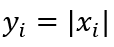

其中：

- ``i`` 表示一个多元组的索引，例如在4维时可以表示(n,c,h,w)。
- ``xi`` 和 ``yi`` 表示多元组中 ``i`` 索引处的元素。

cnnlActivationForward
-----------------------------

激活操作，可配置成：Sigmoid、ReLU、ReLU6、Tanh、ELU、ELU_V2、GeLU、LeakyReLU、TF_LeakyReLU、SeLU、Caffe_ReLU6、
GLU、SiLU、HardSigmoid、HardSwish、LogSigmoid等。

公式如下：

公式中 ``x`` 表示输入数据，等式最左边表示输出数据。

Sigmoid Forward
>>>>>>>>>>>>>>>>>>>

Sigmoid forward计算公式：

.. math::

   \begin{aligned}
   S(x)=\frac{1}{1 + e^{-x}}, \quad {x\in(-\infty, +\infty)}
   \end{aligned}

ReLU Forward
>>>>>>>>>>>>>>>>>>>

ReLU forward计算公式：

.. math::

   \begin{aligned}
   R(x)=
    \begin{cases} 0, & x\in(-\infty, 0] \\ x, & x\in(0, +\infty) \end{cases}
   \end{aligned}

ReLU6 Forward
>>>>>>>>>>>>>>>>>>>

ReLU6 forward计算公式：

.. math::

   \begin{aligned}
   R(x)=
    \begin{cases} 0, & x\in(-\infty, 0] \\ x, & x\in(0, 6) \\ 6, & x\in[6, +\infty) \end{cases}
   \end{aligned}

Tanh Forward
>>>>>>>>>>>>>>>>

Tanh forward计算公式：

.. math::

   \begin{aligned}
   T(x) = \frac{\sinh x} {\cosh x} = \frac{e^{x}-e^{-x}}{e^{x}+e^{-x}}, \quad {x\in(-\infty, +\infty)}
   \end{aligned}

ELU Forward
>>>>>>>>>>>>>>>

ELU forward计算公式为：

.. math::

   \begin{aligned}
   E(x)=
   \begin{cases} {scale * gamma * (e^{coef * x}-1)}, & x\in(-\infty, 0) \\ scale * x, & x\in[0, +\infty) \end{cases}
   \end{aligned}

其中，参数 ``coef``、 ``scale``、 ``gamma`` 为表示ELU的超参数。 ``scale`` 与 ``coef`` 需设为1.0, ``gamma`` 为用户传入参数。

ELU_V2 Forward
>>>>>>>>>>>>>>>>

ELU_V2 forward计算公式为：

.. math::

  \begin{aligned}
  E(x)=
  \begin{cases} {scale * gamma * (e^{coef * x}-1)}, & x\in(-\infty, 0) \\ scale * x, & x\in[0, +\infty) \end{cases}
  \end{aligned}

其中，参数 ``coef``、 ``scale``、 ``gamma`` 为表示ELU_V2的超参数。

GELU Forward
>>>>>>>>>>>>>>>

GELU forward计算公式为：
当approximate为false时，GELU被定义为：

.. math::

   gelu(x)=xP(X<=x)=x\phi(x)=x\int_{-\infty}^{x}{e^{t^2/2}}dt

其中：

.. math::

   \phi(x)=\frac{1}{2}[1+erf(x/\sqrt{2})]

   erf(x)=\frac{2}{\sqrt{\pi}}\int_{0}^{x}{e^{-t^2}}dt

当approximate为true时，GELU亦可近似的处理为：

.. math::

   gelu(x)=0.5 x(1+\tanh[\sqrt{2/\pi}(x/\sqrt{2})])

LeakyReLU Forward
>>>>>>>>>>>>>>>>>>>>>>>>>>>>>>>>>>>

LeakyReLU forward计算公式为：

.. math::

   \begin{aligned}
   L(x)=
    \begin{cases} x, & x\in[0, +\infty) \\ {coef * x}, & x\in(-\infty, 0) \end{cases}
   \end{aligned}

其中，``coef`` 参数为LeakyReLU函数的斜率，用户需要自己设置 ``coef`` 参数值, 一般设置为0.01。

TF_LeakyReLU Forward
>>>>>>>>>>>>>>>>>>>>>>>>

TF_LeakyReLU forward计算公式为：

.. math::

   \begin{aligned}
   L(x)= max(coef * x, x)
   \end{aligned}

其中，``coef`` 参数为TF_LeakyReLU函数的斜率，用户需要自己设置 ``coef`` 参数值,一般设置为0.2。

SELU Forward
>>>>>>>>>>>>>>>

SELU forward计算公式为：

.. math::

   \begin{aligned}
   Selu(x)= \begin{cases} scale * gamma(e^{x}-1), & x\in(-\infty, 0] \\ scale * x, & x\in(0, +\infty) \end{cases}
   \end{aligned}

CAFFE_RELU6 Forward
>>>>>>>>>>>>>>>>>>>>>>>

CAFFE_RELU6 forward计算公式为：

.. math::

   \begin{aligned}
   R(x)=
   \begin{cases} min({coef*x},6), & x\in(-\infty, 0] \\ x, & x\in(0, 6) \\ 6, & x\in[6, +\infty) \end{cases}
   \end{aligned}

其中，``coef`` 参数为CaffeReLU6函数在负半轴的斜率，用户需要自己设置 ``coef`` 参数值,一般设置为0.2。

GLU Forward
>>>>>>>>>>>>>>>

GLU forward计算公式为：

.. math::

   \begin{aligned}
   GLU(a,b)=a * sigmoid(b)
   \end{aligned}

GLU算子的input会根据 ``sliced_dim`` 分割为a, b两部分。其中a为前半部分，b为后半部分。其中b部分经过sigmoid激活后，再与a对位相乘。

Silu Forward
>>>>>>>>>>>>>>>

Silu forward计算公式为：

.. math::

   \begin{aligned}
   Silu(x)=x * sigmoid(x)
   \end{aligned}

HardSigmoid
>>>>>>>>>>>>>>

HardSigmoid计算公式为：

.. math::

   \begin{aligned}
   max(0, min(1, gamma * x + scale))
   \end{aligned}

本质为y = gamma * x + scale这条直线，其输出y被限制在[0,1]之间，从而形成三段式分段函数，其分段区间取决于
该直线与y=0和y=1的交点。

在不同框架下，gamma和scale对应的值有所不同，使用时需对应设置。

Pytorch版本：

.. math::

   \begin{aligned}
   gamma &= 1/6\\
   scale &= 1/2
   \end{aligned}

代入HardSigmoid公式可得，

.. math::

   \begin{aligned}
   Hardsigmoid(x)=
   \begin{cases} {0}, &x\in(-\infty, -3]
   \\ (x+3)/6, &x\in(-3,3)
   \\ 1, &x\in[3, +\infty)
   \end{cases}
   \end{aligned}

Tensorflow版本：

.. math::

   \begin{aligned}
   gamma &= 0.2\\
   scale &= 0.5
   \end{aligned}

代入HardSigmoid公式可得，

.. math::

   \begin{aligned}
   Hardsigmoid(x)=
   \begin{cases} {0}, &x\in(-\infty, -2.5]
   \\ (2x+5)/10, &x\in(-2.5,2.5)
   \\ 1, &x\in[2.5, +\infty)
   \end{cases}
   \end{aligned}:

HardSwish
>>>>>>>>>>>>>

HardSwish forward计算公式为：

.. math::

   \begin{aligned}
   Hardswish(x)=
   \begin{cases} {0}, &x\in(-\infty, -3]
   \\ x(x+3)/6, &x\in(-3,3)
   \\ x, &x\in[3, +\infty)
   \end{cases}
   \end{aligned}

LogSigmoid
>>>>>>>>>>>>>

LogSigmoid forward计算公式为：

.. math::

   \begin{aligned}
   LogSigmoid(x)=log\frac{1}{1 + e^{-x}}, \quad {x\in(-\infty, +\infty)}
   \end{aligned}

cnnlActivationBackward
-----------------------------

激活操作，可配置成：Sigmoid、ReLU、ReLU6、ELU、ELU_V2、GeLU、Tanh、GLU、LeakyReLU、SiLU、
HardSigmoid、HardSwish、LogSigmoid等。

公式如下：

公式中 ``x`` 表示输入数据，等式最左边表示输出数据。

Sigmoid Backward
>>>>>>>>>>>>>>>>>>>>

Sigmoid backward计算公式：

.. math::

   \begin{aligned}
   S^{'}(x) = \frac{e^{-x}}{{(1 + e^{-x})}^2} = S(x)(1 - S(x)), \quad {x\in(-\infty, +\infty)}
   \end{aligned}

ReLU Backward
>>>>>>>>>>>>>>>>>>>>
ReLU backward计算公式：

.. math::

   \begin{aligned}
   R^{'}(x)=
    \begin{cases} 0, & x\in(-\infty, 0] \\ {1}, & x\in(0, +\infty) \end{cases}
   \end{aligned}

ReLU6 Backward
>>>>>>>>>>>>>>>>>>>>

ReLU6 backward计算公式为：

.. math::

   \begin{aligned}
   R^{'}(x)=
    \begin{cases} 0, & x\in(-\infty, 0] \\ {1}, & x\in(0, 6) \\ 0, & x\in [6, +\infty) \end{cases}
   \end{aligned}

ELU Backward
>>>>>>>>>>>>>>>>

ELU backward计算公式为：

当is_result为true时：

.. math::

   \begin{aligned}
   E^{'}(x)=
    \begin{cases} {gamma * (x + scale * coef) * diff\_y}, & x\in(-\infty, 0] \\ scale * x * diff\_y, & x\in(0, +\infty) \end{cases}
   \end{aligned}

当is_result为false时：

.. math::

   \begin{aligned}
   E^{'}(x)=
    \begin{cases} {scale * coef * gamma * e^{gamma * x} * diff\_y}, & x\in(-\infty, 0] \\ scale * x * diff\_y, & x\in(0, +\infty) \end{cases}
   \end{aligned}

其中，参数 ``coef``、 ``scale``、 ``gamma`` 为表示ELU的超参数。

ELU_V2 Backward
>>>>>>>>>>>>>>>>>>>

ELU_V2 backward计算公式为：

当is_result为true时：

.. math::

   \begin{aligned}
   E^{'}(x)=
    \begin{cases} {coef * (x + scale * gamma) * diff\_y}, & x\in(-\infty, 0] \\ scale * x * diff\_y, & x\in(0, +\infty) \end{cases}
   \end{aligned}

当is_result为false时：

.. math::

   \begin{aligned}
   E^{'}(x)=
    \begin{cases} {scale * coef * gamma * e^{coef * x} * diff\_y}, & x\in(-\infty, 0] \\ scale * x * diff\_y, & x\in(0, +\infty) \end{cases}
   \end{aligned}

其中，参数 ``coef``、 ``scale``、 ``gamma`` 为表示ELU_V2的超参数。

GELU Backward
>>>>>>>>>>>>>>>

GELU backward计算公式为：

.. math::

   gelu'(x) = \phi(x)+x\phi'(x) = \frac{1}{2}[1+erf(x/\sqrt{2})]+x[\frac{1}{2}erf'(x/\sqrt{2})] = \frac{1}{2}[1+erf(x/\sqrt{2})]+\frac{x}{\sqrt{2\pi}}e^{-x^2/2}

Tanh Backward
>>>>>>>>>>>>>>>>>>>>>

Tanh backward计算公式为：

.. math::

   \begin{aligned}
   T^{'}(x) = 1-(\frac{e^{x}-e^{-x}}{e^{x}+e^{-x}})^{2} = 1-T(x)^{2}, \quad {x\in(-\infty, +\infty)}
   \end{aligned}

GLU Backward
>>>>>>>>>>>>>>>>>

GLU backward计算公式为：

.. math::

   \begin{aligned}
    GLU^{'}_{a}&=dy * sigmoid(x_b)\\
    GLU^{'}_{b}&=dy * sigmoid(x_b)*(1-sigmoid(x_b))*x_a\\
    GLU^{'}&=concat({GLU^{'}_{a},GLU^{'}_{b}})
   \end{aligned}

GLU backward算子中，共两个输入，第一个输入为x，会根据sliced_dim分为a,b两部分。第二个输入dy为正向输出。

LeakyReLU Backward
>>>>>>>>>>>>>>>>>>>>>>>>>>>>>>>>>>>

LeakyReLU backward计算公式为：

.. math::

   \begin{aligned}
   L^{'}(x)=
    \begin{cases} {1}, & x\in[0, +\infty) \\ {coef}, & x\in(-\infty, 0) \end{cases}
   \end{aligned}

其中，``coef`` 参数为LeakyReLU函数的斜率，用户需要自己设置 ``coef`` 参数值, 一般设置为0.01。

TF_LeakyReLu Backward
>>>>>>>>>>>>>>>>>>>>>>>>

TF_LeakyReLU backward计算公式为：

.. math::

   \begin{aligned}
   L^{'}(x)=
    \begin{cases} {1}, & x\in[0, +\infty) \\ {coef}, & x\in(-\infty, 0) \end{cases}
   \end{aligned}

其中，``coef`` 参数为TF_LeakyReLU函数的斜率，用户需要自己设置 ``coef`` 参数值,一般设置为0.2。

Silu Backward
>>>>>>>>>>>>>>>>>>>>>>

Silu算子backward计算公式为：

.. math::

   \begin{aligned}
   Silu^{'}(x)=sigmoid(x) * (1+x* (1-sigmoid(x)))
   \end{aligned}

HardSigmoid Backward
>>>>>>>>>>>>>>>>>>>>>>>>>>>

HardSigmoid算子backward计算公式为：

.. math::

   \begin{aligned}
   Hardsigmoid^{'}(x)=
   \begin{cases} {0}, &x\in(-\infty, -2.5)
	\\ 1/5, &x\in[-2.5,2.5]
	\\ 0, &x\in(2.5, +\infty)
   \end{cases}
   \end{aligned}

HardSwish Backward
>>>>>>>>>>>>>>>>>>>>>>>

HardSwish算子backward计算公式为：

.. math::

   \begin{aligned}
   Hardswish^{'}(x)=
   \begin{cases} {0}, &x\in(-\infty, -3)
	\\ (2x+3)/6, &x\in[-3,3]
	\\ 1, &x\in(3, +\infty)
   \end{cases}
   \end{aligned}

LogSigmoid算子backward计算公式为：

.. math::

   \begin{aligned}
   LogSigmoid^{'}(x) = \frac{e^{-x}}{1 + e^{-x}}, \quad {x\in(-\infty, +\infty)}
   \end{aligned}

cnnlAdaptivePoolingForward
---------------------------------

Cambricon CNNL的一种自适应池化算子。与Pooling Forward算子的区别在于，只要给定输入输出的大小，Adaptive Pooling Forward能够自动计算核（kernel）的大小和每次移动的步长（stride）。因此，只要给Adaptive Pooling Forward输入输出的数据，由它自己去适应、计算，最后给出符合要求的结果。这样就减免了用户在Pooling Forward中繁琐的参数配置。

cnnlAdaptivePoolingForward支持 ``CNNL_POOLING_AVERAGE_COUNT_INCLUDE_PADDING`` 和 ``CNNL_POOLING_MAX`` 模式。公式详情，参看 cnnlPoolingForward_。

cnnlAdaptivePoolingBackward
--------------------------------

Adaptive Pooling Forward的反向算子，给定输出、输入、索引，即可得到梯度输入。

cnnlAdaptivePoolingBackward支持 ``CNNL_POOLING_AVERAGE_COUNT_INCLUDE_PADDING`` 和 ``CNNL_POOLING_MAX`` 模式。公式详情，参看 cnnlPoolingBackward_。

cnnlAddcdiv
-----------------------

张量对位相加和相除操作。

公式如下：

.. math::

   output = A + alpha * B / C

其中 ``A``、``B``、``C`` 分别表述输入的张量，``alpha`` 表示输入标量，``output`` 表示输出数据。

cnnlAddcmul
-----------------------------

张量对位相加和相乘操作。

公式如下：

.. math::

   output = A + alpha * B * C

其中 ``A``、``B``、``C`` 分别表述输入的张量，``alpha`` 表示输入标量，``output`` 表示输出数据。

cnnlAddN
----------

多个张量的加法操作。

公式如下：

已知形状完全一致的输入张量 ``A``、``B``、``C`` 等若干，构成张量集合 ``X``。

len = length(A) = length(B)= …… = length(D)

AddN(A,B...)公式如下：

.. math::

   Z[i]=\sum_{n=0}^{len-1}Tn[i],i\epsilon[0,len-1],n\epsilon[0,|X|-1]

其中 ``Tn`` 指集合 ``X`` 中任意一个张量，``Z`` 表示输出数据，是所有输入张量对位相加后的结果。:math:`\epsilon` 是为了避免分母为0。

cnnlAdvancedIndex
-------------------

实现Integer array indexing和Boolean array indexing。Integer array indexing 是将多个 indices tensors 的同一位置取出的数组成一个坐标指向输入 tensor 中的一个数据，即取数放入输出tensor 中。indices tensors 按顺序对应输入 tensor 的各个维度。Boolean array indexing 的操作有且仅有一个 bool index。从高维到低维，bool index 的维度信息与输入tensor 相同。Bool index 中的一个 true/false 数据对应输入tensor 中的一个或一片数据。若 bool index 中某位置为 true 值，则输入tensor 中相同位置的数据被取出放入输出 tensor 中，反之舍弃。

Integer array indexing公式如下：

.. math::

   B[i_1, ..., i_M] = A[INDEX_1[i_1, ..., i_M], INDEX_2[i_1, ..., i_M],
					   ..., INDEX_N[i_1, ..., i_M]]

其中：

- A：输入 tensor。
- :math:`INDEX_1`, ..., :math:`INDEX_N`： input 中 N 个维度的 int indices tensor
- B：输出tensor。
- :math:`i_1`, ..., :math:`i_M`：output 中的坐标。

Boolean array indexing公式如下：

.. math::

   \begin{aligned}
   &B = [\forall A[x]~|~INDEX[x] == True]
   \end{aligned}

其中：

- A：输入 tensor。
- INDEX: layout、shape 和 A、B 一致，且数据类型为 bool 的张量。
- x: 包含维度信息的 INDEX tensor 内部坐标，与 A 连续最高若干维度信息相同。
- B: 输出tensor，该tensor中各个数据的先后关系与输入中的相对先后关系相同。

cnnlApplyAdam
----------------

一种基于梯度下降算法的优化算法，该算法综合了Momentum算法和RMSProp算法，既使用了梯度的一阶滑动平均值作为动量项，又使用了梯度的二阶滑动平均项对动量进行归约，抑制优化过程中的震荡，加快收敛速度。

公式如下：

.. math::

   \begin{aligned}
   \alpha = lr * \frac{\sqrt{1-\delta_{2}}}{1-\delta_{1}}\\
   m_{t} = \beta_{1} * m_{t-1} + (1 - \beta_{1}) * grad\\
   v_{t} = \beta_{2} * v_{t-1} + (1 - \beta_{2}) * grad^2\\
   \end{aligned}

如果 use_nesterov 为false：

.. math::

   var = var_{t-1} - \frac{\alpha * m_{t}}{\sqrt{v_{t}} + \epsilon}

否则：

.. math::

   var = var_{t-1} - \frac{\alpha * (\beta_{1} * m_{t} + (1-\beta_1) * grad)}{\sqrt{v_{t}} + \epsilon}

其中：

- :math:`lr` 为学习率，是一个输入参数。
- :math:`\delta_{1}` 和 :math:`\delta_{2}` 为输入参数，用来对学习率进行约束。
- :math:`grad` 为输入的梯度张量。
- :math:`m` 为输入的滑动平均梯度张量。
- :math:`v` 为输入的滑动平均平方梯度张量。
- :math:`\beta_{1}` 和 :math:`\beta_{2}` 为输入的滑动平均系数参数。
- :math:`epsilon` 为输入的避免分母为0的无穷小输入参数。
- :math:`var` 为输入的待更新的张量。
- :math:`use\_nesterov` 为一个输入的bool值参数，用来控制更新参数的模式。
- 下标 :math:`t` 和 :math:`t-1` 为优化的迭代轮次。

cnnlApplyAdadelta
-------------------

通过滤波器梯度更新原始滤波器。一种常用的基于Adadelta算法的优化算法，可以替代传统随机梯度下降(SGD)过程的一阶
优化算法。

公式如下：

.. math::

   accum = rho * accum + (1 - rho) * grad^2

.. math::

   update = \frac{\sqrt{(accum\_update + epsilon)}}{\sqrt{(accum + epsilon)}} * grad

.. math::

   accum\_update = rho * accum\_update + (1 - rho) * update^2

.. math::

   var = var - lr * update

其中，参数描述如下：

- ``accum`` 为梯度二阶矩的移动平均值。
- ``rho`` 为移动平局更新算法中的衰减率。
- ``grad`` 为可训练变量的梯度。
- ``epsilon`` 为增加数值稳定性的极小常量。
- ``accum_update`` 为可训练参数变化量二阶矩的移动平均值。
- ``lr`` 为可训练参数更新学习率。

cnnlApplyAdaGrad
------------------

基于AdaGrad算法的优化算子，其主要功能是通过滤波器梯度更新原始滤波器。

公式如下：

.. math::

   \begin{aligned}
   Accum_t& = Accum_{t-1} + grad * grad\\
   Var_t &= Var_{t-1} - \frac{grad * lr }{ \sqrt{Accum_t}}
   \end{aligned}

其中，``accum`` 为浮点矩阵，``grad`` 为浮点梯度，``lr`` 为标量，``var`` 为浮点滤波器。

cnnlApplyAdaGradV2
------------------

基于AdaGrad算法的优化算子，其主要功能是通过滤波器梯度更新原始滤波器。相比于cnnlApplyAdaGrad，公式中增加epsilon参数，是为了避免除零的情况发生。

公式如下：

.. math::

   \begin{aligned}
   Accum_t & = Accum_{t-1} + grad * grad \\
   Var_t & = Var_{t-1} - \frac{grad * lr}{\sqrt{Accum_t} + epsilon}
   \end{aligned}

其中，``accum`` 为浮点矩阵，``grad`` 为浮点梯度，``lr`` 和 ``epsilon`` 为标量，``var`` 为浮点滤波器。

cnnlApplyAdaMax
------------------

基于无穷范数（Infinity norm）的Adam的一种变体，其主要功能是通过滤波器梯度更新原始滤波器，和Adam类似，它也是一种可以替代传统随机梯度下降(SGD)过程的一阶
优化算法。对于一些嵌入模型，它的表现会优于Adam。

公式如下：

.. math::

   \begin{aligned}
   m += (grad - m) * (1 - \beta_{1})\\
   v = max(v * \beta_{2}, abs(grad))\\
   var -= \frac{lr}{1-\beta_{1}\_power} * \frac{m}{v + \epsilon}
   \end{aligned}

其中 ``var`` 为网络滤波器，``m`` 是first momentum vector，``v`` 是指数加权无穷范数，``lr`` 为学习率，:math:`\beta_{1}` 和 :math:`\beta_{2}` 分别是用于 ``m`` 和 ``v`` 的指数衰减率，:math:`\beta_{1}\_power` 是用于 ``var`` 更新的其中的一个参数。``m`` 和 ``v`` 和 ``var`` 需要再每次迭代更新并保存。

cnnlApplyAddSign
------------------

基于AddSign算法的优化算法，其主要功能是通过梯度更新原始滤波器。

公式如下：

.. math::

  \begin{aligned}
  &m_t = beta * m_{t-1} + (1 - beta） * g    \\
  &update = (alpha + sign\_decay * sign(g) * sign(m_t)) * g   \\
  &var = var - lr_t * update
  \end{aligned}

其中：

- ``var`` 为待优化参数，一般为网络滤波器。
- ``m`` 为 momentum 一阶动量。
- ``lr`` 为学习率。
- ``sign_decay`` 为sign函数的衰减率。
- ``g`` 为 gradient 梯度。
- ``update`` 为中间计算变量。
- ``alpha`` 为超参数，人为控制的惩罚项。
- ``beta`` 为超参数，人为控制的惩罚项。
- ``sign()`` 为计算正负号函数。

cnnlApplyCenterRMSProp
-----------------------

一种基于梯度下降算法的优化算法。该算法使用了滑动平均的平方根梯度项，对滑动平均梯度在各个方向上进行了规约，能抑制优化过程中的震荡，加快优化速度。

公式如下：

.. math::

   \begin{aligned}
   one\_minus\_rho = 1 - rho\\
   ms = ms + one\_minus\_rho * (grad^2 - ms)\\
   mg = mg + one\_minus\_rho * (grad - mg)\\
   denom = ms - mg * mg + epsilon\\
   mom = mom * momentum + lr * \frac{grad}{\sqrt{denom}}\\
   var = var - mom\\
   \end{aligned}

其中：

- :math:`one\_minus\_rho` 为计算的中间结果参数。
- :math:`rho` 为输入的滑动平均系数。
- :math:`grad` 为输入的梯度张量。
- :math:`ms` 为滑动平均平方梯度张量。
- :math:`mg` 为滑动平均梯度张量。
- :math:`denom` 为计算的中间结果张量。
- :math:`mom` 为输入的动量张量。
- :math:`momentum` 为输入的动量滑动平均系数。
- :math:`var` 为输入的待更新的张量。
- :math:`epsilon` 为输入的避免对负数开根号的小输入参数。

cnnlApplyProximalAdagrad
------------------------

使用近端梯度下降算法（又称folos）实现滤波器的更新。该算子是网络反向传播更新滤波器时的一种优化算法。

公式如下：

.. math::

   \begin{aligned}
   accum_t& = accum_{t-1} + grad * grad\\
   prox\_v &= var_{t-1} - \frac{grad * lr }{\sqrt{accum_t}}\\
   var_t &= sign(prox\_v)/(1+\frac{lr*l2}{\sqrt{accum_t}})*max\{|prox\_v|-\frac{lr*l1}{\sqrt{accum_t}},0\}
   \end{aligned}

其中：

- ``var`` 表示滤波器。
- ``accum`` 表示梯度的累加值。
- ``grad`` 表示梯度。
- ``lr`` 表示学习率。
- ``l1`` 表示L1正则化系数。
- ``l2`` 表示L2正则化系数。
- ``prox_v`` 表示计算过程中的中间结果。

cnnlArange
------------

创建一个数字序列，开始于 start，依次递增 step，直到不越过且不包括 end 的最后一个值。

cnnlArange 公式如下：

.. math::

   length = \lceil {(end - start)/step} \rceil

输出数列的值：

.. math::

   out_{i} = start + i * step

cnnlArange_v2 公式如下：

.. math::

   length = \sum_{n=0}^N {out\_dim}_n

输出数列的值：

.. math::

   out_{i} = start + i * step

其中：

- ``length`` 为数列长度。
- ``start`` 表示输出数列的起始值。
- ``end`` 表示输出数列的终点，输出数列的最后一个数不得大于 ``end``。
- ``step`` 表示输出等差数列的步长。
- ``i`` 表示输出的每个值的位置，取值范围为[0,length-1]。
- :math:`{out\_dim}_n` 表示输出张量各维度的大小。
- ``N`` 表示输出张量的维度。

cnnlAssignAdd
----------------

张量对位相加操作。

公式如下：

.. math::

   C=C+A,defined \quad as \quad C[i]=C[i]+A[i],i\epsilon[0,len-1]

其中 ``A`` 和 ``C`` 表示输入张量，``alpha`` 和 ``beta`` 表示输入标量，``C`` 同时表示计算后的输出数据。A是可以广播的。:math:`\epsilon` 是为了避免分母为0。

cnnlAssignSub
----------------

张量对位相减操作。

公式如下：

.. math::

   C=C-A,defined \quad as \quad C[i]=C[i]-A[i],i\epsilon[0,len-1]

其中 ``A`` 和 ``C`` 表示输入张量，``alpha`` 和 ``beta`` 表示输入标量，``C`` 同时表示计算后的输出数据。A是可以广播的。 :math:`\epsilon` 是为了避免分母为0。

cnnlAssignTo
--------------

将一个张量赋值到另一个张量中。

cnnlAsStrided
---------------

对输入张量进行几何形状变化。根据给定的输出张量的形状、stride以及storage offset进行划分，返回指定几何形状变换后的张量。输出张量的形状的维度大小需和 strides相同，即每个维度都有一个对应的 stride参数。该算子会根据每个维度的stride参数，从输入张量中按一定规则挑选数据。

对于任意维度的输入 input，都将其看作一维张量，长度为原输入各维度长度乘积。strides 形状为 (S1, S2, S3)，storage_offset 大小为 SO ，输出张量 output 形状为 (O1, O2, O3) 时，输出计算结果为：

.. math::

   output(o1, o2, o3) = input[SO + o1 * S2 * S3 + o2 * S3 + o3]

AsStrided Forward示例如下：

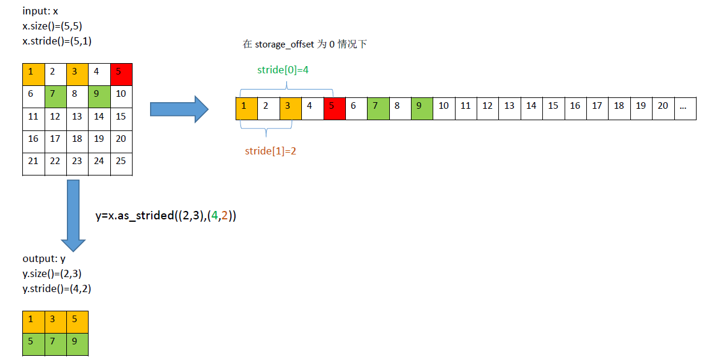

cnnlAsStridedBackward
----------------------

AsStrided Backward算子是AsStrided的反向传播。该算子用于接收传入的梯度grad_y，其几何形状grad_y_desc，输入几何形状的strides_y，偏移量storage_offset_y，
根据指定几何形状的grad_x_desc，计算并返回输出grad_x。

示例如下：

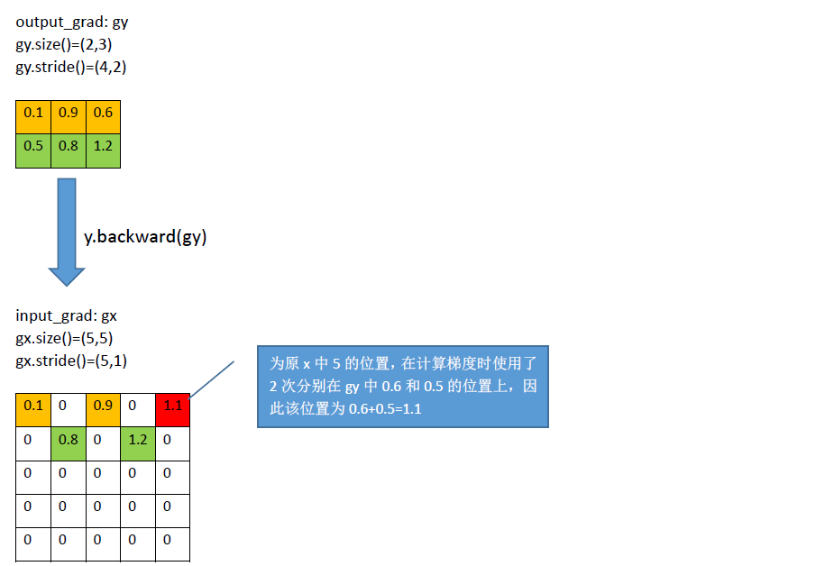

cnnlAtan2
--------------

将给定两个输入相除，再对得到结果计算反正切值，符号由y和x的符号决定正确的象限，取值范围为(-π，π]，该算子返回以弧度表示的y/x的反正切，即原点至点(x,y)的方位角，即与x轴的夹角。

公式如下：

.. math::

   z_i = \begin{cases}
   \arctan(\frac {y_i}{x_i})   &     \quad {x_i}>0 \\
   \arctan(\frac {y_i}{x_i}) + \pi & \quad {y_i}>=0,{x_i}<0\\
   \arctan(\frac {y_i}{x_i}) - \pi & \quad {y_i}<0,{x_i}<0 \\
   + \frac \pi2           & \quad {y_i}>0,{x_i}=0 \\
   - \frac \pi2          &   \quad {y_i}<0,{x_i}=0 \\
   0                    &   \quad {y_i}=0,x=0 \\
   \end{cases}

其中：

- ``i`` 表示一个多维数组的索引， ``x``、 ``y``、 ``z`` 均表示多维张量， ``x``、 ``y`` 是可以广播的。
- ``x_i``、 ``y_i``、 ``z_i`` 表示多维数组中 ``i`` 索引处的元素。
- 当 ``x_i`` 且 ``y_i`` 等于0时，返回值 ``z_i`` 等于0。

cnnlAttention
---------------

Attention机制的实质其实就是一个寻址（addressing）的过程。给定一个和任务相关的查询Query向量q，通过计算与key的注意力分布并附加在Value上，从而计算AttentionValue，这个过程实际上是Attention机制缓解网络模型复杂度的体现，即不需要将所有的N个输入信息都输入到网络进行计算，只需要从x中选择一些和任务相关的信息输入给网络。

cnnlAx
--------

将系数张量A与目标张量X逐元素相乘，计算结果保存在X中。

公式如下：

.. math::

   X = A * X

cnnlAxpby
-----------

将系数张量A与张量X，系数张量B与张量Y分别逐元素相乘，再将结果相加，计算结果保存在X中。

公式如下：

.. math::

   X = A * X + B * Y

cnnlAxpy
---------

将系数张量A与张量X逐元素相乘，结果再和张量Y相加，计算结果保存在X中。

公式如下：

.. math::

   X = A * X + Y

.. _cnnlBatch2space:

cnnlBatch2space
-----------------

在进行一些Convolution计算的时候，为了增加感受野，引入了膨胀系数dilation。正常的Convolution计算， dilation 为 1 。如果H方向与W方向的 dilation 为 2 ，则滤波器坐标对应的每一个输入都要增加 2 ，如图所示：

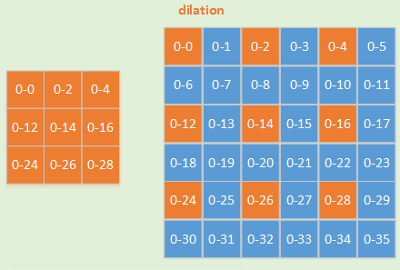

为了提升 dilation 情况下的Convolution计算效率，需要cnnlSpace2batch和cnnlBatch2space两个算子对输入数据做一些位置上的改变。此算子为一个纯 IO 操作的算子。输入数据为4维Tensor。该算子只支持4维，但布局可以是 NHWC/NCHW/HWCN。推荐使用NHWC布局。该算子性能比 cnnlBatch2spaceNd_ 要好，但功能不如 cnnlBatch2spaceNd_ 系列全面。

cnnlBatch2space与 cnnlSpace2batch_ 互为逆运算，要成对使用。如下图所示，cnnlBatch2space 算子是将batch侧数据重新排布成space侧形状。

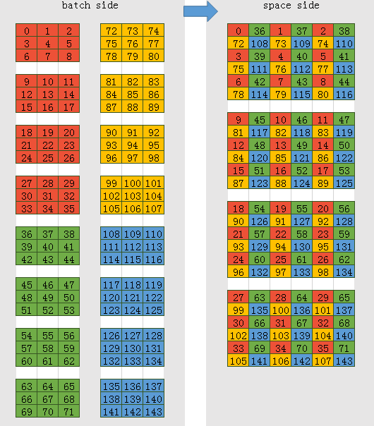

cnnlBatch2space算子的输入、输出要满足如下关系:

.. math::

   \begin{array}{lcl}
   n_{o} = n_{i} \div (dh \times dw) \\
   h_{o} = h_{i} \times dh \\
   w_o = w_i \times dw \\
   c_o = c_i
   \end{array}

其中参数含义如下：

- :math:`c_i` 表示输入张量块内每个元素的通道数，可能被切分后传输。
- :math:`c_o` 表示输出张量块内每个元素的通道数。
- ``dh`` 表示在 h 方向的膨胀系数。
- ``dw`` 表示在w方向的膨胀系数。
- :math:`n_{i}` 表示N维度输入。
- :math:`n_{o}` 表示N维度输出。
- :math:`h_{i}` 表示输入张量的高度。
- :math:`h_{o}` 表示输出张量的高度。
- :math:`w_o` 表示输出张量的宽度。

.. _cnnlBatch2spaceNd:

cnnlBatch2spaceNd
-------------------

下图以二维为例，说明了cnnlBatch2spaceNd算子的数据变化过程。

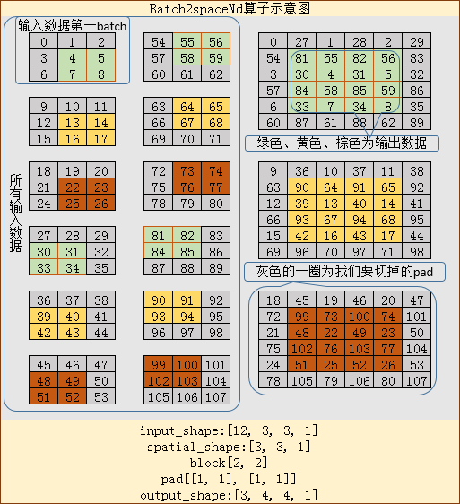

cnnlBatch2spaceNd算子的算法与 cnnlSpace2batchNd_ 算子正好相反。先将第一个batch[3, 3]中的每个元素变成[2, 2]大小，于是所得的space的HW为[6, 6]，再将剩余的batch放入block的相应的位置，补齐space。由于该算子也有pad参数，在cnnlBatch2spaceNd算子当中是切pad，就是将获得的space切掉pad，于是最后得到的形状为[4, 4]。

上面说明了HW维度的处理，下面说明输出N的维度的处理。cnnlBatch2spaceNd算子的输出在N维度为（input_n / (block_h * block_w)），如果维度更高则为（input_n / (block_0 * block_1 * ... * block_n)）。上面输出N的维度为3（=12 / (2 * 2) ）。

本算子功能比 cnnlBatch2space_ 全面，支持多维，支持pad，但性能不如cnnlBatch2space。

.. _cnnlBatchMatMul:

cnnlBatchMatMul
------------------------------

batch的矩阵相乘。

公式如下：

.. math::

   C[i] = A[i] * B[i], i \in [0, batchSize - 1]

展开如下：

.. math::

   C[i]_{m,n} = \sum_{k=1}^K A[i]_{m,k}B[i]_{k,n}, i \in [0, batchSize - 1]

其中：

- ``batchSize`` 表示batch的大小。
- ``A[i]`` 表示 ``M * K`` 矩阵。``B[i]`` 表示 ``K * N`` 矩阵。``C[i]`` 表示 ``M * N`` 矩阵。
- ``m`` 表示矩阵 ``A[i]`` 和矩阵 ``C[i]`` 的行数。``n`` 表示矩阵 ``B[i]`` 和矩阵 ``C[i]`` 的行数。``k`` 表示矩阵 ``A[i]`` 的列数和矩阵 ``B[i]`` 的行数。

.. _cnnlBatchMatMulBCast:

cnnlBatchMatMulBCast
----------------------------

带广播的batch矩阵相乘。通常，带广播功能的batch矩阵相乘计算会在一批矩阵上执行矩阵-矩阵乘法。

公式如下：

.. math::

   C[P1,P2,...,Pk,m,n] = A[N1,N2,...,Nk,m,k]* B[M1,M2,...,Mk,k,n]

cnnlBatchNormForwardInference/cnnlBatchNormForwardTraining
------------------------------------------------------------------

对输入张量的不同通道跨batch做标准化。cnnlBatchNormForwardInference 用于推理以及训练的 evaluation ，cnnlBatchNormForwardTraining 用于训练 forward。

公式如下：

.. math::

   \begin{aligned}
   & \mu_c = \frac{\sum_{n,h,w}{x_{n,h,w,c}}}{M}, \quad (M=N*H*W)  \\
   & \sigma^2_c = \frac{\sum_{n,h,w}(x_{n,h,w,c}-\mu_c)^2}{M} \\
   & \\
   & \hat{\mu_c} = m * \mu_c + (1-m) * \hat{\mu_c} \\
   & \hat{\sigma^2_c} = m * \sigma^2_c + (1-m) * \hat{\sigma^2_c} \\
   & \\
   & z_i = \gamma_c*y_i + \beta_c = \gamma_c * \frac{x_i-\mu_c}{\sqrt{\sigma^2_c+\epsilon}} + \beta_c, \quad i=(n,h,w,c)  \\
   \end{aligned}

其中：

- 公式中 :math:`\mu_c` 是列表中张量 saved_mean 索引为 ``c`` 的元素。
- 公式中 :math:`x_{n,h,w,c}` 是列表中张量 x 索引为 ``(n,h,w,c)`` 的元素。
- ``i`` 表示一个多元组下标，在4维情况下表示 ``(n,c,h,w)/(n,h,w,c)``。
- ``m`` 表示均值、方差滑动平均的系数momentum。
- 公式中 :math:`\hat{\mu_c}` 是列表中张量 moving_mean 索引为 ``c`` 的元素。
- 公式中 :math:`\sigma^2_c` 是中间变量。
- 公式中 :math:`\hat{\sigma_c^2}` 是列表中张量 moving_var 索引为 ``c`` 的元素。
- 公式中 :math:`\gamma_c` 是列表中张量 filter 索引为 ``c`` 的元素。
- 公式中 :math:`\beta_c` 是列表中张量 bias 索引为 ``c`` 的元素。
- 公式中 :math:`\epsilon` 是列表中的 eps。
- 公式中 :math:`x_i` 是列表中张量 x 索引为 ``i=(n,h,w,c)`` 的元素。
- 公式中 :math:`z_i` 是列表中张量 z 索引为 ``i=(n,h,w,c)`` 的元素。
- 公式中 :math:`y_i` 是归一化张量 y 索引为 ``i=(n,h,w,c)`` 的元素。
- 公式中 :math:`\frac{1}{\sqrt{\sigma^2_c+\epsilon}}` 是列表中张量 saved_invstd 索引为 ``c`` 的元素。

cnnlBatchGatherV2
-------------------------------------

在Transformer网络中的Encode层，用于去除输入的paddings，其功能是根据索引（indices）从参数轴（axis）上收集切片数据（params）。

cnnlBatchNormBackward
-------------------------------------

是 BatchNorm 对应的反向算子，计算损失函数在 x, filter, bias 处的梯度，用于 ResNet 系列网络的训练。

cnnlBboxOverlaps
-------------------------------------

计算bounding box a、bounding box b集合的交集与并集的比值（IOU）或者交集与bounding box a的比值（IOF）。

计算说明如下：

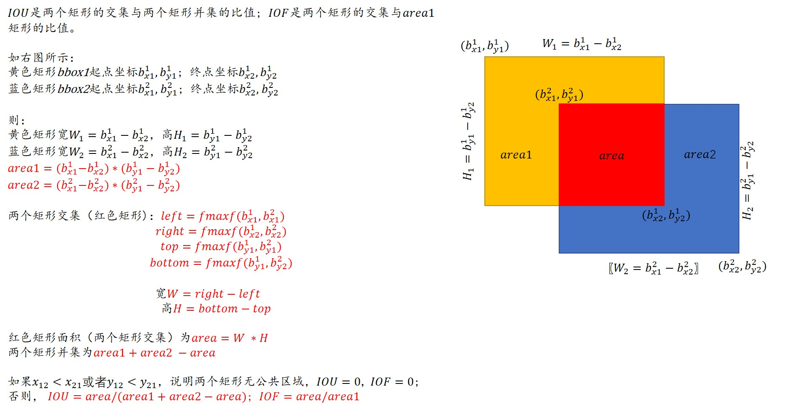

示例如下：

::

    Example:
        >>> bboxes1 = torch.FloatTensor([
        >>>     [0, 0, 10, 10],
        >>>     [10, 10, 20, 20],
        >>>     [32, 32, 38, 42],
        >>> ])
        >>> bboxes2 = torch.FloatTensor([
        >>>     [0, 0, 10, 20],
        >>>     [0, 10, 10, 19],
        >>>     [10, 10, 20, 20],
        >>> ])
        >>> bbox_overlaps(bboxes1, bboxes2)
        tensor([[0.5000, 0.0000, 0.0000],
                [0.0000, 0.0000, 1.0000],
                [0.0000, 0.0000, 0.0000]])
    Example:
        >>> empty = torch.FloatTensor([])
        >>> nonempty = torch.FloatTensor([
        >>>     [0, 0, 10, 9],
        >>> ])
        >>> assert tuple(bbox_overlaps(empty, nonempty).shape) == (0, 1)
        >>> assert tuple(bbox_overlaps(nonempty, empty).shape) == (1, 0)
        >>> assert tuple(bbox_overlaps(empty, empty).shape) == (0, 0)

cnnlBceLoss
-------------------------------------

对网络的输出结果求交叉熵计算。交叉熵可以显示期望值与实际值的差距，交叉熵越小，说明期望值越接近实际值。设target为期望值，input为实际值，则BinaryCrossEntropyLoss计算的Loss Function 可表示为：

对单个样本来说，交叉熵公式为：

.. math::

   \begin{aligned}
   &\large  y  = -target*log(input) -(1-target)*log(1-input)
   \end{aligned}

若filter参数不为空，则需要对上面得到的交叉熵y进行加权平均：

.. math::

   \begin{aligned}
   &\large y = filter * y
   \end{aligned}

cnnlBceLossBackward
-------------------------------------

BinaryCrossEntropyLoss的反向算子，对前向算子进行求导。

计算公式如下：

.. math::

   output = - (target - input) / ((input + EPS) * (1 - input + EPS))

若参数filter不为空，则需要对上述结果进行加权平均：

.. math::

   output = output * filter

若reduction模式为 ``mean`` 模式，则需要对output进一步处理：

.. math::

   output = output / N

其中：

- EPS参数：EPS = 1e-12
- input: 输入数据，取值范围[0,1]。
- target：输入数据。
- output：输出数据。
- filter: 输入数据，滤波器张量。
- N 表示为input向量的元素个数。

cnnlBceWithLogits
-------------------------------------

对网络的输出结果进行sigmoid操作，然后求交叉熵（Cross Entropy）计算。交叉熵可以显示期望值与实际值的差距。交叉熵越小，说明期望值越接近实际值。

Sigmoid的计算公式如下：

.. math::

   \begin{aligned}
   &\large h(x) = \frac{1}{1+e^{-x}}
   \end{aligned}

Sigmoid的求导公式如下：

.. math::

   \begin{aligned}
   &\large h(x)^{'} = ({\frac{1}{1+e^{-x}}})^{'}
                  & = {\frac{1}{{(1+e^{-x})}^{-2}}}*e^{-x}
                  & = {\frac{1}{1+e^{-x}}}*{\frac{e^{-x}}{1+e^{-x}}}
                  & = h(x)*(1-h(x))
   \end{aligned}

设 ``target`` 为期望值，``input`` 为实际值，``pos_filter`` 为调节样本数据不均衡的滤波器。

- 若 ``pos_filter`` 参数不为空，对单个样本来说，交叉熵公式为：

   .. math::

      \begin{aligned}
      &\large  y  = -pos\_filter*target*log(h(input)) -(1-target)*log(1-h(input))
      \end{aligned}

- 若 ``pos_filter`` 参数为空，对单个样本来说，交叉熵公式为：

  .. math::

     \begin{aligned}
     &\large  y  = -target*log(h(input)) -(1-target)*log(1-h(input))
     \end{aligned}

cnnlBceWithLogitsBackward
-----------------------------

反向算子是求输入 ``input`` 的梯度，即 ``grad_input``。因此根据前向算子的公式进行相应求导，得出反向算子的计算公式。

设 ``target`` 为期望值，``input`` 为实际值，``pos_filter`` 为调节样本数据不均衡的滤波器。

- 若 ``pos_filter`` 参数不为空，则 ``grad_input`` 的计算公式为：

  .. math::

      \begin{aligned}
      &\large  grad\_input  = ((pos\_filter*target+1-target)*h(input)-pos\_filter*target)*grad
      \end{aligned}

- 若 ``pos_filter`` 参数为空，则 ``grad_input`` 的计算公式为:

  .. math::

      \begin{aligned}
      &\large  grad\_input  = (h(input) - target)*grad
      \end{aligned}

当计算出 ``grad_input`` 后，根据算子中的 ``filter`` 参数来决定是否对 ``grad_input`` 加权处理。若filter不为空：

.. math::

   \begin{aligned}
   &\large  grad\_input = grad\_input*filter
   \end{aligned}

当 ``grad_input`` 经过 ``filter`` 参数处理后，再根据 ``reduction`` 参数来决定是否对 ``grad_input`` 进行计算。

若 ``reduction`` 模式为 ``mean`` ，计算公式如下：

.. math::

  \begin{aligned}
  &\large grad\_input = grad\_input / N
  \end{aligned}

``N`` 表示 ``input`` 的向量的元素个数。

cnnlBiasAdd
-----------------------

将bias与卷积计算的结果X求和，即对bias进行广播，然后与X求和。假设数据格式为NCHW, X的形状为(n，c，h，w), bias的形状为(c)， 计算公式如下：

.. math::

   Y_{\left[n,h,w,c \right]} = X_{\left[n,h,w,c \right]} + bias_{\left[c \right]}

cnnlBiasAddBackward
-----------------------

计算bias的梯度，常常结合卷积或者全连接使用。

计算方式如下：

将输入元素 ``diff_Y`` 在axis指定的通道上的求和，即将所有的值在特征维度axis上累加求和，进行规约。具体操作如下：

- 对于二维的输入，元素在指定的特征维度axis上累加，规约其他维度，输出 ``diff_bias``，输出的形状为[C]。

- 对于三维的输入，元素在指定的特征维度axis上累加，规约其他维度，输出 ``diff_bias``，输出的形状为[C]。

- 对于四维的输入：

  -  如果是NHWC格式的数据，axis为3，元素在特征维度C上累加，规约其他维度，输出 ``diff_bias``，输出的形状为[C]。
  -  如果是NCHW格式的数据，axis为1， 元素在特征维度C上累加，规约其他维度，输出 ``diff_bias``，输出的形状为[C]。

- 对于五维的输入，元素在指定的特征axis上累加，规约其他维度，输出 ``diff_bias``，输出形状为[C]。

如果数据的格式4维（NHWC），计算公式如下：

.. math::

   diff\_bias_{\left[c \right]} = \sum_{n=0,h=0,w=0}^{N,H,W} (diff\_Y_{\left[n,h,w,c \right]})

其中 ``diff_bias`` 表示输出结果，``diff_Y`` 表示输入梯度。

cnnlBitCompute
-----------------------

输入张量对位执行按位运算。支持的按位运算包括AND、OR、XOR和NOT。

cnnlBorderAlignForward
-----------------------

根据输入boxes提取输入input的边界特征，通过最大池化输出边界的最大特征。

计算过程如下：

1. 输入input[N, H, W, 4C]的4C分为4条border，分别是top、bottom、left和right。

2. 将boxes[N, K, 4]的每组bounding box的height或者width均分成 ``pool_size +1`` 段，根据计算后得到
的 ``pool_size +1`` 个点的像素值以及每个像素点对应的4邻域像素通过双线性插值提取input每条border的特征。

3. 通过最大池化提取每条border的最大特征点以及最大特征点对应的index。

cnnlBoxIouRotated
---------------------

计算旋转边界框之间的交并比（IOU）。

cnnlBoxOverlapBev
------------------------

计算旋转边界框之间的重叠面积（OVERLAP）。

cnnlCarafeBackward
---------------------

cnnlCarafeForward的反向功能，即根据输入特征图、上采样核函数的滤波器张量以及损失函数对输出特征图的梯度张量，得到损失函数对输入特征图和上采样核函数滤波器的梯度张量。

公式如下：

设 ``L`` 为损失函数，:math:`\partial L /\partial y[i,j,c]` 为损失函数对输出特征图的梯度张量：

- ``L`` 对上采样核函数 ``K`` 的梯度张量：

.. math::

   \begin{aligned}
   \frac{\partial{L}}{\partial{K}[i,j,g,n,m]}
   &=
   \sum_{c=0}^{C-1} \sum_{i'=0}^{\sigma W-1} \sum_{j'=0}^{\sigma H-1} \frac{\partial{L}}{\partial{y}[i',j',c]} \cdot \frac{\partial{y[i',j',c]}}{\partial{K[i,j,g,n,m]}} \\
   &=
   \sum_{c=0}^{C-1}
   \sum_{i'=0}^{\sigma W-1} \sum_{j'=0}^{\sigma H-1} \frac{\partial{L}}{\partial{y}[i',j',c]} \cdot \sum_{n'=0}^{k_{up}-1}\sum_{m'=0}^{k_{up}-1}
   \bar{x} \left[\theta(i')+n'-r,\theta(j')+m'-r,c\right] \cdot \frac{\partial{K [i',j',\eta(c),n',m']}}{\partial{K[i,j,g,n,m]}} \\
   &=
   \sum_{c=0}^{C-1} \delta_{g,\eta(c)} \frac{\partial{L}}{\partial{y}[i,j,c]} \cdot \bar{x} \left[\theta(i)+n-r,\theta(j)+m-r,c\right]
   \end{aligned}

其中 :math:`\delta_{i,j}`  为Kronecker记号，即：

.. math::

   \delta_{i,j} =
   \begin{cases}
   1   & i = j \\
   0   & i \neq j
   \end{cases}

- ``L`` 对输入特征图 ``x`` 的梯度张量：

  .. math::

     \begin{aligned}
     \frac{\partial{L}}{\partial{x}[i,j,c]}
     &=
     \frac{\partial{L}}{\partial{\bar{x}}[i,j,c]}  \\
     &=
     \sum_{c'=0}^{C-1} \sum_{i'=0}^{\sigma W-1} \sum_{j'=0}^{\sigma H-1} \frac{\partial{L}}{\partial{y}[i',j',c']} \cdot \frac{\partial{y[i',j',c']}}{\partial{\bar{x}[i,j,c]}} \\
     &=
     \sum_{c'=0}^{C-1} \sum_{i'=0}^{\sigma W-1} \sum_{j'=0}^{\sigma H-1}
     \frac{\partial{L}}{\partial{y}[i',j',c']} \cdot
     \sum_{n'=0}^{k_{up}-1}\sum_{m'=0}^{k_{up}-1}
     {K [i',j',\eta(c'),n',m']}  \cdot
     \frac{\partial{\bar{x} \left[\theta(i')+n'-r,\theta(j')+m'-r,c'\right]}}{\partial{\bar{x}[i,j,c]}} \\
     &=
     \sum_{i'=0}^{\sigma W-1} \sum_{j'=0}^{\sigma H-1} \sum_{n'=0}^{k_{up}-1}\sum_{m'=0}^{k_{up}-1}
     \delta_{i,\theta(i')+n'-r}\delta_{j,\theta(j')+m'-r}
     \frac{\partial{L}}{\partial{y}[i',j',c]} \cdot  {K [i',j',\eta(c),n',m']}
     \end{aligned}

参数含义参考 cnnlCarafeForward_。

.. _cnnlCarafeForward:

cnnlCarafeForward
---------------------

一种通用、轻量且非常有效的上采样算法，在物体识别、语义分割、图像修复等任务上都展示出很好的效果。

公式如下：

.. math::

   \begin{aligned}
   y[i',j',c]
   &=
   \sum_{\underset{\underset{0 \leq {n+\theta(i')-r} < {W}}{\bf{s.t.}}}{n=0}}^{k_{up}-1}
   \sum_{\underset{\underset{0 \leq {m+\theta(j')-r} < {H}}{\bf{s.t.}}}{m=0}}^{k_{up}-1}
   K [i',j',n,m]\cdot x \left[\theta(i')+n-r,\theta(j')+m-r,c\right] \\
   &=
   \sum_{n=0}^{k_{up}-1}
   \sum_{m=0}^{k_{up}-1}
   K [i',j',n,m] \cdot \bar{x} \left[\theta(i')+n-r,\theta(j')+m-r,c\right] \\
   \end{aligned}

其中：

- :math:`y[i',j',c]` 为输出特征图在通道 ``(c)`` 和 :math:`(i',j')` 位置的值。
- :math:`x[i,j,c]` 为输入特征图在通道 ``(c)`` 和 :math:`(i,j)` 位置的值。
- :math:`K[i',j',\ldots]` 为对应输出特征图 :math:`(i',j')` 位置的上采样核函数。为一个二维滤波器矩阵，与输入特征图上相应区域逐元素相乘并求和得到 :math:`(i',j')` 位置的输出。
- :math:`r=\lfloor (k_{up}-1)/2 \rfloor` 为核函数窗的半宽度。
- :math:`\theta(i)=\lfloor i/\sigma \rfloor` 为坐标映射函数，将输出特征图坐标转化为输入特征图坐标。
- :math:`\bar x` 是将 ``x`` 在宽度和高度方向补零元素得到的张量，即：

  .. math::

     \bar x [i,j,c] =
     \begin{cases}
     x[i,j,c] & (0 \leq i < W) \land (0 \leq j < H) \\
     0 & (-r \leq i < 0) \lor (H \leq i < W+k_{up}-r) \lor  (-r \leq j < 0) \lor (H \leq j < H+k_{up}-r)
     \end{cases}

  其中 :math:`\bar x[i,j,c]` 的下标 ``i`` 的范围为 :math:`\left[-r,\ldots,W+k_{up}-r \right)` ，下标 ``j`` 的范围为 :math:`\left[-r,\ldots,H+k_{up}-r \right)`。引入 :math:`\bar x` 是为了便于进行反向公式推导。

在实际使用中，考虑到不同channel可能存在差异，从而需要采用不同的上采样核函数，可将输入特征图的通道维度分为 ``G`` 组，不同组应用不同的上采样核函数。其对应的正向公式为：

.. math::

   y[i',j',c]=\sum_{n=0}^{k_{up}-1}\sum_{m=0}^{k_{up}-1} K[i',j',\eta(c),n,m] \cdot \bar{x}\left[\theta(i')+n-r,\theta(j')+m-r,c\right]

其中：

- :math:`\eta(c)=\lfloor c/ C_g \rfloor` 为通道号至对应组号的映射函数。
- :math:`C_g = \lfloor{ (C+G-1)/G\rfloor}` 为每组的通道数。
- :math:`K[i',j',g,\ldots]` 为输出特征图属于第 ``g`` 组的通道在 ``(i',j')`` 位置上对应的的上采样核函数。

cnnlCastDataType
---------------------

用于数据类型的转换。

将某个算子不支持的输入数据类型转成其支持的数据类型。Cast算子需要支持的类型有uint8、uint16、uint32、int8、int16、int32、float16、float32、bool。

cnnlCaxpby
-----------

将两个张量加权相加，计算结果保存在X中。

公式如下：

.. math::

   X = alpha * X + beta * Y

cnnlCeil
-----------

向上取整用每个元素。

公式如下：

.. math::

   y = \lceil {x} \rceil

其中x为输入，y为输出。

cnnlClip
----------

将输入张量上下削波。

公式如下：

.. math::

   \begin{aligned}
   &y_i=\left\{\begin{matrix}
   min,x_i<min;& \\
   x_i, min<=x_i <=max;& \\
   max, x_i>max;& \end{matrix}\right.
   \\
   &y_i=\left\{\begin{matrix}
   min,x_i<min;& \\
   x_i, min<=x_i;& \end{matrix}\right.
   \\
   &y_i=\left\{\begin{matrix}
   x_i,x_i<=max;& \\
   max, x_i > max;& \end{matrix}\right.
   \end{aligned}

其中：

- :math:`y_i` 是输出结果。
- :math:`xi` 是输入。
- :math:`max` 是削波上限。
- :math:`min` 是削波下限。

cnnlClipGradNorm
--------------------

通过给定的梯度阈值对多个输入数据的梯度进行截断。

算子计算过程如下：

1. 依据 ``norm_type`` 计算每个 ``grad_input`` 的范数：

.. math::

   \begin{array}{lcl}
   norm\_value_{i}=norm(grad\_input_i, norm\_{type}) \\
   i = 1,2,3,...,input\_{num}
   \end{array}

2. 计算 ``total_norm`` 以及 ``clip_coef`` ：

.. math::

   \begin{array}{lcl}
   norm\_{total} =Norm([norm\_value_{1},norm\_value_{2},norm\_value_{3},...,norm\_value_{input\_{num}}], norm\_{type})  \\
   clip\_{coef} = \frac{norm\_{max}}{norm\_{total}+\epsilon}
   \end{array}

3. 通过 ``clip_coef`` 计算 ``output`` ：

.. math::

   \begin{array}{lcl}
   i = 1,2,3,...,input\_{num}  \\
   output_{i}= \begin{cases}
   grad\_input_i * clip\_{coef}  & clip\_{coef} < 1.0  \\
   grad\_input_i & otherwise
   \end{cases}
   \end{array}

其中：

- ``grad_input`` 表示 ``input`` 中元素所指向的数据（``grad_input_i`` 表示 ``input`` 中第 ``i`` 元素所指向的数据）。
- ``norm_value_i`` 表示 ``input`` 中第 ``i`` 元素所指向的数据通过范数公式计算所得的结果。
- ``total_norm`` 表示所有 ``norm_value`` 组成的集合通过范数公式计算所得的结果。
- ``clip_coef`` 表示截断阈值系数。
- :math:`\epsilon` 是为了避免分母为0。

cnnlConcat
------------

将多个张量在某一维度上进行拼接，输出为一个张量。示例说明请参看《Cambricon CNNL Developer Guide》。

cnnlConj
------------

计算输入数据的共轭，如果是非复数则返回输入数据。

.. _cnnlConvolutionForward:

cnnlConvolutionForward
--------------------------

卷积运算。

若输入张量 ``X`` 形状为(``N``, :math:`C_{in}`, :math:`H_{in}`, :math:`W_{in}`)，输出张量 ``Y`` 形状为(``N``, :math:`C_{out}`, :math:`H_{out}`, :math:`W_{out}`)，公式如下：

.. math::

   Y(N_i,C_{outj}) = \sum_{k=0}^{C_{in}-1}W(C_{outj}, k)\ast X(N_i, k)+B(C_{outj})

其中 ``*`` 是互相关符号，``N`` 是batch数量，:math:`C_{in}` 和 :math:`C_{out}` 分别表示输入和输出通道数，:math:`H_{in}` 和 :math:`H_{out}` 分别表示输入和输出特征图的高度，:math:`W_{in}` 和 :math:`W_{out}` 分别表示输入和输出特征图的宽度，``B`` 是偏置，``j`` 表示第j个输出通道，``k`` 表示第k个输入通道，``i`` 表示第i个输入张量的batch。公式忽略了pad和dilation，假设输入数据X已经补好pad，W已经做了dilation。

cnnlConvolutionForwardInference
--------------------------------

卷积运算。运算详情见 :ref:`cnnlConvolutionForward` 。该接口与 :ref:`cnnlConvolutionForward` 在支持的特性上有所区别。详情请参考《Cambricon CNNL Developer Guide》。

cnnlConvolutionBackwardData
----------------------------

执行二维反卷积运算。根据卷积的输出数据对应的梯度和滤波器计算输入数据对应的梯度。

当输入梯度为 ``DY`` 形状为(``N``, :math:`C_{out}`, :math:`H_{out}`, :math:`W_{out}`)，滤波器为 ``W`` 形状为(:math:`C_{out}`, :math:`K_h`, :math:`K_w`, :math:`C_{in}`)，输出 ``DX`` 形状为(``N``, :math:`C_{in}`, :math:`H_{in}`, :math:`W_{in}`)时，公式如下：

.. math::

   DX(N_i,C_{inj}) = \sum_{k=0}^{C_{out}-1}\text{rot180}(W(k, C_{inj}))\ast DY(N_i, k)

其中, ``*`` 是互相关符号，``N`` 是batch数量，:math:`C_{out}` 和 :math:`C_{in}`分别表示输入梯度和输出梯度通道数，:math:`H_{out}`和 :math:`H_{in}` 分别表示输入梯度和输出梯度的高度，:math:`W_{out}` 和 :math:`W_{in}` 分别表示输入梯度和输出梯度的宽度。``j`` 表示第j个输入通道，``i`` 表示第i个输出张量的batch，``k`` 表示累加系数，范围是0至 :math:`C_{out}-1`。``rot180`` 表示滤波器在HW平面旋转180°。公式忽略了pad和dilation，假设输入数据 ``DX`` 已经移除pad，``W`` 已经做了dilation。

.. _cnnlConvolutionBackwardFilter:

cnnlConvolutionBackwardFilter
--------------------------------

计算卷积滤波器的梯度。

Convolution算子正向过程如下图，输入数据的规模为5x5，卷积kernel的规模为3x3，stride为2x2，dilation为1x1，输出的规模为2x2。

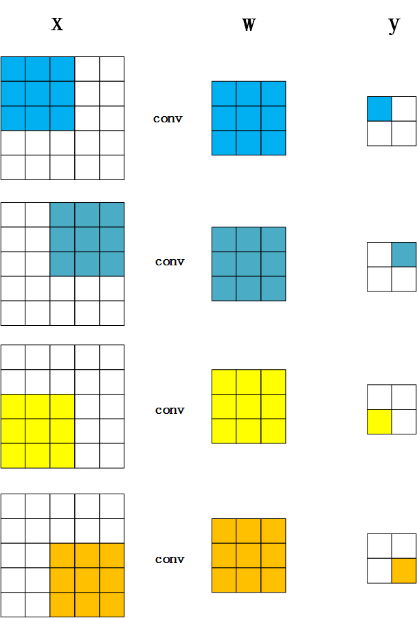

cnnlConvolutionBackwardFilter过程如下图，根据链式求导法则，成本函数对卷积滤波器的梯度diff_w等于成本函数对卷积输出梯度diff_y与卷积输入x-对应位置的乘加。

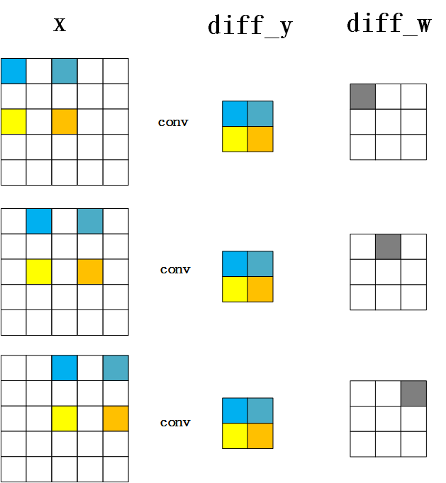

cnnlQuantizeConvolutionBackwardFilter
----------------------------------------

计算卷积滤波器的梯度。运算详情见 :ref:`cnnlConvolutionBackwardFilter` 。该接口与 :ref:`cnnlConvolutionBackwardFilter` 在支持的特性上有所区别。详情请参考《Cambricon CNNL Developer Guide》。

cnnlCopy
---------

对数据块进行设备到设备的拷贝。

cnnlCopySign
----------------

用一个张量的数值和另一个张量的符号来创造一个新的张量。

.. math::

   output_{i} =
   \left\{\begin{matrix}
   -|input_{i}| \quad other_{i} \le -0.0 \\|input_{i}| \quad other_{i} \ge 0.0
   \end{matrix}\right.

其中 ``i`` 表示一个张量的索引，:math:`output_{i}` 表示新生成的张量中 ``i`` 索引处的元素值， :math:`input_{i}` 表示输入张量中 ``i`` 索引处的元素值，该值为copysign算子提供数值。:math:`other_{i}` 表示另一个输入张量中 ``i`` 索引处的元素值，该值为copysign算子提供符号。

cnnlCos
---------

计算张量的余弦。

公式如下：

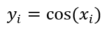

其中 ``xi`` 表示输入张量，``yi`` 表示输出张量。

cnnlCosineSimilarity
----------------------

计算两个向量夹角余弦值来评估两向量的相似度。
公式如下:

.. math::
   \begin{aligned}
   \text{similarity} &= \frac{A \cdot B} {\max(\Vert A \Vert \cdot \Vert B \Vert, \epsilon)}\\
   &= \frac{\sum_{i=1}^n{A_i \times B_i}} {\max(\sqrt{\sum_{i=1}^n(A_i)^2} \times \sqrt{\sum_{i=1}^n(B_i)^2}, \epsilon)}
   \end{aligned}

其中

- :math:`\epsilon` 是为了避免分母为0。
- ``cos_dim`` 表示cosine_similarity计算的维度。

cnnlCropAndResize
-------------------

从输入图像中裁剪并对裁剪后的图像进行缩放。对裁剪的图像进行resize操作时支持的插值方式为最邻近插值（nearest_neighbor interpolation）和双线性插值（bilinear interpolation）。计算过程如下图所示：

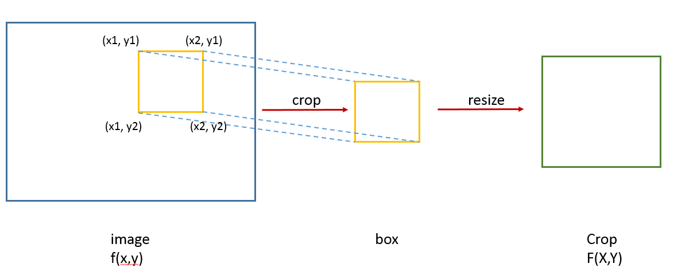

首先对于输入图像，根据box信息从中裁剪一部分，再根据最终输出图像的shape信息对截取的图像进行放缩。该放缩可通过mode参数选择使用最邻近插值或者双线性插值。需要注意的是，box的四角坐标为实际在image中坐标normalize到[0,1]之间后的值。

设(X, Y)为输出图像crop的坐标，:math:`(x_{float}, y_{float})` 为crop在输入image中的对应点精确坐标（float类型，实际计算时需要取整），f(x,y)为该点在image中的像素值, 则(x, y)与（X, Y)有如下对应关系：

.. math::

   \begin{aligned}
   x_{float} = x_1 \cdot \left(image\_filter - 1\right) + filter\_scale \cdot X    \\
   y_{float} = y_1 \cdot \left(image\_height - 1\right) + height\_scale \cdot Y
   \end{aligned}

.. math::

   \begin{aligned}
   filter\_scale = (x_2 - x_1) \cdot \frac{image\_filter - 1}{crop\_filter - 1}   \\
   height\_scale = (y_2 - y_1) \cdot \frac{image\_height - 1}{crop\_height - 1}
   \end{aligned}

设F(X,Y)为点(X, Y)在crop中的像素值，f(x, y)为 :math:`(x_{float},y_{float})` 取整后点在image中的像素值，则在以下两种模式下的公式为：

- 最邻近插值（if mode == Nearest）

  .. math::

     \begin{aligned}
       F(X,Y) = f(x,y)
     \end{aligned}

  其中：

  .. math::

     \begin{aligned}
     x = round(x_{float})   \\
     y = round(y_{float})
     \end{aligned}

- 双线性插值（if mode == Bilinear）

  .. math::

     \begin{aligned}
       F(X,Y) = (1-u)(1-v)f(x,y) + u(1-v)f(x+1,y) + (1-u)vf(x,y+1) + uvf(x+1,y+1)
     \end{aligned}

  其中：

  .. math::

     \begin{aligned}
     x = floor(x_{float})   \\
     y = floor(y_{float})
     \end{aligned}

  系数u、v的计算如下所示：

  .. math::

     \begin{aligned}
     u = x - x_{float}   \\
     v = y - y_{float}
     \end{aligned}

cnnlCropAndResizeBackwardBoxes
-----------------------------------

求解Boxes相对于输入图像的反向梯度。

cnnlCropAndResizeBackwardImage
-----------------------------------

根据输入crop的梯度，计算对image的梯度。计算过程如下图所示：

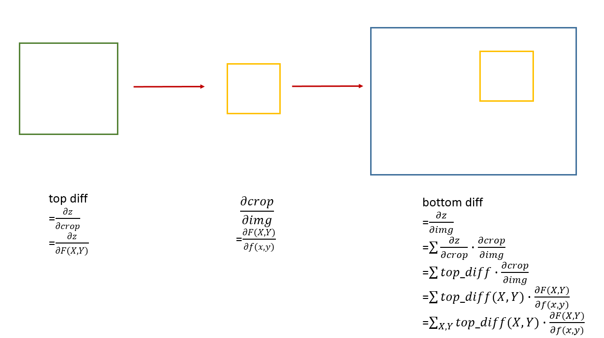

对于给定的top_diff, 输出bottom_diff的计算公式如下：

.. math::

   bottom\_diff(x,y) = \sum_{X,Y} top\_diff(X,Y)\cdot\frac{\partial F(X,Y)}{\partial f(x,y)}

其中：

- :math:`top\_{diff}(X,Y)` 为反向传播时上一层传入的(X,Y)位置的梯度。
- F(X,Y)为点(X, Y)在crop中的像素值，f(x, y)为点(x, y)在image中的像素值。
- :math:`bottom\_{diff}(x, y)` 为本层输出的梯度。

cnnlCTCLoss
-----------------

CTC（Connectionist Temporal Classification）是一种端到端的RNN训练法，该算法无需事先标注输入与输出序列的映射关系，实现了RNN对序列数据的直接学习，使得RNN模型在语音识别等序列学习任务中取得更好的效果。

该算法在图像和语音识别等领域均有比较广泛的应用，总的来说，其核心思路主要分为以下几部分：

- 展了RNN的输出层，在输出序列和最终标签之间增加了多对一的空间映射，并在此基础上定义了CTC Loss函数。
- 它借鉴了HMM（Hidden Markov Model）的Forward-Backward算法思路，利用动态规划算法有效地计算CTC Loss函数及其导数，从而解决了RNN端到端训练的问题。
- 结合CTC Decoding算法RNN可以有效地对序列数据进行端到端的预测。

CTC Loss算子的主要功能为根据输入的序列和标签数据，计算每个batch的loss值，并计算梯度值grads。其突出贡献为空字符的引入。
公式如下：

前向概率 :math:`\alpha_{t}(s)` 的公式为：

.. math::

   \begin{aligned}
   \alpha_{t}(s) &= (\alpha_{t-1}(s) + \alpha_{t-1}(s-1)) \cdot y_{l'(s)}^t,\ \ \ if\ seq'(s) == seq'(s - 2)\ or\ seq'(s) == "-"\\
   \alpha_{t}(s) &= (\alpha_{t-1}(s) + \alpha_{t-1}(s-1) + \alpha_{t-1}(s-2)) \cdot y_{seq'(s)}^t,\ \ \ otherwise
   \end{aligned}

初始有：

.. math::

   \begin{aligned}
   &\alpha_{1}(1) = y_{-}^1 \\
   &\alpha_{1}(2) = y_{seq'(2)}^1 \\
   &\alpha_{1}(s) = y_{seq'(s)}^1 = 0,\ \forall s > 2
   \end{aligned}

已知label'的结尾字符只有两种情况，即要么为空字符“-”，要么为非空字符，且T时刻的前向概率已包括T时刻之前的所有前缀子节点概率，因此最终CTCLoss可以仅使用T时刻的前向概率得到：

.. math::

   \begin{aligned}
   CTCLoss = -ln(p(l|x)) = -ln(\alpha_{T}(S) + \alpha_{T}(S - 1))
   \end{aligned}

其中，S为已标准化处理的label'的长度。

由于t时刻第s个符号的 :math:`\alpha_{t}(s)` 可根据前一时刻的 :math:`\alpha` 值得出，根据正向传播公式，可从t=1时刻开始计算，直至求出T时刻的 :math:`\alpha` 值，此时可根据上述计算公式得到最终loss值。

cnnlComplexAbs
---------------

计算输入复数张量的模。其计算公式如下：

.. math::

   \begin{aligned}
   x\_i = a\_i + b\_i j \\
   y\_i = \sqrt{a\_i^2 + b\_i^2}
   \end{aligned}

其中:

- ``xi`` 表示输入张量，``yi`` 表示输出张量。
- ``a`` 为复数的实数部分。
- ``b`` 为复数的虚数部分。
- ``j`` 为虚数单位。

cnnlCumsum
------------

根据输入的axis进行求前缀和。示例如下：

例如输入数二维数组：

::

  a=[[1, 2, 3],
  [1, 2, 3]]，
  cumsum(a,axis=0) = [[1, 3, 6],
  [1, 3, 6]];
  cumsum(a,axis=1) = [[1, 2, 3],
  [2, 4, 6]]

对于Cambricon CNNL中的cumsum需要支持8个维度可以设为dim0、dim1、dim2、dim3、dim4、dim5、dim6、dim7 在公式中为了简洁表达用 I、J、K、M、N、O、P、R代替：

.. math::

   Y_{( I,J,K,M,N,O,P,R)}=Cumsum(X_{( I,J,K,M,N,O,P,R)},axis{(0)})
   \begin{aligned}
   y_{(i,j,k,m,n,o,p,r)}=\sum_{k=0}^{i}x_{(k,j,k,m,n,o,p,r)}
   \end{aligned} {i}\in {I}

其中：

- I、J、K、M、N、O、P、R表示输入张量 x 各维度的大小。
- axis 表示需要进行前缀求和的维度。
- i 表示需要进行求前缀和维度I的遍历。
- k 为从0到i的遍历。
- Y为输出。

cnnlCumprod
------------

根据输入的axis进行求前缀积。计算公式如下：

.. math::

   Y_{( I,J,K,M,N,O,P,R)}=Cumprod(X_{( I,J,K,M,N,O,P,R)},axis{(0)})

假设输入是一个包含8个维度的张量，则输出也是一个包含8个维度的张量：

.. math::

   y_{(i,j,k,m,n,o,p,r)}=\prod_{l=0}^{i}x_{(l,j,k,m,n,o,p,r)}{i}\in {I}

其中：

- ``I、J、K、M、N、O、P、R`` 表示输入张量 x 各维度的大小。
- ``axis`` 表示需要进行前缀求积的维度。
- ``i`` 表示需要进行求前缀积维度I的遍历。
- ``l`` 为从0到i的遍历。
- ``Y`` 为输出。

cnnlCustomizedActiveForward
--------------------------------

激活函数。

公式如下：

.. math::

   y = active\_func(x)

其中：

- ``y`` 表示输出张量。
- ``x`` 表示输入张量。
- ``active_func`` 表示自定义激活函数。

cnnlCycleOp
-------------

对位循环操作。支持的操作有：加法、减法、乘法。

公式如下：

公式中 ``output`` 表示输出张量，``input1`` 和 ``input2`` 表示输入张量。

循环加公式如下：

.. math::

   output[n\ c\ h\ w] = input1[n\ c\ h\ w] + input2[1\ c\ 1\ 1]

循环减公式如下：

.. math::

   output[n\ c\ h\ w] = input1[n\ c\ h\ w] - input2[1\ c\ 1\ 1]

循环乘公式如下：

.. math::

   output[n\ c\ h\ w] = input1[n\ c\ h\ w] * input2[1\ c\ 1\ 1]

cnnlDCNForward
--------------------

可变形卷积。通过额外的offset和mask来增强滤波器对空间的几何表达能力，并且该卷积可以任意替代之前卷积网络里面的任意常规卷积层。

对于输出图像的每一个像素点 :math:`p_0`，公式如下：

.. math::

   \begin{aligned}
   &\large y(p_0)=\sum_{p_n\in\Re} w(p_n) \cdot x(p_0+p_n+\Delta p_n)
   \end{aligned}

其中：

- :math:`p_n` 是感受野关于位置。
- :math:`p_0` 的相对偏移。
- :math:`\Delta p_n` 为相对偏移量offset。
- :math:`R` 为感受野的大小。
- w为滤波器。
- x为输入。

如果使用mask调节滤波器在卷到不同位置的时候的注意力，即在滤波器的每个位置增加了滤波器变量mask，相当于滤波器的每个方块具有一定的滤波器。公式如下：

.. math::

   \begin{aligned}
   &\large y(p_0)=\sum_{p_n\in\Re} w(p_n) \cdot x(p_0+p_n+\Delta p_n) \cdot \Delta m_n
   \end{aligned}

上述公式中 :math:`\Delta m_n` 为滤波器变量mask。

cnnlDCNBackwardData
--------------------

求取可变形卷积算子关于input、offset、mask的反向梯度。

cnnlDCNBackwardWeight
------------------------

求取可变形卷积算子关于filter和bias的反向梯度。

cnnlDeconvolution
--------------------

3D反卷积操作，又称3D转置卷积。该算子根据输入(input)、滤波器(filter)、滤波器膨胀(dilation)、步长(stride)、填充(padding)等来计算输出特征层的大小或者通过 ``output_size`` 指定输出特征层大小。输入(input)和输出(output)为NDHWC格式。其中 ``N`` 为batchsize，``D`` 为特征深度，H为特征高度，``W`` 为特征宽度，``C`` 为通道数(Channel)。如果 ``bias`` 项存在，那么该算子计算还会增加偏置项。
计算公式如下：

.. math::

   dX_{i_n, i_c, i_d, i_h, i_w} = \sum_{0\leq j_c <c_o,j_d * s_d \leq i_d <j_d * s_d + k_d, j_h * s_h \leq i_h < j_h * s_h + k_h, j_w * s_w \leq < i_w < j_w * s_w + k_w}dY_{i_n, j_c, j_d, j_h, j_w} * K_{j_c, i_c, i_d, i_h, i_w} + b'

其中：

- ``dY`` 表示输入input tensor。
- ``dX`` 表示输出output tensor。
- ``b'`` 表示偏置。

下面示例展示了算子的输入输出对应关系：

输入：

.. math::

   inputTensor:[N_i,D_i,H_i,W_i,C_i]

.. math::

   inputFilter:[C_i,C_o,K_d,K_h,K_w]

.. math::

   stride: D_s, H_s, W_s

.. math::

   dilation: D_d, H_d, W_d

.. math::

   padding: D_{p1}, D_{p2}, H_{p1}, H_{p2}, W_{p1}, W_{p2}

.. math::

   outputpadding: D_{op}, H_{op}, W_{op}

输出：

.. math::

   outputTensor:[N_o,D_o,H_o,W_o,C_o]

其中：

.. math::

   D_o = (D_i - 1) * D_s - D_{p1} - D_{p2} + D_d *(K_d - 1) + 1 + D_{op}

.. math::

   H_o = (H_i - 1) * H_s - H_{p1} - H_{p2} + H_d *(K_h - 1) + 1 + H_{op}

.. math::

   W_o = (W_i - 1) * W_s - W_{p1} - H_{p2} + W_d *(K_w - 1) + 1 + W_{op}

.. math::

   D_{op} \in [0,D_s]

.. math::

   H_{op} \in [0,H_s]

.. math::

   W_{op} \in [0,W_s]

cnnlDeformRoiPoolBackward
--------------------------

cnnlDeformRoiPoolForward的反向算子。根据输出的梯度、输入特征图、ROI框的位置和offset值，计算输入特征图和offset的梯度。

cnnlDeformRoiPoolForward
------------------------------

对输入的可形变的感兴趣区域进行池化。该池化过程如下：

1. 将任意尺寸的候选区域转换为固定尺寸的特征图。假设输入特征图为 ``x``，roi为 w * h大小且左上角点为p0的区域，ROI Pooling将把ROI区域分为k*k个bins，输出y为k * k大小的特征图。对于第(i, j)个格子(0 <= i,j < k)，其计算公式:

.. math::

   y(i,j) = \frac{1}{n_{ij}} * \sum_{p\in bin(i,j)} x(p0 + p)

其中 :math:`n_{ij}` 表示 ``bin`` 中采样像素的个数，:math:`bin(i,j)` 解释为 :math:`\lfloor i\frac{w}{k}\rfloor\leq p_x < \lceil (i+1)\frac{w}{k} \rceil`
， :math:`\lfloor j\frac{h}{k}\rfloor\leq p_y < \lceil (j+1)\frac{h}{k} \rceil` 。

2. 在ROI Pooling的基础之上对k*k个bins中的每一个bin都对应添加一个偏移量 :math:`\{\triangle p_{i,j}|0\leq i,j<k \}` ，使得每个bin产生位置修正。

.. math::

   y(i,j) = \frac{1}{n_{ij}}*\sum_{p\in bin(i,j)} x(p0 + p + \triangle p_{i,j})\\
   \triangle p_{i,j} = \gamma * \triangle \hat p_{i,j} \circ(w,h)

其中 :math:`\triangle \hat p_{i,j}` 是通过全连接层获得的归一化偏移量；:math:`\triangle p_{i,j}` 是一个分数；:math:`\gamma` 是预先设定的标量。

cnnlDet
---------------

对于n阶方阵 :math:`A = (a_{i,j})` ，其行列式定义为：

.. math::

   det(A) = \sum_{j_1j_2...j_n}(-1)^{\tau(j_1j_2...j_n)}a_{1,j_1}a_{2,j_2}...a_{n,j_n}

其中，:math:`j_1j_2...j_n` 表示 :math:`1,2,...,n` 的一个排列，:math:`\sum_{j_1j_2...j_n}` 表示对所有排列求和，:math:`\tau(j_1j_2...j_n)` 表示排列 :math:`j_1j_2...j_n` 的逆序数。

显然，:math:`1,2,...,n` 共有 :math:`n!` 种排列，即 :math:`det(A)` 由 :math:`n!` 项组成。

cnnlDiag
----------

根据输入向量得到对角矩阵或取得输入矩阵的对角向量。

输入是两个部分，分别为输入数据，以及确定相应对角线的整型参数k。输出是一个张量，是根据下面描述的计算过程得到的一维或二维张量。

- 如果k为0，即使用默认值，返回以输入的一维张量作为主对角线，其余位置置零的二维张量，或输入的二维张量的主对角线。
- 如果k大于0，返回以输入的一维张量作为主对角线上第 k 个对角线，其余位置置零的二维张量，或输入的二维张量的主对角线上第 k 个对角线。
- 如果k小于0，返回以输入的一维张量作为主对角线下第 :math:`|k|` 个对角线，其余位置置零的二维张量，或输入的二维张量的主对角线下第 :math:`|k|` 个对角线。

输入张量 input 是一维 (L) 时，输出张量 output 是二维 (X,Y)，结果为：

.. math::

   output[x][y] = \begin{cases}input[y],\quad y < L \quad and \quad k >= 0 \\\\ input[x],\quad x < L \quad  and \quad  k < 0 \\\\ 0,\quad otherwise\end{cases}

输入张量 input 是二维 (X,Y) 时，输出张量 output 是一维 (L)，结果为：

.. math::

   output[l] = \begin{cases}input[l+k][l],\quad k >= 0 \\\\ input[l][l-k],\quad k < 0\end{cases}

cnnlDiagonal
------------------

获取高维输入张量指定平面的指定对角线。输出以对角线为最低维，其余维度按序展开。

对于input为N维M阶张量的元素 a ，输出output中的元素 b 结果为：

.. math::

   b_{\underbrace{i,j,k,\ldots,n}_{N-1}} = a_{\underbrace{i,\overset{dim1}{n},j,\overset{dim2}{n},\ldots,k}_{N}}\quad ,\quad (i,j,k,n=0,\ldots,M-1)

cnnlDiagPart
------------------

根据给定对角线坐标范围获取输入矩阵的对角线元素，并根据对齐参数进行对齐到最长对角线的padding_value元素填充操作，得到一组等大对角线作为输出。

cnnlDiv
---------

两个输入张量相除，得到输出结果。

公式如下：

.. math::

   z_i = x_i / y_i

其中：

- ``i`` 表示一个多维数组的索引, 表示多维张量, 例如在4维时可以表示(n,c,h,w)。
- ``xi``、``yi``、``zi`` 表示多维数组中 ``i`` 索引处的元素。

cnnlDivNoNan
--------------

两个输入相除，得到输出结果。其中，当除数为0时，返回0。

公式如下：

.. math::

   z_i =
   \begin{cases} \frac{x_i}{y_i}, & y_i \neq 0 \\ 0, & y_i = 0 \end{cases}

其中：

- ``i`` 表示一个多维数组的索引, 表示多维张量, 例如在4维时可以表示(n,c,h,w)。
- ``xi``、``yi``、``zi`` 表示多维数组中 ``i`` 索引处的元素。
- 当 ``yi`` 等于0时，返回 ``zi`` 等于0。

cnnlDynamicStitch
-------------------

将输入的多个张量的值交错成一个张量，建立一个合并张量。

算子计算逻辑如下：

1. 遍历索引张量中的数值，找出最大值。输出张量的最高维度的大小为最大值加1。
2. 数据张量和索引张量的维度需要满足一定约束，索引张量的维度是数据张量维度的前缀。
3. 根据索引张量中的索引值，将数据张量中对应的数据按顺序组成输出。

计算公式如下：

.. math::

   merged[indices[m][i, ..., j], ...] =data[m][i, ..., j]

其中：

- ``data`` 表示数据张量列表。
- ``indices`` 表示索引张量列表。
- ``merged`` 为输出张量。
- ``m`` 为索引张量列表索引。
- ``i`` 和 ``j`` 表示张量中元素的索引。

cnnlEmbeddingForward
------------------------------

根据字典将单词映射成低维连续向量的分布式表示，可以更好地对语义进行建模，在大量文本处理相关的网络中使用。

输入 filter 规模为 [num_words, embedding_dim]，indices 规模为 [X, Y]，摆数方式为 NCHW 时，输出为 [X, Y, embedding_dim]，结果为：

.. math::

   output[x, y, :] = filter[indices[x, y], :]

cnnlEmbeddingBackward
------------------------

接收传入的一批词向量的梯度值，将它们累加到一个零初值的总梯度张量中，然后返回该总梯度张量。

公式如下：

::

   // 输出先赋值0。
     auto grad_filter = at::zeros({num_filters, grad_.size(-1)}, grad_.options());
     // 统计indices出现的次数。
     // num_filters : 是正向embedding的滤波器的第0维的大小。
     // numel : 输入indices的个数。
     std::unique_ptr<int64_t[]> counts;
     if (scale_grad_by_freq) {
       counts.reset(new int64_t[num_filters]);
       for (int i = 0; i < numel; i++) {
         counts[indices_data[i]] = 0;
       }
       for (int i = 0; i < numel; i++) {
         counts[indices_data[i]]++;
       }
     }
     // 输出grad_filter确定形状，和置0。
     auto grad = grad_.contiguous().view({numel, grad_.size(-1)});
     auto grad_filter = at::zeros({num_filters, grad_.size(-1)}, grad_.options());

     // 更新grad_filter：
     for (int64_t i = 0; i < numel; i++) {
       if (indices_data[i] != padding_idx) {
         int64_t k = indices_data[i];
         double scale = 1.0;
         if (scale_grad_by_freq) {
           scale /= counts[k];
         }
         grad_filter[k].add_(grad[i], scale);
       }
     }

cnnlEmbeddingBag
-----------------

根据字典将单词映射成低维连续向量，然后分成多个bag, 对bag内的向量进行求和、取最大或者取平均数。

cnnlErf
---------

Erf（Error Function，误差函数或高斯误差函数）是高斯概率密度函数的积分。

计算公式如下：

.. math::

   erf(x)=\frac{2}{\sqrt{\pi}}\int_{0}^{x}{e^{-t^2}}dt

cnnlExpand
--------------

应用于各种需要广播的场景，实现张量的维度扩展。根据输入输出的维度，将输入数据复制并扩充成输出维度。

示例如下，假设x和shape为输入，y为输出：

::

  输入x:
  tensor([[[1, 2]],
          [[3, 4]]])
  输入shape：
  (2,2,2)
  输出y：
  tensor([[[1, 2],
           [1, 2]],
          [[3, 4],
           [3, 4]]])

cnnlExp
-----------

计算自然对数的底数的指数函数。即对输入的每一个值做以e为底的指数函数运算。

公式如下：

.. math::

   y_i= e^{x_i}

其中：

- ``i`` 表示一个多元组的索引, 表示多维张量, 例如在4维时可以表示(n,c,h,w)。
- ``xi`` 和 ``yi`` 表示多元组中 ``i`` 索引处的元素。

cnnlExecFFT
-----------

对一个长度为N的实数数列进行傅里叶变换。

计算公式如下：

.. math::

   y = DFT_{N} x

其中：

- ``x`` 为输入信号。
- ``y`` 为输出信号。
- :math:`DFT_{N}` 为长度为N傅里叶变换的变换矩阵。

cnnlFill
-----------

创建一个所有元素都设置为value的张量，不支持广播。给定一个张量 tensor，以及值为value的Scale标量，该操作会返回一个所有元素设置为value的tensor对象，其与输入tensor具有相同的类型和形状。

cnnlFlip
------------

对输入数据按给定维度反转。在图像处理任务中，通过该算子对图像进行反转，可实现数据增强。

示例如下：

::

   x = [[[0, 1], [2, 3]],
        [[4, 5], [6, 7]]]

   dims = [0]
   y = flip(x,dims)
     = [[[4, 5], [6, 7]],
        [[0, 1], [2, 3]]]

   dims = [2]
   y = flip(x,dims)
     = [[[1, 0], [3, 2]],
        [[5, 4], [7, 6]]]

   dims = [0, 1]
   y = flip(x, dims)
     = flip(x, dims[0]).flip(x, dims[1])
     = [[[6, 7], [4, 5]],
       [[2, 3], [0, 1]]]

   dims = [0, 1, 2]
   y = flip(x, dims)
     = flip(x, dims[0]).flip(x, dims[1]).flip(x, dims[2]);
     = [[[7, 6], [5, 4]],
        [[3, 2], [1, 0]]]

cnnlFloor
-----------

计算输入的下取整，逐元素的返回不超过该数据的最大整数。

公式如下：

.. math::

   y_i = \lfloor{x_i}\rfloor

其中：

- ``i`` 表示一个多维数组的索引，例如在4维时可以表示 (n,c,h,w)。
- :math:`x_i`、:math:`y_i` 表示多元组中 i 索引处的元素。

cnnlFloorDiv
---------------

针对浮点数的除法向下取整。

公式如下：

.. math::

   output_i = \lfloor{\frac{input1_i}{input2_i}}\rfloor

其中：

- ``i`` 表示一个多维数组的索引，表示多维张量， 例如在4维时可以表示(n,c,h,w)。
- :math:`input1\_i`、:math:`input2\_i`、:math:`output\_i` 表示多维数组中 ``i`` 索引处的元素。

cnnlFloorDivTrunc
--------------------

实现对input1与input2相除的结果做向零舍入操作，正数返回不大于（input1/input2）的最大整数，负数返回不小于（input1/input2）的最小整数。。

公式如下：

.. math::

   output = trunc(input1/input2)

cnnlFloorMod
---------------

返回除法元素的余数，支持广播。与FloorModTrunc不同，该算子对负数取余数部分为向下取整。

公式如下：

.. math::

   output_i = input1_i - \lfloor{\frac{input1_i}{input2_i}}\rfloor * input2_i

其中：

- ``i`` 表示一个多维数组的索引，表示多维张量， 例如在4维时可以表示(n,c,h,w)。
- :math:`input1\_i`、:math:`input2\_i`、:math:`output\_i` 表示多维数组中 ``i`` 索引处的元素。

cnnlFloorModPro
-----------------

实现了输入数据之间的求余操作，并对输入为负数和非负数的情况作了区分处理。

计算公式如下：

.. math::

   \begin{array}{lcl}
   trunc\_mod =input_1 - \bigg \lfloor \frac{input_1}{input_2} \bigg \rfloor \times input_2 \\
   output =
   \begin{cases}
   trunc\_mod     & if\ input_1<0\ and \ input_2<0 \\
   trunc\_mod+input_2-\bigg\lfloor\frac{trunc\_mod+input_2}{input_2}\bigg\rfloor\times input_2    & else \\
   \end{cases}
   \end{array}

FloorModTrunc
------------------

返回除法元素的余数，支持广播。与cnnlFloorMod不同，该算子对负数取余数部分为向0取整。公式如下：

.. math::

   output_i = input1_i - \lfloor{\frac{input1_i}{input2_i}}\rfloor * input2_i

cnnlFocalLossSigmoidBackward
--------------------------------------

给定输入数据（input）、对应标签值（target）、平衡因子（alpha)、调节因子（gamma)，滤波器数据（filter），输出梯度数据（grad_output），计算输入数据的梯度值（grad_input)。

公式如下：

.. math::

   FL^{'} =
   \begin{cases}
   -\alpha*(1-p)^\gamma*(1-p-\gamma*p*log(p)) & target[n]=c \\
   -(1-\alpha)*p^\gamma*(\gamma*(1-p)*log(1-p)-p) & otherwise
   \end{cases}

如果存在filter输入，则需乘以filter。最后再乘以grad_output，得到算子最终的输出grad_input：

.. math::

   \begin{array}{lcl}
   grad\_input = \\ FL^{'} *filter* grad\_output = \\
   \begin{cases}
   -\alpha*(1-p)^\gamma*(1-p-\gamma*p*log(p))*filter[target[n]]*grad\_ouput & target[n]=c \\
   -(1-\alpha)*p^\gamma*(\gamma*(1-p)*log(1-p)-p)*filter[target[n]]*grad\_output & otherwise
   \end{cases}
   \end{array}

cnnlFocalLossSigmoidForward
--------------------------------------

在cnnlBceLoss算子的基础上增加了滤波器系数alpha和聚焦系数gamma，其目的是通过减少易分类样本的滤波器，从而使得模型在训练时更专注于难分类的样本。

公式如下：

.. math::

   FL =
   \begin{cases}
   -\alpha (1-p)^\gamma log(p),  & target=1 \\
   -(1-\alpha) p^\gamma log(1-p), & otherwise
   \end{cases}

此外，在上面公式基础上支持第三方MMCV算子，增加了参数filter：

.. math::

   FL_{i,j} = FL_{i,j}*filter_t　
   \\
   \begin{aligned}
   s.t　& i=1,2,...,N \\
        & j=1,2,...,C \\
        & t=target_i
   \end{aligned}

其中：

- ``p`` 表示input通过 ``Sigmoid`` 函数计算所得的概率值。
- ``alpha`` 表示平衡因子。
- ``gamma`` 表示调节因子。

cnnlFrozenBatchNormBackward
-------------------------------

是BatchNorm Inference对应的反向算子，计算损失函数在 x, filter, bias 处的梯度，用于 F-RCNN 系列网络训练的fine tuning阶段。

公式如下：

.. math::

   dx_{n,h,w,c} & = \frac{\partial{L}}{\partial{x_{n,h,w,c}}} = \frac{\partial{L}}{\partial{y_{n,h,w,c}}} * \frac{\partial{y_{n,h,w,c}}}{\partial{x_{n,h,w,c}}} = \frac{\gamma_c}{\sqrt{\sigma^2_c+\epsilon}} * dy_{n,h,w,c} \\
   d\gamma_c & = \frac{\partial{L}}{\partial{\gamma_c}} = \sum_{n,h,w}\frac{\partial{L}}{\partial{y_{n,h,w,c}}}\frac{\partial{y_{n,h,w,c}}}{\partial{\gamma_c}}
   = \frac{1}{\sqrt{\sigma^2_c+\epsilon}} * \sum_{n,h,w}({x_{n,h,w,c}-\mu_c}) * dy_{n,h,w,c} \\
   d\beta_c & = \frac{\partial{L}}{\partial{\beta_c}} = \sum_{n,h,w}\frac{\partial{L}}{\partial{y_{n,h,w,c}}}\frac{\partial{y_{n,h,w,c}}}{\partial{\beta_c}}
   = \sum_{n,h,w}dy_{n,h,w,c} \\

其中：

- :math:`x_{n,h,w,c}` 是列表中张量 x 索引为 :math:`(n,h,w,c)` 的元素。
- :math:`dy_{n,h,w,c}` 是列表中张量 diff_y 索引为 :math:`(n,h,w,c)` 的元素。
- :math:`\gamma_c` 是列表中张量 filter 索引为 :math:`c` 的元素。
- :math:`\mu_c` 是列表中张量 pop_mean 索引为 :math:`c` 的元素。
- :math:`\sigma_c^2` 是列表中张量 pop_var 索引为 :math:`c` 的元素。
- :math:`\epsilon` 是列表中的 eps。
- :math:`dx_{n,h,w,c}` 是列表中张量 diff_x 索引为 :math:`(n,h,w,c)` 的元素。
- :math:`d\gamma_c` 是列表中张量 diff_filter 索引为 :math:`c` 的元素。
- :math:`d\beta_c` 是列表中张量 diff_bias 索引为 :math:`c` 的元素。

cnnlFusedDropout
-------------------------------

Dropout算子是一种预防CNN过拟合的正则化方法。Dropout的工作原理为在一次训练迭代中，对每一层的输入以概率P随机剔除，用余下的输入所构成的网络来训练本次迭代中的数据。Dropout的直接作用是减少中间特征的数量，从而减少冗余，即增加每层各个特征间的正交性。cnnlFusedDropout实现了Dropout算法的功能，并在输出中同时提供了输入元素的失活状态和失活后的结果输出。

公式如下：

.. math::

   mask = rand.x < p \\
   output = input * \frac{1}{p} \\

其中：

- 公式中 ``input`` 是输入数据。
- 公式中 ``mask`` 是输入数据当前是否被置零的状态。
- 公式中 ``p`` 是输入数据中每一个元素是否被置零的概率。
- 公式中 ``output`` 是输入数据经过置零后的输出结果。

cnnlGather
------------

沿着给定的维度的轴，将输入张量按照索引index指定的位置聚合。Gather是Scatter的反向实现。

计算公式如下：

::

   output[i][j][m][n] = input[index[i][j][m][n]]  [j]  [m]  [n]   # if dim == 0
   output[i][j][m][n] = input[i]  [index[i][j][m][n]]  [m]  [n]   # if dim == 1
   output[i][j][m][n] = input[i]  [j]  [index[i][j][m][n]]  [n]   # if dim == 2
   output[i][j][m][n] = input[i]  [j]  [m]  [index[i][j][m][n]]   # if dim == 3

cnnlGatherNd
--------------

用于输入数据的抽取后聚集，即将一个张量根据其indices抽取其中部分数据，最后将抽取出的数据聚合为一个输出张量，是ScatterNd的逆运算。

与Gather算子的区别是，GatherNd算子可以按照从高维开始以多维坐标的索引方式抽取，而Gather算子只能按照一维方式索引抽取。

设输入为 ``params``，index为 ``indices``，输出为output。
其中 ``indices`` 的最后一维是坐标，其他维的乘积则代表坐标的个数N，每一个坐标值（x,y,z...）映射到输入数据的高维，通过坐标要抽取的数据可称为是输入数据的低维，
最后将抽取的N个数据块聚合为输出张量。则output的shape应满足如下公式如下：

.. math::

   indices.shape[:-1] + params.shape[indices.shape[-1]:]

cnnlGatherTree
--------------

用于seq2seq中beam search的后处理。该算子在 Beam search结束后，根据每个时间步选择的 ``step_ids`` 、搜索树中对应的的parent节点 ``parent_ids`` 以及每个batch中的最大序列长度 ``max_sequence_lengths`` ，从最后一个时间步回溯完整的id序列。

cnnlGatherV2
--------------

根据索引(indices)从参数轴(axis)上收集切片数据(params)。

cnnlGradientDescent
---------------------

一种常见的基于梯度下降的优化算法，随机下降算法的实现，完成网络参数的更新。

公式如下：

.. math::

   var -= lr * grad

其中 ``var`` 为网络滤波器，``lr`` 为学习率，``grad`` 为梯度值。

cnnlGrep
----------

截取一小段张量，如果超出原始张量的限制则做特定补充。

cnnlGridSampleForward
----------------------

根据给定的输入input、流场grid和插值模式mode，使用grid中提供的像素位置信息以及input中对应的像素值来计算输出。

首先，计算输出点在input中的坐标。分两种情况：

一种是 ``align_corners`` 为真的情况，公式如下：

.. math::

   \begin{array}{lcl}
   x_i = (grid\_x_i + 1.0) / 2 \times (width - 1) \\
   y_i = (grid\_y_i + 1.0) / 2 \times (height - 1) \\
   \end{array}

另一种是 ``align_corners`` 为假的情况，公式如下：

.. math::

   \begin{array}{lcl}
   x_i = ((grid\_x_i + 1.0) \times width - 1) / 2 \\
   y_i = ((grid\_y_i + 1.0) \times height - 1) / 2 \\
   \end{array}

其次，根据坐标的相邻四点计算权重，并根据权重计算出最终结果，公式如下：

.. math::

   \begin{array}{lcl}
   x\_nw_i = floor(x_i) \\
   y\_nw_i = floor(y_i) \\
   x\_ne_i =  x\_nw_i + 1 \\
   y\_ne_i =  y\_nw_i \\
   x\_sw_i =  x\_nw_i \\
   y\_sw_i = y\_nw_i + 1 \\
   x\_se_i = x\_ne_i \\
   y\_se_i = y\_sw_i \\
   weight\_nw_i = (x\_se_i - x_i) \times (y\_se_i - y_i) \\
   weight\_ne_i = (x_i - x\_sw_i) \times (y\_sw_i - y_i) \\
   weight\_sw_i = (x\_ne_i - x_i) \times (y_i - y\_ne_i) \\
   weight\_se_i = (x_i - x\_nw_i) \times (y_i - y\_nw_i) \\
   out_i = 0 \\
   out_i += input[width \times y\_nw_i + x\_nw_i] \times weight\_nw_i \\
   out_i += input[width \times y\_ne_i + x\_ne_i] \times weight\_ne_i \\
   out_i += input[width \times y\_sw_i + x\_sw_i] \times weight\_sw_i \\
   out_i += input[width \times y\_se_i + x\_se_i] \times weight\_se_i
   \end{array}

其中：

- ``x_nw/x_ne/x_sw/x_se`` 需要在 ``[0, width-1]`` 的区间内， ``y_nw/y_ne/y_sw/y_se`` 需要在 ``[0, height-1]`` 的区间内，才可以将 ``input`` 与 ``weight`` 相乘结果累加到 ``out_i`` 。
- ``input[]`` 为 输入 tensor 数据。
- ``grid_x/grid_y`` 为 输入流场 grid中[x,y] 映射到 input 的规约后的坐标值。
- ``width/height`` 为 input tensor 的宽度与高度值。
- ``out`` 为 输出值。
- ``i`` 为 输出 output 每个点的索引值。
- ``floor`` 为 浮点数向下取整数部分。
- ``nw/ne/sw/se`` 为 north/west/south/east 的缩写，表示相邻的四个点。

cnnlGridSampleBackward
----------------------

GridSampleForward的反向梯度计算，即根据给定的输入input、输入梯度值grad_output、流场grid和插值模式mode，使用grid中的像素位置信息，分别计算输入input和grid坐标的梯度。

公式如下：

.. math::

   \begin{array}{lcl}
   grad\_input[x0,y0] += u2 * v2 * grad\_output\_value \\
   grad\_input[x0+1,y0] += u1 * v2 * grad\_output\_value \\
   grad\_input[x0,y0+1] += u2 * v1 * grad\_output\_value \\
   grad\_input[x0+1,y0+1] += u1 * v1 * grad\_output\_value \\
   grad\_gridX = (-v2*f(0) + v2*f(1)-v1*f(2) + v1*f(3)) * scale\_factor\_w * grad\_output\_value \\
   grad\_gridY = (u2*f(0) u1*f(1) + u2*f(2) + u1*f(3)) * scale\_factor\_h * grad\_output\_value
   \end{array}

其中：

- 公式中 ``grad_input`` 为 输入 input 对应的梯度值。
- 公式中坐标 ``[x0,y0]`` 为 输入流场 grid中[x,y] 映射到 input 的坐标值，其他坐标类似。
- 公式中 ``grad_output_value`` 为 grad_output[x,y] 处的梯度值。
- 公式中 ``u1`` 为 grid[x,y]中x到x0的距离，即x-x0。
- 公式中 ``u2`` 为 grid[x,y]中x到x0+1的距离，即x0+1-x。
- 公式中 ``v1`` 为 grid[x,y]中y到y0的距离，即y-y0。
- 公式中 ``v2`` 为 grid[x,y]中y到y0+1的距离，即y0+1-y0。
- 公式中 ``f(0)`` 为 input[x0,y0]处的像素值。
- 公式中 ``f(1)`` 为 input[x0+1,y0]处的像素值。
- 公式中 ``f(2)`` 为 input[x0,y0+1]处的像素值。
- 公式中 ``f(3)`` 为 input[x0+1,y0+1]处的像素值。
- 公式中 ``scale_factor_w`` 为 grid中坐标映射到input坐标的缩放系数。
- 公式中 ``scale_factor_h`` 为 grid中坐标映射到input坐标的缩放系数。

cnnlGroupNormBackward
-----------------------------

cnnlGroupNormForward对应的反向算子，计算损失函数在 ``x``、``scale``、``bias`` 处的梯度，用于 ResNet 系列网络的训练。

公式如下：

.. math::

   \begin{array}{lcl}
   dx_i = \frac{\gamma_c}{\sqrt{\sigma^2_{ng}+\epsilon}}\Big(dz_i - \frac{d\beta_{nc}}{M} - y_i*\frac{d\gamma_{nc}}{M}\Big) \quad (M=H*W*C/G)\\
   d\gamma_c = \sum_{n}d\gamma_{nc} \\
   d\beta_c = \sum_{n}d\beta_{nc}
   \end{array}

其中：

- ``epsilon`` 是添加到方差中的较小的值，为保证数值稳定性（分母不能趋近或取0），默认为1e-5。
- ``H`` 是输入 ``x`` 的 ``height``，``W`` 是输入 ``x`` 的 ``weight``， ``C`` 输入 ``x`` 的 ``channel``，``G`` 是把 ``channel`` 分成的份数。
- :math:`dz_i` 是损失函数在正向过程输出的梯度。
- :math:`\gamma_c` 是可训练的比例参数。
- :math:`\beta_c` 是可训练的偏差参数。
- :math:`y_i` 是对 ``x`` 做标准化的结果。
- :math:`\gamma_{nc}` 和 :math:`\beta_{nc}` 分别是每个batch中各个通道的比例参数和偏差参数。
- :math:`dx_i` 是损失函数 ``L`` 在 ``x`` 处的梯度。
- :math:`\sigma^2` 是标准差。

cnnlGroupNormForward
----------------------

将batch中的单个样本的C个通道(特征图)抽出来一起求平均值和样本方差，与batch size无关。

当batch size小于16时，使用group normalization效果更好：

.. math::

    y = \gamma * \frac{x - mean}{\sqrt{var + eps}} + \beta

其中：

- 公式中 eps 是列表中的 eps。
- 公式中 mean 是列表中张量x的通道分组上的均值。
- 公式中 var 是列表中张量x的通道分组上的方差。
- 输入通道被分成group_num组，每个组包括C / group_num个通道。每组的均值和方差分开计算，:math:`\gamma` 和 :math:`\beta` 这两个可学习的通道仿射变换参数向量的大小为C，eps是保证数据稳定性的常量，默认为1e-5。

cnnlGru
------------------------------

GRU（Gated Recurrent Unit，门控循环单元）是LSTM 网络的一种效果很好的变体，解决RNN网络中的长依赖问题。

公式如下：

.. math::

   \begin{aligned}
   r &= \sigma(w_{ri}x + b_{ri} + w_{rh}h + b_{rh})\\
   z &= \sigma(w_{zi}x + b_{zi} + w_{zh}h + b_{zh})\\
   n &= tanh(w_{ni}x + b_{ni} + w_{nh}h + b_{nh})\\
   V1: h_{new} &= (1 - z) * h + z * n\\
   V2: h_{new} &= (1 - z) * n + z * h
   \end{aligned}

其中：

- x：输入。

- h：隐藏状态。

- :math:`\sigma`：sigmoid运算。

- ``r``：重置门。

- ``z``：更新门。

- ``n``：候选状态。

- :math:`w_{ri}`, :math:`b_{ri}`：计算重置门r时input的滤波器和偏置。

- :math:`w_{rh}`, :math:`b_{rh}`：计算重置门r时state的滤波器和偏置。

- :math:`w_{zi}`, :math:`b_{zi}`：计算更新门z时input的滤波器和偏置。

- :math:`w_{zh}`, :math:`b_{zh}`：计算更新门z时 state 的滤波器和偏置。

- :math:`w_{ni}`, :math:`b_{ni}`：计算候选n时input的滤波器和偏置。

- :math:`w_{nh}`, :math:`b_{nh}`：计算候选n时state的滤波器和偏置。

- :math:`h_{new}`：更新后的状态。

- V1 与 V2 为两种输出的计算方法。

cnnlHardtanh
-------------

用于mobilenet_v2网络中的激活计算。

Hardtanh的计算公式为：

.. math::

   y_i = \begin{cases}
   max val & x _i > max val \\
   x _i &   min val\leq x _i \geq max val \\
   min val & x _i < min val
   \end{cases}

其中：

- ``i`` 表示一个多元组的索引, 例如在 4D 时可以表示 (n,c,h,w)。
- :math:`x_i`, :math:`y_i` 表示多元组中 ``i`` 索引处的元素，:math:`x_i` 为输入，:math:`y_i` 为输出。
- ``maxval``、``minval`` 表示线性区域的最大值和最小值。

cnnlHardtanhBackward
----------------------

Hardtanh Backward的计算公式为：

.. math::

   gradOutput = \begin{cases}
   0 & x_i > max val \\
   gradInput &   min val\leq x_i \geq max val \\
   0 & x_i < min val
   \end{cases}

其中：

- ``i`` 表示一个多元组的索引, 例如在 4D 时可以表示 (n,c,h,w)。
- ``gradInput`` 表示输入。
- :math:`x_i` 表示输入 ``gradInput`` 在 ``i`` 索引处的元素。
- ``gradOutput`` 表示输出。
- ``maxval``、``minval`` 表示线性区域的最大值和最小值。

cnnlHistc
-----------

对输入张量求指定范围内等宽直方图。此外还有额外功能可以处理范围外元素和直接输出所在直方图序数。

cnnlIndexAdd
----------------

在指定维度dim上，根据向量index中的下标，将input_a的元素与input_b的元素相加，输出新的张量。

公式如下：

.. math::

   C^d_{INDEX_i} = B^d_i + A^d_{INDEX_i}

其中：

- C表示输出。
- B表示input_b。
- A表示input_a。
- 上标d表示input的第dim维
- 下标i是指该input的第dim维的第几个vector。
- INDEX是一个一维数组，i是这个数组的下标。如INDEX=[1, 2, 3]，i=0时 :math:`INDEX_i` =1，意味着取A的第dim维的第 :math:`INDEX_i` 个vector，取B的第dim维的第i个vector。

cnnlIndexCopy
----------------

根据指定的维度 ``dim`` 和指定的index中的索引数确定的顺序，将一个tensor中的元素复到另一个tensor中。
算子支持原位计算，原位计算公式如下：

.. math::

   input\_a^{dim}_{index_i}=input\_b_i  \\
   output = input_a

其中：

-  ``input_a`` 是被拷贝的Tensor对象。
- ``input_b`` 是需要拷贝进 ``input_a`` 的tensor对象。
- ``index`` 是一维或者零维的LongTensor，提供 ``input_b``  被拷贝进 ``input_a`` 的顺序。
- ``dim`` 为int类型的标量，提供拷贝进 ``input_a`` 的维度选择。
- ``output`` 是函数的返回值，返回最终的结果。

cnnlIndexSelect
----------------

得到输入数据相应维度的对应下标的数据。

cnnlIndexPut
----------------

对tensor根据指定的index位置的元素进行替换赋值或累加赋值。将输入的values张量根据输入的indices张量，放入输入张量input相应位置上。

cnnlIndexFill
----------------

通过索引张量中给定的顺序，选择输入张量中具体的索引位置，用给定值进行填充。

cnnlInstanceNormBackward
-----------------------------

cnnlInstanceNormForward对应的反向算子，计算损失函数在 ``x``、``scale``、``bias`` 处的梯度，用于 ResNet 系列网络的训练。

cnnlInstanceNormForward
---------------------------

用于 ResNet 网络模型的变种，对输入的图像实例做规范化。从效果上来看可以加快模型的收敛速度，并保证每个图像实例之间的独立。

公式如下：

.. math::

   \begin{aligned}
   & \mu_c = \frac{\sum_{d,h,w}{x_{n,d,h,w,c}}}{M}, \quad (M=D*H*W)  \\
   & \sigma^2_c = \frac{\sum_{d,h,w}(x_{n,d,h,w,c}-\mu_c)^2}{M} \\
   & \\
   & \hat{\mu_c} = m * \mu_c + (1-m) * \hat{\mu_c} \\
   & \hat{\sigma^2_c} = m * \sigma^2_c + (1-m) * \hat{\sigma^2_c} \\
   & \\
   & z_i = \gamma_c*y_i + \beta_c = \gamma_c * \frac{x_i-\mu_c}{\sqrt{\sigma^2_c+\epsilon}} + \beta_c, \quad i=(n,d,h,w,c)  \\
   \end{aligned}

其中：

- ``x`` 是该层输入的向量表示。
- ``epsilon`` 是添加到方差中的较小的值，为保证数值稳定性（分母不能趋近或取0），默认为1e-5。
- :math:`\gamma_c` 是可训练的比例参数，是可训练的比例参数。
- :math:`\beta_c` 是可训练的偏差参数。
- :math:`\mu_c` 为均值，:math:`\sigma^2_c` 为方差。
- :math:`\gamma` 和 :math:`\beta` 分别对应于接口中的 ``scale`` 和 ``bias`` 参数。

cnnlInstanceNormInference
---------------------------

用于ResNet网络模型的变种，对输入的图像实例做规范化。该算子从效果上来看可以加快模型的收敛速度，并保证每个图像实例之间的独立。
计算公式如下：

.. math::

   y = \frac{x - \mathrm{E}[x]}{ \sqrt{\mathrm{Var}[x] + \epsilon}} * \gamma + \beta

其中：

- ``x`` 是该层输入的向量表示。
- ``eps`` 是添加到方差中的较小的值，为保证数值稳定性（分母不能趋近或取0），默认为 ``1e-5``。
- :math:`\gamma` 是可训练的比例参数，是可训练的比例参数。
- :math:`\beta` 是可训练的偏差参数。
- :math:`\mathrm{E}[x]` 为均值。
- :math:`\mathrm{Var}[x]` 为方差。

以 NHWC 的数据摆放为例，在 HW维度上进行规范化操作，InstanceNorm 算子的公式如下：

.. math::

   mean_{n,1,1,c} = \frac{\sum_{h,w}{x_{n,h,w,c}}}{M}, \quad (M = H*W)

.. math::

   var_{n,1,1,c} = \frac{\sum_{h,w}(x_{n,h,w,c}-mean_{n,1,1,c})^2}{M}

.. math::

   norm_{n,h,w,c} = \frac{x_{n,h,w,c} - mean_{n,1,1,c}}{\sqrt{var_{n,1,1,c} + eps}}

.. math::

   y_{n,h,w,c} = norm_{n,h,w,c} * \gamma_{1,1,1,c} + \beta_{1,1,1,c}

其中，InstanceNorm 推理前向中 ``mean`` 和 ``var`` 是作为参数的已知值。

cnnlInterp
--------------

数据采样方法。利用输入数据以及对应的滤波器信息对输出进行拟合。提供双线性插值（Bilinear）和最邻近插值（NearestNeighbor）两种插值方式。

假设将输入图像 ``w`` * ``h`` 放缩至目标图像大小 ``W`` * ``H``。原图中的点(x, y)则会被对应放缩至目标图像的(X, Y)位置。``w`` 和 ``h`` 方向的缩放系数分别为 ``scale_w`` 和 ``scale_h``。

求出原图像坐标系中对应至目标图像的像素点坐标：

 :math:`(x', y') = (scale_w * X, scale_h * Y)`

一般来说，得到的 :math:`x'` 和 :math:`y'` 通常不是整数。需将其表示为 "整数 + 小数形式"。得到：

 :math:`(x', y') = (x'' + u, y'' + v)`。

其中 :math:`x''` 和 :math:`y''` 分别表示整数部分，:math:`u` 和 :math:`v` 分别表示小数部分。

例如将一张2×2的图调整大小成4×4的图，如下图所示。

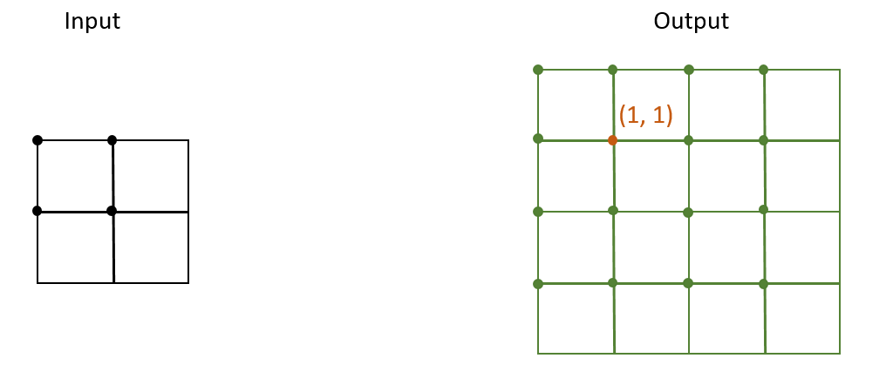

图中每个方块代表各像素块，各像素块左上角圆点代表该像素块的坐标。以求输出图像坐标为(1, 1)的像素块的像素值为例。首先求出原图像中与目标图像(1, 1)点对应的坐标，此时需要将(1, 1)乘上缩放系数 :math:`(scale_w,
scale_h)`。缩放系数的求解方法与 ``align_corner`` 参数有关。本例中将 ``align_corner`` 设为 **False**，求法如下:

.. math::

   scale_w = w / H = 2 / 4 = 0.5 \\
   scale_h = w / H = 2/4   =0.5

其中，``w``、``h`` 以及 ``W``、``H`` 分别代表输入和输出图像在 ``w`` 和 ``h`` 方向的大小。

求出缩放系数之后，可以求出原图中坐标为(0.5, 0.5)的点，即对应输出图像的(1, 1)像素，如下图红点所示。此时：

.. math::

   (x', y') -> (X, Y) = (0.5, 0.5) -> (1, 1)

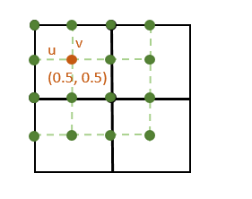

**最邻近插值**

最邻近插值即 ``mode == NearestNeighbor``。在最邻近插值算法中，目标像素点的像素值只与距离其最近的原图像像素点有关，即round或floor由 ``align_corners`` 和 ``align_center`` 参数决定。在该例子中，对于目标图像中(1, 1)像素点，其像素值：

.. math::

   \begin{aligned}
   f_1(X, Y) &= f_0(round(x'), round(y')) \\
   f_1(1, 1) &= f_0(round(0.5), round(0.5)) \\
   f_1(1, 1) &= f_0(1, 1)
   \end{aligned}

其中 :math:`f_1(X,Y)` 与  :math:`f_0(x, y)` 分别表示输出与输入图像对应坐标点的像素值。

**双线性插值**

双线性插值即 ``mode == Bilinear``。首先将求得的(0.5, 0.5)表示成 “整数+小数” 的形式，可以得到：

.. math::

   \begin{aligned}
    & x'' = 0,  y'' = 0,  u = 0.5,  v = 0.5 \\
    & (x', y') -> (x'' +u, y'' + v) = (0.5, 0.5) -> (0 + 0.5, 0 + 0.5)
   \end{aligned}

在双线性插值算法中，目标图像中单个像素点的坐标由原图像中邻近4个像素点的像素值按比例相乘得到。单一点与其邻近点示意图分别如下图中红色与黄色点所示：

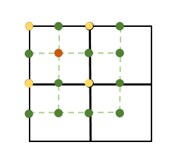

公式如下：

.. math::

   \begin{aligned}
     f_1(X, Y) &= (1 - u)(1 - v)f_0(x'', y'') + u(1 - v)f_0(x'' + 1, y'') + (1 - u)vf_0(x'', y'' + 1) + uvf_0(x'' + 1, y'' + 1) \\
   \end{aligned}

本例中：

.. math::

   \begin{aligned}
   f_1(1, 1) &= 0.5 \cdot 0.5 \cdot f_0(0, 0) + 0.5 \cdot 0.5 \cdot f_0(1, 0) + 0.5 \cdot 0.5 \cdot f_0(0, 1) + 0.5 \cdot 0.5 \cdot f_0(1, 1)
   \end{aligned}

如果想要将图像四角上的像素点进行对齐，设置 ``align_corner`` 参数。**True** 表示对齐，**False** 表示不对齐。取值对比如下图所示：

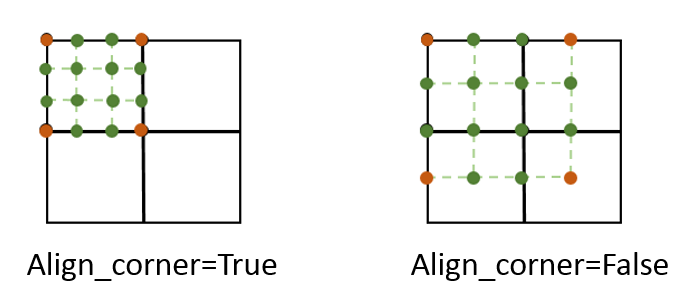

该参数影响缩放系数  :math:`scale_w` 和 :math:`scale_h` 的计算。

如果想要将像素块按中心点进行对齐，设置 ``align_center`` 参数。**True** 表示使用中心点坐标。相当于将默认坐标向右下方偏移0.5个单位长度。**False** 表示使用每个像素块左上角点的坐标，作为该像素块坐标。如下图所示：

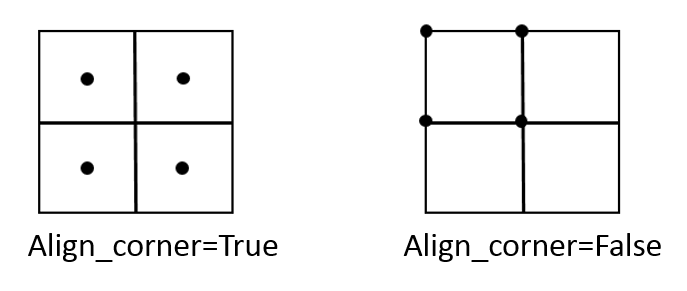

该参数影响缩放后坐标点的计算。

cnnlInterpBackward
----------------------

Interp Backward算子为Interp的反向算子。通过mode选择不同插值方式。对于反向算子而言，输入为 :math:`diff_y` ，即 :math:`\frac{\partial z}{\partial y}`，根据正向公式，可以得出求  :math:`diff_x`，即  :math:`\frac{\partial z}{\partial x}` 的公式为：

**最邻近插值模式**

.. math::

   \begin{aligned}
     diff_x(x, y) = diff_y(X, Y) \\
   \end{aligned}

**双线性插值模式**

.. math::

   \begin{aligned}
     diff_x(x, y) &+= (1 - u)(1 - v) \cdot diff_y(X, Y) \\
     diff_x(x + 1, y) &+= u(1 - v) \cdot diff_y(X, Y) \\
     diff_x(x, y + 1) &+= (1 - u)v \cdot diff_y(X, Y) \\
     diff_x(x + 1, y + 1) &+= uv \cdot diff_y(X, Y)
   \end{aligned}

其中，:math:`diff_y` 为输入梯度，:math:`diff_x` 为输出梯度。

cnnlInTopK
-----------

输入张量 targets 中对应位置所指示的数值是否在输入张量 predictions 前 k 大的数据中。

公式如下：

.. math::

   output[b] = predictions[b][targets[b]] \in TopK(predictions[b])

cnnlInverse
-----------------------

计算方阵或批次方阵内每个方阵的逆矩阵或逆矩阵的转置，并返回异常码向量。该算子同时会返回一个int型的infos异常码向量，其指明每一个batch的是否可逆、是否存在inf或NAN。其中，元素的id与输入flatten成三维后的batch id相对应。

- 元素值 = 0: 方阵为可逆。
- 元素值 > 0：方阵不可逆。大于零的数字i代表初等行变换时，第i行或列的主对角元素为0。
- 元素值 = -1： 出现非法输入值(NAN或inf)。

如果异常向量中出现了非0的元素，则该元素所对应的batch的逆矩阵不能保证正确性。

cnnlInvertPermutation
-----------------------

计算索引序列的逆置换。

.. math::

   y[x[i]] = i, \quad i = 0, 1, 2, ..., lenght(x)-1

其中：

- ``x`` 是一维的整数张量，表示一个以0为开始的索引数组，将 ``x`` 中每个值与其索引位置交换组成 ``y``。
- ``y`` 是一维输出张量。
- ``length(x)`` 为一维输入张量的长度。
- ``i`` 为 0至 ``length(x)`` - 1的索引值。例如  x = [3,4,0,2,1],  y = InvertPermutation(x) = [2,4,3,0,1]。

cnnlIsFinite
---------------

判断输入中的每个元素是否是有限数字，如果是，则对应位置输出1，否则对应位置输出0。

cnnlKerasMomentum
-------------------

基于momentum算法的优化算法，通过滤波器梯度更新原始滤波器。

计算公式如下：

.. math::

   accum_t = accum_{t-1} * momentum - grad * lr;

.. math::

   var_t=\left\{
   \begin{array}{lr}
   var_{t-1} + accum_t * momentum - grad * lr,         &use\_nesterov=true\\
   var_{t-1} + accum_t,                                &use\_nesterov=false
   \end{array}
   \right.

其中:

- ``var`` 表示待更新的变量，在网络中常指滤波器。
- ``grad`` 表示反向训练中的梯度。
- ``accum`` 表示待更新值的滑动累加。
- ``momentum`` 表示动量, 用来指导更新的方向。
- ``lr`` 表示学习率, 用来表示更新的幅度。
- ``use_nesttrov`` 表示是否使用 Nesterov momentum更新 ``var``。

cnnlIsNan
-------------------

判断输入中的每个元素是否是NaN，是则对应位置输出true，否则对应位置输出false。

**示例**

::

  input: [0.0, inf, nan, 9.125, -inf]
  output: [false, false, true, false, false]

cnnlIsInf
-------------------

判断输入中每个元素是否为inf或者输入中是否含有inf。该算子使用 ``reduce`` 参数决定是否对输出进行规约处理。

当reduce是false：

- 当 mode等于CNNL_NEG_INF，判断输入中的每个元素是否是-inf，是则对应位置输出true，否则对应位置输出false。

- 当 mode等于CNNL_POS_INF，判断输入中的每个元素是否是+inf，是则对应位置输出true，否则对应位置输出false。

- 当 mode等于CNNL_INF，判断输入中的每个元素是否是+inf/-inf，是则对应位置输出true，否则对应位置输出false。

- 当 mode等于CNNL_INF_INDICATOR，判断输入中的每个元素是否是-inf，是则对应位置输出1，是否是+inf，是则对应位置输出2，否则对应位置输出false。

当reduce是true：

- 当 mode等于CNNL_NEG_INF，判断输入中元素是否含有-inf，是则输出true，否则输出false。

- 当 mode等于CNNL_POS_INF，判断输入中元素是否含有+inf，是则输出true，否则输出false。

- 当 mode等于CNNL_INF，判断输入中元素是否含有-inf或+inf，是则输出true，否则输出false。

- 当 mode等于CNNL_INF_INDICATOR，判断输入中元素是否仅含有-inf，是则输出1，是否仅含有+inf，是则输出2，是否既含有-inf也含有+inf，是则输出3，以上都不满足输出0。

**示例**

::

  input：{9, -inf, 2, nan, +inf} mode = CNNL_NEG_INF, reduce = false; ouput：{false, true, false, false, false}
        input：{9, -inf, 2, nan, +inf} mode = CNNL_POS_INF, reduce = false; ouput：{false, false, false, false, true}
        input：{9, -inf, 2, nan, +inf} mode = CNNL_INF, reduce = false; ouput：{false, true, false, false, true}
        input：{9, -inf, 2, nan, +inf} mode = CNNL_NEG_INF, reduce = true; ouput：true
        input：{9, -inf, 2, nan, +inf} mode = CNNL_POS_INF, reduce = true; ouput：true
        input：{9, -inf, 2, nan, +inf} mode = CNNL_INF, reduce = true;  ouput：true
        input：{9, -inf, 2, nan, +inf} mode = CNNL_INF_INDICATOR, reduce = false; ouput：{0, 1, 0, 0, 2}
        input：{9, -inf, 2, nan, +inf} mode = CNNL_INF_INDICATOR, reduce = true;  ouput：3

cnnlKthValue
-------------------

寻找第k小的数的操作。算子有两个参数k和dim。算子的输出包括返回输入张量在参数dim指定的维度上第k小的数据张量，以及这些第k小的数据的索引整型张量。

cnnlLayerNormForward
------------------------

一个batch 内做标准化，不存在跨 batch 的情况。

通用公式如下：

.. math::

   \begin{aligned}
   \mu_n & = \frac{\sum_{c,h,w}{x_{n,c,h,w}}}{M}, \quad (M=C*H*W)  \\
   \sigma^2_n & = \frac{\sum_{c,h,w}(x_{n,c,h,w}-\mu_n)^2}{M} \\
   y_i & = \frac{x_i-\mu_n}{\sqrt{\sigma^2_n+\epsilon}} \\
   \end{aligned}

其中：

- 公式中 :math:`x_{n,c,h,w}` 是列表中张量 x 索引为 ``(n,c,h,w)`` 的元素。
- 公式中 :math:`x_i` 是列表中张量 x 索引为 ``(n,h,w,c)`` 的元素。
- 公式中 :math:`y_i` 是归一化张量 y 索引为 ``(n,h,w,c)`` 的元素。
- 公式中 :math:`\mu_n` 是列表中张量 saved_mean 索引为 ``n`` 的元素。
- 公式中 :math:`\sigma_n^2` 是列表中张量 saved_invstd 索引为 ``n`` 的元素的平方的倒数减去 eps。
- 公式中 :math:`\epsilon` 是列表中的 eps。

cnnlLayerNormBackward
------------------------

用于LayerNorm算子在训练中的反向传播，常在Transformer 类网络中使用。cnnlLayerNormBackward 算子计算损失函数在 x, filter, bias 处的梯度。

cnnlLerp
----------

根据滤波器对两个输入张量进行一维线性插值操作。

Lerp的计算公式为：

.. math::

     out_i = start_i + filter_i * (end_i - start_i)

其中：

- ``start`` 和 ``end`` 是线性插值的输入张量。
- ``filter`` 是线性插值的滤波器。
- ``out`` 是线性插值的输出张量。

cnnlListDiff
--------------

用于计算两个列表中元素的差异，即出现在第一个列表且没有出现在第二个列表中的所有元素，顺序按其在第一个列表中出现的顺序排列。

计算公式如下：

.. math::

   output = input1 - (\cap{input1}{input2})

.. math::

   output[i] = input1[index[i]] for i in range(len(output))

其中 ``input1`` 和 ``input2`` 为一维输入向量。``output`` 为一维输出向量。``index`` 为一维数组，输出形状与输入形相同，记录output中元素在 ``input1`` 中的索引。

cnnlLog
--------

计算输入张量的以e、2、10为底的对数。

Log的计算公式为：

.. math::

     y_i = log(x_i)

Log2的计算公式为：

.. math::

   y_i = log2(x_i)

Log10的计算公式为：

.. math::

   y_i = log10(x_i)

注：

- ``i`` 表示一个多元数组的索引，表示多维tensor。
- :math:`x_i`、:math:`y_i` 表示多元组中 i 索引处的元素。

cnnlLog1p
----------

逐元素计算输入张量加1后的自然对数。

Log1p的计算公式为：

.. math::

     y = log(1 + x)

注：

- ``x`` 表示输入的Array。
- ``y`` 表示输出的Array。

cnnlLogicOp
--------------

张量逻辑运算。如Equal、NotEqual、Greater、GreaterEqual、Less、LessEqual等。

cnnlLrn
----------

LRN（Local Response Normalization，局部响应归一化），一种数据标准化方法。

计算公式如下：

.. math::

   b_{x,y}^i = \frac{a_{x,y}^i}{(k+\frac{\alpha}{n}\sum_{j=max(0, i-\frac{n}{2})}^{min(N-1, i+\frac{n}{2})}{(a_{x,y}^j)^2})^\beta}

其中：

- ``a`` 的上标 ``i`` 为该层的第几个feature map。
- ``a`` 的下标 ``x``、``y`` 为feature map的像素位置。
- ``a`` 为feature map里 ``x``、``y`` 位置，第 ``i`` 个通道对应的具体值。
- ``N`` 为feature map的总数量。
- :math:`\alpha` 为超参数，方差缩放参数，默认为0.0001。
- :math:`\beta` 为超参数，幂参数，默认为0.75。
- ``k`` 为超参数，由bias指定。
- ``n`` 为超参数，选取的通道个数，默认为5。

cnnlLrnGrad
-------------

LRN算子的反向算子。

计算公式如下：

.. math::

   S =k +\alpha*\sum_{j=max(0, i-\frac{n}{2})}^{min(N-1, i+\frac{n}{2})}{x_j^2} \\
   dx = dy * S^{-\beta} - 2\beta\alpha * x * \sum_{j=max(0,i-\frac{n}{2})}^{min(N-1, i+\frac{n}{2})} \frac{y_j * dy_j}{S_j}

其中：

- ``S`` 是中间结果，用于计算 ``dx`` 。
- ``y`` 是LRN正向的结果，``dy`` 是从后方传来的梯度值，是输入。

cnnlLSTM
----------

LSTM（long short-term memory）实现了长短时记忆网络的基本功能及其各种变种模式。

cnnlL1LossBackward
----------------------------

计算L1损失函数反向传播过程中输入的梯度。

公式如下：

- 当reduction为none时：

  .. math::

     grad\_input_{i} = sign(input_{i} - target_{i}) * grad\_output_{i} \quad  i=(1,2,...number)

- 当reduction为sum时：

  .. math::

     grad\_input_{i} = sign(input_{i} - target_{i}) * grad\_output_{0} \quad  i=(1,2,...number)

- 当reduction为mean时：

  .. math::

     grad\_input_{i} = \frac{ sign(input_{i} - target_{i}) * grad\_output_{0}}{number} \quad  i=(1,2,...number)

其中sign为符号函数，number为张量内元素个数。

cnnlLSTMGatesBackward
---------------------

实现计算lstm cell内隐藏门的梯度，使用隐藏门的梯度和lstm滤波器进行矩阵乘运算以计算lstm input的梯度。

公式如下：

.. math::

   \delta cx = (\delta hy \odot o_g \odot (1-tanh^2(cy))+\delta cy) \odot f_g \\
   \delta i_g =  (\delta hy \odot o_g \odot (1-tanh^2(cy))+\delta cy)  \odot g_g  \odot i_g \odot (1-i_g) \\
   \delta f_g =  (\delta hy \odot o_g \odot (1-tanh^2(cy))+\delta cy)  \odot f_g  \odot (1-f_g) \odot cx\\
   \delta g_g =  (\delta hy \odot o_g \odot (1-tanh^2(cy))+\delta cy)  \odot i_g  \odot (1-g_g^2) \\
   \delta o_g =  \delta hy \odot  tanh(cy) \odot o_g \odot (1-o_g)

其中：

- ``cx`` 表示lstm cell的cell input, ``cy`` 表示lstm cell的cell output，:math:`\delta hy` 表示hidden output的梯度，:math:`\delta cy` 表示cell output的梯度。

- :math:`\delta cx` 表示cell input的梯度，:math:`\delta i_g` ，:math:`\delta f_g` ，:math:`\delta g_g` 和 :math:`\delta o_g` 分别表示隐藏门的梯度。

cnnlLSTMGatesForward
---------------------

实现计算lstm cell网络的前向计算过程。该过程通过 ``xgates`` 、``hgates`` 和 ``bias`` 的输入，计算出 i（输入门）、f（遗忘门）、g（细胞门）和 o（输出门）的状态，再由四个门与 ``cx`` （上一次cell状态） 推算出cell状态 ``cy`` 和隐藏状态输出 ``hy`` 。

正向标准LSTM计算公式如下：

.. math::

   \LARGE{i_t} = sigmoid(w_0\cdot{x_{t-1}}+w_4\cdot{hx_{t-1}}+b_0+b_4)     \\
   \LARGE{f_t} = sigmoid(w_1\cdot{x_{t-1}}+w_5\cdot{hx_{t-1}}+b_1+b_5)      \\
   \LARGE{g_t} = tanh(w_2\cdot{x_{t-1}} + w_6\cdot{hx_{t-1}}+b_2+b_6)       \\
   \LARGE{o_t} = sigmoid(w_3\cdot{x_{t-1}}+w_7\cdot{hx_{t-1}}+b_3+b_7)       \\
   \LARGE{cy_t} = f_t*cx_{t-1}+i_t*g_t                                        \\
   \LARGE{hy_t} = o_t*tanh(cy_t)

根据算子特性,计算细胞状态和隐藏状态公式如下:

.. math::

   \LARGE{i} = sigmoid(xgate_i+hgate_i+xb_i+hb_i)   \\
   \LARGE{f} = sigmoid(xgate_f+hgate_f+xb_f+hb_f)      \\
   \LARGE{g} = tanh(xgate_g + hgate_g+xb_g+hb_g)   \\
   \LARGE{o} = sigmoid(xgate_o+hgate_o+xb_o+hb_o)  \\
   \LARGE{cy} = f*cx+i*g                               \\
   \LARGE{hy} = o*tanh(cy)

其中：

- ``cy`` 表示cell状态。
- ``cx``  表示 上一次cell状态。
- ``hy`` 表示隐藏状态输出。
- ``xgates`` 表示输入。注意 ``xgates`` 是 ``input`` 与 ``filter`` 矩阵乘得到。矩阵乘应在该算子之外执行，并将结果输入给该算子。
- ``hgates`` 表示隐藏状态。注意 ``hgates`` 是 ``hidden_state`` 与 ``filter`` 矩阵乘得到。矩阵乘应在该算子之外执行，并将结果输入给该算子。

cnnlL2Loss
----------------------------

描述 ``input_predicted`` 和 ``input_label`` 中对应元素误差的平方和（L2范数的一半）。

公式如下：

.. math::

   output &= sum(input^2) / 2\\
   input &= input\_predicted - input\_label

其中：

- output 为输出，只有一个值。
- ``input_predicted`` 和 ``input_label`` 分别为 loss 层的预测值和标签值。

cnnlLinspace
-----------------

在指定的区间内生成并返回一个等差数列。该算子的计算公式如下：

.. math::

   (start, start + \frac{end-start}{num-1}, ...,start+ \frac{end - start} {num - 1}*(num - 2), end)

其中 ``start`` 为数列的首项，``end`` 为末项，``num`` 为等差数列的长度。

cnnlMasked
------------------

处理变长字句的补齐或者选择过程，主要用于掩码，根据掩码值进行相应的行为，包括fill、scatter、scale等。示例说明请参看《Cambricon CNNL Developer Guide》。

cnnlMaskZero
------------------

用在语音处理类的网络，主要是先做掩码，然后根据参数决定是否做PReLU。

1. 判断参数 ``pad_label`` 与输入 ``label`` 的W维是否相等，如果相等则将input data中与该W对应的H和C置零。如果 ``label`` 的W维长度大于input data的W维长度，则有

   .. math::

      stride_{label}=W_{label}/W_{input}

   .. math::

      stride_{input}=1

2. 判断参数 ``fuse_relu`` 是否为 ``true``，若为 ``true`` 则将input data中小于0的数乘以参数 ``slope``。

   .. figure:: ../images/maskzero.png

   上图中input data的dim0到dim3分别对应NHWC， ``label`` 的dim0对应N，dim1对应W。当N = 0时，参数 ``pad_label`` 与 ``label`` 中W的第二个数和第四个数相等，则将input data中N = 0、W = 1和N = 0、W = 3时的H * C置零。当N = 1时，参数 ``pad_label`` 与 ``label`` 的中W的第三个数相等，则将Input data中N = 1, W = 2的H * C置零。最后，判断参数 ``fuse_relu`` 是否为真，若为真则将input data中所有小于0的数乘以 ``slope``。

.. _cnnlMatMul:

cnnlMatMul
---------------------------------

对张量进行矩阵乘计算。

公式如下：

.. math::

   C=op(A)op(B)

其中：

- ``op(A)`` 代表对A矩阵进行转置或者不进行操作，``op(A)`` 也是一个矩阵。
- ``op(A)op(B)`` 代表对两个矩阵进行矩阵乘。

cnnlMatMulInference
------------------------

对给定的输入左矩阵 A 和右矩阵 B，按照矩阵乘法运算得到输出矩阵 C。

公式如下：

.. math::

   \begin{aligned}
   C_{m,n} = \sum_{k=1}^K A_{m,k}B_{k,n}
   \end{aligned}

其中：

- ``m`` 为左矩阵的行数。
- ``n`` 为左左矩阵的列数或者右矩阵的行数。
- ``k`` 为右矩阵的列数。

cnnlMatMulInference_v2
----------------------

在矩阵乘后接融合操作，目前可以在矩阵乘后依次融合偏置，缩放，批量归一化，激活等操作。

.. math::

    C = activation(bn\_filter \ * (\frac{scale\_alpha \ * (matmul(A, B) + bias)\ + scale\_beta \ - bn\_mean }{\sqrt{bn\_var+\epsilon }}) \ + bn\_beta)

其中：

- 公式中 A, B 分别是矩阵乘输入的左右矩阵。
- 公式中 bias 是偏置。
- 公式中 scale_alpha 是缩放系数。
- 公式中 scale_beta 是缩放系数对应的偏置。
- 公式中 bn_mean 是用于计算批量归一化操作的均值。
- 公式中 bn_var 是用于计算批量归一化操作的方差。
- 公式中 epsilon 是用于计算批量归一化操作中防止分母为0的因子。
- 公式中 bn_beta 是用于计算批量归一化操作的偏置。
- 公式中 activation 是激活操作。
- 公式中 C 是最终的输出结果。

cnnlMatMulEx
----------------------

在矩阵乘融合操作，目前可以在矩阵乘后依次融合偏置，缩放，批量归一化，激活等操作，同时支持量化融合操作。

.. math::

    C = activation(bn\_filter \ * (\frac{scale\_alpha \ * (matmul(A, B) + bias)\ + scale\_beta \ - bn\_mean }{\sqrt{bn\_var+\epsilon }}) \ + bn\_beta)

其中：

- 公式中 A, B 分别是矩阵乘输入的左右矩阵。
- 公式中 bias 是偏置。
- 公式中 scale_alpha 是缩放系数。
- 公式中 scale_beta 是缩放系数对应的偏置。
- 公式中 bn_mean 是用于计算批量归一化操作的均值，当前版本不支持。
- 公式中 bn_var 是用于计算批量归一化操作的方差，当前版本不支持。
- 公式中 epsilon 是用于计算批量归一化操作中防止分母为0的因子，当前版本不支持。
- 公式中 bn_beta 是用于计算批量归一化操作的偏置，当前版本不支持。
- 公式中 activation 是激活操作。
- 公式中 C 是最终的输出结果。

cnnlMatrixBandPart
--------------------

复制一个张量，将每个最内层矩阵中的所有中心区域外的所有内容设置为零。

计算公式如下：

.. math::

   output[i,j,k,...,m,n] = in_band(m, n) * input[i,j,k,...,m, n]

其中:

in_band(m, n)=(num_lower < 0 || (m - n) <= num_lower) && (num_upper < 0 || (n - m) <= num_upper)

cnnlMaximum
-------------

比较两个输入张量相同索引处两个数的大小，将其中较大的数写到输出张量的对应位置。

公式如下：

.. math::

   C_i = \left\{
         \begin{array}{rcl}
         A_i,  &  {A_i > B_i} \\
         B_i,  &  {A_i \leq B_i}
         \end{array}
         \right.

其中 ``A`` 和 ``B`` 表示输入张量，``C`` 表示输出张量。

cnnlMedian
------------

计算中位数。返回输入张量给定维度 ``dim`` 每行的中位数，同时返回一个包含中位数的索引的 ``indices`` 整型张量。其中当 ``dim`` 为 **None** 时，该算子仅返回整个输入张量的中位数，不返回索引。

cnnlMinimum
-------------

比较两个输入张量相同索引处两个数的大小，将结果存为新的张量。这两个算子支持广播。

公式如下：

.. math::

   C_i = \left\{
         \begin{array}{rcl}
         A_i,  &  {A_i \leq B_i} \\
         B_i,  &  {A_i > B_i}
         \end{array}
         \right.

其中 ``A`` 和 ``B`` 表示输入张量，``C`` 表示输出张量。

cnnlMulN
---------------

实现多个张量的乘法操作。

公式如下：

- 已知形状完全一致的张量A、B、……若干，构成张量集合X。以及输出张量Z。

- ``len = length(A) = length(B)=……length(Z)``，公式中 ``Tn`` 指集合X中任意一个张量。

新增 MulN(A,B……)，定义为：

.. math::

     Z[i]=\prod_{n=0}^{len-1}Tn[i],i\epsilon[0,len-1],n\epsilon[0,|X|-1]

cnnlMomentum
---------------

通过滤波器梯度更新原始滤波器。能够对历史梯度进行累计，快速收敛速度。

公式如下：

.. math::

   \qquad  accum_t = accum_{t-1} * momentum+grad_{t}

.. math::

   \qquad  var_t = var_{t-1} - lr * grad_{t} - lr * momentum * accum_t

其中 ``lr`` 表示学习率，``momentum`` 表示momentum优化器中的超参，``grad`` 表示输入梯度，``accum`` 表示输入历史影响的张量。

cnnlMSELoss
---------------

用来表现预测与实际数据的差距程度。当reduction为NONE时，返回input_predicted和input_label中对应元素差的平方，输出维度与输入维度一致。当reduction为SUM时，返回input_predicted和input_label中对应元素差的平方和，输出为标量。当reduction为MEAN时，返回input_predicted和input_label中对应元素差的平方和，再求均值，输出为标量。

公式如下：

当reduction为NONE时：

.. math::

   \begin{aligned}
   l(x,y) = L =
    \left\{l_1,...,l_N\right\}^T,\quad l_n = (x_n - y_n)^2,
   \end{aligned}

其中，n为输入input包含的元素个数。

当reduction为SUM或MEAN时：

.. math::

   \begin{aligned}
   l(x,y) = L =
    \begin{cases}
    mean(L) = \frac{1}{N} * \sum_{n=1}^N (x_n - y_n)^2,\ if\ reduction\ is\ 'mean'; \\
    sum(L) = \sum_{n=1}^N (x_n - y_n)^2,\qquad\              if\ reduction\ is\ 'sum'.
    \end{cases}
   \end{aligned}

其中，x和y是任意形状的张量，共有N个元素。

cnnlMSELossBackward
---------------------

计算Mean Squared Error(MSE) Loss的梯度，用来评价模型的预测值和真实值的差异程度，被用于分类任务中训练深度网络。

公式如下：

当reduction为NONE时：

.. math::

   \begin{aligned}
   \nabla_{x_i}{l_i} = 2 * (x_i - y_i); \\
   \nabla_{x}{L} = \{\nabla_{x_1}{l_1}, ..., \nabla_{x_n}{l_n}\}^T; \\
   output = \nabla_{x}{L} * grad.
   \end{aligned}

当reduction为SUM时：

.. math::

   \begin{aligned}
   \nabla_{x_i}{L} = 2 * (x_i - y_i); \\
   \nabla_{x}{L} = \{\nabla_{x_1}{L}, ..., \nabla_{x_n}{L}\}^T; \\
   output = \nabla_{x}{L} * grad.
   \end{aligned}

当reduction为MEAN时：

.. math::

   \begin{aligned}
   \nabla_{x_i}{L} = \frac{2}{N} * (x_i - y_i); \\
   \nabla_{x}{L} = \{\nabla_{x_1}{L}, ..., \nabla_{x_n}{L}\}^T; \\
   output = \nabla_{x}{L} * grad.
   \end{aligned}

其中：

- ``x`` 和 ``y`` 是任意形状的张量，共有 ``n`` 个元素。
- ``grad`` 为算子输入，即关于loss输出的梯度；且当reduction为NONE时，grad的维度与输入一致。当reduction为SUM或MEAN时，grad维度为1。
- ``output`` 为算子输出，即关于输入 ``x`` 的梯度。

.. _cnnlMultiHeadAttnForward:

cnnlMultiHeadAttnForward
----------------------------

MultiHeadAttn 是在Self-Attention 机制的基础上移入 H 个可并行处理的 Self-Attention 模块。

公式如下：

.. math::

   \begin{aligned}
   & q^i = Q(W_q^i)^T + B^i_q \\
   & k^i = K(W_k^i)^T + B^i_k \\
   & v^i = V(W_v^i)^T + B^i_v \\
   & \beta^i = \frac{{q^i}(k^i)^T}{\sqrt{d_k}} \\
   & \alpha^i = softmax(\beta^i) \\
   \end{aligned}

.. math::

   \begin{aligned}
   & z^i = \alpha^i v^i \\
   & z = concat_{i=1}^{H}(z^i) \\
   & Z = z(W_o)^T + B_o\\
   \end{aligned}

其中，大写字母表示算子输入输出，小写字母表示算子中间结果。

算子输入输出和中间结果的形状：

.. table:: Multi Head Attn算子输入输出和中间结果的形状说明

 ================  ===============================
  张量             形状
 ================  ===============================
  :math:`Q`        :math:`(N, M_q, T_q, C)`
  :math:`K`        :math:`(N, M_k, T_k, C)`
  :math:`V`        :math:`(N, M_v, T_v, C)`
  :math:`W_q`      :math:`(H, C_q, C)`
  :math:`W_k`      :math:`(H, C_k, C)`
  :math:`W_v`      :math:`(H, C_v, C)`
  :math:`B_q`      :math:`(H, C_q)`
  :math:`B_k`      :math:`(H, C_k)`
  :math:`B_v`      :math:`(H, C_v)`
  :math:`q`        :math:`(H, N, M_q, T_q, C_q)`
  :math:`k`        :math:`(H, N, M_k, T_k, C_k)`
  :math:`v`        :math:`(H, N, M_v, T_v, C_v)`
  :math:`\beta`    :math:`(H, N, M_q, T_q, T_k)`
  :math:`\alpha`   :math:`(H, N, M_q, T_q, T_k)`
  :math:`z^i`      :math:`(N, M_q, T_q, C_v)`
  :math:`z`        :math:`(N, M_q, T_q, H * C_v)`
  :math:`W_o`      :math:`(H, C, C_v)`
  :math:`B_o`      :math:`(C)`
  :math:`Z`        :math:`(N, M_q, T_q, C)`
 ================  ===============================

注：

- :math:`N` 表示输入张量的batch大小，例如机器翻译场景的句子条数。
- :math:`M_q`、:math:`M_k`、:math:`M_v` 分别表示 :math:`Q`、:math:`K`、:math:`V` 的 beam 大小，在 Encoder 中一般设为 1。
- :math:`M_q`、:math:`M_k`、:math:`M_v` 一般会有两种情况：

  * :math:`M_q = M_k = M_v \ge 1`
  * :math:`M_q \ge 1, \ M_k = M_v = 1`

- :math:`H` 表示多头注意力机制中的头数，例如8头、16头等等。
- :math:`T_q`、:math:`T_k`、:math:`T_v` 分别表示 :math:`Q`、:math:`K`、:math:`V` 的序列长度。例如机器翻译场景的句子长度，一般来说 :math:`T_k = T_v`。
- :math:`C` 表示词向量长度。:math:`C_q`、:math:`C_k`、:math:`C_v` 表示 :math:`Q`、:math:`K`、:math:`V` 的隐含状态向量长度，一般来说 :math:`C_q = C_k`。

时序数据参数设置
>>>>>>>>>>>>>>>>>>>>>>>>>>>

下图展示了时序数据参数seqLengthArraySize、seqLengthArray、MaxSequenceLength及PaddingFill示例。MaxSequenceLength是设置cnnlSetMultiHeadAttnDescriptor接口中qo_max_seq_length和kv_max_seq_length参数，而其他参数通过通过SeqDataDescriptor接口设置。

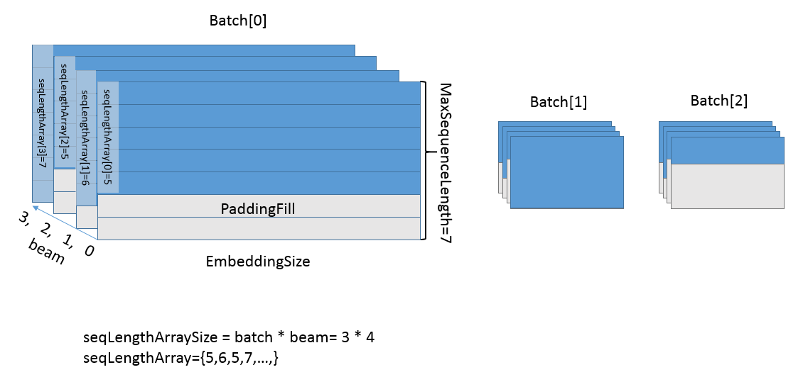

图中为一个batch=3，beam=4的时序数据块，其中最长的序列长度为7，假设最低维度的大小为C，数据排列为(N, B, T, C)，即batch、beam、sequence、length，那么该数据块的形状为（3, 4, 7, C），时序维度会按照最长句长来补齐。

注意每个句子的长度会有不同，即使是在同一个beam内，seqLengthArray记录了每个(batch, beam)的实际句长，以上图的第一个batch为例，该batch的4个beam句长分别为(5, 6, 5, 7)，那么seqLengthArray[0:4]=[5, 6, 5, 7]。我们约定seqLengthArray内的数据顺序为batch-beam的顺序。seqLengthSize记录了句子的个数，即为batch * beam。

PaddingFill用来描述该数据块的补齐部分，如果数据块需要在之后的计算中对补齐部分补上特定的值，那么PaddingFill填一个指向该值的指针。如果数据块的补齐部分已经处理过（例如补齐部分已经为0），不需要之后额外的处理，那么PaddingFill传NULL值即可。

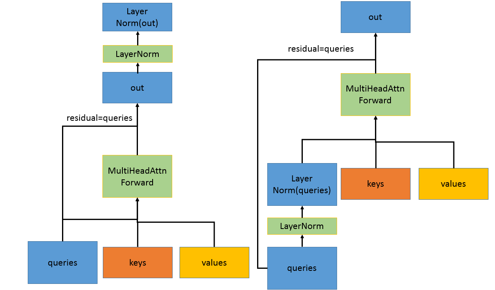

多头注意力机制的残差连接往往和Layer Normalization算子紧密耦合。上图展示了两种典型的网络结构，其中左图为计算完Multi Head Attn计算再计算Layer Normalization算子，右图为计算完Layer Normalization算子再完成Multi Head Attn计算。其中residual为经过Layer Normalization计算之前的queries。

cnnlMultiHeadAttnBackwardData
---------------------------------

该函数计算多头注意力机制Q、K、V的一阶导数项，假设 :math:`y=F(w)` 表示多头注意力机制的前向过程，:math:`X\in R^{n}` 为输入，:math:`y\in R^{m}` 为输出，McnnlMultiHeadAttnBackwardData计算 :math:`(\partial y_i/\partial x_j)^{T}\delta_{out}`，其中 :math:`\delta_{out}` 为上一层反向传播的残差。:math:`\partial y_i/\partial x_j` 为 :math:`F(x)` 的Jacobi矩阵，形状为 :math:`m*n`。:math:`\delta_{out}` 为该算子的输入，Q、K、V的梯度dqueries、dkeys和dvalues为该算子的输出。

McnnlMultiHeadAttnBackwardData不输出残差链接的梯度，因为其值和 :math:`\delta_{out}` 相等。如果在前向过程中使用了残差连接，并且残差连接的输入为Q，那么需要再调用cnnlMultiHeadAttnBackwardData之后再调用cnnlOpTensor计算最终的 :math:`dqueries+=\delta_{out}`。

McnnlMultiHeadAttnBackwardData必须在cnnlMultiHeadAttnForward调用之后调用，并且loWinIdx[]、hiWinIdx[]、queries、keys、values、filters和reserveSpace参量需要和cnnlMultiHeadAttnForward相同。

cnnlMultiHeadAttnBackwardWeights
------------------------------------

是transformer网络训练中常用而且比较重要的一个大融合算子，用来计算MultiHeadAttention中用到的滤波器的梯度。

滤波器的梯度公式为：

.. math::

   {dwq_i=\sum_{N}\sum_{M}dq_i^T\cdot{Q}}

.. math::

   {dwk_i=\sum_{N}\sum_{M}dk_i^T\cdot{K}}

.. math::

   {dwv_i=\sum_{N}\sum_{M}dv_i^T\cdot{V}}

.. math::

   {dwo_i=\sum_{N}\sum_{M}dho_i^T\cdot{h_i}}

.. math::

   {dbiasq_i=\sum_{N}\sum_{M}\sum_{seqQ} {dq_i}}

.. math::

   {dbiask_i=\sum_{N}\sum_{M}\sum_{seqK} {dk_i}}

.. math::

   {dbiasv_i=\sum_{N}\sum_{M}\sum_{seqV} {dv_i}}

.. math::

   {dbiaso_i=\sum_{N}\sum_{M}\sum_{seqQ} {dho_i}}

注：i代表head的索引。其他参数描述，可参考 cnnlMultiHeadAttnForward_。

cnnlNanInf
------------------

判断输入向量中是否含有inf或nan元素。输出是一个布尔值，若输入张量中含有inf或nan元素则为true，否则为false。

将输入 input 看作一维张量 (L)，结果为：

.. math::

   output = (bool)\sum_{l==0}^{l<L} (&input[l] == MAX \\
                                     &or \quad input[l] == -MAX \quad of \quad input[l] \quad is \quad \inf \\
									 &or  \quad input[l] \quad is \quad nan )

cnnlNegTensor
---------------

对张量进行取反。

公式如下：

.. math::

   output = -1 * input

cnnlNlllossForward
----------------------

负对数似然损失（negative log-likelihood loss）。

公式如下：

.. math::

   l_n = -w_{t_n}x_{n,t_n}

.. math::

   w_c = \begin{cases}
   filter[c],\quad if \quad c\neq ignore\_index \\
   0,\quad if \quad c = ignore\_index
   \end{cases}
   \\
   t_n = target[n] \in [0, C-1]

.. math::

   \ell(x,t) = \begin{cases}
   \{l_1,...,l_n\}^T,\quad if \quad reduction = none \\
   \sum_{n=1}^{N}{l_n},\quad if \quad reduction = sum \\
   \sum_{n=1}^{N}{\frac{1}{\sum_{n=1}^{N}{w_{t_n}}}l_n} =
   \frac{1}{out_{filter}}\sum_{n=1}^{N}{l_n},\quad if \quad reduction = mean
   \end{cases}

.. math::

   out_{filter} = \sum_{n=1}^{N}w_{t_n}

其中：

- N是当前的batch_size。

- C是类别数

- :math:`x` 是输入对数概率，维度[N, C]。

- :math:`target` 是标签值，维度是[N]，取值范围[0, C-1]。

- :math:`filter` 是每个类别对应的滤波器，维度是[C]。

- :math:`ignore\_index` 即忽略值，该索引值的 ``filter`` 值忽略，不参与计算。

- :math:`\ell(x, t)` 为输出的loss值，根据 ``reduction`` 选项不同，输出可以是[N]或者[1]。

- :math:`out_{filter}`，当 ``reduction =\not none`` 时输出当前batch的所有label对应的filter的累加和，否则输出0。

- :math:`n,c` 表示索引。

cnnlNlllossBackward
----------------------

负对数似然损失（negative log-likelihood loss）反向算子。

公式如下：

.. math::

   \frac{\partial L}{\partial x_{n,c}} = \frac{\partial L}{\partial \ell(x,t)} \frac{\partial \ell(x,t)}{\partial x_{n,c}}
   \\
   \frac{\partial \ell(x,t)}{\partial x_{n,c}} = \begin{cases}
   \frac{1}{out_{filter}}\frac{\partial l_n}{\partial x_{n,c}}, & if \quad reduction = mean \\ \frac{\partial l_n}{\partial x_{n,c}}, & else
   \end{cases}
   \\
   \frac{\partial l_n}{\partial x_{n,c}} = \begin{cases}
   \frac{\partial l_n}{\partial x_{n,t_n}} = -w_{t_n}, & if \quad c=t_n \\
   0, & else
   \end{cases}
   \\
   y' = \frac{\partial L}{\partial \ell(x,t)}

其中：

- :math:`y'` 为前向输出的梯度，当 :math:`reduction = none` 时，:math:`y'` 维度为[N], 否则 :math:`y'` 维度为[1]。

值得注意的是，当 :math:`y'` 维度为[N]时，反向传播公式应为：

.. math::

   \frac{\partial L}{\partial x_{n,c}} = \sum_k \frac{\partial L}{\partial \ell(x,t)_k} \frac{\partial \ell(x,t)_k}{\partial x_{n,c}} = \sum_k \frac{\partial L}{\partial l_k} \frac{\partial l_k}{\partial x_{n,c}} = \frac{\partial L}{\partial l_n} \frac{\partial l_n}{\partial x_{n,c}} = y'_n \frac{\partial l_n}{\partial x_{n,c}}

cnnlNms
---------

NMS的算法是根据一个候选框和其它候选框的交集IOU，做非极大值抑制操作。NMS迭代第移除IOU大于IOU阈值的较低评分的候选框。

cnnlNormalize
----------------

假设input tensor有 :math:`[n_0, ..., n_i, ..., n_k]` 的维度信息，当在其第 ``i`` 维做normalize运算时，会根据p范式产生一个p-norm的 :math:`[n0, ..., n_{i-1}, 1,  n_{i+1}, ..., n_k]` 规约向量，并对 :math:`n_i` 个 :math:`[n0, ..., n_{i-1}, n_{i+1}, ..., n_k]` 的向量v做如下数值转换：

.. math::

   output = \frac{input}{max(||input||_p, eps)}*scale

是否对结果进行缩放，由参数 ``channel_shared`` 设置：

- 如果 ``channel_shared`` 为0，则 scale是一个只包含一个元素且元素值为1的张量，此时默认不对output tensor进行缩放。
- 如果 ``channel_shared`` 为1，则 scale是一个只包含一个元素的张量。
- 如果 ``channel_shared`` 为2​，则每个output tensor的值对应scale张量的一个元素, 此时scale​的元素个数等于input tensor的channel​大小。

参与归一化的维度，由 ``across_spatial`` 设置：

- 如果 ``across_spatial`` 为0，参与归一化的input tensor的维度由用户输入的axis指定。
- 如果 ``across_spatial`` 为1，参与归一化的input tensor的维度为 1*h*w*c，归一化后norm tensor的维度为 n*1*1*1。
- 如果 ``across_spatial`` 为2，参与归一化的input tensor的维度为 1*1*1*c，归一化后norm tensor的维度为 n*h*w*1。

运算举例：

- 输入为：[[1, 1, 1], [1, 2, 3]], p = 2，  i = 0， scale = 1 -> 在第0维做normalization计算，
  输出为：:math:`[[\frac{1}{\sqrt{2}}, \frac{1}{\sqrt{5}}, \frac{1}{\sqrt{10}}], [\frac{1}{\sqrt{2}}, \frac{2}{\sqrt{5}}, \frac{3}{\sqrt{10}}]]`
- 输入为：[[1, 1, 1], [1, 2, 3]], p = 2,  i = 1 ， scale = 1 -> 在第1维做normalization计算，
  输出为：:math:`[[\frac{1}{\sqrt{3}}, \frac{1}{\sqrt{3}}, \frac{1}{\sqrt{3}}], [\frac{1}{\sqrt{14}}, \frac{2}{\sqrt{14}}, \frac{3}{\sqrt{14}}]]`

- 输入为：[[[1, 1], [2, 2]], [[-1, 2],[-2, 1]] ], [ [[1, 0],[-1, 0]], [[2, -1], [-1, 2]]]],
  设p = 2，``across_spatial`` = 1，``scale`` =[2,0]，
  输出为：:math:`[[[[\frac{2*1}{\sqrt{20}},0], [\frac{2*2}{\sqrt{20}}, 0]], [[\frac{2*(-1)}{\sqrt{20}}, 0],[\frac{2*(-2)}{\sqrt{20}},0]] ], [ [[\frac{2*1}{\sqrt{12}}, 0],[\frac{2*(-1)}{\sqrt{12}}, 0]], [[\frac{2*2}{\sqrt{12}},0], [\frac{2*(-1)}{\sqrt{12}},0]] ] ]`

cnnlNumTrue
-------------

返回输入中非0或True值的位置。

cnnlOneHot
-----------

用数组的形式表示数据的类别。

在索引数组中由索引表示的位置取值为 ``on_value``，而所有其他位置都取值为 ``off_value``。
如果未提供 ``on_value``，则默认值将为1，如果未提供 ``off_value``，则默认值为0。

例如：

::

   indices = [2， 4， 1]，depth = 5，on_value = 7，off_value = -1，axis = -1
   one_hot(indices，depth, on_value, off_value, axis) -> [[-1, -1, 7, -1, -1],
                                                          [-1, -1, -1, -1, 7],
                                                          [-1, 7, -1, -1, -1]]

cnnlOpTensor
--------------

张量对位运算。运算包括：加法、减法、乘法。

cnnlPad
---------

按照CONSTANT的填充方式对张量的外围进行扩展。

其计算原理如下：

算子的功能是将给定值填充到张量外围，其中张量扩展大小是由paddings参数指定的。
paddings是形状为[n,2]的整数张量，其中n为张量的秩。对于输入的每个维度dim：

- paddings[dim, 0]表示的是在张量的dim维度的前端添加的数值个数，
- paddings[dim, 1]表示的是在张量的dim维度的后端添加的数值个数。

因此输出的第k维大小是 ``paddings[k,0] + tensor.dim_size(k) + paddings[k,1]``。

示例如下：

::

   input = [[1, 2, 3], [4, 5, 6]], paddings = [[1, 1,], [2, 2]]
   pad(input, paddings, 0) -> [[0, 0, 0, 0, 0, 0, 0],
                               [0, 0, 1, 2, 3, 0, 0],
                               [0, 0, 4, 5, 6, 0, 0],
                               [0, 0, 0, 0, 0, 0, 0]]

.. _cnnlPoolingForward:

cnnlPoolingForward
--------------------

池化运算。

计算公式如下，其中 ``sw`` 和 ``sh`` 表示W和H两个方向的stride。``kw`` 和 ``kh`` 表示W和H两个方向的kernel size。

- CNNL_POOLING_MAX:

  .. math::

    \begin{aligned}
    & output[n,c,i,j] = \max (input[n,c,i*sh+di,j*sw+dj]), \quad (0<=di<kh,0<=dj<kw)  \\
    \end{aligned}

- CNNL_POOLING_AVERAGE_COUNT_INCLUDE_PADDING:

  .. math::

    \begin{aligned}
      & output[n,c,i,j] = \frac{\sum{(input[n,c,i*sh+di,j*sw+dj])}}{(wh*ww)}, \quad (0<=di<kh,0<=dj<kw)  \\
    \end{aligned}

- CNNL_POOLING_AVERAGE_COUNT_EXCLUDE_PADDING:

  例如：input = [1]并且padding_left = padding_right = 1，pad value为0，padding后input为[0, 1, 0]。如果kernel size为3，输出output是[1]而不是[1/3]。

CNNL_POOLING_MAX和CNNL_POOLING_AVERAGE_COUNT_EXCLUDE_PADDING的区别如下：

假如Maxpool算子为求一个kernel中最大值，AvgPool算子为求一个kernel中所有值的平均值：

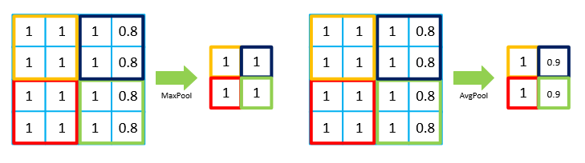

.. _cnnlPoolingBackward:

cnnlPoolingBackward
--------------------

常用于反向训练过程中池化（pool）data梯度运算以及正向推理过程中上采样运算，其运算过程可以理解为池化的反向过程，主要由反池化运算组成。cnnlPoolingBackward一般有两种模式avgpoolbp和maxpoolbp。

例如正向pool（无overlap）过程如下图，输入数据规模为4×4，kernel size为2×2，stride size为2×2，dilation为1，输出大小为2×2。

.. figure:: ../images/poolbp3.png

池化的反向过程如下图所示，将1个像素的梯度传递给4个像素，但是需要保证传递的loss（或者梯度）总和不变，根据这条原则，Avgpool和Maxpool的反向传播是不同的。其中，avgpoolbp很容易让人理解错的地方就会简单认为直接把梯度复制4遍之后反向传播回去，但是这样会造成loss之和变为原来的4倍，网络是会产生梯度爆炸的，因此avgpoolbp是将1个梯度值等分成4份分配给前一层。maxpoolbp是将梯度值直接传给前一层某一个像素，而其他像素不接受梯度，也就是0。

.. figure:: ../images/poolbp1.png

如果正向pool（有overlap）过程如下图，输入数据规模为4×4，kernel size为2×2，stride size为1×1，dilation为1，输出大小为3×3。

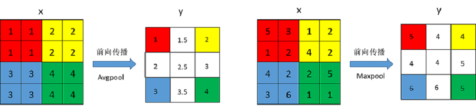

池化的反向过程如下图所示，将1个像素的梯度传递给4个像素，但是需要保证传递的loss（或者梯度）总和不变，根据这条原则，输出overlap部分需要叠加在一起：

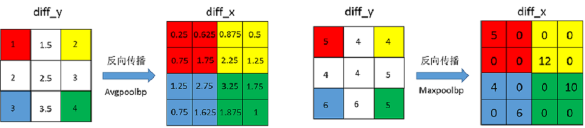

cnnlPoolingIndex
-------------------

求一个kernel中最大值的index。

计算公式如下：

公式如下：

.. math::

   \begin{aligned}
   output[n,c,i,j] &= \mathrm{argmax} (input[n,c,i \times sh+di,j \times sw+dj]), \\ & \quad (0<=di<kh,0<=dj<kw), \quad output \in [0, kh \times kw) \\
   \end{aligned}

其中：

- ``sw`` 和 ``sh`` 表示W和H两个方向的stride。
- ``kw`` 和 ``kh`` 表示W和H两个方向的kernel size。

cnnlPoolingForwardWithIndex
-----------------------------

融合cnnlPoolingForward和cnnlPoolingIndex算子，计算最大池化的值以及索引index。

cnnlPow
----------

计算幂函数。y仅支持整数型输入，x为任意输入。

公式如下：

.. math::

   z_i = {x_i}^{y_i}

其中：

- ``i`` 表示一个多维数组的索引, 表示多维 tensor, 例如在 4D 时可以表示 (n,c,h,w)。
- :math:`x_i`、:math:`y_i` 表示浮点类型输入 tensor， 输入 tensor 组中 ``i`` 索引处的元素。
- :math:`z_i`  表示输出 tensor，多元组中 ``i`` 索引处的元素。

cnnlPowN
----------

计算幂函数。

.. math::

   z_i = {x_i}^{y_i}

其中：

- ``y`` 仅支持 int16 类型输入，``x`` 为任意浮点类型输入。
- ``i`` 表示一个多元组的索引, 表示多维张量, 例如在4维时可以表示(n,c,h,w)。
- :math:`x_i` 和 :math:`y_i` 表示多元组中 ``i`` 索引处的元素。

cnnlPowR
----------

计算幂函数。

公式如下：

.. math::

   z_i = {x_i}^{y_i}

其中：

- 仅支持 ``x`` > = 0，``y`` 为任意浮点类型输入。
- ``i`` 表示一个多元组的索引, 表示多维张量, 例如在4维时可以表示(n,c,h,w)。
- :math:`x_i` 和 :math:`y_i` 表示多元组中 ``i`` 索引处的元素。

cnnlPrelu
------------

实现特征的提取功能。

计算公式如下：

.. math::

   \begin{aligned}
   PRelu(x)=
    \begin{cases} \alpha x, & x\in(-\infty, 0] \\ {x}, & x\in(0, +\infty) \end{cases}
   \end{aligned}

cnnlPreluBackward
--------------------

人工智能激活函数prelu反向计算。

计算公式如下：

``x`` 的梯度：

.. math::

      \begin{aligned}
      \frac{PRelu(x)}{\delta x}=
      \begin{cases} 1 & x>0 \\ \alpha & x<=0 \end{cases}
      \end{aligned}

.. math::

      \begin{aligned}
      \frac{\delta L}{\delta x}=
      \begin{cases} \delta^{l+1} & x>0 \\ {\alpha\delta^{l+1}} & x<=0 \end{cases}
      \end{aligned}

``alpha`` 的梯度：

.. math::

      \begin{aligned}
      \frac{PRelu(x)}{\delta\alpha}=
      \begin{cases} 0 & x>0 \\ x & x<=0 \end{cases}
      \end{aligned}

.. math::

      \begin{aligned}
      \frac{\delta L}{\delta\alpha}=
      \begin{cases} 0 & x>0 \\ {x\delta^{l+1}} & x<=0 \end{cases}
      \end{aligned}

其中：

- ``alpha`` 是需要学习的参数，``L`` 表示梯度的层数。

cnnlPsamaskBackward
--------------------

根据mask大小、计算方式以及输出的梯度，计算输入的梯度。
对于COLLECT计算方式，计算公式如下：

.. math::

   \begin{array}{lcl}
   half\_mask\_h = (h\_mask - 1) / 2 \\
   half\_mask\_w = (w\_mask - 1) / 2 \\
   dx[n][h][w][hidx * w\_mask + widx] = dy[n][h][w][(hidx + h - half\_mask\_h)* \\
   w\_feature + widx + w - half\_mask\_w] \\
   hidx \in [max(0, half\_mask\_h  - h),min(h\_mask, h\_feature + half\_mask\_h)] \\
   widx \in [max(0, half\_mask\_w  - w),min(w\_mask, w\_feature + half\_mask\_w)]  \\
   \end{array}

其中：

- ``n``、``h`` 和 ``w`` 分别表示当前的NHW维度。
- ``dx`` 是输入的梯度。
- ``dy`` 是输出的梯度。

对于DISTRIBUTE计算方式，计算公式如下：

.. math::

   \begin{array}{lcl}
   half\_mask\_h = (h\_mask - 1) / 2  \\
   half\_mask\_w = (w\_mask - 1) / 2  \\
   dx[n][h][w][hidx * w\_mask + widx] = dy[n][hidx + h - half\_mask\_h][widx + w - half\_mask\_w][c]  \\
   hidx \in [max(0, half\_mask\_h  - h),min(h\_mask, h\_feature + half\_mask\_h)] \\
   widx \in [max(0, half\_mask\_w  - w),min(w\_mask, w\_feature + half\_mask\_w)] \\
   \end{array}

其中：

- ``n``、 ``h``、``w`` 和 ``c`` 分别表示当前的NHWC维度。
- ``dx`` 是输入的梯度。
- ``dy`` 是输出的梯度。

cnnlPsamaskForward
-------------------

根据mask大小以及计算方式，为输入打上mask。
对于COLLECT计算方式，计算公式如下：

.. math::

   \begin{array}{lcl}
   half\_mask\_h = (h\_mask - 1) / 2  \\
   half\_mask\_w = (w\_mask - 1) / 2  \\
   y[n][h][w][(hidx + h - half\_mask\_h) * w\_feature + widx + w - half\_mask\_w] = x[n][h][w][hidx * w\_mask + widx] \\
   hidx \in [max(0, half\_mask\_h  - h),min(h\_mask, h\_feature + half\_mask\_h)] \\
   widx \in [max(0, half\_mask\_w  - w),min(w\_mask, w\_feature + half\_mask\_w)] \\\
   \end{array}

其中：

- ``n``、``h`` 和 ``w`` 分别表示当前的NHW维度。
- ``x`` 是输入的数据。
- ``y`` 是输出的数据。

对于DISTRIBUTE计算方式，计算公式如下：

.. math::

   \begin{array}{lcl}
   half\_mask\_h = (h\_mask - 1) / 2 \\
   half\_mask\_w = (w\_mask - 1) / 2  \\
   y[n][hidx + h - half\_mask\_h][widx + w - half\_mask\_w][c] = x[n][h][w][hidx * w\_mask + widx] \\
   hidx \in [max(0, half\_mask\_h  - h),min(h\_mask, h\_feature + half\_mask\_h)] \\
   widx \in [max(0, half\_mask\_w  - w),min(w\_mask, w\_feature + half\_mask\_w)] \\
   \end{array}

其中：

- ``n``、``h``、``w`` 和 ``c`` 分别表示当前的NHWC维度。
- ``x`` 是输入的数据。
- ``y`` 是输出的数据。

cnnlQR
--------

实现矩阵的广义QR分解算法。对于任意一个输入的矩阵A，将其分解为一个正交矩阵Q乘以一个上三角矩阵R的形式。其中，正交矩阵Q的逆矩阵即为Q的转置 :math:`Q^{T}` ，A可以不是一个方阵。当some参数为true时，可以求解输入矩阵A的部分QR分解，此时Q为一个半正交矩阵,满足 :math:`Q^{T} * Q = E` 。

cnnlQuantizeConvolutionForward
-------------------------------

卷积运算。运算详情见 :ref:`cnnlConvolutionForward` 。该接口与 :ref:`cnnlConvolutionForward` 在支持的特性上有所区别。详情请参考《Cambricon CNNL Developer Guide》。

cnnlQuantizeV1
---------------------------------------

对输入的浮点数据（float32和float16）进行统计，输出定点数据。量化参数为positon、scale、offset，通过host端传入。

公式详情请参考 :ref:`量化`。

cnnlQuantizeV2
---------------------------------------

对输入的浮点数据（float32和float16）进行统计，输出定点数据。量化参数为positon、scale、offset，通过device端传入。

公式详情请参考 :ref:`量化`。

cnnlQuantizeBatchMatMul
-------------------------

量化的batch矩阵乘。

公式如下：

.. math::

   C[i] = A[i] * B[i], i \in [0, batchSize - 1]

展开如下：

.. math::

   C[i]_{m,n} = \sum_{k=1}^K A[i]_{m,k}B[i]_{k,n}, i \in [0, batchSize - 1]

其中：

- ``batchSize`` 表示 batch 的大小。
- ``A[i]`` 表示 ``M * K`` 矩阵。``B[i]`` 表示 ``K * N`` 矩阵。``C[i]`` 表示 ``M * N`` 矩阵。
- ``m`` 表示矩阵 ``A[i]`` 和矩阵 ``C[i]`` 的行数。``n`` 表示矩阵 ``B[i]`` 和矩阵 ``C[i]`` 的行数。``k`` 表示矩阵 ``A[i]`` 的列数和矩阵 ``B[i]`` 的行数。

该接口与 :ref:`cnnlBatchMatMul` 在支持的特性上有所区别。详情请参考《Cambricon CNNL Developer Guide》。

cnnlQuantizeBatchMatMulBCast
------------------------------

量化的广播batch矩阵乘。通常，带广播功能的batch矩阵相乘计算会在一批矩阵上执行矩阵-矩阵乘法。

公式如下：

.. math::

   C[P1,P2,...,Pk,m,n] = A[N1,N2,...,Nk,m,k]* B[M1,M2,...,Mk,k,n]

该接口与 :ref:`cnnlBatchMatMulBCast` 在支持的特性上有所区别。详情请参考《Cambricon CNNL Developer Guide》。

cnnlQuantizeMatMul
--------------------

量化矩阵乘，对给定的输入左矩阵 A 和右矩阵 B，按照矩阵乘法运算得到输出矩阵 C。

公式如下：

.. math::

   \begin{aligned}
   C_{m,n} = \sum_{k=1}^K A_{m,k}B_{k,n}
   \end{aligned}

其中 m、n、k 分别为左矩阵的行数、左矩阵的列数（或者右矩阵的行数）、右矩阵的列数。该接口与 :ref:`cnnlMatMul` 在支持的特性上有所区别。详情请参考《Cambricon CNNL Developer Guide》。

cnnlQuantizeParam
------------------

详见 :ref:`量化`。

cnnlQuantizeStrategy
---------------------

根据输入的浮点数据(float32和float16)、量化位宽、滑动平均值等参数，自适应增加位宽(int8->int16->int31)，更新滑动平均值，输出动态的量化周期。

详情请参考 :ref:`自适应位宽量化策略`。

cnnlRandGenerateDescreteUniform
-------------------------------

生成[min, max) 数值范围之间为INT、FLOAT或HALF且均匀分布的随机数，，其中min为用户输入值的最小值，max为用户输入值的最大值。

cnnlRandGenerateTruncatedNormal
-------------------------------

从截断的正态分布中生成生成随机数。截断正态分布是在标准正态分布的基础上，丢弃 [均值 - 2 * 标准差， 均值 + 2 * 标准差] 之外的数据而得到的分布。

cnnlRandGenerateUniform
--------------------------

从均匀分布中生成随机值。

cnnlRandGenerateUniformInt
-------------------------------

生成[min, max) 数值范围之间为INT类型且均匀分布的随机数，且均匀分布，其中min为用户输入值的最小值，max为用户输入值的最大值。

cnnlRandGenerateMultinomial
------------------------------

根据输入滤波器tensor的每一行生成符合多项分布的随机数，每个随机数表示的是input滤波器的索引。

.. math::

   f(x)=\frac{n!}{x_1! \cdots x_k!}p_1^{x_1}\cdots p_k^{x_k}

其中：

- 其中n > 0，表示试验次数。
- :math:`p_k^{x_i}` 表示第 :math:`x_i` 次试验结果为事件 :math:`p_k` 的概率。

cnnlRandGenerateNormal
------------------------------

将均匀分布随机数，使用box-muller算法转为正态分布随机数序列。

cnnlReciprocal
-----------------------------

对输入求倒数，得到输出结果。

公式如下：

.. math::

   output_i = 1.0 / input_i

其中：

- :math:`input_i` 为输入。
- :math:`output_i` 为输出。

cnnlReduce
------------

根据axis参数，对相应维度的元素进行累加、累乘、求最大、求最小、求均值等操作。

公式如下：

以 axis = 0 为例， 其中 ``X`` 和 ``Y`` 为 ``shape=(I,J,K,M,N)`` 的向量，``x`` 为 ``X`` 中第 ``(i,j,k,m,n)`` 个元素 ，``y`` 为 ``Y`` 中第 ``(0,j,k,m,n)`` 个元素。

reduce_sum 公式如下：

.. math::

   \begin{aligned}
   Y_{(I,J,K,M,N)}=ReduceSum(X_{(I,J,K,M,N)}),
   y_{(0,j,k,m,n)}=\sum_{i=0}^{I}x_{(i,j,k,m,n)}
   \end{aligned}

reduce_mean 公式如下：

.. math::

   \begin{aligned}
   Y_{(I,J,K,M,N)}=ReduceMean(X_{(I,J,K,M,N)}),
   y_{(0,j,k,m,n)}=\frac{\sum_{i=0}^{I}x_{(i,j,k,m,n)}}{I}
   \end{aligned}

reduce_prod 公式如下：

.. math::

   \begin{aligned}
   Y_{(I,J,K,M,N)}=ReduceProd(X_{(I,J,K,M,N)}),
   y_{(0,j,k,m,n)}=\prod_{i=0}^{I}x_{(i,j,k,m,n)}
   \end{aligned}

reduce_asum 公式如下：

.. math::

   \begin{aligned}
   Y_{(I,J,K,M,N)}=ReduceASum(X_{(I,J,K,M,N)}),
   y_{(0,j,k,m,n)}=\sum_{i=0}^{I}|x_{(i,j,k,m,n)}|
   \end{aligned}

reduce_sumsq 公式如下：

.. math::

   \begin{aligned}
   Y_{(I,J,K,M,N)}=ReduceSumSq(X_{(I,J,K,M,N)}),
   y_{(0,j,k,m,n)}=\sum_{i=0}^{I}(x_{(i,j,k,m,n)})^2
   \end{aligned}

reduce_norm1 公式如下：

.. math::

   \begin{aligned}
   Y_{(I,J,K,M,N)}=ReduceNorm1(X_{(I,J,K,M,N)}),
   y_{(0,j,k,m,n)}=\sum_{i=0}^{I}\mid x_{(i,j,k,m,n)}\mid
   \end{aligned}

reduce_norm2 公式如下：

.. math::

   \begin{aligned}
   Y_{(I,J,K,M,N)}=ReduceNorm2(X_{(I,J,K,M,N)}),
   y_{(0,j,k,m,n)}=\sqrt{\sum_{i=0}^{I}x_{(i,j,k,m,n)}^2}
   \end{aligned}

reduce_normp 公式如下：

.. math::

   \begin{aligned}
   Y_{(I,J,K,M,N)}=ReduceNormP(X_{(I,J,K,M,N)}),
   y_{(0,j,k,m,n)}=(\sum_{i=0}^{I}x_{(i,j,k,m,n)}^p)^(1/p)
   \end{aligned}

reduce_max 公式如下：

.. math::

   \begin{aligned}
   Y_{I,J,K,M,N}=ReduceMax(X_{(I,J,K,M,N)}),
   y_{(0,j,k,m,n)}=\max_{i=0}^{I}{x_{(i,j,k,m,n)}}
   \end{aligned}

reduce_min 公式如下：

.. math::

   \begin{aligned}
   Y_{I,J,K,M,N}=ReduceMin(X_{(I,J,K,M,N)}),
   y_{(0,j,k,m,n)}=\min_{i=0}^{I}{x_{(i,j,k,m,n)}}
   \end{aligned}

reduce_max_last_index 公式如下：

.. math::

   \begin{aligned}
   Y_{I,J,K,M,N}=ReduceMaxLastIndex(X_{(I,J,K,M,N)}),
   y_{(0,j,k,m,n)}=\max_{i=0}^{I}{x_{(i,j,k,m,n)}}
   \end{aligned}

reduce_min_last_index 公式如下：

.. math::

   \begin{aligned}
   Y_{I,J,K,M,N}=ReduceMinLastIndex(X_{(I,J,K,M,N)}),
   y_{(0,j,k,m,n)}=\min_{i=0}^{I}{x_{(i,j,k,m,n)}}
   \end{aligned}

reduce_and 公式如下：

.. math::

   \begin{aligned}
   Y_{(I,J,K,M,N)}=ReduceAnd(X_{(I,J,K,M,N)}),
   y_{(0,j,k,m,n)} = x_{(0,j,k,m,n)} \&\&_{i=1}^{I} x_{(i,j,k,m,n)}
   \end{aligned}

reduce_or 公式如下：

.. math::

   \begin{aligned}
   Y_{(I,J,K,M,N)}=ReduceOr(X_{(I,J,K,M,N)}),
   y_{(0,j,k,m,n)} = x_{(0,j,k,m,n)} ||_{i=1}^{I} x_{(i,j,k,m,n)}
   \end{aligned}

cnnlReflectionPad2d
---------------------

按给定paddings数组，对指定的对应维度进行输入张量外围填充。填充元素为对应维度上的对称元素。填充元素为对应维度上的原始input镜像对称元素。给定paddings数组中指定的对应维度填充参数进行input tensor外围填充。paddings是形状为len(paddings)=4 或 len(paddings)=2的整数类型数组，具体规模形状要配合input：{input tensor的dims=4，len(paddings)=4}，其paddings=[pad_left, pad_right, pad_top, pad_bottom]，{input tensor的dims=3，len(paddings)=2}，其paddings=[pad_left, pad_right]。

示例说明，请参看《Cambricon CNNL Developer Guide》。

cnnlReflectionPadBackward
--------------------------

计算ReflectionPad算子的梯度，用于解决经过padding的数据在训练过程中梯度反向传播问题。

cnnlReorg
------------

通过把C维度向HW维度折叠或者反之操作来满足可以与另一个张量concat的条件。

cnnlRepeatInterleave
------------------------

根据给定参数 ``repeats`` 对输入张量的指定维度进行复制。

cnnlReplicationPad2d
----------------------

按给定paddings数组，对指定的对应维度进行输入张量外围填充。该算子为重复填充算子，使用的填充元素为边界元素。按给定paddings数组中指定的对应维度填充参数进行input tensor外围填充。paddings是形状为len(paddings)=4 或 len(paddings)=2的整数类型数组，具体规模形状要配合input：
{input tensor的dims=4，len(paddings)=4}，其paddings=[pad_left, pad_right, pad_top, pad_bottom]，{input tensor的dims=3，len(paddings)=2}，其paddings=[pad_left, pad_right]。

示例说明，请参看《Cambricon CNNL Developer Guide》。

cnnlReplicationPadBackward
--------------------------

计算ReplicationPad算子的梯度，用于解决经过padding的数据在训练过程中梯度反向传播问题。

cnnlRMSProp
-----------------

一种常见的基于梯度下降的优化算法，会累积近期的梯度信息，完成网络参数的更新。

公式如下：

.. math::

   mean\_square += (grad * grad - mean\_square) * (1 - rho)

.. math::

   mom = mom * momentum + \frac{(grad * lr)}{\sqrt{mean\_square + epsilon}}

.. math::

   var -= mom

其中 ``var`` 为网络滤波器，``lr`` 为学习率，``grad`` 为梯度值。``mean_square``、``mom`` 和 ``var`` 需要再每次迭代更新并保存。

cnnlRNNForwardInference
------------------------------

RNN 是一类用于处理序列数据的网络，它解决了传统网络不能从数据中共享位置的特征的问题。

cnnlRNNForwardInference用于推理场景下的RNN计算。RNN支持skip_input、projection、peephole、bias、mask、filter_order、output_mode等模式。

- 如果设置skip_input模式，设置 ``cnnlSetRNNInputMode`` 接口中 ``input_mode`` 参数设为 ``CNNL_RNN_SKIP_INPUT`` 。
- 如果设置projection模式，设置 ``cnnlSetRNNProjectionLayers`` 接口中 ``rec_proj_size`` 参数设为大于0。
- 如果设置peephole模式，设置 ``cnnlSetRNNPeepholeMode`` 接口中 ``peephole_mode`` 参数设为 ``CNNL_LSTM_PEEPHOLE_ENABLED`` 。
- 如果设置mask模式为ENABLED，设置 ``cnnlSetRNNMaskMode`` 接口中 ``mask_mode`` 参数设为 ``CNNL_LSTM_MASK_ENABLED`` 。
- 如果设置mask模式为CONST，设置 ``cnnlSetRNNMaskMode`` 接口中 ``mask_mode`` 参数设为 ``CNNL_LSTM_MASK_CONST`` 。
- 如果设置mask模式为SEQUENCES，设置 ``cnnlSetRNNMaskMode`` 接口中 ``mask_mode`` 参数设为 ``CNNL_LSTM_MASK_SEQUENCES`` 。
- 如果设置filter_order为IFGO，设置 ``cnnlSetRNNWeightOrder`` 接口中 ``filter_order`` 参数设为 ``CNNL_LSTM_IFGO`` 。
- 如果设置filter_order为IFOG，设置 ``cnnlSetRNNWeightOrder`` 接口中 ``filter_order`` 参数设为 ``CNNL_LSTM_IFOG`` 。
- 如果设置filter_order为IOFG，设置 ``cnnlSetRNNWeightOrder`` 接口中 ``filter_order`` 参数设为 ``CNNL_LSTM_IOFG`` 。
- 如果设置output_mode为NO_OUT_LAYER，设置 ``cnnlSetRNNOutPutMode`` 接口中 ``output_mode`` 参数设为 ``CNNL_RNN_NO_OUT_LAYER`` 。
- 如果设置output_mode为HAS_OUT_LAYER，设置 ``cnnlSetRNNOutPutMode`` 接口中 ``output_mode`` 参数设为 ``CNNL_RNN_HAS_OUT_LAYER`` 。

公式如下：

- 如果mask模式为 ``CNNL_LSTM_MASK_DISABLED`` , rnn_mode为 ``CNNL_RNN_RELU`` 公式为：

.. math::

    \LARGE{hy_t} &= relu(w_0\cdot{x_{t-1}}+w_1\cdot{hx_{t-1}}+b_0+b_1)\\
    \LARGE{y_t} &= relu(w_2\cdot{hy_t}+b_2)

- 如果mask模式为 ``CNNL_LSTM_MASK_ENABLED`` , rnn_mode为 ``CNNL_RNN_RELU`` 公式为：

.. math::

    \LARGE{hy_t} &= relu(w_0\cdot{x_{t-1}}+w_1\cdot{hx_{t-1}}+b_0+b_1)\\
    \LARGE{hy_t} &= hy_t * mask + (1 - mask) * hx_{t-1}\\
    \LARGE{y_t} &= relu(w_2\cdot{hy_t}+b_2)

- 如果mask模式为 ``CNNL_LSTM_MASK_CONST`` , rnn_mode为 ``CNNL_RNN_RELU`` 公式为：

.. math::

    \LARGE{hx_{t-1}} &= hx_{t-1}*mask\\
    \LARGE{hy_t} &= relu(w_0\cdot{x_{t-1}}+w_1\cdot{hx_{t-1}}+b_0+b_1)\\
    \LARGE{y_t} &= relu(w_2\cdot{hy_t}+b_2)

- 如果mask模式为 ``CNNL_LSTM_MASK_DISABLED`` , rnn_mode为 ``CNNL_RNN_TANH`` 公式为：

.. math::

    \LARGE{hy_t} &= tanh(w_0\cdot{x_{t-1}}+w_1\cdot{hx_{t-1}}+b_0+b_1)\\
    \LARGE{y_t} &= tanh(w_2\cdot{hy_t}+b_2)

- 如果mask模式为 ``CNNL_LSTM_MASK_ENABLED`` , rnn_mode为 ``CNNL_RNN_TANH`` 公式为：

.. math::

    \LARGE{hy_t} &= tanh(w_0\cdot{x_{t-1}}+w_1\cdot{hx_{t-1}}+b_0+b_1)\\
    \LARGE{hy_t} &= hy_t * mask + (1 - mask) * hx_{t-1}\\
    \LARGE{y_t} &= tanh(w_2\cdot{hy_t}+b_2)

- 如果mask模式为 ``CNNL_LSTM_MASK_CONST`` , rnn_mode为 ``CNNL_RNN_TANH`` 公式为：

.. math::

    \LARGE{hx_{t-1}} &= hx_{t-1}*mask\\
    \LARGE{hy_t} &= tanh(w_0\cdot{x_{t-1}}+w_1\cdot{hx_{t-1}}+b_0+b_1)\\
    \LARGE{y_t} &= relu(w_2\cdot{hy_t}+b_2)

- 如果mask模式为 ``CNNL_LSTM_MASK_DISABLED`` , rnn_mode为 ``CNNL_LSTM`` 公式为：

.. math::

    \LARGE{i_t} &= sigmoid(w_0\cdot{x_{t-1}}+w_4\cdot{hx_{t-1}}+b_8*cx_{t-1}+b_0+b_4)\\
    \LARGE{f_t} &= sigmoid(w_1\cdot{x_{t-1}}+w_5\cdot{hx_{t-1}}+b_9*cx_{t-1}+b_1+b_5)\\
    \LARGE{g_t} &= tanh(w_2\cdot{x_{t-1}} + w_6\cdot{hx_{t-1}}+b_2+b_6)\\
    \LARGE{cy_t} &= f_t*cx_{t-1}+i_t*g_t\\
    \LARGE{o_t} &= sigmoid(w_3\cdot{x_{t-1}}+w_7\cdot{hx_{t-1}}+b_{10}*cy_t+b_3+b_7)\\
    \LARGE{hy_t} &= o_t*tanh(cy_t)\\
    \LARGE{hy_t} &= w_8\cdot{hy_t}

- 如果mask模式为 ``CNNL_LSTM_MASK_ENABLED`` , rnn_mode为 ``CNNL_LSTM`` 公式为：

.. math::

    \LARGE{i_t} &= sigmoid(w_0\cdot{x_{t-1}}+w_4\cdot{hx_{t-1}}+b_8*cx_{t-1}+b_0+b_4)\\
    \LARGE{f_t} &= sigmoid(w_1\cdot{x_{t-1}}+w_5\cdot{hx_{t-1}}+b_9*cx_{t-1}+b_1+b_5)\\
    \LARGE{g_t} &= tanh(w_2\cdot{x_{t-1}} + w_6\cdot{hx_{t-1}}+b_2+b_6)\\
    \LARGE{cy_t} &= f_t*cx_{t-1}+i_t*g_t\\
    \LARGE{o_t} &= sigmoid(w_3\cdot{x_{t-1}}+w_7\cdot{hx_{t-1}}+b_{10}*cy_t+b_3+b_7)\\
    \LARGE{hy_t} &= o_t*tanh(cy_t)\\
    \LARGE{hy_t} &= w_8\cdot{hy_t}\\
    \LARGE{cy_t} &= cy_t * mask + (1 - mask) * cx_{t-1}\\
    \LARGE{hy_t} &= hy_t * mask + (1 - mask) * hx_{t-1}

- 如果mask模式为 ``CNNL_LSTM_MASK_CONST`` , rnn_mode为 ``CNNL_LSTM`` 公式为：

.. math::

    \LARGE{hx_{t-1}} &= hx_{t-1}*mask\\
    \LARGE{i_t} &= sigmoid(w_0\cdot{x_{t-1}}+w_4\cdot{hx_{t-1}}+b_8*cx_{t-1}+b_0+b_4)\\
    \LARGE{f_t} &= sigmoid(w_1\cdot{x_{t-1}}+w_5\cdot{hx_{t-1}}+b_9*cx_{t-1}+b_1+b_5)*mask\\
    \LARGE{g_t} &= tanh(w_2\cdot{x_{t-1}} + w_6\cdot{hx_{t-1}}+b_2+b_6)\\
    \LARGE{cy_t} &= f_t*cx_{t-1}+i_t*g_t\\
    \LARGE{o_t} &= sigmoid(w_3\cdot{x_{t-1}}+w_7\cdot{hx_{t-1}}+b_{10}*cy_t+b_3+b_7)\\
    \LARGE{hy_t} &= o_t*tanh(cy_t)\\
    \LARGE{hy_t} &= w_8\cdot{hy_t}

- 如果mask模式为 ``CNNL_LSTM_MASK_DISABLED`` , rnn_mode为 ``CNNL_LSTM_TANH`` 公式为：

.. math::

    \LARGE{i_t} &= sigmoid(w_0\cdot{x_{t-1}}+w_4\cdot{hx_{t-1}}+b_8*tanh(cx_{t-1})+b_0+b_4)\\
    \LARGE{f_t} &= sigmoid(w_1\cdot{x_{t-1}}+w_5\cdot{hx_{t-1}}+b_9*tanh(cx_{t-1})+b_1+b_5)\\
    \LARGE{g_t} &= tanh(w_2\cdot{x_{t-1}} + w_6\cdot{hx_{t-1}}+b_2+b_6)\\
    \LARGE{cy_t} &= f_t*cx_{t-1}+i_t*g_t\\
    \LARGE{o_t} &= sigmoid(w_3\cdot{x_{t-1}}+w_7\cdot{hx_{t-1}}+b_{10}*tanh(cy_t)+b_3+b_7)\\
    \LARGE{hy_t} &= o_t*tanh(cy_t)\\
    \LARGE{hy_t} &= w_8\cdot{hy_t}

- 如果mask模式为 ``CNNL_LSTM_MASK_ENABLED`` , rnn_mode为 ``CNNL_LSTM_TANH`` 公式为：

.. math::

    \LARGE{i_t} &= sigmoid(w_0\cdot{x_{t-1}}+w_4\cdot{hx_{t-1}}+b_8*tanh(cx_{t-1})+b_0+b_4)\\
    \LARGE{f_t} &= sigmoid(w_1\cdot{x_{t-1}}+w_5\cdot{hx_{t-1}}+b_9*tanh(cx_{t-1})+b_1+b_5)\\
    \LARGE{g_t} &= tanh(w_2\cdot{x_{t-1}} + w_6\cdot{hx_{t-1}}+b_2+b_6)\\
    \LARGE{cy_t} &= f_t*cx_{t-1}+i_t*g_t\\
    \LARGE{o_t} &= sigmoid(w_3\cdot{x_{t-1}}+w_7\cdot{hx_{t-1}}+b_{10}*tanh(cy_t)+b_3+b_7)\\
    \LARGE{hy_t} &= o_t*tanh(cy_t)\\
    \LARGE{hy_t} &= w_8\cdot{hy_t}\\
    \LARGE{cy_t} &= cy_t * mask + (1 - mask) * cx_{t-1}\\
    \LARGE{hy_t} &= hy_t * mask + (1 - mask) * hx_{t-1}

- 如果mask模式为 ``CNNL_LSTM_MASK_CONST`` , rnn_mode为 ``CNNL_LSTM_TANH`` 公式为：

.. math::

    \LARGE{hx_{t-1}} &= hx_{t-1}*mask\\
    \LARGE{i_t} &= sigmoid(w_0\cdot{x_{t-1}}+w_4\cdot{hx_{t-1}}+b_8*tanh(cx_{t-1})+b_0+b_4)\\
    \LARGE{f_t} &= sigmoid(w_1\cdot{x_{t-1}}+w_5\cdot{hx_{t-1}}+b_9*tanh(cx_{t-1})+b_1+b_5)*mask\\
    \LARGE{g_t} &= tanh(w_2\cdot{x_{t-1}} + w_6\cdot{hx_{t-1}}+b_2+b_6)\\
    \LARGE{cy_t} &= f_t*cx_{t-1}+i_t*g_t\\
    \LARGE{o_t} &= sigmoid(w_3\cdot{x_{t-1}}+w_7\cdot{hx_{t-1}}+b_{10}*tanh(cy_t)+b_3+b_7)\\
    \LARGE{hy_t} &= o_t*tanh(cy_t)\\
    \LARGE{hy_t} &= w_8\cdot{hy_t}\\

- 如果mask模式为 ``CNNL_LSTM_MASK_SEQUENCES``:
  当batch中有效的输入序列长度大于0时，hy、cy和y的计算过程参考 ``CNNL_LSTM_MASK_ENABLED`` 模式，y中无效的输出置0;
  当batch中有效的输入序列长度为0时，hy、cy和y全部置0。

其中，对于RNN：

- :math:`w_0` 表示输入对应的滤波器。
- :math:`w_1` 表示hx对应的滤波器。
- :math:`w_2` 表示y对应的滤波器。
- :math:`b_0` 表示输入对应的偏置。
- :math:`b_1` 表示hx对应的偏置。
- :math:`b_2` 表示y对应的偏置。

对于LSTM:

- :math:`w_0` - :math:`w_3` 表示输入对应的滤波器。
- :math:`w_4` - :math:`w_7` 表示hx对应的滤波器。
- :math:`b_0` - :math:`b_3` 表示输入对应的偏置。
- :math:`b_4` - :math:`b_7` 表示hx对应的偏置。
- :math:`b_8` - :math:`b_{10}` 表示peephole对应的偏置。
- 根据不同的配置参数，某些滤波器，偏置可能会不存在。
- 滤波器，偏置的顺序根据配置参数的不同可能会有调整。
- :math:`i_t`、:math:`f_t`、:math:`o_t`、:math:`g_t` 分别表示当前时刻输入门，遗忘门，输出门和更新门的结果。
- ``t`` 下标表示当前时间片输出。
- ``cx`` 表示细胞状态（cell state）输入。
- ``cy`` 表示每个时间片 ``cx`` 经过cell的输出。
- ``hx`` 表示隐藏状态（hidden state）输入。
- ``hy`` 表示每个时间片 ``hx`` 经过RNN cell的输出。
- ``t-1`` 下标表示为上一个时间片的输出。
- ``i``、``f``、``g``、``o`` 下标分别表示四个门中相关。
- ``sigmoid``、``tanh``、``relu`` 表示激活函数。

cnnlRNNForwardTraining
---------------------------

RNN 是一类用于处理序列数据的网络，它解决了传统网络不能从数据中共享位置的特征的问题。

cnnlRNNForwardTraining用于训练场景下的RNN计算。

公式如下：

.. math::

    \LARGE{i_t} = sigmoid(w_0\cdot{x_{t-1}}+w_4\cdot{hx_{t-1}}+b_0+b_4)\\
    \LARGE{f_t} = sigmoid(w_1\cdot{x_{t-1}}+w_5\cdot{hx_{t-1}}+b_1+b_5)\\
    \LARGE{g_t} = tanh(w_2\cdot{x_{t-1}} + w_6\cdot{hx_{t-1}}+b_2+b_6)\\
    \LARGE{o_t} = sigmoid(w_3\cdot{x_{t-1}}+w_7\cdot{hx_{t-1}}+b_3+b_7)\\
    \LARGE{cy_t} = f_t*cx_{t-1}+i_t*g_t\\
    \LARGE{hy_t} = o_t*tanh(cy_t)

其中：

- :math:`w_0` - :math:`w_3` 表示输入对应的滤波器。
- :math:`w_4` - :math:`w_7` 表示hx对应的滤波器。
- :math:`b_0` - :math:`b_3` 表示输入对应的偏置。
- :math:`b_4` - :math:`b_7` 表示hx对应的偏置。
- :math:`i_t`、:math:`f_t`、:math:`o_t`、:math:`g_t` 分别表示当前时刻输入门，遗忘门，输出门和更新门的结果。
- ``t`` 下标表示当前时间片输出。
- ``cx`` 表示细胞状态（cell state）输入。
- ``cy`` 表示每个时间片 ``cx`` 经过cell的输出。
- ``hx`` 表示隐藏状态（hidden state）输入。
- ``hy`` 表示每个时间片 ``hx`` 经过RNN cell的输出。
- ``ry`` 表示存在projection时的隐藏输出。
- ``my`` 表示存在mask时的隐藏输出。
- ``t-1`` 下标表示为上一个时间片的输出。
- ``i``、``f``、``g``、``o`` 下标分别表示四个门中相关。
- ``sigmoid`` 和 ``tanh`` 表示激活函数。

cnnlRNNBackwardData
---------------------------

计算RNN前向输出数据所对应的梯度以及相应的门数据。

cnnlRNNBackwardWeights
---------------------------

计算RNN内部滤波器和bias的梯度数据。

cnnlRoiAlign
---------------------------

从ROI池化的局限性源头改进，取消了量化操作，利用双线性插值计算对应点的像素值，从而将整个特征聚集的过程转化为一组连续的操作。

在这个过程中，该算子并不是简单地补充边界的坐标点再进行池化，而是用了一套全新的流程：

- 遍历所有候选区域，并保持浮点数边界。
- 分割候选区域单元，每个单元同时不做量化。
- 确定各个单元四个角的坐标，通过双线性插值的方法计算对应点的位置，再进行池化操作。

cnnlRoiAlignBackward
---------------------------

给出输出的梯度、ROI框的位置、几个参数，即可得到输入特征图的梯度。

示例如下：

输入grads为[[[[1.0]]]]，boxes为[[0.0, 0.0, 0.0, 1.0, 1.0]]，参数中spatial_scale=1.0, sampling_ratio=2, aligned=false，则输出：

grads_image为：[[[[0.25]], [[0.25]]], [[[0.25]], [[0.25]]]]。

cnnlRoiAlignRotatedForward
---------------------------

以双线性插值的方式提取非整数大小且带有旋转的roi的特征图。在FOTS网络中，roi_align_rotated算子用于统一检测和识别到端到端的pipeline中，输入检测分支中得到的带有旋转角度的bounding boxes，提取对应的特征图用于后续的识别。

cnnlRoiAlignRotatedBackward
---------------------------

cnnlRoiAlignRotatedForward的反向算子，用于计算输入特征图的梯度。

cnnlRoiPoolingForward
---------------------------

该算子用于目标检测模型，在经过卷积层计算后的feature map上，针对检测重点关注的区域，即不同ROI对应的feature map区域进行池化，以得到相同规模的输出，进行全连接计算，满足整个网络训练任务。

cnnlRoiPoolingBackward
---------------------------

执行cnnlRoiAlignForward的反向过程。

假设有两个ROI，执行前向传播，即cnnlRoiAlignForward的图示如下，输入节点7和两个候选区域输出节点相关联。

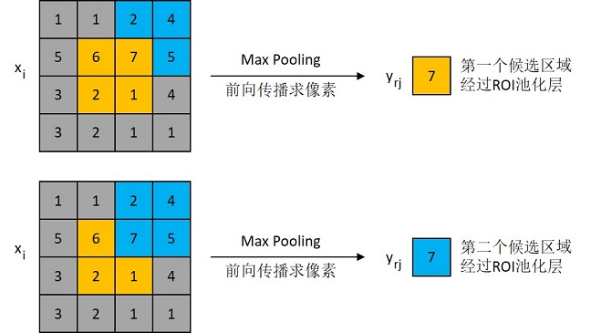

该节点7的反向传播，即cnnlRoiAlignBackward的图示如下：

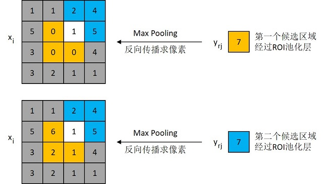

对于不同候选区域，节点7都存在梯度，所以反向传播中损失函数 ``L`` 对输入层节点 :math:`x_i` 的梯度为损失函数 :math:`L` 对各个有可能的候选区域 ``r`` （ :math:`x_i` 被候选区域 ``r`` 的第 ``j`` 个输出节点选为最大值），输出 :math:`y_{rj}` 梯度的累加，具体公式如下所示：

.. math::

   `\frac{\partial L}{\partial x_i}=\sum_{r}\sum_{j}[i=i^*(r,j)]\frac{\partial L}{\partial y_{rj}}`

.. math::

   [i=i^*(r,j)]=
      \begin{cases}
      &1, i=i^*(r,j)\ge 1\\
      &0, otherwise
      \end{cases}

判决函数表示节点是否被候选区域的第个输出节点选为最大值输出，若是，则由链式法则可知损失函数相对的梯度等于损失函数相对的梯度，上图已然解释该输入节点可能会和不同的有关系，故损失函数相对的梯度为求和形式。

cnnlRoll
-----------

将输入张量沿着给定的维度进行循环位移滚动。

cnnlRound
-----------

对输入做舍入操作，逐元素按照banker's rounding即round nearest to even算法对输入数值进行舍入。

banker's rounding的计算公式为：

.. math::

   decimal[i] = input[i] - integer[i]; \\
   integer[i] = input[i].integer; \\

.. math::

   result[i]=\left\{
   \begin{array}{rcl}
   integer[i], & decimal[i] < 0.5 \\
   integer[i], & decimal[i] = 0.5 & integer[i] \%2 = 0 \\
   integer[i]+1.0, & decimal[i] = 0.5 & integer[i] \%2 \neq 0 \\
   integer[i]+1.0, & decimal[i] > 0.5
   \end{array} \right.

其中，参数介绍为：

- ``i`` 表示一个张量的索引，例如在四维时可以表示(n,c,h,w)中的某个索引，并且 0<= i < n*c*h*w。
-  :math:`input[i]` 表示张量中 ``i`` 索引处的元素值。
-  :math:`decimal[i]` 表示  :math:`input[i]` 的小数部分。
-  :math:`decimal[i] 表示 :math:`input[i]` 的整数部分。

cnnlRsqrt
------------

对输入数据开方后求倒数的计算。

公式如下：

.. math::

   y_i =  \frac{1}{\sqrt{x_i}}

其中 ``xi`` 表示输入数据，``yi`` 表示输出数据。

cnnlRsqrtBackward
-------------------

计算Rsqrt的导数。

假设输入为x，输出为y，上一层回传的导数为 :math:`diff_y`，计算公式如下：

.. math::

   diff_x = -0.5 * diff_y * y^3

cnnlScale
-----------

人工智能norm系列算法的拉伸操作，全连接网络输入的汇聚操作，以及人工智能线性回归等。

从指定维度起，在连续多个维度上对 ``x`` 缩放和平移。

计算公式如下：

.. math::

   y = alpha * x + beta

其中：

- ``x`` 表示输入张量
- ``alpha``、 ``beta`` 是系数，可以是标量或者张量，如果都是张量，形状信息需要相同。默认分别为标量1、0。
- ``y`` 表示输出张量

例如对于四维张量 ``x`` ，如果 ``alpha`` 、 ``beta`` 为张量，并从0数在第1、2个维度计算，则具体计算如下：

.. math::

   y_{ijkl} = alpha_{jk} * x_{ijkl} + beta_{jk}

cnnlScaledTanh
-----------------

一种激活算子。

计算公式如下：

.. math::

   \begin{aligned}
   & y(x) = tanh(alpha * x) * beta
   \end{aligned}

其中：

- ``x`` 表示输入input数据块。
- ``y`` 表示输出output数据块。
- ``alpha`` 和 ``beta`` 代表缩放参数。

Scaled Tanh算子支持多维，支持任意layout，支持任意指定维度。在用户指定维度上，``alpha`` 和 ``beta`` 的size为1或者与输入指定维度的size相等，其他维度为1。例如，输入张量的规模为[n, c, h, w]，也就是用户指定第二维度(axis = 1)为C维度，那么 ``alpha`` 和 ``beta`` 的形状为[1, 1, 1, 1]或者[1, c, 1, 1]。

cnnlScatter
--------------

将输入 ``src`` 中的数据根据index中的索引按照dim的方向填进输入张量中。``src`` 可以是个tensor，或者是个scalar。当 ``src`` 是scalar的时候，就是在生成onehot值。

cnnlScatter算子支持scatter（inplace算子）和scatter_add（累加算子）两种模式。

- 当输入src是个tensor的时候，scatter和scatter_add限制条件的公式如下：

  .. math::

     \begin{aligned}
     & index.size(d) <= src.size(d) \\
     & index.size(d) <= input.size(d)
     & \end{aligned}

  - scatter算子的公式：

    .. math::

       \begin{aligned}
       & input\left[index\left[i\right]\left[j\right]\left[m\right]\left[n\right]\right]\left[j\right]\left[m\right]\left[n\right] = src\left[i\right]\left[j\right]\left[m\right]\left[n\right], dim = 0 \\
       & input\left[i\right]\left[index\left[i\right]\left[j\right]\left[m\right]\left[n\right]\right]\left[m\right]\left[n\right] = src\left[i\right]\left[j\right]\left[m\right]\left[n\right], dim = 1 \\
       & input\left[i\right]\left[j\right]\left[index\left[i\right]\left[j\right]\left[m\right]\left[n\right]\right]\left[n\right] = src\left[i\right]\left[j\right]\left[m\right]\left[n\right], dim = 2 \\
       & input\left[i\right]\left[j\right]\left[m\right]\left[index\left[i\right]\left[j\right]\left[m\right]\left[n\right]\right] = src\left[i\right]\left[j\right]\left[m\right]\left[n\right], dim = 3 \\
       & \end{aligned}

  - scatter_add算子的公式：

    .. math::

       \begin{aligned}
       & input\left[index\left[i\right]\left[j\right]\left[m\right]\left[n\right]\right]\left[j\right]\left[m\right]\left[n\right] += src\left[i\right]\left[j\right]\left[m\right]\left[n\right], dim = 0 \\
       & input\left[i\right]\left[index\left[i\right]\left[j\right]\left[m\right]\left[n\right]\right]\left[m\right]\left[n\right] += src\left[i\right]\left[j\right]\left[m\right]\left[n\right], dim = 1 \\
       & input\left[i\right]\left[j\right]\left[index\left[i\right]\left[j\right]\left[m\right]\left[n\right]\right]\left[n\right] += src\left[i\right]\left[j\right]\left[m\right]\left[n\right], dim = 2 \\
       & input\left[i\right]\left[j\right]\left[m\right]\left[index\left[i\right]\left[j\right]\left[m\right]\left[n\right]\right] += src\left[i\right]\left[j\right]\left[m\right]\left[n\right], dim = 3 \\
       & \end{aligned}

- 当输入src是个标量的时候，scatter和scatter_add限制条件的公式如下：

  .. math::

     \begin{aligned}
     & index.size(d) <= input.size(d)
     & \end{aligned}

  - scatter算子的公式：

    .. math::

       \begin{aligned}
       & input\left[index\left[i\right]\left[j\right]\left[m\right]\left[n\right]\right]\left[j\right]\left[m\right]\left[n\right] = src, dim = 0 \\
       & input\left[i\right]\left[index\left[i\right]\left[j\right]\left[m\right]\left[n\right]\right]\left[m\right]\left[n\right] = src, dim = 1 \\
       & input\left[i\right]\left[j\right]\left[index\left[i\right]\left[j\right]\left[m\right]\left[n\right]\right]\left[n\right] = src, dim = 2 \\
       & input\left[i\right]\left[j\right]\left[m\right]\left[index\left[i\right]\left[j\right]\left[m\right]\left[n\right]\right] = src, dim = 3 \\
       & \end{aligned}

  - scatter_add算子的公式：

    .. math::

       \begin{aligned}
       & input\left[index\left[i\right]\left[j\right]\left[m\right]\left[n\right]\right]\left[j\right]\left[m\right]\left[n\right] += src, dim = 0 \\
       & input\left[i\right]\left[index\left[i\right]\left[j\right]\left[m\right]\left[n\right]\right]\left[m\right]\left[n\right] += src, dim = 1 \\
       & input\left[i\right]\left[j\right]\left[index\left[i\right]\left[j\right]\left[m\right]\left[n\right]\right]\left[n\right] += src, dim = 2 \\
       & input\left[i\right]\left[j\right]\left[m\right]\left[index\left[i\right]\left[j\right]\left[m\right]\left[n\right]\right] += src, dim = 3 \\
       & \end{aligned}

cnnlScatterNd
----------------

用于输入数据的抽取后分发，即将一个张量根据其indices将updates散布到新的张量（初始为零）。该算子根据索引对给定shape的零张量中的单个值或切片应用稀疏updates来创建新的张量。是GatherNd的逆运算。如果indices中存在重复值，那么与之对应updates中的值或切片会在output上进行累加运算。对于indices中的非法值（比如负数或者超过输出边界的值）自动跳过，不进行报错。

cnnlScatterRef
-----------------

用于transformer中对输入切片数据进行处理。根据索引indices指定的位置用updates对ref的axis维进行更新，包含scatter_add, scatter_sub, scatter_mul, scatter_div, scatter_min, scatter_max, scatter_update一系列操作。

示例说明，请参看《Cambricon CNNL Developer Guide》。

cnnlSelect
-------------

根据condition条件（true or false），分别在then和else个输入数据中选择相应的一个或一组数据到输出。

其数学算法如下：

condition是判断条件，为true则从then中选择数据，为false则从else中选择数据。

- 如果condition是标量，则根据其为true或false直接选择then或else作为输出。计算公式如下：

  .. math::

     \begin{aligned}
     & output_{n,c,h,w} = condition \ ? \ then_{n,c,h,w} \ : \ else_{n,c,h,w} \\
     \end{aligned}

- 如果condition是向量，并且then和else都是高维数据，则从then和else的最高维（0维），根据condition的true或false选择一组数据。计算公式如下：

  .. math::

     \begin{aligned}
     & output_{n,c,h,w} = condition_n \ ? \ then_{n,c,h,w} \ : \ else_{n,c,h,w} \\
     \end{aligned}

- 如果condition、then和else都具有相同的shape，则按对位，根据condition每个元素的true或false选择then或else中的一个数据。计算公式如下：

  .. math::

     \begin{aligned}
     & output_{n,c,h,w} = condition_{n,c,h,w} \ ? \ then_{n,c,h,w} \ : \ else_{n,c,h,w} \\
     \end{aligned}

cnnlShuffleChannel
--------------------

将数据在channel方向进行“通道重排”。通道重排并不是随机打乱，而是根据一个group参数，有规律地进行。

cnnlSign
-----------

返回一个新张量，包含输入input每个元素的正负。

公式如下：

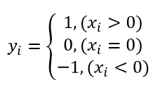

其中 ``xi`` 表示输入数据，``yi`` 表示输出数据。

cnnlSin
----------

对张量进行符号(Sign) 运算。

公式如下：

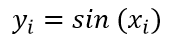

其中 ``xi`` 表示输入数据，``yi`` 表示输出数据。

cnnlSmoothL1LossForward
--------------------------

用于分类任务，输入的是每个分类的预测lable和实际lable，计算对应lable的差值并根据beta参数和计算公式求值。支持根据算法选项，输出对应的loss样式。

Forward公式如下：

.. math::

   SmoothL1Loss(X_{predict} - X_{lable}) = \begin{cases}
   \ 0.5 * |X_{predict} - X_{lable}|^{2} / beta, & if |X_{predict} - X_{lable}| < beta \\ |X_{predict} - X_{lable}| - 0.5*beta, & else \end{cases}

cnnlSmoothL1LossBackward
-------------------------
Backward公式如下：

**reduction == None**

.. math::

   \begin{aligned}
   & diff = input - target \\
   & d  = \begin{cases}
            1  &  x > beta \\
            x/beta  & -beta \leq x \leq beta \\
            -1 &  x < -beta
          \end{cases}     \\
   & grad\_input = d * grad\_output
   \end{aligned}

**reduction == Sum**

.. math::

   \begin{aligned}
   & x = input - target \\
   & dx = \begin{cases}
            1  &  x > beta \\
            x/beta  & -beta \leq x \leq beta \\
            -1 &  x < -beta
          \end{cases}     \\
   & grad\_input = d * grad\_output
   \end{aligned}

**reduction == Mean**

.. math::

   \begin{aligned}
   & x = input - target \\
   & dx = \begin{cases}
            1  &  x > beta \\
            x/beta  & -beta \leq x \leq beta \\
            -1 &  x < -beta
          \end{cases}     \\
   & grad\_input = d * \frac{1}{n} grad\_output
   \end{aligned}

其中：

- 公式中 ``input`` 为算子输入, 即预测值。
- 公式中 ``target`` 为算子输入, 即真值。
- 公式中 ``diff`` 为 ``input`` 与 ``target`` 之差, 用于计算 smoothl1loss 前向的导数 ``d``。
- 公式中 ``d`` 为smoothl1loss前向的导数。
- 公式中 ``grad_output`` 为算子输入, 即关于output的梯度。
- 公式中 ``grad_input`` 为算子输出, 即关于input的梯度。
- 公式中 ``n`` 为 ``grad_output`` 的总规模。

cnnlSoftmaxCrossEntropyWithLogits
-----------------------------------

将计算归一化的过程与计算交叉熵的步骤合并在一起，并且增加了交叉熵损失函数梯度 ``d_logits`` 的计算。

公式如下：

交叉熵（Cross Entropy）刻画的是实际输出与期望输出的差距；交叉熵的值越小，实际输出概率与期望输出概率的分布就越接近。假设 ``p`` 为期望输出（标签），``q`` 为实际输出，softmax交叉熵损失函数为：

.. math::

   \begin{aligned}
   & \large SoftmaxCrossEntropyWithLogits(p,q) = -{\sum_{k=1}^K {p_k}*{logsoftmax(q_k)}}
   \end{aligned}

输出logits的梯度 ``d_logits`` 为：

.. math::

   \begin{aligned}
   & \large d\_logits = softmax(q_i)- p_i,
   \ \ \ \ \ i ∈ [1,K]
   \end{aligned}

上述公式中，假设规约维度大小为 ``K``，``i``、``k`` 均指该维度的下标索引。

cnnlSoftmaxForward
--------------------

将非标准化的输出映射为归一化的概率分布，进而进行多分类。

设x为softmax函数的输入，y为算子的输出，k,i为下标，L为网络最终的损失，Softmax的计算公式为：

.. math::

   \huge{y_i=\frac{e^{x_i}}{\sum_{k} e^{x_k}}}

其中：

- ``x`` 是输入。
- ``y`` 是输出概率。
- ``i``、``k`` 表示输入 ``x`` 和输出 ``y`` 的索引。

cnnlSoftmaxBackward
--------------------

反向传播过程的导数根据链式法则可求得：

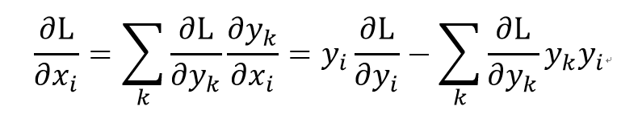

其中：

- ``x`` 是输入。
- ``y`` 是输出概率。
- ``i``、``k`` 表示输入 ``x`` 和输出 ``y`` 的索引。

cnnlSoftplusForward
---------------------

一种常见激活函数。

softplus 微商计算公式：

.. math::

   \begin{aligned}
   S^{'}(x)=
   \begin{cases} \frac{1}{1 + e^{- beta * x}}, & beta * x\in(-\infty, threshold] \\ 1, & beta * x\in(threshold, +\infty) \end{cases}
   \end{aligned}

cnnlSoftplusBackward
-----------------------
SoftplusBackward 算子实现公式为：

.. math::

   \begin{aligned}
   diff\_x=
   \begin{cases} diff\_y * S'(x), & beta * x\in(-\infty, threshold] \\ diff\_y, & beta * x\in(threshold, +\infty) \end{cases}
   \end{aligned}

其中：

- ``x`` 为输入张量x的地址。
- ``diff_y`` 为输入张量 :math:`diff_y` 的地址。
- ``diff_x`` 为输出张量。
- ``beta`` 缩放参数，默认值取1。
- ``threshold`` 缩放参数，默认值取20。

cnnlSoftsignForward
-------------------

SoftsignForward是一个激活函数。其计算公式如下：

.. math::

   \begin{aligned}
   output\_i = input\_i/(abs(input\_i) + 1)
   \end{aligned}

cnnlSoftSignGrad
-------------------

为SoftSign算子计算Softsign的梯度。计算公式为：

.. math::

   \begin{aligned}
   output\_i = gradients\_i / ( 1 + |input\_i|)^2
   \end{aligned}

其中：

- ``gradients`` 为对应softsign算子反向传播的输入梯度。
- ``input`` 为传递给对应softsign算子的输入。

.. _cnnlSpace2batch:

cnnlSpace2batch
-------------------

在进行一些Convolution计算的时候，为了增加感受野，引入了膨胀系数dilation。正常的Convolution计算，dilation为1。如果H方向与W方向的dilation为2，则滤波器坐标对应的每一个输入都要增加2，如图所示：

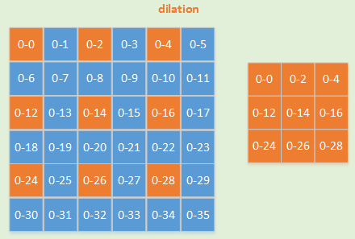

为了提升 dilation 情况下的Convolution计算效率，需要cnnlSpace2batch和cnnlBatch2space两个算子对输入数据做一些位置上的改变。此算子为一个纯 IO 操作的算子。输入数据为4维Tensor。该算子只支持4维，但布局可以是 NHWC/NCHW/HWCN。推荐使用NHWC布局。该算子性能比 cnnlSpace2batchNd_ 要好，但功能不如 cnnlSpace2batchNd_ 系列全面。

cnnlSpace2batch与 cnnlBatch2space_ 互为逆运算，要成对使用。如下图所示，cnnlSpace2batch算子将space侧数据排布成batch侧形状。

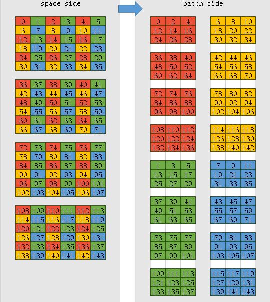

cnnlSpace2batch算子的输入、输出要满足如下关系:

.. math::

   \begin{array}{lcl}
   n_o = dh * dw * n_i \\
   h_o = h_i / dh \\
   w_o = w_i / dw \\
   c_o = c_i
   \end{array}

其中参数含义如下：

- :math:`c_i` 表示输入张量块内每个元素的通道数，可能被切分后传输。
- :math:`c_o` 表示输出张量块内每个元素的通道数。
- ``dh`` 表示在 h 方向的膨胀系数。
- ``dw`` 表示在w方向的膨胀系数。
- :math:`n_{i}` 表示N维度输入。
- :math:`n_{o}` 表示N维度输出。
- :math:`h_{i}` 表示输入张量的高度。
- :math:`h_{o}` 表示输出张量的高度。
- :math:`w_o` 表示输出张量的宽度。

.. _cnnlSpace2batchNd:

cnnlSpace2batchNd
-------------------

下图以二维为例，说明了cnnlSpace2batchNd算子的数据变化过程。

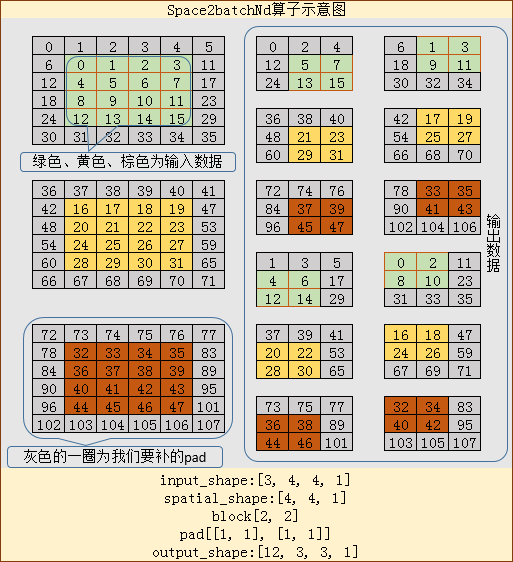

图中，输入的N=3，HW为4*4，H方向的前后各补一个pad，W方向的上下也各补一个pad。pad填充的值为0。整个输入形状布局为[N, H, W, C]。本例假设C=1，得到其输入形状为[3, 4, 4, 1]。整个输入的spatial为[4, 4, 1]。参数有block和pad两部分。图中，block的布局为[H, W]，形状为[2, 2]。block将整个输入的HW维度分拆成若干个block大小的块，从每块中取出一个元素，拼接在一起就是一个新的cnnlSpace2batchNd算子。取元素的顺序是根据block的排列顺序。而cnnlSpace2batchNd算子在开始进行拆分取数之前，需要先将pad加在输入上。加上pad的spatial就变成了[6, 6, 1]，那么block就将整个input分拆成了3*3个2*2大小的块，于是从每个小块中取元素，得出的batch形状就是[3, 3]。

上面说明了HW维度的处理，下面对输出N的维度的处理进行说明。cnnlSpace2batchNd算子的输出在N维度的大小是（input_n * block_h * block_w），如果维度更高，则为（input_n * block_0 * block_1 * ... * block_n）。上面输出N的维度为12（=3 * 2 * 2）。

cnnlSpace2batchNd算子的逆运算是 cnnlBatch2spaceNd_ 。

本算子功能比 cnnlSpace2batch_ 全面，支持多维，支持pad，但性能不如cnnlSpace2batch。

cnnlSparseSoftmaxCrossEntropyWithLogits
--------------------------------------------

计算loss和反向梯度。

公式如下：

.. math::

   \begin{aligned}
   & \large SparseSoftmaxCrossEntropyWithLogits(p,q) = -logsoftmax(q_k),\ where\ p_k=1.0
   \end{aligned}

.. math::

   \large d\_logits = \left\{
   \begin{aligned}
   &\frac{e^{x_i-x_{max}}}{\sum_{k=1}^k e^{x_k-x_{max}}}- 1.0,\ where\ p_k=1.0 \\
   &\frac{e^{x_i-x_{max}}}{\sum_{k=1}^k e^{x_k-x_{max}}},\ where\ p_k = 0.0
   \end{aligned}
   \right.

其中 :math:`p_k` 为待规约维度第k个位置的真值概率，:math:`x_i` 为待规约维度的元素取值，:math:`x_{max}` 为待规约维度的元素最大值。

cnnlSplit
------------

对数据块进行拆分。

cnnlSqrt
-----------

开方的操作。

公式如下：

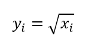

其中：

- ``i`` 表示一个多维数组的索引，表示多维张量，例如在4维时可以表示 (n,c,h,w)。
- :math:`x_i` 和 :math:`y_i` 表示多元组中 i索引处的元素。

cnnlSqrtBackward
-------------------

计算 Sqrt 的导数。

假设输入为 x，输出为 y，上一层回传的导数为 :math:`diff_y`，公式如下：

.. math::

   diff_x = 0.5 * \frac{diff_y}{y}

cnnlSquare
--------------

对输入数据进行平方计算。

公式如下：

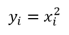

其中：

- ``i`` 表示一个多元组的索引, 表示多维张量, 例如在4维时可以表示(n,c,h,w)。
- ``xi`` 和 ``yi`` 表示多元组中 ``i`` 索引处的元素。

cnnlSquaredDifference
-----------------------

对输入数据进行均方误差计算。

计算公式为：

.. math::

   output[i]=(input_1[i]-input_2[i])^2

其中：

- ``i`` 表示一个多元组的索引，表示多维tensor，例如在 4D 时可以表示 (n,c,h,w)。
- :math:`x_i`、:math:`y_i` 表示多元组中 ``i`` 索引处的元素。

cnnlStdForward
------------------

实现对输入数据进行标准差计算。

cnnlStdBackward
------------------

根据输入梯度grad，前向计算结果result，前向输入input，参数biased，以及可选择的dim和keepdim，输出梯度结果grad_result。

计算公式如下：

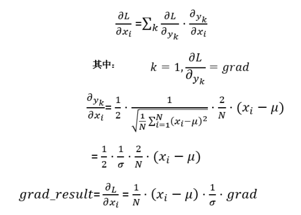

其中μ表示输入数据所求的均值结果，σ表示前向计算输出结果。

cnnlStrideBatchMatMul
---------------------

根据stride，进行batch矩阵乘。在TensorFlow和Pytorch中，主要用于large-bert网络。

.. math::

   C[i] + i * stride\_c = \alpha * (A[i] + i * stride\_a) * (B[i] + i * stride\_b) + \beta * (C[i] + i * stride\_c)

其中：

- batchSize表示batch的大小。
- A[i]表示m * k矩阵。
- B[i]表示k * n矩阵。
- C[i]表示m * n矩阵。
- stride\_b 表示矩阵B[i]和B[i + 1]首元素的距离。
- stride\_a 表示矩阵A[i]和A[i + 1]首元素的距离。
- stride\_c 表示矩阵C[i]和C[i + 1]首元素的距离。
- :math:`\alpha` 表示矩阵乘的系数。
- :math:`\beta`  表示矩阵相加的系数。

cnnlStridedSlice
---------------------

根据stride，对输入中的数据进行提取。对于一个维度，如N，每隔stride个长度提取一个元素，放到对应的位置上，相当于将输入的规模在其维度上减小。

cnnlStridedSliceBackward
---------------------------

Strided Slice算子的反向传播操作，即切片处理的逆操作。通过计算stridedslice前向算子的梯度，实现梯度值在反向图中的传递，达成更新网络中滤波器的目的。

cnnlSvd
---------------

奇异值分解（Singular Value Decomposition，SVD）可用于降维算法的特征分解，还可用于推荐系统，以及自然语言处理等领域。是很多人工智能算法的基石。

公式如下：

设矩阵 :math:`A \in R^{m \times n}`，A是实数域上的行为m列为n的矩阵，则必存在正交矩阵。

.. math::

   U = [u_1,...,u_m] \in R^{m \times m}和 V = [v_1,...,v_n] \in R^{n \times n}

使得：

.. math::

   U^TAV = \begin{bmatrix} \varSigma_r & 0 \\ 0 & 0 \end{bmatrix}(或 A = U\begin{bmatrix} \varSigma_r & 0 \\ 0 & 0 \end{bmatrix}V^T)，... (1)

其中：

- :math:`A \in R^{m \times n}` 表示A是实数域上的行数为m列数为n的矩阵。

- :math:`U^T` 表示为矩阵 :math:`U` 的转置。:math:`V^T` 同理。

- :math:`\varSigma_r = \mathnormal{diag}(\sigma_1,...,\sigma_r)，其中\sigma_1 >= ... >= \sigma_r > 0。`

cnnlSyncBatchnormBackwardReduce
----------------------------------

将Batch Normalization Backward算子拆分后的小算子，用于计算损失函数相对于filter和bias的梯度，以及根据开关情况决定是否输出下级element函数的中间变量sum_dy和sum_dy_xmu。

公式如下：

根据grad_output通过链式法则, 反向求解损失函数 ``L`` 在 :math:`\gamma` 上的梯度（ :math:`\frac{\partial L}{\partial \gamma}\ ` ）和 :math:`\beta` 上的梯度( :math:`\frac{\partial L}{\partial \beta} \ ` )。并且为下一级BatchNormBackwardElemt算子传递中间结果 ``sum_dy`` 和 ``sum_dy_xmu``。

.. math::

   & sum\_dy =  \sum_{n,h,w} \frac{\partial L}{\partial y_{n,h,w,c}}\  ,(M=n\times h\times w) \\
   & sum\_dy\_xmu=  \sum_{n,h,w} \frac{\partial L}{\partial y_{n,h,w,c}}\ (x_{n,h,w,c} -\mu_{c}) \\
   & grad_{filters}=\frac{\partial L}{\partial \gamma}\ =\sum_{n,h,w} \frac{\partial L}{\partial y_{n,h,w,c}}\  \hat x_{{n,h,w,c}} = \sum_{n,h,w} \frac{\partial L}{\partial y_{n,h,w,c}}\ \frac{x_{n,h,w,c}-\mu_c}{\sqrt{\sigma_c^2+\epsilon}}\ \\
   & grad_{bias}=\frac{\partial L}{\partial \beta} \ = \sum_{n,h,w}\frac{\partial L}{\partial y_{n,h,w,c}}

cnnlSyncBatchNormElemt
------------------------------

计算SyncBatchNorm的前向输出。

cnnlSyncBatchNormBackwardElemt
--------------------------------

计算输入的梯度。

公式如下：

.. math::

   \begin{aligned}
   & \mathrm{d}y = \frac{\partial L}{\partial y} = \frac{\partial L}{\partial z} * \frac{\partial z}{\partial y} = \gamma * \mathrm{d}z \\
   \mathrm{d}x & = \mathrm{d}y*(\sigma^{-1})-(\sum_{i}^m \mathrm{d}y(x-\mu)(\sigma^{-1})^3)\frac{(x-\mu)}{m}-\frac{1}{m}\sum_{i}^m\mathrm{d}y(\sigma^{-1}) \\
   & = \mathrm{d}z*\gamma*(\sigma^{-1})-(\sum_{i}^m\mathrm{d}z*\gamma(x-\mu)(\sigma^{-1})^3)\frac{(x-\mu)}{m}-\frac{1}{m}\sum_{i}^m\mathrm{d}z*\gamma(\sigma^{-1}) \\
   & = (\mathrm{d}z - \frac{\begin{matrix} \sum_{i}^m \mathrm{d}z \end{matrix}}{m} - (x -\mu) * ((\sigma^{-1})^2)\frac{\begin{matrix} \sum_{i}^m \mathrm{d}z(x-\mu) \end{matrix}}{m})*\gamma*(\sigma^{-1}) \\
   \end{aligned}

其中：

- ``m`` 表示被规约轴N,H,W的乘积，即m = N * H * W（以NHWC维度为例）。
- ``i`` 表示一个多元组下标，在 4D 情况下表示(n,h,w,c) 。
- :math:`\gamma` 是前向用到的可学习的沿C维度的scale操作的系数。
- :math:`\beta` 是对规范化输出做 Scale 操作的截距。
- :math:`dz` 是前向输出z的梯度。
- :math:`dy` 是中间变量y的梯度。

cnnlSyncBatchNormBackwardElemtV2
---------------------------------------

计算输入的梯度。

公式如下：
框架调用分布式的all_reduce求得全局的sum_dy和sum_dy_xmu，作为cnnlSyncBatchNormBackwardElemtV2算子的输入。

利用上述的全局sum_dy和sum_dy_xmu先计算mean_dy和mean_dy_xmu：

.. math::

    \begin{aligned}
    & mean\_dy = \frac{sum\_dy}{\sum_{i}^m m_i} \\
    & mean\_dy\_xmu = \frac{sum\_dy\_xmu}{\sum_{i=0}^m m_i} \\
    \end{aligned}

再求取输入的梯度：

.. math::

   \begin{aligned}
   & \mathrm{d}y = \frac{\partial L}{\partial y} = \frac{\partial L}{\partial z} * \frac{\partial z}{\partial y} = \gamma * \mathrm{d}z \\
   \mathrm{d}x & = \mathrm{d}y*(\sigma^{-1})-(\sum_{i}^m \mathrm{d}y(x-\mu)(\sigma^{-1})^3)\frac{(x-\mu)}{m}-\frac{1}{m}\sum_{i}^m\mathrm{d}y(\sigma^{-1}) \\
   & = \mathrm{d}z*\gamma*(\sigma^{-1})-(\sum_{i}^m\mathrm{d}z*\gamma(x-\mu)(\sigma^{-1})^3)\frac{(x-\mu)}{m}-\frac{1}{m}\sum_{i}^m\mathrm{d}z*\gamma(\sigma^{-1}) \\
   & = (\mathrm{d}z - \frac{\begin{matrix} \sum_{i}^m \mathrm{d}z \end{matrix}}{m} - (x -\mu) * ((\sigma^{-1})^2)\frac{\begin{matrix} \sum_{i}^m \mathrm{d}z(x-\mu) \end{matrix}}{m})*\gamma*(\sigma^{-1}) \\
   & = (\mathrm{d}z - mean\_dy - (x -\mu) * ((\sigma^{-1})^2)*mean\_dy\_xmu)*\gamma*(\sigma^{-1}) \\
   \end{aligned}

其中：

- ``m`` 表示被规约轴N,H,W的乘积，即m = N * H * W（以NHWC维度为例）。
- ``i`` 表示一个多元组下标，在 4D 情况下表示(n,h,w,c) 。
- :math:`\gamma` 是前向用到的可学习的沿C维度的scale操作的系数。
- :math:`dz` 是前向输出z的梯度。
- :math:`dy` 是中间变量y的梯度。

cnnlSyncBatchNormGatherStatsWithCounts
-------------------------------------------

计算全局均值和标准差的倒数。

公式如下：

.. math::

   \begin{aligned}
   out & = (x-\mu_{global})*\sigma^{-1}_{global}*\gamma+\beta \\
   & = (x - mean)*invstd*\gamma+\beta \\
   & \mu_{global} = mean = \frac{\begin{matrix} \sum_{i=0}^N {\mu_i * m_i} \end{matrix}}{\begin{matrix} \sum_{i=0}^N m_i \end{matrix}}, \\
   & \sigma^{-1}_{global} = invstd = [\frac{1}{\begin{matrix} \sum_{i=0}^N m_i \end{matrix}}(\sum_{i=0}^N m_i((\sigma^{-1}_i)^{-2}+\mu_i^2-\epsilon))-\frac{2\mu_{global}}{\begin{matrix} \sum_{i=0}^N m_i \end{matrix}}(\sum_{i=0}^N m_i*u_i) + \mu^2_{global} + \epsilon]^{-\frac{1}{2}} \\
   & running\_mean = running\_mean * (1 - momentum) + \mu * momentum \\
   running\_var & = running\_var * (1 - momentum) + Var[x] * momentum \\
   & = running\_var * (1 - momentum) + \frac{\begin{matrix} \sum_{i=0}^N (n_i) \end{matrix}}{(\begin{matrix} \sum_{i=0}^N (n_i) \end{matrix}-1)}((\sigma^{-1}_{global})^{-2} - \epsilon) * momentum \\
   \end{aligned}

其中：

- :math:`\gamma` 表示列表中张量 ``filter``。
- :math:`\beta` 表示列表中张量 ``bias``。
- :math:`\epsilon` 是为了避免分母为0。
- :math:`\mu_{global}` 指代全部数据的均值 ``mean``。
- :math:`\sigma^{-1}_{global}` 指代全部数据的标准差倒数 ``invstd``。
- :math:`\mu_{global}` 指代全部数据的均值 ``mean``。
- :math:`\sigma^{-1}_{global}` 指代全部数据的标准差倒数 ``invstd``。
- :math:`\mu_i` 指代 ``mean_all`` 的第 ``i`` 个MLU设备的部分均值。
- :math:`\sigma^{-1}_i` 指代 ``invstd_all`` 的第 ``i`` 个MLU设备的部分标准差倒数。
- ``N`` 为设备数。
- ``momentum`` 表示均值，方差滑动平均的系数。

cnnlSyncBatchNormStats
----------------------------

计算单卡上的均值和标准差的倒数。

公式如下：

.. math::

   \begin{aligned}
   & \mu_{local} = mean = \frac{1}{m}*\begin{matrix} \sum_{i=0}^{m-1} x_i \end{matrix}, \\
   & \sigma^{-1}_{local} = invstd = \frac{1}{\sqrt{\frac{1}{m}*\begin{matrix} \sum_{i=0}^{m-1} (x_i-\mu_{local})^2 \end{matrix} + \epsilon}}
   \end{aligned}

其中：

- :math:`\sigma^{-1}_{local}` 指代局部数据的标准差倒数 ``invstd``。
- :math:`\mu_{local}` 指代单卡上的局部均值 ``mean``。
- ``m`` 表示被规约轴N,H,W的乘积，即m = N * H * W（以NHWC维度为例）。
- ``i`` 表示一个多元组下标，在 4D 情况下表示(n,h,w,c)。
- :math:`\epsilon` 是为了避免分母为0。

cnnlThreshold
----------------

判断输入tensor的值是否大于给定的阈值threshold，如果大于threshold，输出tensor的值不变，否则将输出tensor的值置为给定的value。

公式如下：

.. math::

   y_i = \begin{cases}
   x_i & x_i > threshold \\
   value &   x_i \leq threshold \\
   \end{cases}

其中：

- ``x`` 表示输入tensor。
- :math:`x_i` 表示输入 x的第i个数。
- ``threhsold`` 表示阈值。
- ``value`` 表示替换输入的值。
- ``y`` 表示输出tensor。
- :math:`y_i` 表示输出 y的第i个数。

cnnlThresholdBackward
------------------------

判断输入tensor的值是否大于给定的阈值threshold，如果大于threshold，输出梯度的值不变，否则将输出的梯度值置为0。

公式如下：

.. math::

   GradOutput_i = \begin{cases}
   GradInput_i & x_i > threshold \\
   0 &   x_i \leq threshold \\
   \end{cases}

其中：

- ``x`` 表示输入tensor。
- :math:`x_i` 表示输入 x的第i个数。
- ``threhsold`` 表示阈值。
- :math:`GradInput_i` 表示第i个输入的梯度值。
- :math:`GradOutput_i` 表示第i个输出的梯度值。

cnnlTile
-----------

复制输入若干倍。

将input[i]复制multiples[i]遍。其shape计算公式如下：

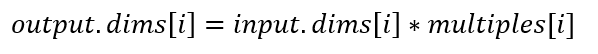

例如：

::

   input = [1, 2, 3]
   multiples = [2]
   output = [1, 2, 3, 1, 2, 3]

   input　=　[[1, 2, 3]
   　　　　　[4, 5, 6]]　
   multiples = [2, 3]
   output =　[[1, 2, 3, 1, 2, 3, 1, 2, 3]
   　　　　　[4, 5, 6, 4, 5, 6, 4, 5, 6]
   　　　　　[1, 2, 3, 1, 2, 3, 1, 2, 3]
   　　　　　[4, 5, 6, 4, 5, 6, 4, 5, 6]]

cnnlTinShiftForward
--------------------

对输入张量以通道进行分组，对每组内的通道在时间维度上进行偏移。

cnnlTinShiftForward示例如下：

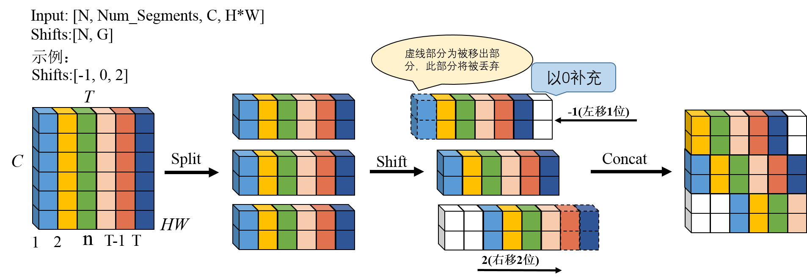

示例中，输入为[1, 6, 6, 1]，偏移Shifts为[-1, 0, 2]。
输入按照通道分为3组，每组含2个通道。第一组的偏移量为-1，第一组内的数据整体往左移1个时间序列；第二组的偏移量为0，第二组内的数据整体保持不变；第三组的偏移量为2，第三组内的数据整体往右移2个时间序列。

cnnlTinShiftBackward
--------------------

TinShift Forward的反向算子，给定输出数据对应的梯度、偏移量，计算输入数据对应的梯度。

cnnlTopKTensor
----------------

求张量中某个维度，前K个最大或者最小的值以及他们对应的index。

例如，输入input tensor([[0., 1., 2.], [3., 4., 5.]]),该tensor shape为(2,3)，k = 1，dim = 0，largest和sorted都取默认值true，意为取第0维，前1个数据。算子计算将把元组的两个tensor 分别以output和index返回。

cnnlTransform
---------------

对数据做转换。

公式如下：

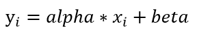

其中：

- ``i`` 表示一个多元组的索引, 表示多维张量, 例如在4维时可以表示(n,c,h,w)。
- ``xi`` 和 ``yi`` 表示多元组中 ``i`` 索引处的元素。

cnnlTranspose
----------------

维度转换。

公式如下：

.. figure:: ../images/transpose.png
   :scale: 60%

其中 ``permute`` 为用户希望的对输入张量转置的规则。例如 ``input shape = (11,22,33), permute[3] = {2,1,0}``，则输出 ``output shape = [33,22,11]``。

cnnlTri
---------

得到与输入数据形状相同的上三角(Triu)或下三角(Tril)部分数据，其他部分数据置0。

cnnlTrigonForward
--------------------

一系列三角函数计算。支持的三角函数，请参看《Cambricon CNNL Developer Guide》中“cnnlTrigonFunctionMode_t”。

cnnlUnarySelect
-------------------

从给定的输入数据，找到同维度index数据中不为0的对应数据。

例如：

::

   input:
   1  2  3

   4  5  6  10

   7  8  9

   index:
   0  0  1

   1  0  0

   0  1  1

   output:
   3  4  8  9

   ------------
   number:
   4

cnnlUnfold
--------------

将输入张量沿某个维度进行滑动切片。

公式如下：

.. math::

    Y[i,j,..., P, k,l,..., E] = X[i,j,..., P * Size + E, k,l,...]

其中，``x`` 表示输入数据， ``y`` 表示输出数据， ``Size`` 表示滑动窗口长度， ``E`` 表示每个窗口中元素的下标，取值范围是0至 ``Size - 1`` ，
``P`` 表示滑动窗的下标，取值范围是0至 ``(D - Size) / Step`` ， ``Step`` 表示两个滑动窗之间的间距， ``D`` 表示输入张量进行切片的维度的大小。

cnnlUnique
-------------

对一维数组去重。

公式如下：

.. figure:: ../images/unique.png
   :scale: 60%

其中 ``x`` 表示输入数据，``y`` 表示输出数据。

cnnlUnpoolBackward
------------------------

unpool_forward的反向。
unpool_backward算子根据index选取输入放到对应的位置得到梯度。

cnnlUnpoolForward
------------------------

maxpool的逆操作。在图像类网络中，图像经过maxpool操作后，尺寸会缩小，
unpool_forward算子根据index，将输入放到图像对应位置，其余位置补充为0，用于恢复图像尺寸。

cnnlUnsortedSegmentSum
------------------------

将输入按照索引重新排列。

公式如下：

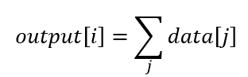

其中

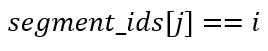

其中 ``data`` 表示输入数据，``output`` 表示输出数据，``segment_ids`` 是输入向量，其值表示指向输出的坐标。

cnnlVarForward
------------------------

返回输入向量input中所有元素的方差。公式如下：

.. math::

   \begin{array}{lcl}
   mean=\frac{1}{N}\sum_{i=1}^{N}{x_i} \\
   vardev=
   \begin{cases}
    \frac{1}{N-1}\sum_{i=1}^{N}{(x_i-mean)^2}, & \text{if $unbaised=true$} \\
    \frac{1}{N}\sum_{i=1}^{N}{(x_i-mean)^2}, & \text{if $unbaised=false$} \\
   \end{cases}
   \end{array}

其中：

- :math:`x_i` 为输入。
- ``N`` 表示指定要ducereduce的维度。
- ``mean`` 表示指定维度的均值。
- ``unbiased`` 用于指定是否使用基于修正贝塞尔函数(Bessel Function)的无偏估计。
- ``vardev`` 表示输出方差。

cnnlWeightNorm
-----------------

在滤波器的维度上做归一化。

网络的一个节点可以表示为：

.. math::

   y = f(w*x + b)

其中 :math:`w` 是一个N维特征向量，:math:`x` 是神经节点的输入，:math:`y` 是该神经节点的输出。在得到损失值后，我们会根据损失函数的值使用SGD等优化策略更新 :math:`w` 和 :math:`b`。WeightNorm 提出的归一化策略是将 :math:`w` 分解为一个参数向量 :math:`v` 和一个参数标量 :math:`g`，分解方法为：

.. math::

   \begin{aligned}
   w = {\frac{g}{||v||}}v
   \end{aligned}

上式中 :math:`||v||` 表示v的欧式范数，当 :math:`v = w` 且 :math:`g = ||w||` 时，WeightNorm 还原为普通的计算方法。

当我们将 :math:`g` 固定为 :math:`||w||` 时，我们只优化 :math:`v`，这时候相当于只优化 :math:`w` 的方向而保留其范数。当 :math:`v` 固定为 :math:`w/||w||` 时，这时候相当于只优化 :math:`w` 的范数，而保留其方向，这样为我们优化滤波器提供了更多可以选择的空间，且解耦方向与范数的策略也能加速其收敛、:math:`v` 和 :math:`g` 的值可以通过SGD的计算得到：

.. math::

   \begin{aligned}
   {\nabla{g}}{L} = {\frac{\nabla{w}{L}}{||v||}}v
   \end{aligned}

.. math::

   \begin{aligned}
   {\nabla{v}}{L} = {\frac{g}{||v||}}{\nabla{w}}{L} - g{\frac{\nabla{g}{L}}{||v||^2}}v
   \end{aligned}

其中 :math:`L` 为损失函数，:math:`{\nabla{w}{L}}` 为 :math:`w` 在 :math:`L` 下的梯度值。

cnnlWeightNormBackward
------------------------

计算损失函数在 filter_v, filter_g处的梯度，用于以transformer网络为代表的NLP任务中网络的训练。

公式如下：

.. math::

   \begin{aligned}
   {dg}_{n111} = \frac{dw_{nchw}*v_{nchw}}{{||v||}_{n111}}
   \end{aligned}

.. math::

   \begin{aligned}
   {dv}_{nchw} = {\frac{g_{n111}}{{||v||}_{n111}}}*{dw}_{nchw} - {\frac{g_{n111}*{dg}_{n111}}{{{||v||}_{n111}}^2}}*v_{nchw}
   \end{aligned}

其中：

- :math:`dw`、:math:`v`、:math:`g` 为输入。
- :math:`dv`、:math:`dg` 为输出。
- :math:`||v||` 是通过在weightnorm正向算子计算过程中保存的值。
- :math:`dim` 为对filter规约的维度。

cnnlWhere
-----------

获取输入的非0值位置。

cnnlTrunc
-----------

对输入张量的每个元素的小数部分向0方向截断，返回一个新张量。

cnnlPointsInBoxes
-----------------

检测给定的点云数据中每个点属于哪个3D框，输出表示对应框的索引，如果不存在对应的框，输出-1。

其中对于给定的points(x, y, z), box(cx, cy, cz, dx, dy, dz, rz), 检测points是否在box内的公式如下：

.. math::

	in\_flag = \lvert (z - cz) \rvert <= \frac{dz}{2} \ \& \\
	\lvert (x - cx) * cos(-rz) - (y - cy) * sin(-rz)\rvert < \frac{dx}{2} \ \& \\
	\lvert (x - cx) * sin(-rz) + (y - cy) * cos(-rz)\rvert < \frac{dy}{2}

cnnlApplyFtrlV2
------------------------

使用在线优化算法FTRL-Proximal实现参数的更新。该算子是使用在线学习训练方法时更新滤波器的一种优化算法。

ApplyFtrlV2算子的计算公式有带学习率与不带学习率两种。

不带学习率：

.. math::

   \begin{array}{lcl}
   accum\_new = accum + grad*grad\\
   grad\_with\_shrinkage = grad + 2*l2\_shrinkage*var\\
   linear += grad\_with\_shrinkage~-~\frac{accum\_new^{-lr\_power}-accum^{-lr\_power}}{lr}*var\\
   quadratic = \frac{1.0}{accum\_new^{lr\_power}*lr} + 2*l2\\
   var = \begin{cases}0& \text{if}|linear|<=l1\\\frac{sign(linear)*l1 - linear}{quadratic}& \text{if}|linear| >l1\end{cases}\\
   accum = accum\_new
   \end{array}

带学习率：

.. math::

   \begin{array}{lcl}
   l1\_lr = l1 * lr\\
   l2\_lr = l2 * lr\\
   accum\_new = accum + grad*grad\\
   grad\_with\_shrinkage = grad + 2 * l2\_shrinkage*var\\
   linear += grad\_with\_shrinkage * lr~-~(accum\_new^{-lr\_power}-accum^{-lr\_power})*var\\
   quadratic = accum\_new^{-lr\_power}+ 2*l2\_lr\\
   var = \begin{cases}0& \text{if}|linear|<=l1\_lr\\\frac{sign(linear)*l1\_lr - linear}{quadratic}& \text{if}|linear| >l1\_lr\end{cases}\\
   accum = accum\_new
   \end{array}

其中：

- ``var`` 表示滤波器。
- ``accum`` 表示梯度的累加值。
- ``linear`` 表示线性系数。
- ``grad`` 表示梯度。
- ``lr`` 表示学习率。
- ``l1`` 表示L1正则化系数。
- ``l2`` 表示L2正则化系数。
- ``l2_shrinkage`` 表示L2收缩正则化系数。
- ``lr_power`` 表示比例因子。

cnnlIm2Col
------------------------

Im2Col算子主要应用于将conv操作转换为矩阵乘运算时使用。在语义上，普通conv运算等效于im2col + gemm。

若输入张量 ``X`` 形状为(``N``, :math:`C_{in}`, :math:`H_{in}`, :math:`W_{in}`)，则输出张量 ``Col`` 形状为(``N``, :math:`C_{out}`, :math:`K_{out}`)。

输出shape计算公式如下：

.. math::

   ho = \frac{H_{in} + pt + pb - dh × (kh - 1) - 1}{sh} + 1.

   wo = \frac{W_{in} + pl + pr - dh × (kh - 1) - 1}{sh} + 1.

   C_{out} = ho * wo.

   K_{out} = C_{in} * kh * kw.

其中：

- ``N`` 是batch数量。
- :math:`C_{in}` 表示输入通道数。
- :math:`C_{out}` 表示单batch中卷积块数。
- :math:`H_{in}` 表示输入特征图的高度。
- :math:`W_{in}` 表示输入特征图的宽度。
- :math:`K_{out}` 表示单个卷积块的元素数。
- ``pt, pb, pl, pr`` 分别表示对输入的上下左右进行padding。
- ``dh, dw`` 分别控制输入张量H和W方向上相邻元素的间隔。
- ``sh, sw`` 分别控制输入张量H和W方向上卷积核移动的步长。

cnnlCol2Im
------------------------

Col2Im算子是Im2Col算子的反向，Im2Col操作将滑动卷积核空间块内的数据提取出来按照成列的方式摆放,而Col2Im将按列摆放的数据还原到batch形状，
如果Im2Col展开的过程中有overlap，Col2Im过程会将对应的值加起来。
若输入张量 ``Col`` 形状为(``N``, :math:`C_{col}`, :math:`K_{col}`)，则输出张量 ``Im`` 形状为(``N``, :math:`C_{im}`, :math:`H_{im}`, :math:`W_{im}`)。

输入输出维度满足的计算公式如下：

.. math::

   \begin{array}{lcl}
   ho = \frac{H_{im} + pt + pb - dh × (kh - 1) - 1}{sh} + 1\\
   wo = \frac{W_{im} + pl + pr - dh × (kh - 1) - 1}{sh} + 1\\
   K_{col} = ho * wo\\
   C_{col} = C_{im} * kh * kw\\
   \end{array}

其中：

- ``N`` 是batch数量。
- :math:`C_{col}` 表示输入通道数。
- :math:`C_{im}` 表示单batch中卷积块数。
- :math:`H_{im}` 表示输入特征图的高度。
- :math:`W_{im}` 表示输入特征图的宽度。
- :math:`K_{col}` 表示卷积核在 `H_{im}` 和 `W_{im}` 方向滑动的次数的乘积。
- ``pt``, ``pb``, ``pl``, ``pr`` 分别表示对输入的上下左右进行padding。
- ``dh``, ``dw`` 分别控制输入张量H和W方向上相邻元素的间隔。
- ``sh``, ``sw`` 分别控制输入张量H和W方向上卷积核移动的步长。
