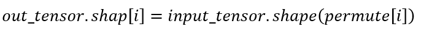
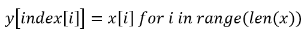

.. _算子列表:

算子支持
==========================

下面具体介绍Cambricon BANGC OPS支持的算子及其功能描述。有关算子详情，请参见《Cambricon BANGC OPS Developer Guide》。

.. _abs:

mluOpAbs
-----------------------------

返回绝对值。

公式如下：

.. math::

     y_i = |x_i|

其中：

- ``i`` 表示一个多元组的索引，例如在4维时可以表示（n,c,h,w）。
- ``xi`` 和 ``yi`` 表示多元组中 ``i`` 索引处的元素。

.. _add_n:

mluOpAddN
-----------------------------

多个张量的加法操作。

公式如下：

已知形状完全一致的输入张量 ``A``、``B``、``C`` 等若干，构成张量集合 ``X``。

len = length(A) = length(B)= …… = length(D)

AddN(A,B...)公式如下：

.. math::

   Z[i]=\sum_{n=0}^{len-1}Tn[i],i\epsilon[0,len-1],n\epsilon[0,|X|-1]

其中 ``Tn`` 指集合 ``X`` 中任意一个张量，``Z`` 表示输出数据，是所有输入张量对位相加后的结果。

.. _log:

mluOpLog
-----------------------------

计算输入张量的以e、2、10为底的对数。

log的计算公式为：

.. math::

     y_i = log(x_i)

log2的计算公式为：

.. math::

   y_i = log2(x_i)

Llg10的计算公式为：

.. math::

   y_i = log10(x_i)

注：

- ``i`` 表示一个多元数组的索引，表示多维张量。
- :math:`x_i`、:math:`y_i` 表示多元组中 i 索引处的元素。

.. _div:

mluOpDiv
-----------------------------

两个输入张量相除，得到输出结果。

公式如下：

.. math::

   z_i = x_i/y_i

其中：

- ``i`` 表示一个多维数组的索引，表示多维张量，例如在4维时可以表示(n,c,h,w)。
- ``xi``、``yi``、``zi`` 表示多维数组中 ``i`` 索引处的元素。

.. _poly_nms:

mluOpPolyNms
-----------------------------
计算不规则四边形的非极大值抑制，用于删除高度冗余的不规则四边形输入框。

.. _generate_proposal_v2:

mluOpGenerateProposalsV2
-----------------------------
generate_proposals_v2根据每个检测框为 foreground 对象的概率 scores ，使用非极大值抑制来推选生成用于后续检测网络的ROIs，其中的检测框根据anchors和bbox_deltas计算得到。该算子是generate_proposals 的第二个版本。

.. _proir_box:

mluOpPriorBox
-----------------------------
prior_box为SSD（Single Shot MultiBox Detector）算法生成候选框。具体是在输入input的每个位置产生num_priors个候选框。候选框的坐标为（x1,y1,x2,y2），代表候选框的左上和右下的点的坐标。总共生成 boxes_num = height * width * num_priors 个候选框，其中：

一个点生成的num_priors个候选框的中心都一样，默认为每个网格的中心，offset为候选框的中心位移。

例如，（0,0）处的候选框中心点为（0+offset，0+offset）。

每个点生成的第j（0<j<=num_priors）个候选框之间对应的宽，高都一样（对超出边界的候选框不裁剪的前提下）。

例如，第一个点生成的第1个候选框和第二个点生成的第1个候选框的宽高相等。

.. _psroi_pool_forward:

mluOpPsRoiPoolForward
-----------------------------
一种针对位置敏感区域的池化方式。psroipool的操作与roipool类似，不同之处在于不同空间维度输出的图片特征来自不同的feature map channels，且对每个小区域进行的是Average Pooling，不同于roipool的Max Pooling。对于一个输出 k * k 的结果，不同空间维度的特征取自输入feature map中不同的组，即将输入的feature map在通道维度均匀分为k * k组，每组的channel数与输出的channel一致。

.. _psroi_pool_backward:

mluOpPsRoiPoolBackward
-----------------------------
mluOpPsRoiPoolForward算子的反向。

.. _roi_crop_forward:

mluOpRoiCropForward
-----------------------------
根据感兴趣区域提取固定大小的输出特征。从输入的 grid 中提取一个 (y, x) 坐标映射参数，反映射到 input 中的 A 处得到坐标信息(Ax, Ay)，获取A点附近整数点位 top_left, top_right, bottom_left, bottom_right 四处像素值，根据 grid 中每个像素位 bin 的索引获得 output 中对应的偏移地址，最后通过双线性插值计算输出 output 的像素值。

.. _roi_crop_backward:

mluOpRoiCropBackward
-----------------------------
mluOpRoiCropForward算子的反向。

.. _sqrt:

mluOpSqrt
-----------------------------

开方的操作。

公式如下：

.. math::

   y_i = \sqrt{x_i}

其中：

- ``i`` 表示一个多维数组的索引，表示多维张量，例如在4维时可以表示 (n,c,h,w)。
- :math:`x_i` 和 :math:`y_i` 表示多元组中 i索引处的元素。

.. _sqrt_backward:

mluOpSqrtBackward
-----------------------------

计算 Sqrt 的导数。

假设输入为 x，输出为 y，上一层回传的导数为 :math:`diff_y`，公式如下：

.. math::

   diff_x = 0.5 * \frac{diff_y}{y}

.. _voxel_pooling_forward:

mluOpVoxelPoolingForward
-----------------------------
voxel_pooling_forward 算子用于 BEVDepth 网络，将给定若干个相同的 x,y 坐标上的所有通道上的特征值分别相加，再投射到对应坐标上的 bev 2D 区域内的对应通道，该算子有两个输入 tensor，两个输出 tensor，输入 geom_xyz 维度 [B, N, 3]，输入 input_features 维度 [B, N, C]，输出 output_features 维度 [B, H, W, C]，输出 pos_memo 维度 [B, N, 3]。

.. _box_iou_rotated:

mluOpBoxIouRotated
-----------------------------
box_iou_rotated 算子用于计算给定两个旋转框的交并比(Intersection over Union,IOU)。该算子两个输入 tensor 分别为 Box1[N,5], Box2[M,5]。参数 `aligned` 为 True 时，输出对位计算的交并比，为 False 时，输出两两相交的交并比。参数 `mode` 为 0 时，结果为 `IOU` (intersection/(area1+area2))，为 1 时，结果为 `IOF` (intersection/area1)，其中 intersection 表示重叠面积，area1、area2 分别表示两个框的面积。

.. _bbox_overlaps:

mluOpBboxOverlaps
-----------------------------
bbox_overlaps 算子用于计算给定两个矩形框的交并比。该算子两个输入 tensor 分别为 Box1[N,4], Box2[M,4]。参数 `aligned` 为 True 时，输出对位计算的交并比，为 False 时，输出两两相交的交并比，参数 `offset` 为 True 时，计算过程坐标有偏置, 为 False 时，计算过程坐标没有偏置，参数 `mode` 为 0 时，结果为 `IOU` (intersection/(area1+area2))，为 1 时，结果为 `IOF` (intersection/area1)，其中 intersection 表示重叠面积，area1、area2 分别表示两个框的面积。

.. _yolo_box:

mluOpYoloBox
-----------------------------
yolo_box 负责从检测网络的 backbone 输出部分，计算真实检测框 bbox 信息。该算子三个输入 tensor，两个输出 tensor，输入 x 维度 [N, C, H, W]，输入 img_size 维度 [N, 2]，输入 anchors 维度 [2*S]，其中S表示每个像素点应预测的框的数量，输出 boxes 维度 [N, S, 4, H*W]，输出 scores 维度 [N, S, class_num, H*W]。

.. _three_interpolate_forward:

mluOpThreeInterpolateForward
-----------------------------
three_interpolate_forward 对三个输入特征做加权线性插值获得目标特征。其中三个输入特征在 features tensor 中的下标由 indices tensor 决定，将选择出来的三个输入特征乘上对应的 weights tensor 中的卷积滤波张量，并将对应的乘法结果进行累加得到目标特征，对于每个 batch，在每个 channel 上重复上述过程 N 次就得到加权插值后的输出结果。该算子有三个输入 tensor，一个输出 tensor，输入 features 维度 [B, C, M]，输入 indices 维度 [B, N, 3]，输入 weights 维度 [B, N, 3]，输出 output 维度 [B, C, N]。

.. _three_interpolate_backward:

mluOpThreeInterpolateBackward
-----------------------------
three_interpolate_forward 算子的反向，算子的功能是根据 output 的梯度，计算 features 的梯度。具体是将 grad_output 乘上对应位置的 weights，并将相乘的结果和对应 indices 位置的 grad_features 做 atomic_add。该算子有三个输入 tensor，一个输出 tensor，输入 grad_output 维度 [B, C, N]，输入 indices 维度 [B, N, 3]，输入 weights 维度 [B, N, 3]，输出 grad_features 维度 [B, C, M]。

.. _ball_qeury:

mluOpBallQuery
-----------------------------
ballquery 负责返回球域内点的 indexes。该算子有五个输入和一个输出，其中输入有 new_xyz 和 xyz 两个 tensor 以及 min_radius、max_radius、nsample 三个标量，有 idx 一个输出 tensor。其以 new_xyz 中的点为球心，以 min_radius 和 max_radius 分别为内径和外径， 返回球域内前 nsample 个 xyz 点的index。其中，输入 new_xyz 维度 [B, M, 3]，输入 xyz 维度 [B, N, 3], 输入 min_radius、max_radius、nsample 为标量，输出 idx 维度 [B, M, nsample]。

.. _copy:

mluOpCopy
-----------------------------
该算子主要在语音网络中使用，对数据块进行 device 到 device 的拷贝。

.. _expand:

mluOpExpand
-----------------------------
该算子应用于各种需要广播的场景，实现张量的维度扩展。算子需要输出维度与输入维度符合广播扩展标准，根据输入输出的维度，将输入数据复制并扩展成输出维度。

.. _fill:

mluOpFill
-----------------------------
创建一个所有元素都设置为 value 的张量，不支持广播。给定一个张量 tensor，以及值为 value 的 Scale 标量，该操作会返回一个所有元素设置为 value 的 tensor 对象，其与输入 tensor 具有相同的类型和形状。

.. _voxelization:

mluOpVoxelization
-----------------------------
该算子用于将输入点集转化为指定边界范围内的体素，输出所有体素内各点特征值、所有体素位置、各体素内点的数量以及体素数量。

.. _psa_mask_backward:

mluOpPsamaskBackward
-----------------------------

根据mask大小、计算方式以及输出的梯度，计算输入的梯度。
对于COLLECT计算方式，计算公式如下：

.. math::

   \begin{array}{lcl}
   half\_mask\_h = (h\_mask - 1) / 2 \\
   half\_mask\_w = (w\_mask - 1) / 2 \\
   dx[n][h][w][hidx * w\_mask + widx] = dy[n][h][w][(hidx + h - half\_mask\_h)* \\
   w\_feature + widx + w - half\_mask\_w] \\
   hidx \in [max(0, half\_mask\_h - h),min(h\_mask, h\_feature + half\_mask\_h)] \\
   widx \in [max(0, half\_mask\_w - w),min(w\_mask, w\_feature + half\_mask\_w)] \\\
   \end{array}

其中：

- ``n``、``h`` 和 ``w`` 分别表示当前的NHW维度。
- ``dx`` 是输入的梯度。
- ``dy`` 是输出的梯度。

对于DISTRIBUTE计算方式，计算公式如下：

.. math::

   \begin{array}{lcl}
   half\_mask\_h = (h\_mask - 1) / 2 \\
   half\_mask\_w = (w\_mask - 1) / 2 \\
   dx[n][h][w][hidx * w\_mask + widx] = dy[n][hidx + h - half\_mask\_h][widx + w - half\_mask\_w][c] \\
   hidx \in [max(0, half\_mask\_h - h),min(h\_mask, h\_feature + half\_mask\_h)] \\
   widx \in [max(0, half\_mask\_w - w),min(w\_mask, w\_feature + half\_mask\_w)] \\\
   \end{array}

其中：

- ``n``、 ``h``、``w`` 和 ``c`` 分别表示当前的NHWC维度。
- ``dx`` 是输入的梯度。
- ``dy`` 是输出的梯度。

.. _psa_mask_forward:

mluOpPsamaskForward
-----------------------------

根据mask大小以及计算方式，为输入打上mask。
对于COLLECT计算方式，计算公式如下：

.. math::

   \begin{array}{lcl}
   half\_mask\_h = (h\_mask - 1) / 2 \\
   half\_mask\_w = (w\_mask - 1) / 2 \\
   y[n][h][w][(hidx + h - half\_mask\_h) * w\_feature + widx + w - half\_mask\_w] = x[n][h][w][hidx * w\_mask + widx] \\
   hidx \in [max(0, half\_mask\_h - h),min(h\_mask, h\_feature + half\_mask\_h)] \\
   widx \in [max(0, half\_mask\_w - w),min(w\_mask, w\_feature + half\_mask\_w)] \\\
   \end{array}

其中：

- ``n``、``h`` 和 ``w`` 分别表示当前的NHW维度。
- ``x`` 是输入的数据。
- ``y`` 是输出的数据。

对于DISTRIBUTE计算方式，计算公式如下：

.. math::

   \begin{array}{lcl}
   half\_mask\_h = (h\_mask - 1) / 2 \\
   half\_mask\_w = (w\_mask - 1) / 2 \\
   y[n][hidx + h - half\_mask\_h][widx + w - half\_mask\_w][c] = x[n][h][w][hidx * w\_mask + widx] \\
   hidx \in [max(0, half\_mask\_h - h),min(h\_mask, h\_feature + half\_mask\_h)] \\
   widx \in [max(0, half\_mask\_w - w),min(w\_mask, w\_feature + half\_mask\_w)] \\\
   \end{array}

其中：

- ``n``、``h``、``w`` 和 ``c`` 分别表示当前的NHWC维度。
- ``x`` 是输入的数据。
- ``y`` 是输出的数据。

.. _roi_align_rotated_forward:

mluOpRoiAlignRotatedForward
-----------------------------
该算子当前应用于 FOTS 网络结构中，以双线性插值的方式提取非整数大小且带有旋转的 rois 的特征图。

其中 rois 是一个二维的Tensor，其第一维度与 output 的第一维度相同，最后一维必须等于 6 。每个 roi 包含（batch_id, x, y, w, h, theta），其中，x 和 y 表示的是 roi 中心点的坐标，w 和 h 分别是 roi 的宽和高，theta 表示边框逆时针旋转的角度。

rois 中 batch_id 的值在 [0, batch-1] 范围内，其中 batch 是输入 featrues 的第一维的大小。

output 的最高维与 rois 的最高维度相等，最后一维度大小与 features 的最后一维相等。

.. _roi_align_rotated_backward:

mluOpRoiAlignRotatedBackward
-----------------------------
mluOpRoiAlignRotatedForward 算子的反向, 根据 rois 定位的位置信息，将输入梯度数据平均回传到 features 相应位置上，该操作需使用 atomic_add 来控制执行顺序。

.. _get_indice_pairs:

mluOpGetIndicePairs
--------------------------
该算子是sparse convolution所用到的重要算子， 主要是构建卷积中input,filter与output产生计算的index关系；

.. _roi_aware_pool3d_forward:

mluOpRoiawarePool3dForward
-----------------------------
给定一组点和点的特征值，以及一组长方体框，将框中的点的特征进行池化，输出指定数量的体素中的最大或者平均特征值以及点在对应体素中的索引。

.. _roi_aware_pool3d_backward:

mluOpRoiawarePool3dBackward
-----------------------------
mluOpRoiawarePool3dForward 的反向算子，输入体素中的 idx 以及前向的池化特征值，计算反向梯度值。

.. _rotated_feature_align_forward:

mluOpRotatedFeatureAlignForward
----------------------------------
该算子是利用旋转锚点框中的位置信息对输入特征图中的像素值进行特征插值矫正，逐像素的重建输入特征图特征信息，该特征插值方法是根据旋转锚点的位置信息进行一次或是五次双线性插值。

.. _rotated_feature_align_backward:

mluOpRotatedFeatureAlignBackward
----------------------------------
该算子是 mluOpRotatedFeatureAlignForward 算子的反向，算子的功能是根据 output 的梯度，计算 input 的梯度。

.. _active_rotated_filter_forward:

mluOpActiveRotatedFilterForward
----------------------------------
该算子根据位置信息对输入进行旋转。这个算子编码方向信息并生成方向敏感特征。

.. _deform_roi_pool_backward:

mluOpDeformRoiPoolBackward
--------------------------
mluOpDeformRoiPoolForward 的反向算子。根据输出的梯度、输入特征图、ROI 框的位置和 offset 值，计算输入特征图和 offset 的梯度。

.. _deform_roi_pool_forward:

mluOpDeformRoiPoolForward
--------------------------
对输入的可形变的感兴趣区域进行池化。该池化过程如下：

1. 将任意尺寸的候选区域转换为固定尺寸的特征图。假设输入特征图为 ``x``，roi 为 w * h 大小且左上角点为 p0 的区域，ROI Pooling 将把 ROI 区域分为 k * k 个 bins，输出 y 为 k * k 大小的特征图。
对于第 (i, j) 个格子 (0 <= i,j < k)，其计算公式:

.. math::

   y(i,j) = \frac{1}{n_{ij}} * \sum_{p\in bin(i,j)} x(p0 + p)

其中 :math:`n_{ij}` 表示 ``bin`` 中采样像素的个数，:math:`bin(i,j)` 解释为 :math:`\lfloor i\frac{w}{k}\rfloor\leq p_x < \lceil (i+1)\frac{w}{k} \rceil`
， :math:`\lfloor j\frac{h}{k}\rfloor\leq p_y < \lceil (j+1)\frac{h}{k} \rceil` 。

2. 在ROI Pooling 的基础之上对 k * k 个 bins 中的每一个 bin 都对应添加一个偏移量 :math:`\{\triangle p_{i,j}|0\leq i,j<k \}` ，使得每个bin产生位置修正。

.. math::

   y(i,j) = \frac{1}{n_{ij}}*\sum_{p\in bin(i,j)} x(p0 + p + \triangle p_{i,j})\\
   \triangle p_{i,j} = \gamma * \triangle \hat p_{i,j} \circ(w,h)

其中 :math:`\triangle \hat p_{i,j}` 是通过全连接层获得的归一化偏移量；:math:`\triangle p_{i,j}` 是一个分数；:math:`\gamma` 是预先设定的标量。

.. _indice_convolution_backward_data:

mluOpIndiceConvolutionBackwardData
-------------------------------------------
该算子是 indiceConvolutionForward 算子的反向，算子的功能是根据稀疏卷积输出的梯度，计算输入的梯度。

.. _indice_convolution_backward_filter:

mluOpIndiceConvolutionBackwardFilter
-------------------------------------------
该算子是 indiceConvolutionForward 算子的反向，算子的功能是根据稀疏卷积输出的梯度，计算权值的梯度。

.. _indice_convolution_forward:

mluOpIndiceConvolutionForward
--------------------------------
该算子对稀疏张量处理后的2维张量进行卷积操作，算子输出稀疏输入的卷积结果，结果也以2维张量形式给出。

.. _three_nn_forward:

mluOpThreeNNForward
-----------------------------
该算子为点云`unknown`集合中的点的寻找来自`known`集合中的前`3`个邻近点。点云数据点的坐标为`(x, y, z)`， 通过计算平方差距离后排序，得到前3个邻近点及其在集合中的`index`。

.. _carafe_forward:

mluOpCarafeBackward
----------------------------------
CarafeForward的反向功能，即根据输入特征图、上采样核函数的滤波器张量以及损失函数对输出特征图的梯度张量，得到损失函数对输入特征图和上采样核函数滤波器的梯度张量。

.. _carafe_backward:

mluOpCarafeForward
----------------------------------
一种通用、轻量且非常有效的上采样算法，在物体识别、语义分割、图像修复等任务上都展示出很好的效果。

.. _transpose:

Transpose
----------------
维度转换。

公式如下：

其中 ``permute`` 为用户希望的对输入张量转置的规则。例如 ``input shape = (11,22,33), permute[3] = {2,1,0}``，则输出 ``output shape = [33,22,11]``。

.. _reduce:

Reduce
------------

根据axis参数，对相应维度的元素进行累加、累乘、求最大、求最小、求均值等操作。

公式如下：

以 axis = 0 为例， 其中 ``X`` 和 ``Y`` 为 ``shape=(I,J,K,M,N)`` 的向量，``x`` 为 ``X`` 中第 ``(i,j,k,m,n)`` 个元素 ，``y`` 为 ``Y`` 中第 ``(0,j,k,m,n)`` 个元素。

reduce_sum 公式如下：

.. math::

   \begin{aligned}
   Y_{(I,J,K,M,N)}=ReduceSum(X_{(I,J,K,M,N)}),
   y_{(0,j,k,m,n)}=\sum_{i=0}^{I}x_{(i,j,k,m,n)}
   \end{aligned}

reduce_mean 公式如下：

.. math::

   \begin{aligned}
   Y_{(I,J,K,M,N)}=ReduceMean(X_{(I,J,K,M,N)}),
   y_{(0,j,k,m,n)}=\frac{\sum_{i=0}^{I}x_{(i,j,k,m,n)}}{I}
   \end{aligned}

reduce_prod 公式如下：

.. math::

   \begin{aligned}
   Y_{(I,J,K,M,N)}=ReduceProd(X_{(I,J,K,M,N)}),
   y_{(0,j,k,m,n)}=\prod_{i=0}^{I}x_{(i,j,k,m,n)}
   \end{aligned}

reduce_asum 公式如下：

.. math::

   \begin{aligned}
   Y_{(I,J,K,M,N)}=ReduceASum(X_{(I,J,K,M,N)}),
   y_{(0,j,k,m,n)}=\sum_{i=0}^{I}|x_{(i,j,k,m,n)}|
   \end{aligned}

reduce_sumsq 公式如下：

.. math::

   \begin{aligned}
   Y_{(I,J,K,M,N)}=ReduceSumSq(X_{(I,J,K,M,N)}),
   y_{(0,j,k,m,n)}=\sum_{i=0}^{I}(x_{(i,j,k,m,n)})^2
   \end{aligned}

reduce_norm1 公式如下：

.. math::

   \begin{aligned}
   Y_{(I,J,K,M,N)}=ReduceNorm1(X_{(I,J,K,M,N)}),
   y_{(0,j,k,m,n)}=\sum_{i=0}^{I}\mid x_{(i,j,k,m,n)}\mid
   \end{aligned}

reduce_norm2 公式如下：

.. math::

   \begin{aligned}
   Y_{(I,J,K,M,N)}=ReduceNorm2(X_{(I,J,K,M,N)}),
   y_{(0,j,k,m,n)}=\sqrt{\sum_{i=0}^{I}x_{(i,j,k,m,n)}^2}
   \end{aligned}

reduce_normp 公式如下：

.. math::

   \begin{aligned}
   Y_{(I,J,K,M,N)}=ReduceNormP(X_{(I,J,K,M,N)}),
   y_{(0,j,k,m,n)}=(\sum_{i=0}{I}x_{(i,j,k,m,n)}^p)(1/p)
   \end{aligned}

reduce_max 公式如下：

.. math::

   \begin{aligned}
   Y_{I,J,K,M,N}=ReduceMax(X_{(I,J,K,M,N)}),
   y_{(0,j,k,m,n)}=\max_{i=0}^{I}{x_{(i,j,k,m,n)}}
   \end{aligned}

reduce_min 公式如下：

.. math::

   \begin{aligned}
   Y_{I,J,K,M,N}=ReduceMin(X_{(I,J,K,M,N)}),
   y_{(0,j,k,m,n)}=\min_{i=0}^{I}{x_{(i,j,k,m,n)}}
   \end{aligned}

reduce_max_last_index 公式如下：

.. math::

   \begin{aligned}
   Y_{I,J,K,M,N}=ReduceMaxLastIndex(X_{(I,J,K,M,N)}),
   y_{(0,j,k,m,n)}=\max_{i=0}^{I}{x_{(i,j,k,m,n)}}
   \end{aligned}

reduce_min_last_index 公式如下：

.. math::

   \begin{aligned}
   Y_{I,J,K,M,N}=ReduceMinLastIndex(X_{(I,J,K,M,N)}),
   y_{(0,j,k,m,n)}=\min_{i=0}^{I}{x_{(i,j,k,m,n)}}
   \end{aligned}

reduce_and 公式如下：

.. math::

   \begin{aligned}
   Y_{(I,J,K,M,N)}=ReduceAnd(X_{(I,J,K,M,N)}),
   y_{(0,j,k,m,n)} = x_{(0,j,k,m,n)} \&\&{i=1}^{I} x{(i,j,k,m,n)}
   \end{aligned}

reduce_or 公式如下：

.. math::

   \begin{aligned}
   Y_{(I,J,K,M,N)}=ReduceOr(X_{(I,J,K,M,N)}),
   y_{(0,j,k,m,n)} = x_{(0,j,k,m,n)} ||{i=1}^{I} x{(i,j,k,m,n)}
   \end{aligned}

.. _mat_mul:

MatMul
---------------------------------

对张量进行矩阵乘计算。

公式如下：

.. math::

   D=alpha*(op(A)*op(B))+beta*C

其中：

``op(A)`` 代表对A矩阵进行转置或者不进行操作，``op(A)`` 也是一个矩阵。
``op(A)*op(B)`` 代表对两个矩阵进行矩阵乘。
C可以和D的指针地址相同，此时为原位操作。
beta!=0时才会计算beta*C。

.. _gather_nd:

GatherNd
--------------

用于输入数据的抽取后聚集，即将一个张量根据其indices抽取其中部分数据，最后将抽取出的数据聚合为一个输出张量，是ScatterNd的逆运算。

与Gather算子的区别是，GatherNd算子可以按照从高维开始以多维坐标的索引方式抽取，而Gather算子只能按照一维方式索引抽取。

设输入为 ``params``，index为 ``indices``，输出为output。
其中 ``indices`` 的最后一维是坐标，其他维的乘积则代表坐标的个数N，每一个坐标值（x,y,z...）映射到输入数据的高维，通过坐标要抽取的数据可称为是输入数据的低维，
最后将抽取的N个数据块聚合为输出张量。则output的shape应满足如下公式如下：

.. math::

   indices.shape[:-1] + params.shape[indices.shape[-1]:]

.. _scatter_nd:

ScatterNd
----------------

用于输入数据的抽取后分发，即将一个张量根据其indices将updates散布到新的张量（初始为零）。该算子根据索引对给定shape的零张量中的单个值或切片应用稀疏updates来创建新的张量。是GatherNd的逆运算。如果indices中存在重复>值，那么与之对应updates中的值或切片会在output上进行累加运算。对于indices中的非法值（比如负数或者超过输出边界的值）自动跳过，不进行报错。

.. _unique:

Unique
-------------

对一维数组去重。

公式如下：

其中 ``x`` 表示输入数据，``y`` 表示输出数据。
