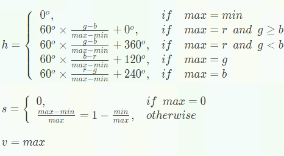

# Adjust_hue 算子开发设计方案

- #### 文档基本信息

| 算子名称     | Adjust_hue       |
| ----------- | -------------- |
| 编制人/日期   | zhangyicole/2021-12-22 |
| 审批人/日期   |                |

- #### 修改记录

| 修订人 | 修订日期   | 修订描述 |
| ------ | ---------- | -------- |
| zhangyicole    | 2021-12-22 | 首次提交 |

- #### 内容描述

本文档为`Adjust_hue`算子的设计文档，包括需求分析、接口设计、方案设计、性能优化记录和方案实施部分。

- #### 算子需求 checklist

* 算子接口描述
* 功能描述
* 框架版本 + 对应源码路径
* 需求对应网络
* 网络中用到的规模
* 是否需要支持原位
* 是否需要支持 stride 机制
* 框架单元测试阈值指标（可选）

## 1 需求分析

### 1.1 算子需求分析

| 算子功能简介                                                                 | 调整单个或者多个RGB图片的色调                                                                                                                                                                                                |
| ---------------------------------------------------------------------------- | ------------------------------------------------------------------------------------------------------------------------------------------------------------------------------------------------------------------------------------------ |
| 需求来源                                                                     | TensorFlow                                                                                                                                                                                                                    |
| 应用网络                                                                     | centerNet                                                                                                                                                                                                                               |
| 输入数据类型                                                                 | half, float                                                                                                                                                                                                                                |
| 输入 Shape                                                                   | input1: [batches, hi, wi, channels]                                                                                                                                                                                  |
| 输入 Layout                                                                  | input1: NHWC                                                                                                                                                                                                                |
| 输出数据类型                                                                 | half, float                                                                                                                                                                                                                             |
| 输出 Shape                                                                   | [batches, ho, wo, channels]                                                                                                                                                                                                                |
| 输出 Layout                                                                  | NHWC                                                                                                                                                                                                                                       |


### 1.2 算子功能和应用场景描述

功能：adjust_hue算子的功能是调整单个或者多个RGB图像的色调，对标tf.image.adjust_hue算子,其本质为rgb转换hsv，修改h值后，再将新的hsv转换为rgb的一个过程

例如: 对于某张RGB图片假定某个像素点RGB值为(1, 2, 3), delta为0.2，x的最后计算结果为(2.3999996, 1, 3)

应用场景：centerNet网络等

### 1.3 算子输入输出参数要求

| 参数        | 语义 | 类型（输入/输出） | 支持类型    | 物理布局 | 规模限制 |
| ----------- | ---- | ----------------- | ----------- | -------- | -------- |
| input       |  输入的形状为NHWC的图像张量    | 输入              | half, float | NHWC     | 无       |
| n           |   输入的图像张量形状中的N参数   | 输入              | int32       |  /       | 无       |
| h           |   输入的图像张量形状中的H参数   | 输入              | int32       |  /       | 无       |
| w           |   输入的图像张量形状中的W参数   | 输入              | int32       |  /       | 无       |
| c           |   输入的图像张量形状中的C参数   | 输入              | int32       |  /       | 无       |
| delta       |   存放图像色度的修改值   | 输入              | half, float |  /       | 无       |
| output      |   输出的形状为NHWC的图像张量  | 输出              | half, float | NHWC     | 无       |

### 1.4 算子限制

| 限制类型     | 详细说明                                                                                                        |
| ------------ | --------------------------------------------------------------------------------------------------------------- |
| 数据类型限制 | input 和 output 必须同时为同一数据类型                                                                            |
| 数据范围限制 | half 类型下，数据需满足[0，255]范围，float类型下， 数据需满足[0, 65535]范围，delta值的范围为[-1, 1]，否则有精度问题                                                             |
| 原位限制     | 不支持原位                                                                                                      |
| stride 限制  | 不支持 stride 机制                                                                                              |

### 1.5 验收标准

#### 1.5.1 精度验收标准

按照[精度验收标准](../../../MLU-OPS-Accuracy-Acceptance-Standard.md#精度验收标准)的要求明确本算子的精度标准。

本算子属于复合类算子，验收标准为 diff1 <= 3e-3 && diff2 <= 3e-3 。

#### 1.5.2 性能验收标准

见 [MLU-OPS 性能验收标准](../../../MLU-OPS-Performance-Acceptance-Standard.md)。

## 2 算子接口设计

### 2.1 参考接口

- TensorFlow

TensorFlow接口：
```python
tf.image.adjust_hue(images, delta, name = None)
```

### 2.2 接口设计

```python
mluopAdjust_hue(input, delta, output)
```

## 3 实现方案设计

### 3.1 实现方案

对图像每个像素点按照如下公式进行计算:

1. 将rgb转为hsv格式：

参考公式：


注意：在实际代码实现中我们将角度转换为了数值进行计算如360°转换为6，240°转换为4， 120°转换为2等。

代码实现逻辑为：

```python
#rgb最大值, 在实际的实现中min max均为向量。
M = max(r,g,b)
#rgb最小值
m = min(r,g,b)
#Chrome色度
chroma = M - m
#norm = 1/((M-m)*6) => 1/(chroma*6)
norm = 1/(chroma*6)
#计算h值
if M == r:
    h = (g - b) * norm
elif M == g:
    h = (b - r) * norm + 2.0 / 6.0
elif M == b:
    h = (r - g) * norm + 4.0 / 6.0
#如果最小值是0， 那么r g b都为0，所以此时h 也为0. 
if m <= 0.0:
    h = 0
#h为负值的情况为 g - b 存在小于0的情况因此需要将h转为正值且范围在[0,1]
if h < 0.0:
    h = h + 1
#计算s值
if M > 0.0:
    s = chroma / M
else:
    s = 0.0
#计算v值
v = M 
```

2. 将delta值应用在转化后的h值上
```math
h = h + delta
```

注意：delta的值的区间为[-1,1],并且h值的范围是[0,1]，那么就需要确保更新后的h值为正值且小于1。由于后续采用了激活表增加了对负值的计算所以此处无需再对区间进行转换。

1. 将hsv转为rgb格式：

参考公式：




注意：这里同样在实际代码实现中我们将[0°,360°] 转换为了[0,6]的区间上方便计算。
代码实现逻辑为：

```python
c = s * v
m = v - c
dh = h * 6
h_category = math.floor(dh)
while dh <= 0:
    dh += 2
while dh >= 2:
    dh -= 2
x = c * (1 - abs(dh - 1))

r, g, b = [
    (c, x, 0),
    (x, c, 0),
    (0, c, x),
    (0, x, c),
    (x, 0, c),
    (c, 0, x),
][int(h_category % 6)]

r += m
g += m
b += m

#如上计算为了提高性能对于rgb的判断排列采用了激活表完成。 
```

本算子复杂点在于有许多条件判断的需求。在向量化上的难度加大。
### 3.2 伪代码实现
RGB -> HSV

```python
def rgb2hsv(
    self,
    aux_full: ty.Buffer("nram"),  # type: ignore
    h: ty.Buffer("nram"),  # type: ignore
    s: ty.Buffer("nram"),  # type: ignore
    v: ty.Buffer("nram"),  # type: ignore
    r: ty.Buffer("nram"),  # type: ignore
    g: ty.Buffer("nram"),  # type: ignore
    b: ty.Buffer("nram"),  # type: ignore
    aux: ty.Buffer("nram"),  # type: ignore
    aux1: ty.Buffer("nram"),  # type: ignore
    aux2: ty.Buffer("nram"),  # type: ignore
    r_hw: ty.int32,
):
    # get max, min, mid
    # use v to save max
    # use s to save min
    tcp.maximum(v, r, g)
    tcp.minimum(s, r, g)
    tcp.maximum(v, v, b)
    tcp.minimum(s, s, b)
    tcp.equal(aux, v, s)
    tcp.subtract(h, v, s)
    tcp.add(h, h, aux)
    if self.dtype == "float16":
        tcp.type_convert(aux[: 2 * r_hw].reinterpret_cast("float32"), h, 0)
        tcp.reciprocal(
            aux[: 2 * r_hw].reinterpret_cast("float32"),
            aux[: 2 * r_hw].reinterpret_cast("float32"),
            mode="hp",
        )
        tcp.type_convert(h, aux[: 2 * r_hw].reinterpret_cast("float32"), 0, "rd")
    else:
        tcp.reciprocal(h, h, mode="hp")
    tcp.subtract(aux, g, b)  # g-b
    tcp.subtract(aux1, b, r)  # b-r
    tcp.subtract(aux2, r, g)  # r-g
    tcp.multiply(aux_full, aux_full, h)
    # r==max
    tcp.equal(r, r, v)
    # g==max
    tcp.equal(g, g, v)
    # b==max
    tcp.logic_or(b, r, g)
    tcp.subtract(g, b, r)
    tcp.logic_not(b, b)
    tcp.add(aux1, aux1, 2)
    tcp.add(aux2, aux2, 4)
    tcp.multiply(r, r, aux)
    tcp.multiply(g, g, aux1)
    tcp.multiply(b, b, aux2)
    tcp.add(h, r, g)
    tcp.add(h, h, b)

```
APPLY DELTA
```python
def add_delta(self, h: ty.Buffer("nram"), delta: ty.float16):  # type: ignore
    tcp.add(h, h, delta)
```
HSV TO RGB
```python
def hsv2rgb(
    self,
    h: ty.Buffer("nram"),  # type: ignore
    s: ty.Buffer("nram"),  # type: ignore
    v: ty.Buffer("nram"),  # type: ignore
    r: ty.Buffer("nram"),  # type: ignore
    g: ty.Buffer("nram"),  # type: ignore
    b: ty.Buffer("nram"),  # type: ignore
    aux: ty.Buffer("nram"),  # type: ignore
    aux1: ty.Buffer("nram"),  # type: ignore
    aux_int: ty.Buffer("nram"),  # type: ignore
):
    tcp.subtract(v, v, s)
    tcp.type_convert(aux_int, h, 0, "dn")
    tcp.type_convert(aux, aux_int, 0)
    tcp.type_convert(aux_int, h, 0, "tz")
    tcp.type_convert(aux1, aux_int, 0)
    tcp.lut_active(aux1, aux1, self.tab1_nram, self.const1_nram)
    tcp.subtract(h, h, aux1)
    tcp.abs(h, h)
    tcp.multiply(h, h, v)
    # aux:h_category
    # h:ratio
    # s:vmin
    # v:vmax-min
    # r
    tcp.lut_active(r, aux, self.tab2_nram, self.const1_nram)
    tcp.lut_active(aux1, aux, self.tab3_nram, self.const1_nram)
    tcp.multiply(r, r, v)
    tcp.multiply(aux1, aux1, h)
    tcp.add(r, r, aux1)
    # g
    tcp.lut_active(g, aux, self.tab4_nram, self.const1_nram)
    tcp.lut_active(aux1, aux, self.tab5_nram, self.const1_nram)
    tcp.multiply(g, g, v)
    tcp.multiply(aux1, aux1, h)
    tcp.add(g, g, aux1)
    # b
    tcp.lut_active(b, aux, self.tab6_nram, self.const1_nram)
    tcp.lut_active(aux1, aux, self.tab7_nram, self.const1_nram)
    tcp.multiply(b, b, v)
    tcp.multiply(aux1, aux1, h)
    tcp.add(b, b, aux1)

```

### 3.3 拆分(任务拆分，多核拆分)
以输入图片的行为单位拆分数据，每次处理整行数据。

通过nram的大小以及空间划分的逻辑计算出每个core上一次能够处理的pixel的最大数目limit_hw，根据图片的宽度width计算出每个core上一次能够处理图片行数per_height，per_height大于0时，per_height*width是一个core上一次实际处理的pixel数量。

 可能存在core上一次无法处理一行的情况。假设一个core一次能够处理的最大pixel数目为limit_hw，由于图像在width上的数据是连续的所以默认从height方向开始拆分，从而得到per_height。由于我们现在为一次per_height不能够完整处理一条width的情况，所以需要对于width进行二次拆分，对于width的拆分进行分批计算。

### 3.4 性能优化设计
使用自动流水来进行IO与计算时间的相互掩盖。

使用内存复减少内存开辟和提升内存利用率。

使用激活表对区间进行映射：

  由于h的区间应当为[0，1)，但是通过加一个正负delta会将h的取值范围改变，所以增加一个激活表来减少计算步骤，实际的应用是将所有h可能会因为计算带来的区间偏差通过一个激活表来进行对原有区间值的一个映射将新的h值映射到应该有的一个区间值上。
  
使用激活表对判断流进行激活：

  在hsv转rgb的过程中，有一个switch的操作，这个很难用向量方式实现。不过通过公式可以发现，根据switch的结果只是影响r，g，b对应c，x，0的顺序。对于r，可以得到一个r关于x的卷积滤波张量数组r_x=[0,1,0,0,1,0]和r关于c的卷积滤波张量r_c[1,0,0,0,0,1],可以根据h查找对应的卷积滤波张量，例如当h等于3时，可以查表找到对应卷积滤波张量是r_x[3]=0,r_c[3]=0,r=r_x[3]*x+r_c[3]*c=0。在mlu上，可以使用激活的方式来实现查表操作，需要提前配置6张激活表，得到r，g，b关于x，c的卷积滤波张量，用向量乘和向量加得到正确的结果。
  
简约部分计算步骤保证精度的同时，减少计算：

  1.计算h的过程中，h的计算结果要归一化，h的范围是[0,1)，在后续的hsv转rgb的过程中又需要将h乘以6，因此可以在计算h时省略归一化以及后面乘以6的操作。但是随之带来的问题就是在hsv转rgb的过程中h的值被放大了6倍，所以需要将delta值乘以6同比放大。

  2.计算h的过程中，h在做归一化的时候，按照计算逻辑，计算的结果一开始的范围是[-1/6,5/6],当h小于0时，h需要加1。在1.中提到h已经不再除以6，那么在hsv转rgb过程中，输入的h范围是[-1,5]，在后面根据h所在范围计算rgb，使用先前叙述的区间激活表可以省去原计算公式中判断h是否小于0，如果小于0则将h加1的步骤。

### 3.5 可维护性设计

1、对每一个函数命名变量命名都有充分的注释。

2、对算子进行模块化设计与拆分，确保模块具有复用性。

### 3.6 测试用例设计

根据需要进行补充。详见算子测试文件。


## 4 算子性能优化记录

### 4.1 当前存在问题的规模说明

| 提交日期  | 问题规模 | 问题描述 | 是否已修复 |
| --------- | -------- | -------- | ---------- |
|           |          |          |            |

### 4.2 已经过优化的规模说明

| 提交日期  | 修复规模 | 修复问题 |
| --------- | -------- | -------- |
|           |          |          |

## 5 方案实施

### 5.1 开发测试计划

- 2021.12.23 算子入库

### 5.2 风险分析

暂无。
