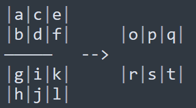

# BANGPy LogSumExp 算子开发设计方案

- #### 文档基本信息

| 算子名称     | LogSumExp              |
| ----------- | -------------- |
| 编制人/日期  | testouya/2022-5-18 |
| 审批人/日期  |              |

- #### 修改记录

| 修订人           | 修订日期    | 修订描述 |
| --------------- | ---------- | ------- |
| testouya  | 2022-5-18 | 首次提交 |

- #### 内容描述

本文档为 `LogSumExp` 算子的设计文档，包括需求分析、接口设计、方案设计、性能优化记录和方案实施部分。

## 1 需求分析

### 1.1 算子需求分析

| 算子功能简介               | 对张量计算所有子向量的所有分量的指数和的自然对数                  |
| ------------------------ | ----------------------------------------|
| 需求来源                  | 为bangpy-ops提供算子demo 
| 应用网络                  |                                  |
| 输入数据类型               | 支持float和half                             |
| 输入 Shape                | input.shape = [S0,S1,...,Sn-1]，input为 n 维张量，无长度限制|
| 输入 Layout               | input: ARRAY           |
| 输出数据类型               | float,half                              |
| 输出 Shape                | 根据输入的keepdim参数，可能为 n-1维张量或n维张量|
| 输出 Layout               | ARRAY                                    |

### 1.2 算子功能和应用场景描述

功能：对多维张量按照指定维度序号，拆分出子张量（t1,t2,t3...），对每个子子张量的所有分量，计算以e为底的指数的和的自然对数，其公式为logsumexp(t)=log∑exp(ti)。其中t为输入张量，ti为它的第i个分量，exp为以e为底的指数运算，∑为求和，log为求自然对数。

如果一个张量x, 维度是 [2, 3, 4]
如果要在第二个维度处理子张量，
第i, j 个子张量为
t = [
x[i, 0, j], 
x[i, 1, j], 
x[i, 2, j] 
]


例如：
```python

intput = tensor([[-0.8576,  0.6675, -2.2474],
        [-3.6767,  1.0610, -1.7070],
        [ 1.2433, -0.2909, -1.1211]])

output = logsumexp(input, 1)

#output: tensor([1.4907, 1.0593, 1.5696])
```


### 1.3 算子输入输出参数要求

| 参数   | 语义                  | 类型（输入/输出）| 支持类型     | 物理布局 | 规模限制      |
| ------ | --------------------- | -------------    | -----------  | ------   | --------      |
| input | 输入Tensor | 输入     |  float,half           | ARRAY        |  无      | --------      |
| dim | 要计算的维度 | 输入     |  int           | --------        |  无      | --------      |
| keepdim | 是否保留维度 | 输入     |  bool           | --------        |  无      | --------      |
| output | 输出Tensor | 输出     |  float,half           | ARRAY        |  无      | --------      |

### 1.4 算子限制

| 限制类型       | 详细说明                    |
| ------------   | -----------------------     |
| 数据类型限制   | float,half|
| 布局限制       | 仅支持ARRAY的layout         |
| 规模限制       | 无                           |

### 1.5 验收标准

#### 1.5.1 精度验收标准

本算子属于 `算术` 类算子，验收标准为 diff3=3e-3。

#### 1.5.2 性能验收标准


## 2 算子接口设计

### 2.1 参考接口

- pytorch

```python
torch.logsumexp(input, dim, keepdim)
#input： 输入张量，多维
#dim： 要计算的维度
#keepdim：计算结果是否保持当前维度
```

### 2.2 接口设计

```python
logsumexp(input, dim, keepdim)
#input： 输入张量，多维
#dim： 要计算的维度
#keepdim：计算结果是否保持当前维度
```

## 3 实现方案设计

### 3.1 实现方案

1 将输入数据压平后，传入mlu，将数据平均分配在多核中。

2 根据输入参数dim，将张量reshape成二维数组，比如张量的维度是 dims = [2, 2, 3, 1]，dim为1，
那么，二维数组高度就是 2 * 2，宽度是 3 * 1，定义 dim_len 为 dims[1]，也就是 2



将dim_len个元素组成一个一维子张量[a, b]，对它计算
o = log(exp(a) + exp(b))
p = log(exp(c) + exp(d))
q = log(exp(e) + exp(f))
...

计算过程参见上图。右边为计算结果。

3 检查一下dim_len是不是超过了nram的大小，如果超过了，跳转到4，否则，跳转到6

4 将该子张量的部分数据拷贝到nram中，计算logsumexp，缓存，然后再拷贝下一段，直到一个子张量计算完毕

5 子张量可能很长，需要多个核才能存储，某个核可能只会计算一个子张量的前半部分，中间，或者后半部分。将没有计算完的结果缓存到一个gram数组中，跳到8

6 将若干子张量拷贝到nram中，计算长度

7 某些子张量可能跨越了核，将这部分数据缓存到一个gram数组

8 统一处理，将gram缓存数组中的数据拼接起来

9 拷贝回cpu，执行reshape操作

### 3.2 伪代码实现

```python
sub_tensors = split_sub_tensor(input, dim)

for t in sub_tensors:
    #求子张量的值

    result = 0
    for item in t:
        result += exp(item)
    result = log(result)

    #将其保存到输出结果中
    _mlu_output.append(result)

#拷贝回cpu后，重新reshape
result = _mlu_output.reshape()

```

### 3.3 拆分(任务拆分，多核拆分)

采用的tasktype固定为UNION1，数据拆分到多核内计算。

### 3.4 性能优化设计


### 3.5 可维护性设计


### 3.6 测试用例设计


### 3.7 算子防呆检查

| 测试点                       | 验收标准 | 测试结果（出错信息）   |
| -----------------------------| -------- | -------------------- |
| 输入维度数值超出输入张量维度   |正常报错  |     通过               |

## 4 算子性能优化记录

### 4.1 当前存在问题的规模说明

| 提交日期  | 问题规模 | 问题描述 | 是否已修复 |
| --------- | -------- | -------- | ---------- |
|           |          |          |            |

### 4.2 已经过优化的规模说明

| 提交日期  | 修复规模 | 修复问题 |
| --------- | -------- | -------- |
|           |          |          |

## 5 方案实施

### 5.1 开发测试计划

2022.6.30 算子入库

### 5.2 风险分析

暂无。