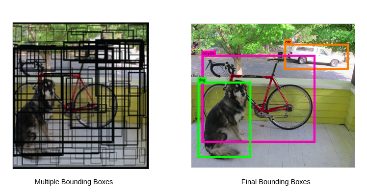

# Nms 算子开发设计方案

- #### 文档基本信息

| 算子名称     | Nms              |
| ----------- | ---------------- |
| 编制人/日期   | AIYoungcino/2021-12-28 |
| 审批人/日期   |                  |

- #### 修改记录

| 修订人  | 修订日期    | 修订描述   |
| ------ | ---------- | -------- |
| AIYoungcino  | 2021-12-28 | 首次提交  |

- #### 内容描述

本文档为`Nms`算子的设计文档，包括需求分析、接口设计、方案设计、性能优化记录和方案实施部分。

- #### 算子需求 checklist

* 算子接口描述
* 功能描述
* 框架版本 + 对应源码路径
* 需求对应网络
* 网络中用到的规模
* 是否需要支持原位
* 是否需要支持 stride 机制
* 框架单元测试阈值指标（可选）

## 1 需求分析

### 1.1 算子需求分析

Nms及其变体在有锚框目标检测算法中必不可少。

| 算子功能简介      | 在特征图中从许多重叠边界框中筛选出若干边界框      |
| --------------- | ----------------------------------------- |
| 需求来源         | PyTorch/TensorFlow/...                    |
| 应用网络         | Faster RCNN/SSD/YOLOv3，v4，v5/...         |
| 输入数据类型      | half，float，int                           |
| 输入 Shape      | input1: gdram_score[input_strde,]; input2: input_score[input_strde,]; input3: input_box[4,input_stride]; input4: num_boxes，input5: max_output_size，input6: iou_threshold，input7: score_threshold  |
| 输入 Layout     |  ARRAY                                     |
| 输出数据类型     | half.                                      |
| 输出 Shape      | [max_output_size，5]                       |
| 输出 Layout     | Array                                      |


### 1.2 算子功能和应用场景描述

功能：Nms算子能够根据边界框得分和IoU阈值对候选框进行筛选，获取检测对象的最佳边界框，该算子对标tf.image.non_max_suppression算子。
效果图：


应用场景：Faster RCNN/SSD/YOLOv3，v4，v5等目标检测网络。

### 1.3 算子输入输出参数要求

| 参数              |       语义                     | 类型（输入/输出） | 支持类型    | 物理布局 | 规模限制 |
| ---------------- | ------------------------------ | -------------- | ---------- | ------ | ------- |
| gdram_score      | 存放输入的待筛选边界框score的张量   | 输入           | half       |  /      | 无      |
| input_score      | 存放输入的待筛选边界框score的张量   | 输入           | half       |  /      | 无      |
| input_box        | 存放待筛选边界框坐标的张量          | 输入          | half        |  /      | 无     |
| num_boxes        | 候选框的数量                     | 输入           | int32       |  /      | 无     |
| max_output_size  | 根据概率排序选择保留概率最高的边界框个数  | 输入       | half, float |  /      | 无     |
| iou_threshold    | iou阈值                             | 输入       | float32     | /       | 无     |
| score_threshold  | 候选框得分阈值                        | 输入       | float32     |  /      | 无     |
| output           | Nms计算结果存放的张量                  | 输出       | half        |  /      | 无     |

### 1.4 算子限制

| 限制类型     | 详细说明                                          |
| ----------- | ------------------------------------------------ |
| 数据类型限制  | input 和 output 必须同时为同一数据类型               |
| 数据范围限制  | half 类型下，数据需满足[0，255]范围，否则有精度问题     |
| 原位限制      | 不支持原位                                        |
| stride 限制  | 不支持 stride 机制                                |

### 1.5 验收标准

#### 1.5.1 精度验收标准

按照[精度验收标准](../../../MLU-OPS-Accuracy-Acceptance-Standard.md)的要求明确本算子的精度标准。

本算子属于复合类算子，验收标准为 diff1 <= 3e-3 && diff2 <= 3e-3 。

#### 1.5.2 性能验收标准

见 [MLU-OPS 性能验收标准](../../../MLU-OPS-Performance-Acceptance-Standard.md)。

## 2 算子接口设计

### 2.1 参考接口

- TensorFlow

TensorFlow接口：
```python
tf.image.non_max_suppression(
    boxes，scores，max_output_size，iou_threshold=0.5，
    score_threshold=float('-inf')，name=None
)
```

- PyTorch

PyTorch接口：
```python
torchvision.ops.nms(boxes: torch.Tensor，scores: torch.Tensor，iou_threshold: float) → torch.Tensor
```

### 2.2 接口设计

```python
mluopNms(gdram_score, input_score, input_box, num_boxes, max_output_size, iou_threshold, score_threshold, output)
```

## 3 实现方案设计

### 3.1 实现方案
Nms模块用一个Python类来定义，用该类的成员变量进行子模块间参数传递实现仅示例输入数据在NRAM上的情况，因此准备阶段不需要做片上空间划分和多核拆分，只需要声明 Nms 计算所需的中间变量。Nms的实现包括搜索最大值、保存边界框和IoU筛选三部分。每次循环，首先搜索当前score最大的候选边界框，其次保存该边界框，并将该边界框的score置为0，然后计算该边界框与其余边界框(score>0)的 IoU，并将IoU ≥ tiou的边界框的score置为0。该循环的退出条件为，找到的框的个数达到max_output，或者搜索到的最大score小于tscore。
1. 搜索出score最大的候选边界框和对应的索引。
代码实现逻辑为：
```python
def nms_compute_body(self，output_box_num，output，input_score，input_box，buffer_nram):

  ...
    #TODO： 搜索最大值
    def score_sort(self，input_offset，Nms_loop，remain，remain_pad):
        """Sort the boxes' score."""
        with self.tcp.if_scope(Nms_loop > 0):
            with self.tcp.for_range(0，Nms_loop) as i:
                offset = i * self.max_seg_size
                max_index = self.score_sort_each_loop(
                    input_offset，offset，self.max_seg_size，self.max_seg_size
                )

        offset = Nms_loop * self.max_seg_size
        with self.tcp.if_scope(remain > 0):
            max_index = self.score_sort_each_loop(
                input_offset，offset，remain，remain_pad
            )
        return max_index
```
2. 保存边界框
代码实现逻辑为：将搜索出来的当前score最大的候选边界框拷贝到指定位置，并将当前位置上该边界框的score置为0。为了提高处理效率，不需要逐次保存搜索出的score最大的边界框，而是将每次搜索到的score最大的边界框先保存到nram_save空间，当保存到一定数量的边界框之后再批量拷贝到指定输出位置。

3. IoU筛选
计算当前score最大的边界框与其余边界框的交并比IoU，然后将IoU大于等于阈值的边界框的score置为0，相当于移除边界框。
代码实现逻辑为：
```python
#计算得到相交部分的面积:area_I=(inter_x2−inter_x1)*(inter_y2−inter_y1)
#alignment:参与NmsIoU计算的框的个数
#用当前score最大的边界框A的x1坐标值填充inter_y1张量
tcp.assign(self.inter_y1[:alignment], max_box[1])
#获取边界框A与其他候选框相交部分的左上角横坐标值，存储到inter_x1张量
tcp.maximum(self.inter_x1[:alignment], self.x1[:alignmemt]， self.inter_y1[:alignment])
#用边界框A的x2坐标值填充inter_y2张量
tcp.assign(self.inter_y2[:alignment], max_box[3])
#获取边界框A与其他框相交部分的左上角横坐标值，存储到inter_x2张量
tcp.minimum(self.inter_x2[:alignment], self.x2[:alignmemt], self.inter_y2[:alignment])
#计算inter_x2−inter_x1
tcp.subtract(self.inter_x1[:alignment], self.inter_x2[:alignmemt], self.inter_x1[:alignmemt])
#相交部分的宽度inter_w=(inter_x2−inter_x1)>0?(inter_x2−inter_x1) : 0
#复用inter_x1张量存储inter_w
tcp.relu(self.inter_x1[:alignment], self.inter_x1[:alignment])
#用边界框A的y1坐标值填充inter_x2张量
tcp.assign(self.inter_x2[:alignment], max_box[2])
#获取边界框A与其他框相交部分的左上角纵坐标值，存储到inter_y1张量
tcp.maximum(self.inter_y1[:alignment], self.y1[:alignmemt], self.inter_x2[:alignment])
#用边界框A的y2坐标值填充inter_x2张量
tcp.assign(self.inter_x2[:alignment], max_box[4])
#获取边界框A与其他框相交部分的左上角纵坐标值，存储到inter_y2张量
tcp.minimum(self.inter_y2[:alignment], self.y2[:alignmemt], self.inter_x2[:alignment])
#计算inter_y2−inter_y1
tcp.subtract(self.inter_y1[:alignment], self.inter_y2[:alignmemt], self.inter_y1[:alignmemt])
#相交部分的高度inter_h=(inter_y2−inter_y1)>0?(inter_y2−inter_y1):0
#复用inter_y1张量存储inter_h
tcp.relu(self.inter_y1[:alignment], self.inter_y1[:alignment])
#相交部分的面积area_I=inter_w * inter_h
tcp.multiply(self.inter_x1[:alignment], self.inter_x1[:alignment], self.inter_y1[:alignment])
```

```python
#计算每个候选框的面积:area=(x2−x1)*(y2−y1):
#计算x2−x1，将结果存储到inter_y1张量
tcp.subtract(self.inter_y1[:alignment], self.x2[:alignmemt], self.x1[:alignment])
#计算y2−y1，将结果存储到inter_y2张量
tcp.subtract(self.inter_y2[:alignment], self.y2[:alignmemt], self.y1[:alignment])
#area=(x2−x1)*(y2−y1)=inter_y1*inter_y2
#area的计算结果存储到inter_x2张量
tcp.multiply(self.inter_x2[:alignment], self.inter_y1[:alignment], self.inter_y2[:alignment])
```

```python
#计算得到相并部分的面积area_U: area+max_area−area_I:
#max_area:边界框A的面积
#使用max_area填充inter_y1张量
tcp.assign(self.inter_y1[:alignment], max_area)
#计算area+max_area，将结果存储到inter_x2张量
tcp.add(self.inter_x2[:alignment], self.inter_x2[:alignmemt], self.inter_y1[:alignmemt])
#计算inter_x2−area_I，将结果存储到inter_x2张量
tcp.subtract(self.inter_x2[:alignment], self.inter_x2[:alignmemt], self.iou_threshold)
```
```python
#如果IoU大于等于阈值(即area_U*t_iou>area_I)，则将相应候选框的score置为0
#计算area_U*t_iou，将结果存储到interx_2张量
tcp.multiply(self.inter_x2[:alignment], self.inter_x2[:alignmemt], self.iou_threshold)
tcp.greater(self.inter_x1[:alignment], self.inter_x2[:alignmemt], self.inter_x1[:alignmemt])
tcp.multiply(score[:alignment], score[:alignmemt], self.inter_x1[:alignmemt])
# update the score
  max_box[0] = zero_scalar
  max_index = score_sort(input_offset, Nms_loop, remain, remain_pad)
```


### 3.2 伪代码实现
score_max->iou_filter
### 3.3 拆分(任务拆分，多核拆分)
片上空间划分
  由于片上存储空间有限，需要对存储空间进行划分，通过分时复用来提高不同规模数据下NRAM的使用效率，提高处理速度。当输入数据存放在GDRAM或SRAM上时，数据需要先拷贝到NRAM上才能执行计算; 当输入数据存放在NRAM 上时，则无需拷贝可以直接执行计算操作。变量MODE用来表示目前输入的候选边界框数据是否可直接供计算使用，方便后续程序做分支判断。MODE为1，表示不需要加载数据可以直接计算。此时输入数据要满足三个条件，首先输入数据必须存放在NRAM上，其次输入数据满足向量计算的对齐要求，最后输入计算规模满足计算过程中的中间变量空间大小限制。当输入数据不满足这三个条件时，MODE为0。此时数据尚未完成调度准备，需要在后续的代码中完成数据拷贝、对齐等操作。为了节省 buffer空间，考虑空间复用后，Nms计算过程中至少需要4块NRAM上的临时空间来保存中间变量，包括 inter_x1、inter_y1、inter_x2、inter_y2。需要说明的是，这些变量在程序的不同阶段含义不同，在开发的过程中要清晰地理解变量的上下文含义，避免使用冲突。

多核拆分
  多核拆分将任务拆分到mlu内部的多个计算核上并行执行。Nms模块需要根据输入数据存放的位置(src)来进行多核拆分。当src=NRAM时，Nms模块只支持单核模式，即每个计算核负责计算分类任务中一个类别的Nms过程，用户可根据需求在模块外按类进行拆分。当src=GDRAM/SRAM时，Nms模块支持按数据块进行多核拆分，即一个类的Nms过程拆分到多个核上进行计算。多核拆分的基本思想是，每个计算核上分到的边界框的数量相差不超过1，即尽可能地将数据平均分配到各个计算核上。数据平均分配到计算核上之后，需要做数据对齐，具体的对齐方法是在数据后补0将其对齐到目标长度。

### 3.4 性能优化设计

1. 使用内存复用减少内存开辟并提升内存利用率。

2. 坐标向量化:为了使用张量计算原语计算候选框与其他框的面积，将score最大的边界框的标量坐标使用assign原语填充到张量中。

3. 比较向量化:IoU阈值判断，使用greater原语实现了向量间的对位比较，当greater函数的输入i0大于输入i1时，结果为1，否则结果为0。考虑到后续处理，将IoU判断条件设为area_U × tiou > area_I，即IoU小于阈值时，比较结果为1，否则结果为0。

4. score置零向量化: 边界框score置零，用greater函数的比较结果与边界框的score相乘，从而将IoU大于等于阈值的框的score置为0。

### 3.5 可维护性设计

1、对每一个函数命名变量命名都有充分的注释。

2、对算子进行模块化设计与拆分，确保模块具有复用性。

### 3.6 测试用例设计

根据需要进行补充。详见算子测试文件。


## 4 算子性能优化记录

### 4.1 当前存在问题的规模说明

| 提交日期  | 问题规模 | 问题描述 | 是否已修复 |
| --------- | -------- | -------- | ---------- |
|           |          |          |            |

### 4.2 已经过优化的规模说明

| 提交日期  | 修复规模 | 修复问题 |
| --------- | -------- | -------- |
|           |          |          |

## 5 方案实施

### 5.1 开发测试计划

- 2021.12.23 算子入库

### 5.2 风险分析

暂无。
